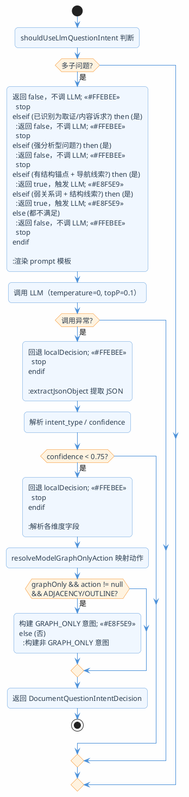
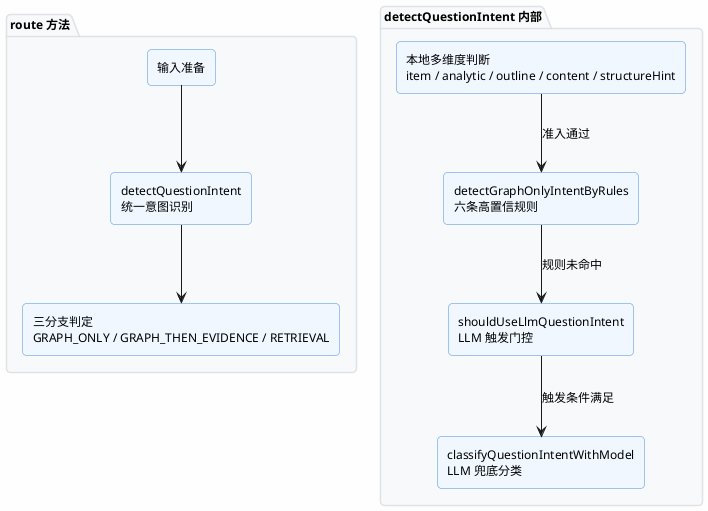

import VipInline from '@site/src/components/VipInline';

# LLM 兜底分类与意图解析

上一篇讲了统一意图识别的本地规则引擎，六条高置信规则能覆盖大部分明确的结构查询问题。但自然语言的表达方式千变万化，总有一些模糊表达是规则穷举不了的，比如"这一块下面还有什么"、"和前一部分是什么关系"。

这一篇我们来看：什么时候会触发 LLM 兜底？LLM 是怎么做分类的？分类结果又是怎么解析和校验的？

## shouldUseLlmQuestionIntent：要不要调 LLM？

不是所有问题都值得多调一次模型。LLM 兜底只服务于"有结构导航线索但本地规则搞不定"的模糊场景，普通内容问答不应该为此多等一次网络请求。

```java
private boolean shouldUseLlmQuestionIntent(String question,
                                           List<String> subQuestions,
                                           DocumentQuestionIntentDecision localDecision) {
    // 多子问题通常需要混合检索逐个取证，LLM 在这里把它改成 GRAPH_ONLY 的收益很低。
    boolean hasMultipleSubQuestions = subQuestions != null && subQuestions.size() > 1;
    if (hasMultipleSubQuestions) {
        return false;
    }
    // 本地已经识别成步骤/条目或正文内容诉求时，优先走取证/检索，不再让模型重新猜结构图直答。
    boolean localDecisionAlreadyEvidenceBased = localDecision.itemLookup() || localDecision.contentQuestion();
    if (localDecisionAlreadyEvidenceBased) {
        return false;
    }
    // 强分析问题已经很明确需要内容解释，不需要为了图直答再额外调用模型。
    boolean localDecisionIsStrongAnalytic = localDecision.analytic() && looksGraphOnlyBlockingAnalyticQuestion(question);
    if (localDecisionIsStrongAnalytic) {
        return false;
    }
    // 有结构锚点且有方向/层级动作时，说明本地规则可能漏掉了自然表达，值得让 LLM 做兜底。
    boolean hasStructuralNavigationClue = hasGraphOnlyAnchor(question) && hasGraphOnlyNavigationCue(question);
    if (hasStructuralNavigationClue) {
        return true;
    }
    // "关系/关联"这类弱分析词如果伴随结构线索，可能是在问章节关系，也值得让 LLM 裁决。
    boolean weakRelationWithStructureHint = containsAny(question, ANALYTIC_WEAK_RELATION_HINTS)
        && localDecision.structureHint();
    return weakRelationWithStructureHint;
}
```

整个方法的逻辑可以概括为：**先排除不需要的，再确认需要的**。

### 三个排除条件

前三个 `if` 是排除逻辑，命中任何一个都直接返回 false：

| 排除条件 | 原因 |
|----------|------|
| 多子问题 | 多子问题走混合检索逐个取证，LLM 把它改成图直答收益很低 |
| 已识别为取证/内容诉求 | 本地已经有了明确结论，不需要模型再猜一次 |
| 强分析型问题 | "为什么/原因/区别"这类问题一定需要正文解释，图直答回答不了 |

### 两个触发条件

排除完之后，只有满足以下任一条件才会触发 LLM：

**条件一：有结构锚点 + 有导航线索**

```java
boolean hasStructuralNavigationClue = hasGraphOnlyAnchor(question) && hasGraphOnlyNavigationCue(question);
```

这说明问题里同时出现了"结构锚点"和"导航动作"，但本地规则没能命中（可能是因为表达方式比较自然，不在规则的关键词列表里）。比如"这一块往后还有啥内容"——有指代锚点（"这一块"）、有方向词（"往后"），但不在规则的精确匹配范围内。

来看 `hasGraphOnlyAnchor` 和 `hasGraphOnlyNavigationCue` 的实现：

```java
private boolean hasGraphOnlyAnchor(String question) {
    // "3.2 / 4.1.1"这类章节号是最强锚点。
    if (SECTION_CODE_PATTERN.matcher(question).find()) {
        return true;
    }
    // "第 3 章 / 第 2 节 / 第 4 小节"同样是明确的章节锚点。
    if (CHINESE_SECTION_REFERENCE_PATTERN.matcher(question).find()) {
        return true;
    }
    // "某某章节"用引号包住时，通常是在提供标题锚点。
    if (QUOTED_TEXT_PATTERN.matcher(question).find()) {
        return true;
    }
    // 明确出现章节、标题、目录、部分等结构对象，也足以触发结构意图判断。
    if (containsAny(question, GRAPH_ONLY_STRUCTURE_OBJECT_HINTS)) {
        return true;
    }
    // "这个/该/它/刚才"只有配合方向或层级动作才会进入 LLM，这里只标记它具备指代锚点。
    return containsAny(question, GRAPH_ONLY_PRONOUN_ANCHOR_HINTS);
}
```

```java
private boolean hasGraphOnlyNavigationCue(String question) {
    // 相邻关系动作覆盖"前面/后面/之前/之后/相邻/位置/顺序"等表达。
    if (containsAny(question, GRAPH_ONLY_DIRECTION_HINTS)) {
        return true;
    }
    // 目录展开动作覆盖"下面/下级/子章节/展开/包含哪些/有哪些"等表达。
    return containsAny(question, GRAPH_ONLY_OUTLINE_ACTION_HINTS);
}
```

`hasGraphOnlyAnchor` 检查五种锚点（章节编号、中文章节引用、引号标题、结构对象词、指代词），`hasGraphOnlyNavigationCue` 检查两种动作（方向词、展开动作词）。两者同时存在，就说明有结构导航意图，值得让 LLM 做最终裁决。

**条件二：弱关系词 + 结构线索**

```java
boolean weakRelationWithStructureHint = containsAny(question, ANALYTIC_WEAK_RELATION_HINTS)
    && localDecision.structureHint();
```

"关系/关联/联系/相关"这类词有歧义：可能是内容语义关系（"A 和 B 的关系"），也可能是章节结构关系（"这两节的关系"）。如果同时有结构线索，就让 LLM 来裁决到底是哪种。

## classifyQuestionIntentWithModel：调用 LLM 分类

触发条件满足后，进入 LLM 分类的实际调用。在看代码之前，先看看发给 LLM 的 prompt 模板长什么样——这决定了 LLM 要做什么、怎么输出。

### Prompt 模板：document-graph-only-intent

```text
你是企业文档问答系统的路由意图分类器。

你的任务只是在"进入执行器之前"判断当前问题的路由意图，尤其是是否适合直接查询文档结构图。
你不能回答用户问题，不能编造章节名称，不能根据文档内容推理答案。

请只返回一个合法 JSON 对象：
{
  "intent_type": "ADJACENCY",
  "action": "SECTION_ADJACENCY_LOOKUP",
  "graph_only": true,
  "analytic": false,
  "outline": false,
  "item_lookup": false,
  "content_qa": false,
  "structure_hint": true,
  "confidence": 0.9,
  "reason": "用户在询问目标章节的相邻章节"
}

可选 intent_type：
- ADJACENCY：询问上一节、下一节、前后章节、相邻章节、章节位置、所属父章节、目录中的前后关系。
- OUTLINE：询问某章节下面有哪些子章节、小节、目录展开、包含哪些章节。
- ITEM_LOOKUP：询问第几步、哪一步、哪一项、条目或步骤定位。
- CONTENT_QA：询问章节正文内容、要求、规定、流程、后续怎么做、讲了什么。
- ANALYTIC：询问为什么、原因、影响、区别、对比、分析、解释。
- UNKNOWN：无法稳定判断。

可选 action：
- SECTION_ADJACENCY_LOOKUP：仅当 intent_type 是 ADJACENCY 时使用。
- CHILD_SECTION_DESCEND：仅当 intent_type 是 OUTLINE 时使用。
- NONE：其它 intent_type 一律使用 NONE。

判定规则：
1. 只有 ADJACENCY 和 OUTLINE 可以设置 graph_only=true。
2. ITEM_LOOKUP、CONTENT_QA、ANALYTIC、UNKNOWN 必须设置 graph_only=false。
3. analytic 表示用户需要解释、原因、影响、区别、对比、理解、分析、推理。
4. outline 表示用户询问章节下面有哪些子章节、小节、目录展开、章节列表。
5. item_lookup 表示用户询问第几步、哪一步、哪一项、条目或步骤定位。
6. content_qa 表示用户询问正文内容、要求、规定、流程、后续怎么做、讲了什么。
7. structure_hint 表示问题里存在章节编号、章节标题、目录、上级/下级/前后位置等结构线索，
   可用于检索前辅助定位。
8. 如果用户问"后面是什么""接着这个是什么"但没有明确是章节、标题、目录位置，
   请根据语义判断；不确定就返回 UNKNOWN。
9. 如果用户问"后面有什么要求""下面有哪些步骤""后续怎么做"，
   这是正文或步骤证据问题，不是 graph_only。
10. 如果用户问"前后关系""相邻章节""目录位置""上下级关系"，
    这是结构导航问题，不要因为"关系"二字判成 ANALYTIC。
11. confidence 使用 0 到 1 的小数；不确定时低于 0.75。
12. 只返回 JSON，不要 Markdown，不要解释文本。
```

模板末尾会填入三个变量：

```text
原始问题：
{originalQuestion}

改写问题：
{rewrittenQuestion}

合并判断文本：
{routeText}
```

:::info Prompt 设计要点
这个 prompt 有几个关键设计：
1. **严格限定角色**：明确告诉模型"你只是分类器"，不能回答问题、不能编造章节名
2. **输出格式固定**：要求只返回 JSON，不要 Markdown 和解释文字，方便后续解析
3. **判定规则内置**：把本地规则的核心逻辑也写进了 prompt（比如规则 9、10），让 LLM 和本地规则保持一致的判断标准
4. **示例驱动**：给了 6 个典型示例覆盖各种 intent_type，帮助模型理解边界情况
5. **置信度约束**：明确要求"不确定时低于 0.75"，配合代码里的阈值控制形成双重保险
:::

模板里的示例覆盖了几个容易混淆的场景：

| 示例问题 | 判定结果 | 关键区分点 |
|----------|----------|-----------|
| "3.2 后面是哪一节" | ADJACENCY, graph_only=true | 答案目标是章节 |
| "3.2 后面有什么要求" | CONTENT_QA, graph_only=false | 答案目标是正文内容 |
| "这个章节下面有哪些小节" | OUTLINE, graph_only=true | 问子章节列表 |
| "这个章节下面有哪些处理步骤" | ITEM_LOOKUP, graph_only=false | 问步骤证据 |
| "为什么 3.2 后面要讲值班安排" | ANALYTIC, graph_only=false | 问原因解释 |
| "3.2 和 3.3 的前后关系" | ADJACENCY, graph_only=true | "关系"指结构位置关系 |

### 调用代码

了解了 prompt 之后，再看调用代码就很清晰了：

```java
private DocumentQuestionIntentDecision classifyQuestionIntentWithModel(String originalQuestion,
                                                                       String rewrittenQuestion,
                                                                       String routeText,
                                                                       DocumentQuestionIntentDecision localDecision) {
    try {
        // prompt 模板仍然复用 document-graph-only-intent，只是扩展为路由意图 JSON，避免新增第二次 LLM 调用。
        String prompt = promptTemplateService.render(PromptTemplateNames.DOCUMENT_GRAPH_ONLY_INTENT, Map.of(
            "originalQuestion", StrUtil.blankToDefault(originalQuestion, ""),
            "rewrittenQuestion", StrUtil.blankToDefault(rewrittenQuestion, ""),
            "routeText", StrUtil.blankToDefault(routeText, "")
        ));
        // document_question_intent 是 route 阶段的轻量分类标签；这里不传 traceRecorder，避免扩大 route 方法签名。
        String raw = observedChatModelService.callText(
            "document_question_intent",
            null,
            prompt,
            buildGraphOnlyIntentCallOptions(),
            null
        );
        // 模型输出必须解析成结构化结果，解析失败会回退 localDecision。
        DocumentQuestionIntentDecision decision = parseQuestionIntentResult(raw, localDecision);
        log.info("文档路由 LLM 兜底判断完成: graphOnly={}, action={}, analytic={}, outline={}, itemLookup={}, structureHint={}, confidence={}, source={}, reason={}, raw={}",
            decision.graphOnlyIntent().matched(),
            decision.graphOnlyIntent().action(),
            decision.analytic(),
            decision.outline(),
            decision.itemLookup(),
            decision.structureHint(),
            decision.confidence(),
            decision.source(),
            decision.reason(),
            StrUtil.blankToDefault(raw, ""));
        return decision;
    }
    catch (Exception exception) {
        // LLM 只是兜底分类器，失败时不能影响主链路，直接使用本地规则结果更安全。
        log.warn("文档路由 LLM 兜底判断失败，回退本地路由意图: question='{}', message={}",
            routeText,
            exception.getMessage());
        return localDecision;
    }
}
```

这段代码的流程很清晰：

1. **渲染 prompt**：用模板引擎把原问题、改写问题、路由文本填入 prompt 模板
2. **调用模型**：用低温参数调用 LLM，让它输出结构化的 JSON 分类结果
3. **解析结果**：把模型输出解析成 `DocumentQuestionIntentDecision`
4. **异常回退**：如果调用失败或解析失败，直接用本地规则的结论兜底

:::info 关键设计决策
LLM 兜底是**可降级的**——它失败了不会影响主链路。这是因为本地规则已经给出了一个保守但安全的结论，LLM 只是在此基础上尝试做更精准的判断。如果 LLM 挂了，用本地结论也不会出大问题，最多就是一些模糊问题走了混合检索而不是图直答。
:::

### 模型调用参数

```java
private ChatOptions buildGraphOnlyIntentCallOptions() {
    // 使用 OpenAI 兼容 options，与项目现有 rewrite 阶段的模型参数覆盖方式保持一致。
    return OpenAiChatOptions.builder()
        .temperature(0.0D)
        .topP(0.1D)
        .extraBody(Map.of("thinking", false))
        .build();
}
```

三个参数的设置意图：

- `temperature(0.0)`：温度设为 0，让输出尽量确定性，同一个问题每次分类结果一致
- `topP(0.1)`：进一步收窄采样范围，减少随机性
- `thinking: false`：关闭思维链，这里只需要一个简短的 JSON 分类结果，不需要模型展示推理过程

## parseQuestionIntentResult：解析 LLM 输出

模型返回的是一段 JSON 文本，需要解析成结构化的意图决策对象。这个方法是整个 LLM 兜底链路里最复杂的一环，因为它要处理各种边界情况：模型输出格式不标准、置信度不够高、字段缺失等。

```java
private DocumentQuestionIntentDecision parseQuestionIntentResult(String raw,
                                                                 DocumentQuestionIntentDecision localDecision) {
    if (StrUtil.isBlank(raw)) {
        return localDecision;
    }
    try {
        // extractJsonObject 兼容模型偶尔包裹 ```json 的情况，保证 ObjectMapper 只读 JSON 对象。
        JsonNode root = objectMapper.readTree(extractJsonObject(raw));
        // intent_type 是模型给出的主分类，用来和 graph_only / action / 多个布尔意图交叉校验。
        String intentType = root.path("intent_type").asText("").trim().toUpperCase(Locale.ROOT);
        // confidence 支持 0-1 或 0-100 两种输出，统一归一化到 0-1。
        double confidence = normalizeConfidence(root.path("confidence").asDouble(0D));
        // 低置信输出不能覆盖本地规则，避免模型犹豫时把明确的检索问题误导到其它分支。
        if (confidence < GRAPH_ONLY_INTENT_CONFIDENCE_THRESHOLD) {
            return localDecision;
        }
        // reason 会写入 routing summary，方便观察为什么某个问题进入某类路由。
        String reason = StrUtil.blankToDefault(root.path("reason").asText(""), "LLM 判定完成。");
        ...
    }
    catch (Exception exception) {
        log.warn("解析文档路由 LLM 输出失败: raw='{}', message={}", raw, exception.getMessage());
        return localDecision;
    }
}
```

### 第一步：提取 JSON 对象

```java
private String extractJsonObject(String raw) {
    // 正常情况下 prompt 已要求只返回 JSON；这里是为了防御模型偶发的格式漂移。
    Matcher matcher = JSON_OBJECT_PATTERN.matcher(raw.trim());
    if (matcher.find()) {
        return matcher.group();
    }
    return raw.trim();
}
```

模型有时候会在 JSON 前后加上 ` ```json ` 代码块标记或者解释文字，这个方法用正则 `\{.*\}` 把纯 JSON 对象提取出来。

### 第二步：置信度阈值控制

```java
private static final double GRAPH_ONLY_INTENT_CONFIDENCE_THRESHOLD = 0.75D;
```

```java
double confidence = normalizeConfidence(root.path("confidence").asDouble(0D));
if (confidence < GRAPH_ONLY_INTENT_CONFIDENCE_THRESHOLD) {
    return localDecision;
}
```

这是一道硬门槛：模型输出的置信度必须 ≥ 0.75 才能覆盖本地规则。低于这个阈值说明模型自己也不太确定，这时候用本地规则的保守结论更安全。

`normalizeConfidence` 处理了模型输出格式不统一的问题：

```java
private double normalizeConfidence(double confidence) {
    // 有些模型可能输出 86 表示 86%，这里统一折算成 0.86。
    if (confidence > 1D) {
        return confidence / 100D;
    }
    return confidence;
}
```

有的模型输出 `0.86`，有的输出 `86`，统一归一化到 0-1 区间。

### 第三步：解析各意图维度

```java
// graph_only 只有模型明确给 true 时才可能打开，默认 false 更保守。
boolean graphOnly = root.path("graph_only").asBoolean(false);
// action 最终会变成 DocumentNavigationAction，非法值会被解析成 null 并阻断 GRAPH_ONLY。
DocumentNavigationAction action = resolveModelGraphOnlyAction(root.path("action").asText(""), intentType);
// analytic 字段缺失时，用 intent_type=ANALYTIC 做兜底，兼容旧格式或模型少字段输出。
boolean analytic = root.path("analytic").asBoolean("ANALYTIC".equals(intentType));
// outline 字段缺失时，用 intent_type=OUTLINE 做兜底。
boolean outline = root.path("outline").asBoolean("OUTLINE".equals(intentType));
// item_lookup 字段缺失时，用 intent_type=ITEM_LOOKUP 做兜底。
boolean itemLookup = root.path("item_lookup").asBoolean("ITEM_LOOKUP".equals(intentType));
// content_qa 字段缺失时，用 intent_type=CONTENT_QA 做兜底。
boolean contentQuestion = root.path("content_qa").asBoolean("CONTENT_QA".equals(intentType));
// structure_hint 缺失时，结构类主意图和本地结构线索都可以提供软提示。
boolean structureHint = root.path("structure_hint").asBoolean(
    localDecision.structureHint() || "ADJACENCY".equals(intentType) || "OUTLINE".equals(intentType)
);
```

每个字段都有兜底策略：如果模型没输出某个布尔字段，就用 `intent_type` 来推断。比如模型只输出了 `"intent_type": "ANALYTIC"` 但没给 `"analytic": true`，代码也能正确识别。

这种"双重校验"的设计是为了兼容不同模型的输出风格——有的模型喜欢输出完整的字段，有的只给一个主分类。

### 第四步：GRAPH_ONLY 准入校验

```java
// 只有 ADJACENCY / OUTLINE 且 action 可执行时，模型结果才允许进入 GRAPH_ONLY。
boolean modelGraphOnlyAccepted = graphOnly && action != null
    && ("ADJACENCY".equals(intentType) || "OUTLINE".equals(intentType));
GraphOnlyIntentDecision graphOnlyIntent = modelGraphOnlyAccepted
    ? new GraphOnlyIntentDecision(
        true,
        action,
        "LLM 兜底判定为结构图直答: " + reason,
        confidence,
        "llm-" + intentType
    )
    : noGraphOnlyIntent("LLM 判定不适合结构图直答: " + reason);
```

即使模型说了 `graph_only: true`，还要满足两个额外条件才能真正进入 GRAPH_ONLY：

1. **action 必须可执行**：`resolveModelGraphOnlyAction` 必须返回非 null 的动作
2. **intent_type 必须是 ADJACENCY 或 OUTLINE**：其他类型（ITEM_LOOKUP、CONTENT_QA、ANALYTIC）不允许走图直答

这是一道安全阀——防止模型在不确定时随意把问题导向图直答。

### resolveModelGraphOnlyAction：动作映射

```java
private DocumentNavigationAction resolveModelGraphOnlyAction(String rawAction, String intentType) {
    // 优先相信 action 字段，因为它直接对应当前代码里的 DocumentNavigationAction。
    String action = StrUtil.blankToDefault(rawAction, "").trim().toUpperCase(Locale.ROOT);
    if (DocumentNavigationAction.SECTION_ADJACENCY_LOOKUP.name().equals(action)) {
        return DocumentNavigationAction.SECTION_ADJACENCY_LOOKUP;
    }
    if (DocumentNavigationAction.CHILD_SECTION_DESCEND.name().equals(action)) {
        return DocumentNavigationAction.CHILD_SECTION_DESCEND;
    }
    // 如果 action 缺失但 intent_type 明确，也允许由意图类型映射到动作。
    if ("ADJACENCY".equals(intentType)) {
        return DocumentNavigationAction.SECTION_ADJACENCY_LOOKUP;
    }
    if ("OUTLINE".equals(intentType)) {
        return DocumentNavigationAction.CHILD_SECTION_DESCEND;
    }
    // ITEM_LOOKUP / CONTENT_QA / ANALYTIC / UNKNOWN 都不是 GRAPH_ONLY 动作。
    return null;
}
```

这个方法做的是"模型输出 → 系统枚举"的映射。优先用模型给的 `action` 字段，如果没给就用 `intent_type` 推断。只有两种动作是合法的：

- `ADJACENCY` → `SECTION_ADJACENCY_LOOKUP`（查相邻章节）
- `OUTLINE` → `CHILD_SECTION_DESCEND`（展开子章节）

其他所有情况返回 null，会阻断 GRAPH_ONLY 的准入。

### 第五步：构建最终结果

```java
return buildQuestionIntentDecision(
    graphOnlyIntent,
    analytic,
    outline,
    itemLookup,
    structureHint,
    contentQuestion,
    confidence,
    "LLM 兜底路由意图判断: " + reason,
    "llm-" + intentType
);
```

把所有解析出来的维度组装成统一的 `DocumentQuestionIntentDecision` 返回。`source` 字段标记为 `"llm-ADJACENCY"` 或 `"llm-OUTLINE"` 等，方便后续追踪是哪个环节做出的判断。

## 整体流程图



## 异常处理与降级策略

整个 LLM 兜底链路有三层降级保护：

| 层级 | 触发条件 | 降级行为 |
|------|----------|----------|
| 第一层 | LLM 调用抛异常（网络超时、模型不可用等） | 直接返回 `localDecision` |
| 第二层 | JSON 解析失败（模型输出格式异常） | 直接返回 `localDecision` |
| 第三层 | 置信度低于 0.75 | 直接返回 `localDecision` |

三层降级都回退到本地规则的结论，保证主链路不会因为 LLM 的问题而中断。

:::info 设计哲学
LLM 兜底分类器的定位是"锦上添花"，不是"雪中送炭"。它只在本地规则搞不定的模糊场景下尝试做更精准的判断，失败了也不会造成任何损失。这种设计让系统在 LLM 不可用时仍然能正常工作，只是对模糊表达的处理会保守一些（走混合检索而不是图直答），但不会出错。
:::

## buildQuestionIntentDecision：统一结果构造

不管是本地规则命中、本地规则未命中直接返回、还是 LLM 兜底返回，最终都通过这个方法构造统一的结果对象：

```java
private DocumentQuestionIntentDecision buildQuestionIntentDecision(GraphOnlyIntentDecision graphOnlyIntent,
                                                                   boolean analytic,
                                                                   boolean outline,
                                                                   boolean itemLookup,
                                                                   boolean structureHint,
                                                                   boolean contentQuestion,
                                                                   double confidence,
                                                                   String reason,
                                                                   String source) {
    // GRAPH_ONLY 命中本身就是强结构线索，后续 retrieval 分支也可以复用这个判断结果。
    boolean effectiveStructureHint = structureHint || (graphOnlyIntent != null && graphOnlyIntent.matched());
    // CHILD_SECTION_DESCEND 对应目录展开，即使本地 outline 没命中，也要把 outline 标出来。
    boolean graphOnlyOutline = graphOnlyIntent != null
        && graphOnlyIntent.action() == DocumentNavigationAction.CHILD_SECTION_DESCEND;
    return new DocumentQuestionIntentDecision(
        graphOnlyIntent == null ? noGraphOnlyIntent("未提供 GRAPH_ONLY 判断结果。") : graphOnlyIntent,
        analytic,
        outline || graphOnlyOutline,
        itemLookup,
        effectiveStructureHint,
        contentQuestion,
        confidence,
        StrUtil.blankToDefault(reason, ""),
        StrUtil.blankToDefault(source, "")
    );
}
```

这个方法做了两个派生处理：

1. **effectiveStructureHint**：如果 GRAPH_ONLY 命中了，`structureHint` 自动为 true。这样即使最终因为其他原因没走 GRAPH_ONLY（比如多子问题），RETRIEVAL 分支也能利用这个结构线索做软提示
2. **graphOnlyOutline**：如果 GRAPH_ONLY 的动作是 `CHILD_SECTION_DESCEND`，`outline` 自动为 true。保证语义一致性——目录展开动作和 outline 标记不会矛盾

## 从 route 到最终决策的完整链路

把三篇文档串起来，整个 `route` 方法的执行链路是这样的：



到这里，`DocumentQuestionRouter.route` 方法的完整流程就讲完了。总结一下核心设计：

- **统一意图识别**取代了散落的关键词函数，五个维度一次性判断，不再互相打架
- **本地规则引擎**用组合条件做高置信判断，覆盖大部分明确表达，不需要调模型
- **LLM 兜底分类**只处理模糊表达，有严格的触发门控和置信度阈值，失败可降级
- **三层降级保护**保证主链路稳定，LLM 不可用时系统仍然正常工作

<VipInline />

