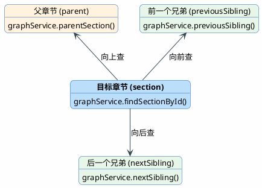

import VipInline from '@site/src/components/VipInline';

# 结构图查询引擎的查询细节

上一篇我们看到 `GraphOnlyExecutor` 根据导航动作分成了两条查询路径，最终都是调用 `StructureGraphQueryEngine` 来完成实际的图查询。这篇就来拆解这个查询引擎的内部实现。

## StructureGraphQueryEngine 的定位

```java
@Service
@Slf4j
public class StructureGraphQueryEngine {

    private final DocumentStructureGraphService graphService;

    public StructureGraphQueryEngine(DocumentStructureGraphService graphService) {
        this.graphService = graphService;
    }
}
```

`StructureGraphQueryEngine` 是一个服务层组件，它封装了 `DocumentStructureGraphService`（底层的图数据访问层），对外提供更高层次的查询能力。你可以把它理解为一个"查询门面"：

- 底层的 `DocumentStructureGraphService` 提供的是原子操作（查单个节点、查父节点、查兄弟...）
- `StructureGraphQueryEngine` 把这些原子操作组合起来，返回业务需要的完整结构

在 GRAPH_ONLY 模式下，执行器只用到了两个方法：`findSectionWithSiblings` 和 `findSectionWithChildren`。

## 查询相邻章节：findSectionWithSiblings

当用户问"上一节是什么"、"这章属于哪个章节"这类问题时，执行器会走这条路径：

```java
public GraphSectionWithSiblings findSectionWithSiblings(Long documentId, Long sectionNodeId) {
    // 先查出当前章节本身，后续的父章节和兄弟章节都基于它展开。
    GraphSection section = graphService.findSectionById(documentId, sectionNodeId);
    // 当前章节存在时，向上找到父章节。
    GraphSection parent = section == null ? null
        : graphService.parentSection(documentId, section.getNodeId());
    // 当前章节存在时，向前找到前一个兄弟章节。
    GraphSection previousSibling = section == null ? null
        : graphService.previousSibling(documentId, section.getNodeId());
    // 当前章节存在时，向后找到后一个兄弟章节。
    GraphSection nextSibling = section == null ? null
        : graphService.nextSibling(documentId, section.getNodeId());
    // 打印相邻章节查询日志，便于排查上下文关系是否正确。
    log.info("结构图查询相邻章节: documentId={}, sectionNodeId={}, targetSection='{}', "
        + "parent='{}', previous='{}', next='{}'",
        documentId, sectionNodeId,
        section == null ? "" : section.displayTitle(),
        parent == null ? "" : parent.displayTitle(),
        previousSibling == null ? "" : previousSibling.displayTitle(),
        nextSibling == null ? "" : nextSibling.displayTitle());
    // 把相邻章节关系封装成统一结构返回。
    return GraphSectionWithSiblings.builder()
        .section(section)
        .parent(parent)
        .previousSibling(previousSibling)
        .nextSibling(nextSibling)
        .build();
}
```

这个方法的逻辑非常直观，就是以目标章节为中心，分别向三个方向查询：



整个过程分四步：

<VipInline />