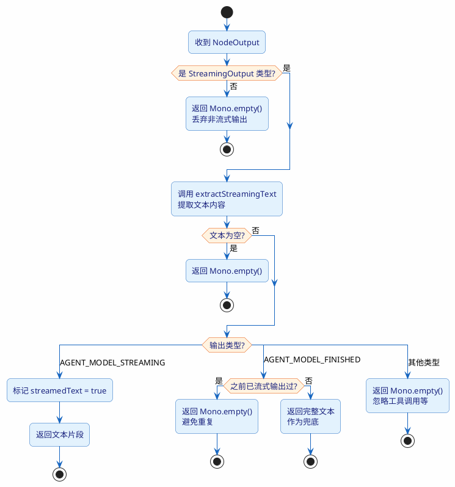

import VipInline from '@site/src/components/VipInline';

# 流式文本提取与输出控制

## 为什么需要文本提取？

ReactAgent 的输出流 `Flux<NodeOutput>` 里面并不全是给用户看的文本。Agent 在执行过程中会产生各种类型的输出：

- 模型正在流式生成的文本片段
- 模型生成完毕的完整文本
- 工具调用的请求和响应
- 图节点的状态变更
- 中间推理过程的数据

我们只需要把"模型生成的文本"提取出来推送给前端，其他的都应该过滤掉。这就是 `extractTextChunk` 方法的职责。

## extractTextChunk：输出类型分拣

```java
private Mono<String> extractTextChunk(NodeOutput output, AtomicBoolean streamedText) {
    // ReactAgent 图里可能会输出非流式节点结果；只有 StreamingOutput 才可能携带给用户的文本。
    if (!(output instanceof StreamingOutput<?> streamingOutput)) {

        // 非 StreamingOutput 不参与前端答案流，直接返回空 Mono。
        return Mono.empty();
    }

    // 从 StreamingOutput 中兼容提取 message 文本、originData Message 文本或 originData 字符串。
    String content = extractStreamingText(streamingOutput);
    // 没有文本内容时，不向用户流输出任何片段。
    if (StrUtil.isBlank(content)) {
        return Mono.empty();
    }

    // AGENT_MODEL_STREAMING 表示模型正在流式输出增量文本，应立即返回给前端。
    if (streamingOutput.getOutputType() == OutputType.AGENT_MODEL_STREAMING) {

        // 标记已经收到过流式片段，后面遇到 FINISHED 时就不再重复发送完整文本。
        streamedText.set(true);
        // 返回当前流式文本片段。
        return Mono.just(content);
    }

    // AGENT_MODEL_FINISHED 表示模型最终完成事件，可能携带完整文本或最终文本。
    if (streamingOutput.getOutputType() == OutputType.AGENT_MODEL_FINISHED) {

        // 如果前面已经流式输出过文本，完成事件通常是重复内容，跳过以避免答案重复。
        if (streamedText.get()) {
            return Mono.empty();
        }
        // 如果没有收到过流式片段，则用完成事件中的文本作为兜底输出。
        return Mono.just(content);
    }

    // 其他输出类型可能是工具调用、节点状态或中间数据，不直接作为用户答案文本。
    return Mono.empty();
}
```

这个方法的逻辑可以用一张决策图来表示：



<VipInline />