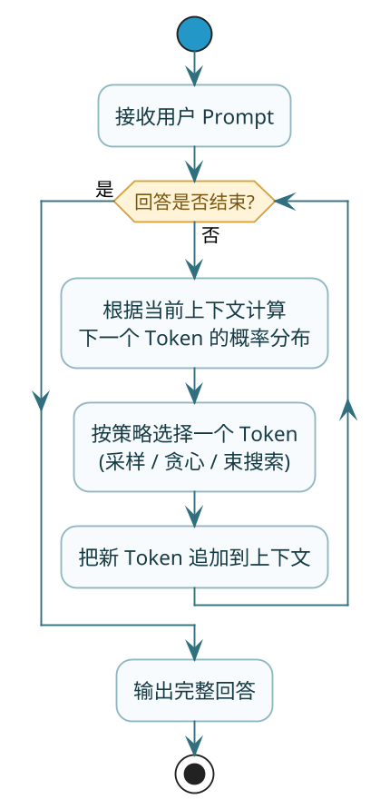
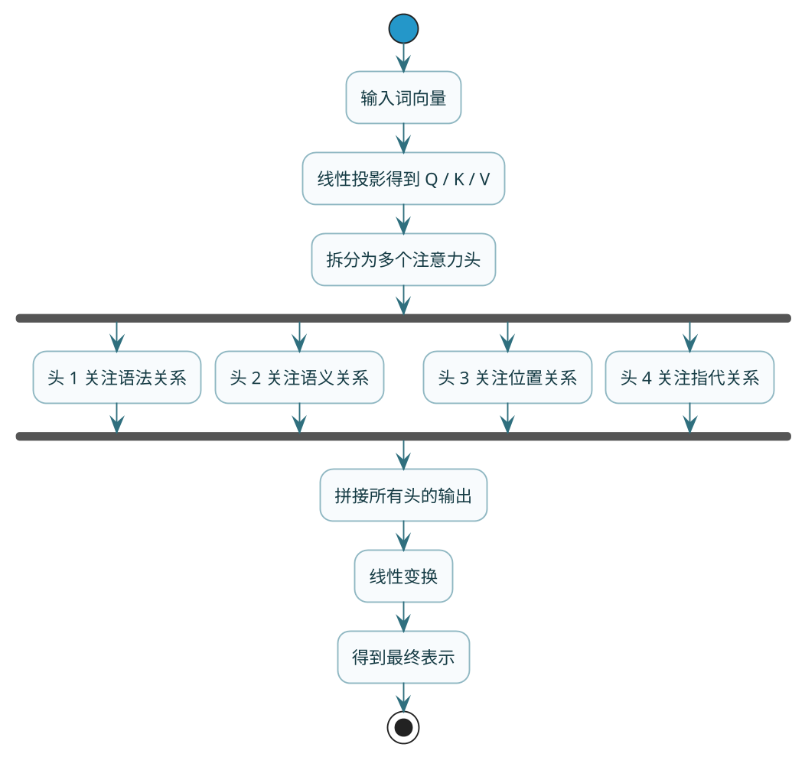
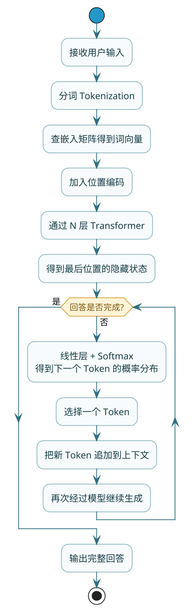

# 大模型工作原理剖析

上一篇咱们聊了大模型的基础概念——参数量、训练数据、和传统编程的区别。这篇来深入看看它到底是怎么工作的：为什么你问它一个问题，它能给出像模像样的回答？它是怎么"理解"你说的话的？又是怎么"组织"语言来回应的？

搞清楚这些原理，你会对大模型有更深刻的认识，也能理解为什么有些 Prompt 效果好、有些效果差，为什么大模型有时候会"胡说八道"，为什么 RAG 能解决知识局限问题。

## 大模型的核心任务：预测下一个词

### 本质就是一个猜词游戏

如果用一句话概括大模型在做什么，那就是：**给它一串文字，它来猜下一个最可能出现的词是什么**。

听起来是不是有点"low"？但就是这个看似简单的任务，玩到极致之后，能写文章、能编代码、能翻译、能对话，几乎无所不能。

举个例子，你输入"今天的天气真"，大模型的任务是猜下一个词。它内部会计算所有候选词的概率：

```
"好"    → 概率 62%
"不错"  → 概率 18%
"差"    → 概率 8%
"热"    → 概率 5%
"糟糕"  → 概率 3%
其他    → 概率 4%
```

然后它会根据这些概率选择一个词输出。选完之后，"今天的天气真好"变成新的输入，它再猜下一个词……如此循环，直到生成完整的句子或达到设定的长度上限。

### 为什么预测下一个词这么有用

你可能觉得奇怪：只是预测下一个词，怎么就能回答复杂的问题？

关键在于：**要准确预测下一个词，模型必须理解上下文的含义**。

比如你问："中国的首都是哪个城市？答案是"

要预测"答案是"后面的词，模型必须：
1. 理解这是一个问答格式
2. 理解问题问的是"中国的首都"
3. 知道中国的首都是北京
4. 理解应该输出城市名称作为答案

只有真正"理解"了这些，模型才能预测出"北京"这个词。如果模型不理解问题，它可能会输出"一个"、"在"这种语法上说得通但语义上答非所问的词。

所以，**预测下一个词只是表面任务，理解语言才是底层能力**。正是因为要做好预测，模型被迫学会了理解。

### 生成过程的完整示例

让我们完整走一遍大模型生成回答的过程。

**输入 Prompt**：
```
用户：请用一句话介绍一下 Python 这门编程语言。
助手：
```

**生成过程**：

第 1 步：模型看到上下文，预测"助手："后面的第一个词
- 候选词概率："Python"(35%)、"它"(25%)、"这"(15%)、"一"(10%)...
- 选择："Python"

第 2 步：上下文变成"...助手：Python"，预测下一个词
- 候选词概率："是"(60%)、"这"(15%)、"作为"(10%)...
- 选择："是"

第 3 步：上下文变成"...助手：Python是"，预测下一个词
- 候选词概率："一"(40%)、"一种"(30%)、"一门"(20%)...
- 选择："一门"

... 继续这个过程 ...

**最终输出**：
```
Python是一门简洁易读、功能强大的高级编程语言，广泛应用于Web开发、数据分析、人工智能等领域。
```

整个过程就是一个词一个词地生成，每一步都是在做"预测下一个词"这个任务。但最终的输出是连贯、有意义的句子。

如果把这个过程抽象成一张图，本质上就是一个不断"预测-追加-再预测"的循环：



### 这不是搜索，是生成

:::warning 常见误解
很多人有个误解：以为大模型回答问题时，是去训练数据里"搜索"答案。

**这是错误的理解。**

大模型生成回答时，不是在做检索，而是在做**生成**。它根据学到的语言规律，一个词一个词地"创造"回答。这些回答可能和训练数据中的某些句子相似，但绝不是复制粘贴。

这就是为什么：
- 同样的问题，问两次可能得到不同的回答（因为选词有随机性）
- 模型可以回答训练数据中从未出现过的问题（因为它学会了举一反三）
- 模型有时候会"胡说八道"（因为它只是在预测"看起来合理"的词，不保证事实正确）
:::

## 它是怎么学会预测的

### 训练的本质：完形填空

大模型是怎么学会预测下一个词的？答案是通过海量的"完形填空"练习。

训练过程大致是这样的：

**第 1 步：准备数据**

从互联网上收集海量文本：书籍、网页、代码、论文、对话……

**第 2 步：制造训练样本**

从文本中截取片段，遮住一部分，让模型预测被遮住的内容。

```
原文：人工智能正在改变我们的生活方式
训练样本：人工智能正在____我们的生活方式
正确答案：改变
```

**第 3 步：训练和调整**

模型一开始是"瞎猜"的，预测结果大概率是错的。但每次猜完，它会收到反馈："正确答案是 xxx，你猜的 yyy 偏差了多少"。

根据这个反馈，模型调整自己内部的参数（那几百亿个数字），让下次遇到类似情况时猜得更准一点。

**第 4 步：重复亿万次**

这个过程在超级计算机上，用海量的文本片段，重复进行数十亿甚至上万亿次。每次重复，模型的预测能力都会提升一点点。

经过这样的训练，模型逐渐学会了：
- 在"今天天气"后面，"真好"出现的概率比"汽车"高
- 在"def function():"后面，应该是 Python 代码
- 在"苹果公司"后面，更可能是科技相关的词而不是水果相关的词

它不是记住了每个具体的句子，而是**学会了语言的统计规律**。

### 一个简化的数学视角

如果你想从数学角度理解，训练的目标可以表示为：

```
最大化 P(下一个词 | 上下文)
```

也就是说，给定上下文（前面的词），最大化模型预测出正确的下一个词的概率。

模型的参数（几百亿个数字）就是通过不断调整，来让这个概率尽可能高。

训练完成后，这些参数就固定下来，代表了模型学到的所有"知识"。

## Transformer：大模型背后的架构

现在你知道了大模型在做什么（预测下一个词）和怎么学的（完形填空训练）。但还有一个关键问题：它内部是什么结构，让它能做到这些？

答案是 **Transformer** 架构。

### 为什么 Transformer 这么重要

:::info 里程碑论文
2017 年，Google 发表了一篇划时代的论文《Attention Is All You Need》（注意力就是你所需要的一切），提出了 Transformer 架构。这篇论文彻底改变了自然语言处理的格局。
:::

在 Transformer 之前，处理语言主要用 RNN（循环神经网络）。RNN 的工作方式是一个词一个词地按顺序处理，就像人阅读一样从左到右。

这种方式有两个大问题：

**问题 1：容易"健忘"**

想象你在读一本很长的书。读到第 500 页时，你还能清晰记得第 1 页的内容吗？大概率记不清了。

RNN 也有这个问题。处理长文本时，开头的信息会逐渐被"遗忘"。这在语言理解中是致命的——有时候理解句子后半部分的意思，必须要知道前面说了什么。

**问题 2：没法并行**

因为必须按顺序一个词一个词处理，RNN 无法利用现代 GPU 的并行计算能力。这导致训练速度很慢，很难扩展到大规模。

Transformer 用一种全新的思路解决了这两个问题。

### Transformer 的核心思想

Transformer 的核心思想可以概括为：**不按顺序读，而是同时看所有词，然后计算每个词和其他词之间的关系**。

打个比方来说明两种方式的区别：

**RNN 方式**（像流水线工人）：

想象你是一个流水线工人，产品一个一个传过来。你处理完当前这个，才能处理下一个。处理到后面的产品时，你只能靠记忆想起前面的产品是什么样的。记忆力好的时候还行，产品多了就容易记混。

**Transformer 方式**（像会议协调员）：

想象你是一个会议协调员，所有参会者同时在你面前。你可以随时看任何一个人，可以同时比较任意两个人的观点，可以直接建立任意两个人之间的联系。不用按顺序，不用靠记忆。

这个"同时看所有词、建立任意词之间联系"的能力，就来自于 Transformer 的核心机制——**自注意力（Self-Attention）**。

## 自注意力机制：找出谁和谁有关系

### 什么是注意力

在深入自注意力之前，先理解"注意力"这个概念。

想象你在一个嘈杂的酒吧里，周围有几十个人在聊天。虽然所有声音都传到你的耳朵里，但你能"专注"于和你聊天的朋友的声音，把其他声音当作背景噪音。

这就是注意力：**在众多信息中，有选择地关注最重要的部分**。

在语言处理中，注意力机制让模型能够在处理某个词时，有选择地"关注"句子中最相关的其他词。

### 自注意力做了什么

自注意力（Self-Attention）的"自"是指句子对自己的注意力——句子中的每个词，都去"关注"句子中的其他词。

具体来说，对于句子中的每一个词，自注意力机制会回答这个问题：

> "在当前的上下文中，句子里的其他词对理解这个词有多重要？"

然后给每个词打一个"重要性分数"。分数高的词，对理解当前词的影响更大。

### 用一个例子深入理解

假设我们有这样一个句子：

> "小明把作业交给了老师，因为他要求必须今天交。"

当模型处理"他"这个词时，需要弄清楚"他"指的是谁——是"小明"还是"老师"？

自注意力机制会计算"他"和句子中每个词的关联分数：

```
"他" 与各词的关联分数（示意）：
小明  → 0.15
把    → 0.02
作业  → 0.08
交给了 → 0.05
老师  → 0.35  ← 最高！
因为  → 0.03
他    → 0.10
要求  → 0.12
必须  → 0.04
今天  → 0.03
交    → 0.03
```

可以看到，"老师"的分数最高。这是因为在训练数据中，模型学到了"要求必须xxx"这种表达通常是上级或权威人物说的话，而在学生和老师的关系中，老师更可能是"要求"的发出者。

所以模型能判断出"他"指的是"老师"，而不是"小明"。

### 自注意力的计算过程

从技术角度，自注意力的计算涉及三个关键概念：**Query（查询）**、**Key（键）**、**Value（值）**。

可以用一个图书馆查书的比喻来理解：

- **Query（查询）**：你想找什么？——你的搜索关键词
- **Key（键）**：每本书的标签——用来匹配搜索
- **Value（值）**：每本书的内容——真正有用的信息

在自注意力中：
1. 每个词都会生成自己的 Q、K、V 三个向量
2. 某个词的 Q 会和所有词的 K 做匹配，计算相关性分数
3. 根据分数对所有词的 V 做加权求和，得到最终的输出

用公式表示（简化版）：

```
注意力分数 = softmax(Q × K的转置 / √d)
输出 = 注意力分数 × V
```

其中 `√d` 是一个缩放因子，防止数值过大。`softmax` 把分数转换成概率（总和为 1）。

### 为什么自注意力这么强大

自注意力有几个关键优势：

**1. 能处理长距离依赖**

在 RNN 中，如果两个相关的词隔得很远，中间的信息会逐渐丢失。但在自注意力中，任意两个词之间都有直接的连接，不管它们隔多远。

比如："小明昨天在超市买了一个苹果，回家后他把苹果洗干净吃了。"

最后的"苹果"要和开头的"苹果"联系起来，在 RNN 中可能因为距离太远而丢失关联。但在自注意力中，它们可以直接建立联系。

**2. 可以并行计算**

因为是同时处理所有词，不需要按顺序，所以可以充分利用 GPU 的并行能力。这让训练大规模模型成为可能。

**3. 关系建模灵活**

每个词都会和所有词建立联系，这种灵活性让模型能学到各种复杂的语言模式。

## 多头注意力：从不同角度看问题

在实际的 Transformer 中，不是只做一次自注意力，而是**同时做多次**，这叫**多头注意力（Multi-Head Attention）**。

### 为什么需要多头

词和词之间的关系是多维度的。一次注意力可能只能捕捉到一种关系，但语言的复杂性需要同时捕捉多种关系。

比如这个句子："程序员小王用 Python 写了一个爬虫程序。"

从不同角度看，词之间有不同的关系：
- **语法角度**："小王"是主语，"写"是谓语，"程序"是宾语
- **职业角度**："程序员"和"Python"、"爬虫程序"相关
- **工具角度**："用"连接了"Python"和"写"
- **指代角度**：如果后文有"他"，应该指"小王"

多头注意力就是让模型同时从多个角度分析词之间的关系。每个"头"专注于一种关系，最后把所有头的结果综合起来。

### 具体是怎么做的

假设我们用 8 个头（这是常见的设置）：

1. 把原始的 Q、K、V 向量分成 8 份
2. 每份独立做一次自注意力计算
3. 把 8 个头的输出拼接起来
4. 通过一个线性变换，得到最终输出

如果画成流程图，多头注意力的处理过程大致如下：



### 多头的实际效果

研究者发现，不同的头确实学会了关注不同的模式：
- 有的头关注语法结构（主谓宾关系）
- 有的头关注位置关系（相邻的词）
- 有的头关注语义相似性（同类词）
- 有的头关注指代关系（代词指向）

这种分工让模型的理解更加全面和深入。

## 位置编码：告诉模型词的顺序

### 为什么需要位置信息

自注意力机制有一个问题：它只看词和词的关系，不考虑词的位置。

对于它来说，"猫追老鼠"和"老鼠追猫"可能没有区别——都是"猫"、"追"、"老鼠"三个词。但这两句话的意思完全不同！

词的顺序对语言理解至关重要，所以 Transformer 需要一种方式来记录位置信息。

### 位置编码是怎么做的

Transformer 的解决方案是**位置编码（Positional Encoding）**：给每个位置生成一个独特的向量，然后加到词的向量上。

原始论文使用的是正弦/余弦函数来生成位置编码：

```
PE(pos, 2i) = sin(pos / 10000^(2i/d))
PE(pos, 2i+1) = cos(pos / 10000^(2i/d))
```

其中 `pos` 是位置，`i` 是维度索引，`d` 是向量维度。

这种编码有几个巧妙的性质：
- 每个位置的编码都是唯一的
- 编码是有界的（-1 到 1 之间）
- 相对位置可以通过线性变换得到

### 现代方法：旋转位置编码

现代大模型（如 Llama、Qwen）更多使用**旋转位置编码（RoPE）**。它的核心思想是把位置信息编码到向量的旋转角度中。

RoPE 的优势：
- 更好地表达相对位置关系
- 可以外推到更长的序列
- 计算效率更高

作为应用开发者，你不需要深入理解位置编码的数学细节，只需要知道：**模型是通过位置编码来理解词序的**。

## Transformer 的完整架构

把上面讲的组件组合起来，就是完整的 Transformer 架构。

### 整体结构

Transformer 由 **编码器（Encoder）** 和 **解码器（Decoder）** 两部分组成：

```plantuml title="Transformer 的完整架构" width="100%" align="center"
@startuml

left to right direction
skinparam backgroundColor transparent
skinparam shadowing false
skinparam dpi 180
skinparam ArrowColor #2F6F7E
skinparam ArrowThickness 1.3
skinparam DefaultTextAlignment center
skinparam rectangle {
  RoundCorner 18
  BorderColor #8FB7C2
  FontColor #153B44
}

rectangle "输入序列\nTokenization + Embedding\n+ Positional Encoding" as INPUT #EAF6FF
rectangle "Encoder × N\n• Multi-Head Self-Attention\n• Add & Norm\n• Feed Forward\n• Add & Norm" as ENCODER #F4FFF7
rectangle "编码表示\n(Context Memory)" as MEMORY #F7FAFC
rectangle "解码器输入\n已生成前缀\n+ Positional Encoding" as PREFIX #FFF8EF
rectangle "Decoder × N\n• Masked Self-Attention\n• Add & Norm\n• Cross-Attention\n• Feed Forward\n• Add & Norm" as DECODER #FFF3F6
rectangle "Linear + Softmax\n下一个词概率分布" as OUTPUT #F2FAFF

INPUT --> ENCODER
ENCODER --> MEMORY
PREFIX --> DECODER
DECODER --> OUTPUT
MEMORY --> DECODER : 提供输入语义信息
OUTPUT --> PREFIX : 选出的词继续追加

@enduml
```



### 各组件的作用

**词嵌入（Embedding）**

把文字转换成数字向量。计算机不认识文字，所以要把每个词（或子词）映射成一个固定长度的向量。相似的词，向量也会比较接近。

**位置编码（Positional Encoding）**

前面讲过，用来告诉模型每个词的位置。

**多头自注意力（Multi-Head Self-Attention）**

前面详细讲过，用来捕捉词与词之间的关系。

**前馈神经网络（Feed-Forward Network，FFN）**

一个简单的两层神经网络，对每个位置的向量做进一步处理。可以理解为"消化"注意力层捕捉到的信息。

```
FFN(x) = max(0, xW1 + b1)W2 + b2
```

中间的 `max(0, ...)` 是 ReLU 激活函数（现代模型更多用 GELU 或 SwiGLU）。

**残差连接（Residual Connection）**

把输入直接加到输出上：`output = layer(x) + x`。这让信息可以"绕过"某些层直接传递，有助于训练深层网络。

**层归一化（Layer Normalization）**

对向量做标准化处理，让数值分布更稳定，有助于训练。

### 编码器 vs 解码器

**编码器**的任务是**理解输入**。它把输入文本转换成一系列向量，这些向量编码了输入的语义信息。

**解码器**的任务是**生成输出**。它一个词一个词地生成，每生成一个词都会参考编码器的输出（通过编码器-解码器注意力）。

在大语言模型（如 GPT）中，通常**只使用解码器**，因为它的任务就是根据上文生成下文，不需要单独的编码器。

### GPT 的架构

GPT（Generative Pre-trained Transformer）只使用 Transformer 的解码器部分，但做了一个关键修改：**掩码自注意力（Masked Self-Attention）**。

在生成第 n 个词时，模型只能看到前 n-1 个词，不能"偷看"后面的词。这是通过在注意力计算时加一个掩码（mask）来实现的，把未来位置的注意力分数设为负无穷（经过 softmax 后变成 0）。

```
GPT 架构（简化）：

输入 tokens
    ↓
词嵌入 + 位置编码
    ↓
┌─────────────────────┐
│  掩码自注意力层      │
│  前馈神经网络        │  × N 层（GPT-3 是 96 层）
│  残差连接 + 层归一化  │
└─────────────────────┘
    ↓
线性层 + Softmax
    ↓
下一个词的概率分布
```

## 从输入到输出：完整的推理过程

让我们用一个具体例子，走一遍大模型从接收输入到生成输出的完整过程。

先从全局看，这个推理过程大致是下面这条链路：



### 输入

```
用户：什么是机器学习？
助手：
```

### 第 1 步：分词（Tokenization）

首先，把文本切分成 token。大模型通常使用子词分词（如 BPE），一个汉字可能是一个 token，也可能和其他字合成一个 token。

```
["用户", "：", "什么", "是", "机器", "学习", "？", "\n", "助手", "："]
```

每个 token 都有一个唯一的 ID：

```
[1234, 567, 8901, 234, 5678, 9012, 345, 678, 9012, 567]
```

### 第 2 步：词嵌入

根据 token ID，查找嵌入矩阵，得到每个 token 的向量。假设向量维度是 4096，那就得到一个 10×4096 的矩阵。

### 第 3 步：加上位置编码

给每个位置加上对应的位置编码向量，让模型知道每个 token 的位置。

### 第 4 步：通过 N 层 Transformer 层

经过每一层，向量都会被更新：
- 自注意力让每个位置"吸收"其他位置的信息
- 前馈网络进一步处理信息
- 残差连接保留原始信息
- 层归一化稳定数值

经过几十层处理后，最后一个位置（"："后面）的向量，就编码了"应该输出什么"的信息。

### 第 5 步：生成第一个词

最后一个位置的向量，通过一个线性层映射到词表大小（比如 32000），再经过 softmax 得到概率分布。

```
"机器"   → 0.35
"它"     → 0.20
"简单"   → 0.10
"一种"   → 0.08
...
```

根据概率采样（或选概率最高的），得到第一个输出词："机器"

### 第 6 步：继续生成

把"机器"加到输入末尾：

```
["用户", "：", "什么", "是", "机器", "学习", "？", "\n", "助手", "：", "机器"]
```

重复第 2-5 步，生成下一个词："学习"

继续重复，直到生成完整的回答：

```
机器学习是人工智能的一个分支，它使计算机能够通过数据和经验自动学习和改进，而无需明确编程。
```

:::tip 面试高频
## 面试高频问题

关于大模型原理，面试中经常会问到以下问题：

### Q1：大模型是怎么生成文本的？

**参考答案**：

大模型生成文本的核心是"预测下一个词"。给定一段上下文（前面的文字），模型会计算词表中每个词作为下一个词的概率，然后根据概率选择一个词输出。选完之后，这个词被加到上下文中，继续预测下一个词。这个过程叫做"自回归生成"，一直重复直到生成完整的文本或达到长度限制。

### Q2：什么是 Transformer？为什么它比 RNN 好？

**参考答案**：

Transformer 是一种神经网络架构，最初由 Google 在 2017 年提出，是现代大模型的基础。

它比 RNN 好在两个方面：

1. **能处理长距离依赖**：RNN 按顺序处理，句子越长，开头的信息越容易丢失。Transformer 通过自注意力机制，任意两个位置可以直接建立联系，不管距离多远。

2. **可以并行计算**：RNN 必须按顺序一个一个处理，无法并行。Transformer 同时处理所有位置，能充分利用 GPU 的并行能力，大幅加速训练。

### Q3：解释一下自注意力机制

**参考答案**：

自注意力机制的作用是计算句子中每个词和其他词的关联程度。

对于每个词，它会生成 Query、Key、Value 三个向量。然后用当前词的 Query 和所有词的 Key 做点积，得到注意力分数，表示其他词对理解当前词的重要性。分数经过 softmax 归一化后，对所有词的 Value 做加权求和，得到当前词的新表示。

这样，每个词的输出都融合了整个句子的信息，而且是有选择性的——和当前词关系密切的词贡献更大。

### Q4：为什么大模型需要位置编码？

**参考答案**：

因为自注意力机制本身是"位置无关"的——它只看词和词的关系，不知道词的顺序。对于"猫吃鱼"和"鱼吃猫"，如果没有位置信息，自注意力会得到相同的结果。

但词序对语言理解至关重要，所以需要位置编码来告诉模型每个词的位置。常见的方法是给每个位置生成一个唯一的向量，加到词向量上。

### Q5：GPT 和 BERT 有什么区别？

**参考答案**：

GPT 和 BERT 都基于 Transformer，但设计目标不同：

- **GPT**（Generative Pre-trained Transformer）用于**生成**任务。它只使用 Transformer 的解码器，训练时预测下一个词，生成时从左到右一个词一个词输出。

- **BERT**（Bidirectional Encoder Representations from Transformer）用于**理解**任务。它使用 Transformer 的编码器，训练时随机遮住一些词让模型预测（完形填空），能同时看到上下文。

简单说：GPT 擅长生成（写文章、对话），BERT 擅长理解（分类、问答）。现在的大语言模型（ChatGPT、DeepSeek 等）主要基于 GPT 架构。

:::
## 小结

这篇咱们深入聊了大模型的工作原理：

**1. 核心任务**
- 预测下一个词（Next Token Prediction）
- 通过不断预测和输出，生成完整的文本

**2. 学习方式**
- 在海量文本上做"完形填空"训练
- 学习语言的统计规律，而不是记忆具体句子

**3. Transformer 架构**
- 自注意力机制：捕捉词与词之间的关系
- 多头注意力：从多个角度分析关系
- 位置编码：记录词的顺序信息
- 多层堆叠：逐层加深理解

**4. 关键特性**
- 能处理长距离依赖
- 支持并行计算
- 是生成而非搜索

理解了这些原理，你就能更好地理解：
- 为什么 Prompt 的写法很重要（因为它是模型生成的起点和上下文）
- 为什么模型会"幻觉"（因为它只是预测"合理"的词，不保证事实正确）
- 为什么上下文长度有限制（因为自注意力的计算复杂度是序列长度的平方）

下一篇咱们来聊聊大模型开发中的核心概念：Token、上下文窗口、Temperature、MoE 等等。这些概念在调用 API 时会频繁用到，搞清楚它们能让你更好地控制模型的行为。
