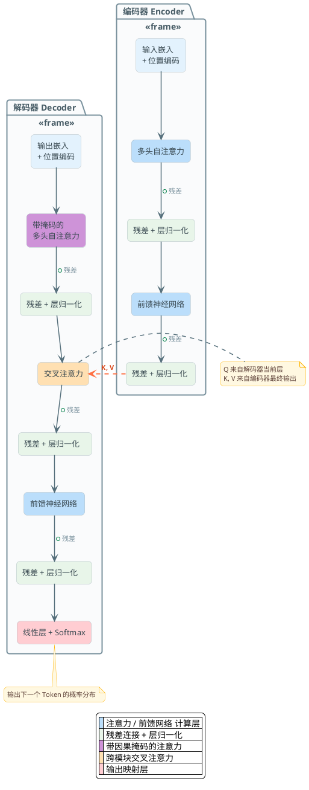

# Transformer与注意力机制深度解析

要理解Transformer，我们要先知道一个前提的问题：为什么RNN和LSTM这样的架构被淘汰了？

### RNN的核心问题

RNN的设计是顺序处理的。处理句子时，必须从第一个词依次算到最后一个词。这意味着什么？

**处理速度很慢。** 假设你要处理一个1000个词的句子。第一个词处理完，才能处理第二个词。这就像排队买饭，一个人接一个人，没法并行。

**长距离依赖学不好。** 信息要从第一个词传到第1000个词，要经过999次矩阵乘法。每一次乘法都可能损失信息（梯度消失或爆炸）。就像传话游戏，传到最后信息全变了。

LSTM试图解决这个问题，加了一个"记忆带"。但说白了就是打补丁，根本问题没解决。

### Transformer的核心洞察

2017年《Attention Is All You Need》论文出现了。核心思想很简单但强大：

**我不按顺序处理了。我让所有词同时互相看一眼，自己决定谁重要。**

这就是Self-Attention的核心。一句话：所有位置可以并行处理，任意两个位置之间的距离都是1步（通过注意力计算）。

```
并行处理？ ✓ GPU能吃满
长距离依赖？ ✓ 距离退化为常数
梯度流动？ ✓ 更稳定
```

这三个特性合在一起，直接打趴了RNN。

## Self-Attention的运作机制

现在来看看Transformer里最核心的部分：Self-Attention。这东西看起来复杂，但原理很直观。

### 三个向量：Q、K、V

想象你在一个餐厅，正在看菜单。你要点餐：

- **Query (Q)**: 你的需求。比如"我想要咸的" → 这是你的查询
- **Key (K)**: 每道菜的标签。"宫保鸡丁是咸的，甜点是甜的..." → 这是菜的特征
- **Value (V)**: 每道菜本身。完整的菜的描述 → 这是菜的真实内容

Self-Attention的逻辑就是：

1. 根据你的需求(Q)，和所有菜的标签(K)匹配，算出相似度
2. 相似度高的菜，我们就更重视它的内容(V)
3. 把所有菜的内容按相似度加权平均，得到最终结果

在NLP里：一个词的Query、Key、Value都是从这个词的embedding衍生出来的。

### 缩放点积注意力（Scaled Dot-Product Attention）

数学形式是这样的：

```
Attention(Q, K, V) = softmax(QK^T / √d_k) × V
```

翻译成人话：

1. `QK^T` 算的是查询和所有Key的相似度，得到一个矩阵，形状 `[seq_len, seq_len]`
2. 除以 `√d_k` (缩放因子)。为什么要缩放？因为维度高的话，点积会特别大，softmax容易变得尖锐，梯度容易消失
3. softmax 把这些相似度转成概率分布
4. 乘以 V，就是按概率加权求和

代码长这样：

```python
import torch
import torch.nn.functional as F

def scaled_dot_product_attention(Q, K, V, mask=None):
    d_k = Q.shape[-1]
    
    # 1. 计算相似度
    scores = torch.matmul(Q, K.transpose(-2, -1)) / math.sqrt(d_k)
    
    # 2. 应用mask（如果有的话，比如因果mask）
    if mask is not None:
        scores = scores.masked_fill(mask == 0, -1e9)
    
    # 3. softmax 转概率
    attention_weights = F.softmax(scores, dim=-1)
    
    # 4. 加权求和
    output = torch.matmul(attention_weights, V)
    
    return output, attention_weights
```

:::tip 面试问题
为什么要除以 `√d_k`？不缩放会怎样？

答：维度越高，向量点积的期望越大（方差也大）。这导致softmax的梯度特别小，难以训练。缩放后让梯度流动更稳定。
:::

## 多头注意力：并行的智慧

一个Self-Attention头就能工作，那为什么要多个头？

想象你在分析一个句子"The animal didn't cross the street because it was tired"。这个"it"指的是什么？

- 从语法角度看，"it"应该是主语
- 从语义角度看，"it"可能指"animal"或"street"
- 从常识角度看，更可能是"animal"

**一个注意力头只能学一种模式。多头让不同的头学不同的模式。**

```
句子: "The animal didn't cross the street because it was tired"

头1 (语法角度): it --主语协议--> animal (高权重)
头2 (距离优先): it --> street (近距离，高权重)  
头3 (常识角度): it --> animal (tired通常修饰生物)

最后融合：综合三个角度做决策
```

多头注意力的结构：

```python
class MultiHeadAttention(nn.Module):
    def __init__(self, d_model, num_heads):
        super().__init__()
        self.num_heads = num_heads
        self.d_k = d_model // num_heads  # 每个头的维度
        
        # Q、K、V 的投影层
        self.W_q = nn.Linear(d_model, d_model)
        self.W_k = nn.Linear(d_model, d_model)
        self.W_v = nn.Linear(d_model, d_model)
        
        # 最后的输出投影
        self.W_o = nn.Linear(d_model, d_model)
    
    def forward(self, Q, K, V, mask=None):
        batch_size = Q.shape[0]
        
        # 1. 投影并分头
        Q = self.W_q(Q).reshape(batch_size, -1, self.num_heads, self.d_k).transpose(1, 2)
        K = self.W_k(K).reshape(batch_size, -1, self.num_heads, self.d_k).transpose(1, 2)
        V = self.W_v(V).reshape(batch_size, -1, self.num_heads, self.d_k).transpose(1, 2)
        
        # 2. 每个头分别做attention
        attn_output, _ = scaled_dot_product_attention(Q, K, V, mask)
        
        # 3. 拼接所有头的输出
        attn_output = attn_output.transpose(1, 2).reshape(batch_size, -1, self.d_model)
        
        # 4. 最后的投影
        output = self.W_o(attn_output)
        
        return output
```

:::warning 常见误解
多头是不是就是用多个注意力模块串联？

**错。** 多头是并联的。所有头同时运行（在GPU上），每个头内部的计算量也变小了（维度从d_model降到d_model/num_heads）。这样既增强了表现力，又没显著增加计算量。
:::

## Transformer的完整架构

一个标准的Encoder-Decoder Transformer长这样：



### 核心组件拆解

**Encoder的一层包含：**

1. **Multi-Head Self-Attention**: 让每个位置看到所有其他位置
2. **Add & Norm**: 残差连接 + Layer Normalization。残差让梯度能直接流向前面的层，Norm稳定训练
3. **Feed-Forward Network**: 两层全连接，中间用ReLU激活。FFN才是Transformer参数最多的地方

**Decoder的一层包含：**

1. **Masked Multi-Head Self-Attention**: 一个词只能看到它之前的词（因果mask），不能看未来
2. **Cross-Attention**: 用Decoder的状态作为Q，Encoder的输出作为K和V。这是Decoder和Encoder的沟通桥梁
3. **Feed-Forward Network**: 和Encoder一样

### 为什么现代LLM都用Decoder-Only架构

等等，你用Transformer的时候，应该发现一个问题：最流行的GPT、Llama、DeepSeek都是**Decoder-Only**，不是Encoder-Decoder。为什么？

**Encoder-Decoder的问题：**

- 需要输入输出都完整才能训练。对于语言模型，"完整输入"是什么意思？用起来别扭
- 生成时候的逻辑复杂。需要分别管理Encoder和Decoder的状态
- 参数效率不如Decoder-Only。两个stack的参数是两倍

**Decoder-Only的优势：**

- 统一的训练方式。你要预测下一个词，所有前面的词都是"输入"，当前词是"输出"。简洁优雅
- 自回归生成很自然。一个词接一个词地生成
- 参数效率高。所有参数都用在一个stack里

其实Decoder-Only就是用Masked Self-Attention，每个词只能看前面的词。这样就可以用同一套参数既做编码又做生成。

:::tip 面试要点
Encoder-Decoder vs Decoder-Only，什么场景用哪个？

**Encoder-Decoder**: 翻译、摘要、问答。需要读完整个输入后再生成输出。
**Decoder-Only**: 任何需要生成文本的任务。包括上面三个，但用法不同。

现在大多数都用Decoder-Only + Prompt Engineering解决问题。
:::

## 注意力的瓶颈与优化

现在我们来到了大模型时代面临的真实问题。Self-Attention虽然强，但有个致命的问题：**O(N²) 的复杂度和内存占用。**

### 多头注意力（MHA）的三大痛点

一个典型的场景：推理一个Llama-70B模型，生成1000个token，序列长度是4096。

**痛点1：KV Cache内存爆炸**

在自回归生成时，每一步都要保存之前所有token的K和V。对于70B模型：

- 每个K或V的大小 = 序列长度 × 隐层维度 × 2字节(fp16)
- 一个token的KV Cache = 4096 × 8192 × 2 = 67MB（这只是一层！）
- 总共80层 × 67MB = 5.3GB **仅仅用来存KV Cache！**

这还没算参数本身。

**痛点2：内存带宽是瓶颈**

计算Attention矩阵(O(N²))需要读写大量数据。GPU的计算能力远高于内存带宽。结果？GPU大量时间在等数据。

**痛点3：O(N²) 让长序列成本爆炸**

4096长度还好说。如果要支持100K token的上下文，Attention矩阵就要 100K × 100K = 10亿个数字。这对内存和时间都是灾难。

### MQA：激进的解决方案

2019年，一篇论文提出了多头查询注意力（Multi-Query Attention）。核心思想：

**所有注意力头共享同一份K和V。**

怎么理解？还是拿餐厅例子：

```
标准MHA: 每个服务员(head)都拿着完整的菜单(K,V)
MQA:    所有服务员共用一份菜单，但各自有各自的需求(Q)
```

结果：

```
原来: Q [num_heads × seq_len × d_k]
      K [num_heads × seq_len × d_k]  
      V [num_heads × seq_len × d_k]
      总计: 3 × num_heads × seq_len × d_k

改成MQA: Q [num_heads × seq_len × d_k]
         K [1 × seq_len × d_k]  ← 只有一份！
         V [1 × seq_len × d_k]  ← 只有一份！
         总计: (num_heads + 2) × seq_len × d_k

KV Cache内存: 从 3H 降到 (H+2) ≈ H/32 (如果H=32)
```

**性能对比：**

```
MHA:   KV Cache = 100GB （假设）
MQA:   KV Cache = 3.1GB   （内存降96%！）

推理速度提升 2-4x（原本受内存限制）
```

但问题来了：质量下降。因为32个头共享一份信息，表现力明显下降。这是个trade-off。

### GQA：折中方案，成为新标准

2023年，Google提出了分组多查询注意力（Grouped Query Attention）。思路很简单：

**把32个头分成8组，每组共享一份K和V。**

```
MHA:  32个头，32份K/V
MQA:  32个头，1份K/V      (太激进，质量下降)
GQA:  32个头，8份K/V      (折中！)
```

这样既保留了多头的表现力，又显著减少了KV Cache。

```
KV Cache: MHA 1.0x → GQA 0.25x (Q:32, K/V:8 = 1 + 0.25)
质量损失: MHA baseline → GQA: -1% (几乎无损！)
```

现在Llama 2/3、Qwen 2/3都用GQA。它已经成为事实上的标准。

:::warning 常见误解
GQA是不是为了减少计算？

**不是。** GQA主要是减少**内存**和**内存带宽瓶颈**。计算量不变（Q还是32个头）。关键是KV Cache小了，内存访问快了，推理速度就快了。
:::

### Flash Attention：实现级别的革命

MQA/GQA是结构优化。但还有个完全不同的角度：改变attention的实现方式。

标准attention的实现流程：

```
1. 计算 S = QK^T / sqrt(d_k)  [seq_len × seq_len矩阵，写到VRAM]
2. softmax(S)                  [再读一遍，再写一遍]
3. 乘以V并写出结果            [又读一遍]

---

内存I/O: O(N²)  ← 灾难！
```

2022年，Dao等人提出Flash Attention。核心洞察：

**不要一次性算完整个N×N矩阵。分块计算，边算边softmax。**

```python
# 伪代码
output = []
for i in chunks(queries):          # 分块读Q
    for j in chunks(keys):         # 分块读K
        S = i @ j.T                # 只算小块
        P = softmax(S)             # 在芯片内存算softmax
        V_j = get_corresponding_V(j)
        output.append(P @ V_j)     # 立即输出

# 结果: 大部分计算在fast SRAM上进行，不需要多次往返VRAM
```

这样做的效果：

```
内存I/O: O(N²) → O(N)
速度:    1x → 2-4x (取决于序列长度)
内存:    峰值内存下降 70-80%
```

**关键点：Flash Attention在数学上等价于标准attention！** 这不是近似，不是hack。只是改变了计算顺序和存储位置。

:::tip 面试问题
Flash Attention是不是近似算法？会不会有精度问题？

答：**不是近似。** 从数学角度完全等价。只是改变实现，在SRAM上分块计算softmax，减少VRAM往返。精度损失只来自浮点舍入，和标准实现一样。
:::

### 现代模型的完整优化栈

一个现代LLM（比如Llama 3或DeepSeek）使用的是：

```
GQA (8个K/V头) + Flash Attention V2 + 其他细节优化
```

这三者**不是替代关系，是堆叠关系**：

```
层级1: 架构选择  → GQA (减少KV Cache)
层级2: 实现优化  → Flash Attention (减少I/O)
层级3: 其他      → Paged Attention、分页KV缓存等
```

效果叠加：

```
MHA标准实现:        1.0x速度，1.0x内存
GQA标准实现:        1.3x速度，0.25x KVcache
GQA + Flash Attn:   4-5x速度，0.1x峰值内存
```

这就是为什么现代模型能支持这么长的序列。

### DeepSeek的MLA：又一个方向

最后提一下DeepSeek最近提出的多头潜在注意力(Multi-head Latent Attention)。它走了个不同方向：

**把K和V压缩到更低维度的"潜在空间"。**

思路有点像自编码器。先把高维K/V压缩，计算注意力，再解压。理论上能进一步减少KV Cache。但代价是推理多了压缩/解压的计算。算不算划算还在验证。

## 位置编码：告诉Transformer位置信息

这是个容易被忽视但很关键的部分。Self-Attention有个"问题"：它是对称的。

什么意思？考虑句子 "我爱你" 和 "你爱我"。在Self-Attention看来，这两句可能是等价的——因为三个词的集合是一样的，只是顺序不同。

Attention矩阵只记录"谁看谁"，**不记录位置**。

所以我们需要显式地把位置信息告诉模型。

### 绝对位置编码 vs 相对位置编码

**绝对位置编码哲学：** 每个位置都有一个独特的身份。位置0就是位置0，位置10就是位置10。

**相对位置编码哲学：** 重要的不是绝对位置，而是**距离**。相邻的词距离是1，隔10个词距离是10。

这个选择很关键。想象两个人对话：

- 绝对位置："第5句话"。如果上下文变了，含义完全变了
- 相对位置："我前面说的那句话"。无论什么上下文，都清楚

NLP里相对位置更有意义，所以现代方案都用相对编码。

### Sinusoidal编码：最初的方案

Transformer原始论文用的是三角函数编码：

```
PE(pos, 2i) = sin(pos / 10000^(2i/d_model))
PE(pos, 2i+1) = cos(pos / 10000^(2i/d_model))
```

直观理解：用不同频率的sin/cos波。低频成分表示"大位置变化"，高频成分表示"小位置变化"。

```
维度0:   频率很低   ～～～～～～     (大周期，表示长距离位置)
维度1:   频率很低   ～～～～～～     
维度2:   频率中等   ～～～～         (中周期)
维度3:   频率中等   ～～～～
...
维度511: 频率很高   ~~~~~~~~~~       (小周期，表示短距离位置)
```

优点：可以处理任意长的序列（理论上）。

缺点：

```
问题1: 外推性差。训练序列长度1000，推理2000，效果下降
问题2: 相对距离信息不够明确。要通过复杂的三角恒等式才能提取
问题3: 对中文这样的语言，位置编码效果一般
```

### RoPE：旋转位置嵌入，现代标准

2021年，一篇论文提出了旋转位置嵌入(Rotary Position Embedding)。这是个非常优雅的方案。

核心思想：**用旋转矩阵对Q和K进行旋转。旋转的角度就是位置。**

数学上：

```
RoPE(x, pos) = [cos(pos*θ)  -sin(pos*θ)] × x
               [sin(pos*θ)   cos(pos*θ)]
```

其中 `θ` 是不同维度的频率参数。

为什么这个设计这么牛？因为：

1. **相对位置完美编码**。如果计算 `RoPE(q, m) · RoPE(k, n)` (m和n是位置)，结果只依赖 `(m-n)`。两个向量的内积就包含了它们之间的相对距离！

2. **外推性好**。RoPE用的是高频-低频混合，和Sinusoidal一样。但旋转这个操作对长序列更友好。

3. **工程友好**。只需要在Q和K上乘以旋转矩阵，其他代码不变。

```python
import torch

def apply_rotary_emb(x, freqs, device=None):
    """
    x: [batch, seq_len, num_heads, head_dim]
    freqs: 频率向量
    """
    seq_len = x.shape[1]
    
    # 生成旋转矩阵
    t = torch.arange(seq_len, device=device).unsqueeze(1).float()
    freqs = torch.einsum("i,j->ij", t, freqs)  # [seq_len, head_dim//2]
    
    # 复数表示的旋转
    emb = torch.cat([freqs, freqs], dim=-1)  # [seq_len, head_dim]
    cos = emb.cos()
    sin = emb.sin()
    
    # 对x进行旋转
    x_rotated = x * cos + rotate_half(x) * sin
    return x_rotated
```

**RoPE的扩展：NTK和YaRN**

但RoPE也有问题：训练长度1000，推理2000还是会有下降。

所以出现了两个扩展：

- **NTK-Aware Scaled RoPE**: 动态调整频率，支持长序列。直观理解：把高频成分的周期拉长，让模型能理解更长的距离
- **YaRN**: 更聪明地混合相对和绝对信息，支持8x长度扩展

现在Llama、Qwen、DeepSeek都用RoPE（或其变体）。已经成为标准。

### ALiBi：极简方案

还有一个有趣的方案叫ALiBi(Attention with Linear Biases)。思路是：

**不对embedding添加位置信息，而是在attention矩阵上直接加位置偏差。**

```
Attention(Q, K, V) = softmax(QK^T / √d_k - m × (1 - relative_distance)) × V
```

其中 `m` 是一个学习到的参数，`relative_distance` 是相对距离。

效果：离得越远，attention权重就越低（被减掉一个大的负数）。

**优点：**
- 极其简单，几行代码
- 外推性非常好。甚至能从32K训练长度外推到8M

**缺点：**
- 表现力不如RoPE。对复杂的长距离关系建模能力一般
- 相对位置编码的细节度不够

总的来说，ALiBi是个"野心勃勃但有缺陷"的方案。RoPE则是"平衡得最好的"。

:::tip 面试要点
为什么RoPE现在是标准？

答：相对位置编码 + 外推性 + 工程简洁性的完美结合。Sinusoidal太简陋，ALiBi表现力不足，RoPE介于两者之间但都做得最好。
:::

## 分词器：模型和文本的桥梁

现在我们来到第四个话题：分词器(Tokenizer)。这常常被忽视，但它直接影响模型的性能和成本。

### 分词器为什么重要

想象一个模型处理文本。它看不懂"北京天气真好"这个字符串。它需要的是数字。

中间的转换就是分词器的工作。但这不是简单的字符编码。

**分词器的三个关键任务：**

1. **词汇覆盖**。中文、日文、Emoji、代码...样样要能处理。如果遇到不认识的字符，模型就懵了

2. **压缩比**。假设你有1亿个词汇（1000万字符），模型要处理100个字符的文本：
   - 字符级：100个token
   - 词级：20个token
   - 亚词级（通常）：30-50个token
   
   Token越少，序列越短，推理越快，成本越低！

3. **语义准确性**。分词应该尊重语言的结构。"北京"应该是一个token，不是"北"+"京"

### 字符级 vs 词级 vs 亚词级

**字符级分词：**

最简单的方案。"机器学习" → ['机', '器', '学', '习']

```
优点: 词汇表很小 (汉字3500+, ASCII 128)，没有OOV问题
缺点: 序列超级长，模型要处理4倍的token
       语义信息丢失。"机"和"器"分开了，关系不明确
```

**词级分词：**

把每个完整的词作为token。"机器学习" → ['机器', '学习']

```
优点: 序列短，语义清楚
缺点: 词汇表巨大（中文50万+词），OOV问题严重
       新词、网络词汇、代码都没法处理
```

**亚词级(Subword)分词：**

介于两者之间。"机器学习" → ['机', '器学', '习']（举例）

根据频率或其他规则把常见词保留，把稀有词拆开。

### BPE：字节对编码

BPE(Byte Pair Encoding)是最常用的亚词分词方法。GPT系列都用它。

核心思想很简单：**迭代地合并最频繁的两个相邻token。**

示例：

```
初始: "低 频 词" 的字符级: ['l','o','w',' ','f','r','e','q',' ','w','o','r','d']

第1步: 统计相邻对。('w','o')出现最频繁 2次
       合并: ['l','o','w',' ','f','r','e','q',' ','wo','r','d']
       词汇: {('w','o') -> 'wo'}

第2步: 统计新的相邻对。('wo','r')出现最频繁
       合并: ['l','o','w',' ','f','r','e','q',' ','wor','d']
       词汇: {('w','o') -> 'wo', ('wo','r') -> 'wor'}

第3步: 继续...

最终词汇: 4000-50000个token（根据迭代次数决定）
```

```python
class BPE:
    def __init__(self, vocab_size=10000):
        self.vocab_size = vocab_size
        self.vocab = {}  # (token1, token2) -> merged_token
    
    def train(self, corpus):
        # 初始化为字符级
        tokens = list(corpus.encode('utf-8'))
        
        for _ in range(self.vocab_size):
            # 统计相邻token对的频率
            pairs = self._count_pairs(tokens)
            most_frequent = max(pairs, key=pairs.get)
            
            # 合并
            tokens = self._merge_pair(tokens, most_frequent)
            self.vocab[most_frequent] = len(self.vocab)
    
    def _count_pairs(self, tokens):
        pairs = {}
        for i in range(len(tokens) - 1):
            pair = (tokens[i], tokens[i+1])
            pairs[pair] = pairs.get(pair, 0) + 1
        return pairs
```

**BPE的优点和缺点：**

```
✓ 简单易实现
✓ 对英文很有效（英文经常有词根复用）
✓ 字节级fallback，永远不会OOV（GPT-2用的）

✗ 汉语效果一般。汉字之间没有明显的频率偏好
✗ 训练依赖语料。同样的文本，换个语料库，词汇表完全不同
```

### WordPiece：BERT的选择

WordPiece是Google提出的，BERT就用它。思路和BPE类似，但合并的标准不同。

BPE：合并**频率**最高的对
WordPiece：合并能最大化**似然函数**的对

```
BPE思路:      频率高 → 合并
WordPiece思路: 合并后减少的cross-entropy最多 → 合并
```

从结果看，WordPiece对中文等语言的表现略好。但代价是训练更复杂。

### SentencePiece/Unigram：probabilistic方法

Llama、T5、Qwen都用的是SentencePiece库。底层用的是Unigram语言模型。

思路完全不同：

**从一个大的初始词汇表开始，然后逐步删除最没有意义的token。**

```
初始: 所有可能的subword (100万+个)

第1步: 建一个Unigram语言模型，计算每个token的"重要性"
       重要性 = 这个token在corpus中被选中的概率

第2步: 删掉最不重要的10%

第3步: 重新计算重要性，再删

...

最终: vocab_size个token
```

这个方法有个妙处：是概率性的。同一个词可能有多种分法，每种分法有不同的概率。这让模型更灵活。

```python
# 伪代码：Unigram模型选择token
def segment(text, vocab, unigram_model):
    # 动态规划：找最优分词方案
    n = len(text)
    dp = [float('-inf')] * (n + 1)
    dp[0] = 0
    
    for i in range(1, n + 1):
        for j in range(i):
            token = text[j:i]
            if token in vocab:
                prob = unigram_model[token]  # log概率
                dp[i] = max(dp[i], dp[j] + prob)
    
    return dp[n]  # 最优概率
```

**为什么Llama用SentencePiece？**

- 字节级fallback。任何语言任何字符，即使词汇表没有，也能拆成字节处理
- 多语言友好。中文、日文、Emoji都能很好地处理
- 概率性让生成更稳定。不会因为词汇表的边界效应产生奇怪的token切分

### 分词器的实际考虑

现在，一个重要的实际问题：**词汇表大小选多少？**

```
选项1: 词汇表 = 32K
      优点: 显存小，推理快，embedding矩阵小
      缺点: token数多，序列长，中文效果差

选项2: 词汇表 = 128K
      优点: token数少，多语言支持好
      缺点: embedding矩阵是32K的4倍，显存压力大

选项3: 词汇表 = 256K+ (Qwen用的)
      优点: token压缩率极高，中文特别好
      缺点: embedding非常大，训练困难
```

通常的选择：

- GPT-3: 50K词汇（英文优化）
- Llama: 32K词汇（多语言但偏英文）
- Qwen: 152K词汇（中文优化）
- DeepSeek: 102K词汇（平衡中英）

:::warning 常见误解
词汇表大越好？

**错。** 太大的词汇表：
- embedding参数增加，显存占用↑
- 词汇稀疏，某些token在语料中很少出现，学不好
- 推理矩阵乘法变大（最后一层LM Head就很重）

最优值通常是 100K-200K。
:::

### 分词器的质量评估

一个好的分词器应该满足什么条件？

**指标1：Token压缩率**

```
英文: 1个单词 ≈ 1.3个token
中文: 1个字符 ≈ 1.5-2个token (好的) vs 2-3个token (差的)
```

**指标2：OOV率**

语料中遇到不认识的token的比例。好的分词器应该接近0（字节级fallback）。

**指标3：语义一致性**

相关的词不应该被分裂。"机器学习" 最好保持为 ['机器', '学习'] 而不是 ['机', '器', '学', '习']。

这个评估需要手工检查 + 下游任务性能。

### 从业者的经验

一个实际建议：如果你要训练一个中文模型，用SentencePiece + 自己的语料训练词汇表。别用别人的。

```
为什么？

预训练分词器:    词汇表针对另一种语料优化
你的语料:        可能是工业数据、方言、技术术语
结果:            token压缩率差，性能下降 5-10%

自训练分词器:    词汇表针对你的语料优化
结果:            token压缩率最优，性能↑
```

成本？训练一个分词器只需要几分钟，完全值得。

## Transformer中的其他关键细节

### 残差连接和层归一化

这两个东西看起来很小，但对训练稳定性至关重要。

**残差连接(Residual Connection)：**

```python
output = layer(x) + x
```

这样做的意义：

1. **梯度流动**。即使中间层的梯度很小，也能通过"捷径"直接流向前面的层。防止梯度消失
2. **身份函数保留**。如果中间层啥都学不了，至少还能"不变"（学出0）。更容易优化

**层归一化(Layer Normalization)：**

```python
normalized = (x - mean(x)) / sqrt(var(x) + eps)
```

作用：

1. **稳定训练**。不同层的输出数值范围不一致，LayerNorm把它们都规范化到相同范围
2. **减少内部协变量偏移**。这是个信号处理概念，简单说就是：层的输入分布不要变化太剧烈

Transformer中的顺序通常是：

```
输入 → LayerNorm → 注意力 → 残差 + 输入
      → LayerNorm → FFN → 残差 + 输入
```

这叫"Pre-Norm"。也有"Post-Norm"的顺序（残差后做归一化），但Pre-Norm更稳定。

### Feed-Forward Network的设计

Transformer的FFN长这样：

```python
FFN(x) = ReLU(xW1 + b1)W2 + b2
```

其中 `W1` 通常是原维度的4倍。比如 d_model=512，FFN中间层=2048。

为什么要4倍？实际上这是个超参数选择，4倍是个经验值。后来有人试过其他倍数：

```
倍数1x:  参数太少，表现力不足
倍数2x:  开始有效果
倍数4x:  平衡点，是个很好的default
倍数8x:  效果不再显著提升，参数浪费
```

也有论文用GLU(Gated Linear Unit)代替ReLU：

```python
FFN_GLU(x) = (xW1 + b1) ⊗ (xW2 + b2)  # ⊗是element-wise乘
```

这样参数变成了6倍，但表现力更强。现在有些模型用这个。

### Causal Mask的作用

在Decoder中，一个词只能看到它前面的词。这通过"因果mask"实现。

数学上，就是把Attention矩阵的上三角（未来词）全设成 `-∞`：

```
原始attention矩阵:        应用causal mask:
[a  b  c]                 [a  -∞ -∞]
[d  e  f]        →        [d  e  -∞]
[g  h  i]                 [g  h  i ]

softmax后，未来词的权重变成0
```

这保证了自回归生成的因果性：不能看未来。

## 总结：从理论到工程

看完这一圈，你应该明白了：

```
Transformer是一个精妙的设计。它用自注意力替代了RNN的顺序依赖，
让计算并行化。然后通过各种优化（GQA、Flash Attention、RoPE等），
把它从理论上的优雅变成了工程上的可用。

分词器是个常被忽视但同样关键的部分。好的分词器能显著提升模型性能。
```

### 模型选择的建议

**如果你在搭建一个现代LLM系统：**

1. 架构用Decoder-Only（现在的标准）
2. 注意力用GQA（Llama/Qwen都这么做）
3. 推理用Flash Attention（几乎没有成本，但显著加速）
4. 位置编码用RoPE + NTK或YaRN扩展
5. 分词器根据目标语言选择：
   - 英文优先：BPE (GPT风格)
   - 多语言或中文：SentencePiece (Llama/Qwen风格)

这套组合已经被验证过，是个稳定的最佳实践。

:::tip 面试最后的考点

1. "Transformer为什么快过RNN？" → 并行处理 + 常数级距离
2. "MQA和GQA的区别？" → 分组粒度。GQA是折中方案
3. "Flash Attention真的更快吗？还是近似？" → 真的更快，数学等价，不是近似
4. "为什么用RoPE？" → 相对位置编码 + 外推性 + 工程简洁
5. "词汇表越大越好？" → 不是，有最优值。太大浪费参数和显存
6. "新词怎么处理？" → 字节级fallback或BPE拆分

掌握这6个问题的答案，大模型的核心就理解透了。
:::
