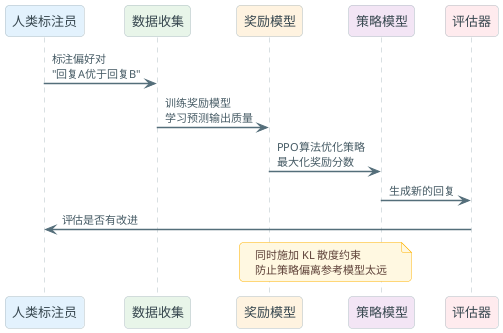

# 大模型训练与微调技术全貌

我们可以用一个类比来更好的理解。学做菜，分三个阶段：首先要学基础知识（食材特性、火候、刀工等），这就像预训练；其次要跟着食谱做（按步骤来），这就像SFT监督微调；最后要做口味测试和调整（偏咸偏淡、火候对不对），这就像对齐。大模型的训练也是这么个逻辑。

今天咱们就把这整个链路拆开，从预训练、微调、到后训练，讲清楚每一步都在干啥，为什么要这么做。

## 一、大模型的三阶段训练流程

### 预训练阶段（Pre-training）：学习世界知识

预训练是最烧钱的一步。想象你要训练一个模型理解全人类的知识，需要什么数据？

- **数据来源**：互联网爬虫数据、书籍、代码库、学术论文。规模是万亿级别的token。
- **训练目标**：下一个token预测（Causal Language Modeling）。就是说，给定前面的所有词，预测下一个词是什么。用的是交叉熵损失函数。
- **计算规模**：数千块GPU，训练数个月，花费几百万到几千万美元。GPT-3时代烧了1000多万美金。

:::info
预训练用的是"自回归"方式：模型看到的每个token都只能看它前面的token，不能看后面的。这样就保证了生成时的自洽性。
:::

这个阶段，模型到底学了什么？

1. **语言结构**：词法、句法、语义。什么词后面通常跟什么词。
2. **世界知识**：历史、科学、常识。比如"北京是"后面通常是"中国的首都"。
3. **推理能力**：基础的逻辑推导。这很神奇，模型没有明确被教推理，但从数据中学会了。
4. **多语言能力**：多语言数据让模型有cross-lingual transfer的能力。

**关键点**：预训练模型其实不是个"好助手"。它只是个"下一个词预测器"。给它"问题"，它会接着你的风格继续说下去，而不是给你一个清晰的答案。这就是为什么需要SFT。

### 监督微调阶段（SFT）：学会跟指令

预训练好的模型虽然知识丰富，但不会乖乖听你的话。它的行为更像是"接书写下去"，而不是"做一个助手"。这里就需要SFT。

**SFT的数据格式**：指令-回应对，通常是这样：

```
指令：推荐一个适合初学者的咖啡豆
回应：我推荐中等烘烤的单一产地豆，比如哥伦比亚 Geisha。它的特点是...
```

或者多轮对话：

```
用户：我想开一个小咖啡馆
助手：那需要考虑几个方面。首先是位置选择...
用户：有什么位置建议吗？
助手：你可以考虑商业区、居民区或...
```

**数据规模**：通常1万到100万的高质量例子。相比预训练的万亿token，这算是"小数据"。

**变化**：经过SFT，模型学会了：
- 理解用户意图
- 组织答案成清晰的格式
- 拒绝有害请求
- 表现得像个"助手"而不是"文本生成器"

:::warning
SFT有个大坑叫"灾难性遗忘"（Catastrophic Forgetting）。如果SFT数据质量不好或分布偏差，模型会忘掉预训练学的东西。所以SFT数据必须高质量。
:::

### 对齐阶段（Alignment）：学会人类价值观

好了，现在模型会跟指令了。但还有问题：它可能会说出有害的话、歧视性内容、虚假信息，或者就是逻辑不通。这就需要对齐。

对齐的目标很清楚：**让模型的输出符合人类价值观**。具体来说就是"有帮助（Helpful）、无伤害（Harmless）、诚实（Honest）"。

对齐通常有几种方法，咱们后面详细讲（RLHF、DPO、GRPO）。共同点是：
- 需要人类标注者评价模型输出的好坏
- 用这些反馈来优化模型
- 相比SFT，对齐更接近"微调"而不是"大改"

## 二、缩放律与涌现现象：为什么越大越聪明

这是大模型里最有趣的发现之一。2020年OpenAI的论文告诉我们一个惊人的事实：**模型性能和规模的关系完全可以预测**。

### OpenAI的缩放律

OpenAI 2020年的论文发现，模型loss和三个因素有关：

```
L(N, D, C) = a × N^(-α) + b × D^(-β) + c
```

其中：
- `N` 是模型参数数量
- `D` 是训练数据量（token数）
- `C` 是计算量
- `α, β` 大约都是0.07左右

这什么意思？其实就是：**性能的改进是可以预测的，就像物理规律一样**。

:::tip 面试核心
如果你的模型在某个任务上表现不行，可以估算出：用多少参数、多少数据、花多少钱，就能达到目标性能。这对工程决策至关重要。
:::

### Chinchilla法则：最优的参数-数据比

但OpenAI的发现有个问题：**没告诉我们应该怎么分配计算预算**。是该多加参数呢，还是该多加数据？

2022年DeepMind的Chinchilla论文给出了答案：**最优比例是1:20**。

什么意思？如果你计算预算固定，应该让参数数和训练token数的比例大约是1:20。

举个例子：

- **GPT-3**：1750亿参数，只用了3000亿token训练。比例是1:1.7。严重欠训练。
- **Chinchilla**：700亿参数，1.4万亿token。比例是1:20。
- **结果**：Chinchilla虽然参数少4倍，性能却吊打GPT-3。

这个发现改变了整个行业的思路。之前大家都疯狂堆参数，Chinchilla之后大家开始重视数据。

:::warning
注意，这是"训练计算最优"（Training Compute Optimal）。对于部署来说，情况不一样。一个小模型+大数据训练好了之后，部署时计算量少，这是"推理成本最优"（Inference Cost Optimal）。Llama系列采用的是推理成本最优策略。
:::

### 后Chinchilla时代：Llama 3的野心

Llama 3的团队做了个大胆的实验：**Llama 3 8B用15万亿token训练**。

参数-数据比是1:1875。疯狂。

结果呢？8B的Llama 3 8B在许多任务上超过了GPT-3 175B。用小模型+海量高质量数据，就能达到大模型的性能。

这对工程有什么启示？

1. **数据质量比数量更重要**。15万亿听起来多，但那是经过精心筛选的高质量数据。
2. **小模型有活力**。8B参数的模型可以在单块A100上跑，Llama 3 70B在4块GPU上就能推理。太大的模型部署成本太高。
3. **训练成本和推理成本要平衡**。不能一味追求模型大。

### 涌现能力：会魔法的一刻

这是最神秘的现象。当模型达到一定规模（通常是50-100B参数）后，突然会获得之前没有的能力。

**例子**：
- **Chain-of-thought推理**：小模型说"我不知道"，大模型会一步步推导。
- **In-context learning**：给几个例子，大模型就学会了新任务。小模型做不到。
- **多语言迁移**：用英文训练，会自动应用到中文。

这太诡异了。没有人明确教模型这些，它们为什么会？

**Stanford的破坏性论文**：2023年有个论文说，这些"涌现"可能是幻觉。是我们的评估方式（比如准确率的离散跳变）造成的假象。真实的能力可能是平滑增长的。

不过不管是不是幻觉，实际上大模型确实有这些能力。工程上就是要抓住这个现象：过了一定规模就会有质的飞跃。

## 三、微调方法总览：怎么用小数据改模型

好了，有了预训练模型，现在要在自己的任务上用它。不可能从零开始训练，成本太高。微调是标准做法。

问题是：微调有好多种方法。该选哪个？

### 微调方法对比表

| 方法 | 可训练参数 | 显存需求 | 训练速度 | 推理延迟 | 适用场景 |
|------|-----------|---------|--------|---------|---------|
| 全量微调（Full Fine-tuning） | 100% | 很高 | 慢 | 无 | 数据多、计算资源充足、任务差异大 |
| Adapter | 1-5% | 低 | 快 | +2-5% | 多任务场景、计算受限 |
| Prefix Tuning | 0.1-1% | 低 | 快 | +3-8% | 快速适应新任务 |
| LoRA | 0.1-1% | 低 | 快 | 无 | **最常用，各种场景** |
| QLoRA | 0.05-0.5% | 极低 | 快 | 无 | 单块GPU训练70B+模型 |

### 全量微调：贵但有效

最直白的办法：把所有参数都打开，在新数据上继续训练。

**优点**：
- 最灵活，能处理任何任务变化
- 性能通常最好

**缺点**：
- 需要巨大显存（一个70B模型需要280GB显存光是参数）
- 训练慢
- **灾难性遗忘**：可能忘掉预训练的知识
- 多任务时不好用（每个任务一个完整模型）

:::warning
全量微调在数据少的时候特别危险。数据不足就疯狂调整所有参数，模型会过拟合或遗忘预训练知识。
:::

### Adapter和Prefix Tuning：冻结主体

核心思路：**冻结预训练模型，只加小模块**。

**Adapter**：在每层transformer的前馈网络后面加个小的down-project和up-project层。只有这些小层是可训练的。

**Prefix Tuning**：在输入前加可学习的prefix token。

优点：显存少、参数少。缺点：推理时有延迟，性能相比全量微调差一点。

### LoRA：最优衡量

LoRA是目前最流行的方法。为什么？因为它找到了完美的平衡点：参数少、无推理延迟、效果好。

LoRA的核心想法超简洁：

```
W = W₀ + BA
```

其中：
- `W₀` 是预训练权重
- `B` 和 `A` 是可训练的矩阵，都是低秩的（秩 `r` 通常是8-64）
- `B ∈ ℝ^(d × r)`，`A ∈ ℝ^(r × d)`

为什么这样就行？关键洞察：**预训练权重虽然大，但它们的更新空间是低秩的**。换句话说，用微调来改变权重时，这些改变"躺"在一个低维空间里。

**具体例子**：假设一个注意力层的参数矩阵是512×512的。全量微调需要训练512×512=262K个参数。LoRA用秩16就只需要512×16+16×512=16.4K参数。**少20倍**，而性能基本一样。

推理时怎么样？巧妙之处在这：**合并权重**。直接计算 `W = W₀ + BA` 得到新的权重矩阵，推理时用这个新矩阵就行。没有额外延迟。

还有个牛逼的地方：**一个base模型可以有多个LoRA适配器**。训练不同任务时，只改变LoRA权重。推理时按需加载。这对多任务、多客户场景太有用了。

:::tip 面试核心
LoRA为什么比Adapter好？Adapter需要串联计算（先down再up），推理时有延迟。LoRA的update可以直接加到权重上，推理时无延迟。这是决定性的优势。
:::

### QLoRA：穷人的豪车

2023年NTU的论文说：**把模型量化到4-bit，然后用LoRA微调**。

听起来黑科技。怎么做？

1. 把预训练模型量化到4-bit（极度压缩）
2. 冻结这个量化模型
3. 在上面加LoRA层，只训练LoRA
4. 通过一个巧妙的反量化步骤，LoRA可以学习

结果？**一块GPU（比如A100）可以微调65B的模型**。想想看，全量微调需要8块GPU，QLoRA只要1块。

缺点：
- 训练速度比LoRA慢（因为量化反量化的开销）
- 需要更多优化技巧（混合精度等）

但对创业公司、学生来说，这简直是救星。

### 决策树：怎么选

```
有多少数据？
  ├─ <1K样本
  │   └─ 用LoRA或QLoRA，秩r=8-16
  ├─ 1K-100K
  │   ├─ GPU多吗？
  │   │   ├─ 是 → Full Fine-tuning
  │   │   └─ 否 → LoRA
  └─ >100K
      └─ Full Fine-tuning（性能优先）
```

## 四、LoRA深度剖析：低秩适配的秘密

LoRA这么流行，必须得深挖一下。

### 为什么低秩更新有效？

这背后的直觉是什么？一个粗糙的解释：

当我们微调时，模型其实不需要改变太多东西。比如，一个用来识别狗的图像模型，微调来识别猫，不需要从零重新学视觉特征。只需要调整最后几层来适应猫的特殊之处。

这意味着什么？权重的改变 `ΔW = W - W₀` 不是高维的随机矩阵，而是有结构的。理论上，这个改变的秩（rank）远小于矩阵的维度 `d`。

:::info
低秩假设在很多领域都成立。推荐系统的用户-商品矩阵是低秩的。图像处理中的许多变换也是低秩的。这不是凑巧，而是数据固有的结构。
:::

### LoRA的具体实现

```python
# 这是伪代码，展示LoRA的核心思想

import torch
import torch.nn as nn

class LinearWithLoRA(nn.Module):
    def __init__(self, d_in, d_out, r=8, base_weight=None):
        super().__init__()
        
        # 预训练权重（冻结）
        self.W0 = base_weight  # shape: (d_out, d_in)
        self.W0.requires_grad = False
        
        # LoRA权重（可训练）
        self.B = nn.Parameter(torch.randn(d_out, r) * 0.01)
        self.A = nn.Parameter(torch.randn(r, d_in) * 0.01)
        
        self.scale = 1.0  # 缩放因子
        
    def forward(self, x):
        # 原始权重的计算
        output_base = torch.nn.functional.linear(x, self.W0)
        
        # LoRA的贡献
        lora_output = torch.nn.functional.linear(x, self.A)
        lora_output = torch.matmul(lora_output, self.B.T)
        
        # 合并
        return output_base + self.scale * lora_output
```

核心参数：
- **秩 `r`**：通常8-64。太小学不到东西，太大就没意义了。
- **缩放因子**：初始化时LoRA的权重很小，需要乘以一个缩放因子来平衡。
- **选择哪些层**：通常在Q、K、V、O投影层应用LoRA。有时也加在MLP层。

### LoRA在实际项目中的用法

假设你要微调一个模型来做"食谱推荐系统"。

```yaml
# 这是一个LoRA配置，使用PEFT库风格

lora_config:
  r: 16  # 秩
  lora_alpha: 32  # 初始化缩放
  target_modules: ["q_proj", "v_proj", "k_proj", "o_proj"]  # 在这些层应用
  lora_dropout: 0.05
  bias: "none"
  task_type: "CAUSAL_LM"
```

训练代码框架：

```python
from peft import get_peft_model, LoraConfig, TaskType

# 1. 加载预训练模型
base_model = AutoModelForCausalLM.from_pretrained("llama-7b")

# 2. 配置LoRA
lora_config = LoraConfig(
    r=16,
    lora_alpha=32,
    target_modules=["q_proj", "v_proj"],
    lora_dropout=0.05,
    bias="none",
    task_type=TaskType.CAUSAL_LM
)

# 3. 包装模型
model = get_peft_model(base_model, lora_config)

# 4. 只有LoRA参数可训练
model.print_trainable_parameters()  # 输出：8.4M / 7000M trainable

# 5. 训练食谱推荐任务
train_data = [
    {
        "input": "用户想要快速晚餐，有鸡肉和蔬菜",
        "output": "我推荐一道15分钟快手鸡肉炒菜..."
    },
    ...
]

# 训练...
```

### QLoRA的魔法：4-bit训练

QLoRA在LoRA基础上又进一步：量化。

```python
# QLoRA的训练流程

from peft import prepare_model_for_kbit_training

# 1. 量化加载模型
quantization_config = BitsAndBytesConfig(
    load_in_4bit=True,
    bnb_4bit_compute_dtype=torch.float16,
    bnb_4bit_use_double_quant=True,
)

base_model = AutoModelForCausalLM.from_pretrained(
    "meta-llama/Llama-2-70b",
    quantization_config=quantization_config,
    device_map="auto"
)

# 2. 准备模型用于kbit训练
model = prepare_model_for_kbit_training(base_model)

# 3. 加LoRA
lora_config = LoraConfig(
    r=8,
    lora_alpha=16,
    target_modules=["q_proj", "v_proj"],
)
model = get_peft_model(model, lora_config)

# 现在70B模型可以在一块GPU上训练！
```

:::warning
QLoRA虽然省显存，但训练速度会慢。因为量化反量化有开销。通常比LoRA慢20-30%。权衡一下再选。
:::

## 五、后训练全景：从SFT到对齐

经过SFT，模型会跟指令了。但还是不够"聪明"。后训练就是要让模型的输出更符合人类期望。

### 为什么需要后训练

SFT之后的模型有什么问题？

1. **有害内容**：可能回复包含暴力、歧视等内容。
2. **逻辑混乱**：对复杂问题的推理不稳定。
3. **偏好不一致**：同样的问题不同天给出完全不同的答案。
4. **事实性不足**：容易编造信息（hallucination）。

后训练就是在已有的SFT基础上，进一步优化。核心思想：**用人类反馈来指导模型**。

### 后训练方法总览

```
后训练方法
├─ RLHF（Reinforcement Learning from Human Feedback）
│   ├─ 核心：训练奖励模型 + PPO策略优化
│   └─ 用途：通用场景，最灵活
├─ DPO（Direct Preference Optimization）
│   ├─ 核心：直接优化偏好对，无需奖励模型
│   └─ 用途：简洁、稳定、成为新标准
├─ GRPO（Group Relative Policy Optimization）
│   ├─ 核心：多个输出排序优化
│   └─ 用途：推理任务（数学、代码、逻辑）
├─ 拒绝采样（Rejection Sampling）
│   ├─ 核心：生成多个输出，选最好的
│   └─ 用途：简单、不需要特殊训练
└─ IPO、KTO等变体
    └─ 都是对DPO的改进
```

### RLHF：传统的王者

RLHF是最早的后训练方法，被GPT-3.5和ChatGPT用过。



**具体步骤**：

1. **收集比较数据**：让模型生成两个回复，人类标注哪个更好。通常要几千到几万的对比。

2. **训练奖励模型（RM）**：用这些对比数据训练一个模型，预测"这个回复有多好"。通常是个二分类：给定一个回复，预测0到1的分数。

3. **策略优化（PPO）**：用PPO算法来优化原始SFT模型，目标是最大化奖励模型给的分数。同时还要约束不能偏离太远（防止过度优化）。

**示意代码**：

```python
# RLHF的伪代码框架

class RLHFTrainer:
    def __init__(self, sft_model, base_model):
        self.policy_model = sft_model  # 要优化的模型
        self.reference_model = base_model  # 参考模型，用来算KL散度
        self.reward_model = train_reward_model(comparison_data)
        
    def train(self, prompts):
        for prompt in prompts:
            # 1. 用策略模型生成回复
            response = self.policy_model.generate(prompt)
            
            # 2. 用奖励模型打分
            reward = self.reward_model.score(response)
            
            # 3. 算KL散度（防止偏离太远）
            ref_prob = self.reference_model.log_prob(response)
            policy_prob = self.policy_model.log_prob(response)
            kl_div = policy_prob - ref_prob
            
            # 4. PPO目标
            objective = reward - beta * kl_div
            
            # 5. 反向传播优化
            loss = -objective
            loss.backward()
```

**为什么需要参考模型？**
直接优化奖励分数会出现"奖励黑客"问题。模型学会了给出看起来分数高但实际没用的回复。所以加一个KL散度项，约束"不能和原始模型差太多"。

:::warning
RLHF的问题：
- 需要3个模型在内存里（策略、参考、奖励），显存压力大
- 训练不稳定，需要仔细调超参
- 容易出现"奖励黑客"（模型学会欺骗奖励模型）
- 奖励模型本身可能有偏差
:::

### DPO：更简洁的路

2023年Stanford说：**为什么需要这么复杂？**

他们发现一个数学上的秘密：奖励模型可以从偏好数据中**隐式推导**出来，不需要显式训练。

DPO的核心观点：如果我们知道"A比B好"，就可以直接调整模型，让它对A的概率更高，对B的概率更低。完全不需要奖励模型。

**DPO的数学**：

传统RLHF的奖励模型满足Bradtey-Terry模型：

```
P(y_w ≻ y_l) = exp(r(x, y_w)) / (exp(r(x, y_w)) + exp(r(x, y_l)))
```

DPO通过贝叶斯反演，可以得到：

```
r(x, y) = β log(π(y|x) / π_ref(y|x)) + C
```

这说明：**最优奖励函数和策略模型、参考模型的概率比有关**。

所以DPO直接优化这个目标：

```
L_DPO = -E[log σ(β log(π(y_w|x) / π_ref(y_w|x)) - β log(π(y_l|x) / π_ref(y_l|x)))]
```

听起来复杂，其实就是：**选中的回复的模型概率应该高，拒绝的回复的模型概率应该低**。

```python
# DPO的实现框架

class DPOTrainer:
    def __init__(self, model, ref_model, beta=0.5):
        self.model = model
        self.ref_model = ref_model
        self.beta = beta
        
    def compute_loss(self, prompt, chosen, rejected):
        # 获取模型对chosen和rejected的对数概率
        chosen_logp = self.model.log_prob(prompt, chosen)
        rejected_logp = self.model.log_prob(prompt, rejected)
        
        # 获取参考模型的对数概率
        ref_chosen_logp = self.ref_model.log_prob(prompt, chosen)
        ref_rejected_logp = self.ref_model.log_prob(prompt, rejected)
        
        # DPO目标
        policy_logratios = chosen_logp - rejected_logp
        ref_logratios = ref_chosen_logp - ref_rejected_logp
        
        losses = -torch.nn.functional.logsigmoid(
            self.beta * (policy_logratios - ref_logratios)
        )
        
        return losses.mean()
```

**DPO的优势**：

1. **简单**：只需要2个模型（策略+参考），不需要奖励模型
2. **稳定**：loss函数更直接，训练波动小
3. **快速**：少了训练奖励模型的步骤
4. **便宜**：显存少一半

:::tip 面试核心
DPO为什么成为新标准？因为它用数学上优雅的方式，去掉了RLHF的复杂性。从实践看，DPO效果和RLHF差不多，但便宜一倍。这是压倒性的优势。
:::

### GRPO：为了推理而生

但DPO有个限制：它需要"偏好对"。在某些任务（特别是推理任务）上，很难说"A比B好"——它们可能都对或都错。

2024年DeepSeek的GRPO（Group Relative Policy Optimization）针对这个问题。

核心思想：**不比较两个回复，而是比较一组回复中谁最好**。

```python
# GRPO的思想

def grpo_loss(group_responses, rewards):
    """
    给定一组回复和它们的奖励，优化相对排序
    """
    # 把回复按奖励排序
    sorted_indices = torch.argsort(rewards, descending=True)
    
    # 最好的回复应该有高概率
    best_logp = model.log_prob(sorted_indices[0])
    
    # 其他回复应该有低概率
    other_logps = [model.log_prob(idx) for idx in sorted_indices[1:]]
    
    # 优化
    loss = -best_logp + mean(other_logps)
    return loss
```

GRPO特别适合数学、代码、逻辑推理这样的任务，因为可以直接检验答案对不对（奖励是0或1），生成一组答案就知道哪个最好。

### 拒绝采样：最简单的办法

如果上面的都觉得太复杂，还有最简单的办法：**生成多个回复，选最好的**。

```python
def rejection_sampling(prompt, num_samples=10):
    # 生成多个回复
    responses = [model.generate(prompt) for _ in range(num_samples)]
    
    # 用某种方式评估（可以是奖励模型、规则、人工等）
    scores = [evaluate(r) for r in responses]
    
    # 返回最好的
    return responses[argmax(scores)]
```

这有什么好处？
- **不需要特殊训练**，只需要有评估函数
- **效果有保证**，直接选最好的
- **灵活**，评估函数可以是任何东西

缺点？
- **推理时慢**，生成多次
- **不改变模型**，只是选择阶段提升

通常作为一个后处理步骤用，或者在推理预算充足时用。

## 六、PPO vs DPO：本质区别与对比

这是面试的高频问题。很多人搞不清PPO和DPO的差别。咱们深挖一下。

### PPO在RLHF中的角色

PPO（Proximal Policy Optimization）其实是个通用的强化学习算法。在RLHF里，它是用来优化策略的那个部分。

:::info
注意：PPO在这里是算法，不是后训练方法的总称。RLHF才是后训练方法，PPO是RLHF中的优化算法。
:::

PPO的核心思想：**用一个clipped objective来防止策略更新太激进**。

```
L^CLIP = E_t[min(r_t(θ) A_t, clip(r_t(θ), 1-ε, 1+ε) A_t)]
```

其中 `r_t(θ) = π_θ(a|s) / π_old(a|s)` 是概率比，`A_t` 是优势函数。

通俗解释：不要一下子改太多。如果之前策略对某个action的概率是0.1，这次更新后不要变成0.9。控制在某个范围内（比如0.08-0.12）。

在RLHF中的应用：

```python
class PPOForRLHF:
    def ppo_step(self, prompts, responses, rewards):
        # 1. 计算优势（奖励 - baseline）
        baselines = self.value_model(prompts)
        advantages = rewards - baselines
        
        # 2. PPO clipped objective
        old_logprobs = self.reference_model.log_prob(responses)
        new_logprobs = self.policy_model.log_prob(responses)
        
        prob_ratios = torch.exp(new_logprobs - old_logprobs)
        
        # Clip
        clipped_ratios = torch.clamp(prob_ratios, 1-epsilon, 1+epsilon)
        
        losses = -torch.min(
            prob_ratios * advantages,
            clipped_ratios * advantages
        )
        
        return losses.mean()
```

### DPO的不同之处

DPO完全改了思路。它不需要奖励模型，也不需要PPO这样的RL算法。

关键区别：

| 维度 | PPO (RLHF) | DPO |
|------|-----------|-----|
| **需要的模型** | 策略、参考、奖励、价值 (4个) | 策略、参考 (2个) |
| **显存需求** | 很高 (4个大模型) | 中等 (2个) |
| **需要的数据** | 人类排名数据 (1-3等级) | 偏好对 (A>B) |
| **优化算法** | PPO (RL) | 有监督学习 (梯度下降) |
| **训练稳定性** | 差 (RL固有的不稳定) | 好 (SL稳定) |
| **收敛速度** | 慢 (需要多个epoch) | 快 |
| **奖励黑客风险** | 高 (模型学会欺骗RM) | 低 (直接优化分布) |

:::warning
很多人以为PPO和DPO是两个并列的后训练方法。错了。PPO是RL算法，RLHF是后训练方法。DPO才是和RLHF并列的后训练方法。DPO内部不用PPO，用的是普通的梯度下降。
:::

### 数学上的本质区别

**RLHF的思路**：

1. 先训练奖励模型 `r_φ(x, y)` 来拟合人类偏好
2. 然后用PPO优化策略：`max E_{y ~ π}[r_φ(x, y)] - β × KL(π || π_ref)`

问题：奖励模型会有误差，这个误差会传递给策略。

**DPO的思路**：

直接从偏好数据推导最优策略。数学上证明了，如果我们知道 `P(y_w ≻ y_l | x)` （给定prompt，`y_w`被偏好的概率），就可以直接得出最优策略。

不需要显式的奖励模型。奖励函数被隐式包含在策略模型和参考模型的比率中。

### 实践对比：什么时候用哪个

**用PPO (RLHF)**：
- 有充足的计算资源（显存、GPU）
- 需要对奖励函数有精细控制
- 数据本身有多级排名（比如1分到5分）
- 任务复杂，需要灵活的奖励信号

**用DPO**：
- 计算资源受限（创业公司、个人）
- 只有偏好对数据（A比B好）
- 需要快速、稳定的训练
- 任务相对明确（好坏判断明确）

:::tip 面试核心
2024年的趋势很清楚：DPO及其变体（IPO、KTO、SimPO）正在取代RLHF成为标准。因为它简单、便宜、稳定。除非你有特殊理由，优先选DPO。
:::

### DPO的变体生态

既然DPO这么好，各路大神都在改进它。

**IPO (Identity Preference Optimization)**：
- 改进点：DPO对margin（好坏回复之间的差距）敏感。IPO更robust。
- 什么时候用：数据质量不均匀的场景

**KTO (Kahneman-Tversky Optimization)**：
- 改进点：基于行为经济学。对"坏结果"的惩罚比"好结果"的奖励更敏感。
- 什么时候用：需要避免有害内容的场景

**SimPO (Simple Preference Optimization)**：
- 改进点：去掉了reference model，直接用SFT模型。简化DPO。
- 什么时候用：想要最简单的实现

这些变体都在向一个方向演进：**更简单、更稳定**。

## 七、实战组合：设计一个完整的训练方案

理论讲了这么多，怎么在实际项目中组合使用？

### 场景：训练一个食谱推荐助手

假设你要从零开始训练一个"根据用户口味和材料推荐食谱"的助手。预算有限（一个小团队），要快速上线。

**方案设计**：

**第一阶段：预训练选择**
- 不自己训练（太贵）
- 选择开源基础模型：Llama 3 8B（参数少，推理快）
- 或用更小的：Phi 3.5 7B

**第二阶段：SFT数据准备**
- 收集5000个"问题-推荐"对话
- 格式化为：
  ```
  用户：我喜欢辛辣的菜，冰箱里有鸡肉、番茄、洋葱
  助手：基于你的偏好，我推荐做番茄鸡肉炒饭...
  ```
- 确保数据质量高（多人标注、多轮审核）

**SFT训练**：
- 用LoRA微调，秩r=16
- 学习率2e-5，batch size 8，训练3个epoch
- 用单张A100，一小时完成

```python
# SFT训练代码
from peft import LoraConfig, get_peft_model

model = AutoModelForCausalLM.from_pretrained("meta-llama/Llama-2-7b")
lora_config = LoraConfig(r=16, lora_alpha=32, target_modules=["q_proj", "v_proj"])
model = get_peft_model(model, lora_config)

trainer = SFTTrainer(
    model=model,
    train_dataset=train_data,
    args=TrainingArguments(...),
)
trainer.train()
```

**第三阶段：对齐数据准备**
- 生成200条SFT模型的回复
- 让3个标注者评判："这个推荐有多好？"（1-5分）
- 保留评分一致（3人都给4以上或1以下）的作为高质对比数据
- 最后得到300个偏好对：（问题，好回复，差回复）

**对齐训练（用DPO）**：
- 为什么选DPO？显存只够SFT后加载2个模型。RLHF需要4个。
- Beta参数0.5（DPO的温度）
- 学习率1e-5，训练1个epoch

```python
# DPO训练
from trl import DPOTrainer

dpo_trainer = DPOTrainer(
    model=sft_model,
    ref_model=sft_model_copy,
    args=DPOTrainingArguments(...),
    train_dataset=preference_data,
    beta=0.5,
)
dpo_trainer.train()
```

**第四阶段：验证**
- 在hold-out测试集上评估（100条新问题）
- 指标：
  - 推荐的食谱是否相关
  - 是否避免了有害建议（过敏、禁忌组合）
  - 回复是否有条理

**推理部署**：
- 合并LoRA权重回主模型
- 量化到int8或float16
- 部署为API服务

总费用？显存+训练时间成本可能只要2-3万块钱的GPU时间。如果用RLHF，显存会成为瓶颈。

:::info
这个方案的核心决策：用小模型+LoRA+DPO，而不是大模型+RLHF。结果是什么？
- 训练时间：2天 vs 2周（RLHF）
- 计算成本：20万 vs 200万（显存多）
- 部署成本：1块GPU可部署 vs 需要多块

这就是工程的艺术。
:::

## 八、常见陷阱与解决方案

### 陷阱1：数据质量不足导致灾难性遗忘

**问题**：SFT训练30个epoch后，模型开始输出乱码。

**根因**：低质量SFT数据。模型在微调时过度学习了noise。

**解决**：
1. 审视数据质量。抽查100条，人工评估
2. 移除有歧义或错误的样本
3. 如果数据太少，不要训练太多epoch。3-5个足够
4. 加上KL散度项约束（DPO自带这个）

### 陷阱2：LoRA秩选得不对

**问题**：用r=2训练，模型改进很小。用r=128，显存爆了。

**选秩的经验法则**：
- 数据很少（少于1K条）：r=8
- 数据适中（1K到100K条）：r=16-32
- 数据很多（超过100K条）：r=64
- 追求极限性能：r=128-256（但显存会很紧）

一般来说，r=16是个好默认值。

### 陷阱3：奖励黑客（Reward Hacking）

**问题**：RLHF训练后，模型输出特别长但没有信息量。或者使用看起来聪明但实际错误的措辞。

**根因**：模型学会了欺骗奖励模型。给出长文本或"高级"措辞来骗高分。

**解决**：
1. 加长度惩罚项（减少过长输出）
2. 提高KL系数 `β`，加大对原模型的约束
3. 定期人工审核模型输出
4. 用DPO替代RLHF（DPO本身抗性更好）

### 陷阱4：参考模型用错了

**问题**：DPO中，参考模型用的是一个月前训练的旧模型。DPO效果差。

**根因**：参考模型应该是训练前的模型（或SFT模型）。用太旧的参考模型会导致比率计算错误。

**解决**：始终用最新的SFT模型作为参考模型。

### 陷阱5：混淆不同阶段的数据

**问题**：把预训练数据、SFT数据、对齐数据混在一起训练。模型啥都学不好。

**根因**：它们需要不同的目标。预训练是language modeling，SFT是instruction following，对齐是preference learning。

**解决**：严格分开。每个阶段用专门的数据。

## 九、总结：选择你的训练路径

根据你的情况，这是个决策树：

```
┌─ 有大数据 + 大预算（公司级项目）
│  ├─ 使用大模型（70B+）
│  ├─ 预训练：如果有万亿token的内部数据，考虑自己训练。否则用开源。
│  ├─ SFT：Full fine-tuning，收集50K+高质数据
│  └─ 对齐：RLHF或DPO都可以，有资源就用RLHF（更灵活）
│
├─ 中等数据 + 中等预算（创业公司）
│  ├─ 使用中等模型（13B-34B）
│  ├─ 跳过预训练，用开源模型
│  ├─ SFT：LoRA微调，收集5K-10K数据
│  └─ 对齐：用DPO（便宜、稳定）
│
└─ 小数据 + 小预算（个人、学生）
   ├─ 使用小模型（7B）或更小
   ├─ 跳过预训练
   ├─ SFT：QLoRA微调，数百条数据也能用
   └─ 对齐：拒绝采样或简单的DPO
```

**最后的建议**：

1. **不要自己训练预训练模型**。除非你是Meta、OpenAI这样的公司。开源模型已经足够好。
2. **关注数据质量超过数量**。1000条高质量SFT数据比10000条低质量数据更有用。
3. **LoRA是你的朋友**。99%的微调任务都能用LoRA解决。
4. **DPO是新趋势**。如果学不动RLHF，直接学DPO。未来就是这个。
5. **始终保留测试集**。不要用训练数据的一部分测试。真实效果才能决策。
