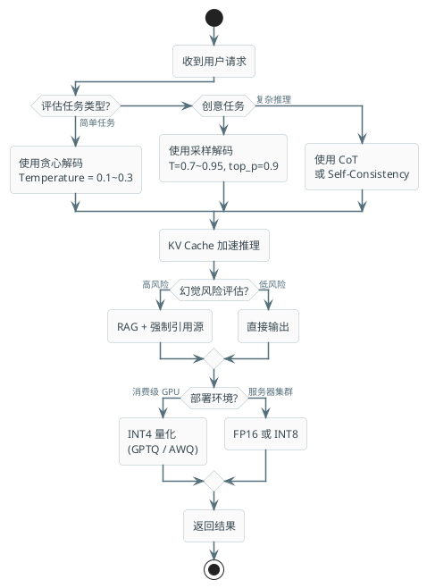
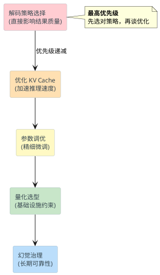

# 推理引擎与生成策略

:::tip 实战项目推荐
生成策略会直接影响回答质量、速度和稳定性。超级 AI 智能体在真实会话链路里承接这些参数选择，并结合流式输出、上下文控制和链路观测，帮助你理解推理阶段在项目里如何落地。

项目详细介绍：**[什么是超级 AI 智能体？](/super-agent/overview/project-intro)**
:::

大模型的推理过程看似简单——输入prompt，输出回复——但背后涉及一系列复杂的工程决策。从如何选择下一个token，到如何加速计算，再到如何处理模型的幻觉问题，每一个环节都会影响最终的效果和成本。这篇文档会带你深入理解大模型推理的全链路。

## 一、解码策略：从模型输出到真实文本

### 基础概念：概率分布到序列的映射

你可能想过一个问题：大模型是怎么生成文本的？

本质上，大模型在每一步都会输出一个概率分布。假设词表大小是50000，那么模型会给这50000个token各分配一个概率，这些概率加起来等于1。然后呢？我们需要从这个分布中选出下一个token。选择方式不同，就产生了不同的解码策略。

这个选择看似简单，实际上对结果影响很大：

```
输入: "北京是中国的"
模型输出概率分布: {
  "首都": 0.85,
  "城市": 0.10,
  "中心": 0.03,
  "地方": 0.02
}
```

选择哪一个？这决定了后续整个生成过程的走向。

### 贪心解码：最快但容易有问题

**贪心解码（Greedy Decoding）** 的逻辑最直接：每一步都选择概率最高的token。

```
第1步：选择"首都"（概率0.85）
第2步：选择"，"（概率0.90）
第3步：选择"位于"（概率0.88）
...
```

**优点：**
- 计算最快，零额外开销
- 完全确定性，同一输入永远同一输出
- 内存占用最少

**缺点：**
- 容易陷入低质量循环。比如生成"哈哈哈哈..."或"no, no, no..."
- 无法发现全局更优的序列。选择概率0.9的token很可能导致后续被概率0.1的token困住
- 输出缺乏多样性和创意

**什么时候用：** 分类任务、提取式任务、需要快速响应的factual QA。比如从用户消息中提取意图。

:::warning 常见误区
新手经常觉得贪心既然最快，就应该默认用它。实际上，贪心只适合"没有歧义"的任务。对于需要创意或多样性的任务（比如客服回复、创意文案），贪心会产生明显的机械感。
:::

### Beam Search：全局优化的权衡

**Beam Search** 的思路是：与其只保留一条最优路径，不如保留前B条候选路径。

想象你在过一个迷宫，贪心解码就是每个十字路口都选"看起来最清楚"的路；Beam Search则是同时探索前3条"看起来最清楚"的路，最后选哪条走完全程效果最好的。

```
步骤 0: [""] (初始，空序列)

步骤 1: ["北", "中", "这"] (top3概率的token)

步骤 2: 对每条路径继续扩展，保留全局概率top3的序列
  ["北京是", "北京的", "北京有"]
  (实际的组合会更多，但只保留top3)

步骤 3: 继续...

最终: 返回全局概率最高的完整序列
```

**参数说明：**
- `beam_width=3` 意思是保留前3条候选
- `length_penalty` 用来平衡长短序列。不加惩罚的话，模型倾向生成长序列（因为长序列的概率通常是累乘的，更小）

**优点：**
- 比贪心能找到全局更优的序列
- 有一定多样性（可以返回多条候选）
- 仍然是确定性的，可复现

**缺点：**
- 计算量是贪心的B倍。`beam_width=10` 意味着10倍计算量
- 最后的结果仍然比较"安全"和通用，不够新颖
- 对于生成长序列，Beam Search倾向于输出较短较通用的内容（因为短序列通常更"安全"）

**什么时候用：** 机器翻译、文本摘要、需要相对确定但质量不错的场景。

:::tip 面试要点
Beam Search的length_penalty很关键。面试官可能问：为什么Beam Search有时生成的序列比贪心还短？答案就在length_penalty上——需要显式调整它来平衡序列长度。
:::

### 采样策略：引入随机性

**采样（Sampling）** 的思路截然相反：不是确定性地选，而是从概率分布中随机抽取。

最朴素的采样方式是 **纯采样（Temperature=1）**：根据模型给的概率分布直接随机采样。

```python
# 假设模型输出
logits = [8.2, 6.1, 2.3, 1.8, ...]  # 原始输出
probabilities = softmax(logits)  
# 结果: [0.80, 0.15, 0.03, 0.01, ...]

# 纯采样：有80%概率选第一个token，15%概率选第二个...
next_token = sample_from(probabilities)
```

**问题：** 纯采样太随机了。有5%的概率会选中一个很不合理的token，导致生成质量急剧下降。你的客服chatbot突然回复"xyz荷兰鼠"这种离谱的内容。

所以实际生产中，我们用以下三个技巧来驯服随机性：

#### Top-K 采样

只考虑概率最高的K个token，其他token忽略。

```
原始分布: [0.50, 0.30, 0.10, 0.05, 0.02, 0.01, 0.01, ...]
K=3时保留: [0.50, 0.30, 0.10, ...]
重新归一化: [0.556, 0.333, 0.111]
从重新归一化后的分布采样
```

**问题：** K是固定的，但不同情况下最合理的K不一样。有时候前3个token就覆盖了99%的概率，有时候需要500个token才行。用固定的K=10就显得太粗糙。

#### Top-P 采样（核采样）

**Top-P（Nucleus Sampling）** 用一个更聪明的办法：动态选择。只保留概率累加起来等于P的那些token。

```
原始分布: [0.50, 0.30, 0.10, 0.05, 0.02, 0.01, 0.01, ...]

P=0.9时的流程：
- 第1个token: 0.50，累计0.50
- 第2个token: 0.30，累计0.80
- 第3个token: 0.10，累计0.90 ✓ (达到0.9)
- 第4个token: 0.05，累计0.95 ✗ (会超过0.9)

所以只保留前3个token，重新归一化后采样
```

这样做的好处是**自适应**。分布很尖锐（前几个token概率特别高）时，自动只保留少数token；分布很平坦时，自动保留更多token。

**推荐值：**
- `top_p=0.9` 是业界标准，平衡创意和稳定性
- `top_p=0.95` 更创意
- `top_p=0.7` 更保守

#### 温度（Temperature）

这是调节 "创意度" 最直观的参数。

```
原始logits: [8.2, 6.1, 2.3, 1.8]

温度T<1 (T=0.5)，logits变为: [16.4, 12.2, 4.6, 3.6]
应用softmax: [0.9999, 0.0001, 0.0000, 0.0000]
结果：几乎必定选第一个，非常确定

温度T=1，原始分布: [0.80, 0.15, 0.03, 0.02]
结果：相对均衡的采样

温度T>1 (T=2)，logits变为: [4.1, 3.05, 1.15, 0.9]
应用softmax: [0.55, 0.30, 0.10, 0.05]
结果：分布变平坦，每个token被选中的概率更接近，更随机
```

**直观理解：** 把温度比作烤箱的温度。
- 温度低（0.1）：冷却系统，概率分布"冻结"，只有最可能的token能被选中
- 温度适中（0.7）：正常烤制，好的选择有概率被选中，烂的不会
- 温度高（1.5）：高温，所有东西都能活跃起来，包括不合理的token

:::tip 面试要点
很多人搞混Top-P和Temperature，以为它们作用一样。其实不然：
- Temperature改变的是概率分布的形状本身
- Top-P是在分布生成后的后处理，截断长尾
- 它们可以一起用，比如先用T=0.8改变分布形状，再用top_p=0.9截断
:::

### 现代实践：组合策略

现在的生产系统基本都用 **采样 + Temperature + Top-P + Top-K** 的组合。比如旅游规划助手的配置：

```python
# 旅游规划助手的API调用
response = client.chat.completions.create(
    model="gpt-4-turbo",
    messages=[
        {"role": "system", "content": "你是一个旅游规划专家"},
        {"role": "user", "content": "帮我规划一个三天的泰国之旅"}
    ],
    temperature=0.8,  # 相对创意，提出多样化建议
    top_p=0.9,        # 保留合理的多样性
    top_k=50,         # 额外的保险
    max_tokens=2000
)

# 另一个例子：学术论文总结，需要高精度
response = client.chat.completions.create(
    model="gpt-4-turbo",
    messages=[
        {"role": "system", "content": "你是学术论文总结助手"},
        {"role": "user", "content": "总结这篇论文..."}
    ],
    temperature=0.2,  # 低创意，准确性优先
    top_p=0.8,        # 保守
    max_tokens=500
)
```

## 二、参数调优：Temperature、Top-P、Top-K详解

### 温度系数的三个境界

想象一下，你在街边摊问"推荐吃什么"：

- **T = 0.1（极冷）：** 老板只会说最受欢迎的菜。每次都一样。
- **T = 0.7（常温）：** 老板会推荐几个招牌菜，但主要还是热卖的。
- **T = 1.5（高温）：** 老板开始推荐冷门菜，甚至一些可能难吃的创意菜。

数学上，温度的作用是缩放logit：

```
原始logit: z_i
应用温度后: z_i / T
再应用softmax得到概率
```

T越小，logit的差异被放大（指数上升），导致最大值更接近1；T越大，差异被缩小，分布更均匀。

### Top-K 参数的局限

Top-K看起来简单粗暴：只保留前K个。但问题在于 **一刀切**。

```
情况1：生成"北京天气"
前5个token的概率: [0.70, 0.20, 0.05, 0.03, 0.02]
累计: 0.98（前5个就够了）
用K=5: ✓ 刚好
用K=20: ✗ 会引入太多噪声

情况2：生成创意故事开头
前5个token的概率: [0.15, 0.14, 0.13, 0.12, 0.11]
累计: 0.65（还不够多样性）
用K=5: ✗ 太保守
用K=20: ✓ 刚好
```

所以单独用Top-K容易出现"一个参数不能满足所有场景"的问题。

### Top-P 的自适应优势

Top-P的妙处在于 **质量驱动而非数量驱动**。

你想要的是"包含90%的好选项"，而不是"前面的50个选项"。Top-P做的正是这个。

```
衰减分布（常见）:
[0.50, 0.30, 0.10, 0.05, 0.02, 0.01, 0.01, 0.01, ...]
top_p=0.9: 只需前3个token

均匀分布（创意场景）:
[0.15, 0.15, 0.13, 0.12, 0.11, 0.10, 0.10, 0.09, ...]
top_p=0.9: 需要前7个token

Top-P自动适应了这两种分布，而固定的Top-K做不到
```

:::warning 常见误解
"Top-P和Top-K一起用的话，是不是会冲突？"

答案：不会，它们是互补的。Top-P先截断到累积概率P，然后在剩余的token中再应用Top-K。相当于双重保险。实际上大多数系统都是这样做的。
:::

### 场景化配置建议

**代码生成：精确性至上**
```
temperature = 0.2
top_p = 0.8
top_k = 40
```
为什么？代码必须准确，没有"创意"的空间。低温度保证确定性。

**创意写作：多样性至上**
```
temperature = 0.9
top_p = 0.95
top_k = 100
```
更高的参数给模型足够的自由度。但top_k的上限是为了避免太离谱。

**对话系统：平衡创意和稳定**
```
temperature = 0.7
top_p = 0.9
top_k = 50
```
这是比较中庸的配置。既有一定创意感（不显得机械），也不会太离谱。

**实际旅游规划助手示例：**

```python
class TravelPlannerAPI:
    def generate_itinerary(self, trip_info):
        """生成旅游行程"""
        # 场景：需要创意但也要有参考价值
        return self.llm.generate(
            prompt=self._build_prompt(trip_info),
            temperature=0.75,  # 相对创意，多样化建议
            top_p=0.9,         # 90%的概率质量
            max_tokens=2000,
            stop_sequences=["\n\n用户问:", "其他建议:"]
        )
    
    def summarize_attractions(self, descriptions):
        """总结景点信息"""
        # 场景：信息性文本，精确度重要
        return self.llm.generate(
            prompt=self._build_summary_prompt(descriptions),
            temperature=0.3,   # 低创意
            top_p=0.8,
            max_tokens=500
        )
    
    def brainstorm_activities(self, destination):
        """头脑风暴活动建议"""
        # 场景：创意至上
        return self.llm.generate(
            prompt=f"为{destination}提出10个独特的活动建议",
            temperature=0.95,  # 高创意
            top_p=0.95,
            max_tokens=1500
        )
```

## 三、KV Cache 与 Prompt Caching：加速推理的关键

### 为什么需要 KV Cache？

让我们看一个简单的例子。用户问："北京的天气怎么样？"

模型需要生成回复，比如："北京今天多云，气温25度..."

**没有KV Cache的流程：**

```
生成第1个token "北"：
  - 对输入做self-attention，计算Q、K、V
  - 矩阵操作
  
生成第2个token "京"：
  - 对输入 + 第1个token 做self-attention
  - 计算Q、K、V（包括对输入的重复计算！）
  
生成第3个token "今"：
  - 对输入 + 前2个token 做self-attention
  - 计算Q、K、V（又一次重复！）

... 重复数百次
```

看出问题了吗？输入部分（"北京的天气怎么样？"）的K、V被计算了数百遍。太浪费了。

**有KV Cache的流程：**

```
生成第1个token "北"：
  - 计算输入的K、V，缓存起来
  - 计算第1个token的Q
  - attention运算
  - 缓存第1个token的K、V
  
生成第2个token "京"：
  - 直接用缓存的输入K、V
  - 只计算第2个token的Q
  - attention运算
  - 缓存第2个token的K、V

生成第3个token "今"：
  - 直接用缓存的输入K、V和第1、2个token的K、V
  - 只计算第3个token的Q
  - attention运算
  - ...
```

区别很明显：用缓存避免了重复计算。

### KV Cache 的内存代价

虽然KV Cache大大加速了推理，但代价是内存占用。

对于一个7B参数的模型，假设推理时的sequence length是4096：

```
KV Cache大小计算：
- 层数：32层
- 注意力头数：32个头
- 每个头的维度：256维
- sequence length：4096
- 数据类型：FP16（2字节）

大小 = 2 × layers × heads × seq_len × head_dim × 2字节
     = 2 × 32 × 32 × 4096 × 256 × 2
     ≈ 8.6 GB（仅用于一个请求！）
```

如果有多个并发请求，内存占用会线性增长。这就是为什么大模型推理需要高端GPU（A100、H100有80GB显存）。

### 优化 KV Cache 的技巧

**1. Group Query Attention (GQA)**

传统的Multi-Head Attention是每个Query头都有自己的Key和Value。GQA让多个Query头共享一个Key和Value。

```
普通MHA: Q1-K1-V1, Q2-K2-V2, ..., Q32-K32-V32
GQA (分组数=4): 
  - Q1,Q2,Q3,Q4 共享 K1,V1
  - Q5,Q6,Q7,Q8 共享 K2,V2
  - ...
  
KV Cache缩小 32÷4 = 8倍
```

很多新模型（Llama2、Qwen）都用了GQA。

**2. KV Cache 量化**

不是存FP16，而是存INT8或FP8。这样内存减半。精度损失很小。

```python
# 伪代码
cache_fp16 = kv_states.to(torch.float16)  # 原始
cache_int8 = kv_states.to(torch.int8)     # 量化后，内存减半

# 使用时需要反量化：
kv_fp16 = cache_int8.to(torch.float16)
```

**3. Paged Attention (vLLM)**

核心思想：把KV Cache当成虚拟内存来管理。

```
物理内存布局：
Page 1: 请求A的KV Cache (位置0-127)
Page 2: 请求B的KV Cache (位置128-255)
Page 3: 请求A的KV Cache (位置256-383)
...

逻辑视图（从模型看）：
请求A: 虚拟地址 [0, 1, 2, ...]
请求B: 虚拟地址 [0, 1, 2, ...]

通过页表映射，可以灵活地在物理内存中放置KV Cache，
类似于操作系统的虚拟内存机制
```

这样做的好处是能更高效地利用显存，避免内存碎片化。vLLM用这个技术后，吞吐量能提升10倍。

### Prompt Caching：不同于 KV Cache

这是个容易混淆的点。**Prompt Caching 和 KV Cache 虽然名字接近，但完全不同。**

KV Cache是模型推理过程中的内部优化。Prompt Caching是跨请求的优化。

**场景：** 你在构建一个客服系统。系统提示（system prompt）有2000个token，包含公司政策、常见问题等。这个system prompt在每个用户请求里都会被使用。

**没有Prompt Caching：**
```
请求1: 计算system prompt的KV Cache (2000 token) + 计算用户消息
请求2: 重复计算system prompt的KV Cache (2000 token) + 计算用户消息
请求3: 重复计算system prompt的KV Cache (2000 token) + 计算用户消息
...
```

2000个token的计算被重复了数千次。太浪费。

**有Prompt Caching（OpenAI、Anthropic、DeepSeek都支持）：**

```
请求1: 计算system prompt的KV Cache (2000 token) → 缓存到服务器
        计算用户消息
        
请求2: 复用缓存的system prompt KV → 直接跳过2000个token的计算
        只计算用户消息
        
请求3: 复用缓存的system prompt KV
        只计算用户消息
```

**效果：** 相同的system prompt下，后续请求的TTFT（首字节延迟）大幅降低，成本也降低。

**限制：**
- 前缀必须完全相同。哪怕差一个空格都不会命中缓存
- 缓存有TTL（通常是5分钟）。如果5分钟内没有新请求，缓存会被清空
- 缓存大小有限（通常是request context的90%）

:::tip 面试要点
面试官问"怎样优化大模型推理延迟"，答案应该包括：
1. KV Cache（模型内）
2. Prompt Caching（跨请求）
3. Batch处理（增加吞吐）
4. 量化（减小模型大小，快速加载）

这些是从不同维度优化的。
:::

## 四、模型量化：大小与精度的权衡

### 量化的必要性

一个70B参数的模型，如果用FP16存储，需要 `70B × 2字节 = 140GB` 的显存。

现在GPU的显存情况：
- RTX 4090: 24GB（消费级天花板）
- A100: 80GB（数据中心标准）
- H100: 80GB
- 要部署70B模型？你需要多张A100/H100。成本爆炸。

所以大模型推理的现实是：**不量化，玩不了。**

### 量化基础：数据类型

```
FP32 (单精度): 4字节  - 精度最高，基本不用了
FP16 (半精度): 2字节  - 业界标准，精度损失微小
BF16: 2字节          - 精度稍差，但更稳定（浮点范围更大）
FP8: 1字节           - 精度损失可接受，显存减半
INT8: 1字节          - 整数，需要缩放因子
INT4: 0.5字节        - 极端压缩，精度明显下降
```

### 主流量化方案对比

| 方案 | 大小 | 推理速度 | 精度损失 | 难度 | 用途 |
|------|------|--------|--------|------|------|
| FP16 | 1x   | 1x基准 | 0      | 易   | 服务器部署 |
| INT8 (PTQ) | 0.5x | 1.2x   | 1-2%   | 易   | 服务器+边缘 |
| INT4 (GPTQ) | 0.25x | 1.5x | 3-5%   | 中等 | 消费GPU |
| INT4 (AWQ) | 0.25x | 1.5x | 2-3%   | 中等 | 消费GPU |
| INT4 (GGUF) | 0.25x | 1.0x | 3-5%   | 易   | 本地运行 |

### 量化方法详解

**Post-Training Quantization (PTQ)**

最简单的方案：训练后直接量化。

```
原始权重（FP16）: [0.123, -0.456, 0.789, ...]

步骤1：找到最大值max_val = 0.789
步骤2：线性缩放到INT8范围[-127, 127]
  缩放因子 scale = 127 / 0.789 = 161
  量化后：[20, -73, 127, ...]
步骤3：存储量化后的权重和缩放因子

推理时：
  量化权重 × scale = 原始权重（近似）
```

优点：快速、不需要数据、易实现。缺点：精度损失相对大，因为某个异常值（outlier）会导致整体缩放不佳。

**Quantization-Aware Training (QAT)**

训练时就模拟量化过程，模型学会"怎样在量化下工作"。

```
正常训练: 权重 → forward → loss → backward → 更新权重

QAT: 权重 → 量化模拟 → forward → loss → backward → 更新权重
     (在BP时不量化，只在FP中模拟)
```

优点：精度更好。缺点：需要大量训练数据和计算资源。

**GPTQ: Generative Pretrained Transformer Quantization**

用Hessian信息来做量化。思想是：不是所有权重都同样重要。

```
一阶导数告诉你"权重对loss的影响"
二阶导数（Hessian）告诉你"权重对loss的敏感度"

GPTQ: 优先保护高敏感度的权重，量化低敏感度的权重
```

实际操作是逐层量化，用很少的校准数据（几百个样本）就够了。

**AWQ: Activation-Aware Quantization**

GPTQ关注权重的重要度，AWQ关注激活值的分布。

核心观察：某些权重的激活值特别大（outlier），如果量化这些权重会导致很大的精度损失。

```
层输入激活: [0.1, 0.2, 50.0, 0.3, ...]  <- 出现了异常值50.0

量化权重时，同时考虑：
- 这个权重本身的大小
- 输入激活的大小分布

对于处理大激活值的权重，用更精细的量化方案
```

实验表明，AWQ的INT4量化相比GPTQ损失更小（通常比GPTQ快2-4%）。

**GGUF: 通用量化格式**

主要用于llama.cpp这样的本地推理框架。

```
Q4_K_M: 4-bit量化 with K-means
Q5_K_M: 5-bit量化
Q6_K: 6-bit量化
GGUF是一个容器格式，可以包含多种量化级别
```

优点：开源、易用。缺点：性能不如优化后的CUDA kernel。

### 量化选型指南

**场景1：云服务器部署（A100/H100）**
```
推荐：FP16 或 INT8 (PTQ)
理由：
- 显存充足（80GB）
- 吞吐优先，不需要极端压缩
- INT8只需重新量化，不需重新训练
- FP16最稳定，业界标准
```

**场景2：消费GPU（4090, 3090）**
```
推荐：INT4 (GPTQ或AWQ)
理由：
- 显存紧张（24GB），INT4勉强能跑
- GPTQ量化数小时，可以复用开源权重
- AWQ精度略好，但量化时间长
```

**场景3：本地笔记本运行**
```
推荐：INT4 (GGUF) + llama.cpp
理由：
- 开源、易用、内存高效
- 不依赖CUDA，可在CPU跑（慢，但能用）
- 预量化的权重易获取
```

**场景4：微调（Fine-tuning）**
```
推荐：QLoRA (4-bit base model + LoRA adapters)
原理：
- 基础模型用4-bit量化冻结
- 只训练LoRA adapter（1-2%的参数）
- 内存占用从24GB降到2GB
```

:::warning 常见误解
"INT4量化会损失5%精度，所以不能用于生产。"

这个观点过时了。现代的AWQ/GPTQ用INT4，精度损失在1-2%以内。对大多数应用来说可以接受。关键是用对量化方案。
:::

## 五、Chain-of-Thought：让模型显示思考过程

### 问题的本质

你可能遇到过这种情况：

```
用户: "张三有3个苹果，李四给了他2个，
       王五拿走了1个。张三现在有几个苹果？"

模型回答（不用CoT）: "张三有4个苹果。" ✓ 正确

但对于更复杂的问题：

用户: "一个工厂有12条生产线。
       每条线每小时产出48个零件。
       由于机器故障，其中3条线停止了。
       剩余的线需要赶完每天的2880个零件的配额。
       问题是什么？"

模型回答（不用CoT）: "需要时间 = 2880 / (9 × 48) = 6.67小时。" 
（实际上没理解问题问的是"配额是否能完成"）
```

模型失败了。原因是什么？

### 为什么 CoT 有效

一个假说：**人类之所以能解决复杂问题，不仅是因为智力，而是因为我们有"纸和笔"——能外化思考。**

一个数学家看到 `17 × 23 = ?`，不会脑子里直接蹦出答案，而是在纸上写过程：

```
  17
× 23
----
  51  (17 × 3)
340   (17 × 20)
----
391
```

Chain-of-Thought让LLM做同样的事：**显式地写出中间步骤，而不是一步到位。**

这有几个好处：

1. **错误可纠正**：如果中间步骤出错，能被发现
2. **计算更深**：写过程相当于用更多token，更多token = 更多"思考"空间
3. **可解释**：用户能看到推理过程，信任度提升

### CoT 的几种形式

**Few-Shot CoT：给例子**

```
用户给的prompt:
"问题：一个商店原有48件商品。
        今天上午卖了12件，下午卖了8件。
        问还剩多少件？

请这样回答（给出推理步骤）：
例1: 问题：小明有5个球，妈妈给了3个。问小明有几个？
     推理：初始有5个，加3个，所以5+3=8个。
     答案：8个

现在回答上面的问题。"

模型回答：
推理：
- 原有: 48件
- 上午卖: 12件，剩余 48-12=36件
- 下午卖: 8件，剩余 36-8=28件

答案：28件
```

这样就对了。

**Zero-Shot CoT：不给例子，直接提示**

有趣的发现：即使不给例子，只要加一句"让我们逐步思考"，效果也会显著提升。

```
不用CoT:
Q: "一共有多少只眼睛？3条狗，2只猫，1条鱼"
A: 14只眼睛 ✗ (其实是10: 狗6+猫4+鱼0)

用Zero-shot CoT:
Q: "一共有多少只眼睛？3条狗，2只猫，1条鱼。让我们逐步思考。"
A: 
- 狗: 每只2只眼睛，3条狗 = 6只眼睛
- 猫: 每只2只眼睛，2只猫 = 4只眼睛
- 鱼: 没有眼睛 = 0只眼睛
总计: 10只眼睛 ✓
```

仅仅加一句"让我们逐步思考"，正确率就从30%跳到90%。

**Self-Consistency：多路径投票**

生成多条独立的CoT推理链，然后投票选择最多出现的答案。

```
生成路径1: ... 推理过程 ... → 答案 = 10
生成路径2: ... 推理过程 ... → 答案 = 10
生成路径3: ... 推理过程 ... → 答案 = 11 (少数派)
生成路径4: ... 推理过程 ... → 答案 = 10
生成路径5: ... 推理过程 ... → 答案 = 10

投票结果：10票 vs 1票 → 最终答案 = 10
```

虽然计算量是原来的5倍，但准确性提升很多。

**Tree-of-Thought：探索多个分支**

CoT是线性的思考。Tree-of-Thought是发散式思考。

```
问题: "怎样从A城到达C城，只能经过B城，且不能走重复的路线"

普通CoT: A → B → C (一条路)

Tree-of-Thought:
       ① 路线1: A→B→C
       /  \
     ②   ③ 路线2: A→B→C (绕路)
      \  /
       ④ 路线3: A→C (无法，违反规则)
       
评估每条路线的可行性和成本，选最优的
```

### CoT 的局限

虽然CoT很强大，但有明显的局限：

**1. 不是所有任务都需要 CoT**

```
简单分类：
Q: "这是正面还是负面情绪？'太棒了！'"
CoT会显著拖累速度，不增加准确性
```

**2. 计算量和成本**

```
没有CoT: 50个token输出 = 50个token计费
有CoT: 300个token推理过程 + 50个token答案 = 350个token计费
成本增加7倍
```

**3. CoT 可能生成"虚假的推理"**

模型可能生成听起来合理但逻辑错误的推理链。用户会被迷惑。

```
Q: "3个苹果的质量是2个橙子的两倍。如果每个苹果100克，
    橙子的质量是多少克？"

虚假CoT推理:
"苹果质量 = 100克，3个苹果 = 300克。
 2个橙子 = 300克（因为是两倍）。
 所以橙子质量 = 150克。" ✓ 正确

但模型也可能生成：
"3个苹果 = 2倍的2个橙子。
 所以每个橙子 = 3个苹果的质量。
 橙子 = 100克。" ✗ 错误

两个回答的格式都是"CoT"形式，但一个对一个错
```

### 实战：旅游规划助手中的 CoT

```python
class TravelPlanner:
    def plan_trip_with_reasoning(self, user_query):
        """
        用户: "我有10天假期，预算3万，想去欧洲。
              哪些国家值得去？如何分配时间和预算？"
        """
        
        prompt = f"""
你是旅游规划师。请用以下格式回答，需要展示推理过程：

问题：{user_query}

推理步骤（请逐步思考）：
1. 约束分析：
   - 总时间：10天（考虑往返4天，实际游玩6天）
   - 总预算：3万元
   - 目标地区：欧洲
   
2. 国家选择：
   - 交通成本分析
   - 生活成本排序
   - 签证难度评估
   
3. 时间分配
4. 预算分配
5. 最终建议

请按上述步骤详细推理，然后给出具体行程。
"""
        
        response = self.llm.generate(
            prompt=prompt,
            temperature=0.7,  # 适度创意
            max_tokens=3000   # 足够的长度用于推理
        )
        
        return response
```

:::tip 面试要点
如果面试官问"怎样提升复杂问题的准确性"，CoT是必须要提的。但要注意补充：
1. CoT不是银弹，简单任务反而变慢
2. CoT的cost会显著增加
3. 虚假推理是风险，需要验证机制
4. Self-Consistency可以进一步提升准确性，但成本更高
:::

## 六、幻觉问题：模型的终极难题

### 什么是幻觉？

幻觉（Hallucination）指的是模型生成的内容明显错误或无根据，但却表现得非常自信。

```
例1：事实幻觉
用户: "巴黎是哪个国家的首都？"
模型: "巴黎是德国的首都。" 
（自信但完全错误）

例2：虚假引用
用户: "引用一下XXX论文关于CoT的结论"
模型: "根据Johnson et al. (2023) 的论文《Deep Chains of Thought》，
      他们证明了CoT能提升50%的推理准确性。"
（论文和结论都是编造的）

例3：前后矛盾
用户: "A公司的CEO是谁？"
模型: "A公司的CEO是张三。"
用户: "张三的学历是什么？"
模型: "张三毕业于MIT。"
用户: "但你刚才不是说A公司CEO是李四吗？"
模型: "是的，我刚才说了..." ✗ 前后矛盾
```

### 为什么模型会幻觉？

**根本原因：Next-Token Prediction 的目标**

大模型的训练目标是最大化下一个token的预测准确性，不是最大化整个句子的真实性。

```
句子："Paris is the capital of..."

模型看到这个前缀，它学到的是：
"这个位置最可能的token是'France'"
（基于训练数据的统计）

但没有显式的验证机制说"确认这个事实是真的"
```

**具体原因分析：**

1. **训练数据包含错误和矛盾**
   - 互联网上有假信息
   - 维基百科有编辑战和过时信息
   - 学术论文中也有错误

2. **分布外问题（Out-of-Distribution）**
   ```
   训练数据：主要是2020年前的信息
   用户问题：2025年的最新事件
   
   模型没见过这个信息，会基于概率生编
   ```

3. **模型倾向于生成"听起来合理"的内容**
   ```
   "巴黎是...的首都"这个模式，
   模型学到的是"首都"这样的补完经常出现
   
   具体是哪个国家的首都，模型的概率估计可能不准确
   ```

4. **Sycophancy（谄媚性）**
   ```
   用户说："我认为X是对的"
   模型倾向于赞同用户，即使X是错的
   
   原因：在RLHF中，人类标注者往往给出"和用户一致的回答"
   更高的分数（因为看起来对用户有帮助）
   ```

5. **多任务冲突**
   ```
   目标A：生成流畅自然的回答
   目标B：保证回答的真实性
   
   这两个目标不总是一致的。
   生成流畅的答案有时需要"添加细节"
   ```

### 幻觉的分类

**类型1：事实幻觉**
模型声称的某个事实与现实不符。
```
"2023年中国GDP是15万亿美元" ✗
（实际是~17万亿人民币≈2.4万亿美元）
```

**类型2：忠实度幻觉**
模型的回答与给定的文本/上下文矛盾。
```
文本："Jack是医生"
问题："Jack做什么工作？"
模型："Jack是律师" ✗
（与文本矛盾）
```

**类型3：语义不一致**
模型自己说的话前后不一致。
```
模型："这个方法有两个优点。第一...第二...第三..."
（说好两个，给了三个）
```

**类型4：虚假引用**
编造不存在的来源。
```
"根据《自然》杂志2025年的报告..."
（但这个报告不存在）
```

### 幻觉的治理方案

**方案1：RAG（Retrieval-Augmented Generation）**

不让模型凭记忆回答，而是从外部知识库检索相关文档，基于文档回答。

```
传统流程:
用户问 → 模型从参数中检索 → 回答

RAG流程:
用户问 → 检索引擎找相关文档 → 模型只在文档范围内回答 → 回答

优点：
- 回答可以追溯到来源
- 及时更新（知识库可以随时更新）
- 可信度高

缺点：
- 需要维护知识库
- 检索质量影响最终答案质量
- 增加延迟（需要先检索）
```

**方案2：Self-Verification（自我验证）**

让模型检查自己的答案。

```
步骤1：生成初始答案
Q: "巴黎是哪个国家的首都？"
A: "巴黎是德国的首都。"

步骤2：自我验证
追问模型：
"验证一下：德国的首都真的是巴黎吗？
如果不是，正确答案应该是什么？"

模型（有更多思考时间后）：
"我之前错了。德国的首都是柏林。
巴黎是法国的首都。"

问题：有时模型验证也会出错 ✗
```

**方案3：Citation Requirements（强制引用）**

要求模型的每个factual claim都必须引用来源。

```
系统提示：
"所有关于事实的陈述都必须用[来源X]标记。
如果无法找到来源，用[需验证]标记。"

模型回答：
"巴黎是法国的首都[来源：地理教科书]。
法国的人口约6700万[来源：世界银行数据库]。
最新的政府政策关于...这个我不确定[需验证]。"
```

**方案4：Constrained Generation（约束生成）**

限制模型只能输出已知的、预先验证过的答案。

```
例：电商推荐系统
用户问：这个产品有什么颜色选项？

不用约束：
模型可能回答："红色、蓝色、绿色..." 
（可能有不实的颜色）

用约束：
system_prompt = """
下面是本商品的真实信息：
{
  "colors": ["红色", "蓝色", "黑色"],
  "sizes": ["S", "M", "L", "XL"],
  "price": 299
}

用户问题只能根据上述信息回答。
"""

模型只能从列表中选择，不会幻觉出不存在的颜色
```

**方案5：Temperature Reduction（降低温度）**

幻觉通常与模型的"创意度"有关。降低温度让模型更保守。

```
高温度（T=1.0）：
"这个技术的未来应用..."
模型可能编造一些听起来合理的应用 ✗

低温度（T=0.1）：
"这个技术的未来应用..."
模型更可能说"基于当前的应用，应该..." ✓
或者"我不确定，需要进一步研究"
```

**方案6：Fine-tuning on Factual Data**

用更多真实数据微调模型，减少幻觉倾向。

```
数据集：
{"question": "Q", 
 "factual_answer": "A",
 "source": "Wikipedia",
 "verified": true}

模型在这样的数据上微调，学到"生成可验证的答案"
```

**方案7：Human Feedback Loops（人类反馈循环）**

用RLHF（强化学习from人类反馈）或DPO（直接偏好优化）训练模型避免幻觉。

```
标注数据：
问题："2022年中国GDP？"
回答A："约18万亿美元"（有问题，说的是万亿)
回答B："约18万亿人民币，约2.6万亿美元"（准确）

标注者标记：B > A

模型在这样的对比数据上训练，学到更准确的表达方式
```

### 工程现实：幻觉的风险管理

面对幻觉，正确的心态不是"消灭幻觉"（几乎不可能），而是"管理幻觉风险"。

```python
class HallucinationMitigation:
    def handle_user_query(self, query: str) -> dict:
        """
        旅游规划助手：如何应对幻觉
        """
        
        # 阶段1：识别高风险问题
        risk_level = self.assess_hallucination_risk(query)
        # 如 "最新政策是什么" 风险高（时效性强）
        # "什么是CoT" 风险低（通用知识）
        
        if risk_level == "HIGH":
            # 方案：结合RAG + 温度降低 + 强制引用
            response = self.rag_retrieval(query)  # 先检索
            return {
                "answer": response["answer"],
                "sources": response["sources"],
                "confidence": "HIGH (verified by sources)"
            }
        
        elif risk_level == "MEDIUM":
            # 方案：温度降低 + Self-consistency
            responses = [
                self.generate(query, temperature=0.3) 
                for _ in range(3)
            ]
            consistent = self.check_consistency(responses)
            return {
                "answer": responses[0],
                "consistency_score": consistent,
                "caveat": "如果答案前后有差异，请特别留意"
            }
        
        else:  # LOW risk
            # 可以用更高的创意度回答
            return {
                "answer": self.generate(query, temperature=0.7),
                "confidence": "NORMAL"
            }
    
    def assess_hallucination_risk(self, query: str) -> str:
        """评估问题的幻觉风险"""
        high_risk_keywords = [
            "最新", "今年", "最近", "现在",  # 时效性
            "真实", "验证", "确认", "事实",  # 需要精确
            "官方", "发布", "宣布",  # 特定来源
        ]
        
        if any(kw in query for kw in high_risk_keywords):
            return "HIGH"
        elif "?" in query and len(query) > 50:
            return "MEDIUM"
        else:
            return "LOW"
```

:::warning 常见误解
"用好的CoT就能解决幻觉问题。"

错了。CoT改善的是推理错误，不是幻觉。实际上，很多幻觉会藏在看似合理的CoT推理链中：
```
Q："意大利的首都是什么？"
错误CoT回答：
"意大利是南欧国家。南欧国家包括西班牙、
葡萄牙、希腊...根据这个模式，
意大利的首都应该是一个地中海城市。
威尼斯是意大利著名的地中海城市。"
答案：威尼斯

虽然推理链"看起来有道理"，但答案完全错了。
```

所以解决幻觉需要多管齐下，不能只靠一个技巧。
:::

## 总结：推理引擎设计的实战建议



**推理优化的过程：**



最后，记住这一点：**没有银弹。** 好的推理系统是多个技巧的组合——选对解码策略、用好参数、充分利用缓存、精确量化、认真对待幻觉。
