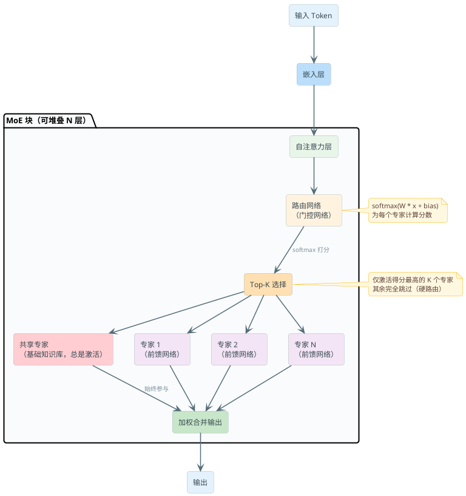

# MoE架构与模型部署选型

:::tip 实战项目推荐
MoE 的核心是“按问题选择合适专家”，这个思想在应用层也很重要。超级 AI 智能体里的知识路由和动态 Agent 路由，就是把类似的路由思路落到业务问题、知识域和执行能力选择上。

项目详细介绍：**[什么是超级 AI 智能体？](/super-agent/overview/project-intro)**
:::

你可能会问，现在的大模型参数量这么大（GPT-4都得用MoE），为啥不直接用Dense密集模型？这事挺有意思的。

传统Dense模型有个大问题：**每个token都要经过所有参数**。想象你在餐厅，无论点什么菜，厨房里所有员工都参与制作 —— 这太浪费了。有时候你只需要炸鸡厨师，结果甜点师、面条师都得跑出来。

MoE（Mixture of Experts）的核心思想就是：**把FFN层（前馈网络）拆成N个专家，每个token只激活top-K个最相关的专家**。这样做有几个好处：

- **参数效率**：总参数多（知识容量大），但每token只用少数参数（计算高效）
- **知识专业化**：某些专家专门处理代码，某些处理数学，某些处理闲聊
- **训练效率**：相同计算量下，MoE学得比Dense模型快

看个真实例子：
- **Mixtral 8×7B**：8个专家，每token激活top-2 → 总参数47B，每token用13B
- **DeepSeek V3**：256个专家+1个共享专家，top-8路由 → 总参数671B，每token只用37B
- **GPT-4**：官方没确认，但业界普遍认为是MoE架构

:::tip 面试重点
记住这个数字对比：**671B参数 vs 37B活跃参数**。这就是MoE的能力 —— 用大模型的知识容量，以小模型的推理成本。
:::

### 路由机制：谁决定去哪个专家？

MoE的关键在于**路由网络（Router Network）**。这东西很简单但很聪明：

```
Input Token
    ↓
[Router Network] → 输出每个专家的概率分布
    ↓
选top-K个得分最高的专家
    ↓
这K个专家处理token，其他专家被bypass
    ↓
加权求和输出
```

**硬路由 vs 软路由**：

- **硬路由**（Hard Routing）：只激活top-K个专家，其他完全不用。大多数MoE用这个，因为省计算量。
- **软路由**（Soft Routing）：所有专家都参与，但用概率加权。更平滑但计算贵。

DeepSeek V3用的是改进的硬路由：不仅看Router的分数，还在分数里加入**偏差项（bias term）**，用来引导负载均衡。这招很狡猾 —— 不需要额外的auxiliary loss，就能防止expert collapse。

:::warning 常见坑
很多人以为Router就是个全连接层。其实不是！Router通常是个轻量级网络（可能就是个Linear层），输入是token的表示，输出是expert数量那么多的logits。这个网络本身参数很少（几乎可以忽略），但要精心设计。
:::

### 负载均衡的问题

这是MoE最难的部分。想象餐厅里的员工调度 —— 如果所有单都被菜鸟接了，老员工却闲着，效率会很差。MoE也一样。

**Expert Collapse问题**：在训练早期，Router可能学会只用少数几个专家（比如前3个），其他254个专家就废了。为什么这么糟？

1. 浪费参数 —— 254个专家没用上，白白占显存
2. 欠优化 —— 没被使用的expert不参与梯度更新，永远学不好
3. 推理成本无法降低 —— 还是要把所有参数加载到显存

**解决方案1：Auxiliary Loss（辅助损失）**

加一个额外的loss，惩罚负载不均衡：

```
aux_loss = α * 负载标准差

总loss = 主loss + aux_loss
```

这样Router会被迫把tokens分散到更多专家。但有个缺点：需要调参α，太大了会影响主任务。

**解决方案2：DeepSeek V3的方法**

不用auxiliary loss，而是在Router的logits里加上**有偏差的偏置项**。每个专家有自己的偏差，导致不受欢迎的专家得分更高，能自动吸引tokens。这个偏差还随着训练更新，动态平衡。

效果超好 —— 负载均衡得很均匀，而且没有额外loss带来的副作用。

**负载均衡指标**

评估一个MoE模型好不好，看这个指标：

```
负载标准差 = std(每个专家收到的token数)
```

标准差越小越好，说明tokens分布得均匀。DeepSeek V3的负载标准差比其他模型低得多。

### 密集模型 vs MoE：一个选择题

现在你要给一个创业公司选模型，是用Dense的Llama 70B，还是用MoE的Mixtral 8×7B？不是那么简单。

| 维度 | Dense | MoE |
|------|------|-----|
| **训练效率** | 差 | 好（相同FLOP学得更快） |
| **推理成本** | 低 | 中（参数多，但token活跃数少） |
| **显存占用** | 占显存 | 占**更多**显存（需要全部参数） |
| **部署难度** | 简单 | 复杂（专家分布式放置） |
| **微调难度** | 简单 | 难（不知道哪些专家要微调） |
| **推理延迟** | 中 | 取决于部署方式 |

**其实要知道**：MoE对于推理不一定更快。虽然计算量少，但带宽要求大，显存占用多。如果你的GPU显存紧张，MoE反而会更慢。

但对于**训练**和**知识容量**，MoE绝对赢。这就是为什么GPT-4、DeepSeek V3都用MoE —— 它们要的是最强的能力，不怕计算复杂。

:::tip 面试重点
面试官可能会问："为什么GPT-4和DeepSeek V3都用MoE，但小模型很少用？"答案是：**大模型追求能力上限，小模型追求效率**。MoE的优势只在大规模模型体现。
:::

## 大模型部署框架对比

### 从模型权重到API服务

你下载了模型权重，现在怎么把它部署成一个API服务？这就是 **推理引擎（Inference Engine）** 的工作。

核心需求很简单，但实现很复杂：
- **高吞吐量**：一秒内处理尽可能多的请求
- **低延迟**：每个请求从输入到输出的时间尽可能短
- **内存高效**：显存装不下多个模型副本，要共享
- **灵活批处理**：能自动组织请求成批，充分利用GPU

为什么这么难？因为LLM推理的特点：
- **自回归生成**：一次生成一个token，不能并行
- **KV缓存爆炸**：Attention的Key和Value缓存随序列长度线性增长
- **动态批处理**：不同请求长度不同，生成时间也不同，很难高效调度

现在有四个主流框架，各有特色。

### vLLM：吞吐量之王

**核心创新**：PagedAttention

想象OS的虚拟内存管理 —— 物理内存不够，用磁盘分页。vLLM把这个思想用在KV缓存：

```
传统KV缓存：连续分配内存，浪费严重
    [已用][已用][预留但未用][预留但未用][预留但未用]

vLLM KV缓存（Paged）：动态分配，像内存分页
    [Block 1][Block 2][Block 3]...
    可以任意重组、共享、回收
```

这个简单的想法有巨大威力：

1. **内存利用率高**：显存碎片少
2. **高效的前缀共享**：多个请求共享同一个prompt的KV缓存，真的就是浅复制
3. **Continuous Batching**：请求不用等其他请求完成，动态加入/移除

**vLLM适合啥场景**：
- 高并发生产API（几十到几百并发）
- GPU服务器部署
- 对吞吐量敏感
- 主要用Transformer模型

**vLLM不适合**：
- CPU推理
- 延迟特别敏感的场景（Paged Attention有slight overhead）
- 某些特殊架构的模型

**实际部署例子**：客服系统

```bash
# 启动vLLM服务，部署客服专用模型
docker run --gpus all --ipc=host \
  -p 8000:8000 \
  vllm/vllm-openai:latest \
  --model qwen/Qwen2.5-32B-Instruct \
  --tensor-parallelism 2 \
  --gpu-memory-utilization 0.9 \
  --max-model-len 4096 \
  --disable-log-requests

# 调用API
curl http://localhost:8000/v1/chat/completions \
  -H "Content-Type: application/json" \
  -d '{
    "model": "qwen/Qwen2.5-32B-Instruct",
    "messages": [
      {"role": "user", "content": "我的订单在哪里？"}
    ],
    "temperature": 0.7,
    "max_tokens": 500
  }'
```

这个配置下，一个H100 GPU能处理几百并发的客服请求，而且能共享相同的系统prompt。

### TGI（Text Generation Inference）：生态友好

HuggingFace出品，很多模型是在HF上发布的，所以这个框架用得最舒服。

**特点**：
- **无缝HuggingFace集成**：model.md直接用，不用格式转换
- **Flash Attention内置**：自动优化
- **Continuous Batching** + **Dynamic Batching**都支持
- **量化支持**：bitsandbytes、GPTQ等
- **中文文档更完善**

**吞吐量**：略低于vLLM（5-15%差距），但体感上差不多。

**什么时候用TGI**：
- HuggingFace模型为主
- 中等流量（几十并发）
- 不想折腾复杂配置

### llama.cpp：边缘的大赢家

这个框架有点特殊 —— **纯CPU推理**，还能用GPU加速（可选）。

**核心特点**：
- **GGUF量化格式**：超级小。Qwen 7B能量化到2GB多
- **Metal支持**：Mac用户天选框架，MacBook上能跑70B模型
- **ARM NEON**：树莓派、手机上也能跑
- **无依赖**：单个可执行文件，开箱即用

**为什么这么小**？因为大量使用量化 —— int4、int8把模型压得很厉害。精度损失不大，但模型小几倍。

**什么时候用llama.cpp**：
- 本地开发/测试
- Mac开发者（真的爽）
- 边缘设备部署（树莓派、嵌入式系统）
- 成本极敏感（没有GPU云费用）
- 对延迟要求不是特别高的场景（聊天机器人、离线翻译）

**实际用途**：一个创业者在MacBook上本地跑客服bot做测试

```bash
# 下载量化后的Qwen 7B模型（GGUF格式）
llama-cli -m qwen7b-q4.gguf \
  -p "用户问题：我的订单怎么还没发货？\n回答：" \
  -n 256 \
  -t 8

# 或者用server模式暴露HTTP接口
llama-server -m qwen7b-q4.gguf -c 2048
```

延迟可能是秒级（一个请求几秒），但对测试和离线场景够用。

### SGLang：结构化生成的新星

最新的框架，专注于**结构化生成和复杂提示场景**。

**核心创新**：RadixAttention - 树形前缀缓存

```
传统：每个请求独立缓存
请求1: [系统prompt][用户输入1] → 缓存1
请求2: [系统prompt][用户输入2] → 缓存2
（系统prompt被缓存了两份！）

SGLang: 树形共享
       [系统prompt] ← 共享树根
        /         \
    [用户1]    [用户2]
```

太聪明了。特别是在agent场景，系统prompt + 工具定义是固定的，SGLang能完全共享。

**什么时候用SGLang**：
- Agent框架（ReAct、工具调用）
- 多轮对话系统
- 结构化输出生成（JSON、SQL等）
- 前缀缓存效果明显的场景

**坦白说**：SGLang还比较新，社区较小，文档不如vLLM丰富。但如果你的场景恰好是agent或结构化生成，值得试试。

### 选框架的决策树

```
开始
  ↓
是高并发生产API吗？
  ├─ 是 → vLLM（首选）
  └─ 否
      ↓
      是HuggingFace模型为主吗？
      ├─ 是 → TGI
      └─ 否
          ↓
          需要CPU推理或Mac支持吗？
          ├─ 是 → llama.cpp
          └─ 否
              ↓
              是agent或结构化生成吗？
              ├─ 是 → SGLang
              └─ 否
                  ↓
                  再考虑vLLM（保险选择）
```

## 评测指标体系

### 为什么评测这么重要？

"这个模型比那个模型好吗？" —— 这个问题看似简单，实际上没有绝对答案。不信的话看看业界评测排行榜，不同机构发布的排名顺序都不一样。

评测的目的就是定量回答：**在特定任务上，这个模型的能力如何**。

:::warning 常见误区
很多人看一个模型在MMLU上88分，就认为这个模型很强。错了。MMLU只是众多评测中的一个，而且有好多问题：
- **数据泄漏**：模型训练数据可能包含了MMLU的部分题目
- **格式过拟合**：模型学会了怎么在选择题上表现好，但不代表真的理解
- **静态基准**：MMLU2年没更新，模型的真实进展被低估了
:::

### 知识评测

**MMLU（Massive Multitask Language Understanding）**

57个科目，共约14000道选择题。涵盖：
- 数学、物理、化学、生物
- 历史、地理、政治
- 法律、会计、医学

这是业界公认的"通用知识考试"。一个模型能在MMLU上得90分，说明它的知识广度和深度都不错。

但有个问题：**美国偏重**。很多题目考美国历史、美国法律。对中文模型不公平。

**C-Eval（China Evaluation）**

中文版本的MMLU。4套试卷，共13000+题，覆盖：
- 中文理解
- 数学
- 常识
- 专业领域（医学、法律等）

C-Eval很重要，因为评估的是**中文能力**，而不是"能不能翻译英文题"。

**ARC（AI2 Reasoning Challenge）**

美国小学和初中的科学题。虽然题目简单，但考推理能力。模型在ARC上得分低，说明推理能力不行。

### 推理和问题解决

**GSM8K（Grade School Math 8K）**

8500道小学数学应用题。不是单纯计算，而是要读懂问题，分步骤解决。比如：

```
"小王买了3盒苹果，每盒12个。
他吃掉了一些后，还剩20个。
他吃了多少个？"
```

这个看着简单，但很多模型会算错。在GSM8K上得分好的模型，推理能力相对靠谱。

**HumanEval**

164道编程题，从简单的求阶乘到复杂的算法。模型要生成能运行的代码。

这个评测特别贴近实战。你要是准备做代码生成相关工作，一定得看模型的HumanEval成绩。

**Big-Bench Hard（BBH）**

200多道"难"任务：多步推理、逻辑、常识组合推理等。专门设计来难倒模型。

好的大模型在BBH上也不过80-90分，这说明这个基准真的难。

### 语言能力

**HellaSwag**

426道任务，给一个场景和几个句子开头，让模型选择最有可能的下一句。比如：

```
"我在厨房做饭，突然..."
A. "我发现了金子"
B. "烤箱提示食物准备好了"
C. "我的宠物狗开始唱歌"
D. "UFO出现了"
```

考察的是常识理解和语境连贯性。

**WinoGrande**

1000道代词消歧题。要理解上下文才能判断"他"指的是谁。比如：

```
"销售员告诉医生，我已经检查过了。"
"我"指的是谁？
```

这个考察的是**细致的语言理解**。

### 中文特定评测

**CMMLU**

中文版本的Big-Bench。覆盖67个学科，更全面地评估中文能力。

**GAOKAO**

中国高考题。如果一个模型在高考上得分不错（尤其是作文和阅读理解），说明它真的能处理复杂的中文。

### 评测指标的坑

1. **数据污染**：模型训练数据里可能包含测试集。官方的评测数据集被泄漏的不少。
2. **零样本vs少样本**：有的模型在zero-shot上表现差，但给几个例子（few-shot）就很强。
3. **格式对齐**：同一个任务，用不同的提示词，模型表现差别很大。
4. **样本量**：评测题目少的基准（比如只有100题）统计意义较弱。

:::tip 面试重点
"怎么评估一个模型？"答案不是看一个指标，而是**多个指标组合**。知识、推理、代码、安全性都要看。而且要**在你自己的任务上测试**，不能盲目信任公开排行榜。
:::

### 生产环境的评测

公开基准很重要，但最重要的还是**在自己的数据上测试**。

比如一个客服系统，要评测模型好不好，标准就是：
- **正确率**：回答问题是否准确
- **完成率**：能否理解并解决问题
- **用户满意度**：用户满不满意（A/B测试）
- **成本**：每条消息的成本（模型价格+基础设施）

这些指标往往比MMLU成绩更重要。

**关键部署指标**：
- **TTFT（Time To First Token）**：用户提交问题后，多久能收到第一个token。对用户体验很关键。
- **TPS（Tokens Per Second）**：模型每秒能生成多少token。直接影响响应速度。
- **吞吐量（Requests Per Second）**：单位时间内能处理多少个请求。
- **成本（$/百万token）**：通常是决定性因素。

---

## 模型选型方法论

### 选择题太多了

现在的开源模型多到爆棚：Llama、Qwen、DeepSeek、Mistral、GLM、Phi...每个系列还有好几个尺寸。怎么选？

不能上来就看排行榜。排行榜对**评测集的特定优化**，不代表对你的任务有帮助。

### 五步选型框架

#### 第一步：定义你的需求

最重要的问题，必须回答清楚：

1. **任务类型**：聊天、代码、翻译、分类、抽取...
2. **质量需求**：是否能容忍一些错误？容忍多少？
3. **延迟SLA**：能等多久？毫秒级还是秒级？
4. **吞吐量**：一秒多少请求？
5. **成本预算**：用API还是自部署？显存预算多少？
6. **语言需求**：只英文还是多语言？中文能力要多强？
7. **隐私要求**：数据能不能发到云端（用API）？必须本地部署吗？

坚诚填写这个问卷，会极大地缩小选择范围。

#### 第二步：粗筛候选

根据约束条件筛选：

- **显存约束**：你有多少显存决定了能跑的最大模型。
  - 8GB GPU → 7B模型max
  - 16GB GPU → 13-14B模型
  - 40GB GPU → 32B模型
  - 80GB GPU → 70B模型

- **语言支持**：不是所有模型都支持你需要的语言。
  - 中文首选：Qwen、DeepSeek、GLM
  - 多语言选手：Llama、Mistral

- **License**：商用吗？开源协议是什么？
  - Apache 2.0、MIT → 完全自由
  - LLAMA 2 LICENSE → 可商用，有限制
  - 某些模型 → 研究用途only

- **评测成绩**：在你关心的指标上有没有公开结果？

#### 第三步：关键指标对标

现在是2026年，主流模型大概这样分布：

**顶级选手（闭源API）**：
- GPT-4o：最强通用能力，代码/推理都顶
- Claude 3.5 Sonnet：代码最强，安全性好
- Gemini 1.5 Pro：长上下文（100K+token）

**开源大模型**：
- Llama 3.1 405B：通用能力很强，但推理没那么好
- DeepSeek V3 671B：MoE架构，知识容量大，推理强
- Qwen 2.5 72B：中文最强，代码也不错

**开源中等模型**：
- Llama 3.1 70B：均衡选手
- Qwen 2.5 32B：显存友好的中等模型
- DeepSeek-R1 32B：推理模型，数学/编程强

**开源小模型**：
- Llama 3.1 8B：最后的8B大哥
- Qwen 2.5 7B：中文7B里最强
- DeepSeek-R1 7B：小身材大推理

**极端小模型**（边缘部署）：
- Phi-3 Mini：最小但最聪明的小模型
- Qwen 2.5 3B：中文3B最强
- Gemma 2 2B：通用2B

#### 第四步：在你的数据上测试

不信排行榜，自己测。

最简单的测试：
1. 准备100道你关心的问题
2. 让几个候选模型回答
3. 人工评分或用强模型评分（GPT-4打分）
4. 计算准确率、平均响应时间、成本

这个测试成本很低，但能暴露排行榜看不到的问题。比如某个模型在MMLU上90分，但在你的客服问题上只有60分。

#### 第五步：考虑全景

最后考虑模型之外的因素：

- **部署成本**：显卡价格、租赁费用
- **维护成本**：有没有技术支持、文档完善度
- **社区**：活跃度如何，有没有现成的工具链
- **升级路线**：模型会不会有新版本，迁移难度
- **微调能力**：需要微调吗？哪个模型更容易微调

### 按使用场景的选择建议

#### 场景1：通用聊天机器人

最简单的选择 —— **用API**（如果你公司有预算）。

- 首选：Claude 3.5 Sonnet（安全性最好，对人类反馈最遵从）
- 次选：GPT-4o（通用能力强）

**为什么**？聊天机器人要求安全、准确、不胡说八道。闭源模型在这方面训练得更好。

如果非要自部署，选 **Qwen 2.5 72B**（中文好，通用能力不错）。

部署框架选vLLM，成本和性能的平衡点。

#### 场景2：代码生成/补全

这块专家模型很强：

- 顶级：Claude 3.5 Sonnet（代码最强）、GPT-4o
- 开源：DeepSeek-Coder 或 Qwen-Coder系列

关键指标：HumanEval成绩。

部署建议：
- 中等代码量？用llama.cpp在Mac上测试，然后上vLLM生产
- 企业编码助手？自部署一个70B模型，通常企业用户愿意为准确率付费

#### 场景3：数学/推理

这块是新潮流 —— **推理模型**（reasoning models）。

- DeepSeek-R1：推理之王，能一步步分析问题
- o1/o3（OpenAI）：最强但最贵

关键指标：GSM8K成绩（数学）。

:::warning 小心
推理模型往往生成很长的内部思考过程，再输出答案。这意味着延迟可能比较高。如果你的场景对延迟敏感，要考虑。
:::

#### 场景4：客服/多轮对话

需要理解context、维持人设的场景。

建议模型：
- 闭源：Claude 3.5 Sonnet（最稳定）
- 开源：Qwen 2.5 32B（显存友好）

部署框架选SGLang，因为可以有效缓存系统prompt和客服知识库。

#### 场景5：成本敏感 + 高量

流量大但预算紧的场景。策略：

1. 用小模型 + 微调，而不是大模型zero-shot
   - Qwen 2.5 7B微调 > Llama 70B zero-shot（在你的任务上）
2. 量化部署，压缩模型
3. 或者混合方案：简单问题用7B，复杂问题用32B

这样成本能降到原来的1/10。

#### 场景6：中文特定需求

中文能力强的模型：

- **最强**：Qwen 2.5 72B、DeepSeek V3
- **中等**：Qwen 2.5 32B、Llama 3.1 70B（中文能力在下滑）
- **小模型**：Qwen 2.5 7B（中文7B最强）

关键评测指标：C-Eval、CMMLU成绩。

#### 场景7：边缘设备/离线

只能用CPU或小GPU的场景。

唯一选择：**llama.cpp** + 量化模型。

用GGUF格式的量化模型（通常是int4或int5量化），可以在树莓派、Mac、手机上跑。

### 关键洞察

> **最好的模型不存在。只有最适合你的模型。**

排行榜告诉你"这个模型在average case表现好"，但你的情况往往不是average。

一个模型在MMLU上88分，在你的客服问题上可能60分。反过来也成立 —— 排行榜排名靠后的模型，在特定任务上可能无敌。

所以最聪明的做法是：**快速试错**。用几天时间在你的数据上测试3-5个候选模型，选表现最好的。别瞎琢磨。

:::tip 面试重点
"你怎么选择一个大模型？"好的答案不是"我选GPT-4"，而是"我会根据任务需求评估，在自己的数据上测试，综合考虑成本和延迟"。这说明你理解了模型选型的本质。
:::

## 架构图解

**MoE 混合专家模型结构**



**Router 机制**：softmax(W·x + bias)，选 top-K 个得分最高的 expert，其他完全 bypass（硬路由）

**Shared Expert**：所有 token 都经过，像是模型的"基础知识库"

---

**大模型部署框架对比**

| 框架 | 特点 | 适用场景 |
|------|------|--------|
| **vLLM** | 高吞吐量之王<br/>PagedAttention<br/>连续批处理<br/>张量并行 | GPU 服务器<br/>高并发 API<br/>对吞吐量敏感 |
| **TGI** | 生态友好<br/>HuggingFace 集成<br/>Flash Attention<br/>中等吞吐 | HuggingFace 用户<br/>中等流量<br/>不想折腾配置 |
| **llama.cpp** | 边缘之王<br/>CPU 推理<br/>GGUF 量化<br/>超级小 | 本地/Mac<br/>边缘设备<br/>成本极敏感 |
| **SGLang** | 结构化生成<br/>RadixAttention<br/>Agent 优化<br/>前缀缓存 | Agent 框架<br/>结构化输出<br/>多轮对话 |

## 总结与面试高频题

### 你需要记住的几个数字

- **Mixtral 8×7B**：47B参数，13B活跃
- **DeepSeek V3**：671B参数，37B活跃
- **vLLM PagedAttention**：显存利用率提升到70-90%
- **MMLU**：57科目，14000题
- **C-Eval**：4套试卷，13000+题

### 高频面试题

**Q1：为什么GPT-4用MoE而不是Dense？**

A：Dense模型虽然部署简单，但训练效率低，参数利用率差。MoE能用相同的训练FLOP学到更多知识（知识容量），代价是显存占用更多。对于追求能力上限的frontier模型，这个trade-off值得。

**Q2：MoE最大的问题是什么？**

A：Expert collapse —— Router学会只用少数几个专家，浪费大量参数。解决方案有两类：(1)Auxiliary loss惩罚不均衡，但需要调参；(2)DeepSeek V3的方法，在logits加偏差项，不需要额外loss。

**Q3：vLLM比其他框架强在哪？**

A：PagedAttention。类似OS虚拟内存的思想，把KV缓存分块，支持动态分配、高效共享和连续批处理。这个设计让GPU显存利用率大幅提升，可以处理更高的并发。

**Q4：怎么在自己的数据上评估一个模型？**

A：准备100-500条你关心的问题，让模型生成答案，用人工评分或让GPT-4评分。关键是**在你的分布上测试**，不能只看公开排行榜。

**Q5：小公司做客服应该选什么模型和框架？**

A：模型选Qwen 2.5 32B或DeepSeek-R1 32B（显存友好，质量好）。框架选vLLM（成熟稳定）或SGLang（能高效缓存系统prompt）。部署在4-6张40GB GPU上，能支持几百并发的客服请求。

---

## 推荐阅读与深化

- vLLM论文：《Efficient Memory Management for Large Language Model Serving with PagedAttention》
- DeepSeek技术博客：关于V3的负载均衡方案
- HuggingFace推理指南：量化、加速的最佳实践
- SGLang文档：结构化提示和前缀缓存

记住：**没有绝对的最优选择，只有对你的任务最合适的方案。多测试，多对标，快速决策。**
