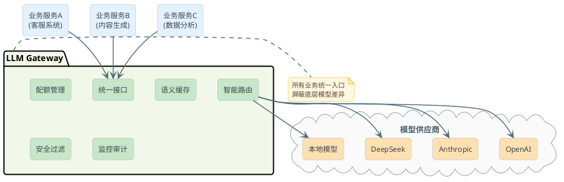

# 大模型网关的设计与落地

看到此章节你可能有这个疑问：我已经有 Nginx 了，有 Spring Cloud Gateway 了，为什么还需要单独搞一个"大模型网关"？

这个问题问得好，因为它恰好暴露了一个常见的误区——把 LLM 网关和传统 API 网关混为一谈。

### 传统网关管不了的事

传统 API 网关擅长的是：负载均衡、路由转发、限流熔断、协议转换。这些能力对普通的微服务接口调用来说完全够了。但大模型 API 有几个特殊性，让传统网关力不从心：

**计费单位不同**——传统 API 按请求次数计费或者干脆不计费，大模型按 token 数量计费。一个请求可能消耗 100 token，也可能消耗 10000 token。Nginx 不认识 token 这个概念，它没法做基于 token 的配额管理。

**响应模式不同**——大模型的流式输出（SSE）是一个长连接持续推送 token，传统网关的超时策略和负载均衡算法都不太适用。一个 SSE 连接可能持续 30 秒，你用轮询策略做负载均衡，某个节点可能因为几个"大请求"就被打满。

**模型之间不是简单的"上下游"关系**——你不是在多个相同服务实例之间做负载均衡，而是在能力不同、价格不同、速度不同的多个模型之间做智能路由。GPT-4o 贵但强，GPT-4o-mini 便宜但够用——什么时候该用哪个，这是传统网关做不到的决策。

**需要语义级别的处理**——Prompt 注入检测、敏感信息脱敏、语义缓存，这些都需要"理解"请求内容，不是简单的字节流转发。

### 网关放在哪里



所有业务服务不直接调模型 API，而是统一通过 LLM Gateway。Gateway 对外暴露一个标准化的接口（通常兼容 OpenAI 的格式），业务层调用的时候就像在调 OpenAI 一样，完全感知不到底层是哪个模型在工作。

## 核心功能模块拆解

一个生产可用的 LLM 网关，核心功能可以拆成这几块：

### 统一接口适配

不同模型供应商的 API 格式不一样：OpenAI 用 `messages` 数组，有些供应商用 `prompt` 字符串；参数命名也不统一，有的叫 `max_tokens`，有的叫 `max_output_tokens`。

网关对外统一暴露一套接口（业界惯例是兼容 OpenAI Chat Completions 格式），在内部做协议转换：

```java
public interface ModelAdapter {

    /**
     * 将统一格式的请求转换为供应商特定格式
     */
    ProviderRequest convertRequest(UnifiedChatRequest request);

    /**
     * 将供应商返回的响应转换为统一格式
     */
    UnifiedChatResponse convertResponse(ProviderResponse response);

    /**
     * 处理流式输出的每一个 chunk
     */
    UnifiedStreamChunk convertStreamChunk(ProviderStreamChunk chunk);
}

@Component
public class DeepseekAdapter implements ModelAdapter {

    @Override
    public ProviderRequest convertRequest(UnifiedChatRequest request) {
        // Deepseek 的 API 跟 OpenAI 基本兼容，但有些参数不同
        return ProviderRequest.builder()
            .url("https://api.deepseek.com/chat/completions")
            .body(Map.of(
                "model", mapModelName(request.getModel()),
                "messages", request.getMessages(),
                "temperature", request.getTemperature(),
                "stream", request.isStream()
            ))
            .build();
    }
}
```

这样做的好处是：业务代码只需要记住一个接口格式，换模型只改网关的路由配置，不需要改调用方的任何代码。

### 智能路由：不只是负载均衡

传统负载均衡是"把请求平均分到多个相同实例上"。LLM 网关的路由更复杂——你需要根据请求的特征，决定用哪个模型。

几种常见的路由策略：

**按任务类型路由**——简单的意图分类用便宜的小模型，复杂的长文写作用贵的大模型。网关可以先对请求做一个轻量级的分类（甚至用正则匹配），然后决定路由方向。

**按成本优先级路由**——工作日白天用户量大的时候优先走本地部署的模型（边际成本低），本地模型排队长了再溢出到云端 API。

**按模型能力路由**——需要代码生成的走擅长代码的模型，需要中文创作的走中文能力强的模型。

```java
@Component
public class SmartRouter {

    private final List<RoutingRule> rules;

    public ModelEndpoint route(UnifiedChatRequest request) {
        for (RoutingRule rule : rules) {
            if (rule.matches(request)) {
                return rule.getTargetEndpoint();
            }
        }
        return getDefaultEndpoint();
    }
}

// 路由规则示例：token 预估超过 2000 的用 GPT-4o，否则用 mini
@Component
public class TokenBasedRule implements RoutingRule {

    @Override
    public boolean matches(UnifiedChatRequest request) {
        int estimatedTokens = tokenEstimator.estimate(request.getMessages());
        return estimatedTokens > 2000;
    }

    @Override
    public ModelEndpoint getTargetEndpoint() {
        return endpointRegistry.get("gpt-4o");
    }
}
```

### Fallback 和容灾

模型 API 不是 100% 可靠。OpenAI 偶尔 503，某些地区的接入点延迟突然飙高，高峰期触发供应商的限流。

网关需要做的是：当主路由失败（连续 N 次报错、延迟超阈值、返回 429），自动把流量切到备用路由。

```java
@Component
public class FallbackHandler {

    private final CircuitBreaker circuitBreaker;

    public UnifiedChatResponse callWithFallback(UnifiedChatRequest request, 
                                                 List<ModelEndpoint> endpoints) {
        for (ModelEndpoint endpoint : endpoints) {
            if (circuitBreaker.isOpen(endpoint.getId())) {
                continue; // 这个节点正在熔断中，跳过
            }
            try {
                UnifiedChatResponse response = doCall(endpoint, request);
                circuitBreaker.recordSuccess(endpoint.getId());
                return response;
            } catch (Exception e) {
                circuitBreaker.recordFailure(endpoint.getId());
                log.warn("模型调用失败，尝试下一个: endpoint={}, error={}", 
                         endpoint.getId(), e.getMessage());
            }
        }
        throw new AllEndpointsFailedException("所有模型端点均不可用");
    }
}
```

:::info 实际案例
一种常见的配置是：主路由 OpenAI GPT-4o → 备用路由 Azure OpenAI GPT-4o（不同区域）→ 兜底 Anthropic Claude Sonnet。这样即使某一家供应商出问题，用户也不会感知到服务中断。
:::

### 限流与配额管理

这是 LLM 网关区别于传统网关的核心差异点之一。传统限流按"请求数"限——比如每秒最多 100 个请求。LLM 的限流需要按 token 来，因为一个消耗 50 token 的请求和一个消耗 5000 token 的请求，对成本的影响差了 100 倍。

网关通过给每个团队/服务分配独立的虚拟 Key 来实现配额隔离：

```java
@Component
public class QuotaManager {

    private final RedisTemplate<String, Long> redis;

    /**
     * 检查并扣减配额
     * @return true 表示配额充足，已扣减；false 表示超出配额
     */
    public boolean tryConsume(String virtualKeyId, int tokenCount) {
        String dailyKey = "quota:" + virtualKeyId + ":" + LocalDate.now();
        Long remaining = redis.opsForValue().get(dailyKey);
        
        if (remaining == null) {
            // 首次使用，初始化今日配额
            long dailyLimit = getDailyLimit(virtualKeyId);
            redis.opsForValue().set(dailyKey, dailyLimit, Duration.ofDays(2));
            remaining = dailyLimit;
        }
        
        if (remaining < tokenCount) {
            return false;
        }
        
        redis.opsForValue().decrement(dailyKey, tokenCount);
        return true;
    }
}
```

这样做的效果是：研发团队拿的 Key 每天限 100 万 token，产品线 A 的 Key 每天限 50 万 token。某个团队用超了只影响自己，不会殃及池鱼。月底算账也很清楚——每个 Key 的消耗量就是那个团队的成本。

### 成本追踪和可观测

网关天然是所有模型调用的"咽喉"，在这里做数据采集最方便也最完整。每次调用都记录下来：哪个服务调的、用的哪个模型、输入多少 token、输出多少 token、花了多少钱、耗时多久。

这些数据汇总起来就能回答：这个月总共花了多少钱？哪个服务最烧钱？GPT-4o 和 Deepseek 的使用比例是多少？有没有异常的消耗突增？

实际落地中，网关通常对接 Prometheus + Grafana 做实时监控，同时把详细的调用日志写到数据库或日志系统做离线分析。

### 语义缓存：省钱的利器

这是 LLM 网关最有意思的一个功能，也是传统网关完全做不了的。

**问题场景**：你做了一个客服机器人，用户一天问 500 次"怎么退款"，措辞略有不同——"退款流程是什么"、"我想退货怎么操作"、"退款要几天到账"。每一次都打底层模型，500 次调用、花 500 份钱，但其实答案差不多。

**语义缓存的思路**：不再精确匹配字符串，而是判断两个问题的"语义"是否相近。相近就直接返回之前的答案。

具体实现分三步：

1. 收到新请求后，先把用户问题用 Embedding 模型转成一个向量（可以理解为一个"语义指纹"）
2. 到向量数据库里做相似度检索，看有没有语义接近的历史问题
3. 如果相似度超过阈值（比如 0.92），直接返回历史答案；否则正常调 LLM，调完把问题向量和答案存入缓存

```java
@Component
public class SemanticCache {

    private final EmbeddingClient embeddingClient;
    private final VectorStore vectorStore;
    private final double similarityThreshold = 0.92;

    public Optional<String> tryHit(String userQuery) {
        // 1. 生成查询向量
        float[] queryVector = embeddingClient.embed(userQuery);
        
        // 2. 在向量库中检索相似问题
        SearchRequest searchRequest = SearchRequest.query(userQuery)
            .withTopK(1)
            .withSimilarityThreshold(similarityThreshold);
        
        List<Document> results = vectorStore.similaritySearch(searchRequest);
        
        if (!results.isEmpty()) {
            Document hit = results.get(0);
            // 3. 检查缓存是否过期
            if (!isExpired(hit)) {
                return Optional.of(hit.getMetadata().get("cached_answer").toString());
            }
        }
        return Optional.empty();
    }

    public void store(String userQuery, String answer, Duration ttl) {
        Document doc = new Document(userQuery, Map.of(
            "cached_answer", answer,
            "expire_at", Instant.now().plus(ttl).toEpochMilli()
        ));
        vectorStore.add(List.of(doc));
    }
}
```

:::warning 语义缓存的坑
阈值调太低会出现"张冠李戴"——"北京怎么退款"命中了"上海怎么退款"的缓存，答案里的地址和电话全是上海的。阈值调太高又几乎命中不了，白做了。实际操作中建议从 0.95 开始往下调，每降 0.01 观察一下误命中率。

另外，对时效性强的内容（天气、股价、库存数量）要设很短的 TTL 或者直接不缓存。
:::

## 自己设计一个 LLM 网关的思路

如果面试官问你"让你设计一个 LLM Gateway，你怎么做"，可以从这几个维度来组织回答：

### 核心模块划分

网关内部可以拆成这样几个模块：

**请求预处理管道**：认证（验证虚拟 Key）→ 限流检查 → 语义缓存命中检查 → Prompt 安全过滤 → 敏感信息脱敏

**路由决策引擎**：根据请求特征（模型指定、token 量预估、任务类型标签）决定打到哪个模型

**调用执行器**：实际发起对外部模型 API 的调用，处理流式/非流式两种模式，做超时控制和重试

**响应后处理管道**：输出安全过滤 → token 计量 → 配额扣减 → 日志记录 → 响应返回

**管理面板**：虚拟 Key 管理、路由规则配置、配额设置、使用量统计

### 高可用设计

网关本身不能成为单点故障。常见做法是网关无状态化部署多实例，配额数据和缓存放 Redis 集群。网关实例挂了一个，请求自动漂移到其他实例，用户无感。

## 主流方案怎么选

| 方案 | 语言 | 适合场景 | 特点 |
|------|------|----------|------|
| LiteLLM | Python | 快速搭建、模型覆盖广 | 支持 100+ 模型，社区活跃，OpenAI 兼容 |
| One API | Go | 国内团队、需要支持国产模型 | 部署简单，国内模型支持好 |
| Spring AI + 自研 | Java | 已有 Java 技术栈、需要深度定制 | 灵活度高，跟现有体系集成方便 |
| PortKey | 商业 | 不想自运维、需要完整功能 | 开箱即用，有托管版 |
| Kong AI Gateway | 商业 | 已有 Kong 基础设施 | 基于成熟网关扩展，运维体系复用 |

对于 Java 技术栈的团队，一个务实的选择是基于 Spring AI 自建轻量级网关：利用 Spring AI 已有的多模型适配能力，在上面加上配额管理、路由规则、缓存策略。这样跟你现有的 Spring 生态无缝集成，运维团队也熟悉。

对于想快速跑起来的团队，LiteLLM 或 One API 是更务实的选择——几个配置文件就能把多模型统一接入搞定，把精力放在业务逻辑上。

## 总结

回到最开始的问题：为什么不能用 Nginx 替代 LLM 网关？

因为 LLM 网关解决的根本不是"请求转发"的问题，而是"多模型管理"的问题。它需要理解 token、理解语义、理解模型之间的能力差异、理解按团队分账的业务需求。这些都不是传统网关的守备范围。

核心价值用一句话概括：**让业务代码不需要关心"底层用的是哪个模型、怎么保证可靠、怎么控制成本"这些脏活累活**。
