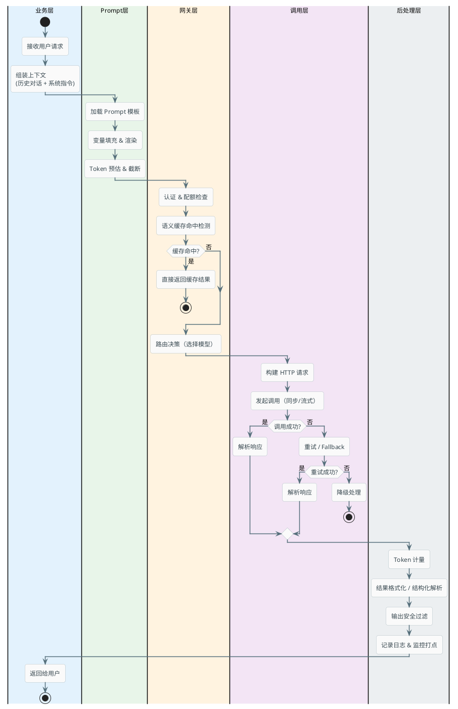

# 大模型API调用的工程化实践

:::tip 实战项目推荐
大模型 API 调用真正难的是把超时、流式、异常、上下文和审计串起来。超级 AI 智能体把一次对话拆成可观察的链路节点，能看到模型调用如何融入完整业务流程。

项目详细介绍：**[什么是超级 AI 智能体？](/super-agent/overview/project-intro)**
:::

## 一次生产级的大模型调用到底经历了什么

调一个大模型 API 看起来很简单——发个 HTTP 请求，等着拿结果。但在生产环境里，从你的业务代码发出请求到用户看到回答，中间经过了一条比你想象中长得多的链路。

### 完整调用链路



可以看到，一次看似简单的调用，实际上涉及 Prompt 组装、缓存检测、路由选择、调用执行、重试容灾、结果解析、监控记录这么多环节。每一个环节都有可能出问题，生产系统必须在每一环都有处理策略。

## 流式输出：让用户不再干等

### 为什么需要流式

大模型生成文本是逐 token 产出的。一个 800 字的回答，模型内部大概生成 400-500 个 token，按照每秒 30-50 token 的速度，完整生成需要 10-15 秒。

如果用同步模式等完整结果，用户就要面对 10 秒的空白等待。但如果每生成一个 token 就立刻推送给前端，用户在 200-500ms 内就能看到第一个字开始往外蹦，虽然总时间没变，但体验完全不同。

### SSE 协议是怎么工作的

目前大模型流式输出的主流方案是 SSE（Server-Sent Events）。它本质上就是一个持续不断的 HTTP 响应——服务端不关闭连接，持续往响应体里写数据。

一次流式调用的网络报文长这样：

```
请求：
POST /v1/chat/completions
Content-Type: application/json

{"model": "gpt-4o", "messages": [...], "stream": true}

响应（持续推送）：
HTTP/1.1 200 OK
Content-Type: text/event-stream

data: {"choices":[{"delta":{"content":"你"}}]}

data: {"choices":[{"delta":{"content":"好"}}]}

data: {"choices":[{"delta":{"content":"，"}}]}

data: {"choices":[{"delta":{"content":"我"}}]}

...

data: [DONE]
```

每一行 `data:` 就是一个事件，包含模型刚生成的一小块内容（通常是 1 个 token）。前端收到一个事件就渲染一个字，形成"打字机效果"。

### Java 端处理流式输出

用 Spring AI 处理流式输出的代码大致是这样：

```java
@GetMapping(value = "/chat/stream", produces = MediaType.TEXT_EVENT_STREAM_VALUE)
public Flux<ServerSentEvent<String>> streamChat(@RequestParam String message,
                                                 @RequestParam String sessionId) {
    return chatClient.prompt()
        .system(promptManager.getSystemPrompt("assistant"))
        .user(message)
        .stream()
        .chatResponse()
        .map(response -> {
            String content = response.getResult().getOutput().getContent();
            return ServerSentEvent.<String>builder()
                .data(content != null ? content : "")
                .build();
        })
        .concatWith(Flux.just(
            ServerSentEvent.<String>builder().data("[DONE]").build()
        ));
}
```

:::tip 前端对接注意
前端用 `EventSource` 或 `fetch` + `ReadableStream` 来消费 SSE。需要注意的是，`EventSource` 只支持 GET 请求，如果你需要 POST（比如发送的消息体比较大），就得用 fetch 的流式读取方式。
:::

### SSE vs WebSocket vs HTTP Chunked

| 特性 | SSE | WebSocket | HTTP Chunked |
|------|-----|-----------|--------------|
| 通信方向 | 服务端→客户端（单向） | 双向 | 服务端→客户端 |
| 协议 | HTTP | 独立协议 | HTTP |
| 自动重连 | 浏览器原生支持 | 需要自己实现 | 不支持 |
| 代理兼容性 | 好（标准 HTTP） | 一般（需要升级协议） | 好 |
| 适合场景 | 大模型流式输出 | 语音对话、实时协作 | 文件下载 |

对于大模型文本对话，SSE 是最优选择——实现简单、兼容性好、浏览器原生支持自动重连。只有当你需要双向通信（比如语音对话中随时打断），WebSocket 才是更好的选择。

## 重试策略：模型 API 挂了怎么办

大模型 API 的可用性没有你想的那么高。根据社区反馈，主流供应商的 API 每个月都会有几次可感知的抖动——短则几秒，长则几分钟。你的系统必须有应对策略。

### 哪些情况该重试，哪些不该

不是所有错误都应该重试。盲目重试反而可能加重问题。

**应该重试的**：
- HTTP 429（被限流）—— 稍后重试通常就能成功
- HTTP 500/502/503（服务端临时故障）
- 网络超时（可能是临时的网络抖动）

**不应该重试的**：
- HTTP 400（请求格式错误）—— 重试 100 次还是一样的错
- HTTP 401/403（认证失败）—— Key 过期了重试没用
- HTTP 413（请求体太大）—— token 超限，重试只是浪费时间

### 指数退避 + 随机抖动

重试不能"立刻重试"——如果 API 是因为过载而返回 429，你立刻重试等于在给火上浇油。正确做法是指数退避：第一次等 1 秒，第二次等 2 秒，第三次等 4 秒……再加上一点随机偏移，避免多个客户端在同一毫秒一起重试把 API 打爆（这叫"惊群效应"）。

```java
@Component
public class RetryableModelCaller {

    private static final int MAX_RETRIES = 3;
    private static final long BASE_DELAY_MS = 1000;

    public ChatResponse callWithRetry(ChatRequest request) {
        Exception lastException = null;
        
        for (int attempt = 0; attempt <= MAX_RETRIES; attempt++) {
            try {
                return doCall(request);
            } catch (RateLimitException e) {
                lastException = e;
                if (attempt < MAX_RETRIES) {
                    long delay = calculateBackoff(attempt);
                    log.warn("触发限流，{}ms 后重试 (第{}次)", delay, attempt + 1);
                    sleep(delay);
                }
            } catch (ServerErrorException e) {
                lastException = e;
                if (attempt < MAX_RETRIES) {
                    long delay = calculateBackoff(attempt);
                    log.warn("服务端错误，{}ms 后重试 (第{}次)", delay, attempt + 1);
                    sleep(delay);
                }
            } catch (ClientErrorException e) {
                // 400 系列错误不重试
                throw e;
            }
        }
        throw new ModelCallFailedException("重试耗尽", lastException);
    }

    private long calculateBackoff(int attempt) {
        long exponentialDelay = BASE_DELAY_MS * (long) Math.pow(2, attempt);
        // 加上 0-500ms 的随机抖动
        long jitter = ThreadLocalRandom.current().nextLong(500);
        return exponentialDelay + jitter;
    }
}
```

### 超时设置的考虑

大模型调用的超时设置跟普通接口不一样。普通接口超时设 3-5 秒很正常，但大模型生成一个完整回答可能要 15-30 秒。如果你把超时设成 5 秒，大部分请求都会超时。

但也不能设得无限长，不然一旦 API 卡死，你的线程池会被耗尽。

推荐的做法是分层设超时：

- **连接超时**：3-5 秒（TCP 连接都建不上的话，没必要等了）
- **首字节超时**：10-15 秒（对于流式请求，等第一个 token 的时间）
- **总超时**：60-90 秒（一个完整请求的最大允许时间）

```java
WebClient webClient = WebClient.builder()
    .clientConnector(new ReactorClientHttpConnector(
        HttpClient.create()
            .option(ChannelOption.CONNECT_TIMEOUT_MILLIS, 5000)
            .responseTimeout(Duration.ofSeconds(60))
    ))
    .build();
```

## 限流与降级：保护你的钱包和服务

### 客户端侧限流

除了网关层的限流，你的业务服务自身也应该有限流意识。场景举例：你的客服系统接入了大模型，某天来了一波 DDoS 攻击或者异常流量，如果不做限流，攻击流量会直接打到模型 API 上——一天烧掉几万块 token 费用。

```java
@Component
public class ClientSideRateLimiter {

    // 每分钟最多 60 次调用
    private final RateLimiter rateLimiter = RateLimiter.create(1.0); // 1 QPS

    public ChatResponse rateLimitedCall(ChatRequest request) {
        if (!rateLimiter.tryAcquire(2, TimeUnit.SECONDS)) {
            // 获取令牌超时，执行降级
            return degradedResponse(request);
        }
        return modelCaller.call(request);
    }

    private ChatResponse degradedResponse(ChatRequest request) {
        return ChatResponse.of("当前咨询量较大，请稍后再试。" +
            "您也可以查看我们的帮助中心获取常见问题解答。");
    }
}
```

### 降级策略

当模型 API 完全不可用或者配额耗尽时，不能让用户看到一个冷冰冰的错误页面。需要有预案：

**返回预设回复**——对于高频问题，提前准备好标准答案。模型挂了就用标准答案兜底。

**切换到低成本模型**——主力模型不可用时，临时切换到便宜的小模型。回答质量可能下降，但至少能用。

**排队等待**——如果是临时的限流（429），可以把请求放入队列，等限流解除再处理，给用户一个"排队中"的提示。

## 结构化输出：让模型返回你想要的格式

### 为什么需要结构化

大模型返回的是自然语言文本，但你的业务代码需要的是结构化数据。比如你让模型分析一封邮件，你想要的是一个包含"发件人意图"、"优先级"、"需要的操作"三个字段的 JSON，而不是一段描述性的文字。

如果只靠 Prompt 来约束输出格式（"请以 JSON 格式返回"），模型有时候会不听话——返回的 JSON 格式不对、多了个 markdown 代码块标记、漏了个字段。

### Spring AI 的结构化输出支持

Spring AI 提供了类型安全的结构化输出方式，让模型的返回值直接映射到 Java 对象：

```java
// 定义你期望的输出结构
public record EmailAnalysis(
    String senderIntent,      // 发件人意图
    Priority priority,        // 优先级
    List<String> actions,     // 需要执行的操作
    String summary            // 一句话摘要
) {
    enum Priority { HIGH, MEDIUM, LOW }
}

// 调用时直接指定返回类型
@Service
public class EmailAnalyzer {

    private final ChatClient chatClient;

    public EmailAnalysis analyze(String emailContent) {
        return chatClient.prompt()
            .system("你是一个邮件分析助手，根据邮件内容提取关键信息")
            .user("请分析以下邮件：\n\n" + emailContent)
            .call()
            .entity(EmailAnalysis.class);
    }
}
```

Spring AI 底层会自动做两件事：把 Java 类的结构信息作为格式约束注入到 Prompt 中；对模型返回的内容做 JSON 解析和校验。如果格式不对，它还会尝试让模型修正。

### 处理解析失败

即使有了结构化输出的约束，也不能保证 100% 成功（特别是在用一些能力较弱的模型时）。需要有兜底逻辑：

```java
public EmailAnalysis analyzeWithFallback(String emailContent) {
    try {
        return chatClient.prompt()
            .user("分析邮件：\n" + emailContent)
            .call()
            .entity(EmailAnalysis.class);
    } catch (OutputParsingException e) {
        log.warn("结构化解析失败，尝试宽松解析: {}", e.getMessage());
        // 尝试手动从非标准格式中提取
        String rawContent = chatClient.prompt()
            .user("分析邮件：\n" + emailContent)
            .call()
            .content();
        return manualParse(rawContent);
    }
}
```

## 幂等性：相同请求不要重复计费

网络抖动导致客户端没收到响应，于是重发了一次请求。如果没有幂等保护，同一个请求可能被执行两次——两倍的 token 消耗、两倍的费用、甚至可能给用户返回两条重复的消息。

实现思路很简单：客户端在每个请求上带一个唯一的请求 ID，服务端在处理前先检查这个 ID 有没有被处理过：

```java
@Service
public class IdempotentModelCaller {

    private final RedisTemplate<String, String> redis;

    public ChatResponse call(String requestId, ChatRequest request) {
        // 检查是否已处理过
        String cachedResult = redis.opsForValue().get("idempotent:" + requestId);
        if (cachedResult != null) {
            return deserialize(cachedResult);
        }

        // 首次处理
        ChatResponse response = modelCaller.call(request);
        
        // 缓存结果，24小时过期
        redis.opsForValue().set("idempotent:" + requestId, 
            serialize(response), Duration.ofHours(24));
        
        return response;
    }
}
```

## 总结：调用大模型 API 的生产清单

把前面的内容浓缩一下，生产环境调用大模型 API 需要关注的核心问题：

| 环节 | 关键点 | 常见做法 |
|------|--------|----------|
| 交互模式 | 选流式还是同步 | 对话场景用 SSE 流式，后台任务用同步 |
| 超时控制 | 分层设超时 | 连接 5s、首字节 15s、总体 60s |
| 重试策略 | 区分可重试和不可重试错误 | 指数退避 + 随机抖动，最多 3 次 |
| 限流 | 保护自己的钱包 | 客户端侧限流 + 网关侧配额 |
| 降级 | API 挂了要有预案 | 预设回复 / 切换低成本模型 / 排队 |
| 结构化输出 | 让模型返回可解析的格式 | Spring AI entity() + 兜底解析 |
| 幂等 | 避免重复调用浪费钱 | 请求 ID + Redis 去重 |
| 监控 | 知道系统在干什么 | Token 计量 + 延迟 + 错误率 + 成本 |

这些不是什么高深的技术，都是 Java 后端工程师熟悉的套路（重试、限流、缓存、监控），只是在大模型场景下有些特殊的考量需要注意。核心思想还是那个——**把不确定性控制在可接受的范围内**。
