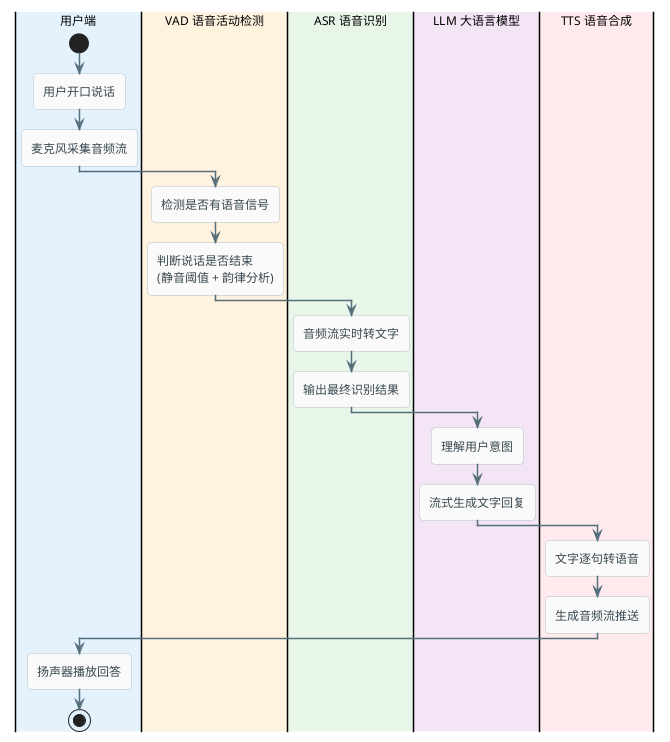
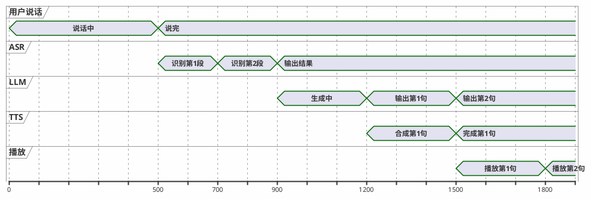
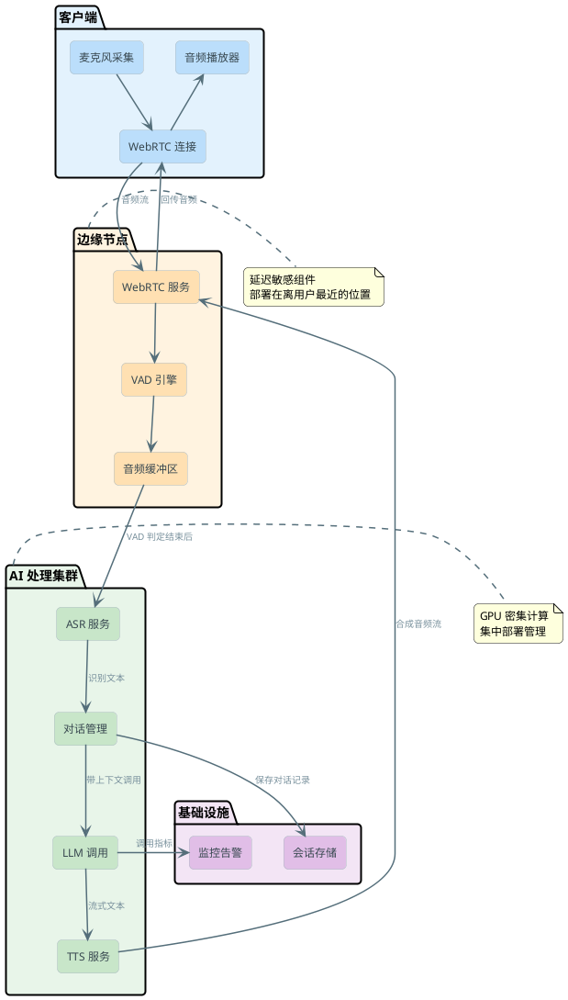

# AI语音Agent技术架构解析

文字对话已经很成熟了，为什么还要做语音？

因为很多场景下打字是不现实的：开车时想查导航、做饭时手上沾满面粉、老年人不会打字、客服热线的用户习惯了电话沟通。语音是人类最自然的交互方式，也是很多 AI 应用落地的关键入口。

但语音 Agent 和文字 Agent 的技术难度完全不在一个量级。文字对话的延迟要求是"秒级"，用户发一条消息，等 2-3 秒看到回复是可以接受的。语音对话的延迟要求是"亚秒级"——你说完一句话，对面 1.5 秒没响应，你就会觉得"是不是断了"。

### 核心技术链路

一次语音对话从你开口说话到听到回答，经历了这些步骤：



看起来简单，就是"听 → 理解 → 说"三步。但每一步都有技术挑战，而且这些步骤之间的衔接方式决定了整体延迟。

## VAD：怎么判断用户说完了

VAD（Voice Activity Detection，语音活动检测）是整个链路的第一环，也是最容易被忽视但又极其关键的一环。

### VAD 要解决的核心问题

用户对着麦克风说话，系统怎么知道：

1. **用户开始说话了**——从背景噪音中识别出有意义的语音信号
2. **用户说完了**——区分"正在思考停顿"和"这句话说完了"

第二个问题尤其难。人说话的时候会自然停顿——想一个词、喘口气、组织语言。如果 VAD 在每次停顿 0.3 秒的时候就判定"说完了"，用户一句话会被切成好几段，语义破碎。但如果等太久才判定结束（比如 2 秒静音），用户就会觉得系统反应太慢。

### 常见的 VAD 策略

**固定静音阈值**——连续静音超过 N 毫秒就认为说完了。简单粗暴，通常设 500-800ms。优点是实现简单，缺点是没法适应不同说话习惯（有些人说话就是慢，停顿多）。

**自适应阈值**——根据说话节奏动态调整。如果用户之前的停顿都在 300ms 左右，那突然出现 600ms 的停顿就很可能是说完了。但如果是一个说话比较慢的用户，600ms 可能只是在想词。

**基于模型的端点检测**——用一个小型神经网络来做判断，输入不只是"有没有声音"，还包括语音信号的韵律特征（是否是问句结尾的升调、是否是句末的语气）。效果最好但计算成本更高。

:::info 实际经验
工程上常见的做法是组合策略：先用简单的能量阈值做粗筛（静音检测），再结合前面已识别的文本内容做辅助判断。比如检测到文本已经是一个完整的问句（以问号结尾），就可以提前判定结束，不用等满全部静音时长。
:::

## ASR：把声音变成文字

ASR（Automatic Speech Recognition）负责将音频信号转换为文字。这一步的质量直接决定了后面 LLM 的理解是否正确——如果识别错了，模型再强也没用。

### 流式 ASR vs 整段 ASR

传统做法是等用户说完，把整段音频一次性发给 ASR 服务识别。但这样做有个问题：假设用户说了 5 秒钟，你得等 5 秒收完音频 + 1-2 秒识别，光这一步就 6-7 秒了。

**流式 ASR** 是更好的方案：音频一边采集一边往 ASR 服务发送，ASR 一边接收一边输出中间结果（partial results），最后输出最终结果（final result）。这样用户话还没说完，前半句的识别结果就已经出来了。

```java
// 流式 ASR 的处理逻辑示意
public class StreamingAsrHandler {

    private final AsrClient asrClient;
    private final StringBuilder partialResult = new StringBuilder();

    /**
     * 处理一段音频片段（通常 20-40ms 一帧）
     */
    public AsrEvent processAudioFrame(byte[] audioFrame) {
        AsrResponse response = asrClient.sendFrame(audioFrame);
        
        if (response.isFinal()) {
            // 最终结果——可以把这段文字交给 LLM 了
            String finalText = response.getText();
            return AsrEvent.finalResult(finalText);
        } else if (response.isPartial()) {
            // 中间结果——可以先展示给用户看（"我听到你说：xxx"）
            return AsrEvent.partialResult(response.getText());
        }
        
        return AsrEvent.none();
    }
}
```

### 选型考量

国内常用的 ASR 服务：阿里云语音识别、讯飞语音、腾讯云 ASR、百度语音。选型时主要看这几个维度：

- **识别准确率**：特别是在嘈杂环境下的表现
- **方言/口音支持**：如果你的用户遍布全国，方言支持很重要
- **流式延迟**：从音频帧发出到收到识别结果的延迟
- **并发价格**：按调用时长计费，并发量大的时候成本差异明显

## TTS：把文字变成声音

TTS（Text-to-Speech）做的事情和 ASR 相反——把 LLM 生成的文字回答转成语音。

### 流式 TTS 的必要性

跟 ASR 同理，如果等 LLM 把完整回答生成完（可能要 5-8 秒），再整段转语音（再花 1-2 秒），用户要等将近 10 秒才能听到第一个字。

正确做法是 **LLM 流式输出 + TTS 流式合成**：LLM 每输出一小段文字（比如一个句子），就立刻送给 TTS 合成，TTS 一边合成一边播放。这样用户在 LLM 开始生成后 1-2 秒内就能听到第一个字。

```java
public class StreamingTtsHandler {

    private final TtsClient ttsClient;
    private final StringBuilder sentenceBuffer = new StringBuilder();

    /**
     * 接收 LLM 流式输出的 token，累积到一个完整句子就送去合成
     */
    public Optional<byte[]> onToken(String token) {
        sentenceBuffer.append(token);
        
        // 检测是否构成完整句子（遇到句号、问号、感叹号）
        if (isSentenceEnd(token)) {
            String sentence = sentenceBuffer.toString();
            sentenceBuffer.setLength(0);
            
            // 送去合成并返回音频数据
            byte[] audioData = ttsClient.synthesize(sentence);
            return Optional.of(audioData);
        }
        return Optional.empty();
    }
    
    private boolean isSentenceEnd(String token) {
        return token.contains("。") || token.contains("？") 
            || token.contains("！") || token.contains(".");
    }
}
```

### 句子切分的技巧

你可能注意到上面的代码用标点符号来切分句子。这个策略简单但有个问题：如果模型输出了一个很长的句子（没有中间标点），用户就要等很久才能听到这一段。

更好的策略是：

- 遇到标点符号就切
- 累积超过一定字数（比如 30 字）即使没有标点也切
- 第一段可以更激进地切（哪怕只有 10 个字就送去合成），快速给用户第一个声音反馈

## 打断处理：用户随时可能插嘴

真实的语音对话里，用户经常打断对方——"停停停，我不是那个意思"、"跳过这段"。如果你的系统不支持打断，用户就得干等 AI 说完一大段才能开口，体验很糟。

### 打断检测的实现

核心思路是：TTS 播放的同时，VAD 持续在后台工作，监听麦克风输入。一旦检测到用户开始说话，就触发打断逻辑。

```java
public class InterruptionHandler {

    private volatile boolean isSpeaking = false; // 系统是否正在播放
    private volatile AudioPlaybackSession currentPlayback;

    /**
     * VAD 检测到用户开始说话时调用
     */
    public void onUserSpeechDetected() {
        if (isSpeaking) {
            // 系统正在播放回答，触发打断
            handleInterruption();
        }
    }

    private void handleInterruption() {
        // 1. 立刻停止 TTS 播放
        if (currentPlayback != null) {
            currentPlayback.stop();
        }
        
        // 2. 丢弃尚未播放的音频缓冲区
        audioBuffer.clear();
        
        // 3. 取消 LLM 正在进行的流式生成（省 token）
        cancelOngoingGeneration();
        
        // 4. 开始接收用户新的语音输入
        isSpeaking = false;
        startListening();
    }
}
```

### 打断的两种类型

**硬打断**——用户说了完全无关的新话题。比如 AI 正在解释退款流程，用户突然说"等一下，我想问个别的问题"。这种情况需要完全丢弃当前生成内容，开始处理新的请求。

**软打断**——用户只是插了一嘴表示理解，比如"嗯"、"好的"、"然后呢"。这种情况不应该打断，AI 应该继续说。

区分硬打断和软打断是一个比较难的问题。简单的做法是：打断语音超过某个时长阈值（比如 0.8 秒）才认为是硬打断，否则忽略。更精细的做法需要结合 ASR 的识别结果来判断——如果识别到的是语气词（"嗯"、"哦"），就当作软打断。

## 延迟优化：每一毫秒都是体验

语音对话的整体延迟 = VAD 判断时间 + ASR 识别时间 + LLM 生成时间 + TTS 合成时间 + 网络传输时间。

对于一个可接受的对话体验，**端到端延迟需要控制在 1.5 秒以内**。超过 2 秒用户就会明显觉得"卡"。

### 流水线并行

最大的优化手段是把各环节尽可能并行起来，而不是串行等待：



关键是：不要等一个环节完全结束再开始下一个。ASR 出了前半句的结果就可以开始做"预热"（比如查 Prompt 缓存）；LLM 出了第一个句子就立刻送 TTS；TTS 合成完第一段就立刻开始播放。

### 各环节的具体优化手段

**VAD 优化**：缩短静音判定阈值（但要平衡误判率）、结合 ASR 中间结果做联合判断。

**ASR 优化**：选延迟更低的识别引擎；对于特定领域的高频词汇，开启热词加速（提前告诉引擎"这些词经常出现"，识别更快）。

**LLM 优化**：用 TTFT 更低的模型（或本地部署的小模型）；Prompt 尽量简洁减少 token 数；开启 KV Cache 复用。

**TTS 优化**：第一段切分更短（10-15 字就送去合成），确保快速给出第一个声音反馈；预热 TTS 引擎避免冷启动延迟。

**网络优化**：使用 WebRTC 替代 WebSocket 进行实时音频传输；部署在靠近用户的边缘节点减少物理距离延迟。

## WebRTC vs WebSocket：实时音频传输怎么选

### WebSocket 的局限

WebSocket 是基于 TCP 的，TCP 追求的是"可靠有序"——丢了一个包就等着重传，后面的数据全部排队等。这在传文字的时候没问题，但传实时音频就有问题了。

假设网络抖动导致一帧音频（20ms）丢了，TCP 会重传这一帧，后面已经到达的音频帧全部在缓冲区等着。用户听到的效果就是：声音卡了一下，然后一堆音频挤在一起加速播放。

### WebRTC 的优势

WebRTC 底层用的是 UDP，它的哲学是"丢了就丢了，继续往前走"。对于实时音频来说，一帧 20ms 的音频丢了，人耳几乎感知不到。但如果为了重传这一帧让后面的音频都延迟 100ms，那反而更难受。

此外，WebRTC 还内置了：

- **自适应码率**——网络变差时自动降低音频质量保流畅
- **回声消除**——防止扬声器播放的声音被麦克风捡回来形成回声
- **噪音抑制**——过滤背景噪音（键盘声、空调声）
- **抖动缓冲区**——平滑网络延迟波动

这些能力用 WebSocket 都要自己实现，工作量巨大。

### 什么时候该用哪个

| 场景 | 推荐方案 | 原因 |
|------|----------|------|
| 实时语音对话 | WebRTC | 低延迟、容忍丢包、内置回声消除 |
| 非实时语音（录音转写） | WebSocket / HTTP | 需要完整音频不能丢帧 |
| 文字流式对话 | SSE / WebSocket | 不涉及音频，不需要 WebRTC 的复杂度 |
| 视频 + 语音 + 文字多模态 | WebRTC | 统一处理音视频流 |

## 端到端架构设计

把前面各个组件串起来，一个完整的语音 Agent 系统架构：



几个设计要点：

**边缘节点**负责 WebRTC 终端和 VAD——这些对延迟极其敏感的组件部署在离用户最近的地方。

**AI 处理集群**负责"重计算"——ASR、LLM、TTS 这些需要 GPU 或大量计算资源的服务集中部署。

**对话管理**是"大脑"——维护对话上下文，决定 LLM 该收到什么信息（之前聊了什么、用户的身份信息等）。

## 总结

语音 Agent 的核心挑战不在于某个单一技术有多难，而在于把 VAD + ASR + LLM + TTS 这条链路做到端到端延迟足够低、打断体验足够自然。

关键设计原则：

- **流水线并行**而非串行——每个环节的输出尽快喂给下一个环节
- **流式一切**——流式 ASR、流式 LLM 输出、流式 TTS 合成
- **容忍不完美**——20ms 的音频丢了无所谓，比延迟重传更好
- **打断即停**——用户一开口，系统立刻停止输出，不要让用户等
- **第一个声音要快**——TTFB（Time to First Byte of Audio）是用户感知延迟的核心指标
