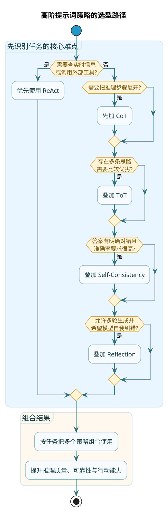
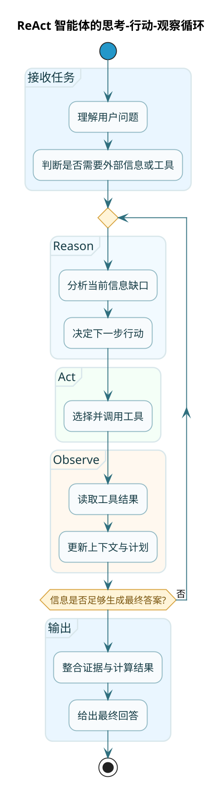

# 高阶提示词优化策略

:::tip 实战项目推荐
高阶提示词策略不能只停留在技巧层面，还要放到复杂任务链路中验证。超级 AI 智能体通过问题改写、动态 Agent、知识路由和多阶段执行，把提示词优化和系统编排结合起来。

项目详细介绍：**[什么是超级 AI 智能体？](/super-agent/overview/project-intro)**
:::

前面几章讲的技巧，主要解决的是"怎么跟 AI 说清楚要干嘛"。

但有些任务，光说清楚还不够。比如数学应用题、逻辑推理、复杂决策——这些需要 AI 真正"动脑子"，一步步思考才能得出正确答案。

这一章，我们来聊几种让 AI 变得更"聪明"的高阶技巧。



## 思维链（Chain of Thought）：让 AI 展示推理过程

**思维链**，英文叫 Chain of Thought，简称 CoT，是这几年最火的提示词技巧之一。

核心思想很简单：**不要让 AI 直接给答案，而是让它先把推理过程写出来，再得出结论**。

### 为什么需要思维链

你问 AI："小明有5个苹果，给了小红3个，又买了4个，现在有几个？"

AI 可能直接蹦出一个答案："6个"。

这个答案是对的（5-3+4=6）。但如果问题再复杂一点，AI 直接给答案就容易出错了。

为什么？因为 AI 在"脑子里"快速算了一下，但这个"快速计算"可能跳过了某些关键步骤，或者搞混了条件之间的关系。

思维链的做法是：让 AI 把每一步都写出来。

```
小明原来有5个苹果。
给了小红3个，还剩 5 - 3 = 2 个。
又买了4个，现在有 2 + 4 = 6 个。
所以答案是6个。
```

当推理过程被明确写出来时，两件好事会发生：
1. AI 更不容易出错，因为每一步都要"过一遍脑子"
2. 就算错了，你也能看出是哪一步出了问题

### 最简单的用法：加一句"魔法咒语"

:::tip 最简触发方式
最简单触发思维链的方式，就是在提示词末尾加一句话：

**"请一步一步思考"** 或者 **"Let's think step by step"**

就这么简单。很多时候，这一句话就能显著提升 AI 处理复杂问题的准确率。
:::

### 实战案例：物流成本计算

来看一个稍微复杂一点的例子：

**不用思维链**：
```
问题：某电商平台从上海仓库发货到北京，运费基准价 15 元/公斤，超过 10 公斤部分按 12 元/公斤计算。一个包裹重 25 公斤，运费多少？
```

AI 可能直接给个答案，但你不确定它算对没有。

**使用思维链**：
```
问题：某电商平台从上海仓库发货到北京，运费基准价 15 元/公斤，超过 10 公斤部分按 12 元/公斤计算。一个包裹重 25 公斤，运费多少？

请一步一步计算，写出完整的推理过程。
```

AI 的输出可能是这样：
```
让我分步计算：

1. 首先理解计费规则：
   - 前 10 公斤：15 元/公斤
   - 超过 10 公斤的部分：12 元/公斤

2. 这个包裹重 25 公斤，分成两部分：
   - 前 10 公斤
   - 超出部分：25 - 10 = 15 公斤

3. 计算各部分费用：
   - 前 10 公斤费用：10 × 15 = 150 元
   - 超出部分费用：15 × 12 = 180 元

4. 总运费 = 150 + 180 = 330 元

答案：运费是 330 元。
```

现在你能清楚地看到 AI 是怎么算的，如果有错也能立刻发现。

### 思维链的适用场景

- 数学计算和应用题
- 逻辑推理题
- 需要多步骤分析的问题
- 需要综合多个条件做判断的场景

:::caution 思维链的局限
**思维链不是万能的**：

1. 简单问题没必要用，反而浪费 Token
2. AI 的数学能力本身有限，思维链能帮助它不跳步骤，但不能让它学会新的数学知识
3. 有时候 AI 会"假装思考"，推理过程看着有逻辑，但其实是瞎编的
:::

## 自我一致性（Self-Consistency）：用投票提高可靠性

**自我一致性**是一种工程化的策略：**让 AI 对同一个问题思考多次，然后选择出现次数最多的答案**。

说白了就是"少数服从多数"。

### 为什么这招会管用呢

AI 的输出有随机性。同一个问题问两遍，可能得到不同的答案。

有时候其中一个是对的，另一个是错的。但你不知道哪个对。

自我一致性的思路是：问 5 遍或 7 遍，如果其中 4 次都给了同一个答案，那这个答案大概率是对的。

### 实现思路

```
步骤1：用同一个提示词调用 AI 多次（比如 5 次）
步骤2：收集每次的输出结果
步骤3：统计哪个答案出现得最多
步骤4：把出现最多的答案作为最终答案
```

在代码层面，可以这样实现：
- 并发调用 API，降低总耗时
- 适当调高 temperature 参数，增加输出的多样性
- 也可以用不同的模型分别调用

### 什么时候用自我一致性

- 答案有明确的对错（比如计算题、分类任务）
- 对准确率要求很高
- 能接受多次调用带来的成本增加

:::note 不适用场景
不适合的场景：
- 开放式生成任务（写文章、创意写作），没有"标准答案"可言
- 成本敏感的场景，调用一次的钱变成了调用五次
:::

### 一个有趣的变体：多视角投票

除了让同一个 AI 思考多次，还可以让 AI 从不同视角来思考同一个问题：

```
问题：要不要鼓励被霸凌的孩子打回去？

请分别从以下角色的视角思考这个问题，然后给出综合建议：
1. 作为孩子的父母
2. 作为学校老师
3. 作为儿童心理咨询师
4. 作为孩子本人

最后，综合各个视角的分析，给出你的建议。
```

这本质上还是"多次思考取共识"，只是每次思考的角度不一样，能得到更全面的分析。

## 思维树（Tree of Thoughts）：不满足于第一个答案

思维链是"一条路走到底"，一步一步往前推。

**思维树**则是"多条路并行探索"，然后挑最好的那条。

### 核心思想

想象你在下棋：
1. 面对当前局面，你想到了 3 种走法
2. 对每种走法，你都往后推演几步，预测对方怎么应对、你再怎么走
3. 比较三种走法的结果，选择对你最有利的那步

思维树就是把这个过程应用到 AI 推理中。

### 简化版实现

虽然论文里的思维树很复杂，但我们可以用一个简化版：

```
任务：设计一个高并发订单系统的技术方案

请按以下步骤进行：

步骤一：列出 3 种可行的技术方案
（不需要展开细节，每个方案用 2-3 句话描述核心思路）

步骤二：对每种方案，分析它的优缺点
（从性能、复杂度、成本、可维护性四个维度）

步骤三：综合比较，选择一个最优方案
（说明选择理由）

步骤四：对选中的方案，给出详细的实现建议
```

这种"先发散再收敛"的思路，比直接让 AI 给一个方案要靠谱。

## 反思机制（Reflection）：让 AI 自我纠错

**反思机制**的核心是：让 AI 先给出一个答案，然后让它自己审视这个答案，找出问题，再给出改进版。

### 为什么要自我反思

人类专家写文章，通常会经历"初稿 → 自查 → 修改 → 再查 → 定稿"这个过程。

AI 也可以这样。让它先生成一版，然后"换一个视角"来检查自己的输出，往往能发现第一次遗漏的问题。

### 实现思路

可以分成多轮对话来实现：

**第一轮：生成初稿**
```
任务：写一份项目进度报告，汇报上周的工作进展。

要求：
- 包括已完成、进行中、遇到的问题三个部分
- 语言简洁专业
```

**第二轮：自我反思**
```
请审视你刚才写的报告，回答以下问题：
1. 有没有重要信息遗漏？
2. 结构是否清晰？
3. 有没有表述不准确或可能引起误解的地方？
4. 如果领导只看 30 秒，能抓住重点吗？

根据你的审视，给出改进建议。
```

**第三轮：输出改进版**
```
根据你的改进建议，重新写一版报告。
```

### 工程化考量

:::caution 反思机制的代价
反思机制虽然好用，但要注意两个问题：

**响应时间**：每多一轮反思，就多一次 API 调用。如果是实时场景，可能等不起。

**上下文膨胀**：每轮对话都会累积上下文，可能超出模型的上下文窗口。需要配合"记忆压缩"等技术。

所以反思机制更适合离线任务、后台处理这类对实时性要求不高的场景。
:::

## ReAct 框架：让 AI 能"动手"

前面说的技巧，AI 都是在"想"，但没有"做"。

**ReAct**（Reason + Act）框架把"思考"和"行动"结合起来，让 AI 能够：
- 思考下一步该做什么
- 调用工具执行动作（比如搜索、查数据库、调 API）
- 观察执行结果
- 根据结果继续思考

这是打造"智能体"（Agent）的核心技术之一。

### ReAct 的工作流程

```
用户提问
    ↓
[思考] AI 分析问题，决定下一步该做什么
    ↓
[行动] AI 选择并调用一个工具
    ↓
[观察] 获取工具返回的结果
    ↓
[循环] 根据结果，继续思考→行动→观察，直到能回答问题
    ↓
[输出] 整合所有信息，生成最终答案
```



### 一个实际的例子

假设用户问："今天人民币对美元汇率是多少？如果我有 5000 美元，能换多少人民币？"

如果是普通的 AI 对话，它可能会编一个汇率数字给你（因为它的训练数据是过时的）。

用 ReAct 框架：

```
[思考] 用户想知道实时汇率和换算结果。我需要先查询实时汇率，然后进行计算。

[行动] 调用"汇率查询工具"，查询美元对人民币的实时汇率

[观察] 工具返回：1 美元 = 7.24 人民币（数据更新时间：2025-03-12 14:00）

[思考] 已经拿到实时汇率，现在可以计算了。5000 × 7.24 = 36200

[输出] 今天人民币对美元汇率是 7.24。您的 5000 美元可以兑换约 36,200 元人民币（汇率数据更新于 2025-03-12 14:00）。
```

### ReAct 的价值

:::info ReAct 让 AI 真正能干活
ReAct 让 AI 从"只会聊天"升级到"能干活"：
- 能查询实时信息（天气、股价、新闻）
- 能操作外部系统（发邮件、创建日程、提交工单）
- 能进行复杂的多步骤任务（订酒店+订机票+规划行程）

这是 AI 从"玩具"变成"工具"的关键一步。
:::

### 开源的 ReAct 实现

如果你想动手试试 ReAct，有一些开源项目可以参考：

**LangChain**：最流行的 AI 应用框架之一，内置了 ReAct 的实现，支持各种工具的集成。

**Camel-AI**：一个多智能体框架，让多个 AI 角色协作完成任务。

**OpenManus**：开源的通用智能体系统，借鉴了商业产品 Manus 的设计思路。

这些项目的核心都是 ReAct 架构的变体。

## 各种高阶技巧的关系

最后，梳理一下这几种技巧的关系：

**思维链（CoT）** 是基础，关注的是"单次调用中，怎么让 AI 更好地推理"。

**自我一致性**和**反思机制**是在 CoT 基础上的增强：
- 自我一致性：多次调用取共识
- 反思机制：多轮对话自我改进

它们都属于"让 AI 想得更好"的范畴。

**ReAct** 则是另一个维度：不只是想，还要做。它让 AI 能够与外部世界交互，执行实际任务。

在实际项目中，这些技巧经常组合使用。比如一个智能助手可能：
- 用 ReAct 来调用工具获取信息
- 用 CoT 来进行复杂推理
- 用反思机制来自查输出质量

## 本章小结

这一章介绍了四种高阶提示词优化策略：

1. **思维链（CoT）**：让 AI 展示推理过程，而不是直接给答案。最简单的触发方式是加一句"请一步一步思考"。

2. **自我一致性**：同一个问题问多次，选择出现最多的答案。适合有明确对错的任务。

3. **思维树（ToT）**：先发散（想多个方案），再收敛（选最优方案）。避免一条路走到黑。

4. **反思机制**：让 AI 审视自己的输出，找出问题并改进。适合对质量要求高的离线任务。

5. **ReAct 框架**：把思考和行动结合起来，让 AI 能调用工具、执行任务。是打造智能体的核心技术。

这些技巧不是互斥的，可以根据场景组合使用。

下一章，我们来聊聊怎么评估提示词的效果——怎么知道你的提示词好不好用，怎么系统性地优化迭代。
