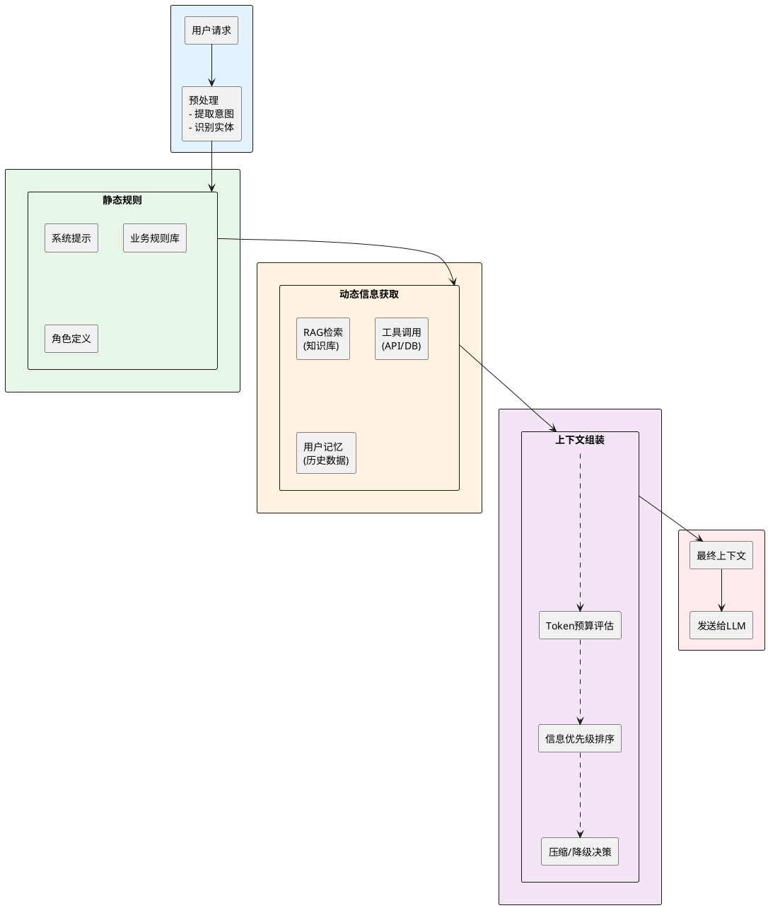
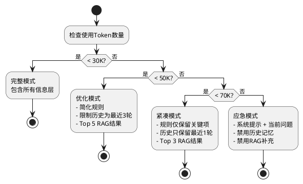

# 上下文工程实战指南

你之前可能听说过"提示词工程"（Prompt Engineering），但如果你在处理复杂的AI应用时，会逐渐发现**上下文工程**（Context Engineering）才是真正的瓶颈。

简单来理解的话，上下文工程就是**在正确的时间，给模型喂正确的信息**。听起来倒是很简单的，但实际上包含了很多的细节内容。

想象你在给一个AI客服员工培训。你不仅需要告诉它"你是个客服"（这是提示词），还需要：
- 给它公司的政策规则（静态规则）
- 给它当前用户的历史订单（动态信息）
- 给它实时的库存数据（工具调用结果）
- 给它之前这个用户的聊天记录（记忆管理）

这一整套东西就是**上下文工程**。而提示词工程只是其中一个小部分。

:::tip 核心区别
- **提示词工程**：关注单次交互中的措辞，追求"一句话说得好"
- **上下文工程**：关注应用的全生命周期，追求"持续给对的信息"
:::

## 从三个维度理解上下文工程

上下文工程和提示词工程的差异可以从三个维度来看：

| 维度 | 提示词工程 | 上下文工程 |
|------|---------|---------|
| **作用范围** | 单次对话/单个请求 | 整个应用生命周期 |
| **时间属性** | 静态（写死就行） | 静态 + 动态混合 |
| **优化目标** | 人可读性 | 机器可读性 + Token效率 |
| **信息来源** | 手工编写 | 系统生成 + 外部集成 |

关键点是：**上下文工程把信息分成两类**——那些在应用启动时就确定的"静态规则"，和那些运行时动态加载的"动态信息"。

```
提示词工程：告诉模型应该做什么
    ↓
上下文工程：告诉模型怎么做、用什么资源、记得什么历史
```

## 第一层：静态规则编排

静态规则是那些基本不变的东西，应该在应用启动时就加载好。包括三类：

### 系统提示词 (System Prompt)

这是给模型的加上一套"宪法"来约束它。一个好的系统提示词需要：

1. **明确角色定位**：你是什么，你不是什么
2. **行为约束**：你能做什么，禁止做什么
3. **输出格式**：期望的回复形式

例如，做一个电商推荐助手的系统提示词可能是这样：

```text
你是一个电商产品推荐专家。你的职责是：
1. 根据用户浏览历史和购买记录推荐相关产品
2. 解释推荐理由（为什么这个产品适合这个用户）
3. 提供客观的产品对比（优缺点）

约束条件：
- 只推荐库存充足的产品
- 禁止推荐价格超过用户平均购买价的3倍的产品
- 每次最多推荐5个产品
- 如果无法提供好的推荐，直接说"暂无推荐"，不要凑数

输出格式：
- 使用JSON格式
- 包含字段：product_id, product_name, reason, price, rating
```

### 角色和行为定义

这部分定义了模型在不同场景下应该如何表现。通常用结构化的方式写：

```text
## 角色设定
- 名称：电商推荐顾问
- 经验等级：资深电商分析师（10年经验）
- 专业领域：消费电子、家居用品、服装配饰

## 行为风格
- 分析深度：用户购买力分析、季节趋势、价格敏感度
- 建议方式：基于数据的客观推荐，不过度推销
- 沟通风格：专业但友好，用行业术语但解释充分

## 特殊处理
- 用户要求退款：支持，并记录退款原因供后续分析
- 用户质疑推荐：解释推荐逻辑，接受反馈
- 库存不足：主动提议替代方案或加入待购清单
```

### 约束规则库

把硬性约束写成规则库，这样便于维护和扩展：

```json
{
  "constraints": {
    "max_recommendations": 5,
    "price_limit_multiplier": 3.0,
    "min_product_rating": 3.5,
    "forbidden_categories": ["危险品", "假冒产品"],
    "max_response_tokens": 500,
    "language": "中文"
  },
  "business_rules": {
    "free_shipping_threshold": 100,
    "promotion_active": true,
    "vip_discount_percent": 10,
    "new_user_incentive": "满50元打8折"
  }
}
```

:::warning 静态规则的陷阱
如果约束规则太严格，模型会变得很"木讷"；如果太松散，模型容易越界。要定期检查规则的执行效果，不要写了就不管。
:::

## 第二层：动态信息挂载

静态规则只是基础，真正的威力来自于动态信息——那些在请求时才生成或加载的上下文。

### 什么是RAG注入

RAG（Retrieval Augmented Generation）是最常见的动态信息来源。简单说就是：**问题来了，我从数据库里查相关信息，然后一起给模型**。

例如，用户问"我适合买什么音箱"，你不能让模型胡说，你需要：

1. 从用户档案里查：这个用户的听歌偏好、房间大小、购买力
2. 从商品库里查：现在有哪些合适的音箱在售
3. 从评价库里查：类似用户对这些产品的评价

```
用户问题 ──→ 检索相关信息 ──→ 组合上下文 ──→ 发给模型 ──→ 生成回复
         (RAG层)              (上下文工程)
```

:::info 为什么RAG很重要
RAG解决了大模型的两个痛点：
1. **时效性问题**：模型训练数据是固定的，通过RAG可以引入最新数据
2. **幻觉问题**：模型容易编造，RAG提供真实的、可验证的信息源
:::

### 工具调用结果的挂载

当模型需要调用工具（比如查询库存、计算优惠价格），这些结果也要挂载到上下文里。

关键是**格式化工具返回值**：

```python
# 错误做法：直接把JSON贴上去
context = f"用户问了什么问题，工具返回：{raw_api_response}"

# 正确做法：结构化、可读的格式
context = f"""
[工具调用：查询库存]
- 产品ID：P123456
- 当前库存：45件
- 最后更新：2分钟前
- 发货地：北京仓

[工具调用：计算优惠价]
- 原价：￥899
- VIP折扣（10%）：-￥90
- 满300减30优惠：-￥30
- 最终价格：￥779
"""
```

### 用户历史和记忆管理

这是上下文工程中最有意思的部分。用户和模型的交互不是无状态的，你需要让模型记住关键信息。

但这里有个挑战：**历史记录会无限增长，Token会爆炸**。所以需要智能的记忆管理：

```
完整历史记录
    ↓
选择性总结（最后N次对话 + 重要事件）
    ↓
长期记忆（用户偏好、购买习惯、已知问题）
    ↓
短期记忆（当前对话的上下文）
```

实现方式可能是这样：

```python
class ConversationMemory:
    def __init__(self):
        self.recent_turns = []  # 最近5轮对话
        self.long_term_memory = {}  # 用户偏好、历史决策
        self.session_context = {}  # 当前会话的上下文
    
    def add_turn(self, user_message, assistant_response):
        """添加一轮对话"""
        self.recent_turns.append({
            'user': user_message,
            'assistant': assistant_response,
            'timestamp': datetime.now()
        })
        # 只保留最近5轮
        if len(self.recent_turns) > 5:
            self.recent_turns = self.recent_turns[-5:]
    
    def extract_memory(self, current_message):
        """根据当前消息，提取需要的记忆"""
        # 这里可以用嵌入向量来匹配相关的长期记忆
        relevant_memory = self.search_relevant(current_message)
        
        return {
            'recent_context': '\n'.join([
                f"用户：{turn['user']}\n助手：{turn['assistant']}"
                for turn in self.recent_turns
            ]),
            'long_term': relevant_memory,
            'session': self.session_context
        }
```

## 第三层：Token预算和降级策略

现在你的上下文里有系统提示、规则、RAG检索结果、工具返回值、历史记录……这一堆东西可能有几万个Token。问题来了：**怎么把这些信息有效地组织起来，不超出Token限制，又不丢失关键信息？**

### 理解40%阈值现象

这是一个实验发现的有趣现象：**当上下文使用达到模型总Token窗口的40%时，生成质量会明显下降**。

以168K Token的上下文窗口为例，40%就是约67K Token。在这个点之后：
- 模型开始"遗忘"早期信息
- 推理链条变短，逻辑变弱
- 幻觉概率上升

:::warning 实际启示
你不能把用户限制当作Token限制来用。如果用户可以生成10万Token的上下文，你应该：
1. 在7-8万Token就开始压缩
2. 在5万Token就主动降级到简化模式
3. 准备好在3万Token以下的应急方案
:::

### Token预算分配

一个良好的Token预算分配可能是这样：

```
总Token窗口：128K
    ├─ 系统提示 + 规则：5-10%（6-12K）
    ├─ 用户历史：10-15%（12-19K）
    ├─ RAG检索结果：30-40%（38-51K）
    ├─ 当前对话：20-30%（25-38K）
    └─ 模型生成空间：10-15%（12-19K）【必须保留】
```

一旦总使用超过50K（40%），触发压缩：

```python
class ContextBudgetManager:
    def __init__(self, max_tokens=128000, safety_threshold=0.40):
        self.max_tokens = max_tokens
        self.safety_threshold = int(max_tokens * safety_threshold)
        self.warning_threshold = int(max_tokens * 0.35)
    
    def allocate_context(self, components):
        """
        components: dict with keys:
            - system_prompt: str
            - rules: str
            - history: str
            - rag_results: str
            - current_query: str
        """
        total = sum(len(v.split()) * 1.3 for v in components.values())  # 粗略Token估算
        
        if total > self.safety_threshold:
            return self.compress_context(components)
        elif total > self.warning_threshold:
            return self.optimize_context(components)
        else:
            return components
    
    def compress_context(self, components):
        """触发压缩模式：删除不重要的信息"""
        return {
            'system_prompt': components['system_prompt'],  # 必须保留
            'rules': self.summarize(components['rules']),  # 简化规则
            'history': self.get_last_n_turns(components['history'], n=2),  # 只保留最后2轮
            'rag_results': self.top_k_results(components['rag_results'], k=3),  # 只要Top 3
            'current_query': components['current_query']  # 必须保留
        }
    
    def optimize_context(self, components):
        """优化模式：精简但保留信息"""
        return {
            'system_prompt': components['system_prompt'],
            'rules': self.prioritize_rules(components['rules']),  # 只要关键规则
            'history': self.get_last_n_turns(components['history'], n=3),
            'rag_results': self.top_k_results(components['rag_results'], k=5),
            'current_query': components['current_query']
        }
```

### 渐进式信息披露

不是一次性把所有信息都给模型。而是分层加载，按需求逐步提供更多细节。

```
第一层（最小集）：只有系统提示 + 当前问题
    ↓ 需要更多信息时
第二层（基础集）：加上RAG检索结果的摘要
    ↓ 还需要更多细节时
第三层（完整集）：加上历史记录、规则细节
    ↓ 必要时
第四层（专家集）：所有可用信息 + 诊断日志
```

这样做的好处：

1. **快速冷启动**：用户的第一次请求很快得到回复
2. **渐进优化**：如果回复不满意，可以加载更多信息重新处理
3. **成本控制**：多数请求只用最小集，省Token
4. **可调试性**：如果模型出错，可以逐层加信息找问题

## 第四层：上下文持久化和压缩

### 持久化的挑战

上下文不仅存在于单次对话，还要跨会话保存。关键问题是：

1. **存储成本**：每个用户的完整上下文可能很大
2. **检索效率**：下次用户回来时，怎么快速恢复上下文
3. **过时问题**：长期保存的信息可能过期了

### 智能压缩策略

不能直接存全量，需要压缩成"关键信息摘要"：

```python
class ContextCompressor:
    def compress_for_storage(self, full_context):
        """
        把完整上下文压缩成可存储的摘要
        """
        return {
            'user_profile': {
                'preferences': self.extract_preferences(full_context),
                'purchase_history': self.summarize_purchases(full_context),
                'known_issues': self.identify_issues(full_context),
                'vip_status': self.check_vip(full_context)
            },
            'session_summary': {
                'last_topic': self.get_last_topic(full_context),
                'unresolved_tasks': self.extract_tasks(full_context),
                'user_emotion': self.detect_satisfaction(full_context)
            },
            'metadata': {
                'last_update': datetime.now().isoformat(),
                'version': '1.0'
            }
        }
    
    def decompress_for_usage(self, compressed, context_budget):
        """
        从摘要恢复上下文，适应当前的Token预算
        """
        user_context = self.build_user_profile_prompt(compressed['user_profile'])
        session_context = self.build_session_prompt(compressed['session_summary'])
        
        total_tokens = len(user_context.split()) + len(session_context.split())
        
        if total_tokens < context_budget * 0.3:
            # Token充足，可以加载完整信息
            return self.load_full_context(compressed)
        else:
            # Token紧张，只加载关键摘要
            return user_context + session_context
```

## 第五层：实战代码示例

### 示例1：医疗健康咨询AI的上下文管理

假设你要建一个医疗健康顾问AI，需要处理用户的个人健康数据、医学知识库、诊疗历史。

```python
class HealthAdvisorContextManager:
    def build_context(self, user_id, current_query):
        """为健康咨询构建上下文"""
        
        # 1. 系统提示（固定）
        system_prompt = """
你是一个专业的健康咨询顾问。
职责：
- 根据用户症状提供初步健康建议
- 解释医学常识
- 提醒何时需要去医院

约束：
- 不能替代医生诊断
- 对不确定的情况，建议用户去医院
- 回复必须使用平易近人的语言
        """
        
        # 2. 用户健康档案（动态，但不经常变化）
        user_profile = self.fetch_user_profile(user_id)
        profile_context = f"""
用户档案：
- 年龄：{user_profile['age']}
- 性别：{user_profile['gender']}
- 已知疾病：{', '.join(user_profile['medical_history'])}
- 当前用药：{', '.join(user_profile['current_medications'])}
- 过敏记录：{', '.join(user_profile['allergies'])}
        """
        
        # 3. RAG：相似症状的医学知识
        similar_cases = self.rag_search(current_query, top_k=3)
        rag_context = "相关医学知识：\n" + "\n".join([
            f"- {case['title']}: {case['summary']}"
            for case in similar_cases
        ])
        
        # 4. 用户最近的咨询历史
        recent_history = self.get_recent_consultations(user_id, limit=2)
        history_context = "最近咨询记录：\n" + "\n".join([
            f"Q: {h['query']}\nA: {h['response'][:200]}..."
            for h in recent_history
        ])
        
        # 5. 组合最终上下文
        full_context = f"""
{system_prompt}

{profile_context}

{rag_context}

{history_context}

---
当前用户问题：{current_query}
        """
        
        # 6. Token预算检查
        if self.estimate_tokens(full_context) > 50000:
            # 压缩历史记录
            history_context = "最近咨询：用户曾询问过类似问题。"
            full_context = full_context.replace(
                f"最近咨询记录：\n" + history_context,
                f"最近咨询记录：{history_context}"
            )
        
        return full_context
```

### 示例2：电商推荐系统的多层上下文

```python
class ECommerceRecommenderContext:
    def build_recommendation_context(self, user_id, category, token_budget=50000):
        """为推荐系统构建分层上下文"""
        
        # 第1层：系统提示（永远包含）
        system_prompt = """
你是电商推荐专家。根据用户档案和当前类别，推荐5个最相关的产品。
要求：
- 推荐理由明确
- 包含价格和评分
- 考虑用户购买力和偏好
        """
        
        available_tokens = token_budget
        context_layers = []
        
        # 第2层：用户简档
        user_profile = self.fetch_user_profile(user_id)
        user_summary = f"""
用户档案：
- VIP等级：{user_profile['vip_level']}
- 平均购买价格：￥{user_profile['avg_price']}
- 主要关注类别：{', '.join(user_profile['interests'][:3])}
- 最近购买：{user_profile['recent_purchase']}
        """
        tokens_used = self.estimate_tokens(user_summary)
        if available_tokens > tokens_used:
            context_layers.append(user_summary)
            available_tokens -= tokens_used
        
        # 第3层：相关产品（按热度排序）
        if available_tokens > 5000:
            top_products = self.fetch_category_products(
                category, 
                user_profile=user_profile, 
                limit=10
            )
            products_context = "热门产品：\n"
            for p in top_products:
                if available_tokens < 1000:
                    break
                product_text = f"- {p['name']} (￥{p['price']}, {p['rating']}★)\n"
                products_context += product_text
                available_tokens -= self.estimate_tokens(product_text)
            context_layers.append(products_context)
        
        # 第4层：用户购买历史（如果还有Token）
        if available_tokens > 3000:
            history = self.fetch_purchase_history(user_id, limit=3)
            history_context = "购买历史：\n" + ", ".join([
                f"{h['product_name']}(￥{h['price']})"
                for h in history
            ])
            context_layers.append(history_context)
            available_tokens -= self.estimate_tokens(history_context)
        
        # 组合上下文
        final_context = system_prompt + "\n\n" + "\n\n".join(context_layers)
        
        return final_context, len(context_layers)  # 返回上下文和使用的层数
    
    def fallback_context(self, user_id, category):
        """简化模式：最小化上下文"""
        return f"""
你是推荐专家。根据 {category} 类别和用户档案推荐5个产品。

用户：VIP等级 {self.get_vip_level(user_id)}，购买力中等

要求：推荐理由清晰，包含价格。
        """
```

## 上下文工程的完整流程图

这是一个端到端的上下文管理流程：



## 上下文降级的决策树

当Token预算吃紧时，这是一个典型的降级决策过程：



## 常见的上下文工程失误和解决方案

### 失误1：信息堆积

很多人会想"多给点信息总没错"，结果把用户历史、所有产品信息、完整规则库都贴给模型。

:::warning 问题
- Token快速耗尽
- 模型变得"糊涂"，不知道哪个信息重要
- 生成变慢，成本上升
:::

**解决**：只挂载**当前请求相关的信息**。用向量搜索、语义匹配来挑选相关历史和RAG结果，而不是全部加载。

### 失误2：忽视记忆管理

用户历史不管理，直接全部保存，结果越来越多。

**解决**：
```python
def maintain_memory(user_id, max_turns=5, max_tokens=10000):
    """定期维护用户记忆"""
    history = get_all_history(user_id)
    
    # 方法1：只保留最近N轮
    history = history[-max_turns:]
    
    # 方法2：按重要性采样
    important = identify_important_turns(history)
    
    # 方法3：总结长期记忆
    summary = summarize_pattern(history)
    save_long_term_memory(user_id, summary)
    
    save_history(user_id, history[:max_turns])
```

### 失误3：规则写得太复杂

Rules规则库如果有几百条，模型要处理这些规则本身就消耗大量Token，反而降低了推理能力。

**解决**：
- 只保留**业务关键**的规则（禁止项、价格限制等）
- 把可选的、边界case的规则放到工具侧处理，不要给模型
- 定期审计规则，删除已过期的

### 失误4：忽视Token估算误差

很多人用Token数量 ÷ 字符数这样的简单公式，结果严重低估或高估。

**解决**：
```python
def accurate_token_count(text):
    """使用真实的Tokenizer来计数"""
    from transformers import AutoTokenizer
    tokenizer = AutoTokenizer.from_pretrained("gpt2")
    tokens = tokenizer.encode(text)
    return len(tokens)
    
# 或者调用API获取精确Token数
def get_token_count_from_api(text):
    # 调用LLM提供商的Token计数API
    pass
```

## 实战检查清单

在部署一个新的AI应用时，用这个清单检查上下文工程是否到位：

- [ ] 系统提示词是否清晰定义了角色和行为？
- [ ] 是否有明确的约束规则？规则是否可维护？
- [ ] RAG是否集成？相关度排序是否有效？
- [ ] 工具调用结果是否被正确格式化和挂载？
- [ ] 是否有用户记忆管理机制？
- [ ] Token预算分配是否合理？
- [ ] 是否实现了多层降级策略？
- [ ] 是否有监控系统来追踪"40%阈值"现象？
- [ ] 记忆压缩和持久化是否正确实现？
- [ ] 是否定期审计和优化上下文大小？

:::tip 一个健康的上下文工程系统应该是
- 模块化的：各部分可独立调整
- 可观测的：知道每一层用了多少Token
- 可演进的：支持动态调整降级策略
- 成本优化的：用最少Token达到最好效果
:::

## 总结

上下文工程不是一个一步到位的工作，而是一个持续优化的过程。从静态规则到动态信息，从信息堆积到精准投放，从固定预算到弹性降级，每一个环节都影响最终的AI应用质量。

关键是要**在有限的Token预算内，精准地控制模型的输入**。这需要：

1. 理解你的模型特性（尤其是那个40%阈值）
2. 设计合理的信息分层和降级策略
3. 持续监控和优化上下文的效率

做好这些，你的AI应用才能真正稳定高效地运行。
