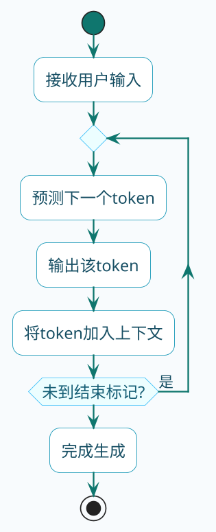
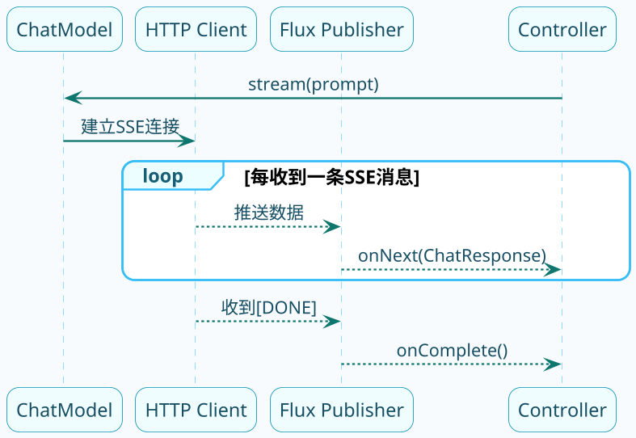

# 响应式流式输出详解

用过ChatGPT的人都知道，AI回答问题时是一个字一个字往外蹦的，而不是等全部生成完再一次性显示。这种"打字机"效果不是装酷，而是有实际意义——大模型生成长回答可能需要十几秒甚至更久，如果让用户干等着，体验会非常差。

这背后的技术就是**流式输出**。今天我们来深入聊聊它是怎么实现的。

## 大模型为什么适合流式输出

先从原理层面理解一下。

大模型的工作方式是**逐个预测token**。它不是一下子想好整段话再输出，而是：

1. 根据输入内容，预测下一个最可能的词
2. 把这个词加入上下文，继续预测下一个
3. 重复上述过程，直到生成结束标记



既然是逐个生成的，那完全可以生成一个就推送一个给用户，这就是流式输出的基础。

:::info 大模型逐 Token 生成原理
大模型的工作方式是**逐个预测 token**，每次预测下一个最可能的词并加入上下文，重复直到生成结束标记。这意味着可以边生成边推送，无需等待全部内容生成完毕。
:::

## SSE：流式传输的底层协议

### 什么是SSE

SSE（Server-Sent Events）是HTML5定义的一种服务器向客户端推送数据的技术，基于HTTP协议。

它的特点是：
- **单向通道**：只能服务器向客户端推送，客户端不能向服务器发数据
- **长连接**：一次HTTP请求建立后保持连接，服务器随时可以发送数据
- **文本格式**：数据以特定格式的文本流传输

### SSE的数据格式

SSE的响应数据有固定格式，每条消息以`data:`开头，以两个换行符结尾：

```
data: {"content": "你"}

data: {"content": "好"}

data: {"content": "！"}

data: [DONE]
```

来看一个真实的大模型SSE响应片段：

```
data: {"choices":[{"delta":{"content":"我是"}}],"model":"qwen-plus"}
data: {"choices":[{"delta":{"content":"通义"}}],"model":"qwen-plus"}
data: {"choices":[{"delta":{"content":"千问"}}],"model":"qwen-plus"}
data: {"choices":[{"delta":{"content":"，"}}],"model":"qwen-plus"}
data: {"choices":[{"delta":{"content":"有什么"}}],"model":"qwen-plus"}
data: {"choices":[{"delta":{"content":"可以"}}],"model":"qwen-plus"}
data: {"choices":[{"delta":{"content":"帮您"}}],"model":"qwen-plus"}
data: {"choices":[{"delta":{"content":"的？"}}],"model":"qwen-plus"}
data: [DONE]
```

每一行都是一个独立的数据块，客户端收到后实时展示。

## Java中实现流式输出的三种方式

在Spring中有几种方式可以实现SSE，我们来逐个分析。

### 方式一：SseEmitter

SseEmitter是Spring MVC提供的工具类，专门用于服务器推送：

```java
@RestController
@RequestMapping("/sse")
public class SseController {
    
    @GetMapping("/demo")
    public SseEmitter streamDemo() {
        // 创建SseEmitter，设置超时时间
        SseEmitter emitter = new SseEmitter(40000L);
        
        // 异步执行，逐条发送数据
        Executors.newSingleThreadExecutor().submit(() -> {
            try {
                String[] words = {"今天", "天气", "不错", "，", "适合", "出门"};
                for (String word : words) {
                    emitter.send(word);
                    Thread.sleep(300);  // 模拟逐字生成
                }
                emitter.complete();  // 正常结束
            } catch (Exception e) {
                emitter.completeWithError(e);  // 异常结束
            }
        });
        
        return emitter;
    }
}
```

**优点**：不需要引入额外依赖，Spring MVC原生支持  
**缺点**：代码比较冗长，需要手动管理线程和异常

### 方式二：StreamingResponseBody

StreamingResponseBody是一个函数式接口，允许你直接操作输出流：

```java
@GetMapping("/stream")
public ResponseEntity<StreamingResponseBody> streamResponse() {
    StreamingResponseBody body = outputStream -> {
        String[] words = {"订单", "已", "确认", "，", "正在", "处理"};
        for (String word : words) {
            outputStream.write(("data: " + word + "\n\n").getBytes(StandardCharsets.UTF_8));
            outputStream.flush();  // 强制刷新缓冲区
            Thread.sleep(300);
        }
    };
    
    return ResponseEntity.ok()
            .header(HttpHeaders.CONTENT_TYPE, MediaType.TEXT_EVENT_STREAM_VALUE)
            .body(body);
}
```

**优点**：控制粒度细，适合需要自定义输出格式的场景  
**缺点**：代码还是偏底层

### 方式三：Flux（推荐）

Flux是Reactor框架提供的响应式类型，代表一个异步的数据序列。这是Spring AI使用的方式，也是最推荐的方式：

```java
@GetMapping(value = "/flux", produces = MediaType.TEXT_EVENT_STREAM_VALUE)
public Flux<String> fluxStream() {
    return Flux.interval(Duration.ofMillis(300))
            .take(6)
            .map(i -> "消息片段 " + i);
}
```

**优点**：代码简洁、功能强大、Spring AI原生支持
**缺点**：需要引入WebFlux依赖，有一定学习成本

:::tip 推荐使用 Flux
三种流式实现方式中，`Flux`（Reactor）是最推荐的方式。Spring AI 原生返回 `Flux<ChatResponse>`，与 Spring WebFlux 天然集成，代码最简洁，也最容易做错误处理和背压控制。
:::

## Reactor框架快速入门

要理解Spring AI的流式输出，必须了解Reactor框架的基本概念。

### Flux是什么

Flux是Reactor中的核心类，代表一个**可以发射0到N个元素的异步序列**。

```plantuml title="Flux 的发布与订阅关系" width="50%" align="left"
@startuml
skinparam backgroundColor #F8FBFD
skinparam roundcorner 18
skinparam shadowing false
skinparam defaultFontName Microsoft YaHei
skinparam defaultFontSize 14
skinparam defaultTextAlignment center
skinparam linetype ortho
skinparam dpi 160
skinparam ArrowColor #0F766E
skinparam ArrowThickness 1.4
skinparam ArrowFontColor #164E63
skinparam ArrowFontSize 13
skinparam HyperlinkColor #0891B2
skinparam packageStyle rectangle
skinparam componentStyle rectangle

skinparam note {
  BackgroundColor #ECFEFF
  BorderColor #67E8F9
  FontColor #155E75
}

skinparam package {
  BackgroundColor #FFFFFF
  BorderColor #7DD3FC
  FontColor #164E63
}

skinparam rectangle {
  BackgroundColor #FFFFFF
  BorderColor #38BDF8
  FontColor #0F172A
}

skinparam component {
  BackgroundColor #FFFFFF
  BorderColor #38BDF8
  FontColor #0F172A
}

skinparam interface {
  BackgroundColor #F0FDFF
  BorderColor #0891B2
  FontColor #164E63
}

skinparam class {
  BackgroundColor #FFFFFF
  BorderColor #0891B2
  ArrowColor #0F766E
  FontColor #164E63
  HeaderBackgroundColor #ECFEFF
}

skinparam object {
  BackgroundColor #FFFFFF
  BorderColor #0891B2
  FontColor #164E63
}

skinparam actor {
  BackgroundColor #ECFDF5
  BorderColor #0F766E
  FontColor #134E4A
}

skinparam participant {
  BackgroundColor #F0FDFF
  BorderColor #0891B2
  FontColor #164E63
}

skinparam sequence {
  LifeLineBorderColor #7DD3FC
  LifeLineBackgroundColor #F8FBFD
  ParticipantBorderColor #0891B2
  ParticipantBackgroundColor #F0FDFF
  ParticipantFontColor #164E63
  ActorBorderColor #0F766E
  ActorBackgroundColor #ECFDF5
  ActorFontColor #134E4A
  ArrowColor #0F766E
  ArrowFontColor #164E63
  BoxBorderColor #A5F3FC
  BoxBackgroundColor #F8FEFF
  BoxFontColor #164E63
  GroupBorderColor #38BDF8
  GroupBackgroundColor #ECFEFF
  GroupHeaderBackgroundColor #CFFAFE
  GroupHeaderFontColor #155E75
  DividerBorderColor #67E8F9
  DividerBackgroundColor #F0FDFF
  DividerFontColor #155E75
}

skinparam activity {
  BackgroundColor #FFFFFF
  BorderColor #0891B2
  FontColor #164E63
  StartColor #0F766E
  EndColor #0F766E
  BarColor #0891B2
  DiamondBackgroundColor #ECFEFF
  DiamondBorderColor #38BDF8
  DiamondFontColor #155E75
}

rectangle "Flux<String>" as flux {
}

rectangle "订阅者\n(Subscriber)" as sub

flux --> sub : onNext("元素1")
flux --> sub : onNext("元素2")
flux --> sub : onNext("元素3")
flux --> sub : onComplete()

note right of flux : 发布者(Publisher)\n异步推送数据
note right of sub : 消费者\n处理接收到的数据
@enduml
```



Flux的三种信号：
- **onNext**：推送一个数据元素
- **onError**：发生错误，流终止
- **onComplete**：正常完成，流终止

### 创建Flux的几种方式

```java
// 方式1：从已有数据创建
Flux<String> flux1 = Flux.just("A", "B", "C");

// 方式2：从集合创建
Flux<String> flux2 = Flux.fromIterable(Arrays.asList("X", "Y", "Z"));

// 方式3：按时间间隔生成
Flux<Long> flux3 = Flux.interval(Duration.ofSeconds(1));

// 方式4：编程方式创建（最灵活）
Flux<String> flux4 = Flux.create(sink -> {
    sink.next("第一条");
    sink.next("第二条");
    sink.complete();
});
```

### 订阅和消费

Flux是"冷"的，只有被订阅时才会开始发射数据：

:::note Flux 的"冷"特性
Flux 是"冷"发布者（Cold Publisher），只有当有订阅者订阅时，才会开始产生和推送数据。这意味着在 Controller 返回 `Flux` 时，数据并不会立即开始传输，而是等到 HTTP 连接建立、Spring WebFlux 开始消费时才触发。
:::

```java
Flux<String> flux = Flux.just("商品A", "商品B", "商品C");

// 简单订阅
flux.subscribe(item -> System.out.println("收到: " + item));

// 完整订阅，处理三种信号
flux.subscribe(
    item -> System.out.println("收到: " + item),      // onNext
    error -> System.err.println("出错: " + error),   // onError
    () -> System.out.println("完成")                  // onComplete
);
```

## Spring AI中的流式实现

了解了基础知识，来看Spring AI是怎么用Flux实现流式输出的。

### ChatModel的stream方法

ChatModel接口定义了stream方法：

```java
public interface ChatModel extends Model<Prompt, ChatResponse>, StreamingChatModel {
    
    // 流式调用，返回Flux
    default Flux<ChatResponse> stream(Prompt prompt) {
        throw new UnsupportedOperationException("streaming is not supported");
    }
}
```

具体实现类（比如DashScopeChatModel）会真正实现这个方法，底层是这样工作的：



### 源码追踪

看看ChatClient的stream()是怎么实现的（简化版）：

```java
// ChatClient中的stream方法
public Flux<String> stream() {
    return Flux.deferContextual(contextView -> {
        // 构建请求
        ChatClientRequest request = buildRequest();
        
        // 执行Advisor链的流式处理
        return advisorChain.stream(request)
                .map(response -> response.getContent());
    });
}
```

关键在于`Flux.deferContextual`，它确保每次订阅都会执行一次完整的请求流程。

### 在Controller中使用

实际开发中，流式输出的代码非常简洁：

```java
@RestController
@RequestMapping("/ai")
public class StreamController {
    
    private final ChatClient chatClient;
    
    @GetMapping(value = "/chat/stream", produces = MediaType.TEXT_EVENT_STREAM_VALUE)
    public Flux<String> streamChat(@RequestParam String question) {
        return chatClient.prompt()
                .user(question)
                .stream()
                .content();
    }
}
```

**注意两个关键点**：

:::warning 流式接口的两个必要设置
1. **produces设置**：必须是`text/event-stream`，告诉浏览器这是SSE响应。缺少这个设置浏览器会把流式数据当普通响应处理。
2. **返回类型**：必须是`Flux<String>`，Spring WebFlux 会自动将其转换为 SSE 格式逐条推送。
:::

### 处理中文乱码

流式输出时如果出现中文乱码，需要设置字符编码：

```java
@GetMapping(value = "/chat/stream", produces = MediaType.TEXT_EVENT_STREAM_VALUE)
public Flux<String> streamChat(@RequestParam String question, 
                               HttpServletResponse response) {
    // 设置编码
    response.setCharacterEncoding("UTF-8");
    
    return chatClient.prompt()
            .user(question)
            .stream()
            .content();
}
```

或者在produces中直接指定：

```java
@GetMapping(value = "/chat/stream", 
            produces = "text/event-stream;charset=UTF-8")
public Flux<String> streamChat(@RequestParam String question) {
    return chatClient.prompt()
            .user(question)
            .stream()
            .content();
}
```

## 流式输出的错误处理

响应式编程中的错误处理和传统方式有些不同。

### 基本错误处理

```java
@GetMapping(value = "/chat/stream", produces = MediaType.TEXT_EVENT_STREAM_VALUE)
public Flux<String> streamWithErrorHandling(@RequestParam String question) {
    return chatClient.prompt()
            .user(question)
            .stream()
            .content()
            // 错误时返回提示信息
            .onErrorResume(e -> {
                log.error("流式调用出错", e);
                return Flux.just("抱歉，服务暂时不可用，请稍后重试");
            });
}
```

### 超时处理

```java
@GetMapping(value = "/chat/stream", produces = MediaType.TEXT_EVENT_STREAM_VALUE)
public Flux<String> streamWithTimeout(@RequestParam String question) {
    return chatClient.prompt()
            .user(question)
            .stream()
            .content()
            // 设置超时
            .timeout(Duration.ofSeconds(30))
            .onErrorResume(TimeoutException.class, e -> 
                Flux.just("响应超时，请重试")
            );
}
```

## 流式 vs 非流式的选择

:::tip 何时选流式，何时选非流式
| 场景 | 推荐方式 | 原因 |
|-----|---------|-----|
| 用户直接看AI回答 | 流式 | 体验好，不用干等 |
| 后台任务处理 | 非流式 | 不需要实时展示 |
| 需要完整结果再处理 | 非流式 | 流式结果是分段的 |
| 结构化输出(转Bean) | 非流式 | 必须拿到完整JSON |
| 长回答场景 | 流式 | 避免长时间无响应 |
:::

## 小结

这篇文章我们深入探讨了流式输出：

- **为什么需要流式**：大模型逐token生成的特性决定了流式是更好的交互方式
- **SSE协议**：基于HTTP的服务器推送技术，数据以`data:`格式传输
- **三种实现方式**：SseEmitter、StreamingResponseBody、Flux，推荐用Flux
- **Reactor基础**：Flux代表异步数据流，通过subscribe订阅消费
- **Spring AI实现**：ChatModel的stream()返回`Flux<ChatResponse>`

掌握了流式输出，你的AI应用在用户体验上就能更上一层楼了。下一篇我们来聊聊提示词工程在Spring AI中的实践。
