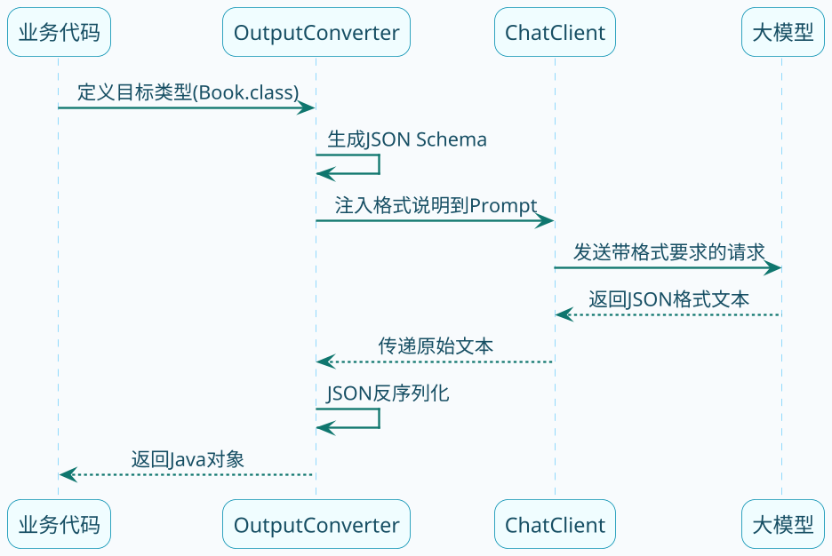

# 结构化输出深度剖析

大模型的输出是自然语言文本，格式不固定。如果是人类阅读没问题，但程序处理起来就麻烦了。

比如你问模型"推荐几本书"，它可能这样回答：

```
我给你推荐三本不错的书：
1.《代码整洁之道》- 讲代码规范的经典之作
2.《设计模式》- 四人组的名著
3.《重构》- Martin Fowler的代表作
```

这种格式人读着没问题，但你想用代码解析出书名、作者，就得写正则或者其他脏活累活。

结构化输出就是让模型按指定格式返回，比如直接返回JSON，甚至直接转成Java对象。今天我们来深入聊聊Spring AI是怎么实现的。

:::info 结构化输出的核心原理
Spring AI 的结构化输出机制分两步：
1. **调用前**：根据目标 Java 类自动生成 JSON Schema，注入到提示词中，告诉模型要按什么格式输出
2. **调用后**：把模型返回的 JSON 文本反序列化成目标 Java 类型
:::

## 结构化输出的基本原理

Spring AI的结构化输出机制，核心思想是：

1. **调用前**：往提示词里注入格式说明，告诉模型要按什么格式输出
2. **调用后**：把模型返回的文本解析成目标类型



## StructuredOutputConverter接口

Spring AI定义了一个统一的接口来处理结构化输出：

```java
public interface StructuredOutputConverter<T> extends Converter<String, T>, FormatProvider {
    // 继承自Converter: 把字符串转成目标类型
    // T convert(String source)
    
    // 继承自FormatProvider: 获取格式说明文本
    // String getFormat()
}
```

这个接口有几个实现类：

| 实现类 | 用途 |
|-------|------|
| BeanOutputConverter | 转成Java Bean |
| ListOutputConverter | 转成List |
| MapOutputConverter | 转成Map |

其中BeanOutputConverter是最常用的。

## BeanOutputConverter源码剖析

### getFormat()方法

先来看看BeanOutputConverter是怎么生成格式说明的：

```java
@Override
public String getFormat() {
    String template = """
            Your response should be in JSON format.
            Do not include any explanations, only provide a RFC8259 compliant JSON response following this format without deviation.
            Do not include markdown code blocks in your response.
            Remove the ```json markdown from the output.
            Here is the JSON Schema instance your output must adhere to:
            ```%s```
            """;
    return String.format(template, this.jsonSchema);
}
```

翻译一下这段提示词：
- 你的回答必须是JSON格式
- 不要包含任何解释，只输出符合RFC8259的JSON
- 不要包含markdown代码块
- 必须遵循下面的JSON Schema

关键在`this.jsonSchema`，它是根据你传入的Java类自动生成的。

### JSON Schema生成

假设我们有这样一个record：

```java
public record Product(
    @JsonPropertyDescription("商品ID") String productId,
    @JsonPropertyDescription("商品名称") String name,
    @JsonPropertyDescription("价格，单位元") BigDecimal price,
    @JsonPropertyDescription("商品描述") String description
) {}
```

BeanOutputConverter会把它转成这样的JSON Schema：

```json
{
  "$schema": "https://json-schema.org/draft/2020-12/schema",
  "type": "object",
  "properties": {
    "productId": {
      "type": "string",
      "description": "商品ID"
    },
    "name": {
      "type": "string",
      "description": "商品名称"
    },
    "price": {
      "type": "number",
      "description": "价格，单位元"
    },
    "description": {
      "type": "string",
      "description": "商品描述"
    }
  },
  "required": ["productId", "name", "price", "description"]
}
```

大模型收到这个Schema后，就知道应该按什么结构输出了。

### convert()方法

模型返回JSON文本后，需要反序列化成Java对象：

```java
@Override
public T convert(@NonNull String text) {
    try {
        // 去除首尾空白
        text = text.trim();
        
        // 处理markdown代码块（有些模型会自作聪明加上```json）
        if (text.startsWith("```") && text.endsWith("```")) {
            String[] lines = text.split("\n", 2);
            if (lines[0].trim().equalsIgnoreCase("```json")) {
                text = lines.length > 1 ? lines[1] : "";
            } else {
                text = text.substring(3);
            }
            text = text.substring(0, text.length() - 3).trim();
        }
        
        // 使用Jackson反序列化
        return (T) this.objectMapper.readValue(text, 
                this.objectMapper.constructType(this.type));
    } catch (JsonProcessingException e) {
        throw new RuntimeException("JSON解析失败: " + text, e);
    }
}
```

可以看到，它还贴心地处理了markdown代码块的情况。

:::note 为什么要处理 markdown 代码块
部分大模型会"自作主张"在 JSON 输出前后加上 ` ```json ` 的 markdown 标记。`BeanOutputConverter` 在 `convert()` 方法中会自动识别并剥离这些标记，保证 JSON 解析不会失败。
:::

## 手动使用BeanOutputConverter

来看看怎么在代码里使用：

```java
@RestController
@RequestMapping("/structured")
public class StructuredOutputController {
    
    private final ChatClient chatClient;
    
    @GetMapping("/product")
    public String getProduct(@RequestParam String category) {
        // 1. 创建Converter
        BeanOutputConverter<Product> converter = new BeanOutputConverter<>(Product.class);
        
        // 2. 构建包含格式说明的提示词
        PromptTemplate template = new PromptTemplate("""
                请为"{category}"类目生成一个虚构的商品信息。
                
                {format}
                """);
        
        Prompt prompt = template.create(Map.of(
            "category", category,
            "format", converter.getFormat()  // 注入格式说明
        ));
        
        // 3. 调用模型获取JSON
        String jsonResult = chatClient.prompt(prompt)
                .call()
                .content();
        
        // 4. 转成Java对象
        Product product = converter.convert(jsonResult);
        
        System.out.println("商品名称: " + product.name());
        System.out.println("价格: " + product.price());
        
        return jsonResult;
    }
}
```

## entity()方法：更简洁的写法

手动使用Converter有点繁琐，Spring AI提供了更简洁的写法——`entity()`方法：

```java
@GetMapping("/product-simple")
public String getProductSimple(@RequestParam String category) {
    Product product = chatClient.prompt("为" + category + "类目生成一个虚构商品")
            .call()
            .entity(Product.class);  // 一步到位
    
    return product.toString();
}
```

一个方法搞定，内部自动完成了格式注入和反序列化。

### entity()源码追踪

来看看它是怎么实现的：

```java
// ChatClient.CallResponseSpec
@Nullable
public <T> T entity(Class<T> type) {
    Assert.notNull(type, "type cannot be null");
    // 创建Converter
    BeanOutputConverter<T> outputConverter = new BeanOutputConverter<>(type);
    // 调用实际处理方法
    return this.doSingleWithBeanOutputConverter(outputConverter);
}

private <T> T doSingleWithBeanOutputConverter(StructuredOutputConverter<T> outputConverter) {
    // 1. 发起调用，把格式说明注入到请求中
    ChatResponse chatResponse = this.doGetObservableChatClientResponse(
            this.request, 
            outputConverter.getFormat()  // 关键：注入格式说明
    ).chatResponse();
    
    // 2. 提取文本响应
    String stringResponse = getContentFromChatResponse(chatResponse);
    
    // 3. 转换成目标类型
    return (stringResponse == null) ? null : outputConverter.convert(stringResponse);
}
```

核心就两步：
1. 把`getFormat()`的内容注入到请求里
2. 把响应文本用`convert()`转成对象

## 使用@JsonPropertyDescription增强准确性

如果你发现输出的字段不够准确，可以用注解给字段加上描述：

```java
public record OrderInfo(
    @JsonPropertyDescription("订单编号，格式为ORD开头的12位字符串") 
    String orderId,
    
    @JsonPropertyDescription("订单状态：PENDING-待支付, PAID-已支付, SHIPPED-已发货, COMPLETED-已完成") 
    String status,
    
    @JsonPropertyDescription("订单总金额，保留两位小数") 
    BigDecimal totalAmount,
    
    @JsonPropertyDescription("下单时间，ISO 8601格式") 
    String createTime,
    
    @JsonPropertyDescription("收货人姓名") 
    String receiverName
) {}
```

这些描述会被包含在JSON Schema里，帮助模型更准确地生成数据。

## 转换成List

如果需要返回多个对象怎么办？用`ParameterizedTypeReference`：

```java
@GetMapping("/products")
public String getProducts(@RequestParam String category) {
    List<Product> products = chatClient.prompt(
            "为" + category + "类目生成3个虚构商品")
            .call()
            .entity(new ParameterizedTypeReference<List<Product>>() {});
    
    products.forEach(p -> 
        System.out.println(p.name() + " - ¥" + p.price()));
    
    return products.toString();
}
```

**注意**：不能直接写`List.class`，必须用`ParameterizedTypeReference`包装，否则泛型信息会丢失。

:::warning 泛型擦除问题
Java 泛型在运行时会被擦除，直接传 `List.class` 无法知道列表的元素类型。必须使用 `new ParameterizedTypeReference<List<Product>>() {}` 的匿名子类写法来保留完整的泛型类型信息。
:::

## 转换成Map

Map的转换稍微复杂一点，Spring AI提供了MapOutputConverter，但它只能转成`Map<String, Object>`：

```java
@GetMapping("/product-map")
public Map<String, Object> getProductAsMap(@RequestParam String category) {
    return chatClient.prompt("""
            为%s类目生成一个商品，包含productId、name、price、description字段
            """.formatted(category))
            .call()
            .entity(new MapOutputConverter());
}
```

如果需要更精确的Map结构，建议在提示词里明确说明：

```java
@GetMapping("/category-products")
public Map<String, Object> getCategoryProducts() {
    return chatClient.prompt("""
            生成一个商品分类Map，格式如下：
            {
                "电子产品": {"count": 数量, "topSeller": "热销商品名"},
                "服装": {"count": 数量, "topSeller": "热销商品名"},
                "食品": {"count": 数量, "topSeller": "热销商品名"}
            }
            """)
            .call()
            .entity(new MapOutputConverter());
}
```

## 流式调用不支持结构化输出

:::danger 流式调用不兼容结构化输出
**流式调用（stream）不支持 `entity()`**。流式输出是分段返回的，无法保证每段都是有效的完整 JSON。如果需要结构化输出，必须使用同步调用（`call()`）。
:::

```java
// 这样是不行的！
chatClient.prompt("xxx")
    .stream()
    .entity(Product.class);  // 编译通过，但运行会出问题
```

## 处理复杂嵌套结构

结构化输出支持嵌套对象：

```java
public record Order(
    String orderId,
    Customer customer,      // 嵌套对象
    List<OrderItem> items,  // 嵌套列表
    BigDecimal totalAmount
) {}

public record Customer(
    String customerId,
    String name,
    String phone
) {}

public record OrderItem(
    String productId,
    String productName,
    int quantity,
    BigDecimal price
) {}
```

使用方式和简单对象一样：

```java
Order order = chatClient.prompt("生成一个包含3个商品的模拟订单")
        .call()
        .entity(Order.class);
```

## 常见问题排查

:::tip 结构化输出调试技巧
遇到解析失败时，先用 `.call().content()` 打印原始响应内容，看看模型实际返回了什么。常见问题：
- 模型返回了额外的解释文字（需要在提示词中更强调"只输出JSON"）
- 返回的 JSON 格式不正确
- 包含了 markdown 代码块（`BeanOutputConverter` 会自动处理，但若自行解析则需注意）

字段值不准确时，用 `@JsonPropertyDescription` 添加详细的字段描述，帮助模型理解字段的含义和格式要求。
:::

## 小结

这篇文章深入剖析了Spring AI的结构化输出机制：

- **原理**：通过JSON Schema告诉模型期望的输出格式
- **BeanOutputConverter**：核心转换器，负责格式注入和反序列化
- **entity()方法**：简化的API，一步完成结构化输出
- **List/Map转换**：用ParameterizedTypeReference处理泛型
- **限制**：流式调用不支持结构化输出

掌握结构化输出，你的AI应用就能和业务代码无缝衔接了。下一篇我们来聊聊Advisor拦截器机制。
