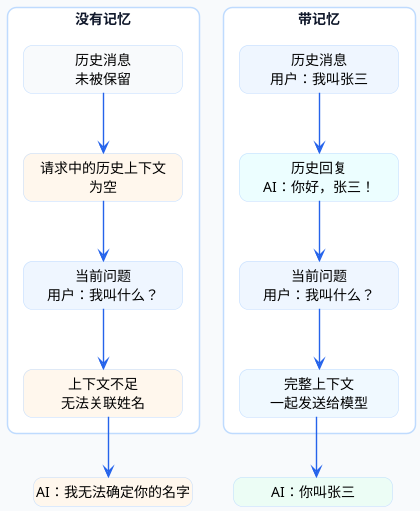

# 对话记忆系统设计

和ChatGPT聊过天的人都知道，它能记住你之前说的话。问它"我刚才说了什么"，它能准确回答。这种能力叫做**对话记忆**。

对于AI应用来说，记忆能力至关重要。没有记忆，每次对话都是"新朋友"，用户体验会很差。今天我们来深入聊聊Spring AI中对话记忆的设计与实现。

## 为什么需要对话记忆

先来理解一个基本事实：**大模型本身是无状态的**。

每次你调用大模型API，对它来说都是一次全新的请求。它不知道一秒钟前你问过什么，更不知道昨天聊了什么话题。

那ChatGPT是怎么做到"记住"对话的？答案是：**把历史对话一起发给模型**。



每次对话时，把之前的所有消息都带上，模型就能"理解"上下文。这就是对话记忆的本质。

:::info 对话记忆的本质
大模型本身是**无状态的**，每次 API 调用对它来说都是全新请求。实现"记忆"的方式是：把历史对话消息一起发给模型，模型从完整的上下文中"理解"之前说了什么。
:::

## 短期记忆 vs 长期记忆

AI的记忆能力分两种层次：

### 短期记忆（Session Memory）

指在**单次对话会话**中的记忆能力，特点是：

- 局限在当前对话窗口
- 关闭页面或开始新对话就消失
- 受限于模型的上下文窗口大小

比如你和AI聊天，说了10轮之后，第1轮的内容可能就被"遗忘"了——因为上下文窗口装不下了。

### 长期记忆（Persistent Memory）

指**跨对话**的记忆能力，特点是：

- 信息存储在外部（数据库、向量库等）
- 不受单次对话限制
- 需要主动管理（增删改）

比如你告诉AI"我对海鲜过敏"，一周后再问它推荐餐厅，它能记得避开海鲜。

| 维度 | 短期记忆 | 长期记忆 |
|-----|---------|---------|
| 生命周期 | 单次会话 | 持久存储 |
| 存储位置 | 内存/请求体 | 数据库/向量库 |
| 信息完整度 | 完整上下文 | 通常是摘要 |
| 适用场景 | 连续对话 | 用户偏好、历史信息 |

这篇文章主要聊短期记忆的实现，长期记忆涉及更复杂的RAG架构，后续专门讨论。

:::note 短期记忆 vs 长期记忆
| 维度 | 短期记忆 | 长期记忆 |
|-----|---------|---------|
| 生命周期 | 单次会话 | 持久存储 |
| 存储位置 | 内存/请求体 | 数据库/向量库 |
| 信息完整度 | 完整上下文 | 通常是摘要 |
| 适用场景 | 连续对话 | 用户偏好、历史信息 |
:::

## Spring AI的记忆实现方案

Spring AI提供了两种实现对话记忆的方式。

### 方案一：手动维护Message列表

最直观的方式是自己管理对话历史：

```java
@RestController
@RequestMapping("/memory")
public class ManualMemoryController {
    
    private final ChatModel chatModel;
    
    // 用ConcurrentHashMap存储不同会话的历史
    private final Map<String, List<Message>> sessionHistory = new ConcurrentHashMap<>();
    
    @GetMapping("/chat")
    public String chat(@RequestParam String sessionId, 
                      @RequestParam String message) {
        // 1. 获取或创建该会话的历史记录
        List<Message> history = sessionHistory.computeIfAbsent(
                sessionId, k -> new ArrayList<>());
        
        // 2. 添加系统提示词（如果是第一条消息）
        if (history.isEmpty()) {
            history.add(new SystemMessage("你是一个智能理财顾问"));
        }
        
        // 3. 添加用户本次输入
        history.add(new UserMessage(message));
        
        // 4. 调用模型
        Prompt prompt = new Prompt(history);
        ChatResponse response = chatModel.call(prompt);
        String aiReply = response.getResult().getOutput().getText();
        
        // 5. 把AI回复也加入历史
        history.add(new AssistantMessage(aiReply));
        
        // 6. 控制历史长度，防止无限增长
        trimHistory(history, 20);  // 最多保留20条
        
        return aiReply;
    }
    
    private void trimHistory(List<Message> history, int maxSize) {
        // 保留系统消息 + 最近的对话
        while (history.size() > maxSize) {
            // 找到第一条非系统消息，删除它
            for (int i = 0; i < history.size(); i++) {
                if (!(history.get(i) instanceof SystemMessage)) {
                    history.remove(i);
                    break;
                }
            }
        }
    }
}
```

**优点**：完全可控，想怎么管理记忆就怎么管理  
**缺点**：代码繁琐，需要自己处理很多细节

### 方案二：使用ChatMemoryAdvisor（推荐）

Spring AI提供了更优雅的方式——通过Advisor自动管理记忆：

```java
@RestController
@RequestMapping("/memory")
public class AdvisorMemoryController {
    
    private final ChatClient chatClient;
    
    public AdvisorMemoryController(ChatModel chatModel) {
        // 创建基于内存的记忆存储
        ChatMemory chatMemory = MessageWindowChatMemory.builder()
                .maxMessages(20)  // 最多保留20条消息
                .build();
        
        // 构建带记忆能力的ChatClient
        this.chatClient = ChatClient.builder(chatModel)
                .defaultSystem("你是一个智能理财顾问")
                .defaultAdvisors(
                    MessageChatMemoryAdvisor.builder(chatMemory).build()
                )
                .build();
    }
    
    @GetMapping("/chat")
    public Flux<String> chat(@RequestParam String sessionId,
                            @RequestParam String message) {
        return chatClient.prompt()
                .user(message)
                // 指定会话ID，相同ID的对话共享记忆
                .advisors(spec -> spec.param(
                        ChatMemory.CONVERSATION_ID, sessionId))
                .stream()
                .content();
    }
}
```

代码简洁多了！核心是两个组件：

- **MessageWindowChatMemory**：记忆存储，采用滑动窗口机制
- **MessageChatMemoryAdvisor**：负责自动将历史消息注入请求

## MessageWindowChatMemory详解

MessageWindowChatMemory是Spring AI内置的记忆实现，它的特点是：

- 为每个会话维护一个消息窗口
- 当消息数量超过上限时，自动淘汰最早的消息
- 默认存储在内存中

```plantuml title="MessageWindowChatMemory 滑动窗口示意" width="100%" align="center"
@startuml
skinparam backgroundColor #F8FBFD
skinparam roundcorner 18
skinparam shadowing false
skinparam defaultFontName Microsoft YaHei
skinparam defaultFontSize 14
skinparam defaultTextAlignment center
skinparam linetype ortho
skinparam dpi 160
skinparam ArrowColor #0F766E
skinparam ArrowThickness 1.4
skinparam ArrowFontColor #164E63
skinparam ArrowFontSize 13
skinparam HyperlinkColor #0891B2
skinparam packageStyle rectangle
skinparam componentStyle rectangle

skinparam note {
  BackgroundColor #ECFEFF
  BorderColor #67E8F9
  FontColor #155E75
}

skinparam package {
  BackgroundColor #FFFFFF
  BorderColor #7DD3FC
  FontColor #164E63
}

skinparam rectangle {
  BackgroundColor #FFFFFF
  BorderColor #38BDF8
  FontColor #0F172A
}

skinparam component {
  BackgroundColor #FFFFFF
  BorderColor #38BDF8
  FontColor #0F172A
}

skinparam interface {
  BackgroundColor #F0FDFF
  BorderColor #0891B2
  FontColor #164E63
}

skinparam class {
  BackgroundColor #FFFFFF
  BorderColor #0891B2
  ArrowColor #0F766E
  FontColor #164E63
  HeaderBackgroundColor #ECFEFF
}

skinparam object {
  BackgroundColor #FFFFFF
  BorderColor #0891B2
  FontColor #164E63
}

skinparam actor {
  BackgroundColor #ECFDF5
  BorderColor #0F766E
  FontColor #134E4A
}

skinparam participant {
  BackgroundColor #F0FDFF
  BorderColor #0891B2
  FontColor #164E63
}

skinparam sequence {
  LifeLineBorderColor #7DD3FC
  LifeLineBackgroundColor #F8FBFD
  ParticipantBorderColor #0891B2
  ParticipantBackgroundColor #F0FDFF
  ParticipantFontColor #164E63
  ActorBorderColor #0F766E
  ActorBackgroundColor #ECFDF5
  ActorFontColor #134E4A
  ArrowColor #0F766E
  ArrowFontColor #164E63
  BoxBorderColor #A5F3FC
  BoxBackgroundColor #F8FEFF
  BoxFontColor #164E63
  GroupBorderColor #38BDF8
  GroupBackgroundColor #ECFEFF
  GroupHeaderBackgroundColor #CFFAFE
  GroupHeaderFontColor #155E75
  DividerBorderColor #67E8F9
  DividerBackgroundColor #F0FDFF
  DividerFontColor #155E75
}

skinparam activity {
  BackgroundColor #FFFFFF
  BorderColor #0891B2
  FontColor #164E63
  StartColor #0F766E
  EndColor #0F766E
  BarColor #0891B2
  DiamondBackgroundColor #ECFEFF
  DiamondBorderColor #38BDF8
  DiamondFontColor #155E75
}

rectangle "会话123的消息窗口 (maxMessages=5)" {
  rectangle "SystemMessage" as S
  rectangle "UserMessage 3" as U3
  rectangle "AssistantMessage 3" as A3
  rectangle "UserMessage 4" as U4
  rectangle "AssistantMessage 4" as A4
}

note right of S : 系统消息通常保留
note right of U3 : 旧消息会被淘汰

rectangle "新消息到来" as New
rectangle "UserMessage 5" as U5

New --> U5 : 添加新消息
U5 --> U3 : 触发淘汰
@enduml
```

### 关键参数

```java
MessageWindowChatMemory memory = MessageWindowChatMemory.builder()
        .maxMessages(20)           // 最大消息数（包括所有类型）
        .chatMemoryRepository(     // 底层存储实现
            new InMemoryChatMemoryRepository()
        )
        .build();
```

**注意**：`maxMessages`是指所有消息的总数，包括UserMessage、AssistantMessage、SystemMessage，而不只是用户发送的消息。

:::warning maxMessages 的计数方式
`maxMessages` 计算的是**所有类型消息的总条数**，包括 SystemMessage、UserMessage 和 AssistantMessage。一轮对话（用户问+AI答）占用 2 条，加上系统消息后实际可用的对话轮数会比你以为的少。建议设置时留出余量。
:::

## 两种MemoryAdvisor的区别

Spring AI提供了两种记忆Advisor：

### MessageChatMemoryAdvisor

将历史消息添加到请求的messages列表中，这是标准做法：

```json
{
  "messages": [
    {"role": "system", "content": "你是智能助手"},
    {"role": "user", "content": "第一个问题"},
    {"role": "assistant", "content": "第一个回答"},
    {"role": "user", "content": "第二个问题"}  // 当前问题
  ]
}
```

### PromptChatMemoryAdvisor

将历史对话拼接到系统提示词中，适用于不支持多轮messages的模型：

```json
{
  "messages": [
    {
      "role": "system", 
      "content": "你是智能助手\n\n历史对话：\n用户：第一个问题\n助手：第一个回答\n"
    },
    {"role": "user", "content": "第二个问题"}
  ]
}
```

大多数情况用MessageChatMemoryAdvisor就行。

## 持久化记忆：保存到MySQL

内存记忆有个致命问题：**应用重启后记忆就丢失了**。生产环境必须要持久化存储。

:::danger 生产环境必须持久化
`InMemoryChatMemoryRepository`（内存存储）在应用重启后会**完全丢失所有对话记忆**，不适合生产环境使用。生产环境必须切换到 `JdbcChatMemoryRepository` 或其他持久化存储方案。
:::

Spring AI提供了基于JDBC的持久化方案。

### 引入依赖

```xml
<dependency>
    <groupId>org.springframework.ai</groupId>
    <artifactId>spring-ai-starter-model-chat-memory-repository-jdbc</artifactId>
    <version>1.1.0</version>
</dependency>

<dependency>
    <groupId>mysql</groupId>
    <artifactId>mysql-connector-java</artifactId>
    <version>8.0.33</version>
</dependency>
```

### 配置数据源

```yaml
spring:
  datasource:
    url: jdbc:mysql://localhost:3306/ai_memory_db?useUnicode=true&characterEncoding=UTF-8
    username: root
    password: your_password
    driver-class-name: com.mysql.cj.jdbc.Driver
  ai:
    chat:
      memory:
        repository:
          jdbc:
            platform: mysql
```

### 创建数据表

Spring AI官方提供的SQL可能有兼容性问题，建议用这个：

```sql
CREATE TABLE `spring_ai_chat_memory` (
  `conversation_id` varchar(36) NOT NULL COMMENT '会话ID',
  `content` text NOT NULL COMMENT '消息内容',
  `type` enum('USER','ASSISTANT','SYSTEM','TOOL') NOT NULL COMMENT '消息类型',
  `timestamp` timestamp NOT NULL DEFAULT CURRENT_TIMESTAMP COMMENT '创建时间',
  KEY `idx_conversation_timestamp` (`conversation_id`, `timestamp`)
) ENGINE=InnoDB DEFAULT CHARSET=utf8mb4 COMMENT='AI对话记忆表';
```

### 配置JDBC记忆

```java
@Configuration
public class PersistentMemoryConfig {
    
    @Bean
    public ChatMemory jdbcChatMemory(JdbcChatMemoryRepository repository) {
        return MessageWindowChatMemory.builder()
                .chatMemoryRepository(repository)  // 使用JDBC存储
                .maxMessages(50)
                .build();
    }
    
    @Bean
    public ChatClient chatClient(ChatModel chatModel, ChatMemory jdbcChatMemory) {
        return ChatClient.builder(chatModel)
                .defaultAdvisors(
                    MessageChatMemoryAdvisor.builder(jdbcChatMemory).build(),
                    new SimpleLoggerAdvisor()
                )
                .build();
    }
}
```

### 使用方式

使用方式和内存记忆完全一样，只是底层存储换成了MySQL：

```java
@GetMapping("/chat")
public Flux<String> chat(@RequestParam String sessionId,
                        @RequestParam String message) {
    return chatClient.prompt()
            .user(message)
            .advisors(spec -> spec.param(ChatMemory.CONVERSATION_ID, sessionId))
            .stream()
            .content();
}
```

现在对话记录会存到数据库里，重启应用后记忆依然保留。

## ChatMemoryRepository体系

Spring AI的记忆存储是可扩展的，核心接口是ChatMemoryRepository：

```plantuml title="ChatMemoryRepository 实现体系" width="100%" align="center"
@startuml
skinparam backgroundColor #F8FBFD
skinparam roundcorner 18
skinparam shadowing false
skinparam defaultFontName Microsoft YaHei
skinparam defaultFontSize 14
skinparam defaultTextAlignment center
skinparam linetype ortho
skinparam dpi 160
skinparam ArrowColor #0F766E
skinparam ArrowThickness 1.4
skinparam ArrowFontColor #164E63
skinparam ArrowFontSize 13
skinparam HyperlinkColor #0891B2
skinparam packageStyle rectangle
skinparam componentStyle rectangle

skinparam note {
  BackgroundColor #ECFEFF
  BorderColor #67E8F9
  FontColor #155E75
}

skinparam package {
  BackgroundColor #FFFFFF
  BorderColor #7DD3FC
  FontColor #164E63
}

skinparam rectangle {
  BackgroundColor #FFFFFF
  BorderColor #38BDF8
  FontColor #0F172A
}

skinparam component {
  BackgroundColor #FFFFFF
  BorderColor #38BDF8
  FontColor #0F172A
}

skinparam interface {
  BackgroundColor #F0FDFF
  BorderColor #0891B2
  FontColor #164E63
}

skinparam class {
  BackgroundColor #FFFFFF
  BorderColor #0891B2
  ArrowColor #0F766E
  FontColor #164E63
  HeaderBackgroundColor #ECFEFF
}

skinparam object {
  BackgroundColor #FFFFFF
  BorderColor #0891B2
  FontColor #164E63
}

skinparam actor {
  BackgroundColor #ECFDF5
  BorderColor #0F766E
  FontColor #134E4A
}

skinparam participant {
  BackgroundColor #F0FDFF
  BorderColor #0891B2
  FontColor #164E63
}

skinparam sequence {
  LifeLineBorderColor #7DD3FC
  LifeLineBackgroundColor #F8FBFD
  ParticipantBorderColor #0891B2
  ParticipantBackgroundColor #F0FDFF
  ParticipantFontColor #164E63
  ActorBorderColor #0F766E
  ActorBackgroundColor #ECFDF5
  ActorFontColor #134E4A
  ArrowColor #0F766E
  ArrowFontColor #164E63
  BoxBorderColor #A5F3FC
  BoxBackgroundColor #F8FEFF
  BoxFontColor #164E63
  GroupBorderColor #38BDF8
  GroupBackgroundColor #ECFEFF
  GroupHeaderBackgroundColor #CFFAFE
  GroupHeaderFontColor #155E75
  DividerBorderColor #67E8F9
  DividerBackgroundColor #F0FDFF
  DividerFontColor #155E75
}

skinparam activity {
  BackgroundColor #FFFFFF
  BorderColor #0891B2
  FontColor #164E63
  StartColor #0F766E
  EndColor #0F766E
  BarColor #0891B2
  DiamondBackgroundColor #ECFEFF
  DiamondBorderColor #38BDF8
  DiamondFontColor #155E75
}

interface ChatMemoryRepository {
  + findByConversationId(id): List<Message>
  + saveAll(id, messages): void
  + deleteByConversationId(id): void
}

class InMemoryChatMemoryRepository {
  - ConcurrentHashMap storage
}

class JdbcChatMemoryRepository {
  - JdbcTemplate jdbcTemplate
}

class CassandraChatMemoryRepository
class Neo4jChatMemoryRepository  
class MongoChatMemoryRepository
class CosmosDBChatMemoryRepository

ChatMemoryRepository <|.. InMemoryChatMemoryRepository
ChatMemoryRepository <|.. JdbcChatMemoryRepository
ChatMemoryRepository <|.. CassandraChatMemoryRepository
ChatMemoryRepository <|.. Neo4jChatMemoryRepository
ChatMemoryRepository <|.. MongoChatMemoryRepository
ChatMemoryRepository <|.. CosmosDBChatMemoryRepository
@enduml
```



Spring AI支持多种存储后端：

| 实现类 | 适用场景 |
|-------|---------|
| InMemoryChatMemoryRepository | 开发测试，不需要持久化 |
| JdbcChatMemoryRepository | 关系型数据库（MySQL、PostgreSQL等） |
| CassandraChatMemoryRepository | 高并发、需要TTL自动过期 |
| Neo4jChatMemoryRepository | 需要图关系分析 |
| MongoChatMemoryRepository | 灵活的文档存储 |
| CosmosDBChatMemoryRepository | Azure云环境 |

## 记忆管理最佳实践

:::tip 最佳实践
1. **合理设置窗口大小**：窗口太小上下文丢失，太大 token 消耗增加且可能超出模型限制，一般 20-50 条比较合理
2. **重要信息放在 System 消息**：系统消息通常不会被淘汰，用户偏好、用户身份等关键信息放在这里
3. **定期清理过期会话**：数据库存储会不断积累，建议设置定时任务清理超过 7 天的记录
4. **敏感信息脱敏**：对话记录存储前要对手机号、身份证号等进行脱敏处理
:::

### 1. 合理设置窗口大小

窗口太小，上下文信息丢失；窗口太大，token消耗增加且可能超出模型限制。

```java
// 根据模型能力和业务需求调整
MessageWindowChatMemory.builder()
    .maxMessages(30)  // 一般20-50条比较合理
    .build();
```

### 2. 重要信息放在System消息

系统消息通常不会被淘汰，重要的设定放在这里：

```java
chatClient.prompt()
    .system("用户姓名：张三\n用户等级：VIP\n偏好：科技类产品")
    .user(question)
    .call()
    .content();
```

### 3. 定期清理过期会话

数据库存储会不断积累数据，需要定期清理：

```java
@Scheduled(cron = "0 0 2 * * ?")  // 每天凌晨2点
public void cleanExpiredSessions() {
    // 删除7天前的会话记录
    LocalDateTime threshold = LocalDateTime.now().minusDays(7);
    jdbcTemplate.update(
        "DELETE FROM spring_ai_chat_memory WHERE timestamp < ?",
        threshold
    );
}
```

### 4. 敏感信息脱敏

对话记录可能包含敏感信息，存储前考虑脱敏：

```java
public class SensitiveDataAdvisor implements CallAdvisor {
    
    @Override
    public ChatClientResponse adviseCall(ChatClientRequest request, 
                                         CallAdvisorChain chain) {
        // 在存储前对消息内容脱敏
        ChatClientRequest sanitized = sanitizeRequest(request);
        return chain.nextCall(sanitized);
    }
    
    private ChatClientRequest sanitizeRequest(ChatClientRequest request) {
        // 手机号、身份证号等脱敏处理
        // ...
    }
}
```

## 小结

这篇文章系统介绍了Spring AI的对话记忆机制：

- **记忆本质**：把历史对话一起发给模型，让它理解上下文
- **两种记忆**：短期记忆（会话内）和长期记忆（跨会话）
- **实现方式**：手动维护Message列表 或 使用ChatMemoryAdvisor
- **存储选择**：内存、JDBC、Cassandra、MongoDB等
- **持久化配置**：引入JDBC依赖 + 配置数据源 + 创建表结构

对话记忆是AI应用的基础能力，掌握好它，你的AI助手就能真正"记住"用户了。

---

到这里，Spring AI详细解析系列就全部结束了。我们从入门实战开始，一路讲到核心架构、流式输出、提示词工程、结构化输出、Advisor机制和对话记忆。

这些知识足够你在实际项目中用好Spring AI了。当然，大模型应用开发还有很多进阶话题，比如RAG、工具调用、Agent编排等，后续会详细的讲解。
