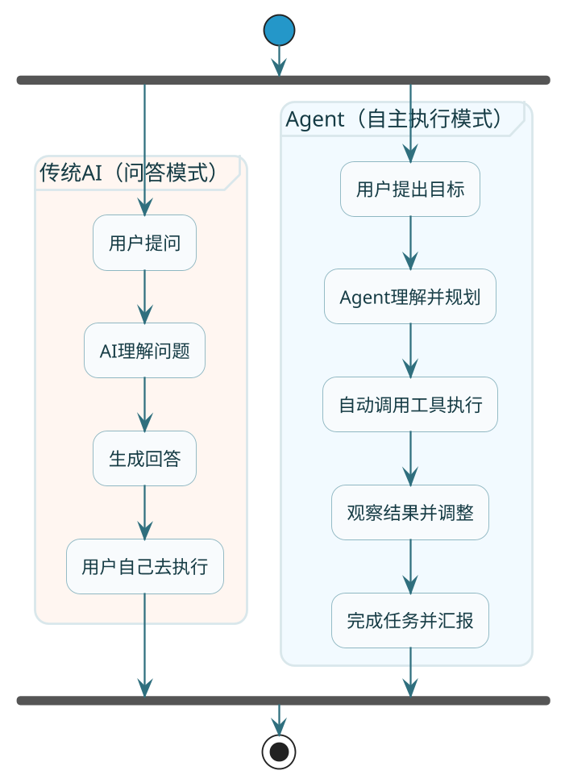

# 走进智能体的世界

你有没有想过，为什么现在的AI助手能帮你自动订机票、自动写报告、甚至自动改代码？它们是怎么做到的？

如果你用过Cursor写代码，让它帮你实现某个功能，它会先看看你的文件结构，找到合适的位置，写代码，然后运行看看有没有问题，有问题就自己修。这整个过程，你只说了一句话，它却做了一连串的事情。

这种能够**自主完成一系列任务**的AI，就是我们今天要聊的主角——**Agent（智能体）**。

## 你可能已经在用Agent了

先别急着看定义，咱们来看几个你可能已经接触过的场景：

**场景一：智能客服的进化**

以前的智能客服是什么样的？用户说"退款"，它就弹出退款流程；用户说"发票"，它就弹出发票说明。本质上就是关键词匹配，稍微换个说法它就懵了。

现在呢？你跟它说"我上周买的那个蓝牙耳机，左边没声音了，想退掉"，它能理解你的意思，自动去查你的订单，找到那个耳机，看看是否在退货期限内，然后告诉你怎么操作。这中间涉及到**理解意图→查询订单→判断规则→生成回复**好几个步骤，全自动完成。

**场景二：代码助手的升级**

你让AI帮你"给这个接口加个日志"，它不是简单地给你一段代码让你自己贴。它会先看看你的项目用的什么日志框架，找到那个接口在哪，看看周围的代码风格是什么样的，然后生成符合你项目规范的代码，插入到正确的位置。

**场景三：数据分析自动化**

老板说"帮我看看上个月销售数据有什么异常"。传统的BI工具需要你自己选维度、选指标、配置图表。而现在的AI助手能自动拉取数据、自己决定用什么分析方法、生成图表、甚至给出结论和建议。

这些场景有什么共同点？**AI不再是被动地等你一步步指挥，而是能自己规划、自己执行、自己调整**。

## Agent到底是什么

聊了这么多例子，该给个定义了。

:::info 核心定义
**Agent是以大语言模型为核心，能够自主理解任务、规划步骤、调用工具、执行动作的智能体。**

如果要用一句大白话来说：**Agent就是一个能自己干活的AI助手**。
:::

打个比方，传统的AI像是一个只会回答问题的百科全书，你问它什么它告诉你什么，但它自己不会动手。而Agent更像是一个**全能管家**——你说"帮我订一张明天去上海的机票"，它会自己查航班、比价格、选座位、完成支付，最后把确认信息发给你。

从这个对比可以看出，Agent和传统AI最大的区别在于：**Agent能闭环**。它不只是告诉你答案，它能把事情做完。

## Agent的核心能力拆解

一个完整的Agent需要具备四大核心能力，缺一不可：

### 规划能力（Planning）

这是Agent的"大脑"。面对一个复杂任务，Agent需要能把它拆解成可执行的步骤。

比如用户说"帮我分析一下竞品的定价策略"，Agent需要规划出：先找到竞品有哪些→收集它们的价格信息→整理成表格→分析定价规律→给出结论。

没有规划能力的AI，面对复杂任务只会一脸懵，或者东一榔头西一棒槌地乱来。

### 工具使用（Tools）

光有规划没用，还得能动手。Agent需要能调用各种工具来完成具体的动作。

这些工具可以是：
- **API调用**：查天气、查股价、查快递
- **数据库操作**：查订单、查用户信息
- **代码执行**：跑计算、处理数据
- **外部服务**：发邮件、发短信、下单

工具就是Agent的"手脚"，让它能真正影响外部世界。

### 记忆能力（Memory）

Agent在执行任务的过程中，需要记住之前做了什么、得到了什么结果。

比如它第一步查到了订单信息，第二步需要用到这个信息来判断退货规则。如果没有记忆，它每走一步就忘了前一步，那就没法协调多步骤的任务了。

记忆分两种：
- **短期记忆**：当前这个任务的执行过程
- **长期记忆**：跨任务的用户偏好、历史对话等

### 行动能力（Action）

最后，Agent需要真正去执行动作，而不是只停留在"我建议你这样做"的层面。

这是Agent和普通对话AI最本质的区别。普通AI说"你应该调用这个API"，Agent会直接把API调了，把结果拿回来。

用一个公式来总结：

**Agent = LLM + Planning + Tools + Memory + Action**

大语言模型提供理解和推理能力，其他四个组件让它能真正"动起来"。

## 两种Agent：编排型 vs 自主型

根据控制方式的不同，Agent可以分为两大类：

### 编排型Agent（Workflow Agent）

编排型Agent按照**预定义的流程**来执行任务。开发者事先设计好流程图，Agent按部就班地走。

打个比方，就像是一个按说明书组装家具的人。说明书上写了先装哪个后装哪个，他就严格按顺序来，不会自己发挥。

**优点**：
- 行为可预测，不会跑偏
- 便于调试和审计
- 适合生产环境

**缺点**：
- 灵活性有限
- 遇到流程外的情况就傻眼

**典型场景**：订单处理、审批流程、固定格式的报告生成

### 自主型Agent（Autonomous Agent）

自主型Agent由LLM**动态决定**下一步做什么。没有预设的流程图，它根据当前情况自己推理判断。

就像是一个经验丰富的老师傅，你告诉他最终目标，他自己琢磨怎么做，遇到问题自己想办法解决。

**优点**：
- 极其灵活，能应对未知情况
- 不需要预先设计所有流程

**缺点**：
- 行为不可预测，可能"跑偏"
- 调试困难
- 可能需要人工干预

**典型场景**：开放式问题探索、创意类任务、复杂的多步骤研究

| 维度 | 编排型Agent | 自主型Agent |
|------|------------|------------|
| 控制方式 | 预定义流程 | LLM动态决策 |
| 可预测性 | 高 | 低 |
| 灵活性 | 有限 | 极高 |
| 可靠性 | 高（适合生产） | 中（可能跑偏） |
| 开发难度 | 中（需设计流程） | 高（需处理不确定性） |
| 典型框架 | LangGraph、Dify、Spring AI Alibaba | AutoGen |

### 怎么选？

:::tip 选型建议
**选编排型**：当你的任务流程相对固定，对可靠性要求高，需要上生产环境

**选自主型**：当你的任务高度不确定，需要AI自己探索解决方案

实际项目中，很多时候是**混合使用**的。整体流程用编排型控制，某些需要灵活处理的环节用自主型。这样既保证了可靠性，又不失灵活性。
:::

## 小结

这篇我们搞清楚了几个核心问题：

**Agent是什么**：以LLM为核心，能自主完成任务的智能体，就像一个全能管家

**和传统AI的区别**：Agent能闭环，不只是回答问题，而是把事情做完

**四大核心能力**：
- Planning（规划）：拆解任务
- Tools（工具）：执行动作
- Memory（记忆）：保持上下文
- Action（行动）：真正执行

**两种类型**：
- 编排型：按预设流程走，可靠但不够灵活
- 自主型：LLM动态决策，灵活但可能跑偏

理解了Agent是什么，下一篇我们来深入聊聊Agent的几种主流架构——ReAct、Reflection、Plan and Execute，看看它们各自是怎么工作的，适合什么场景。
