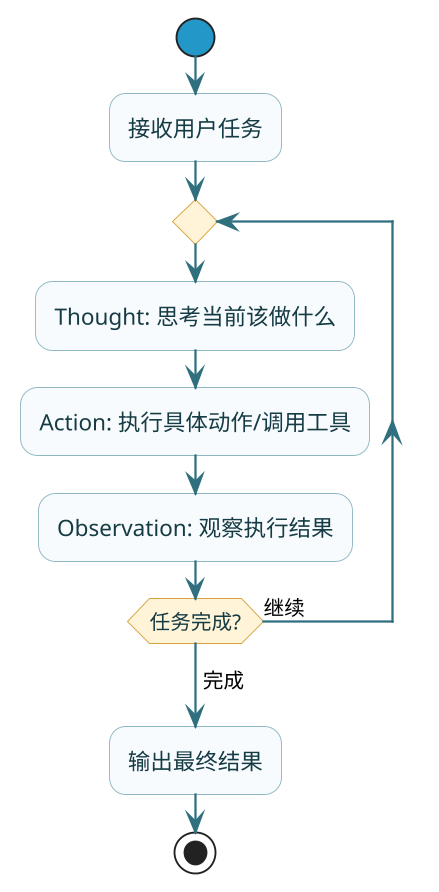
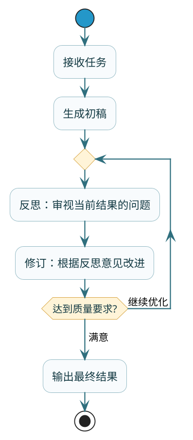
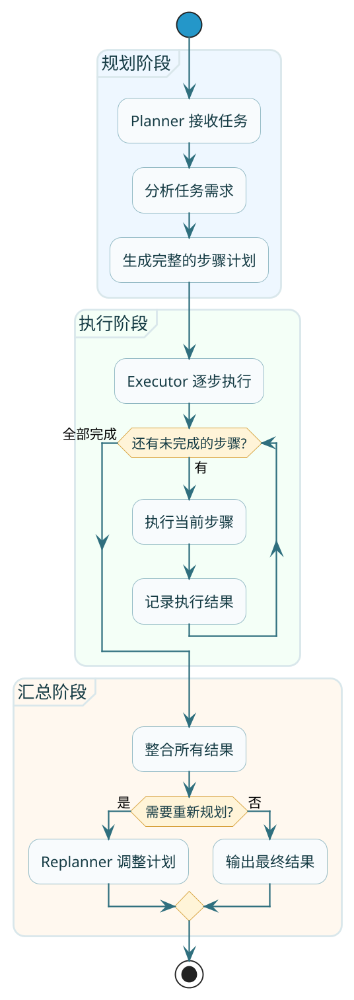
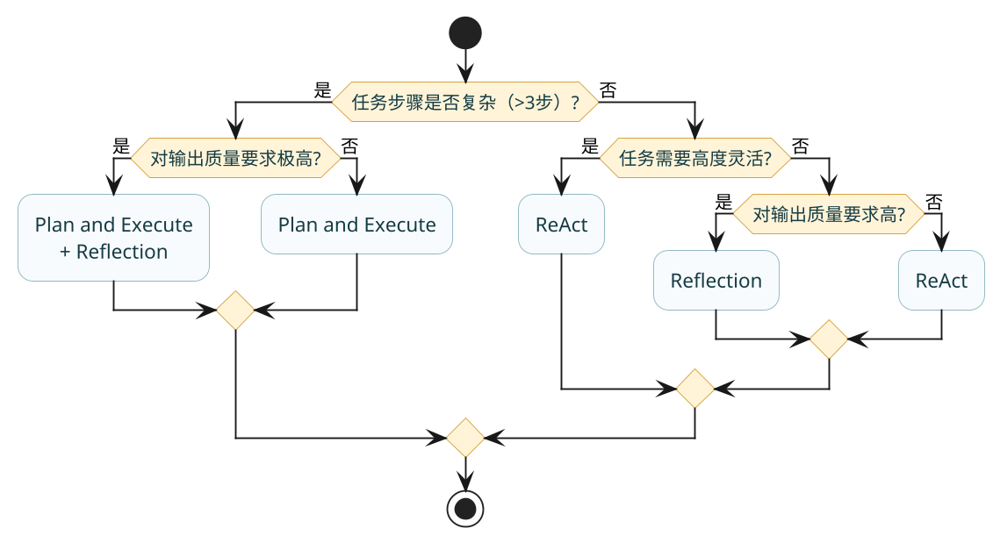

# 主流架构深度对比

:::tip 实战项目推荐
ReAct、Plan-and-Execute、多 Agent 等架构，最终都要落到任务编排和执行可控性上。超级 AI 智能体提供了动态 Agent 和执行阶段时间线，适合对照不同架构的工程取舍。

项目详细介绍：**[什么是超级 AI 智能体？](/super-agent/overview/project-intro)**
:::

上一篇我们知道了Agent是什么，这篇来聊聊Agent是**怎么干活**的。

同样是完成一个任务，不同的Agent可能有完全不同的"工作风格"。有的边想边干，做一步看一步；有的先整体规划，再分步执行；有的做完还要自我检查，反复打磨。

这些不同的工作风格，在技术上叫做**Agent架构**。目前主流的有三种：**ReAct**、**Reflection**、**Plan and Execute**。

咱们用一个统一的场景来对比它们：假设你让Agent帮你**分析某个品类的电商竞品，给出定价建议**。

## ReAct：边想边干的实干派

### 核心思想

:::info 核心概念
ReAct的全称是**Reasoning + Acting**，核心理念是**思考和行动交替进行**。

它模仿的是人类解决问题的自然过程：遇到问题先想一想，想清楚就动手做，做完看看结果，根据结果再想下一步该怎么办。

用三个词概括：**Thought（思考）→ Action（行动）→ Observation（观察）**，然后循环往复。
:::

### 论文背景

ReAct架构最早来自普林斯顿和Google的研究论文 **《ReAct: Synergizing Reasoning and Acting in Language Models》**，论文地址：[https://react-lm.github.io/](https://react-lm.github.io/)

作者通过实验证明，单独的推理（Chain of Thought）或单独的行动（工具调用）都不如两者结合的效果好。


:::tip 实验结论
论文中的实验结果显示：
- **标准方法**：直接让模型回答，容易产生幻觉
- **纯推理（CoT）**：只思考不行动，缺乏外部信息
- **纯行动（Act Only）**：只调工具不思考，容易走偏
- **ReAct**：边想边做，能在行动中发现错误并修正

在多跳问答任务中，ReAct的准确率比其他方法有明显提升，特别是在需要多步推理的复杂问题上。
:::




### 实际例子

用户说："帮我分析蓝牙耳机品类的竞品定价"

**第一轮**：
- **Thought**：用户想知道蓝牙耳机的竞品定价，我需要先搜索主流的蓝牙耳机品牌有哪些
- **Action**：调用搜索工具，搜索"蓝牙耳机 热门品牌"
- **Observation**：搜索结果显示主流品牌有AirPods、Sony、华为FreeBuds、小米、漫步者...

**第二轮**：
- **Thought**：已经知道主流品牌了，现在需要查询它们的价格
- **Action**：调用电商API，查询这些品牌的产品价格
- **Observation**：AirPods Pro 1899元、Sony WF-1000XM5 1999元、华为FreeBuds Pro 3 1499元...

**第三轮**：
- **Thought**：价格信息收集完了，现在需要分析定价规律并给出建议
- **Action**：生成分析报告
- **Observation**：报告生成完成

每一轮，Agent都是先想清楚当前该做什么，然后执行，看结果，再决定下一步。

### 代码实现思路

ReAct的核心在于让LLM按照"思考→行动→观察"的模式输出。关键是**提示词设计**和**循环控制**：

```java
@GetMapping("/react-demo")
public String reactDemo(String conversationId) {
    // 定义工具
    ChatOptions chatOptions = ToolCallingChatOptions.builder()
            .toolCallbacks(ToolCallbacks.from(new ProductTools()))
            .internalToolExecutionEnabled(false) // 关闭自动执行，手动控制
            .build();
    
    // ReAct风格的系统提示词
    String systemPrompt = """
        你是一个电商数据分析助手，请按照以下模式工作：
        1. Thought：先分析当前需要做什么
        2. Action：执行具体的工具调用
        3. Observation：观察工具返回的结果
        4. 重复以上步骤直到任务完成
        
        如果任务已完成，请直接给出最终结论。
        """;
    
    Prompt prompt = new Prompt(
            List.of(new SystemMessage(systemPrompt), 
                    new UserMessage("分析蓝牙耳机品类的竞品定价")),
            chatOptions);
    
    chatMemory.add(conversationId, prompt.getInstructions());
    ChatResponse response = chatModel.call(new Prompt(chatMemory.get(conversationId), chatOptions));
    chatMemory.add(conversationId, response.getResult().getOutput());
    
    // 循环处理工具调用
    while (response.hasToolCalls()) {
        // 执行工具
        ToolExecutionResult result = toolCallingManager.executeToolCalls(
                new Prompt(chatMemory.get(conversationId), chatOptions), response);
        
        // 工具结果加入记忆
        chatMemory.add(conversationId, result.conversationHistory()
                .get(result.conversationHistory().size() - 1));
        
        // 继续调用模型
        response = chatModel.call(new Prompt(chatMemory.get(conversationId), chatOptions));
        chatMemory.add(conversationId, response.getResult().getOutput());
    }
    
    return response.getResult().getOutput().getText();
}
```

### 优缺点

:::tip 优缺点分析
**优点**：
- 灵活，能根据执行结果动态调整
- 实现相对简单
- 每一步都有思考过程，便于理解

**缺点**：
- 效率较低，每步都要调用LLM
- 容易陷入局部思维，缺乏全局视角
- 可能跑偏，需要多次尝试

**适合场景**：任务相对简单、需要灵活调整、对响应速度要求不高
:::

## Reflection：追求完美的反思派

### 核心思想

Reflection的核心是**自我批判、迭代改进**。Agent完成任务后，不是直接交付，而是先自己审视一遍：这个结果好不好？有没有问题？能不能改进？

就像写文章一样，初稿写完之后要自己检查几遍，修改润色，才能定稿。



### 实际例子

还是那个竞品分析的任务：

**初稿生成**：
Agent生成了一份竞品分析报告，包含了各品牌价格、市场定位等信息。

**第一轮反思**：
- **审视**：这份报告数据全面吗？逻辑清晰吗？结论有依据吗？
- **反馈**：报告缺少价格区间的对比分析，结论部分的建议不够具体，没有说明建议定价的依据
- **修订**：补充价格区间分析表格，细化定价建议，增加依据说明

**第二轮反思**：
- **审视**：修订后的报告是否解决了之前的问题？有没有新的问题？
- **反馈**：整体已经不错，但市场趋势部分可以补充一些数据支撑
- **修订**：增加近期销量趋势数据

**达标输出**：
经过两轮迭代，报告质量达到要求，输出给用户。

### 代码实现思路

Reflection通常需要两个"角色"：一个负责生成，一个负责审视。可以是同一个模型扮演不同角色，也可以是不同的模型：

```java
public String reflectionDemo(String task) {
    String draft = "";
    String feedback = "";
    int maxRevisions = 3;
    int currentRevision = 0;
    
    // 初稿生成
    String writerPrompt = """
        你是一位电商数据分析师，请根据用户需求生成分析报告。
        任务：%s
        """.formatted(task);
    draft = chatModel.call(new Prompt(writerPrompt)).getResult().getOutput().getText();
    
    // 迭代优化
    while (currentRevision < maxRevisions) {
        // 反思：让模型扮演审稿人角色
        String reviewerPrompt = """
            你是一位严格的分析报告审稿人，请审视以下报告：
            
            %s
            
            请从以下维度评价并给出改进建议：
            1. 数据完整性
            2. 逻辑清晰度
            3. 结论可行性
            
            如果报告已经足够好，请回复"APPROVED"。
            """.formatted(draft);
        
        feedback = chatModel.call(new Prompt(reviewerPrompt)).getResult().getOutput().getText();
        
        if (feedback.contains("APPROVED")) {
            break; // 质量达标，退出循环
        }
        
        // 修订：根据反馈改进
        String revisePrompt = """
            你是分析师，请根据审稿意见修改报告：
            
            原报告：
            %s
            
            审稿意见：
            %s
            
            请输出修订后的完整报告。
            """.formatted(draft, feedback);
        
        draft = chatModel.call(new Prompt(revisePrompt)).getResult().getOutput().getText();
        currentRevision++;
    }
    
    return draft;
}
```

### 优缺点

**优点**：
- 输出质量高，经过反复打磨
- 能发现并修正自身错误
- 适合对质量要求高的场景

:::warning 常见误区
可能陷入无限优化的循环——Reflection架构**必须设置最大反思轮次上限**，否则Token消耗会失控。
:::

**适合场景**：报告生成、文章写作、代码审查等对质量要求高的任务

## Plan and Execute：运筹帷幄的规划派

### 核心思想

Plan and Execute的理念是**谋定而后动**。先做全局规划，把任务拆解成完整的步骤清单，然后按计划执行。

这种架构把"规划"和"执行"分成了两个独立的阶段，由不同的组件负责：
- **Planner（规划器）**：负责理解任务、制定计划
- **Executor（执行器）**：负责按计划执行每一步



### 实际例子

用户说："帮我分析蓝牙耳机品类的竞品定价"

**规划阶段**：
Planner分析任务后，输出计划：
```
步骤1：搜索蓝牙耳机市场的主流品牌
步骤2：收集各品牌主力产品的价格信息
步骤3：整理价格数据，按区间分类
步骤4：分析各价格区间的竞争情况
步骤5：基于分析给出定价建议
```

**执行阶段**：
Executor按计划逐步执行，每完成一步就记录结果。

**汇总阶段**：
所有步骤完成后，汇总结果。如果发现某些信息不足，可能触发Replanner调整计划补充。

### 和ReAct的对比

ReAct是**边想边做**，每一步都是临时决定的；Plan and Execute是**先想后做**，一开始就规划好全部步骤。

打个比方：
- ReAct像是导航软件，走一段路重新规划一次
- Plan and Execute像是出发前就规划好完整路线，然后照着走

### 代码实现思路

Plan and Execute通常有三种实现方式：

**方式一：Plan内嵌ReAct**
```java
// 先用LLM生成计划
String plan = generatePlan(task);

// 用ReAct Agent执行每个步骤
for (String step : parseSteps(plan)) {
    executeWithReAct(step);
}

// 汇总并判断是否需要重新规划
summarizeAndReplan();
```

**方式二：Plan直接指定工具调用**
```java
// Planner直接输出每步要调用的工具和参数
List<ToolCall> toolCalls = plannerGenerateToolCalls(task);

// 按计划执行工具调用
for (ToolCall call : toolCalls) {
    executeToolCall(call);
}

// 汇总给LLM做总结
generateSummary();
```

**方式三：多智能体协作**
把Planner、Executor、Replanner作为三个独立的Agent，相互协作完成任务。

### 优缺点

**优点**：
- 全局视角，规划更合理
- 执行效率高，可以并行
- 便于调试和审计，计划清晰可见
- 可以用小模型做执行，降低成本

**缺点**：
- 初始计划可能不完美，需要重规划机制
- 实现复杂度较高
- 对于高度动态的任务不够灵活

**适合场景**：复杂的多步骤任务、对可靠性要求高、需要可审计的场景

## 三大架构横向对比

| 维度 | ReAct | Reflection | Plan and Execute |
|------|-------|------------|------------------|
| 工作模式 | 边想边做，循环迭代 | 生成→审视→修订 | 先规划后执行 |
| 决策时机 | 每步临时决定 | 事后反思改进 | 事先全局规划 |
| 执行效率 | 低（串行） | 中 | 高（可并行） |
| 灵活性 | 高 | 中 | 中低 |
| 输出质量 | 中 | 高 | 中高 |
| 实现复杂度 | 低 | 中 | 高 |
| LLM调用次数 | 多 | 多 | 少 |
| 适合任务 | 简单灵活的任务 | 质量要求高的任务 | 复杂多步骤任务 |



:::tip 架构选型建议
- 任务简单、需要灵活 → **ReAct**
- 对质量要求高、愿意多花时间 → **Reflection**
- 任务复杂、步骤多、需要可靠 → **Plan and Execute**
:::

## 混合使用：取长补短

实际项目中，这三种架构经常**混合使用**，取长补短。

**常见的组合方式**：

1. **Plan and Execute + ReAct**
   - 用Plan制定整体计划
   - 用ReAct执行每个步骤
   - 遇到异常时用ReAct灵活处理

2. **ReAct + Reflection**
   - 用ReAct完成任务
   - 用Reflection审视结果并改进

3. **全家桶模式**
   - Plan制定计划
   - ReAct执行步骤
   - Reflection检查结果
   - Replanner调整计划

:::note 混合架构实战
实际项目中，这三种架构经常**混合使用**，取长补短。比如某大厂的Agent系统，在Plan阶段规划好工具调用，用Workflow编排执行，遇到异常再用ReAct重新规划。既保证了效率，又保留了灵活性。
:::

## 小结

这篇我们深入对比了三种主流Agent架构：

**ReAct**：边想边干，Thought→Action→Observation循环
- 灵活但效率低
- 适合简单灵活的任务

**Reflection**：自我批判，生成→审视→修订迭代
- 质量高但耗时
- 适合对质量要求高的任务

**Plan and Execute**：谋定后动，Planner→Executor→Replanner
- 高效但不够灵活
- 适合复杂多步骤任务

**选择建议**：
- 根据任务复杂度、灵活性需求、质量要求综合考虑
- 实际项目中经常混合使用

下一篇，我们来聊聊当一个Agent搞不定的时候，怎么让多个Agent协作起来——多智能体系统。
