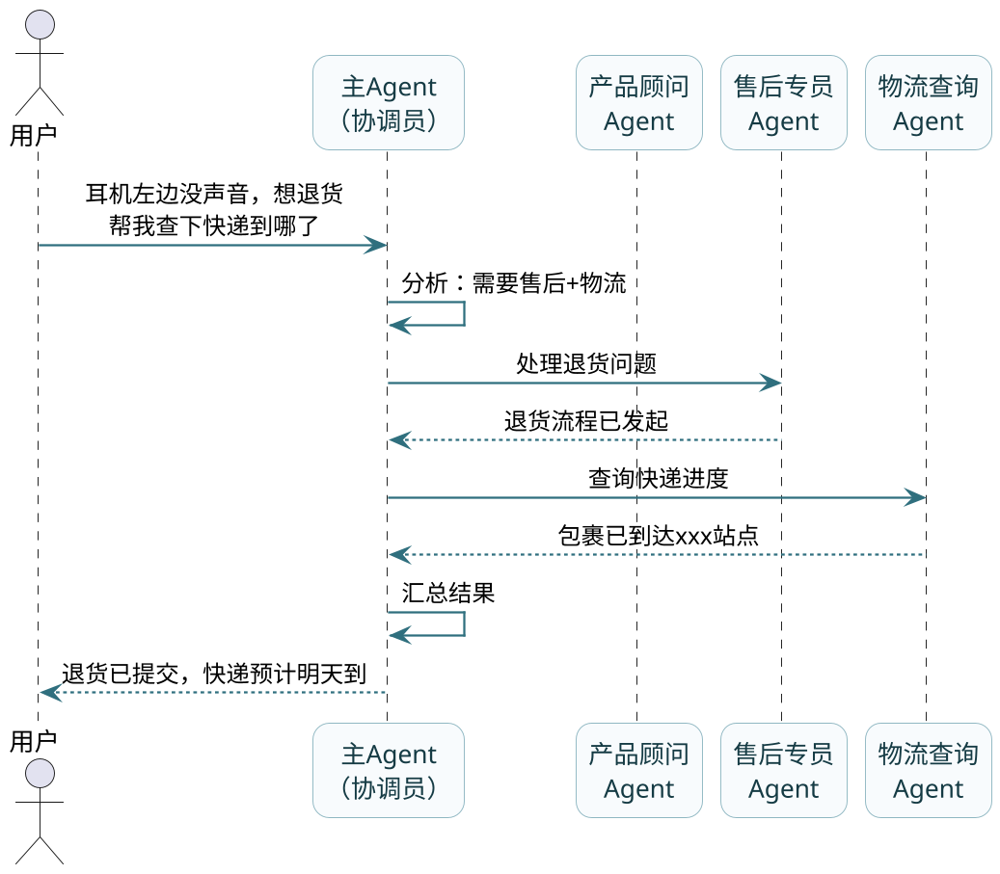
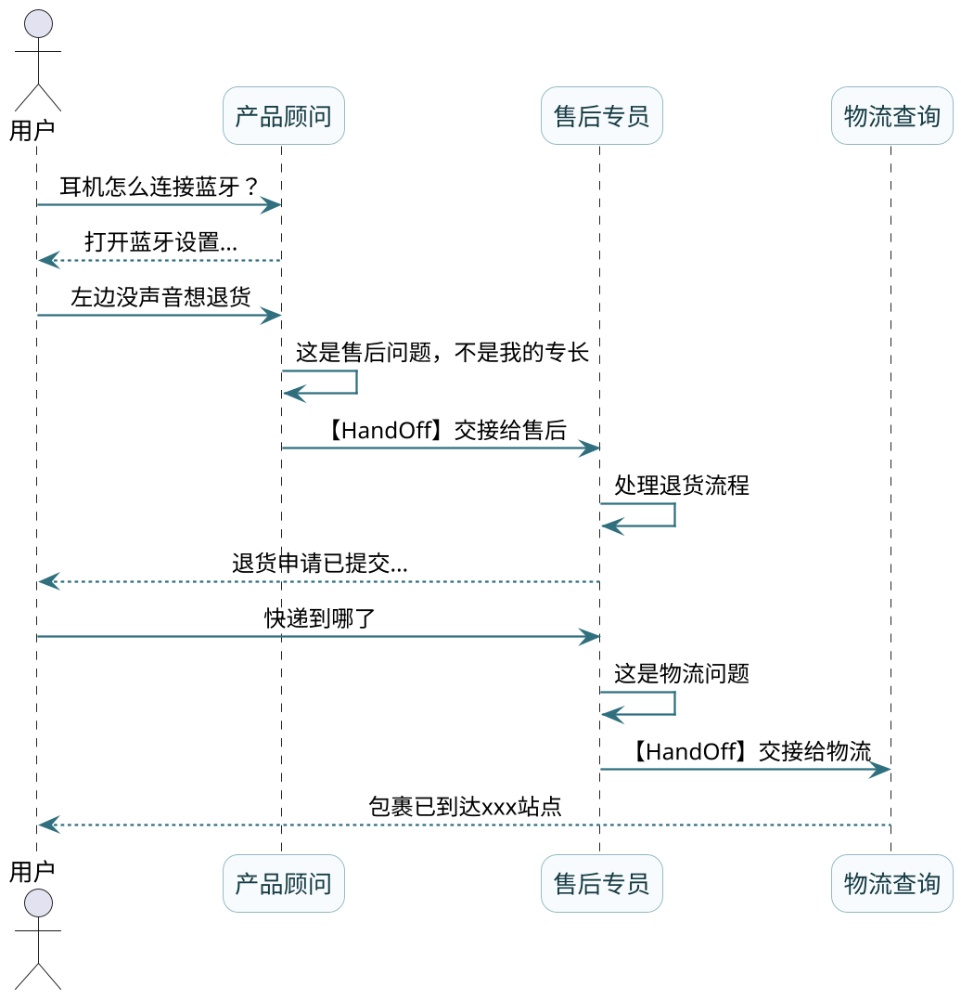
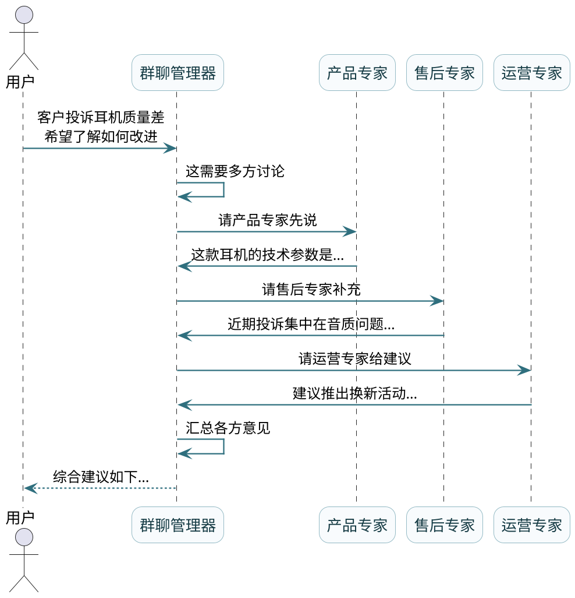

# 多智能体深度协作

:::tip 实战项目推荐
多 Agent 的难点不只是“多个角色”，而是任务如何分发、状态如何共享、结果如何汇总。超级 AI 智能体里的动态 Agent 和路由能力，可以作为多智能体协作的工程参考。

项目详细介绍：**[什么是超级 AI 智能体？](/super-agent/overview/project-intro)**
:::

前面两篇我们聊的都是单个Agent，但在真实的业务场景中，一个Agent往往搞不定复杂的任务。

想象一下，你有一个超级智能客服的需求：它要能回答产品问题、处理售后投诉、查询订单物流、还要能做数据分析给出运营建议。如果把这些能力都塞到一个Agent里，会发生什么？

这就是本篇要解决的问题：**当一个Agent不够用时，怎么让多个Agent协作起来**。

## 单打独斗为啥不够用

先来看看单个Agent在复杂任务面前会遇到哪些问题。

### 上下文窗口不够用

每个LLM都有上下文窗口的限制。当任务复杂、步骤多的时候，历史对话+工具调用结果会迅速堆积，很快就撑爆窗口。

更麻烦的是**注意力发散问题**：当上下文太长时，模型对关键信息的关注度会下降，导致效果变差。本来能做对的事情，上下文一长就开始犯糊涂。

### 工具太多选不对

一个Agent如果配了几十个工具，LLM很容易选错工具或者不会用。就像给一个人塞了一整套工具箱，他反而不知道该用哪个。

### 专业度不够

不同类型的任务需要不同的"专家"。让一个通用Agent既懂技术问题又懂售后流程还懂数据分析，效果肯定不如专门训练的专家Agent。

### 效率太低

单Agent只能串行执行，任务复杂时特别慢。比如同时要查订单、查物流、查退款进度，串行查三遍，用户等得花都谢了。

### 解决方案：多智能体

:::info 核心思想
这些问题的解决思路都指向一个方向：**分而治之**。

把复杂任务拆分给多个专业Agent，每个Agent只负责自己擅长的领域，通过协作完成整体任务。这样：
- 每个Agent的上下文更短，效果更好
- 每个Agent的工具更少，选择更准
- 专业Agent专注于专业任务，效果更好
- 多个Agent可以并行工作，效率更高

这就是 **多智能体系统（Multi-Agent System）** 的核心思想。
:::

## 三种主流协作模式

多智能体如何协作？目前主流的有三种模式：**SubAgents（子智能体调度）**、**HandOff（任务交接）**、**Chat Group（群聊协作）**。

我们用一个统一的场景来说明：**构建一个智能客服团队**，需要产品顾问、售后专员、物流查询员三个角色。

### 模式一：SubAgents（子智能体调度）

**核心思想**：有一个主Agent（协调员），其他Agent作为它的"工具"来使用。主Agent根据任务需要，决定调用哪个子Agent。



**特点**：
- 主Agent掌控全局，子Agent被动响应
- 子Agent之间互相不通信，都通过主Agent
- 上下文隔离：每次调用子Agent都是"新对话"

**打个比方**：主Agent就像一个项目经理，手下有几个专业员工。项目经理接到任务后，决定分配给谁做，收集结果后汇报给客户。员工之间不直接交流，都通过项目经理。

**Spring AI Alibaba实现**：

```java
// 创建产品顾问Agent
ReactAgent productAgent = ReactAgent.builder()
        .name("product_advisor")
        .model(chatModel)
        .description("负责解答产品功能、使用方法、技术参数等问题")
        .instruction("你是专业的产品顾问，熟悉各类电子产品...")
        .tools(productKnowledgeTool)
        .build();

// 创建售后专员Agent
ReactAgent serviceAgent = ReactAgent.builder()
        .name("service_agent")
        .model(chatModel)
        .description("负责处理退换货、投诉、维修等售后问题")
        .instruction("你是资深售后专员，熟悉退换货流程...")
        .tools(orderQueryTool, refundTool)
        .build();

// 创建物流查询Agent
ReactAgent logisticsAgent = ReactAgent.builder()
        .name("logistics_agent")
        .model(chatModel)
        .description("负责查询物流状态、配送进度")
        .instruction("你是物流查询专员...")
        .tools(logisticsApiTool)
        .build();

// 创建主Agent，把子Agent作为工具
ReactAgent mainAgent = ReactAgent.builder()
        .name("customer_service_coordinator")
        .model(chatModel)
        .instruction("""
            你是智能客服协调员，根据用户问题选择合适的专家处理：
            - 产品相关问题 → 使用产品顾问
            - 售后问题 → 使用售后专员
            - 物流问题 → 使用物流查询
            可以同时使用多个专家来处理复杂问题。
            """)
        .tools(
            AgentTool.getFunctionToolCallback(productAgent),
            AgentTool.getFunctionToolCallback(serviceAgent),
            AgentTool.getFunctionToolCallback(logisticsAgent)
        )
        .build();

// 使用
String response = mainAgent.call("耳机左边没声音想退，顺便帮我看下快递到哪了").getText();
```

:::note SubAgents 工作原理
**原理简析**：`AgentTool.getFunctionToolCallback`把一个Agent包装成ToolCallback，当主Agent决定调用某个子Agent时，实际上就是执行了那个子Agent的invoke方法。
:::

### 模式二：HandOff（任务交接）

**核心思想**：Agent之间可以互相"交接棒"。当前Agent如果发现任务不属于自己的专业范围，主动把任务交给更合适的Agent。



**特点**：
- 没有固定的"主Agent"，任何Agent都可以是入口
- Agent自己判断是否需要交接
- 支持链式交接：A→B→C
- 上下文可以在交接时传递

**打个比方**：就像公司的客服热线，你打进去可能先接到一个通用客服，他发现问题需要技术支持就转接给技术，技术发现需要售后又转接给售后。每次转接，前面的对话记录都会传过去。

**Spring AI Alibaba实现**：

Spring AI Alibaba提供了多种HandOff的实现方式，最常用的是FlowAgent系列：

```java
// SequentialAgent：顺序执行，自动交接
SequentialAgent sequentialAgent = SequentialAgent.builder()
        .name("customer_service_flow")
        .description("客服处理流程")
        .subAgents(List.of(
            intentClassifyAgent,  // 先识别意图
            problemSolveAgent,    // 再解决问题
            satisfactionAgent     // 最后满意度调查
        ))
        .build();

// LlmRoutingAgent：LLM智能路由
LlmRoutingAgent routingAgent = LlmRoutingAgent.builder()
        .name("smart_router")
        .description("根据用户问题智能路由到合适的专家")
        .model(chatModel)
        .subAgents(List.of(productAgent, serviceAgent, logisticsAgent))
        .build();

// SupervisorAgent：监督者模式，支持多轮路由
SupervisorAgent supervisorAgent = SupervisorAgent.builder()
        .name("customer_service_supervisor")
        .description("客服主管，协调各专员处理问题")
        .model(chatModel)
        .subAgents(List.of(productAgent, serviceAgent, logisticsAgent))
        .build();
```

**各种FlowAgent对比**：

| FlowAgent类型 | 特点 | 适用场景 |
|--------------|------|---------|
| SequentialAgent | 按预定顺序依次执行 | 固定流程，如审批链 |
| ParallelAgent | 多个Agent并行执行 | 需要同时处理多个任务 |
| LlmRoutingAgent | LLM决定路由到哪个Agent | 简单的意图分发 |
| SupervisorAgent | 支持多轮路由，可循环 | 复杂的多步骤协作 |

### 模式三：Chat Group（群聊协作）

**核心思想**：多个Agent在一个"群聊"里协作，有一个管理员（Group Manager）控制发言顺序，按轮次讨论直到任务完成。



**特点**：
- 所有Agent共享同一个消息通道
- 管理器决定发言顺序
- 每轮只有一个Agent发言
- 适合需要多角度讨论的任务

**打个比方**：就像公司开会，会议主持人控制发言顺序，各部门依次发表意见，最后主持人总结。

**适用场景**：
- 复杂问题需要多角度分析
- 头脑风暴类任务
- 需要多方协调达成共识

:::note Chat Group 框架支持说明
这种模式在AutoGen框架中有完整实现，Spring AI Alibaba目前支持有限，可以通过自定义Workflow来实现类似效果。
:::

## 三种模式怎么选

| 维度 | SubAgents | HandOff | Chat Group |
|------|-----------|---------|------------|
| 控制方式 | 主Agent集中控制 | 各Agent自主交接 | 管理器协调 |
| 通信方式 | 星型（都通过主Agent） | 链式或网状 | 广播（共享频道） |
| 灵活性 | 中 | 高 | 中 |
| 实现复杂度 | 低 | 中 | 高 |
| 适合场景 | 任务可明确分类 | 流程不固定 | 需要多方讨论 |

:::tip 模式选型建议
- 任务能明确分给某个专家 → **SubAgents**
- 需要灵活的流程控制 → **HandOff**
- 需要多角度讨论 → **Chat Group**
:::

## 实战：构建智能客服团队

最后，我们用Spring AI Alibaba完整实现一个智能客服团队：

```java
@Service
public class CustomerServiceTeam {
    
    @Autowired
    private ChatModel chatModel;
    
    // 产品知识库工具
    private ToolCallback productKnowledgeTool = FunctionToolCallback.builder(
            "search_product_info",
            (query, ctx) -> "产品信息：蓝牙5.0，续航8小时..."
    ).description("搜索产品信息").inputType(String.class).build();
    
    // 订单查询工具
    private ToolCallback orderQueryTool = FunctionToolCallback.builder(
            "query_order",
            (orderId, ctx) -> "订单状态：已发货，快递单号SF123456"
    ).description("查询订单状态").inputType(String.class).build();
    
    // 退款处理工具
    private ToolCallback refundTool = FunctionToolCallback.builder(
            "apply_refund",
            (orderId, ctx) -> "退款申请已提交，预计3个工作日处理"
    ).description("申请退款").inputType(String.class).build();
    
    public ReactAgent buildTeam() {
        // 产品顾问
        ReactAgent productAgent = ReactAgent.builder()
                .name("product_advisor")
                .model(chatModel)
                .description("解答产品功能、使用方法、技术参数等问题")
                .instruction("你是专业的产品顾问，用通俗易懂的语言解答用户的产品疑问。")
                .tools(productKnowledgeTool)
                .build();
        
        // 售后专员
        ReactAgent serviceAgent = ReactAgent.builder()
                .name("after_sales_agent")
                .model(chatModel)
                .description("处理退换货、投诉、维修等售后问题")
                .instruction("你是耐心的售后专员，帮助用户解决售后问题，态度友好。")
                .tools(orderQueryTool, refundTool)
                .build();
        
        // 主协调Agent
        ReactAgent coordinator = ReactAgent.builder()
                .name("service_coordinator")
                .model(chatModel)
                .instruction("""
                    你是智能客服协调员，负责理解用户需求并分配给合适的专家：
                    
                    - 产品咨询（功能、使用、参数）→ 产品顾问
                    - 售后问题（退换货、投诉、维修）→ 售后专员
                    
                    如果一个问题涉及多个方面，可以依次调用多个专家。
                    最后汇总各专家的回答，给用户一个完整的答复。
                    """)
                .tools(
                    AgentTool.getFunctionToolCallback(productAgent),
                    AgentTool.getFunctionToolCallback(serviceAgent)
                )
                .saver(new MemorySaver())
                .build();
        
        return coordinator;
    }
    
    public String chat(String message, String sessionId) {
        ReactAgent team = buildTeam();
        RunnableConfig config = RunnableConfig.builder()
                .threadId(sessionId)
                .build();
        return team.call(message, config).getText();
    }
}
```

**使用示例**：

```java
@RestController
@RequestMapping("/customer-service")
public class CustomerServiceController {
    
    @Autowired
    private CustomerServiceTeam team;
    
    @GetMapping("/chat")
    public String chat(@RequestParam String message, 
                       @RequestParam String sessionId) {
        return team.chat(message, sessionId);
    }
}
```

测试一下：

```
GET /customer-service/chat?message=耳机怎么配对手机&sessionId=user001
→ 产品顾问回答配对步骤

GET /customer-service/chat?message=左边没声音想退货&sessionId=user001
→ 售后专员处理退货
```

## 小结

这篇我们聊了多智能体协作：

**为什么需要多智能体**：
- 上下文窗口限制
- 工具太多难选择
- 专业度要求
- 效率问题

**三种协作模式**：
- **SubAgents**：主Agent调度子Agent，简单直接
- **HandOff**：Agent之间自主交接，灵活自由
- **Chat Group**：群聊讨论，适合多角度分析

**Spring AI Alibaba支持**：
- `AgentTool.getFunctionToolCallback`实现SubAgents
- `SequentialAgent/LlmRoutingAgent/SupervisorAgent`实现HandOff
