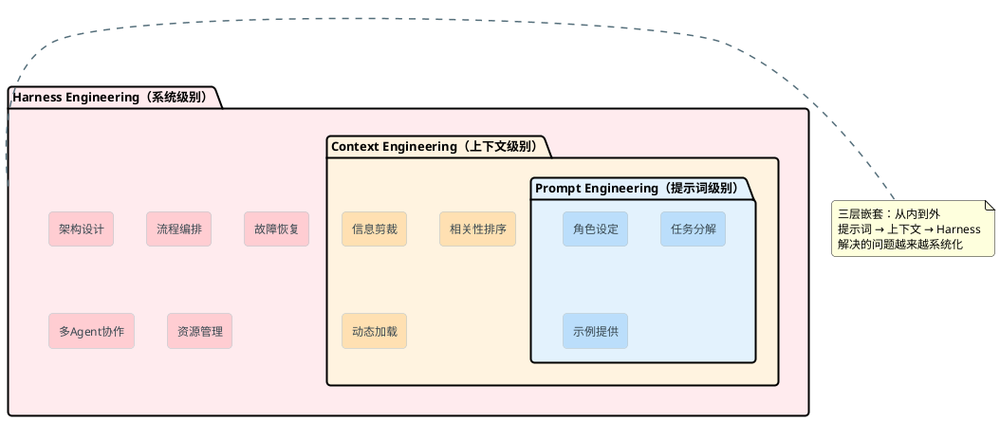
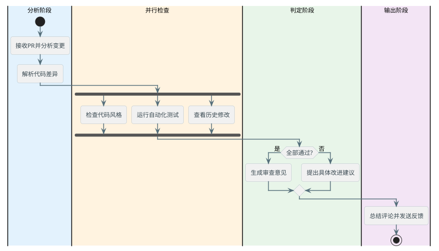
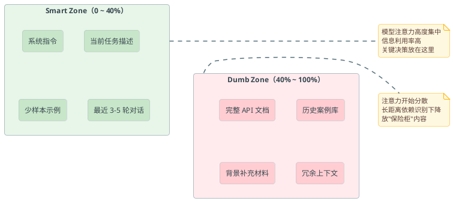
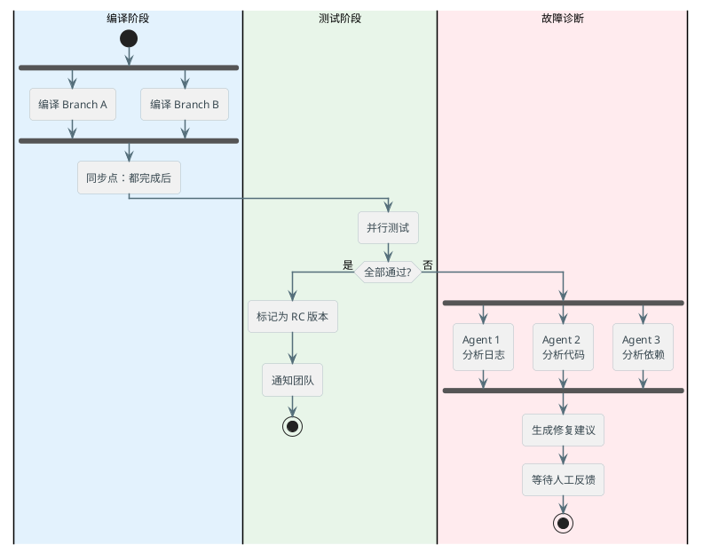
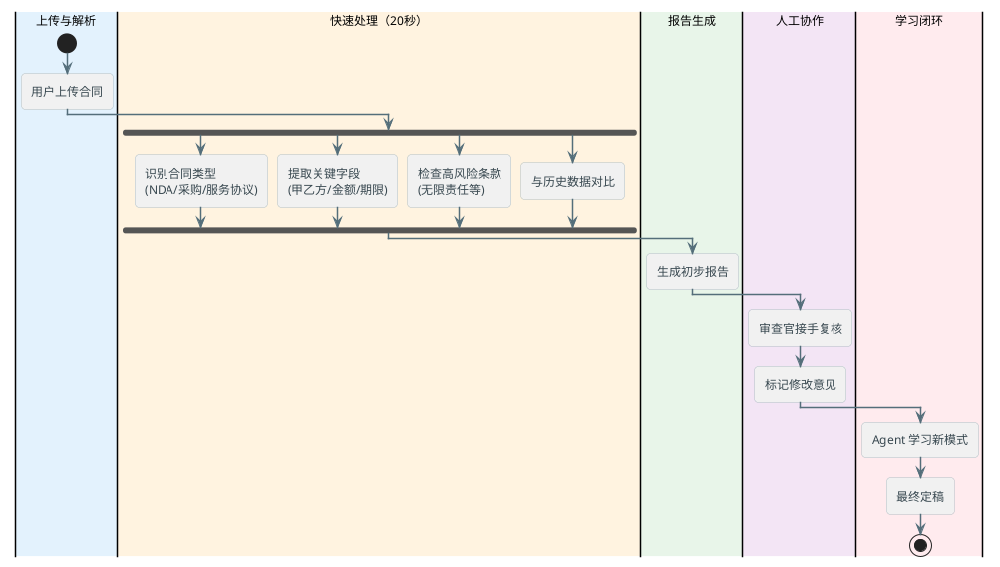

# Harness工程化实战

即使是同一个大模型，如果换个不同的"系统设计"，Agent的表现可能从6.7%直接跳到68.3%。这是实打实的基准测试数据得出来的现象。

那这"系统设计"到底是什么？我们通常叫它**Harness**，简单说就是围绕模型的"操作系统"。

## Agent = Model + Harness

首先我们要先理清楚一个概念：**Agent不等于大模型本身**。

想象一下你的笔记本电脑。CPU（处理器）很强大，但光有CPU你能干什么？啥都干不了。你需要操作系统（Windows、macOS）、文件系统、网络驱动、内存管理，才能真正用它来工作。

Agent也是一样的道理：

```
Agent = LLM Model（CPU）+ Harness（操作系统）
```

**模型** 负责推理和理解，但**Harness** 负责：
- 把问题分解成模型能理解的形式
- 管理工具调用和执行结果
- 维护对话的上下文和记忆
- 监控Agent是否在正确的轨道上
- 当出问题时怎么恢复

### 为什么模型不是瓶颈？

很多人的第一反应是："那我换个更强的模型不就行了？"

但实际上，**同一个模型，不同的Harness实现，能力差异可以达到10倍**。这是为什么呢？

因为：
1. **模型的输出质量取决于输入质量**——你给它的背景信息越清楚，它理解得就越准
2. **工具调用的成功率取决于系统设计**——不是模型聪明就能用好工具，还要系统告诉它什么时候用、怎么用、失败了怎么办
3. **多步推理的一致性取决于上下文管理**——同样的问题，不同的提示方式，答案差异巨大

某大型AI实验室做过对比测试：用同一个模型，给一个团队的标准提示词，给另一个团队的却是精心设计的Harness系统。结果前者在某个基准上是6.7%的准确率，后者直接到了68.3%。**同一个模型，1000%的性能提升**。

:::tip
这就是为什么工程能力比单纯追求"更大的模型"更重要。在实际项目中，大多数情况下，一个设计精良的Harness + 中等大小的模型，比一个简陋的系统 + 最大的模型还要能打。
:::

## 从提示词工程到Harness工程

整个Agent系统的设计，是一个**嵌套的工程层次**：



可以看到这三层的关系，是在**层层递进**：

- **提示词工程** 是基础：你的任务描述、角色扮演、少样本示例都在这一层
- **上下文工程** 在提示词上加了一层智能：会动态地选择最相关的信息，规划它们的呈现顺序
- **Harness工程** 在上下文工程上加了系统复杂性：管理整个Agent的生命周期、多工具编排、故障处理、长期记忆

## Agent Harness的六层架构

这是业界普遍认可的Agent系统设计框架，从下往上分别是：

### L1：信息边界（Information Boundary）

最底层，定义了Agent能看到什么。

不仅仅只是简单的"给Agent访问所有文件"。而且还系统化地定义：
- Agent能读取哪些数据源？
- 对这些数据的访问权限是什么？
- 数据的哪些部分是敏感的？
- 如何防止Agent看到它不应该看的东西？

实例：某个自动代码审查系统，L1层定义了"Agent可以访问仓库代码，但不能访问API密钥文件"。这个限制就不能通过提示词实现的，直接在系统架构上就限制住了。

### L2：工具系统（Tool System）

定义了Agent能做什么。

不仅仅"告诉Agent它有这些工具"，还包括：
- 工具的API是否明确？
- 工具的失败模式是什么？
- 工具的调用成本是多少（速度、费用）？
- 工具之间如何组合？

典型的工具包括：

```python
# 代码审查系统的工具集
tools = [
    {
        "name": "read_file",
        "description": "读取仓库中的文件内容",
        "params": ["file_path", "start_line", "end_line"],
        "cost": "O(file_size) tokens"
    },
    {
        "name": "run_tests",
        "description": "在修改后运行单元测试",
        "params": ["test_pattern", "timeout"],
        "cost": "O(log_size) tokens"
    },
    {
        "name": "check_style",
        "description": "检查代码风格是否符合规范",
        "params": ["file_path"],
        "cost": "O(code_lines) tokens"
    },
    {
        "name": "suggest_improvement",
        "description": "基于分析提出改进建议",
        "params": ["issue_type", "severity"],
        "cost": "O(1) tokens"
    }
]
```

### L3：执行编排（Execution Orchestration）

定义了Agent怎么动作。

这一层处理的是工作流问题：
- 多个工具的调用顺序是什么？
- 某个步骤失败了怎么办？回退还是重试还是放弃？
- 如何避免无限循环（Agent一直在做重复的事）？
- 什么时候认为任务完成了？

一个完整的编排可能看起来像这样：



### L4：记忆与状态（Memory & State）

定义了Agent如何"记住"事情。

最基础的是对话历史，但真正的系统还需要：
- **工作记忆**：当前任务的中间结果、已做过的决策
- **长期记忆**：历史模式、已学到的规则、类似问题的解决方案
- **状态机制**：Agent当前在流程的哪一步？是否卡住了？

例如，智能部署系统会记录：
- "最后一次部署失败的原因是什么？"
- "这个微服务的依赖关系图是什么？"
- "上次遇到这个错误是怎么解决的？"

### L5：评估与可观测性（Evaluation & Observability）

定义了Agent怎么知道自己做得好不好。

这包括：
- **中间步骤的验证**：Agent提出的代码建议，真的能通过测试吗？
- **指标收集**：成功率、耗时、成本、用户满意度
- **日志追踪**：能看到Agent的每个决策点

一个健全的系统必须有可观测性，否则你根本不知道哪里出了问题：

```python
# 观测示例
metrics = {
    "code_review_accuracy": 0.92,  # 86% recall, 98% precision
    "avg_review_time": 2.3,  # 秒
    "tool_call_success_rate": 0.95,
    "context_utilization": 0.38  # 38% of token budget used
}
```

### L6：约束与恢复（Constraints & Recovery）

定义了Agent的边界和逃生通道。

约束包括：
- 最多能调用多少次工具？
- 最长能运行多久？
- 最多能消耗多少tokens？
- 遇到某些错误必须立即停止吗？

恢复策略包括：
- 超时了怎么办？返回部分结果还是重新开始？
- 同一个错误重复发生3次，是否应该放弃这个方向？
- Agent卡死了，有没有人工介入的机制？

:::warning
不设置约束的Agent是危险的。某支付平台的自动化系统曾经因为没有好的约束设计，导致Agent陷入死循环，白白消耗了大量API配额。
:::

## 上下文利用率的40%魔法线

这是个很关键但经常被忽视的指标。

想象你的模型有168K的上下文窗口。理论上你可以往里塞168K的token。但实际上，**当上下文利用率超过40%时，模型的表现开始明显下降**。

为什么？几个原因：
1. **注意力机制的局限**：模型的注意力分散了，找不到关键信息
2. **上下文长度导致的衰减**：即使是最好的模型，在超长上下文中也容易遗漏信息
3. **编码效率**：加载太多信息会干扰模型对关键任务的专注

所以我们把上下文区分为两个区域：



**工程实践**：
- 在Smart Zone放最重要的东西：系统指令、当前任务、最近的3-5个对话历史
- 在Dumb Zone放"保险柜"的东西：完整的API文档、历史案例库、背景资料
- 关键转折点（Agent要做关键决策时），清空一些背景信息，重新进入Smart Zone

## AGENTS.md实战

如果你用过某些开源框架，可能看过这样的文件结构。但在Harness体系里，AGENTS.md是一个**核心的工程文件**。

这份文档不只是包含"Agent使用说明"，还具有**Agent能力的可执行定义**。

一个完整的AGENTS.md应该包括：

```markdown
# Harness定义

## 我能做什么（能力清单）
- 自动代码审查（识别风格问题、性能问题）
- 运行测试套件（单元测试、集成测试）
- 提出改进建议（基于代码模式匹配）

## 我怎么做（工具定义）
### read_repository
- 输入：file_path
- 输出：代码内容 + 依赖信息
- 成本：O(file_size) tokens

### analyze_code
- 输入：代码片段 + 分析类型
- 输出：问题列表 + 严重性评级
- 成本：O(code_length) tokens

## 我的限制（边界）
- 最多分析 10 个文件/次
- 最多审查 5000 行代码
- 不能修改代码（只能建议）

## 我的记忆（上下文策略）
- 保留最后 5 个任务的结果
- 项目规范永久存储
- 用户反馈用于持续改进

## 成功标准（评估指标）
- 代码审查准确率 > 90%
- 平均响应时间 < 3 秒
- 用户采纳率 > 70%
```

AGENTS.md的价值在于：
1. **渐进式公开（Progressive Disclosure）**：不是一开始就告诉Agent"你能做任何事"，而是明确定义边界
2. **成本预估**：每个能力都标注了成本，规划系统资源变得可行
3. **可验证性**：团队能基于AGENTS.md写测试、监控Agent的行为

## 系统化的构建优先级

实战中，不可能一上来就搭完整个Harness系统。需要按阶段构建，前人总结的通常是：

### P0：基础框架（必须有）

这些是Agent能工作的最小集合：

1. **AGENTS.md + 自定义Linter**
   - 定义Agent能做什么、不能做什么
   - 用Linter检查Agent的输出是否符合规范

2. **仓库作为知识源**
   - Agent能读取项目的代码、配置、文档
   - 这成为Agent的"常识库"

3. **基础工具集**
   - 最常用的3-5个工具（不要过多）
   - 例如：读文件、运行命令、保存结果

实现这个阶段，3个人花2-3周，足够支撑一个中等规模的应用。

### P1：生产可用（关键）

这些让系统真正可用：

1. **分层上下文策略**
   - 动态选择相关信息，避免全部塞进去
   - 在Smart Zone和Dumb Zone之间平衡

2. **进度跟踪与验证**
   - Agent每完成一个子任务，系统验证一下是否正确
   - E2E测试确保整个流程可靠

3. **上下文利用率监控**
   - 实时看Agent用了多少上下文
   - 如果接近上限，主动降低精度或取消某些步骤

实现这个阶段，一个小团队花1-2个月，会有显著的可靠性提升。

### P2：智能化与优化（必要时）

这些是"高级功能"，只在P1稳定后才考虑：

1. **Agent特化**
   - 同一个系统，不同类型的问题用不同的Agent
   - 例如：快速Agent（用小模型，快但不够精确）vs 深度Agent（用大模型，慢但准确）

2. **智能垃圾回收**
   - 自动清理不再需要的上下文
   - 学习哪些信息实际上没用过

3. **可观测性深化**
   - 完整的链路追踪
   - 性能瓶颈分析
   - 自动化告警

## 实践案例：智能部署系统

这是根据业界案例改编的真实场景。某开源框架团队搭建了一个**自动化编译+部署系统**，用2个Agent并行处理。

**背景**：
- 代码仓库：10万行代码
- 每周构建：上千次
- 平均修复时间：60分钟→需要降低到10分钟

**系统设计**：

L1信息边界：
- Agent能读编译日志、代码diff、配置文件
- Agent不能访问线上密钥、用户数据

L2工具系统：

```python
# 智能部署系统的工具集
tools = {
    "compile_code": {
        "description": "编译指定分支的代码",
        "params": ["target_branch", "optimization_level"],
        "timeout": 300
    },
    "run_tests": {
        "description": "运行测试套件并收集报告",
        "params": ["test_category", "timeout"],
        "cost_tokens": "depends_on_output"
    },
    "deploy_to_staging": {
        "description": "部署到预发布环境",
        "params": ["build_id", "region"],
        "requires_approval": True
    },
    "analyze_logs": {
        "description": "分析编译或运行日志找出问题",
        "params": ["log_content", "log_type"]
    }
}
```

L3编排：



L4记忆：
- 编译缓存（节省30%时间）
- 常见错误模式库（加速诊断）
- 近期修改日志（快速定位回归）

**结果**：
- 平均编译时间：120秒（以前是300秒）
- 测试通过率：从88%→96%
- 故障诊断时间：从15分钟→2分钟
- 每周能处理1600+次构建（以前是500次）

## 另一个案例：智能文档处理系统

某企业的合同审查团队，原来需要人工逐行阅读文档。现在用Agent系统大大提速。

**场景**：
- 每月处理：500份商业合同
- 人工审查时间：每份30分钟
- 需要检查：法律条款、风险点、定价合理性

**Agent的角色**：
- 快速扫描文档结构
- 提取关键信息（金额、期限、违约条款等）
- 标记潜在的法律风险
- 与历史合同对比，找出异常

**实现的关键决策**：



**量化指标**：
- 文档审查速度提升：8倍
- 漏掉法律风险的概率：从12%→3%
- 审查官花在"基础扫描"上的时间：从80%→10%
- 他们可以集中精力处理"需要创意"的合同协商

## 问题与限制：Harness还解决不了什么

说完优点，也要诚实地聊聊限制。

### 棕地项目（Brownfield Projects）

如果你的项目是一个"遗留系统"——代码混乱、文档缺失、依赖关系复杂——那么再聪明的Harness也没办法。Agent就是个"代理人"，它需要清楚地理解系统才能工作。

**对策**：不是说完全放弃，而是优先整理项目结构。至少要有：
- 模块化的代码组织
- 基本的API文档
- 核心的配置说明

### 验证间隙（Validation Gap）

Agent做出的决策，最后还是要有人或者自动化系统验证。但有时候这个验证本身就很困难。

例如：Agent建议把某个算法改进，提升性能。但验证这个改进是否真的有效，可能需要大规模测试、压力测试，耗时耗力。如果没有好的验证机制，Agent的建议就只能是"参考"，而不能直接执行。

### 创意与突破（Creativity）

Harness很擅长处理结构化的问题、有明确规则的任务。但对于需要创意、需要跳出框架思维的问题，它的帮助有限。

例如：Agent能帮你优化现有的代码，但它很难凭空设计一个全新的系统架构。这还是需要人的想象力。

## 从这里开始

如果你想在实际项目中试用Harness理念，建议的顺序是：

1. **第一周**：梳理你的项目边界
   - 定义Agent能访问什么数据
   - 列出Agent最常用的3-5个操作
   - 写一份简单的AGENTS.md

2. **第二周**：搭建最小框架
   - 连接基础工具（通常就是API调用或命令行）
   - 写几个单元测试验证工具可靠性
   - 测试不超过20行代码的prompt

3. **第三周**：观测与改进
   - 收集Agent的使用日志
   - 记录失败案例
   - 迭代优化工具和提示词

不要期望一开始就完美。好的Harness是进化出来的，不是一次性设计出来的。

:::info
关键是**明确边界、逐步迭代、持续观测**。这三个原则比任何复杂的架构都重要。
:::

---

**总结**

- **Agent ≠ 模型**：Harness是真正的差异制造者，同一模型不同系统可以达到10倍性能差异
- **六层架构**：从信息边界→工具系统→执行编排→记忆状态→评估观测→约束恢复，是系统化的设计思路
- **40%上下文门槛**：不是信息越多越好，要在Smart Zone和Dumb Zone间平衡
- **P0/P1/P2渐进**：别贪心，基础框架→生产可用→智能优化，逐步迭代
- **实战胜于理论**：最重要的是开始做，在做的过程中优化

没有完美的Harness，只有"足够好的Harness"。而什么是"足够好"，取决于你的具体需求。

所以还是需要对业务有充足的考虑才可以。
