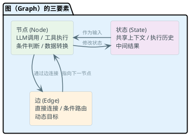
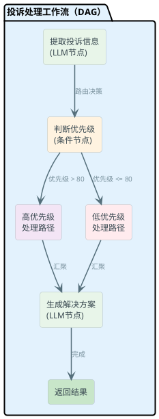
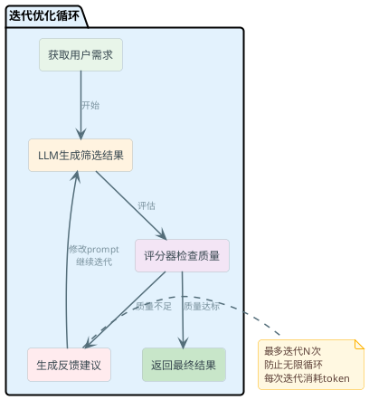

# AI工作流与执行引擎

当你用大模型时，一开始可能就是简单地"提问→回答"。但真正的智能体系统远没这么简单。想象一下自动化处理客户投诉的场景：需要先提取信息、判断优先级、调用不同的处理工具、可能还要多轮迭代优化答案。这时候，单纯的一次API调用就不够了。

这就是为什么我们需要 **工作流（Workflow）、图（Graph）、循环（Loop）** 这些概念。它们是把AI从"玩具"变成"生产系统"的关键。

## 从线性到网格：为什么需要工作流

### 传统工作流 vs AI工作流

先来对比一下：

**传统工作流**（比如RPA、业务流程管理）：
- 流程是**确定性的**：if条件为true就走A路线，否则走B路线
- 路由是**静态的**：设计时就决定了所有可能的分支
- 数据是**结构化的**：流程输入和输出都清晰定义
- 失败处理是**规则化的**：遇到错误就retry或报警

**AI工作流**就不一样了：
- 流程是**概率性的**：LLM的输出是非确定的，同一个输入可能有不同的结果
- 路由是**动态的**：根据LLM的实际输出来决定下一步去哪里
- 数据是**非结构化的**：可能处理自然语言、多模态内容
- 需要**反馈循环**：可能需要多轮交互来获得满意的结果

:::info
一个典型的例子是**客户投诉处理管道**：
1. 用户提交投诉文本
2. LLM提取关键信息（客户ID、问题类型、紧急度）
3. 基于问题类型调用不同工具（退款系统、客服回调、知识库搜索）
4. LLM生成初步方案
5. 检查方案是否满足客户需求，不满足就反馈给LLM继续优化
6. 最终给出解决方案

这整个过程不可能用静态的if-else完全定义。
:::

## 核心概念：Graph、Workflow、Loop的三角关系

### Graph：基础构件

**Graph（图）** 是最基础的概念。它由三个核心元素组成：

**节点（Node）**：
- 是处理单元。可以是LLM调用、工具执行、条件判断、数据转换等任何计算
- 每个节点接收输入状态，执行处理，返回新状态

**边（Edge）**：
- 是节点之间的连接关系
- 可以是直接边（总是执行）或条件边（基于某些条件执行）
- 支持动态路由：边的目标可以在运行时决定

**状态（State）**：
- 是节点之间传递的上下文信息
- 包含当前的数据、执行历史、中间结果等
- 每个节点都可以读取和修改状态



### Workflow：有约束的Graph

**Workflow（工作流）** 是Graph上的一层约束。最常见的约束是**DAG（有向无环图）**：
- 节点之间有明确的方向性
- 不存在循环（至少在单次执行中）
- 这样保证了流程最终会结束



:::tip
Workflow通常用于**定义结构化流程**。你知道有多少个节点、它们之间的关系是固定的。不同的是，边上的条件可以基于LLM的输出来动态判断。
:::

### Loop：迭代执行模式

**Loop（循环）** 是Graph执行的一种模式，不是结构上的改变。它表示：**在满足某个条件前，重复执行某些节点**。

典型的Loop模式是**生成→评估→反馈→优化**：

```
while not satisfied:
    answer = llm.call(prompt)
    feedback = evaluator.check(answer)
    if feedback.is_good:
        satisfied = True
    else:
        prompt = prompt + feedback.suggestions
```

这里的图结构本身还是DAG，但执行时会反复走某些边。



:::warning
**循环的危险**：如果条件写得不好，LLM可能永远无法满足，导致无限循环。必须有：
1. 最大迭代次数限制
2. Token用量限制
3. 超时时间限制
:::

## 节点类型详解

AI工作流中常见的节点类型：

### 1. LLM节点
```python
# 调用大模型进行推理
class LLMNode:
    def __init__(self, model, prompt_template):
        self.model = model
        self.template = prompt_template
    
    def execute(self, state):
        prompt = self.template.format(**state)
        response = self.model.call(prompt)
        state["llm_output"] = response
        return state
```

### 2. 工具节点
```python
# 调用外部工具/API
class ToolNode:
    def __init__(self, tool_func, name):
        self.tool = tool_func
        self.name = name
    
    def execute(self, state):
        input_data = state.get(f"{self.name}_input")
        result = self.tool(input_data)
        state[f"{self.name}_result"] = result
        return state
```

### 3. 条件节点
```python
# 基于条件决定路由
class ConditionalNode:
    def execute(self, state):
        if state["priority"] > 80:
            return "high_priority_path"
        else:
            return "low_priority_path"
```

### 4. 人工审核节点
```python
# 暂停流程，等待人类批准
class HumanInLoopNode:
    def execute(self, state):
        # 生成待审批内容
        review_item = state["pending_review"]
        # 这里通常触发webhooks或消息队列
        # 等待人类反馈后继续
        state["human_approval"] = True
        return state
```

## 状态管理：流程中的信息流

状态是连接所有节点的纽带。每个节点通过修改状态来影响后续节点。

:::info
**状态设计的关键**：
- 尽量让状态包含完整信息，但不要冗长
- 通常包含：原始输入、中间结果、LLM输出、工具结果、执行元数据
- 避免在状态中存储大对象（图片、音频）——用引用代替
:::

```python
# 典型的状态结构示例
class WorkflowState:
    # 输入
    customer_complaint: str  # 原始投诉文本
    
    # 中间处理结果
    extracted_info: dict  # LLM提取的关键信息
    priority_score: int  # 优先级评分
    
    # 工具调用结果
    customer_history: list  # 从数据库获取
    available_solutions: list  # 从知识库搜索
    
    # LLM生成的结果
    proposed_solution: str  # 初步方案
    solution_confidence: float  # 方案置信度
    
    # 执行元数据
    iteration_count: int  # 当前迭代次数
    executed_nodes: list  # 已执行的节点列表
```

## 安全边界：防止失控

当你把AI放进工作流里，必须设置好几道防线：

### 1. Token预算限制
```python
class TokenBudgetGuard:
    def __init__(self, max_tokens=100000):
        self.max_tokens = max_tokens
        self.used_tokens = 0
    
    def check_before_llm_call(self, estimated_tokens):
        if self.used_tokens + estimated_tokens > self.max_tokens:
            raise TokenLimitExceeded()
        return True
    
    def record_usage(self, actual_tokens):
        self.used_tokens += actual_tokens
```

### 2. 循环检测与限制
```python
class LoopGuard:
    def __init__(self, max_iterations=10):
        self.max_iterations = max_iterations
        self.iteration_count = 0
    
    def should_continue_loop(self):
        self.iteration_count += 1
        return self.iteration_count < self.max_iterations
    
    def on_loop_exceeded(self):
        # 使用最后一次的结果或返回错误
        return self.get_best_result_so_far()
```

### 3. 超时控制
```python
class TimeoutGuard:
    def __init__(self, timeout_seconds=300):
        self.timeout = timeout_seconds
        self.start_time = None
    
    def start_execution(self):
        self.start_time = time.time()
    
    def check_timeout(self):
        elapsed = time.time() - self.start_time
        if elapsed > self.timeout:
            raise ExecutionTimeoutException()
```

### 4. 人工批准门
```python
class ApprovalGate:
    def __init__(self, approval_threshold=0.7):
        self.threshold = approval_threshold
    
    def should_require_approval(self, action):
        # 高风险操作需要人工审批
        if action.risk_level > self.threshold:
            return True
        return False
```

:::warning
**重要提醒**：这些防线不是可选的，是**必须的**。一个LLM bug或prompt注入可能导致：
- 无限循环消耗所有token和成本
- 执行时间过长（用户等不了）
- 做出危险的决策（转账、删除数据等）
:::

## 工作流引擎框架对比

### LangGraph（Python生态）

LangGraph是Langchain推出的工作流框架，核心概念就是StateGraph。

```python
from langgraph.graph import StateGraph, END
from typing import TypedDict

class ComplaintState(TypedDict):
    complaint: str
    extracted_info: dict
    priority: int
    proposed_solution: str
    iterations: int

# 定义节点
def extract_info(state: ComplaintState):
    # 使用LLM提取信息
    state["extracted_info"] = llm.call("提取投诉信息", state["complaint"])
    return state

def judge_priority(state: ComplaintState):
    # 基于提取的信息判断优先级
    state["priority"] = calculate_priority(state["extracted_info"])
    return state

def handle_high_priority(state: ComplaintState):
    state["proposed_solution"] = llm.call("高优先级处理方案", state)
    return state

def handle_low_priority(state: ComplaintState):
    state["proposed_solution"] = llm.call("低优先级处理方案", state)
    return state

# 构建图
graph = StateGraph(ComplaintState)
graph.add_node("extract", extract_info)
graph.add_node("judge", judge_priority)
graph.add_node("high_priority", handle_high_priority)
graph.add_node("low_priority", handle_low_priority)

# 设置起点
graph.set_entry_point("extract")

# 添加边
graph.add_edge("extract", "judge")
graph.add_conditional_edges(
    "judge",
    lambda state: "high_priority" if state["priority"] > 80 else "low_priority",
    {
        "high_priority": "high_priority",
        "low_priority": "low_priority"
    }
)
graph.add_edge("high_priority", END)
graph.add_edge("low_priority", END)

# 编译并执行
compiled = graph.compile()
result = compiled.invoke({"complaint": "我的订单一直没收到...", "iterations": 0})
```

:::tip
LangGraph的优势：
- 类型安全（使用TypedDict定义状态）
- 支持条件边和动态路由
- 集成度高（与其他Langchain工具无缝配合）
- 易于调试（能追踪每个节点的执行）
:::

### Spring AI（Java生态）

Java这边没有完全等价的框架，但Spring AI提供了一套pattern。

```java
// 定义状态
public class ComplaintWorkflowState {
    private String complaint;
    private Map<String, Object> extractedInfo;
    private int priority;
    private String proposedSolution;
    
    // getters and setters...
}

// 定义节点
public class ComplaintWorkflow {
    private final ChatClient chatClient;
    
    public ComplaintWorkflowState extractInfo(ComplaintWorkflowState state) {
        String response = chatClient.prompt()
            .user("提取投诉信息: " + state.getComplaint())
            .call()
            .content();
        state.setExtractedInfo(parseJson(response));
        return state;
    }
    
    public ComplaintWorkflowState judgePriority(ComplaintWorkflowState state) {
        // 判断优先级逻辑
        int priority = calculatePriority(state.getExtractedInfo());
        state.setPriority(priority);
        return state;
    }
    
    // Builder pattern构建工作流
    public ComplaintWorkflowState execute(String complaint) {
        ComplaintWorkflowState state = new ComplaintWorkflowState();
        state.setComplaint(complaint);
        
        // 顺序执行
        state = extractInfo(state);
        state = judgePriority(state);
        
        // 条件路由
        if (state.getPriority() > 80) {
            state = handleHighPriority(state);
        } else {
            state = handleLowPriority(state);
        }
        
        return state;
    }
}
```

:::info
Java这边的思路比较"老派"，通常用Builder或Callback pattern实现工作流，没有像LangGraph那样的专门框架。如果要更复杂的DAG执行，可能需要引入Alibaba的Spring AI或自定义实现。
:::

## 实战模式：五种常见工作流设计

### 1. 链式流程（Chain）

最简单的模式：A → B → C → 完成

```
用户输入 → LLM分析 → 调用API → 格式化输出
```

适用于：顺序处理、无分支的场景

### 2. 路由模式（Router）

根据条件选择不同分支：

```
输入 → 判断类型 ──→ 处理器A → 输出
              ──→ 处理器B → 输出
              ──→ 处理器C → 输出
```

适用于：多分类、多渠道场景（客服机器人的意图识别）

### 3. 并行扇出/汇聚（Fan-out/Fan-in）

同时执行多个任务，然后汇聚结果：

```
        ┌─→ 任务1 ─┐
输入 ───┼─→ 任务2 ─┼─→ 汇聚 → 输出
        └─→ 任务3 ─┘
```

适用于：需要多角度分析的场景（简历筛选同时从多个维度评估）

```python
# 伪代码示例
async def parallel_resume_screening(state):
    # 并行启动多个评估任务
    technical_score = await evaluate_technical_skills(state["resume"])
    experience_score = await evaluate_experience(state["resume"])
    cultural_fit = await evaluate_culture_fit(state["resume"])
    
    state["scores"] = {
        "technical": technical_score,
        "experience": experience_score,
        "culture": cultural_fit
    }
    state["final_score"] = (technical_score + experience_score + cultural_fit) / 3
    return state
```

### 4. 迭代优化（Iterative Refinement）

重复执行→评估→反馈的循环：

```
输入 → 生成v1 → 评估 ──不满足──> [反馈] ─┐
                 │                           │
                 └────────────────────────────┘
                    满足
                      ↓
                    输出
```

适用于：高质量要求的内容生成（文案、代码、分析报告）

```python
# 迭代优化示例
def iterative_content_generation(topic, max_iterations=3):
    state = {
        "topic": topic,
        "content": "",
        "feedback": "",
        "iteration": 0
    }
    
    while state["iteration"] < max_iterations:
        # 生成内容
        state["content"] = llm.generate(state["topic"], state["feedback"])
        
        # 质量评估
        quality = evaluate_content_quality(state["content"])
        
        if quality.score > 0.8:
            return state["content"]
        
        # 生成改进建议
        state["feedback"] = llm.feedback(state["content"], quality.issues)
        state["iteration"] += 1
    
    return state["content"]  # 返回最后一次结果
```

### 5. 智能体循环（Agentic Loop）

这是最复杂的模式：LLM决定下一步行动，动态调用工具

```
用户输入
   ↓
LLM思考 ──→ 需要工具？
   ↑          ├─ 调用工具A
   │          ├─ 调用工具B
   │          └─ 给出最终答案
   └──────────[反馈循环]
```

适用于：开放式任务、需要自适应的场景（智能客服、自动化运维）

```python
# 简化的智能体示例
def agentic_loop(user_query):
    state = {
        "query": user_query,
        "history": [],
        "tools_used": [],
        "final_answer": None
    }
    
    for iteration in range(max_iterations):
        # LLM思考应该做什么
        thought = llm.reason_about_action(state)
        state["history"].append({"role": "thought", "content": thought})
        
        # 根据思考决定行动
        action = parse_action(thought)  # 从LLM输出解析出action
        
        if action.type == "use_tool":
            # 调用工具
            tool_result = execute_tool(action.tool_name, action.args)
            state["tools_used"].append(action.tool_name)
            state["history"].append({"role": "tool_result", "content": tool_result})
        
        elif action.type == "final_answer":
            state["final_answer"] = action.answer
            break
    
    return state["final_answer"]
```

:::warning
智能体循环很强大，但也很危险：
- LLM可能陷入无限思考
- 可能调用错误的工具导致副作用
- 必须设置严格的边界（token限制、工具白名单、人工审批）
:::

## 设计工作流时的常见坑

### 坑1：状态爆炸

如果state里装了过多的中间结果，会导致：
- 难以追踪数据流向
- 每个节点都需要理解所有状态字段
- 调试困难

**解决**：设计时要有意识地清理不需要的中间结果，或使用命名空间隔离。

### 坑2：条件判断不够清晰

```python
# 不好的例子
if state.get("score"):  # score可能是0，会被误判为False
    continue
```

**解决**：显式判断，或使用type hints确保类型正确。

### 坑3：错误传播

一个节点的异常可能让整个流程崩溃。

**解决**：给每个节点加try-catch，返回特殊状态标志，让后续节点做fallback处理。

### 坑4：忽视LLM的不可靠性

LLM不会100%按照你的指令格式输出。

**解决**：
- 使用structured output（如JSON mode）
- 添加验证和重试逻辑
- 设计fallback方案

```python
def safe_llm_call(prompt, max_retries=3):
    for attempt in range(max_retries):
        try:
            response = llm.call(prompt)
            result = parse_json(response)
            validate_schema(result)  # 验证格式
            return result
        except (json.JSONDecodeError, ValidationError):
            if attempt == max_retries - 1:
                return get_default_fallback_result()
```

## 总结：何时选择什么

| 场景 | 推荐方案 | 理由 |
|------|--------|------|
| 简单线性流程 | Chain | 实现简单，易维护 |
| 多类型请求 | Router | 清晰的分类逻辑 |
| 需要多角度分析 | Fan-out/Fan-in | 充分利用并行性 |
| 对质量有高要求 | Iterative Refinement | 逐步改进结果 |
| 完全开放式任务 | Agentic Loop | 自适应能力强 |

最后提一句：没有绝对正确的设计。同一个问题可以用多种方式解决。关键是理解各种模式的权衡，选择最适合你业务的那种。

---

**参考资源**：
- LangGraph 文档：https://python.langchain.com/docs/langgraph/
- Spring AI：https://github.com/alibaba/spring-ai-alibaba
- AI Agent论文参考：ReAct, Tool Use in LLMs
