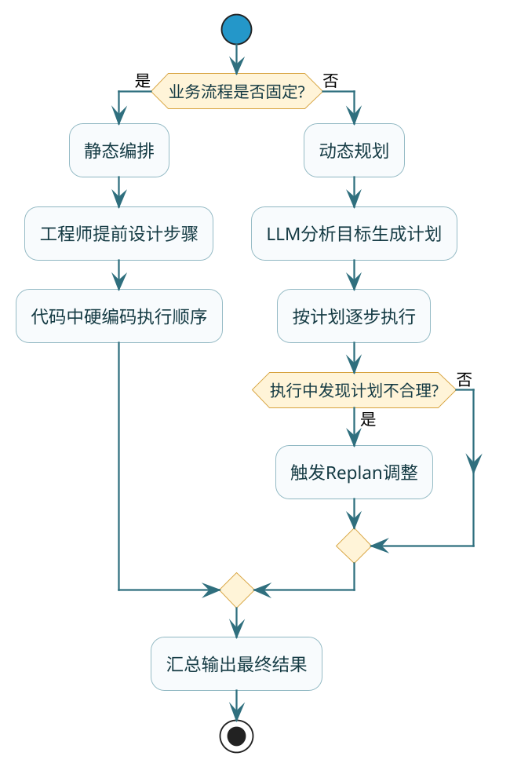
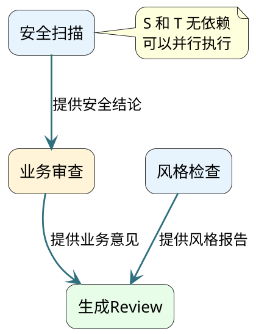

# 复杂任务的分解之道

## 一个Agent翻车的真实案例

先看一个实际项目中遇到的问题。我们团队做了一个自动化代码审查Agent，用户提交PR后它负责完成"安全扫描→代码风格检查→业务逻辑审查→生成Review意见"这一整套流程。

上线初期效果还不错，但很快就暴露了一个诡异的问题：当PR改动文件超过5个的时候，Agent生成的Review意见开始出现了错误——明明是A文件的问题，意见却写到了B文件上面；有时候安全扫描的结论和业务逻辑审查的结论互相矛盾。

问题出在哪？我们把中间过程dump出来一看就明白了：所有步骤的中间结果都堆在同一个上下文里，到后面几步的时候，LLM的"工作台"上已经放了几千个token的杂乱信息，它根本分不清哪些信息属于哪个步骤了。

这就是任务分解要解决的核心问题。

## 为什么LLM处理不了"大任务"

:::info 核心认知
任务分解不是什么高深的架构设计，本质上是在适配LLM的认知特性。就像你不会让一个实习生同时处理十件事一样，LLM也有它的处理边界。
:::

### 上下文窗口的"工作台"隐喻

LLM的上下文窗口可以理解为它的工作台。虽然现在的模型窗口越来越大（128K甚至更多），但"工作台大"不等于"能同时干好很多事"。

这里有个容易被忽略的现象：**有效注意力递减**。当上下文中塞满了各种中间状态时，LLM对每段信息的关注质量会明显下降。学术界有个实验结论——当上下文长度超过一定阈值后，模型对中间位置信息的回忆准确率会显著下降（也就是所谓的"Lost in the Middle"问题）。

所以问题不在于窗口装不下，而在于装太多之后模型"记不住重点"。

### 目标追踪的漂移问题

另一个隐性问题是**目标漂移**。给LLM一个复杂指令，它在执行过程中容易被中间结果"带偏"——本来在做安全扫描，看到一段代码风格很差，就顺手开始评论风格问题，把原来的安全检测目标丢在一边了。

这不是模型"笨"，而是它没有人类那种"我现在在做第几步、整体目标是什么"的持续自我监控能力。任务越长，漂移的概率越高。

### 错误隔离的缺失

如果所有步骤混在一起跑，某一步出错了，你很难定位是哪个环节的问题。更糟糕的是，前面步骤的错误会像传染病一样扩散到后续所有步骤——安全扫描漏判了一个风险点，后面的业务审查可能会基于"前面都没问题"的错误前提继续推理。

拆分后，每个步骤有独立的输入输出，出问题直接重跑那一步就行，不用从头来过。

## 两条拆分路径：你来拆还是让LLM拆

任务拆分有两条路径，选哪条取决于你的业务场景有多"确定"。

### 路径一：静态编排——流程确定时你自己拆

如果业务流程是固定的、可预期的，最稳妥的做法是你自己把步骤写死。就像工厂流水线，每个工位干什么活、上一道工序的产出是下一道的输入，全都提前设计好。

回到代码审查Agent的例子，我们最后的方案就是静态编排：

```java
/**
 * 代码审查任务编排器 —— 固定四步流水线
 */
@Service
public class CodeReviewOrchestrator {

    private final ChatModel chatModel;
    private final SecurityScanner securityScanner;
    private final StyleChecker styleChecker;

    public ReviewReport executeReview(PullRequest pr) {
        // 第一步：安全扫描（只关注安全漏洞）
        SecurityResult secResult = securityScanner.scan(pr.getChangedFiles());
        log.info("安全扫描完成，发现 {} 个风险点", secResult.getRiskCount());

        // 第二步：代码风格检查（只关注格式规范）
        StyleResult styleResult = styleChecker.check(pr.getChangedFiles());
        log.info("风格检查完成，发现 {} 个违规项", styleResult.getViolationCount());

        // 第三步：业务逻辑审查（交给LLM，但只传业务相关上下文）
        String bizPrompt = buildBizReviewPrompt(pr, secResult.getSummary());
        String bizReview = chatModel.call(new Prompt(bizPrompt))
                .getResult().getOutput().getText();

        // 第四步：汇总生成最终Review意见
        return mergeResults(secResult, styleResult, bizReview);
    }
}
```

静态编排的好处一目了然：每一步做什么、输入输出是什么、出错了找谁，全部写在代码里，生产环境跑起来非常稳。

:::tip 什么样的业务适合用静态编排？
可以问自己一个这样的问题：这个流程三个月后还是这样跑吗？如果答案是"大概率是"，就用静态编排。
:::

### 路径二：动态规划——任务不确定时让LLM拆

但如果用户的请求千变万化，你没办法提前枚举所有可能的流程，就得让LLM自己来做拆分决策。

比如一个通用的研发助手Agent，用户可能说"帮我调研一下Java 21的虚拟线程和Go协程的性能差异"，也可能说"给这段代码加上单元测试"——你没法用一套固定流程覆盖所有请求。

这时候的做法是：先让LLM生成一份执行计划，再按计划逐步执行。

```java
/**
 * 动态规划执行器 —— LLM自主决定执行步骤
 */
@Service
public class DynamicPlanExecutor {

    private final ChatModel plannerModel;  // 用强模型做规划
    private final ChatModel executorModel; // 用便宜模型做执行

    public String execute(String userGoal) {
        // 阶段一：让LLM生成结构化的执行计划
        String planPrompt = """
            你是一个任务规划专家。用户的目标是：%s
            
            请将这个目标拆解为3-7个具体的执行步骤。
            每个步骤要满足：
            1. 只做一件明确的事
            2. 有清晰的完成标志
            3. 标注它依赖哪些前序步骤的结果
            
            输出JSON格式：
            [{"step": 1, "task": "...", "depends_on": [], "done_signal": "..."}]
            """.formatted(userGoal);

        String planJson = plannerModel.call(new Prompt(planPrompt))
                .getResult().getOutput().getText();
        List<PlanStep> steps = parseSteps(planJson);
        log.info("规划完成，共 {} 步", steps.size());

        // 阶段二：按依赖顺序逐步执行
        Map<Integer, String> results = new LinkedHashMap<>();
        for (PlanStep step : steps) {
            String context = buildStepContext(step, results);
            String stepResult = executorModel.call(new Prompt(context))
                    .getResult().getOutput().getText();
            results.put(step.getStep(), stepResult);
            log.info("步骤{}完成: {}", step.getStep(), step.getTask());
        }

        // 阶段三：汇总所有结果
        return summarize(userGoal, results);
    }
}
```

:::warning 动态规划的风险点
LLM生成的计划不一定靠谱——有时候步骤遗漏了关键环节，有时候拆得太细导致冗余。所以动态规划通常要搭配一个**计划校验环节**，比如让另一个LLM评估计划的完备性。
:::

### 两条路径的核心差异

| 维度 | 静态编排 | 动态规划 |
|------|----------|----------|
| 流程来源 | 工程师提前设计 | LLM实时生成 |
| 灵活性 | 低，只能走固定路径 | 高，按任务特点定制 |
| 可靠性 | 高，行为完全可预测 | 中，规划质量不稳定 |
| 调试难度 | 低，出问题一眼定位 | 高，得看规划是否合理 |
| 适合场景 | 业务流程固定 | 用户请求千变万化 |



## 并行调度：识别依赖关系，压缩总耗时

步骤拆好之后还有一个大的优化空间：不是所有步骤都必须串行的执行。

### 依赖关系分析

回到代码审查的场景。安全扫描和风格检查之间有依赖吗？没有。它们各自读取PR的文件列表，互不影响，完全可以同时跑。但业务逻辑审查需要知道安全扫描的结论（比如某段代码已经被标记为高风险，业务审查就可以跳过它），所以它依赖安全扫描的结果。

把这种关系画成图（学名叫有向无环图DAG），一眼就能看出哪些可以并行：



### 并行执行的实现

在Java中，利用CompletableFuture可以很自然地实现这种并行调度：

```java
public ReviewReport executeParallel(PullRequest pr) {
    // 安全扫描和风格检查并行执行（互不依赖）
    CompletableFuture<SecurityResult> secFuture = CompletableFuture
            .supplyAsync(() -> securityScanner.scan(pr.getChangedFiles()));
    CompletableFuture<StyleResult> styleFuture = CompletableFuture
            .supplyAsync(() -> styleChecker.check(pr.getChangedFiles()));

    // 等两个并行任务都完成
    SecurityResult secResult = secFuture.join();
    StyleResult styleResult = styleFuture.join();

    // 业务审查依赖安全扫描结果，必须等它完成后再执行
    String bizReview = doBizReview(pr, secResult);

    // 最终汇总
    return mergeResults(secResult, styleResult, bizReview);
}
```

### 收益有多大

假设四步各需要3秒：
- 串行：3 + 3 + 3 + 3 = **12秒**
- 并行（S和T并行）：max(3,3) + 3 + 3 = **9秒**，省了25%

这只是4步的简单场景。实际项目中步骤越多、可并行的比例越高，收益越明显。我们的代码审查Agent上线后，通过并行优化把P99延迟从14秒降到了8秒，降幅接近43%。

:::info 并行的前提条件
并行优化的前提是你能准确识别出哪些步骤之间没有依赖。如果判断错误——比如把有数据依赖的两步强行并行——结果会出错且难以排查。宁可保守一点串行，也不要冒险并行。
:::

## 粒度把控：拆多细才合适

拆分不是越细越好，粒度把控是一个工程判断。

### 拆太细的代价

把"安全扫描"拆成"扫描SQL注入" + "扫描XSS" + "扫描CSRF" + "扫描文件上传" + "扫描认证绕过"……每个独立跑一次LLM，结果：
- Token消耗翻了好几倍（每次调用都要带上下文）
- 各步骤之间缺乏全局视角，可能漏掉跨类型的组合漏洞
- 最后汇总的时候还得再花一次调用来整合

### 拆太粗的后果

把"完整代码审查"作为一个步骤一口气让LLM做完——就回到了文章开头的问题：工作台太乱，质量崩盘。

### "原子任务"判断标准

我用一个简单规则来判断粒度是否合适：**能不能用一句话清楚描述这步要做什么、完成后能得到什么**。

好的拆分：
- "扫描PR中所有Java文件的安全漏洞，输出风险等级和定位" ✓
- "检查代码是否符合团队编码规范，输出违规行列表" ✓

不好的拆分：
- "对代码进行全面分析" ✗ 太笼统
- "检查第42行的变量命名" ✗ 太碎了

## 自适应分解：做不好就继续拆

静态和动态拆分都有一个共同的假设：拆分是一次性完成的。但现实中经常碰到这种情况——某一步你觉得应该能搞定，实际执行后发现它比预想的复杂得多。

自适应分解的思路很直接：**先试着做，做不好就把这一步再拆细一点重新做**。

```java
/**
 * 自适应分解执行器：做不好就继续拆
 */
public String adaptiveExecute(String task, int depth) {
    if (depth > 3) {
        // 防止无限递归，最多拆三层
        return forceExecute(task);
    }

    // 先尝试直接执行
    ExecutionResult result = tryExecute(task);

    if (result.isQualityAcceptable()) {
        return result.getOutput();  // 做好了就直接返回
    }

    // 做不好，交给规划器再拆细
    log.info("任务 [{}] 质量不达标，触发子任务拆分 (depth={})", task, depth);
    List<String> subTasks = plannerModel.decompose(task);

    // 对每个子任务递归执行同样的逻辑
    StringBuilder combined = new StringBuilder();
    for (String sub : subTasks) {
        combined.append(adaptiveExecute(sub, depth + 1));
    }
    return combined.toString();
}
```

这种递归展开的方式有个好处：简单任务一步到位不浪费调用，复杂任务按需拆解不会因为粒度不够而失败。计算开销是和实际难度成正比的。

## Replan机制：计划跟不上变化怎么办

动态规划有一个天生的弱点：计划是在执行前制定的，但执行过程中会产生新信息，可能让原计划变得不合理。

举个例子：Agent规划了"先查Java 21虚拟线程的benchmark数据"这一步，执行后发现根本没有公开的权威benchmark，那后面"基于benchmark做对比分析"的步骤就没意义了，整个计划需要调整。

Replan的实现思路：

```java
public String executeWithReplan(String goal) {
    List<PlanStep> plan = generatePlan(goal);
    Map<Integer, String> results = new LinkedHashMap<>();

    for (int i = 0; i < plan.size(); i++) {
        PlanStep current = plan.get(i);
        String stepResult = executeStep(current, results);
        results.put(current.getStep(), stepResult);

        // 每步执行完，评估剩余计划是否还合理
        if (i < plan.size() - 1 && shouldReplan(stepResult, plan, i)) {
            log.info("步骤{}结果偏离预期，触发Replan", current.getStep());
            List<PlanStep> newPlan = replan(goal, results, plan.subList(i + 1, plan.size()));
            plan = mergePlan(plan.subList(0, i + 1), newPlan);
        }
    }
    return summarize(goal, results);
}

private boolean shouldReplan(String result, List<PlanStep> plan, int currentIdx) {
    // 触发Replan的条件：
    // 1. 当前步骤执行失败
    // 2. 当前步骤的输出和预期差异很大
    // 3. 发现了规划时未预料到的新信息
    return resultDeviatesTooMuch(result, plan.get(currentIdx).getDoneSignal());
}
```

:::warning Replan的成本
每次Replan都是一次额外的LLM调用，所以不要每步都触发。实践中我们设置了偏离阈值——只有当步骤结果和预期完成信号的语义相似度低于0.6时才触发Replan。正常情况下大约15%的执行会触发一次Replan，成本可控。
:::

## 拆分质量的验收标准

最后说一个容易被忽略但很重要的问题：怎么判断你的拆分方案好不好？

三条验收标准：

**完备性** —— 所有步骤的输出合在一起，能不能完整覆盖原始任务的要求。拆完之后把每步的"目标描述"拼在一起读一遍，看有没有原始需求里提到的点被遗漏了。

**独立性** —— 每步的职责边界是否清晰，有没有两步在做重复的事。如果"安全扫描"和"漏洞分析"大量重叠，说明拆分边界有问题，应该合并成一步或者重新划分。

**可验证性** —— 每步执行完，能不能用一个简单的规则判断它做对了没有。比如"安全扫描"这一步，完成后输出中必须包含风险等级和漏洞定位，缺了任何一项就算没做好，自动触发重试。

这三条类似于微服务设计中的"高内聚、低耦合、可测试"——虽然场景不同，但背后的工程思想是相通的。

## 小结

| 知识点 | 核心要点 |
|--------|----------|
| 为什么要拆 | LLM的注意力递减 + 目标漂移 + 错误扩散 |
| 静态编排 | 流程固定时自己拆，行为可预测，调试方便 |
| 动态规划 | 任务不确定时LLM拆，灵活但规划质量不稳定 |
| 并行调度 | 画出DAG识别无依赖步骤，并发执行压缩耗时 |
| 粒度判断 | 以"原子任务"为标准：一句话描述清楚做什么和得到什么 |
| 自适应分解 | 做不好就再拆细，计算开销和实际难度成正比 |
| Replan | 执行中发现计划不合理就调整，不死守过时方案 |
