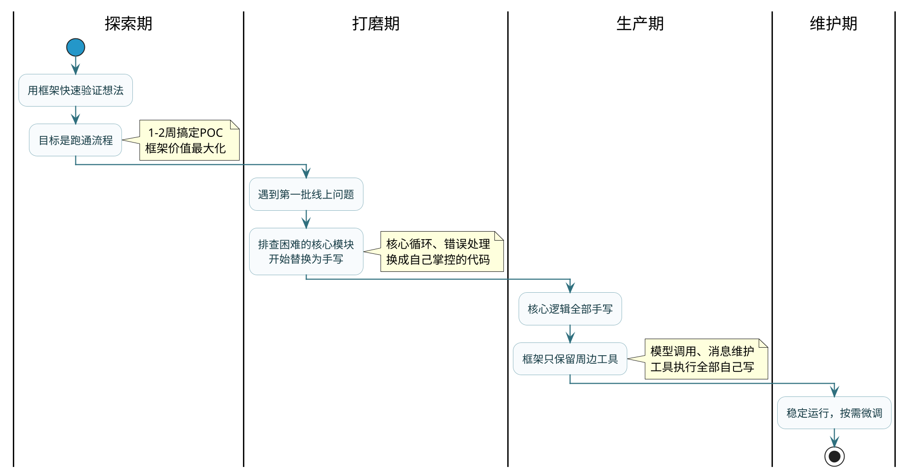

# 手搓Agent还是用框架

:::tip 实战项目推荐
这篇讨论选框架还是手写，超级 AI 智能体提供了一个折中参考：核心链路保持可控，同时复用 Spring AI 等成熟能力，把透明度、扩展性和工程效率结合起来。

项目详细介绍：**[什么是超级 AI 智能体？](/super-agent/overview/project-intro)**
:::

## 这道题背后在考什么

面试中经常会被问到"你们项目里为什么不直接用LangChain/Spring AI的Agent封装"——这个问题看起来在问技术选型，实际上是在考你对**工程控制权**的理解深度。

回答"框架快，所以用框架"说明你只停在表面。回答"框架不好，所以手写"说明你在走极端。好的回答应该能说清楚：框架在什么阶段有价值、在什么阶段变成负担、以及你怎么找到两者之间的平衡点。

## 框架给你省了什么

先要承认框架的确实是有用的，它确实解决了一堆重复劳动。要不然人家也不会这么费劲地去做了。

你从零搭一个Agent，至少得处理这些事：定义工具的JSON Schema让LLM能理解、解析LLM返回的tool_calls结构、维护多轮对话的消息历史、处理工具调用失败时的重试逻辑、管理上下文长度防止爆窗口。这些工作每个Agent项目都要做一遍，而且写法大同小异。

框架（不管是Spring AI、LangChain还是其他）就是把上面这些"标准动作"封装成开箱即用的API。以Spring AI为例：

```java
// 用框架：三行代码搞定Agent循环
ChatClient client = ChatClient.builder(chatModel)
        .defaultTools(new SearchTool(), new CalculatorTool())
        .build();
String result = client.prompt("帮我查一下杭州明天的天气，算算带伞概率")
        .call().content();
```

这三行背后，框架替你做了：构造工具描述→调用LLM→解析tool_calls→执行工具→把结果写回消息列表→再次调用LLM→判断是否还需要工具调用→最终输出。整个ReAct循环全包了。

开发效率上的提升是实打实的，POC阶段能让你一天之内跑通一个完整流程。

## 框架什么时候开始坑你

第一天的时候看不出来有什么问题，但是在第三十天、第九十天，问题逐步就暴露出来了。

### 坑一：出了Bug你往哪找呢

项目上线两周后，测试同事反馈："Agent有时候会重复调用同一个工具，循环好几次才停下来"。你开始排查。

手上的代码只有十几行业务逻辑，但报错堆栈有四五十层。你跟着堆栈往下挖，进入了框架内部的`ToolCallingManager`→`ChatModelObservationContext`→`DefaultToolCallResultConverter`……这些类你从来没看过，也不确定是哪个环节的行为导致了重复调用。

花了半天时间读框架源码，发现是`ToolCallingChatOptions`的某个默认配置和你的场景冲突了。修复倒是简单，改一个参数就好——但定位问题花的时间远超修复时间。

这种体验类似于你开了一辆全电子化的车——平时开着很省心，但一旦亮了故障灯，你打开引擎盖看到的全是密封模块，根本无从下手，只能去4S店让诊断仪来扫。如果你开的是一辆老式机械车，哪根线松了哪个管子漏了，一打开就能看见。

### 坑二：升级就像拆盲盒

Spring AI还在快速迭代中（2024到2025年哪怕到2026年，几乎每个月都有新版本），每次升级都可能改接口。我来举几个真实遇到的情况：

- `FunctionCallback`改名成了`ToolCallback`，所有工具注册代码要改
- `ChatResponse`的结构调整了，之前`.getResult()`的路径变了
- Advisor链的执行顺序在某个版本里默默调整了，导致我们的日志记录Advisor拿到的上下文不对

每次升级都是一次"拆盲盒"——你不知道会踩到什么坑，测试通过不代表行为没变，只是你的测试没覆盖到那个Corner Case。

:::warning 生产环境的稳定性底线
对于线上系统，每一次行为变更都是风险。框架升级带来的不确定性，对高SLA要求的系统来说是很难接受的。
:::

### 坑三：通用设计的性能累赘

框架为了兼顾各种使用场景，内部做了大量"防御性"工作：每次LLM调用前后都会触发观察链（Observation）、记录详细的调用Trace、做消息格式的校验和转换。

这些逻辑你可能根本用不到，但每次调用都在跑。高并发场景下，一次请求里Agent可能循环5-6次LLM调用，这些"隐性的性能累赘"累积起来就变成了真实的延迟增加。

我们做过Profile：同样的Agent逻辑，手写版的单次循环耗时比框架版少了约120ms——这120ms里全是框架内部的观察链、回调、序列化开销。单看一次不多，但Agent循环6次就多了700ms，对用户感知的影响已经不可忽略了。

## 手写的核心价值：每一行代码都是你的

手写Agent代码的核心价值可以用三个词概括：**透明、可控、精准**。

### 透明：出了问题后，30秒定位

手写的Agent循环，消息列表怎么拼的、工具怎么选的、循环何时退出——每个细节都在你面前，不藏在任何封装后面。

```java
/**
 * 手写Agent循环 —— 每个环节都暴露在外
 */
public String runAgentLoop(String userInput) {
    List<Message> messages = new ArrayList<>();
    messages.add(new SystemMessage(SYSTEM_PROMPT));
    messages.add(new UserMessage(userInput));

    for (int turn = 0; turn < MAX_TURNS; turn++) {
        // 调用LLM
        ChatResponse response = chatModel.call(new Prompt(messages, toolOptions));
        AssistantMessage assistant = response.getResult().getOutput();
        messages.add(assistant);

        // 没有工具调用 → Agent认为任务完成
        if (!assistant.hasToolCalls()) {
            log.info("Agent完成，共{}轮", turn + 1);
            return assistant.getText();
        }

        // 逐个执行工具调用
        for (ToolCall toolCall : assistant.getToolCalls()) {
            log.info("调用工具: {} 参数: {}", toolCall.name(), toolCall.arguments());
            String toolResult = toolExecutor.execute(toolCall);
            messages.add(new ToolResponseMessage(toolCall.id(), toolResult));
        }
    }
    return "达到最大轮次限制，任务未完成";
}
```

出了问题，看这二十行代码就够了。哪一轮LLM返回了异常内容、哪个工具调用失败了、消息列表是什么状态，日志直接告诉你。

### 可控：行为不会被第三方改变

你自己写的接口签名不会突然变，不存在"某天早上发现构建失败了，原因是框架发了个新版本改了API"的情况。你依赖的只有底层的模型SDK（比如OpenAI Java SDK），这层接口相对稳定。

### 精准：只跑你需要的逻辑

手写代码里不会有任何"为了兼容其他用法"的冗余逻辑。你不需要Observation链？那它就不存在。你不需要消息格式自动转换？那就直接用原生格式。需要什么加什么，多余的一行都没有。

## 什么时候该用什么：阶段论

这个问题可不是二选一这么简单而已。多数项目的最佳策略是**随阶段演进**。



### 探索期：框架先行

目标是快速验证想法能不能跑通。框架帮你省掉所有样板代码，让你专注于业务逻辑本身。这个阶段的代码注定要改甚至推翻，没必要追求"工程完美"。

### 打磨期：核心替换

开始接入真实用户，遇到第一批线上问题。哪个模块排查起来最痛苦，就先替换哪个。通常Agent循环本身是第一个被替换的——因为它是所有问题的入口。

### 生产期：手写为主

核心路径全部手写，框架退化为"工具箱"角色——用它的文档解析器、用它的向量库连接器、用它的Embedding封装，但Agent的主循环、状态管理、错误恢复全部自己掌控。

## 折中方案：核心手写，周边借用

实践中最常见也最务实的方式是划清一条边界：

:::info 划分标准
可以试着问自己这两个问题：
1. 这个模块出了问题，我能不能在5分钟内定位原因？
2. 这个模块的行为变了，会不会影响用户感知到的结果？

两个问题只要有一个答案是"不能/会"——那就手写。否则可以用框架。
:::

按这个标准划分下来，通常是这样的：

**手写**（核心链路）：
- Agent主循环（消息管理、循环退出条件）
- 工具调用的执行和错误处理
- 上下文拼装逻辑
- 任务状态机和流转

**借用框架**（工具性质）：
- Embedding模型的调用封装
- 向量数据库的CRUD操作
- 文档解析（PDF、Word等）
- 调用链Trace可视化（比如Spring AI的Observation接口）

这种拆分的好处是：核心链路出问题你5分钟内就能定位修复，周边工具出问题影响面有限且容易替换。

## 一个判断信号

最后给一个实用的自检方法：如果你能清楚地说出"框架在这一步替我做了什么、内部经过了哪些环节"——说明你理解它，用起来有掌控感，继续用没问题。

如果你只是调了一个方法就拿到结果，但完全不知道中间发生了什么——这就是隐患。不是说今天就会出问题，而是出问题那天，你会花远超预期的时间来排查。

**框架不是问题，"不理解就依赖"才是问题。**

## 小结

| 阶段 | 策略 | 原因 |
|------|------|------|
| POC验证 | 框架先行 | 快速跑通，代码注定要改 |
| 早期上线 | 核心模块逐步替换 | 排查困难的部分优先手写 |
| 生产稳定 | 核心手写+周边借用 | 兼顾掌控权和开发效率 |

核心结论：用框架的前提是你理解它在替你做什么。一旦某个模块变成了"黑盒"且直接影响用户体验，那就是该手写的信号。
