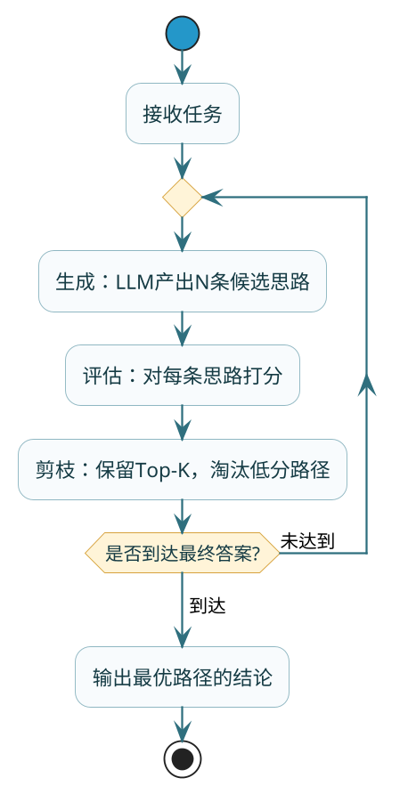

# 如何赋予Agent规划能力

:::tip 实战项目推荐
规划能力不是单纯加一句 CoT，而是要和任务状态、工具反馈、路由结果结合起来。超级 AI 智能体通过动态 Agent 和执行链路记录，展示了规划能力在真实系统里的承载方式。

项目详细介绍：**[什么是超级 AI 智能体？](/super-agent/overview/project-intro)**
:::

## LLM天生不会"想好了再做"

你让LLM回答"今年公司营收增长15%，去年是2000万，今年是多少？"——大多数时候它能直接答对。但如果问题换成"公司营收连续三年分别增长15%、20%、10%，基准是1000万，三年后是多少？"——它直接给出的答案经常是错的。

区别在哪？后者需要三步乘法累加，而LLM默认模式是"一步到位给答案"，不会自动把中间过程展开。你可以把LLM想象成一个口算很快但从不打草稿的人——简单题随便对，复杂题经常翻车，因为它不写中间步骤、不检查过程。

所谓"赋予规划能力"，本质就是**逼LLM打草稿**——把推理过程一步步写出来，每步都成为下一步的输入，这样跳步出错的概率就大幅降低了。

## 第一层：CoT——加一句话就能生效的"草稿纸"

### 原理极简

CoT（Chain of Thought，思维链）的做法简单到让人怀疑它为什么有效：在Prompt末尾加一句"请一步步思考后给出答案"，LLM就会主动把推理过程写出来。

为什么这么一句话就能改善效果？因为LLM的输出是自回归的——前面生成的token会进入上下文，影响后续token的生成。当LLM把"第一步：算第一年是1000×1.15=1150"写出来之后，这个中间结果就成了后续推理的锚点，下一步"第二年是1150×1.20=1380"就有了正确的起点。

本质上，**CoT把LLM的内部隐式计算过程变成了外部显式文本过程**，避免了在脑子里空转跳步。

### 两种触发方式

**Zero-shot CoT**——直接在指令里加触发语：

```java
String prompt = """
    用户问题：公司营收连续三年分别增长15%、20%、10%，
    基准是1000万，三年后是多少？
    
    请一步步推导后给出最终答案。
    """;
String answer = chatModel.call(new Prompt(prompt))
        .getResult().getOutput().getText();
```

**Few-shot CoT**——给几个带推理过程的示例，让LLM学着这个格式走：

```java
String prompt = """
    示例：
    问：A公司去年营收800万，今年增长25%，今年多少？
    思考过程：800 × 1.25 = 1000，所以今年营收是1000万。
    答：1000万。
    
    问：公司营收连续三年增长15%、20%、10%，基准1000万，三年后多少？
    请按照上面的格式，写出思考过程后给出答案。
    """;
```

Few-shot的效果通常会更稳定，因为你用示例约束了输出格式，LLM不容易跑偏。

### CoT的天花板

CoT有个致命限制：**它只能走一条路**。如果第一步方向就错了，后面越推越远，没有任何回头路。

比如让它规划"如何完成一个跨境电商的技术选型调研"，如果第一步它决定"先调研支付系统"但其实应该"先确定目标市场"，后续所有步骤都建立在错误的起点上，整个推理链就废了。

## 第二层：ToT——同时走多条路再选最好的

### 解决什么问题

ToT（Tree of Thoughts，思维树）专门解决CoT"一条道走到黑"的问题。核心思想是：**不只走一条路，同时展开多条推理路径，每走一步就评估各路径的质量，留好的、砍差的**。

用下棋来类比：CoT像一个不会看前几步的棋手，想到一步就走一步；ToT像一个会推演的棋手，每步都考虑三四种走法，在脑子里推演几步后再选最优的那手走。

### 执行机制

ToT的运作分三个阶段不断循环：



**生成阶段**：对同一个问题，让LLM给出3-5个不同的初步方向。比如"技术选型调研"这个任务，LLM可能给出"先看市场→再看技术栈→最后看成本"、"先做竞品分析→再提取技术方案→最后评估"、"先定评估维度→再逐个维度调研"三条路径。

**评估阶段**：用另一次LLM调用（或者同一个LLM换一个评估Prompt）给每条路径打分——逻辑是否清晰？覆盖面够不够？有没有遗漏关键维度？

**剪枝阶段**：保留得分最高的1-2条路径继续深入，低分的直接砍掉不再浪费Token。然后在保留的路径上继续展开下一层的多路径探索，重复上面的循环。

### 工程上的成本考量

ToT的效果确实更好（在复杂推理任务上准确率能提升10-20个百分点），但代价同样也会很高：

- 每层3条路径 × 3层深度 × 每层还要1次评估 = 至少12次LLM调用
- 对比CoT的1次调用，Token消耗翻了一个数量级

所以**ToT只适合用在"答错了代价很高"的场景**——比如金融决策分析、法律条款推理、重要的架构选型。日常的问答和简单任务用CoT就够了。

## 第三层：GoT——推理结果可以合并复用

### 解决什么问题

GoT（Graph of Thoughts，思维图）针对ToT的一个限制：**树形结构中，不同分支的中间结论无法互相利用**。

比如任务是"分别调研A方案和B方案的技术特点，然后做对比分析"。在ToT的树形结构里，调研A和调研B是两条独立分支——但"做对比分析"需要同时用到两个分支的结论，树形结构很难自然表达这种"多个输入汇聚到一个节点"的关系。

GoT把推理结构从树升级成图（DAG），允许一个推理节点接收多个前置节点的输出作为输入。这样"并行调研→汇聚对比"这种模式就可以很自然地建模了。

### 工程落地现状

GoT目前主要停留在学术论文阶段，生产环境几乎没有见到真正落地的案例。

因为图结构的搜索空间比树更大、编排复杂度更高、工程实现的调试成本不低——而多数实际场景用Plan-and-Execute + CoT已经能解决问题了。

:::info 了解即可
GoT的思想值得理解（推理节点的合并与复用），但面试中不需要深入细节。知道它存在、知道它比ToT多解决了什么问题就够了。
:::

## 三者的演进逻辑

| 阶段 | 解决的问题 | 核心改变 | 调用成本 | 工程适用性 |
|------|-----------|---------|---------|-----------|
| CoT | 推理过程不透明，跳步出错 | 显式写出推理链 | 1x | 所有任务的标配 |
| ToT | 单路径走错无法纠偏 | 多路径+评估+剪枝 | 3-10x | 高价值复杂决策 |
| GoT | 不同路径结论不能互相利用 | 图结构，节点可合并 | 10x+ | 学术阶段，了解即可 |

总结一下演进的过程：**CoT让LLM学会"打草稿"，ToT让它学会"多方案比较"，GoT让它学会"综合多个结论"**。

## 工程实践中真正用得多的：Plan-and-Execute

CoT/ToT/GoT讨论的是"LLM单次推理怎么做得更好"的问题。但在Agent项目中，更常见的规划模式是**Plan-and-Execute**——把"规划"和"执行"拆成两个独立阶段。

这个模式在《复杂任务的分解之道》中已经详细讲过实现层面的内容。这里补充几个规划能力相关的工程要点：

### 规划Prompt的设计技巧

规划器的Prompt好不好直接决定了计划质量。几个经验总结：

```java
String plannerPrompt = """
    你是一个任务规划专家。请基于以下目标生成执行计划。
    
    ## 目标
    %s
    
    ## 可用工具
    %s
    
    ## 规划要求
    1. 步骤数控制在3-7步（太少覆盖不全，太多容易冗余）
    2. 每步只做一件事，用一句话描述清楚
    3. 明确标注步骤间的依赖关系
    4. 每步标注"完成标志"——怎么判断这步做好了
    
    ## 输出格式
    JSON数组，每个元素包含：step、task、depends_on、done_signal
    """.formatted(goal, toolDescriptions);
```

几个关键设计点：
- **限制步骤数**：不限制的话LLM容易输出十几步的冗长计划
- **要求标注依赖**：后续做并行调度的基础
- **要求完成标志**：后续做自动验证和重试的基础
- **给出可用工具列表**：让LLM在规划时就考虑到"我能用什么"，避免规划出来的步骤没有对应的执行能力

### 大模型规划 + 小模型执行

Plan-and-Execute天然支持一种成本优化策略：规划阶段用强模型保证方向正确，执行阶段用便宜模型完成具体操作。

规划只调一次（或少数几次），对Token消耗影响有限；执行要调很多次，每次都用便宜模型，总成本就大幅下降。实测下来，这种混合策略在多数任务上能把成本降低60-80%，而任务完成质量几乎不受影响——因为执行阶段的每步任务已经足够简单具体了，小模型完全能胜任。

## 小结

| 知识点 | 核心结论 |
|--------|---------|
| 为什么需要规划能力 | LLM默认不打草稿，多步推理容易跳步出错 |
| CoT | 成本最低（加一句话），所有任务的标配 |
| ToT | 多路径探索+评估剪枝，准确率更高但成本3-10倍 |
| GoT | 图结构支持结论合并，目前学术阶段 |
| Plan-and-Execute | 工程中最实用的规划模式，规划与执行分离 |
| 成本优化 | 强模型规划+弱模型执行，省60-80%成本 |