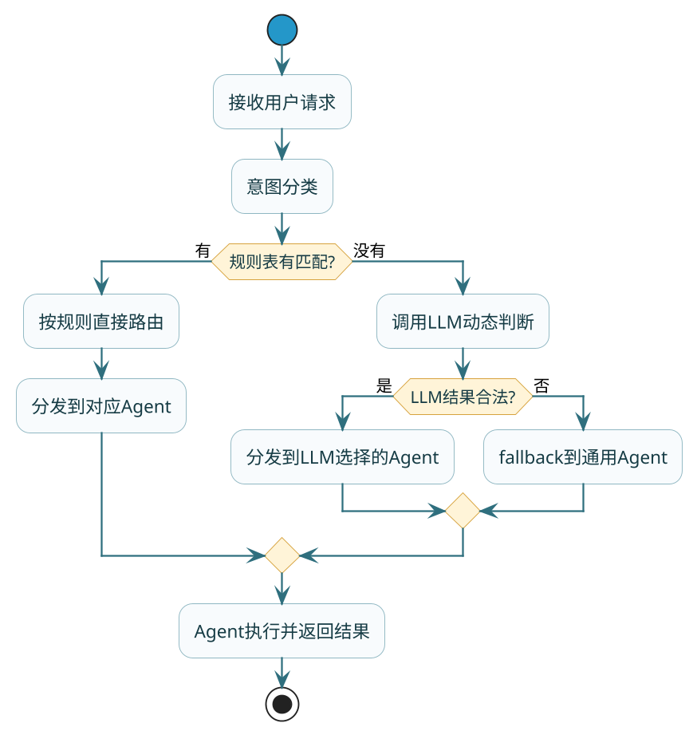

# 多Agent协作与动态路由

## 一个Agent不够用的时候

单Agent系统有个天然的瓶颈：所有能力都得塞进同一个System Prompt里。客服场景下，你让一个Agent同时处理退款、技术故障、物流查询、账户安全——它的Prompt会膨胀到几千字，角色定义模糊，专业度下降，而且一旦要新增业务线就得改整个Prompt，牵一发动全身。

多Agent系统的出发点就是**职责分离**：每个Agent只专注一件事，拥有自己的System Prompt、工具集和领域知识。一个退款Agent只懂退款政策和订单系统API，一个技术Agent只懂故障排查和日志查询——各自做到极致，总体效果远好于一个"什么都会但什么都不精"的全能Agent。

但职责分出去之后，立刻面临两个问题：Agent之间怎么传递信息？用户的请求该交给哪个Agent处理？这就是协作和路由要解决的事。

## 协作通信：Agent之间怎么传递工作成果

多个Agent各自干完活之后，成果怎么流转到下一个需要用它的Agent手里？工程上有两条路。

### 方式一：共享状态——大家都读写同一块"黑板"

想象一个医院的电子病历系统：挂号台录入基本信息，医生补充诊断结论，检验科追加化验结果，药房读取处方开药。每个环节都在同一份记录上读和写，后面的环节天然能看到前面的所有产出。

多Agent里的共享状态就是这个思路：维护一个所有Agent都能读写的状态对象，每个Agent执行完后把结果写入状态，下一个Agent从状态里取需要的信息。

```java
/**
 * 共享状态对象 —— 所有Agent通过它传递信息
 */
@Data
public class WorkflowState {
    private String userId;
    private String originalQuery;
    private String intentCategory;     // 意图分类结果
    private String orderInfo;          // 订单查询结果
    private String resolution;         // 解决方案
    private List<String> actionLog;    // 操作日志
    private String errorMessage;       // 错误信息（如果某步失败）
}

/**
 * 分类Agent：只负责判断用户意图属于哪个类别
 */
@Component
public class ClassifierAgent {

    private final ChatModel chatModel;

    public void execute(WorkflowState state) {
        String prompt = """
            判断以下用户问题属于哪个类别：退款、技术故障、物流查询、账户安全。
            只返回类别名称。
            
            用户问题：%s
            """.formatted(state.getOriginalQuery());

        String category = chatModel.call(new Prompt(prompt))
                .getResult().getOutput().getText().trim();
        state.setIntentCategory(category);
        state.getActionLog().add("意图分类完成: " + category);
    }
}
```

共享状态的好处在于**直接和简单**：不需要任何中间件，前一步写进去的东西后一步直接能读，调试的时候dump出state对象就能看到整个流程的快照。

:::warning 共享状态的坑
多个Agent同时写同一个字段时会互相覆盖。解决办法是约定"只追加不覆盖"的写入规则——每个Agent写自己名下的字段，不碰别人的地盘。如果用在并行场景，还需要加同步机制。
:::

### 方式二：消息传递——发完就不管，谁收谁处理

另一种方式是Agent之间通过消息来通信：完成工作后把结果打包成一条消息发出去，监听这类消息的Agent收到后再开始处理。

这种方式的核心价值是**解耦**——发送方不需要知道消息会被谁消费，接收方也不关心消息是谁发的。新增一个Agent只需要让它订阅相关消息即可，不用改任何现有Agent的代码。

```java
/**
 * 消息传递模式 —— Agent之间通过事件解耦
 */
@Component
public class AgentMessageBus {

    private final Map<String, List<Consumer<AgentMessage>>> subscribers 
            = new ConcurrentHashMap<>();

    public void publish(String topic, AgentMessage message) {
        List<Consumer<AgentMessage>> listeners = subscribers
                .getOrDefault(topic, Collections.emptyList());
        listeners.forEach(listener -> listener.accept(message));
    }

    public void subscribe(String topic, Consumer<AgentMessage> handler) {
        subscribers.computeIfAbsent(topic, k -> new CopyOnWriteArrayList<>())
                .add(handler);
    }
}

// 退款Agent订阅"intent.refund"类型的消息
@PostConstruct
public void init() {
    messageBus.subscribe("intent.refund", msg -> {
        RefundResult result = processRefund(msg.getPayload());
        messageBus.publish("refund.completed", 
                new AgentMessage(result.toJson()));
    });
}
```

### 两种方式怎么选呢

判断标准很简单：

**用共享状态的信号**——Agent之间有明确的前后依赖关系，整个流程像流水线，步骤之间传递的数据结构也比较固定。大多数Agent项目初期都从共享状态开始，因为实现简单、调试容易。

**用消息传递的信号**——Agent数量多、需要独立部署和扩缩容、或者同一个事件需要触发多个Agent并行处理。系统规模大了之后才需要考虑这种方式。

## 状态管理的设计细节

共享状态虽然直接，但如果设计不好，多个Agent读写同一个对象很容易出乱子——一个Agent覆盖了另一个的结果、读到了写了一半的中间数据、出错了没人知道。几个实践要点：

### 分层：全局状态和局部状态分开

把状态拆成两层：

**全局状态**——所有Agent都需要读取的共享信息。用户原始请求、当前流程阶段、最终输出结论，这些放在全局层。

**局部状态**——每个Agent执行过程中的中间数据。比如搜索Agent内部的候选文档列表、评分Agent打分的明细——这些只在Agent内部有意义，不暴露给外界，避免其他Agent被无关信息干扰。

```java
public class LayeredState {
    // 全局层：所有Agent共享
    private GlobalContext global;
    
    // 局部层：每个Agent独立的workspace
    private Map<String, Object> agentWorkspaces = new ConcurrentHashMap<>();
    
    public Object getAgentLocal(String agentId, String key) {
        Map<String, Object> workspace = (Map<String, Object>) 
                agentWorkspaces.getOrDefault(agentId, Map.of());
        return workspace.get(key);
    }
    
    public void setAgentLocal(String agentId, String key, Object value) {
        agentWorkspaces.computeIfAbsent(agentId, k -> new ConcurrentHashMap<>())
                .put(key, value);
    }
}
```

### 写入规则：只追加不覆盖

每个Agent完成后把自己的结果写入一个专属字段，别碰其他Agent的字段。如果需要"修改"之前某步的结论（比如后面发现之前的分类错了），不要去改原字段，而是新增一个"修正"字段。这样任何时候回溯都能看到完整的变更历史。

### 错误也要写入状态

Agent执行失败时，错误信息也必须写进状态对象。不写的话，后续的Orchestrator没法知道前面出了问题，会在错误前提上继续往下跑，产出的结果全是建立在空中楼阁上的。

## 路由策略：用户请求该交给谁

路由要解决的问题是：用户发了一条消息过来，系统怎么决定把它交给哪个Agent处理。

### 策略一：规则路由——条件写死在代码里

最朴素也最稳定的做法：根据意图分类的结果，用if-else（或路由表）把请求分发到对应的Agent。

```java
@Service
public class RuleBasedRouter {
    
    private final Map<String, Agent> agentRegistry;
    
    public Agent route(WorkflowState state) {
        String intent = state.getIntentCategory();
        
        return switch (intent) {
            case "退款" -> agentRegistry.get("refund-agent");
            case "技术故障" -> agentRegistry.get("tech-support-agent");
            case "物流查询" -> agentRegistry.get("logistics-agent");
            case "账户安全" -> agentRegistry.get("security-agent");
            default -> agentRegistry.get("general-agent");
        };
    }
}
```

规则路由的优势一目了然：行为完全可预测、没有额外LLM调用开销、出了问题顺着路由表一查就知道为什么走到这条路径。

劣势也很明显：你必须提前想到所有可能的情况。如果用户的问题不属于任何预定义类别（"我想投诉你们快递员态度不好"——这算物流还是算投诉？），规则路由就只能走到default兜底，处理效果不可控。

### 策略二：LLM路由——让模型判断交给谁

把可用Agent的清单和能力描述告诉LLM，让它根据当前上下文判断最合适的Agent：

```java
@Service
public class LLMRouter {
    
    private final ChatModel routerModel;
    private final Map<String, Agent> agentRegistry;
    
    public Agent route(WorkflowState state) {
        String agentDescriptions = agentRegistry.entrySet().stream()
                .map(e -> "- %s: %s".formatted(e.getKey(), e.getValue().getDescription()))
                .collect(Collectors.joining("\n"));
        
        String prompt = """
            用户问题：%s
            当前进展：%s
            
            可用Agent：
            %s
            
            根据用户问题和当前进展，判断应该交给哪个Agent处理。
            只返回Agent名称，不需要解释。
            """.formatted(state.getOriginalQuery(), 
                         state.getActionLog().toString(),
                         agentDescriptions);
        
        String selected = routerModel.call(new Prompt(prompt))
                .getResult().getOutput().getText().trim();
        
        // 防御：校验返回值是否在可用列表中
        if (!agentRegistry.containsKey(selected)) {
            log.warn("LLM路由返回未知Agent: {}，fallback到general", selected);
            return agentRegistry.get("general-agent");
        }
        return agentRegistry.get(selected);
    }
}
```

LLM路由灵活但有代价：每次路由多一次模型调用（增加延迟和费用），而且LLM偶尔会路由错——它可能把一个明显的退款问题错误地分给了技术Agent。

### 策略三：混合路由——主路用规则，边缘用LLM

实践中效果最好的方式是两层组合：



这样设计的收益是：90%以上的请求走规则路由，稳定且零额外开销；剩下的边缘case由LLM兜底处理，保证系统不会在未知情况面前"卡死"。

```java
@Service
public class HybridRouter {
    
    private final RuleBasedRouter ruleRouter;
    private final LLMRouter llmRouter;
    
    public Agent route(WorkflowState state) {
        // 先尝试规则路由
        Agent matched = ruleRouter.tryRoute(state);
        if (matched != null) {
            log.info("规则路由命中: {}", matched.getName());
            return matched;
        }
        
        // 规则没命中，交给LLM判断
        log.info("规则未命中，触发LLM路由");
        return llmRouter.route(state);
    }
}
```

:::tip 面试中怎么答
直接说"我们用混合路由"容易像在背答案。更好的表达是先说静态路由的局限（覆盖不了边缘case），再说动态路由的代价（延迟+不确定性），最后自然引出"所以我们把两者组合起来用"——这是推导出来的结论，不是记住的答案。
:::

## Handoff模式：让Agent自己决定把活交给谁

前面讲的路由都是由一个中央Orchestrator来做决策。Handoff提供了另一种思路：去掉中央调度，让当前执行的Agent自己判断"我做完了，接下来该找谁"。

类比一下：你去银行办业务，柜台A办完开户手续后跟你说"接下来你去3号窗口办网银激活"——是柜台A直接告诉你下一步去哪，不需要你回大厅取号重新排队等大堂经理安排。

### 实现方式

每个Agent在完成工作后，可以返回一个"handoff指令"，指明下一步应该交给哪个Agent：

```java
public record HandoffResult(
    String output,          // 当前Agent的执行结果
    String nextAgent,       // 下一步交给谁（null表示流程结束）
    String handoffReason    // 为什么要交给它
) {}

@Component
public class TechSupportAgent implements Agent {
    
    public HandoffResult execute(WorkflowState state) {
        // 执行技术排查...
        String diagnosis = diagnose(state);
        
        // 如果发现问题根因是退款类的，主动handoff给退款Agent
        if (diagnosis.contains("需要退款处理")) {
            return new HandoffResult(
                diagnosis,
                "refund-agent",
                "技术排查发现根因是付费功能故障，需要退款"
            );
        }
        
        // 正常完成，流程结束
        return new HandoffResult(diagnosis, null, null);
    }
}
```

### Handoff的风险：循环交接

最大的隐患是A把活交给B、B又交回给A，形成死循环。必须加防护：

```java
public class HandoffExecutor {
    
    private static final int MAX_HANDOFFS = 5;
    
    public String execute(WorkflowState state, Agent startAgent) {
        Agent current = startAgent;
        Set<String> visited = new LinkedHashSet<>();
        
        for (int i = 0; i < MAX_HANDOFFS; i++) {
            if (visited.contains(current.getName())) {
                log.warn("检测到循环handoff: {}，强制终止", visited);
                return "任务处理异常：Agent间出现循环交接";
            }
            visited.add(current.getName());
            
            HandoffResult result = current.execute(state);
            
            if (result.nextAgent() == null) {
                return result.output();  // 流程正常结束
            }
            
            log.info("{} handoff to {} (原因: {})", 
                    current.getName(), result.nextAgent(), result.handoffReason());
            current = agentRegistry.get(result.nextAgent());
        }
        return "达到最大handoff次数限制";
    }
}
```

### 什么时候适合用Handoff

Handoff适合Agent数量少（3-5个）、每个Agent的职责边界非常清晰的场景。它的优势是每个Agent对自己的任务最了解，由它来决定下一步交给谁往往比中央Orchestrator判断得更精准。

但Agent数量多了之后，Handoff就变得难以管理——你很难保证每个Agent对整体流程的认知一致，容易出现"A觉得该给B，但B觉得不是自己的事"这种推诿情况。这时候还是需要一个Orchestrator来统筹全局。

## 选型总结

| 维度 | 共享状态 | 消息传递 |
|------|---------|---------|
| 实现复杂度 | 低（一个对象搞定） | 中（需要消息中间件） |
| Agent间耦合度 | 较高（读写同一个结构） | 低（发布订阅解耦） |
| 调试难度 | 低（dump state即可） | 中（需要追踪消息链路） |
| 并发友好 | 需要同步控制 | 天然支持并行消费 |
| 适用阶段 | 项目早期/中期 | 系统规模大之后 |

| 维度 | 规则路由 | LLM路由 | Handoff |
|------|---------|---------|---------|
| 可预测性 | 高 | 低 | 中 |
| 灵活性 | 低 | 高 | 中 |
| 额外延迟 | 无 | 有（一次LLM调用） | 无 |
| 适用场景 | 业务类型固定 | 边缘case多 | Agent少且职责清晰 |
| 维护成本 | 规则表需要持续更新 | Prompt需要调优 | Agent数量多了难管理 |

## 小结

| 知识点 | 核心结论 |
|--------|---------|
| 为什么多Agent | 职责分离提升专业度，避免单Agent的Prompt膨胀 |
| 通信方式选择 | 强依赖流水线用共享状态，需要解耦用消息传递 |
| 状态管理 | 分层（全局+局部）、只追加不覆盖、错误也写入 |
| 路由策略 | 生产环境用混合路由：规则保底+LLM兜异常 |
| Handoff | Agent自主交接，适合小规模+职责清晰的系统 |
| 防循环 | Handoff必须加visited集合和最大次数限制 |