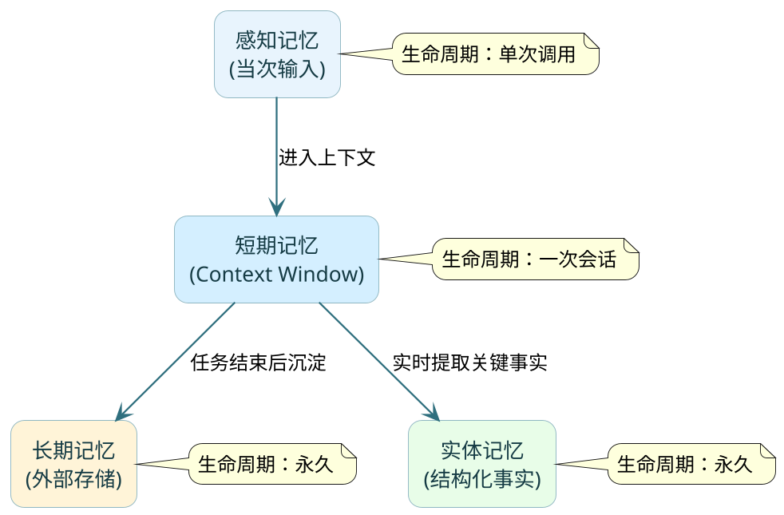

# Agent记忆系统架构设计

:::tip 实战项目推荐
Agent 记忆要同时考虑短期上下文、长期知识和可追溯记录。超级 AI 智能体在会话轮次、增量摘要和知识检索之间做了组合，可以作为记忆架构的实战参考。

项目详细介绍：**[什么是超级 AI 智能体？](/super-agent/overview/project-intro)**
:::

## 没有记忆的Agent是什么体验

你用一个AI助教来辅导学生学Java。上午的课程里，学生明确说了"我有Python基础，没学过Java，希望用Python做类比来讲解"。助教按这个方式教了一上午，效果不错。

下午的课程，你重新发起一轮对话，让助教继续讲Java的面向对象。结果它张嘴就开始从零讲起，完全不记得学生有Python基础、不记得上午已经讲过变量和控制流了、也不记得学生喜欢用类比方式学习。

问题的根源：LLM本身是**无状态**的。每次调用对它来说都是一张白纸，之前所有的交互信息如果不显式传入，它一个字都不知道。所谓"记忆"，全靠外部系统来维护和注入。

这就是为什么记忆系统是Agent从"一次性问答工具"升级为"持续服务助手"的核心基础设施。

## 四层记忆：从瞬间到永久

Agent的记忆可以按生命周期分成四层，每层解决的问题不同。



### 感知记忆：一闪即逝的原始输入

用户当前发过来的这条消息、上传的图片、传入的文件——这就是感知记忆。它的生命周期只有这一次调用，处理完就消失。你可以把它理解为人的"瞬时感知"：有人喊了你一句，你听到了，但如果没有主动去记，三秒后就忘了。

在工程上，感知记忆不需要专门设计，它就是`UserMessage`里的content。

### 短期记忆：任务执行的"工作台"

短期记忆就是context window里的messages列表——用户说了什么、模型回了什么、工具调用返回了什么，全部按时间顺序排列。只要会话还在进行，这些信息就一直在；会话结束或者token超限，就需要做处理。

它像你桌上的草稿纸：正在做的事情摊在面前，随时可以看。但桌面有大小限制，放满了就得清理。

```java
// 短期记忆的本质就是messages列表
List<Message> shortTermMemory = new ArrayList<>();
shortTermMemory.add(new SystemMessage(systemPrompt));
shortTermMemory.add(new UserMessage("学生问：Java的接口和Python的抽象类有什么区别？"));
shortTermMemory.add(new AssistantMessage("好问题，两者确实很像..."));
// 每次调用LLM都带上完整的messages
ChatResponse response = chatModel.call(new Prompt(shortTermMemory));
```

短期记忆最大的特点是**即时可用**——不需要检索，模型直接能看到。代价是容量有限（受token上限约束）。

### 长期记忆：跨会话沉淀的知识库

会话结束了，那些有价值的信息去哪了？如果你什么都不做，答案是"消失了"。长期记忆就是解决这个问题的——把值得保留的信息持久化到外部存储，下次需要时再检索回来。

长期记忆按内容性质，可以细分为三个子类型：

**情节记忆**——具体的历史事件。"上周二学生问了递归的问题，最后用汉诺塔的例子才让他理解了。"这是一段完整的经历记录，下次遇到类似问题可以参考上次的教学策略。

**语义记忆**——从多次经历中抽象出的规律。"这个学生对抽象概念理解慢，用具体的生活类比效果比代码示例好。"这不再是某次具体的记录，而是跨多次交互总结出的结论。

**程序记忆**——可复用的操作流程。"给这个学生讲新概念的标准流程：先用生活类比引入→再给一个最简代码示例→然后让他改写一个变体→最后出一道练习题。"这是一套SOP，可以直接执行。

:::info 三种子类型的价值差异
情节记忆信息量最大但检索噪音也大；语义记忆密度最高最容易命中；程序记忆最适合重复性场景。生产环境中三者混合使用效果最好。
:::

### 实体记忆：结构化的关键事实

实体记忆不存原文，而是把对话中出现的关键事实主动提取出来，存成结构化字段。

```java
/**
 * 实体记忆 —— 从对话中提取的结构化事实
 */
@Data
public class StudentProfile {
    private String studentId;
    private String programmingBackground;   // "有Python基础，无Java经验"
    private String learningStyle;           // "喜欢类比教学，讨厌纯理论"
    private String currentTopic;            // "面向对象-多态"
    private List<String> masteredConcepts;  // ["变量", "控制流", "数组", "类与对象"]
    private List<String> weakPoints;        // ["递归", "泛型"]
    private String pacePreference;          // "中等偏慢，每个概念需要2-3个例子"
}
```

这就像医生的结构化病历，不是把问诊过程逐字记下来，而是提炼成"主诉、诊断、用药"等字段。信息密度极高，查询快，不受原始表述方式影响。

### 四层对比

| 类型 | 载体 | 容量 | 生命周期 | 访问方式 | 典型内容 |
|------|------|------|---------|---------|---------|
| 感知记忆 | 当次输入 | 极小 | 单次调用 | 即时 | 用户的最新消息 |
| 短期记忆 | messages列表 | 受token限制 | 一次会话 | 直接读取 | 完整对话历史 |
| 长期记忆 | 向量库/关系库 | 无限 | 永久 | 语义检索 | 历史交互沉淀 |
| 实体记忆 | 结构化存储 | 无限 | 永久 | 精确查询 | 关键事实字段 |

## 设计记忆系统的三个核心问题

理解了记忆的分类，工程上还要回答三个问题：存什么、用什么介质存、什么时候取出来用。

### 问题一：什么值得存进长期记忆

不是对话里的每句话都值得存。存太多，长期记忆变成垃圾堆，检索时噪音大于信号。判断标准很简单：**"这条信息，下次会话开始时如果Agent知道，会让它做得更好吗？"**

值得存的：
- 用户表达的偏好和约束（"所有代码用TypeScript"）
- 任务执行中产生的关键决策（"选定方案B，因为方案A不支持并发"）
- 外部知识补充（产品文档、FAQ、案例库）
- 从错误中学到的教训（"上次给的递归解法太抽象了，下次换迭代方式"）

不值得存的：
- 中间推理过程的细节
- 工具返回的原始日志数据
- 闲聊和寒暄
- 已被后续决策推翻的旧结论

### 问题二：用什么存

根据信息的查询方式来选存储介质：

**需要语义检索的内容**（文档知识、对话摘要、历史案例）→ 向量数据库。用Embedding编码后，通过余弦相似度检索。优势是"意思相近就能找到"，不需要精确匹配关键词。

**可以精确查询的结构化信息**（用户偏好、配置字段、状态标记）→ 关系数据库或KV存储。查询快，不需要语义理解。

```java
/**
 * 混合存储方案：结构化用MySQL，非结构化用向量库
 */
@Service
public class HybridMemoryStore {

    private final JdbcTemplate jdbc;          // 结构化事实
    private final VectorStore vectorStore;    // 语义记忆

    // 存储结构化的用户画像
    public void saveProfile(StudentProfile profile) {
        jdbc.update("INSERT INTO student_profiles ...", profile.getStudentId(), 
                profile.getLearningStyle(), profile.getPacePreference());
    }

    // 存储非结构化的教学经验
    public void saveEpisode(String sessionSummary, Map<String, Object> metadata) {
        Document doc = new Document(sessionSummary, metadata);
        vectorStore.add(List.of(doc));
    }

    // 语义检索相关记忆
    public List<Document> recallRelevant(String currentQuery, int topK) {
        SearchRequest request = SearchRequest.builder()
                .query(currentQuery)
                .topK(topK)
                .build();
        return vectorStore.similaritySearch(request);
    }
}
```

:::tip 生产环境的选择
多数项目起步时用一种就够——向量库覆盖大部分场景。等业务复杂度上来、对检索精度有更高要求时，再引入结构化存储做互补。别过度设计。
:::

### 问题三：什么时候把记忆取出来用

两种策略，通常结合使用：

**主动加载**——会话开始前，用当前任务描述去检索相关记忆，注入到System Prompt中。Agent一进入对话就带着"历史认知"，不需要用户重复交代背景。

```java
public String buildContextWithMemory(String studentId, String currentTopic) {
    // 1. 加载结构化画像
    StudentProfile profile = profileStore.getById(studentId);
    
    // 2. 检索相关历史经验
    List<Document> relevantMemories = vectorStore.similaritySearch(
            SearchRequest.builder().query(currentTopic).topK(3).build());
    
    // 3. 组装成System Prompt的一部分
    return """
        ## 学生画像
        - 编程背景：%s
        - 学习风格：%s
        - 已掌握：%s
        - 薄弱点：%s
        
        ## 相关历史教学经验
        %s
        """.formatted(
            profile.getProgrammingBackground(),
            profile.getLearningStyle(),
            String.join("、", profile.getMasteredConcepts()),
            String.join("、", profile.getWeakPoints()),
            relevantMemories.stream().map(Document::getText)
                    .collect(Collectors.joining("\n"))
        );
}
```

**按需检索**——任务执行过程中，Agent判断当前步骤需要特定知识时，主动调用"查记忆"工具。把检索封装成Tool，让Agent自己决定什么时候查。

两者配合：会话开始时主动加载用户画像和基础背景（确保Agent从第一句话就"认识"用户），执行过程中遇到需要专业知识或历史案例的环节，再按需检索具体内容。

## 知识图谱：让记忆之间产生关联

向量数据库做语义检索有个限制：每条记忆之间是独立的，没有关联。但很多时候，信息之间的关系和信息本身一样重要。

比如你存了"学生A在B公司实习"和"B公司的技术栈是Spring Boot"。问"学生A工作中用什么框架"时，纯向量检索不一定能找到答案，因为这两条文本的语义相似度并不高。

知识图谱用"实体→关系→实体"的三元组结构来存储信息，支持沿关系链做多跳推理：学生A → 实习于 → B公司 → 技术栈 → Spring Boot。两跳就拿到答案。

工程落地方式：对话过程中用LLM自动提取实体和关系，存入图数据库。检索时先用向量库做初步语义召回，再用知识图谱补充关联信息，两者合并后注入context。

:::info 是否引入知识图谱的判断
如果你的场景里"实体间关系"很重要（比如CRM、项目管理、组织架构），知识图谱价值很大。如果只是记录用户偏好和历史对话，向量库就够了，别过度工程化。
:::

## 记忆的生命周期闭环：读→用→写

一次完整的Agent任务，记忆系统的参与可以用三个阶段来描述：

**开始前：读**
- 从实体记忆加载用户画像（结构化查询）
- 用当前任务描述检索相关长期记忆（语义检索）
- 把两部分信息拼入System Prompt

**执行中：用**
- 短期记忆（messages）全程维护对话状态
- 遇到需要特定知识的步骤，按需检索长期记忆
- 工具返回的结果进入短期记忆，影响后续推理

**结束后：写**
- 判断本次对话中产生了哪些新的有价值信息
- 更新实体记忆中的结构化字段（新偏好、新状态）
- 将值得沉淀的内容写入长期记忆（摘要后存入向量库）
- 短期记忆清空，工作台归零

```java
/**
 * 记忆闭环：一次完整的Agent会话生命周期
 */
@Service
public class MemoryLifecycleManager {

    public void onSessionStart(String userId, String taskDescription) {
        // 读：加载历史记忆
        String memoryContext = buildContextWithMemory(userId, taskDescription);
        sessionContext.setSystemPromptSuffix(memoryContext);
    }

    public void onSessionEnd(String userId, List<Message> conversation) {
        // 写：提取新知识并持久化
        String summary = summarizeConversation(conversation);
        
        // 只有包含新决策/新偏好/新知识的会话才写入长期记忆
        if (hasNewInsights(summary)) {
            memoryStore.saveEpisode(summary, Map.of(
                "userId", userId,
                "timestamp", Instant.now().toString(),
                "topic", extractTopic(conversation)
            ));
        }
        
        // 更新实体记忆中的画像字段
        ProfileUpdate update = extractProfileUpdates(conversation);
        if (update.hasChanges()) {
            profileStore.applyUpdate(userId, update);
        }
    }
}
```

这个闭环跑起来之后，Agent就像一个"越用越了解你"的助手——每次交互都在积累认知，下次服务时会更懂你的需求和习惯。

## 记忆整合：定期从碎片中提炼规律

Agent用久了，长期记忆里会堆积大量碎片化记录。同一个主题可能有十几条不同时间的记忆，有些重复、有些过时、有些互相矛盾。不做整理的话，检索质量会持续恶化。

记忆整合做三件事：

**去重合并**——把语义相近的多条记忆合并成一条更完整的版本。"学生讨厌长理论""学生说纯概念太抽象""学生要求多举例子"三条，合并为"学生偏好实例驱动的教学方式，排斥纯理论堆砌"。

**冲突消解**——两条记忆矛盾时（"学生基础薄弱" vs 后来"学生已经能独立写Spring Boot项目了"），保留时间更新的那条。这就是为什么记忆必须带时间戳。

**抽象提炼**——把多条情节记忆"蒸馏"成语义记忆。经历了多次"用生活类比效果好"的情节后，沉淀出规律"这个学生适合具象化教学"。语义记忆信息密度更高，检索时更容易命中。

整合的节奏：每次会话结束做轻量去重；每天或每周做一次深度整理和提炼。

## 小结

| 知识点 | 核心结论 |
|--------|---------|
| 为什么需要记忆 | LLM无状态，记忆是Agent从"工具"变"助手"的分水岭 |
| 四层分类 | 感知→短期→长期→实体，生命周期递增，访问成本递增 |
| 存什么 | 只存"下次知道了会更好"的信息，过滤噪音 |
| 怎么存 | 语义内容→向量库，结构化事实→关系库，混合是主流 |
| 什么时候取 | 会话开始主动加载画像+相关记忆，执行中按需检索 |
| 知识图谱 | 解决"记忆间关系推理"的问题，和向量库互补 |
| 闭环 | 读→用→写，每次交互都让Agent积累认知 |
| 定期整合 | 去重+消解冲突+抽象提炼，防止记忆退化 |