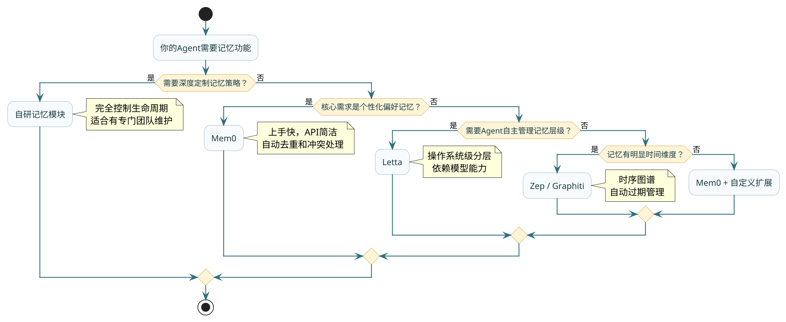

# 记忆存储的工程实践

## 一个看似简单的问题：记忆该切多细

上一篇讲了记忆系统的整体架构，你知道了要把信息存到向量库、关系库，也知道了"读→用→写"的闭环流程。但真到落地的时候，第一个让人卡住的问题往往不是"存到哪"，而是"一条记忆到底该有多长"。

举个场景：你的Agent是一个智能客服，跟客户聊了半小时。这半小时的对话要沉淀成长期记忆，那你是把整段对话当作一条记忆存进去，还是每轮问答切一条，还是把里面的关键信息拆成十几个碎片分别存？

这就是**记忆粒度**问题，它直接决定了后续检索的质量。

### 粒度太粗的代价

假如你把整段30分钟的对话摘要成一大段文字（500~1000 token）当作一条记忆存进向量库。后续用户再来咨询的时候，你用"上次聊的退款政策"去检索，确实能命中这条记忆。但问题是，这条记忆里混着退款政策、物流时效、优惠券使用规则等好几个话题。全部注入context后，Agent需要从一大段里自己去找相关的那几句话，无关内容占了大半的token预算。

更麻烦的是相关性打分。向量相似度是对整条文本算的，如果这条记忆里"退款政策"只占了20%的篇幅，那整体的embedding向量里"退款"这个语义权重就很低，可能还不如另一条只聊了"退换货流程"的短记忆匹配分数高。

### 粒度太细的代价

反过来，如果你把对话拆成极细的碎片——每句话一条记忆，那检索倒是很精准了，"退款政策"能精确命中那句话。可新的问题来了：碎片缺乏上下文。

比如客户说"那就按你说的方案来吧"，这句话单独存没有任何意义，你不知道"方案"指什么。它必须和前面的几轮对话放在一起才有信息量。碎片太细还有另一个问题：同一个话题的信息被打散成了十几条，检索时可能只命中其中两三条，拼起来之后信息不连贯。

### 工程上的平衡点

实践中比较好用的策略是**话题级别的切分**：以一个完整的话题讨论为单位，一条记忆覆盖一个议题的起承转合。

```java
/**
 * 话题级别的记忆切分 —— 智能健身教练场景
 */
public class TopicBasedMemorySplitter {

    /**
     * 把一次完整对话按话题边界切分成多条记忆
     */
    public List<MemoryChunk> splitByTopic(List<Message> conversation) {
        List<MemoryChunk> chunks = new ArrayList<>();
        List<Message> currentTopic = new ArrayList<>();
        String currentTopicLabel = "";

        for (Message msg : conversation) {
            String detectedTopic = detectTopic(msg);
            
            // 话题发生了切换
            if (!detectedTopic.equals(currentTopicLabel) && !currentTopic.isEmpty()) {
                chunks.add(buildChunk(currentTopic, currentTopicLabel));
                currentTopic = new ArrayList<>();
            }
            currentTopicLabel = detectedTopic;
            currentTopic.add(msg);
        }
        // 最后一个话题
        if (!currentTopic.isEmpty()) {
            chunks.add(buildChunk(currentTopic, currentTopicLabel));
        }
        return chunks;
    }

    private MemoryChunk buildChunk(List<Message> messages, String topic) {
        // 每条记忆包含：话题标签、原始内容的摘要、关键结论、时间戳
        return MemoryChunk.builder()
                .topic(topic)
                .summary(summarize(messages))
                .keyDecisions(extractDecisions(messages))
                .timestamp(messages.get(0).getTimestamp())
                .messageCount(messages.size())
                .build();
    }
}
```

这种做法的好处：每条记忆自带完整的上下文（因为是一个话题的完整讨论），embedding能准确反映这段内容的语义主题，检索时不会出现"碎片无意义"的问题。同时粒度又没粗到把多个无关话题混在一起，检索精度有保障。

:::tip 粒度选择的经验法则
一条记忆控制在100~300 token左右效果最好。太短（少于50 token）缺乏上下文，太长（超过500 token）语义混杂。如果是结构化事实（用户偏好、配置参数），可以更短；如果是叙事性内容（讨论过程、决策记录），适当长一些。
:::

## 检索精度：语义搜索为什么比关键词好用

记忆存进去了，下一步就是"找得准"。这个环节直接决定了Agent拿到的背景信息质量。

### 关键词匹配的困境

传统做法是用关键词搜索——用户问到"健身计划"，就在记忆库里搜包含"健身计划"这四个字的记录。看起来简单直接，但在Agent场景下几乎不可用。

为什么？因为自然语言的表达方式太灵活了。用户之前说的可能是"每周的训练安排"、"我的锻炼时间表"、"下一阶段的运动规划"，这些表达跟"健身计划"一个关键词都对不上，但意思完全一样。关键词搜索会全部漏掉。

反过来，用户说"我上周的体检计划出来了"，关键词搜索可能因为"计划"这个词而错误匹配了跟健身计划相关的记忆。

### 向量语义检索的原理

向量检索解决的就是这个问题。它的核心思路是：不比较文字本身，比较含义。

工作流程是这样的：
1. 存记忆的时候，把每条记忆通过Embedding模型转成一个高维向量（比如1536维的浮点数数组）
2. 检索的时候，把查询语句也转成同样维度的向量
3. 计算查询向量和库里所有记忆向量之间的距离（通常用余弦相似度）
4. 返回距离最近的前K条

因为Embedding模型是在海量语料上训练过的，它能理解"训练安排"和"健身计划"在语义空间里是邻居，所以即使文字完全不同，向量之间的距离也很近，就能被检索到。

```java
/**
 * 向量语义检索的完整流程 —— 健身教练Agent检索用户历史偏好
 */
@Service
public class SemanticMemoryRetriever {

    private final EmbeddingModel embeddingModel;
    private final VectorStore vectorStore;

    /**
     * 根据当前对话上下文，检索最相关的历史记忆
     */
    public List<MemoryRecord> retrieveRelevant(String currentQuery, String userId, int topK) {
        // 1. 构建过滤条件：只在这个用户的记忆里搜
        FilterExpression filter = new FilterExpression(
                "userId", FilterExpression.Operator.EQ, userId);

        // 2. 执行语义检索
        SearchRequest request = SearchRequest.builder()
                .query(currentQuery)
                .topK(topK)
                .similarityThreshold(0.72)  // 低于这个相似度的不要
                .filterExpression(filter)
                .build();

        List<Document> results = vectorStore.similaritySearch(request);

        // 3. 转换为业务对象
        return results.stream()
                .map(doc -> MemoryRecord.builder()
                        .content(doc.getText())
                        .topic(doc.getMetadata().get("topic").toString())
                        .timestamp(Instant.parse(doc.getMetadata().get("timestamp").toString()))
                        .relevanceScore(doc.getScore())
                        .build())
                .toList();
    }
}
```

### 混合检索：两种策略互补

纯向量检索也有短板。比如用户说"帮我查一下编号为FIT-2024-0087的训练方案"，这种包含精确ID的查询，向量检索反而容易失准——Embedding模型对随机编号的编码不够精确，可能会返回编号相近但内容无关的记录。

这时候精确匹配（关键词或字段查询）反而更可靠。

生产环境中的最佳实践是**混合检索**：同时用向量检索和关键词检索，然后把两路结果合并排序。

```java
/**
 * 混合检索策略：向量 + 关键词，结果用RRF融合
 */
@Service
public class HybridMemorySearch {

    private final VectorStore vectorStore;
    private final JdbcTemplate jdbc;

    public List<MemoryRecord> hybridSearch(String query, String userId, int topK) {
        // 路径一：向量语义检索
        List<MemoryRecord> semanticResults = semanticSearch(query, userId, topK * 2);

        // 路径二：关键词全文检索（覆盖精确匹配场景）
        List<MemoryRecord> keywordResults = keywordSearch(query, userId, topK * 2);

        // 用RRF（Reciprocal Rank Fusion）做无参数融合
        return rrfMerge(semanticResults, keywordResults, topK);
    }

    /**
     * RRF融合：按排名倒数求和，不依赖分数归一化
     * 公式：score = Σ 1/(k + rank_i)，k通常取60
     */
    private List<MemoryRecord> rrfMerge(
            List<MemoryRecord> listA, List<MemoryRecord> listB, int topK) {
        Map<String, Double> scores = new HashMap<>();
        int k = 60;

        for (int i = 0; i < listA.size(); i++) {
            String id = listA.get(i).getId();
            scores.merge(id, 1.0 / (k + i + 1), Double::sum);
        }
        for (int i = 0; i < listB.size(); i++) {
            String id = listB.get(i).getId();
            scores.merge(id, 1.0 / (k + i + 1), Double::sum);
        }

        // 按融合分数降序取topK
        return scores.entrySet().stream()
                .sorted(Map.Entry.<String, Double>comparingByValue().reversed())
                .limit(topK)
                .map(entry -> findRecordById(entry.getKey()))
                .toList();
    }
}
```

:::info RRF为什么好用
RRF（Reciprocal Rank Fusion）的最大优点是**不需要对两路检索的分数做归一化**。向量检索返回的是余弦相似度（0~1），关键词检索返回的是BM25分数（无上限），两种分数量纲完全不同，直接比较没意义。RRF只看排名不看分数，天然解决了这个问题。它在冷启动阶段（没有标注数据调参）特别实用。
:::

## 记忆框架选型：自己造还是站在巨人肩上

记忆系统从零搭建的工作量不小——Embedding管理、向量存储、去重逻辑、冲突消解、生命周期管理，每一块都有工程细节。如果你的项目不需要深度定制，可以考虑用社区里已经比较成熟的记忆框架。

### Mem0：轻量级个性化记忆

Mem0的定位很明确：**帮你管每个用户的个性化记忆**。你只需要调它的API存和查，底层的embedding、去重、冲突处理它全包了。

核心特点：
- 按user_id做记忆隔离，天然支持多租户
- 存记忆时自动做去重——如果新记忆和已有的语义重复度高，会合并更新
- 同时支持向量存储和图存储（知识图谱），可以按需选择
- 提供cloud版本和自部署版本

适用场景：你的Agent需要"记住每个用户的偏好和习惯"，而你不想自己维护一套记忆管理逻辑。比如个性化推荐助手、私人秘书类Agent。

局限：记忆管理策略比较固定，如果你需要高度定制化的记忆生命周期（比如按业务规则决定记忆过期时间），Mem0的灵活度可能不够。

### Letta：操作系统级的记忆分层

Letta（前身是MemGPT）走了一条更"硬核"的路线，它的设计灵感来自操作系统的内存层级。

它把Agent的记忆分成三层：

| 层级 | 对应OS概念 | 容量 | 访问速度 | 内容 |
|------|-----------|------|---------|------|
| Core Memory | 主存 | 很小（几百token） | 即时 | 始终在context里的关键信息 |
| Recall Memory | 缓存 | 中等 | 快速 | 最近的对话历史 |
| Archival Memory | 磁盘 | 无限 | 需主动检索 | 长期归档知识 |

最有意思的设计：**Agent自己管理这三层之间的数据流动**。它通过Tool调用来决定什么时候把Core Memory里过期的信息"换出"到Archival Memory，什么时候从Archival Memory里"换入"需要的历史知识。

```java
/**
 * 模拟Letta的三层记忆管理思路（简化版）
 * 场景：智能健身教练的记忆管理
 */
public class TieredMemoryManager {

    // Core Memory：始终带在context里的核心信息
    private Map<String, String> coreMemory = new LinkedHashMap<>();
    
    // Recall Memory：最近N轮对话
    private Deque<Message> recallMemory = new ArrayDeque<>();
    
    // Archival Memory：向量库中的长期记忆
    private final VectorStore archivalMemory;

    /**
     * Agent主动决定"换出"操作：把Core里不再紧急的信息归档
     */
    public void evictFromCore(String key, String reason) {
        String value = coreMemory.remove(key);
        if (value != null) {
            // 存到Archival，带上归档原因和时间戳
            Document doc = new Document(value, Map.of(
                    "originalKey", key,
                    "evictReason", reason,
                    "archivedAt", Instant.now().toString()
            ));
            archivalMemory.add(List.of(doc));
        }
    }

    /**
     * Agent主动决定"换入"操作：从Archival里检索需要的知识
     */
    public String loadFromArchival(String query) {
        List<Document> results = archivalMemory.similaritySearch(
                SearchRequest.builder().query(query).topK(3).build());
        return results.stream()
                .map(Document::getText)
                .collect(Collectors.joining("\n"));
    }
}
```

适用场景：需要Agent具备"自主记忆管理"能力的复杂场景，比如长期运行的研究助手、项目管理Agent。

局限：对模型的工具调用能力要求很高。如果模型判断失误（该换出的没换出，不该换入的换入了），记忆管理就会出问题。

### Zep（Graphiti）：时间感知的记忆管理

Zep的独特卖点是**时间维度**。很多记忆框架只关心"内容相关性"——查询和记忆的语义是否接近。但在实际业务中，时间同样关键。

举个例子：用户三个月前说"我的目标体重是70kg"，上周说"最近调整了目标，想先到75kg再慢慢减"。如果你的记忆系统没有时间感知，检索"目标体重"可能会同时返回这两条，Agent就不知道该以哪个为准了。

Zep通过时序知识图谱来解决这个问题：每条记忆都有"生效时间"和"失效标记"，新事实覆盖旧事实时，旧的不是被删除，而是被标记为"已被取代"。这样既保留了历史演变的脉络，又保证检索时优先返回最新有效的信息。

适用场景：用户画像频繁变化的长周期服务（比如个人成长教练、长期客户关系管理）。

### 选型决策树



## 生产环境的记忆运维

把记忆系统搭起来不难，难的是长期跑下来不出问题。线上环境会遇到一些开发阶段不容易暴露的挑战。

### 记忆漂移：越用越偏的隐患

Agent运行几个月后，你可能会发现它的表现开始"漂移"——检索回来的记忆经常不太相关，或者给出的建议开始偏离用户实际需求。

根源在于**记忆污染**。系统运行久了，长期记忆里难免会积累一些质量不高的内容：表述模糊的摘要、基于误解产生的错误结论、已经过时但没被清理的旧信息。这些"坏记忆"一旦被检索到，就会误导Agent的判断，而Agent基于错误判断产生的新记忆又会进一步污染记忆库，形成恶性循环。

应对方案是**定期做记忆健康度审计**：

```java
/**
 * 记忆健康度检查 —— 定期清理低质量记忆
 */
@Scheduled(cron = "0 0 3 * * SUN")  // 每周日凌晨3点执行
public void memoryHealthAudit() {
    List<MemoryRecord> allRecords = memoryStore.findAll();
    
    for (MemoryRecord record : allRecords) {
        double healthScore = calculateHealth(record);
        
        if (healthScore < 0.3) {
            // 低质量记忆：直接归档（不删除，以防误判）
            memoryStore.archive(record.getId());
            log.info("归档低质量记忆: {}, 健康分: {}", record.getId(), healthScore);
        } else if (healthScore < 0.5) {
            // 中等质量：标记为待审核
            memoryStore.markForReview(record.getId());
        }
    }
}

private double calculateHealth(MemoryRecord record) {
    double score = 1.0;
    
    // 因素1：被检索命中但从未被使用的次数（说明检索相关但内容无价值）
    score -= record.getRetrievedButUnusedCount() * 0.1;
    
    // 因素2：最后被有效使用的时间距今
    long daysSinceLastUse = ChronoUnit.DAYS.between(record.getLastUsedAt(), Instant.now());
    if (daysSinceLastUse > 90) score -= 0.3;
    
    // 因素3：是否存在更新版本（被后续记忆取代）
    if (record.isSuperseded()) score -= 0.4;
    
    return Math.max(0, score);
}
```

### 成本控制：向量检索不便宜

如果你的Agent用户量大、调用频繁，向量检索的成本会很可观。每次检索都要做一次Embedding调用（把查询语句转成向量），再做一次向量相似度计算。

几个实用的降本手段：
- **查询缓存**：相同或相似的查询，短时间内直接返回缓存结果
- **记忆预加载**：session开始时批量加载用户画像和高频记忆，后续轮次不重复检索
- **分级存储**：高频访问的记忆用内存向量库（如Redis Vector），冷数据用磁盘向量库（如Milvus）

### 隐私合规：该忘的得忘掉

GDPR、个人信息保护法等法规要求：用户有权要求删除自己的数据。你的记忆系统必须支持"精确遗忘"——能按用户ID把这个人的所有记忆彻底清除，包括向量库里的embedding、关系库里的画像字段、以及可能散落在摘要里的间接引用。

这对系统设计的要求是：所有记忆必须绑定owner标识，且有完整的数据血缘追踪。

## 小结

| 工程问题 | 核心结论 |
|---------|---------|
| 粒度选择 | 话题级切分（100~300 token/条）兼顾语义完整和检索精度 |
| 检索策略 | 混合检索（向量+关键词+RRF融合）是生产标配 |
| 框架选型 | Mem0适合快速落地，Letta适合复杂自主管理，Zep擅长时间维度 |
| 记忆漂移 | 定期健康度审计 + 低质量记忆归档 |
| 成本控制 | 查询缓存 + 预加载 + 分级存储 |
| 隐私合规 | 所有记忆绑定owner，支持精确遗忘 |
