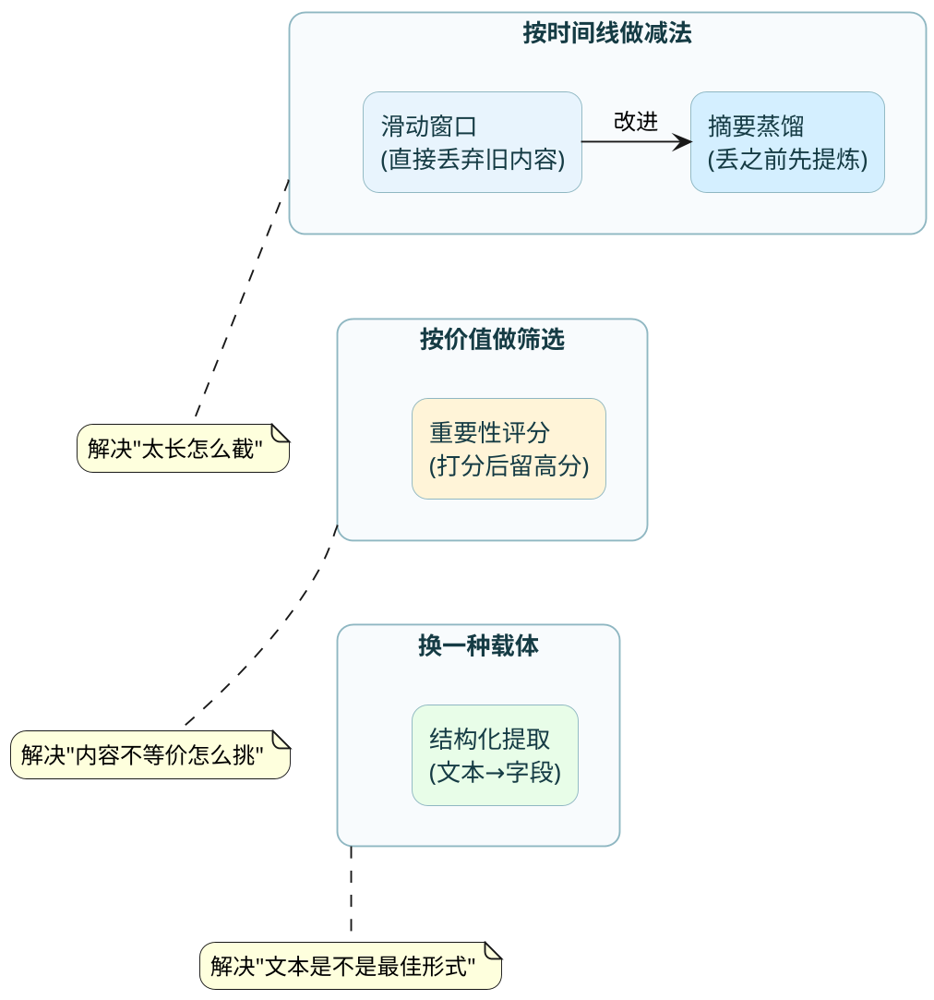
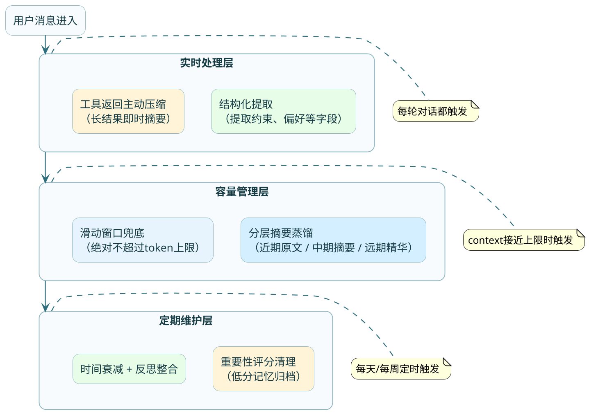

# 记忆压缩与容量治理

## Context快满了，你的Agent会"失忆"

你用Agent帮你做一个需求调研的项目。前面花了一个小时确认需求边界、技术约束、预算范围，聊得很透彻。就在你准备让它输出最终方案的时候，它忽然开始提一些你早就否掉的思路，好像前面的讨论从来没发生过一样。

这种情况不是幻觉的问题，是**context window溢出了**。

LLM每次生成回答依赖的是传入的messages列表。这个列表有硬性上限：GPT-4o是128K token，Claude系列是200K token。对话越长，列表越长，一旦逼近上限，系统会默认从最早的消息开始丢弃。那些你在第5轮就敲定的关键决策，到了第50轮可能已经不在context里了。

就算没超限，token数量也直接关联费用。一轮对话带着10万token的历史进去，比只带1万token贵10倍。对于高频调用的Agent来说，这个成本是很高的。

记忆压缩要解决的就两件事：**在有限空间里保留最大信息量**，以及**控制每次调用的token开销**。

## 四种压缩策略，各解决不同层面的问题

压缩记忆不是只有一种做法。根据你想"保什么、丢什么"的侧重点不同，有四种方向。它们可以组合使用，不是互斥的。



### 策略一：滑动窗口——最快但最粗暴

做法很简单粗暴：设定一个保留窗口（比如最近20轮对话），超出窗口的历史直接移出context。

这就像你的手机只显示最近200条聊天记录——不是说前面的消息被删了，只是不在当前视野里了。

```java
/**
 * 滑动窗口实现 —— 旅行规划Agent场景
 */
public class SlidingWindowManager {

    private static final int MAX_ROUNDS = 20;  // 保留最近20轮

    public List<Message> applyWindow(List<Message> fullHistory) {
        if (fullHistory.size() <= MAX_ROUNDS * 2) {
            return fullHistory;  // 没超限，不处理
        }
        
        // 保留system prompt + 最近N轮的user/assistant对
        List<Message> windowed = new ArrayList<>();
        windowed.add(fullHistory.get(0));  // system prompt永远保留
        
        int startIdx = fullHistory.size() - MAX_ROUNDS * 2;
        windowed.addAll(fullHistory.subList(startIdx, fullHistory.size()));
        
        return windowed;
    }
}
```

**优点**：实现零成本，没有额外的LLM调用开销，延迟为零。

**致命缺陷**：它按时间一刀切，完全不管内容价值。可能第3轮对话里用户说了"预算绝对不能超过50万"这个硬约束，到第30轮这条信息已经被滑出窗口了，Agent就开始推荐80万的方案。

:::warning 滑动窗口适合什么场景
短对话、或者历史信息确实不重要的场景。比如闲聊机器人、每次问答独立的FAQ助手。如果你的Agent需要维护跨轮次的状态和决策连贯性，单独用滑动窗口一定会出问题。
:::

### 策略二：摘要蒸馏——丢之前先浓缩

摘要蒸馏的思路是：在滑动窗口把旧历史丢弃之前，先让LLM把这段历史总结成一小段精华摘要，用摘要替代原文。

打个比方：你的笔记本快写满了，你不是把前面的页撕掉，而是先把前半本的要点誊到一张便利贴上，贴在本子扉页，然后才把前半本归档。这样后面翻笔记的时候，至少知道前面讨论过什么、得出了什么结论。

```java
/**
 * 分层摘要蒸馏 —— 旅行规划Agent场景
 * 策略：最近5轮保持原文，5~20轮压缩为中期摘要，20轮以前压缩为长期摘要
 */
@Service
public class HierarchicalSummarizer {

    private final ChatModel chatModel;

    public ContextPackage buildCompressedContext(List<Message> fullHistory) {
        int totalRounds = fullHistory.size() / 2;

        if (totalRounds <= 5) {
            // 对话还短，不需要压缩
            return new ContextPackage(fullHistory, null, null);
        }

        // 第一层：最近5轮保持原文（和当前任务最相关）
        List<Message> recentRaw = tail(fullHistory, 10);  // 5轮 = 10条消息

        // 第二层：5~20轮的内容压缩为"中期摘要"
        List<Message> midRange = slice(fullHistory, -40, -10);
        String midSummary = summarize(midRange, "中期讨论摘要");

        // 第三层：20轮之前的内容压缩为"长期摘要"（更精炼）
        if (totalRounds > 20) {
            List<Message> earlyRange = slice(fullHistory, 0, -40);
            String longSummary = summarize(earlyRange, "早期背景摘要");
            return new ContextPackage(recentRaw, midSummary, longSummary);
        }

        return new ContextPackage(recentRaw, midSummary, null);
    }

    private String summarize(List<Message> messages, String label) {
        String prompt = """
            请将以下对话历史压缩为一段简洁的摘要。
            要求：
            1. 保留所有明确的决策和结论
            2. 保留用户表达的约束条件和偏好
            3. 省略寒暄、重复确认、中间推理过程
            4. 用陈述句列出要点，不要用对话体
            
            对话内容：
            %s
            """.formatted(formatMessages(messages));

        return chatModel.call(prompt);
    }
}
```

**分层的意义**：不同时间段的信息用不同的精度保留。最近几轮可能随时被引用，需要原文细节；中期历史偶尔需要回顾，摘要级别够用；早期历史通常只需要知道"大方向"，高度精炼即可。

这种分层设计类似于公司的文档管理体系：今天的会议有逐字记录，上个月的会议只有会议纪要，去年的只有年度总结。

**代价**：摘要过程本身需要一次LLM调用（额外的成本和延迟），而且摘要不可避免会丢失细节——LLM自己判断什么"不重要"，这个判断不一定准确。

### 策略三：重要性评分——按价值而非时间筛选

前面两种策略本质上都是沿着时间轴操作的——越早的越容易被丢掉。但时间早不等于不重要。你项目第一天定下的技术路线，可能比昨天的一句闲聊重要一百倍。

重要性评分的做法是：给每条历史消息打一个"价值分"，空间不够的时候按分数从低到高淘汰，和时间无关。

打分方式有两种思路：

**规则打分**（成本低、速度快）：
- 包含"决定"、"确认"、"必须"、"预算"等关键词 → +2分
- 被后续对话引用或提及 → +3分
- 用户主动强调的内容（"这个很重要"） → +5分
- 纯粹的客套、感谢、确认收到 → -2分
- Agent输出的中间推理过程 → -1分

**LLM打分**（精度高、成本大）：
把一批待评估的消息喂给LLM，让它按1~10打分。适合定期批量清理时用，不适合实时处理。

```java
/**
 * 重要性评分 + 淘汰机制
 */
public class ImportanceFilter {

    public List<Message> filterByImportance(List<Message> history, int tokenBudget) {
        // 1. 给每条消息打分
        List<ScoredMessage> scored = history.stream()
                .map(msg -> new ScoredMessage(msg, calculateScore(msg)))
                .toList();

        // 2. 按分数降序排列
        List<ScoredMessage> sorted = scored.stream()
                .sorted(Comparator.comparingDouble(ScoredMessage::score).reversed())
                .toList();

        // 3. 从高分开始往里塞，直到token预算用完
        List<Message> result = new ArrayList<>();
        int usedTokens = 0;
        for (ScoredMessage sm : sorted) {
            int msgTokens = countTokens(sm.message());
            if (usedTokens + msgTokens > tokenBudget) break;
            result.add(sm.message());
            usedTokens += msgTokens;
        }

        // 4. 按原始时间顺序恢复（Agent需要按时间线理解对话）
        result.sort(Comparator.comparing(Message::getTimestamp));
        return result;
    }

    private double calculateScore(Message msg) {
        double score = 5.0;  // 基础分
        String text = msg.getContent();

        // 关键决策信号
        if (text.matches(".*(?:决定|确认|最终|敲定|选定).*")) score += 3;
        // 约束条件信号
        if (text.matches(".*(?:必须|不能|不允许|上限|底线|deadline).*")) score += 4;
        // 闲聊信号
        if (text.matches(".*(?:好的|收到|谢谢|明白了).*") && text.length() < 20) score -= 3;
        // 工具返回的原始数据通常很长但信息密度低
        if (msg.getRole().equals("tool") && text.length() > 2000) score -= 2;

        return score;
    }
}
```

:::info 观察遮蔽：一种更灵活的变体
重要性过滤的一种进阶形态叫"观察遮蔽"（Observation Masking）。它不是真的删除低分内容，而是在构造prompt的时候选择性地跳过某些历史。比如Agent当前在写代码，那需求讨论阶段的对话就暂时"隐藏"，只把和编码相关的上下文传进去。等进入测试阶段，再把测试相关的内容"显示"出来。信息没有丢失，只是按当前任务阶段动态选择"此刻最需要看什么"。
:::

### 策略四：结构化提取——换一种更紧凑的载体

前三种策略都有一个前提：信息以对话文本的形式保留。结构化提取跳出了这个框架，问了一个更本质的问题：对话原文本身真的需要保留吗？

很多时候，Agent真正需要的不是"用户当时说了什么话"，而是"从对话中得出了什么结论"。把结论提取成结构化字段，信息密度能提升一个数量级。

```java
/**
 * 结构化提取 —— 旅行规划Agent从对话中提炼关键约束
 * 300 token的对话 → 50 token的结构化字段
 */
@Data
public class TripConstraints {
    private String destination;          // "日本京都"
    private String dateRange;            // "2026-10-01 到 2026-10-08"
    private int budgetCeiling;           // 35000 (元)
    private String travelStyle;          // "文化深度游，不喜欢购物"
    private List<String> mustVisit;      // ["金阁寺", "岚山竹林"]
    private List<String> dietRestriction;// ["不吃生鱼片"]
    private String pacePreference;       // "每天最多两个景点，中午要休息"
    private boolean needVisa;            // true
}
```

上面这个结构体用了大约50个token，但包含的信息量等价于原始对话中可能三四百token的来回确认。而且查询极快——要知道用户预算多少，直接读字段，不需要去一大段历史里"找"。

**适合结构化提取的内容**：约束条件、配置参数、用户画像、确认的决策。这些信息稳定、明确、可以用字段枚举。

**不适合的**：讨论过程中的推理脉络、还没有结论的开放性讨论、需要保留上下文才能理解的信息。

## 记忆衰减：不是所有记忆都该永远保留

前面讲的是"主动压缩"——因为空间不够了所以做裁剪。还有一种情况是：记忆本身在"贬值"，时间越久价值越低，应该有一套自然的遗忘机制。

### 为什么需要遗忘

人类的遗忘不是缺陷，是进化优势。如果你记住了人生中每一秒的每个细节，大脑根本没法正常运转——你会被海量无关信息淹没，找不到真正重要的东西。

Agent的记忆也一样。一个运行了半年的Agent，长期记忆里可能堆了几万条记录。如果检索时所有记录权重相同，那半年前的一条过时信息和昨天的新决策会被同等对待，检索质量会持续下降。

### 时间衰减函数

最简单的遗忘机制是给记忆的相关性分数加一个时间衰减因子：

```java
/**
 * 带时间衰减的记忆检索
 * 越久远的记忆，即使语义匹配度高，最终得分也会被打折
 */
public double calculateFinalScore(MemoryRecord record, double semanticSimilarity) {
    // 记忆的年龄（天数）
    long ageDays = ChronoUnit.DAYS.between(record.getCreatedAt(), Instant.now());
    
    // 指数衰减：半衰期30天（30天后权重降为50%，60天后降为25%）
    double decayFactor = Math.exp(-0.693 * ageDays / 30.0);
    
    // 但如果这条记忆近期被"使用"过（被检索命中且Agent确实引用了），重置衰减
    if (record.getLastUsedAt() != null) {
        long daysSinceUse = ChronoUnit.DAYS.between(record.getLastUsedAt(), Instant.now());
        decayFactor = Math.max(decayFactor, Math.exp(-0.693 * daysSinceUse / 30.0));
    }
    
    return semanticSimilarity * decayFactor;
}
```

这个设计的精妙之处在于"使用即续命"：如果一条记忆经常被检索并被Agent实际引用，说明它仍然有价值，衰减就被重置。只有那些长期不被使用的记忆才会逐渐淡化——这和人类记忆的"用进废退"机制非常相似。

### 主动反思：让Agent自己整理记忆

比被动衰减更高级的做法是**让Agent定期反思自己的记忆库**。具体来说，每隔一段时间（比如每天或每周），触发一次"记忆整理"任务：

1. 把最近一段时间新增的记忆和已有的旧记忆做对比
2. 发现矛盾的标记冲突（保留新的，给旧的打"已取代"标签）
3. 发现重复的做合并
4. 发现规律的做抽象提炼（多条具体事件 → 一条通用规律）

这个过程可以用一次LLM调用来完成：把待整理的记忆打包喂给模型，让它输出整理后的结果。

## Prompt Caching：计算层面的互补优化

前面讲的所有策略都是在"信息层"工作——决定哪些内容该留、哪些该丢、以什么形式保留。还有一个维度是"计算层"的优化：对于已经决定要带进context的内容，能不能减少重复计算的开销？

答案是Prompt Caching。

### 原理

LLM每次处理请求时，需要对输入的所有token做一次前向计算（prefill）。如果你连续多次请求的prompt前缀部分一模一样（比如system prompt + 注入的长期记忆 + 用户画像），每次都重新算一遍其实很浪费。

Prompt Caching的做法是：把稳定不变的prompt前缀的计算结果缓存起来，后续请求如果前缀匹配就直接复用，省掉重复计算的时间和费用。

以Claude为例，命中缓存的token费用大约是正常输入的1/10。对于Agent场景，system prompt + 长期记忆注入的部分在多轮对话中基本固定，天然适合被缓存。

### 和记忆压缩的关系

这两者是互补的，解决不同层面的问题：

| 维度 | 记忆压缩 | Prompt Caching |
|------|---------|---------------|
| 工作层面 | 信息层——决定"带什么进去" | 计算层——对"已经带进去的"减少重算 |
| 优化目标 | 减少总token数 | 减少重复token的计算成本 |
| 是否丢信息 | 会丢（压缩必然有损） | 不丢（纯计算优化） |
| 使用前提 | 永远需要 | prompt有稳定不变的前缀时才有效 |

在实际系统里，两者配合使用效果最好：先通过压缩把context控制在合理范围内，再对其中稳定的部分启用缓存降低计算开销。

## 实战中的组合方案

讲了四种压缩策略 + 衰减机制 + 计算层优化，真到项目里用的时候该怎么组合？

分享一个经过验证的方案组合（适用于大多数需要多轮对话的Agent）：



各层的分工：
- **实时处理层**：每轮对话结束后立即运行。发现用户新表达的偏好或约束就提取成结构化字段；如果这轮有工具调用返回了很长的原始数据（比如搜索结果、API响应），立刻压缩成摘要，不让原始数据占太多空间。
- **容量管理层**：当context里的token数接近预算的70%时触发。按时间远近分层做摘要蒸馏，最后再加一道滑动窗口作为硬性兜底，确保不管怎样都不超限。
- **定期维护层**：离线批量执行。对长期记忆库做重要性评分清理、时间衰减调整、跨记忆的整合反思。

## 小结

| 策略 | 核心逻辑 | 优势 | 代价 | 适合场景 |
|------|---------|------|------|---------|
| 滑动窗口 | 按时间硬截断 | 零成本、零延迟 | 丢失早期关键信息 | 短对话、历史不重要 |
| 摘要蒸馏 | 截断前先总结 | 保留关键脉络 | 额外LLM调用、细节丢失 | 长对话、需要连贯性 |
| 重要性评分 | 按价值筛选 | 保留高价值信息 | 评分不一定准 | 对话中混杂重要/不重要 |
| 结构化提取 | 文本→字段 | 信息密度最高 | 需要预定义schema | 约束/偏好类信息 |
| 时间衰减 | 自然遗忘 | 防止旧记忆干扰 | 偶尔误衰减有效记忆 | 长期运行的Agent |
| Prompt Caching | 缓存计算结果 | 降费用降延迟 | 仅对稳定前缀有效 | prompt有固定部分时 |
