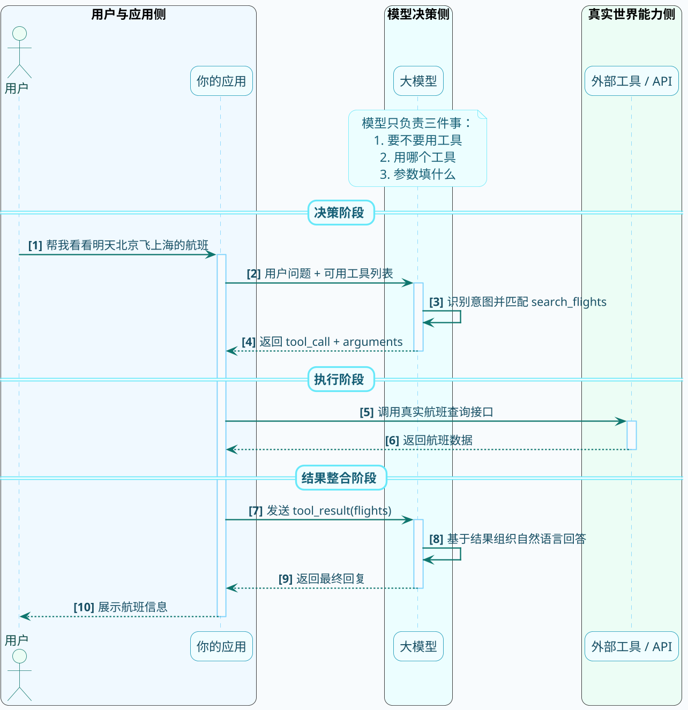
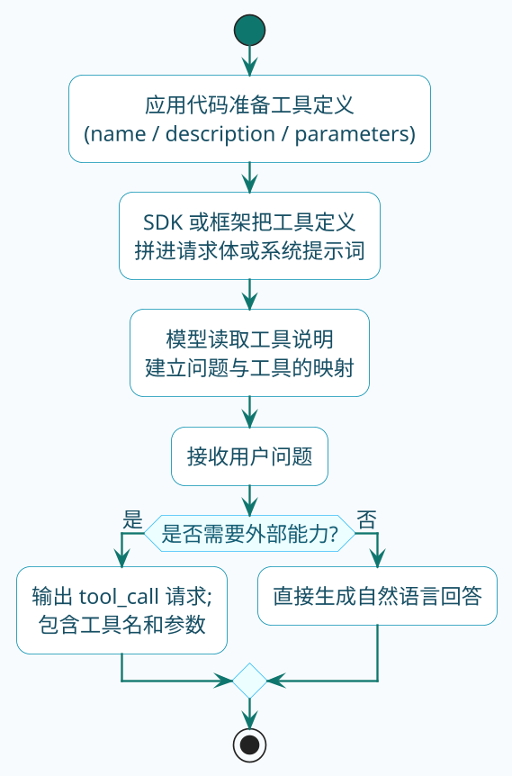

# 认识工具调用机制

你有没有想过这样一个问题：为什么大模型能写诗、能写代码，却没法告诉你今天股票涨了多少？

这不是因为它笨，而是因为它的"记忆"是静态的。大模型的知识来源于训练数据，训练完成后这些知识就被"冻结"了。你问它2023年的事情可能还能答上来，但问它今天发生了什么，它只能瞎编。

拿一个具体场景来说：

**你**："帮我查一下北京今天多少度"

**大模型内心os**："我哪知道今天啥情况，我的数据只到去年...但用户等着呢，要不我编一个？"

**大模型**："北京今天大约15度，天气晴朗"

这个回答可能完全是错的，但模型会很自信地说出来。这就是大模型的"知识边界"问题——它只知道训练时学到的东西，对实时信息完全无能为力。

除了时效性问题，还有另一个限制：私有数据。你公司的业务数据、用户信息这些东西，大模型压根没见过，自然也回答不了。

## 给大模型装上"外挂"

既然模型自己搞不定，那就给它找帮手呗。

工具调用（Tool Calling，也叫Function Calling）就是干这个的——让大模型在需要的时候，能够调用外部的工具或接口来获取信息、执行操作。

打个比方：大模型就像一个学识渊博但没有手机的人。他懂很多道理，但查不了天气、打不了电话、也没法帮你订外卖。工具调用就相当于给他配了一部智能手机，需要什么信息自己查去。

不过这里有个很重要的认知要先纠正一下：

:::warning 常见误区
**大模型自己不会执行任何工具！**

虽然叫"工具调用"，但大模型干的活其实是"工具决策"——它只负责判断：

- 这个问题需不需要用工具？
- 用哪个工具？
- 参数填什么？

真正动手执行工具的，是你的应用程序。模型输出一个调用指令，你的代码收到后去执行，拿到结果再告诉模型，模型才能组织出最终答案。
:::

## 工具调用的完整流程

搞明白了分工，咱们来看看整个调用链条是怎么串起来的。

以一个"查航班"的场景为例：

**第一步：用户提问**

用户说："帮我看看明天从北京飞上海的航班"

**第二步：模型分析判断**

模型收到问题后，发现自己不知道航班信息。但如果你事先告诉它"你有一个查航班的工具"，它就会决定使用这个工具。

模型的输出大概长这样：

```json
{
  "tool_call": {
    "name": "search_flights",
    "arguments": {
      "departure": "北京",
      "arrival": "上海", 
      "date": "2025-03-14"
    }
  }
}
```

注意，这只是一个"调用请求"，模型没有真的去查航班。

**第三步：应用执行工具**

你的代码收到这个请求后，调用真正的航班查询接口：

```java
// 伪代码示意
FlightService flightService = new FlightService();
List<Flight> flights = flightService.search("北京", "上海", "2025-03-14");
```

拿到结果后，把它整理成模型能理解的格式。

**第四步：结果返回模型**

把航班数据发回给模型：

```json
{
  "tool_result": {
    "flights": [
      {"flight_no": "CA1234", "time": "08:00", "price": 850},
      {"flight_no": "MU5678", "time": "14:30", "price": 720}
    ]
  }
}
```

**第五步：模型生成最终回答**

模型拿到数据后，用自然语言组织答案：

"查到明天北京飞上海有以下航班：CA1234次航班早上8点起飞，票价850元；MU5678次航班下午2点半起飞，票价720元。您需要我帮您预订哪一班？"

用一张图来表示整个流程：



## 怎么告诉模型有哪些工具可用

模型不是神仙，你不告诉它有什么工具，它怎么知道能用什么？

所以在发请求的时候，你得把工具的"说明书"一起发过去。这个说明书在技术上叫做"函数定义"（Function Definition）或"工具定义"（Tool Definition）。

一个标准的工具定义包含这些信息：

| 字段 | 作用 | 举例 |
|------|------|------|
| name | 工具的唯一标识 | search_flights |
| description | 告诉模型这个工具是干嘛的 | 根据出发地、目的地和日期查询航班信息 |
| parameters | 定义需要哪些参数，每个参数什么类型 | departure(string), arrival(string), date(string) |

来看一个完整的例子：

```json
{
  "type": "function",
  "name": "search_flights",
  "description": "查询指定日期从出发城市到目的城市的所有航班信息",
  "parameters": {
    "type": "object",
    "properties": {
      "departure": {
        "type": "string",
        "description": "出发城市，如：北京、上海、广州"
      },
      "arrival": {
        "type": "string",
        "description": "到达城市，如：北京、上海、广州"
      },
      "date": {
        "type": "string",
        "description": "出发日期，格式为YYYY-MM-DD"
      }
    },
    "required": ["departure", "arrival", "date"]
  }
}
```

模型看到这个定义后，就知道了：

1. 有一个叫`search_flights`的工具可以用
2. 它是用来查航班的
3. 需要提供出发地、目的地和日期三个参数

当用户问航班相关的问题时，模型就会把用户的意图映射到这个工具上。

:::info 工具定义的三要素
一个标准的工具定义必须包含：`name`（唯一标识）、`description`（功能说明，模型靠这段文字理解工具用途）、`parameters`（参数规范）。其中 `description` 是最重要的，写得越清晰，模型调用越准确。
:::

## 模型是怎么处理工具信息的

你可能好奇，把工具定义发给模型后，模型内部是怎么处理的？

其实很简单：工具定义会被转换成提示词的一部分。

以开源的Qwen模型为例，它有一套内置的模板来处理工具。当你传入工具定义时，最终发给模型的提示词大概长这样：

```
<|im_start|>system
你是一个智能助手。

# Tools
你可以使用以下工具来辅助回答用户问题。

<tools>
{"type": "function", "name": "search_flights", "description": "查询航班信息", ...}
</tools>

如果需要调用工具，请按以下格式返回：
<tool_call>
{"name": "工具名称", "arguments": {"参数": "值"}}
</tool_call>
<|im_end|>

<|im_start|>user
帮我看看明天从北京飞上海的航班
<|im_end|>

<|im_start|>assistant
```

看到没？工具定义其实就是被塞进了系统提示词里。模型通过阅读这段提示，"学会"了有哪些工具可以用，以及应该按什么格式输出调用请求。

:::tip 最佳实践
这也解释了为什么工具的 description 那么重要——模型就是靠这段文字来理解工具的用途的。description 写得不清不楚，模型自然也搞不明白该什么时候用。
:::

如果把这个过程再压缩成一条"进入模型上下文"的路径，大概就是下面这样：



## 工具调用能做什么

理解了原理，再来看看实际能用工具调用实现哪些功能。

**实时数据查询**

天气、股票、新闻、汇率...这些实时变化的信息，模型自己答不了，但可以通过调用对应的API来获取。

**业务系统操作**

订单查询、库存管理、用户信息修改...只要你把业务系统的接口包装成工具，模型就能操作。

**外部服务集成**

发邮件、发短信、调用地图服务、执行数据库查询...各种外部服务都可以通过工具调用来对接。

**计算类任务**

虽然大模型算数有时候会出错，但你可以定义一个计算器工具，让复杂计算交给代码来处理。

## 小结

这一节咱们搞明白了几件事：

1. 大模型有知识边界，不能处理实时信息和私有数据
2. 工具调用是大模型与外部世界交互的桥梁
3. 模型只负责决策调用哪个工具、传什么参数，真正执行的是你的应用代码
4. 工具定义需要包含名称、描述和参数规范，让模型能理解如何使用

下一节我们来看看在Spring AI中如何实际动手实现工具调用。
