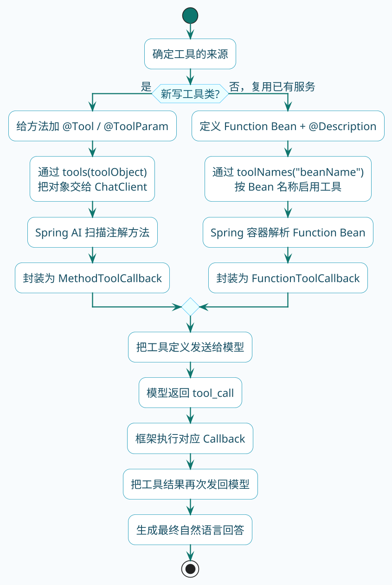
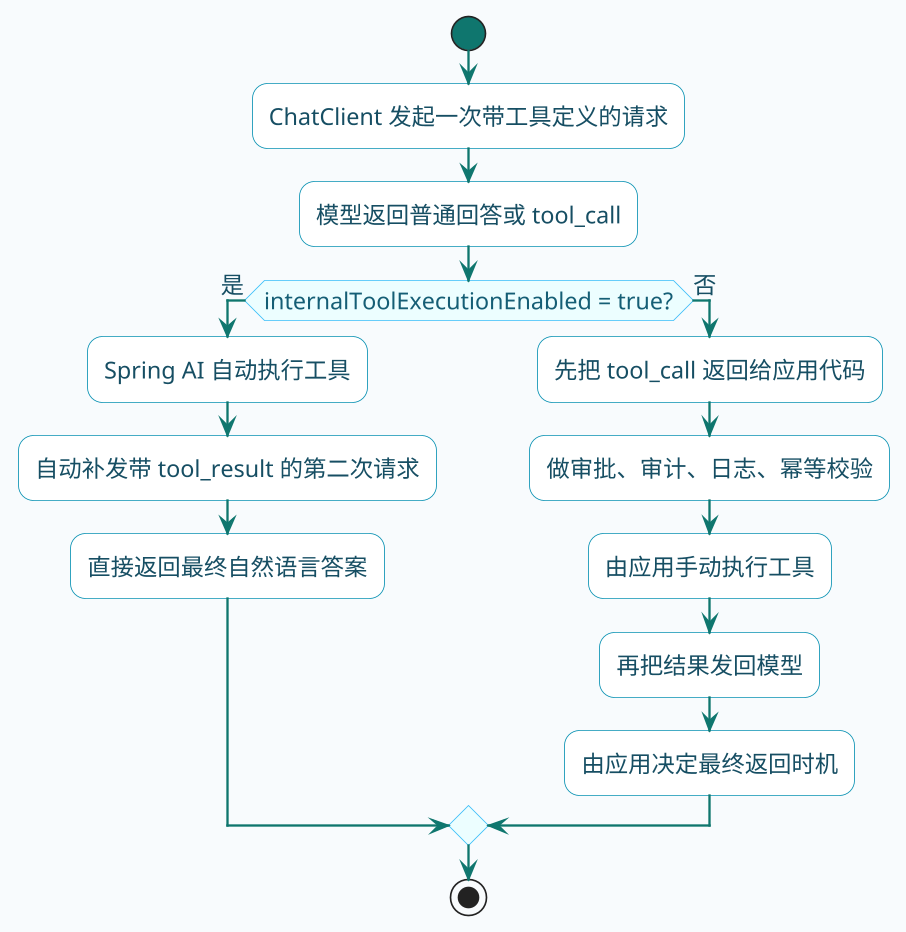

# Spring AI工具调用实战

上一节我们搞明白了工具调用是怎么回事。现在的问题是：在Spring AI里，具体怎么把自己的方法变成大模型能调用的工具？

Spring AI给我们提供了两种路子：

1. **注解方式**：用`@Tool`把普通方法变成工具
2. **函数式方式**：定义一个`Function`类型的Bean

两种方式本质上做的是同一件事——告诉Spring AI"这个方法可以被模型调用"，只是写法不同。选哪个主要看你的代码组织偏好。

:::tip 如何选择接入方式
- 新写的工具类 → 用 `@Tool` 注解，更直观
- 复用已有的 Service，不想改动原有代码 → 用 `Function` Bean
:::

如果先从整体上看，Spring AI会把这两条接入路径最终收敛到同一条工具调用闭环里：



## 方式一：用@Tool注解定义工具

先来看最直观的方式。假设我们要实现一个"查询城市当前时间"的功能：

```java
@Component
public class CityTimeTools {

    @Tool(description = "查询指定城市的当前本地时间")
    public String queryCityTime(
            @ToolParam(description = "城市名称，如北京、东京、纽约") String cityName) {
        
        // 模拟根据城市获取时区
        Map<String, String> cityTimezones = Map.of(
            "北京", "Asia/Shanghai",
            "东京", "Asia/Tokyo",
            "纽约", "America/New_York",
            "伦敦", "Europe/London"
        );
        
        String timezone = cityTimezones.getOrDefault(cityName, "Asia/Shanghai");
        ZoneId zoneId = ZoneId.of(timezone);
        ZonedDateTime now = ZonedDateTime.now(zoneId);
        
        DateTimeFormatter formatter = DateTimeFormatter.ofPattern("yyyy-MM-dd HH:mm:ss");
        return cityName + "当前时间：" + now.format(formatter);
    }
}
```

这段代码有几个关键点：

- `@Tool`注解标记这是一个可被调用的工具，`description`告诉模型这个工具是干嘛的
- `@ToolParam`描述参数的用途，帮助模型理解应该传什么值
- 方法本身就是普通的Java代码，返回值会被发送回模型

有了工具类，使用的时候这样写：

```java
@RestController
@RequestMapping("/time")
public class TimeQueryController {

    private final ChatClient chatClient;
    private final CityTimeTools cityTimeTools;

    public TimeQueryController(ChatClient chatClient, CityTimeTools cityTimeTools) {
        this.chatClient = chatClient;
        this.cityTimeTools = cityTimeTools;
    }

    @GetMapping("/ask")
    public Flux<String> askTime(@RequestParam String question) {
        return chatClient.prompt()
                .user(question)
                .tools(cityTimeTools)  // 把工具实例传进去
                .stream()
                .content();
    }
}
```

调用`tools(cityTimeTools)`之后，Spring AI会自动扫描这个对象上所有带`@Tool`注解的方法，生成工具定义发给模型。

:::info @Tool 注解关键点
- `@Tool`：标记可调用工具，`description` 告诉模型工具用途
- `@ToolParam`：描述参数含义，帮助模型理解应该传什么值
- 方法返回值会被直接发送回模型作为工具执行结果
:::

现在你访问`/time/ask?question=东京现在几点了`，模型就会识别出需要调用`queryCityTime`方法，参数是"东京"。

## 方式二：用Function Bean定义工具

如果你的项目里已经有现成的服务类，不想往里面加一堆注解，可以用函数式的方式。

假设已经有一个库存查询服务：

```java
@Service
public class InventoryService {
    
    public StockInfo getStock(String productCode) {
        // 模拟查询库存
        return new StockInfo(productCode, 150, "北京仓库");
    }
    
    public record StockInfo(String productCode, int quantity, String warehouse) {}
}
```

现在想把这个服务暴露给模型用，但又不想改动原有代码。可以这样做：

```java
@Configuration
public class ToolConfiguration {
    
    @Bean
    @Description("根据商品编码查询实时库存信息，返回库存数量和所在仓库")
    public Function<StockQueryRequest, InventoryService.StockInfo> queryStockTool(
            InventoryService inventoryService) {
        return request -> inventoryService.getStock(request.productCode());
    }
    
    public record StockQueryRequest(
            @JsonProperty(required = true, value = "productCode") 
            @JsonPropertyDescription("商品编码，如SKU001、SKU002") 
            String productCode) {}
}
```

这种写法的几个要点：

- 用`@Bean`注册一个`Function`类型的Bean
- `@Description`在Bean上说明工具用途
- 泛型参数`<Request, Response>`定义了输入输出类型
- 入参类型里用Jackson注解描述每个字段

使用这种方式定义的工具时，不是通过`tools()`传入实例，而是通过`toolNames()`指定Bean名称：

```java
@GetMapping("/stock")
public String queryStock(@RequestParam String question) {
    return chatClient.prompt()
            .user(question)
            .toolNames("queryStockTool")  // 传Bean名称
            .call()
            .content();
}
```

## 两种方式对比

| 对比点 | @Tool注解方式 | Function Bean方式 |
|--------|---------------|-------------------|
| 代码侵入性 | 需要修改原有类，加注解 | 完全不动原有代码 |
| 适用场景 | 新写的工具类 | 包装已有的Service |
| 参数描述 | 用@ToolParam | 用Jackson注解 |
| 使用方式 | tools(对象实例) | toolNames(Bean名称) |
| 底层实现 | MethodToolCallback | FunctionToolCallback |

如果是新项目、新写的工具类，`@Tool`注解更直观。

如果要复用已有的服务而不想改代码，`Function` Bean更合适。

## 关掉自动执行

默认情况下，Spring AI会自动帮你执行工具调用。模型说要调某个工具，Spring AI就直接调了，把结果发回去。

但有些场景下你可能想自己控制这个过程，比如：

- 工具调用前想做一些校验或审批
- 需要记录每次工具调用的详细日志
- 在Agent场景下需要实现复杂的调用控制逻辑

:::caution 关闭自动执行的适用场景
关闭自动执行会让工具调用流程更可控，但需要你自己管理调用状态和再次请求模型，代码复杂度会上升。非必要场景下建议保持默认的自动执行。
:::

这时候可以关掉自动执行：



```java
@GetMapping("/manual")
public String manualControl(@RequestParam String question) {
    // 构建ChatOptions，关闭自动执行
    var options = DashScopeChatOptions.builder()
            .withInternalToolExecutionEnabled(false)  // 关键设置
            .build();
    
    ChatResponse response = chatClient.prompt()
            .user(question)
            .tools(cityTimeTools)
            .options(options)
            .call()
            .chatResponse();
    
    // 现在需要自己判断是否有工具调用请求
    if (response.hasToolCalls()) {
        // 拿到工具调用信息
        ToolCall toolCall = response.getToolCalls().get(0);
        System.out.println("模型请求调用工具：" + toolCall.name());
        System.out.println("参数：" + toolCall.arguments());
        
        // 自己执行工具，然后把结果发回模型
        // ... 具体实现省略
    }
    
    return response.getResult().getOutput().getText();
}
```

设置`internalToolExecutionEnabled`为`false`后，Spring AI只会返回工具调用请求，不会真的去执行。你需要自己处理调用逻辑。

这个功能在后面讲ReAct Agent的时候会用到，先知道有这么回事就行。

## 使用第三方工具

除了自己定义工具，Spring AI Alibaba还整合了一批现成的第三方工具，比如：

- 高德地图相关（天气查询、路线规划、POI搜索）
- 百度翻译
- 钉钉消息推送
- 等等...

这些工具已经封装好了，直接引入依赖就能用，不用自己对接API。

:::tip 使用第三方工具
具体有哪些可用工具、怎么配置，可以看Spring AI Alibaba的官方文档：

https://java2ai.com/docs/1.0.0.2/practices/integrations/tool-calling/
:::

## 实践：做一个简单的任务助手

来把学到的东西串起来，做一个能处理多种任务的助手。

先定义几个工具：

```java
@Component
public class AssistantTools {

    @Tool(description = "发送消息提醒，用于通知用户重要事项")
    public String sendReminder(
            @ToolParam(description = "提醒内容") String content,
            @ToolParam(description = "提醒类型：urgent紧急、normal普通") String type) {
        // 实际项目中这里会调用消息服务
        System.out.println("[" + type + "] 已发送提醒：" + content);
        return "提醒已成功发送";
    }

    @Tool(description = "创建待办事项")
    public String createTodo(
            @ToolParam(description = "待办事项标题") String title,
            @ToolParam(description = "截止日期，格式YYYY-MM-DD") String deadline) {
        String todoId = UUID.randomUUID().toString().substring(0, 8);
        System.out.println("创建待办：" + title + "，截止日期：" + deadline);
        return "待办创建成功，编号：" + todoId;
    }

    @Tool(description = "查询今日待办事项列表")
    public String getTodayTodos() {
        // 模拟返回
        return """
            今日待办事项：
            1. [进行中] 完成月度报告 - 截止今天18:00
            2. [待处理] 回复客户邮件 - 截止今天15:00
            3. [已完成] 团队周会 - 上午10:00
            """;
    }
}
```

然后写一个对话接口：

```java
@RestController
@RequestMapping("/assistant")
public class AssistantController {

    private final ChatClient chatClient;
    private final AssistantTools tools;

    public AssistantController(ChatClient chatClient, AssistantTools tools) {
        this.chatClient = chatClient;
        this.tools = tools;
    }

    @GetMapping("/chat")
    public Flux<String> chat(@RequestParam String input) {
        return chatClient.prompt()
                .system("你是一个任务管理助手，帮助用户管理日常工作。")
                .user(input)
                .tools(tools)
                .stream()
                .content();
    }
}
```

现在可以这样用：

- "帮我看看今天有什么待办" → 调用`getTodayTodos`
- "创建一个待办，下周三之前完成项目方案" → 调用`createTodo`
- "紧急提醒我明天9点开会" → 调用`sendReminder`

模型会根据用户的自然语言表达，自动判断该调用哪个工具、传什么参数。

## 小结

这一节我们学会了：

1. 用`@Tool`注解把普通方法变成工具
2. 用`Function` Bean包装已有服务
3. 两种方式各自的适用场景
4. 如何关闭自动执行来手动控制工具调用
5. Spring AI Alibaba提供的现成工具
