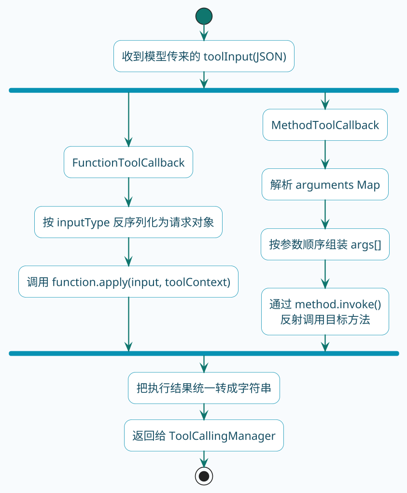
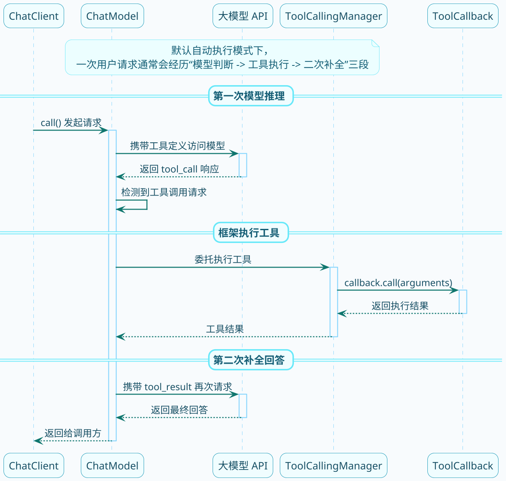

# ToolCallback源码解析

:::tip 实战项目推荐
ToolCallback 是工具能力进入 Spring AI 的统一抽象。超级 AI 智能体在业务链路里使用工具调用思想，把模型决策、工具执行和结果追踪连接起来，适合从源码继续看到业务落点。

项目详细介绍：**[什么是超级 AI 智能体？](/super-agent/overview/project-intro)**
:::

上一节我们知道了Spring AI提供两种定义工具的方式：`@Tool`注解和`Function` Bean。那你有没有好奇过：这两种方式在底层有什么区别？Spring AI拿到你的工具定义后，内部是怎么调用的？

这一节我们就来扒一扒源码，搞清楚这些问题。

## ToolCallback：工具的统一抽象

不管你用哪种方式定义工具，Spring AI最终都会把它转换成一个叫`ToolCallback`的东西。这是Spring AI对"可调用工具"的统一抽象。

:::info ToolCallback 核心接口
`ToolCallback` 接口的两个核心方法：
- `getToolDefinition()`：提供工具的"说明书"，让模型知道有这个工具可用
- `call()`：真正干活的方法，接收 JSON 格式的参数，返回执行结果

不管工具是怎么定义的，只要实现了这个接口，Spring AI 就能调用它。
:::

先来看看这个接口长什么样：

```java
public interface ToolCallback {
    
    /**
     * 获取工具定义，包含名称、描述、参数规范等信息
     * 模型会根据这些信息来决定什么时候调用这个工具
     */
    ToolDefinition getToolDefinition();
    
    /**
     * 获取工具的元数据，比如是否需要用户确认、返回值是否直接给用户等
     */
    default ToolMetadata getToolMetadata() {
        return ToolMetadata.builder().build();
    }
    
    /**
     * 执行工具调用
     * @param toolInput 模型传过来的参数，JSON格式
     * @return 执行结果，会被发回给模型
     */
    String call(String toolInput);
    
    /**
     * 带上下文的执行方法，可以传递额外信息
     */
    default String call(String toolInput, @Nullable ToolContext toolContext) {
        if (toolContext != null && !toolContext.getContext().isEmpty()) {
            throw new UnsupportedOperationException("不支持工具上下文");
        }
        return call(toolInput);
    }
}
```

看完接口定义，几个关键点就清楚了：

1. `getToolDefinition()` — 提供工具的"说明书"，让模型知道有这个工具可用
2. `call()` — 真正干活的方法，接收JSON格式的参数，返回执行结果

不管工具是怎么定义的，只要实现了这个接口，Spring AI就能调用它。

## 两个实现类的分工

`ToolCallback`有两个主要实现：

| 实现类 | 对应的工具定义方式 | 内部调用机制 |
|--------|-------------------|--------------|
| FunctionToolCallback | Function Bean方式 | 函数式接口回调 |
| MethodToolCallback | @Tool注解方式 | Java反射调用 |

为什么要搞两个实现？因为这两种工具定义方式，在"怎么触发执行"这件事上完全不同。

如果把它们真正执行时的分工摊开看，差异主要集中在"参数如何还原"和"业务代码如何触发"这两步：



## FunctionToolCallback：函数式回调

先来看`Function` Bean方式是怎么工作的。

当你这样定义一个工具：

```java
@Bean
@Description("查询商品库存")
public Function<StockRequest, StockResponse> queryStock(StockService service) {
    return request -> service.getStock(request.productCode());
}
```

Spring AI会创建一个`FunctionToolCallback`来包装它。看看它的核心代码（简化版）：

```java
public class FunctionToolCallback<I, O> implements ToolCallback {
    
    // 真正干活的函数式接口
    private final BiFunction<I, ToolContext, O> function;
    
    // 入参类型，用于JSON反序列化
    private final Class<I> inputType;
    
    @Override
    public String call(String toolInput, ToolContext toolContext) {
        // 1. 把JSON字符串转成入参对象
        I input = parseInput(toolInput, inputType);
        
        // 2. 调用函数式接口
        O output = function.apply(input, toolContext);
        
        // 3. 把返回值转成字符串
        return convertOutput(output);
    }
    
    private I parseInput(String json, Class<I> type) {
        return objectMapper.readValue(json, type);
    }
}
```

调用链路很清晰：

```
模型返回工具调用请求 
    → Spring AI调用FunctionToolCallback.call() 
    → JSON反序列化成Request对象 
    → 调用你定义的Function.apply() 
    → 返回结果
```

核心就是那个`function.apply()`——直接调用你定义的函数式接口。因为`Function`、`BiFunction`这些都是Java标准接口，调用起来很自然，不需要什么黑魔法。

## MethodToolCallback：反射调用

`@Tool`注解方式就不一样了。你标注的是一个普通方法，Spring AI得想办法把它"调"起来。怎么调？反射。

假设你定义了这样一个工具：

```java
@Component
public class WeatherTools {
    @Tool(description = "查询天气")
    public String getWeather(
            @ToolParam(description = "城市名") String city) {
        return city + "：晴，25度";
    }
}
```

Spring AI会创建一个`MethodToolCallback`来包装这个方法。来看核心代码（简化版）：

```java
public class MethodToolCallback implements ToolCallback {
    
    // 目标对象，也就是你的工具类实例
    private final Object toolObject;
    
    // 要调用的方法
    private final Method method;
    
    // 方法的参数信息
    private final List<ToolMethodParameter> parameters;
    
    @Override
    public String call(String toolInput, ToolContext toolContext) {
        // 1. 解析JSON，提取参数值
        Map<String, Object> arguments = parseArguments(toolInput);
        
        // 2. 按照方法参数顺序组装参数数组
        Object[] args = buildMethodArguments(arguments);
        
        // 3. 反射调用方法
        Object result = method.invoke(toolObject, args);
        
        // 4. 返回结果
        return convertToString(result);
    }
    
    private Object[] buildMethodArguments(Map<String, Object> arguments) {
        Object[] args = new Object[parameters.size()];
        for (int i = 0; i < parameters.size(); i++) {
            String paramName = parameters.get(i).getName();
            args[i] = convertValue(arguments.get(paramName), parameters.get(i).getType());
        }
        return args;
    }
}
```

调用链路：

```
模型返回工具调用请求 
    → Spring AI调用MethodToolCallback.call() 
    → 解析JSON获取参数 
    → 组装方法参数数组 
    → method.invoke()反射调用 
    → 返回结果
```

关键在`method.invoke(toolObject, args)`这一行——通过反射调用你的方法。

:::note 反射调用的开销
`MethodToolCallback` 使用反射机制调用目标方法，有轻微的性能开销，但在工具调用场景下可以忽略不计——工具执行本身（如网络请求、数据库查询）的耗时远大于反射开销。
:::

## 工具是怎么被注册进去的

知道了两种Callback的区别，再来看看Spring AI是怎么识别和注册这些工具的。

当你调用`chatClient.prompt().tools(someToolObject)`时，Spring AI会这样处理：

```java
// 简化的处理逻辑
public ChatClientRequestSpec tools(Object... toolObjects) {
    for (Object toolObject : toolObjects) {
        // 把对象转成ToolCallback数组
        ToolCallback[] callbacks = ToolCallbacks.from(toolObject);
        this.toolCallbacks.addAll(Arrays.asList(callbacks));
    }
    return this;
}
```

`ToolCallbacks.from()`会扫描传入对象的所有方法，找出带`@Tool`注解的，每个方法创建一个`MethodToolCallback`。

而当你用`toolNames("beanName")`时，Spring AI会去Spring容器里找对应的`Function` Bean，然后包装成`FunctionToolCallback`。

## Debug看执行过程

光看代码可能还不够直观，咱们来实际Debug一下。

在`org.springframework.ai.model.tool.DefaultToolCallingManager`类的`executeToolCall`方法打个断点：

:::tip Debug 调试技巧
在 `DefaultToolCallingManager.executeToolCall()` 方法打断点，可以实时观察工具调用的执行情况，包括工具名、传入参数以及实际使用的 Callback 类型。这是排查工具调用问题最直接的方式。
:::

```java
// DefaultToolCallingManager.java
public ToolCallResult executeToolCall(ChatOptions options, ToolCall toolCall) {
    // 根据工具名找到对应的Callback
    ToolCallback callback = findToolCallback(toolCall.name());
    
    // 执行调用 — 在这里打断点
    String result = callback.call(toolCall.arguments(), toolContext);
    
    return new ToolCallResult(toolCall, result);
}
```

**场景一**：用`tools(new TimeTools())`传入对象

断点命中时，你会看到`callback`的实际类型是`MethodToolCallback`：

```
callback = MethodToolCallback {
    toolObject = TimeTools实例
    method = getTimeByZoneId(String)
    ...
}
```

说明`@Tool`注解方式走的是反射调用。

**场景二**：用`toolNames("queryStockTool")`指定Bean名称

断点命中时，`callback`的实际类型是`FunctionToolCallback`：

```
callback = FunctionToolCallback {
    function = StockService::getStock（方法引用）
    inputType = StockRequest.class
    ...
}
```

说明`Function` Bean方式走的是函数式接口回调。

## 执行时机的秘密

还有一个细节值得关注：Spring AI是在哪个时机执行工具调用的？

整个流程是这样的：



重点在中间那几步：

1. 模型返回的响应如果包含`tool_call`，Spring AI会识别出来
2. 然后委托给`ToolCallingManager`执行
3. Manager找到对应的`ToolCallback`，调用它的`call()`方法
4. 拿到结果后，**自动发起第二次请求**，把工具结果告诉模型
5. 模型根据工具结果生成最终回答

所以当你用默认配置时，一次用户请求可能在背后触发多次API调用——这点要有心理准备，会影响响应时间和费用。

:::caution 注意响应时间和费用
默认自动执行模式下，一次用户请求会触发至少两次模型 API 调用（第一次获取工具调用指令，第二次根据工具结果生成最终答案）。在高并发或工具链较长的场景中，需要关注响应延迟和 Token 费用的累积。
:::

## 小结

这一节我们深入源码，搞清楚了：

1. `ToolCallback`是Spring AI对工具的统一抽象
2. `FunctionToolCallback`通过函数式接口回调执行，对应`Function` Bean方式
3. `MethodToolCallback`通过反射执行，对应`@Tool`注解方式
4. 工具调用发生在模型返回`tool_call`响应之后，由`ToolCallingManager`协调执行

理解这些底层原理，能帮你更好地排查问题、优化性能。下一节我们来聊聊怎么设计一个"好用"的工具。
