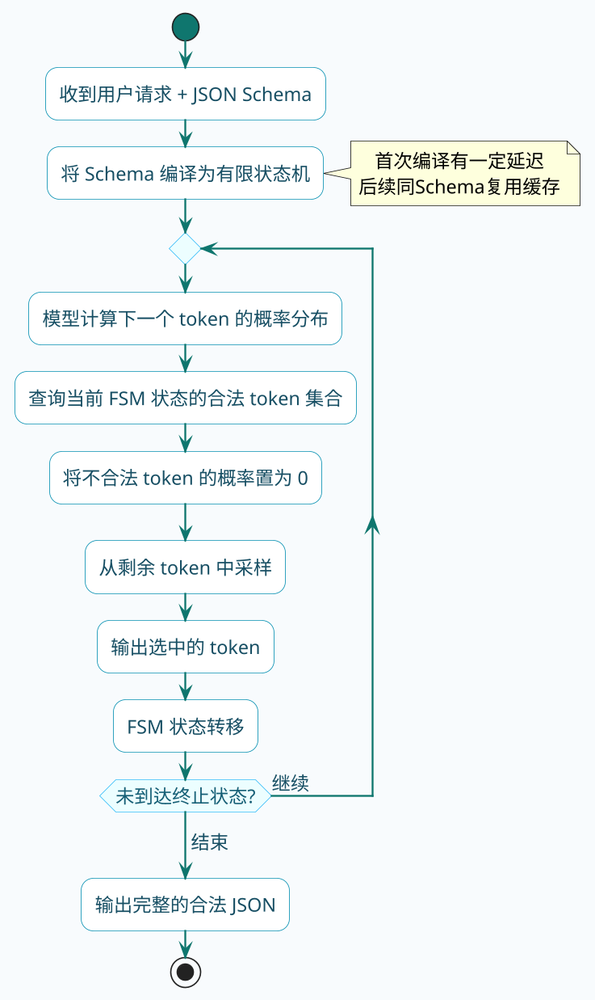
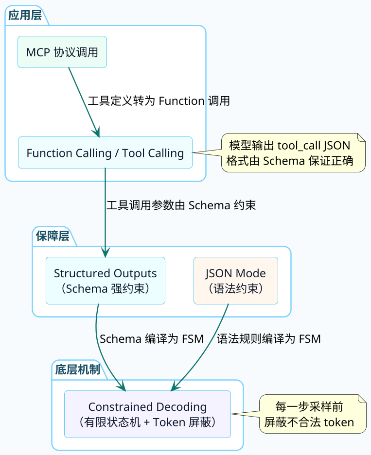
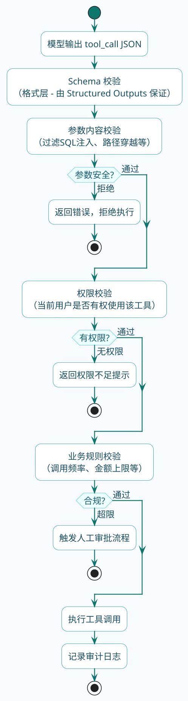

# 从结构化输出到可靠的工具调用

:::tip 实战项目推荐
可靠工具调用依赖结构化输出、参数校验和执行反馈。超级 AI 智能体把这些环节放进 Agent 链路里，适合观察模型输出如何真正进入后端业务逻辑。

项目详细介绍：**[什么是超级 AI 智能体？](/super-agent/overview/project-intro)**
:::

前面讲了工具调用的完整流程，你知道模型会输出一段结构化的JSON来表示"我要调用哪个工具、参数是什么"。但有没有想过一个问题：

**模型凭什么每次都能输出合法的JSON？**

你要知道，模型本质上是一个"下一个token预测器"。它每次只决定下一个字符是什么，完全有可能生成不合法的JSON——少个引号、多个逗号、类型对不上。如果工具调用的JSON格式出了错，你的代码根本没法解析，整个调用链条就断了。

这一节我们来聊聊：结构化输出的可靠性是怎么保障的，以及这个机制对工具调用有什么意义。

## 提示词的约束其实不够靠谱

最朴素的做法就是在提示词里告诉模型"请用JSON格式返回"。很多教程也是这么教的：

```
请以JSON格式返回结果，包含name、age、city三个字段。
```

这能不能用？大部分时候能。既然是大部分时候，那么也就有小部分时候，而这小部分时候在生产环境里是决不允许存在的。

### 失败是怎么发生的

模型生成文本是逐token进行的。每一步都是一次独立的概率采样——模型根据前文预测下一个token应该是什么，从概率分布中选一个出来。

假设一个JSON响应需要生成200个token，模型在每个token上有99%的概率做出正确的选择。听着挺高的对吧？但200个token全部正确的概率是：

```
0.99^200 ≈ 0.134
```

只有13.4%的成功率。这就是所谓的**概率衰减效应**——每一步的小误差会指数级累积。

实际中模型常犯的错误包括：

- 输出JSON之前加了一句"好的，以下是结果："
- 在JSON外面套了markdown代码块 ` ```json ... ``` `
- 字段名拼错或者用了别的语言
- 数值字段输出了字符串类型
- 嵌套对象漏了花括号

:::caution 生产环境的问题
在日均调用量过万的系统中，哪怕1%的格式错误率，每天就有上百次解析失败。一次解析失败 = 一次用户请求白瞎了。简单提示词约束的方式，在严肃的业务场景下是不够的。
:::

## 三个层次的输出约束

模型厂商为了解决这个问题，逐步推出了越来越强的约束机制。可以把它们理解为三道防线，每道防线的"刚性"依次增强：

### 第一层：提示词约束（Prompt Constraint）

就是前面说的，在提示词里写"请返回JSON"。

约束力度：**建议**级别。模型大多数时候会遵守，但没有任何机制保证它必须遵守。类似于你跟同事说"文档写完了发我一份"——他大概率会发，但你没法保证。

适合场景：原型验证、非关键路径、对格式容错性高的场景。

### 第二层：JSON Mode

OpenAI从2023年底开始提供JSON Mode。开启后，API层面保证输出一定是合法的JSON。

```json
{
  "model": "gpt-4o",
  "messages": [...],
  "response_format": { "type": "json_object" }
}
```

它的保障机制是什么？模型在生成过程中，系统会检查输出是否符合JSON语法。如果模型试图输出一个会破坏JSON结构的token，系统会干预——要么屏蔽掉这个token的概率，要么强制纠正。

不过JSON Mode有一个明显的局限：**它只保证语法合法，不保证语义正确**。

也就是说，模型输出的JSON一定能被`JSON.parse()`解析成功，但字段名可能不对、字段类型可能不匹配、可能缺少必要的字段。你要求返回`{"name": "xxx", "age": 20}`，它可能给你返回`{"full_name": "xxx", "years_old": "二十"}`——语法合法，但业务逻辑上完全不对。

### 第三层：Structured Outputs（Schema约束）

这是目前最强的约束级别。你提供一个完整的JSON Schema，系统保证输出**严格符合**这个Schema——字段名必须匹配、类型必须正确、必填字段不能少。

```json
{
  "model": "gpt-4o",
  "messages": [...],
  "response_format": {
    "type": "json_schema",
    "json_schema": {
      "name": "tool_response",
      "strict": true,
      "schema": {
        "type": "object",
        "properties": {
          "name": { "type": "string" },
          "age": { "type": "integer" },
          "city": { "type": "string" }
        },
        "required": ["name", "age", "city"],
        "additionalProperties": false
      }
    }
  }
}
```

开了`strict: true`之后，输出和Schema之间的关系就不是"建议遵守"了，是"物理层面不可能违反"。

这三层约束的对比：

| 维度 | 提示词约束 | JSON Mode | Structured Outputs |
|------|-----------|-----------|-------------------|
| 格式保证 | 不保证 | 保证合法JSON | 保证匹配Schema |
| 字段控制 | 靠自觉 | 不保证 | 严格匹配 |
| 类型控制 | 靠自觉 | 不保证 | 严格匹配 |
| 实现层面 | 纯提示词 | 语法校验 | 有限状态机约束 |
| 首次调用延迟 | 无 | 无 | 有（Schema编译） |
| 适合场景 | 原型验证 | 简单格式化 | 生产级工具调用 |

## Constrained Decoding：到底怎么做到"不可能违反"的

Structured Outputs背后的核心技术叫做**受约束解码**（Constrained Decoding）。这个名字听着不好理解，原理概括起来就是：

**在模型选择下一个token之前，先把不合法的选项屏蔽掉。**

### 有限状态机（FSM）的思路

具体怎么实现的？系统会把你提供的JSON Schema编译成一个**有限状态机**（Finite State Machine）。

拿一个简单的Schema举例：

```json
{
  "type": "object",
  "properties": {
    "city": { "type": "string" },
    "temp": { "type": "number" }
  },
  "required": ["city", "temp"]
}
```

编译后的状态机大致是这样的逻辑：

```
状态0（初始）→ 只允许输出 '{'
状态1（对象开始）→ 只允许输出 '"city"'
状态2（city键后）→ 只允许输出 ':'
状态3（等待city值）→ 只允许输出字符串类型的token
状态4（city值结束）→ 只允许输出 ','
状态5（等待下一个键）→ 只允许输出 '"temp"'
状态6（temp键后）→ 只允许输出 ':'
状态7（等待temp值）→ 只允许输出数字类型的token
状态8（temp值结束）→ 只允许输出 '}'
状态9（结束）→ 终止
```

每个状态下，都有一个**合法token集合**。当模型完成一轮概率计算后，系统会拿这个合法集合做一次mask——把不在集合内的token概率全部置为0，然后再从剩余的选项中采样。



### 这个过程会影响模型的表达能力吗

你可能会担心：屏蔽了那么多token选项，模型的输出质量会不会下降？

答案是：**对内容质量的影响极小**。

原因在于，被屏蔽的token本来就是"格式噪音"——模型本身想输出正确格式的概率已经很高了（毕竟训练时见过大量JSON），约束解码只是把那些极小概率的错误可能性彻底清零。好比一个人本来就不太可能在写JSON时把花括号写成圆括号，你只是在物理上让他不可能这么做而已。

不过有一个小代价：**首次请求的延迟**。系统需要把Schema编译成状态机，这个过程需要一定时间（通常几百毫秒）。好消息是编译结果可以缓存，同一个Schema后续请求就不需要重新编译了。

:::info 开源实现
开源社区也有类似的实现，比如 Outlines、LMQL、Guidance 等框架，思路类似——用正则表达式或 CFG（上下文无关文法）来约束解码过程。如果你用的是开源模型（Qwen、DeepSeek、Llama），可以通过这些框架实现类似 Structured Outputs 的效果。
:::

## Function Calling 本质上就是一种结构化输出

搞懂了结构化输出的保障机制，再回头看 Function Calling，你会发现一个有意思的事实：

**Function Calling 的底层就是结构化输出。**

当你给模型传入工具定义时，模型需要输出的`tool_call`请求本身就是一段结构化JSON：

```json
{
  "tool_calls": [
    {
      "id": "call_abc123",
      "type": "function",
      "function": {
        "name": "get_weather",
        "arguments": "{\"city\": \"杭州\", \"unit\": \"celsius\"}"
      }
    }
  ]
}
```

这段JSON的格式必须严格正确，否则你的程序没法解析出工具名和参数。而保证这段JSON正确的机制，就是我们刚才讲的 Structured Outputs 或类似的约束解码技术。

用一张图来展示它们之间的关系：



### 从工具定义到 Schema 约束的转换

回顾第一节讲过的工具定义：

```json
{
  "type": "function",
  "name": "get_weather",
  "description": "查询指定城市的天气信息",
  "parameters": {
    "type": "object",
    "properties": {
      "city": { "type": "string", "description": "城市名称" },
      "unit": { "type": "string", "enum": ["celsius", "fahrenheit"] }
    },
    "required": ["city"]
  }
}
```

当模型决定调用这个工具时，API内部实际上把`parameters`这个JSON Schema交给了约束解码模块。模型生成`arguments`字段的过程，就是在这个Schema对应的有限状态机约束下进行的。

这意味着：
- `city`字段一定会出现（因为在`required`里）
- `unit`字段如果出现，值一定是`celsius`或`fahrenheit`之一（因为有`enum`约束）
- 不会多出Schema里没有定义的字段（如果开了`additionalProperties: false`）

所以你在第四节看到的那些工具设计原则——用枚举收窄取值范围、明确参数类型——不仅仅是给模型"看"的提示，它们同时也是约束解码的规则。写得越精确，约束越强，出错概率越低。

## 从 Function Calling 到 MCP：约束机制一脉相承

在下一个系列我们会详细聊 MCP 协议。这里先提一下它和结构化输出的关系。

MCP Server 暴露工具能力时，用的也是 JSON Schema 来描述参数：

```json
{
  "name": "query_database",
  "description": "执行SQL查询",
  "inputSchema": {
    "type": "object",
    "properties": {
      "sql": { "type": "string", "description": "要执行的SQL语句" },
      "database": { "type": "string", "enum": ["orders", "users", "products"] }
    },
    "required": ["sql", "database"]
  }
}
```

MCP Client 收到这个工具描述后，会把它转换成模型能理解的 Function 定义，提交给大模型。大模型生成 tool_call 时，约束解码机制确保输出的参数格式正确，MCP Client 再把解析后的参数发给 MCP Server 执行。

整条链路上，JSON Schema 起到了"契约"的作用——它同时约束了三方的行为：

1. **MCP Server 端**：按 Schema 定义暴露能力
2. **大模型端**：按 Schema 约束生成参数
3. **MCP Client 端**：按 Schema 验证数据完整性

:::tip 为什么说 JSON Schema 是 AI 工具生态的通用语言
无论是 OpenAI 的 Function Calling、Anthropic 的 Tool Use，还是 MCP 协议，工具参数的描述格式都收敛到了 JSON Schema。这不是巧合——JSON Schema 既能被人阅读理解，也能被机器编译成约束规则。它天然适合作为"人机协作"的接口契约。
:::

## 生产环境中的安全考量

结构化输出解决了"格式正确性"的问题，但生产环境还要考虑另一件事：**输出的内容本身是否安全**。

格式对了不代表内容靠谱。模型可能生成语法完美但语义上有风险的工具调用：

### 参数注入风险

假设你有一个数据库查询工具，模型生成的参数可能包含恶意SQL：

```json
{
  "name": "query_database",
  "arguments": {
    "sql": "SELECT * FROM users; DROP TABLE orders;--",
    "database": "orders"
  }
}
```

Schema 约束只保证`sql`是字符串类型、`database`在枚举范围内，但不会检查SQL内容是否有注入风险。

### 越权调用风险

模型可能基于用户的诱导性输入，尝试调用它不应该调用的工具，或者传入超出用户权限的参数。比如用户说"帮我查一下所有人的工资"，模型可能真的去调工资查询工具——但当前用户可能只有查自己工资的权限。

### 防护措施

生产环境中对工具调用输出需要多层防护：



简单来说：**结构化输出保证模型"说的话格式对"，但"说的话该不该听"还得你自己判断。** 工具执行层必须有独立的安全校验逻辑，不能因为模型输出了一个格式完美的JSON就无脑执行。

## 各家厂商的实现差异

不同的模型厂商在结构化输出的支持程度上不太一样，了解这些差异在做技术选型时很有用：

| 厂商/模型 | JSON Mode | Structured Outputs | 工具调用约束 | 备注 |
|-----------|-----------|-------------------|-------------|------|
| OpenAI (GPT-4o) | 支持 | 支持（strict模式） | Schema强约束 | 目前最完善 |
| Anthropic (Claude) | 通过prompt实现 | Tool Use内置约束 | 内置Schema约束 | Tool Use本身就是结构化输出 |
| Google (Gemini) | 支持 | 支持 | Schema约束 | 支持responseSchema参数 |
| DeepSeek | 支持 | 部分支持 | 依赖prompt | 开源模型可搭配Outlines |
| Qwen (通义千问) | 支持 | 部分支持 | 模板约束 | 有内置的tool call模板 |

:::warning 开源模型的注意事项
如果你用的是开源模型自部署，默认情况下可能没有 Structured Outputs 级别的约束。需要搭配 vLLM 的 guided decoding、Outlines、SGLang 等框架来实现。具体选型可以参考你的推理框架是否原生支持 JSON Schema 约束。
:::

## 实际项目中的选型建议

回到实际开发，面对"模型输出格式不对"这个问题，你应该怎么选择方案？

**如果是内部工具、原型验证**：提示词约束就够了，加上代码层面的try-catch兜底。格式错误时重试一次，大多数情况能搞定。

**如果是生产环境的简单格式化**：开启JSON Mode。保证语法正确，对字段要求不严格的场景足够。

**如果是生产环境的工具调用**：必须用Structured Outputs或者等价的约束方案。工具调用对参数格式的要求是刚性的——参数名错了、类型错了，你的代码直接抛异常。

**如果用的是开源模型**：搭配推理框架的 guided decoding 功能。比如 vLLM 从 0.4.0 版本开始支持 guided decoding，可以传入 JSON Schema 来约束输出。

```python
# vLLM guided decoding 示例（Python）
from vllm import LLM, SamplingParams
from vllm.sampling_params import GuidedDecodingParams

llm = LLM(model="Qwen/Qwen2.5-7B-Instruct")

guided_params = GuidedDecodingParams(json_schema=your_schema)
sampling_params = SamplingParams(
    temperature=0.7,
    guided_decoding=guided_params
)

output = llm.generate(prompts, sampling_params)
```

对应到 Java 生态，如果你用 Spring AI 对接这些模型，框架层面的 `BeanOutputConverter` 会自动处理 JSON Schema 的注入和响应解析（详见第10章结构化输出部分）。底层模型是否真的做了约束解码，取决于你对接的模型服务是否支持。

## 小结

这一节我们搞清楚了几件事：

1. 光靠提示词让模型返回JSON，在生产环境不够可靠——概率衰减效应会让错误率随输出长度指数上升
2. 业界演进出三层约束：提示词约束 → JSON Mode → Structured Outputs，刚性依次增强
3. Structured Outputs 的底层技术是受约束解码——通过有限状态机在每步采样前屏蔽非法token
4. Function Calling 本质上就是一种结构化输出的应用场景，工具定义中的 JSON Schema 同时充当约束解码的规则
5. MCP 协议复用了同样的 JSON Schema 契约机制，贯穿 Server → Client → Model 全链路
6. 格式正确不等于内容安全，工具执行前还需要参数校验、权限检查、业务规则校验
