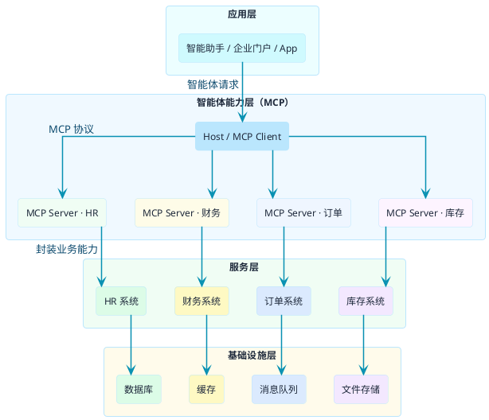
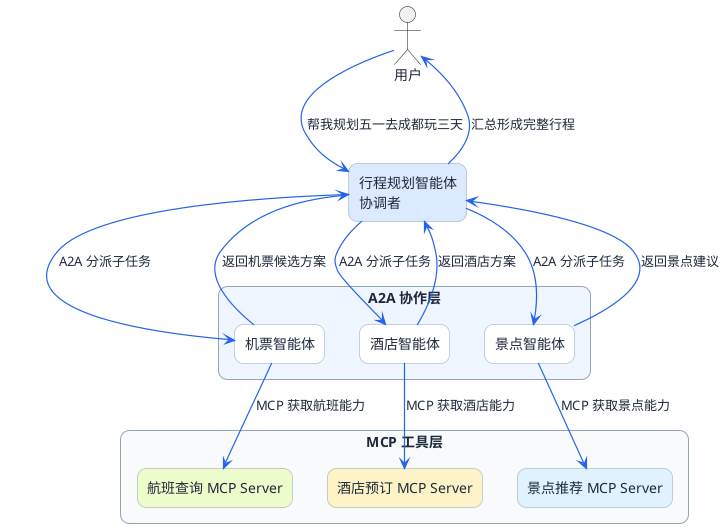

# MCP与相关技术的关系

:::tip 实战项目推荐
MCP、Function Call、Agent 和 RAG 不是互相替代，而是处在不同层次。超级 AI 智能体把这些能力放在同一个系统里，适合用来理解它们在工程架构中的分工。

项目详细介绍：**[什么是超级 AI 智能体？](/super-agent/overview/project-intro)**
:::

当你开始在项目中引入MCP时，可能会遇到这样的疑问：

- "我们已经有RPC框架了，还需要MCP吗？"
- "MCP和我们现有的微服务架构怎么配合？"
- "听说还有个A2A协议，它和MCP什么关系？"

这些问题的本质是在问：**MCP在技术体系中处于什么位置，和其他技术是什么关系？**

要回答这个问题，我们需要先跳出来，从更宏观的视角看看整个技术图谱。

## 从企业IT架构看技术分层

想象一下一家中型企业的IT系统架构，通常会有这几层：

**基础设施层**：服务器、数据库、消息队列、缓存等

**服务层**：各种业务系统，HR系统、财务系统、订单系统、库存系统等

**集成层**：让各个系统能够互相通信的中间件，比如API网关、ESB（企业服务总线）

**应用层**：面向最终用户的应用，比如企业门户、移动App、智能助手等

现在的问题是：当你要在这个架构里加入一个智能助手，让它能够调用各种后端系统的能力时，该怎么办？

传统做法是在集成层做适配——针对每个系统写一套对接代码。HR系统是HTTP接口就写HTTP调用，财务系统是Dubbo就写Dubbo调用，订单系统是gRPC就写gRPC调用。

:::info MCP 的核心定位
MCP提供了另一种思路：**在服务层和应用层之间加一个"智能体能力层"**。各个后端系统把自己的能力封装成MCP Server，智能助手通过统一的MCP协议来调用，不用再针对每个系统单独适配。
:::



理解了这个定位，我们再来看MCP和其他技术的关系就清楚多了。

## 为什么MCP不用HTTP或gRPC？

在讨论MCP与RPC的关系之前，先回答一个常见问题：既然有HTTP和gRPC这些成熟方案，为什么MCP要另起炉灶用JSON-RPC 2.0？

### HTTP的问题：只管传输，不管调用格式

HTTP是一个**传输协议**，它定义了怎么建立连接、怎么发请求、怎么返回响应。但它**不定义**：

- 方法名怎么表示？放在URL路径里？还是Body里？
- 参数怎么传？Query String？JSON Body？Form Data？
- 错误怎么表达？用HTTP状态码？还是Body里的错误对象？
- 不需要响应的通知消息怎么处理？

这就导致基于HTTP的API设计千差万别：RESTful用`POST /users`、`GET /users/123`这种风格；RPC风格用`POST /api` + `{"method": "getUser"}`；GraphQL又是另一套Query DSL。

每种风格都有自己的约定，**缺乏统一标准**。MCP如果用HTTP，就要自己定义一套消息格式，等于重复造轮子。

### gRPC的问题：太重了

gRPC是完整的RPC框架，功能强大：Protocol Buffers强类型、HTTP/2传输、流式调用、多语言代码生成。但它带来了额外复杂度：

1. **需要预先定义.proto文件**：每个工具都要写Protocol Buffers定义，增加开发成本
2. **强依赖代码生成**：客户端和服务端都需要生成代码，动态调用不方便
3. **二进制协议不易调试**：无法直接用curl测试，必须用专门工具
4. **HTTP/2依赖**：部分环境（如浏览器、某些代理）对HTTP/2支持不完善

对于MCP这种需要**轻量、灵活、易于调试**的场景，gRPC显得过于重量级。而且MCP要跑在stdio上连接本地进程，gRPC的HTTP/2传输根本用不了。

### JSON-RPC 2.0：刚好够用

JSON-RPC 2.0是一个**消息格式规范**，只定义请求、响应、通知、错误这几种消息该怎么表达，**不绑定传输层**。

它的几个特点恰好契合MCP需求：

| 特点 | 对MCP的价值 |
|------|-------------|
| 极简规范（只有几页） | 实现成本低，任何语言都能快速支持 |
| 使用JSON文本格式 | 人类可读，调试方便，直接用curl就能测试 |
| 不绑定传输层 | 可以跑在HTTP、WebSocket、stdio上 |
| 原生支持Notification | 适合日志上报、进度通知等单向消息 |
| 原生支持Batch | 一次发多个请求，减少网络往返 |

所以MCP选择JSON-RPC 2.0，本质上是在**标准化、简单性、灵活性**之间做了权衡——它不是最快的（gRPC更快），也不是最灵活的（HTTP可以自由设计），但它是**最标准、最简单、最容易互操作**的。这正是MCP需要的。

:::tip 技术选型思路
JSON-RPC 2.0 胜在"刚好够用"：规范只有几页，支持 JSON 可读性，不绑定传输层，原生支持 Notification 和 Batch。在 AI 工具协议这个场景下，简单和互操作性比极致性能更重要。
:::

## MCP与RPC：不同层面的东西

### RPC在做什么

RPC（Remote Procedure Call，远程过程调用）解决的是"如何让分布式系统像调用本地函数一样调用远程服务"。

比如你有一个订单服务部署在A机器，用户服务部署在B机器。当订单服务需要查询用户信息时，通过RPC框架，可以像调用本地方法一样写代码：

```java
// 看起来像本地调用
User user = userService.getUserById("12345");

// 但实际上是远程调用，RPC框架帮你处理了：
// 1. 序列化参数
// 2. 网络传输
// 3. 服务寻址
// 4. 反序列化结果
```

常见的RPC框架有Dubbo、gRPC、Thrift等。它们的核心价值是**让远程调用透明化**，开发者不用关心网络细节。

### MCP在做什么

MCP解决的问题完全不同。它不是要让远程调用更简单，而是要**让大模型能够理解和使用外部工具**。

MCP的核心不是传输效率，而是：

1. **工具描述标准化**：怎么让大模型理解一个工具是干嘛的、需要什么参数
2. **能力发现机制**：怎么让智能助手知道有哪些工具可用
3. **调用意图转换**：怎么把大模型输出的JSON指令转换成实际的工具调用

打个比方：RPC像是修了一条高速公路，让货车能快速从A地到B地。MCP像是建了一个物流调度中心，决定哪辆货车去哪里、装什么货。它们解决的是不同层面的问题。

### 它们怎么配合

在实际项目中，MCP和RPC完全可以共存，而且经常会配合使用：

- MCP Server内部调用后端服务时，可以用RPC
- MCP Server之间如果需要互相调用，也可以用RPC
- MCP协议本身的传输层（Streamable HTTP）和RPC没有冲突

举个例子：你的MCP Server提供"查询库存"的工具。当收到调用请求时，Server内部可能用Dubbo去调用库存微服务：

```java
@Tool(description = "查询商品库存数量")
public String checkInventory(String productId) {
    // MCP Server内部通过RPC调用库存服务
    InventoryInfo info = inventoryService.getStock(productId);
    return JSON.toJSONString(info);
}
```

所以正确的理解是：**MCP是一层新增的能力，不是要替换现有的RPC架构**。

:::note MCP 与 RPC 共存
MCP Server 内部完全可以继续使用 Dubbo、gRPC 等 RPC 框架调用后端微服务。MCP 负责"智能体↔工具"这一层的标准化，RPC 负责内部服务间的高效通信，两者解决不同层面的问题，互不冲突。
:::

## MCP与A2A：垂直能力与水平协作

### A2A是什么

A2A（Agent-to-Agent Protocol，智能体间通信协议）是Google等厂商推动的另一个协议标准。从名字就能看出来，它解决的是**智能体之间怎么协作**的问题。

想象一个复杂的业务场景：用户说"帮我规划一下五一去成都的旅游行程"。这个任务可能涉及：

- 航班查询和预订
- 酒店查询和预订
- 景点推荐
- 行程安排
- 费用预算

单个智能体很难搞定所有事情。更好的方式是让多个专业智能体协作：

- **行程规划智能体**：负责整体协调和行程编排
- **机票智能体**：专门负责航班相关的查询和预订
- **酒店智能体**：专门负责住宿相关的查询和预订
- **景点智能体**：负责景点推荐和门票相关

A2A协议就是定义这些智能体之间怎么沟通、怎么分配任务、怎么汇总结果的。

### MCP和A2A的分工

用一句话概括：**MCP让单个智能体获得工具能力，A2A让多个智能体能够协作**。

:::info MCP 与 A2A 的分工
- **MCP**：解决智能体如何使用外部工具（垂直能力获取）
- **A2A**：解决多个智能体如何协作完成复杂任务（水平任务协调）

两者互补，MCP 负责向下获取工具能力，A2A 负责向上进行智能体间的任务分派与汇总。
:::

它们的关系可以这样理解：

| 维度 | MCP | A2A |
|------|-----|-----|
| 解决的问题 | 智能体如何使用外部工具 | 多个智能体如何协作 |
| 连接对象 | 智能体 ↔ 工具服务 | 智能体 ↔ 智能体 |
| 主要职责 | 能力获取 | 任务协调 |
| 比喻 | 员工的技能培训 | 团队的协作流程 |

### 一个综合场景

还是用旅游规划的例子，看看MCP和A2A怎么配合：



工作流程是这样的：

1. 行程规划智能体收到用户请求
2. 通过A2A协议，把"查机票"的子任务分配给机票智能体
3. 机票智能体通过MCP调用航班查询工具，拿到航班信息
4. 机票智能体把结果通过A2A返回给行程规划智能体
5. 酒店、景点同理
6. 行程规划智能体汇总所有结果，生成最终行程方案

**MCP负责向下获取工具能力，A2A负责向上进行智能体协作**，它们是互补的关系。

## MCP与Function Call：增强而非替代

这个问题在上一篇提过，这里再从技术选型的角度说一下。

Function Call是大模型的原生能力，几乎所有主流大模型都支持（OpenAI、Claude、通义千问等）。它让大模型能够输出结构化的工具调用意图。

MCP没有重新发明这个轮子，而是在它之上加了一层管理框架。打个比方：

- Function Call是"发动机"，提供动力
- MCP是"整车"，包括发动机在内的完整系统

你不能说"有了整车还要发动机干嘛"——整车本来就包含发动机，而且需要发动机才能跑起来。

实际运行时，MCP内部仍然依赖大模型的Function Call能力来做工具选择和参数提取。MCP做的是把工具定义、工具发现、工具执行这些事情标准化了。

## 技术选型决策指南

说了这么多，落到实际项目中该怎么选？这里给出一个简单的决策框架：

### 场景一：单智能体 + 少量工具

**特征**：只有一个智能助手，需要调用的工具不超过5个，工具都是自己团队开发的。

**建议**：直接用Function Call就够了。工具少的时候，手写JSON Schema的工作量可以接受，引入MCP反而增加复杂度。

### 场景二：单智能体 + 多工具 + 跨团队

**特征**：一个智能助手需要对接多个团队的系统，工具数量超过10个，各团队用的技术栈不一样。

**建议**：引入MCP。让各团队把自己系统的能力封装成MCP Server，智能助手统一用MCP Client对接。这样避免了针对每个系统写适配代码，而且工具变更时不用改智能助手的代码。

### 场景三：多智能体协作

**特征**：业务复杂，需要多个专业智能体配合完成任务。

**建议**：MCP + A2A。每个智能体用MCP对接自己需要的工具，智能体之间用A2A协调任务。这是目前比较前沿的架构，适合复杂的企业级场景。

### 场景四：已有微服务架构

**特征**：公司已经有完善的微服务体系，用Dubbo/SpringCloud/gRPC等框架。

**建议**：MCP和现有架构并存。把微服务的能力通过MCP Server暴露出来，供智能助手调用。内部服务之间的调用继续用原来的RPC框架，不需要改动。

## 技术演进趋势

最后聊聊趋势。从目前的发展来看：

**MCP正在成为事实标准**。Claude Desktop、Cursor、VS Code插件（Cline、Continue）等主流AI工具都已支持MCP。社区里也出现了大量现成的MCP Server，涵盖文件操作、数据库查询、Web搜索、代码仓库等常见场景。

**A2A还在早期阶段**。多智能体协作的场景目前主要在研究和实验阶段，生产环境的应用还不多。但随着智能体能力的提升，这个方向值得关注。

**Function Call会持续存在**。作为大模型的基础能力，它不会被替代。MCP等上层协议会继续依赖它。

对于开发者来说，现阶段最实际的建议是：**把MCP作为必学技能**。它的学习成本不高，但带来的架构收益很明显。至于A2A，可以保持关注，等生态更成熟时再深入研究。

:::tip 学习路径建议
现阶段优先掌握 MCP：工具多、生态成熟、落地门槛低。A2A 仍处于早期，保持关注即可，待生态完善后再投入精力研究。
:::

下一篇我们会深入MCP的技术细节，看看它底层的JSON-RPC通信机制是怎么工作的。
