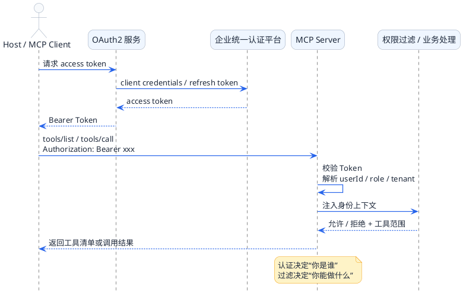
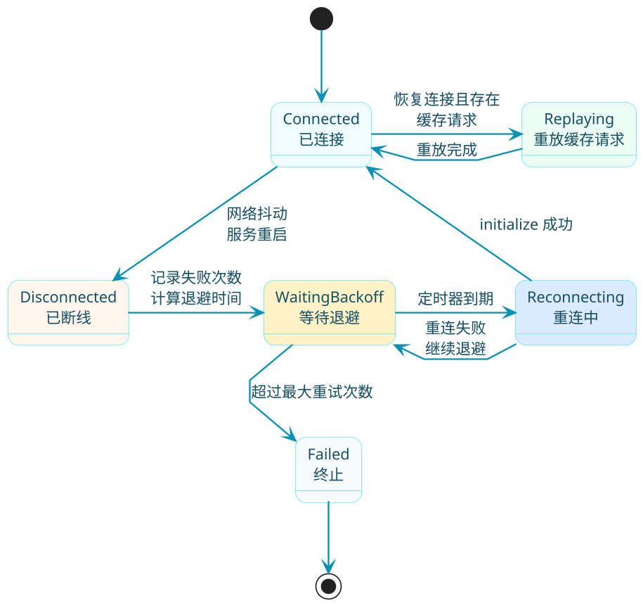
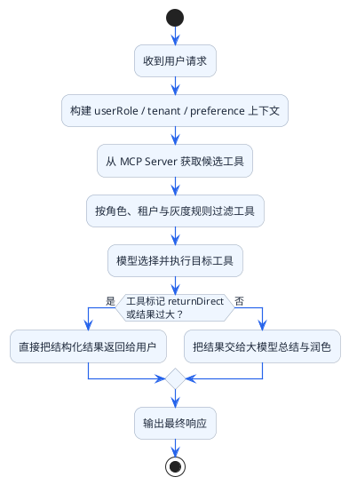

# MCP企业级开发进阶技巧

当你在本地调试MCP时，一切都很顺利。但真正推向生产环境时，肯定会有各种的问题：远程服务怎么做认证？网络断了如何自动恢复？不同用户能调用的工具不一样怎么办？这篇文章就来聊聊这些企业级开发中的进阶技巧。

## 认证鉴权：给你的MCP服务装上门禁系统

想象一下你公司的办公楼门禁系统。普通员工刷工卡只能进入自己所在楼层，管理层可以进入更多区域，而访客则需要在前台登记换取临时卡。MCP的认证鉴权机制也是类似的思路。

### 本地服务的"内部通道"

如果MCP Server和Client在同一台机器上（比如使用Stdio模式），这就相当于在公司内部走动，不需要额外的身份验证。此时认证方式通常是通过环境变量传递敏感信息：

```java
@Configuration
public class LocalMcpConfig {
    
    @Bean
    public McpSyncClient localMcpClient() {
        // 本地模式下，通过环境变量传递API密钥
        // 这些密钥用于Server内部调用第三方服务
        return McpClient.sync(
            StdioClientTransport.builder()
                .command("java")
                .args("-jar", "hr-assistant-server.jar")
                .environment(Map.of(
                    "DINGTALK_APP_KEY", System.getenv("DINGTALK_APP_KEY"),
                    "DINGTALK_APP_SECRET", System.getenv("DINGTALK_APP_SECRET"),
                    "DATABASE_PASSWORD", System.getenv("DATABASE_PASSWORD")
                ))
                .build()
        ).build();
    }
}
```

这种方式的好处是敏感信息不会在网络上传输，安全性有保障。密钥从Host环境传递给Server进程，整个过程都在本地内存中完成。

:::tip 本地模式的安全最佳实践
Stdio 模式下，通过环境变量向子进程传递敏感信息（API Key、数据库密码）是最安全的做法。密钥不会出现在配置文件里，也不会在网络上传输，整个生命周期在本机内存中完成。
:::

### 远程服务的"访客登记"

当MCP Server部署在远程服务器上时，情况就不同了。这时候每次请求都需要携带身份凭证，就像访客每次进入都要出示临时卡一样。

最常用的方式是Bearer Token认证：

```java
@Configuration
public class RemoteMcpConfig {
    
    @Value("${mcp.server.token}")
    private String accessToken;
    
    @Bean
    public McpSyncClient remoteMcpClient() {
        // 构建带认证头的HTTP客户端
        HttpClient authenticatedClient = HttpClient.newBuilder()
            .connectTimeout(Duration.ofSeconds(10))
            .build();
        
        return McpClient.sync(
            HttpClientSseClientTransport.builder()
                .sseUrl("https://mcp.company.com/sse")
                .httpClient(authenticatedClient)
                .customizeRequest(builder -> {
                    // 每次请求都携带Token
                    builder.header("Authorization", "Bearer " + accessToken);
                })
                .build()
        ).build();
    }
}
```

**服务端的验证逻辑**也需要配套实现：

```java
@Component
public class McpAuthenticationFilter implements WebFilter {
    
    @Value("${mcp.valid-tokens}")
    private Set<String> validTokens;
    
    @Override
    public Mono<Void> filter(ServerWebExchange exchange, WebFilterChain chain) {
        String authHeader = exchange.getRequest().getHeaders()
            .getFirst(HttpHeaders.AUTHORIZATION);
        
        if (authHeader == null || !authHeader.startsWith("Bearer ")) {
            exchange.getResponse().setStatusCode(HttpStatus.UNAUTHORIZED);
            return exchange.getResponse().setComplete();
        }
        
        String token = authHeader.substring(7);
        if (!validTokens.contains(token)) {
            exchange.getResponse().setStatusCode(HttpStatus.FORBIDDEN);
            return exchange.getResponse().setComplete();
        }
        
        // 可以把用户信息放入上下文，后续工具过滤会用到
        return chain.filter(exchange)
            .contextWrite(ctx -> ctx.put("userId", extractUserId(token)));
    }
}
```

### 更复杂的场景：OAuth2集成

企业环境中可能需要与现有的身份认证系统集成，比如接入公司的统一认证平台：

```java
@Service
public class OAuth2McpAuthService {
    
    private final OAuth2AuthorizedClientManager clientManager;
    
    public String obtainAccessToken() {
        OAuth2AuthorizeRequest request = OAuth2AuthorizeRequest
            .withClientRegistrationId("mcp-server")
            .principal("system")
            .build();
            
        OAuth2AuthorizedClient client = clientManager.authorize(request);
        return client.getAccessToken().getTokenValue();
    }
}
```



## SSE重连机制：电话断了就重新拨

用过SSE模式的同学肯定遇到过这个问题：网络稍有波动，连接就断了，然后工具就用不了了。这就像打电话时信号不好断线了，最自然的做法就是重新拨过去。

### 为什么需要重连？

SSE（Server-Sent Events）本质上是一个长连接，服务器通过这个连接不断推送消息给客户端。但网络环境复杂多变：

- 用户切换WiFi网络
- 服务器端重启或部署更新
- 中间代理超时断开
- 临时的网络抖动

没有重连机制的话，一旦断开就只能让用户手动重启应用，体验很差。

:::warning SSE 模式连接稳定性差
SSE 长连接容易因网络抖动、代理超时、服务重启而断开。生产环境如果仍在使用 SSE 模式，必须实现重连机制。推荐使用指数退避策略，初始等待 1s，每次失败后翻倍，最大不超过 60s，并加入随机抖动避免大量客户端同时重连。
:::

### 实现重连的几种策略

**策略一：固定间隔重试**

最简单的方式，断开后每隔固定时间尝试重连：

```java
@Component
public class SimpleReconnectHandler {
    
    private static final int RECONNECT_INTERVAL_SECONDS = 5;
    private static final int MAX_RETRY_COUNT = 10;
    
    private final ScheduledExecutorService scheduler = 
        Executors.newSingleThreadScheduledExecutor();
    
    private int retryCount = 0;
    private McpSyncClient client;
    
    public void onDisconnected() {
        if (retryCount >= MAX_RETRY_COUNT) {
            log.error("达到最大重试次数，放弃重连");
            notifyUser("连接已断开，请手动重启");
            return;
        }
        
        retryCount++;
        log.info("连接断开，{}秒后进行第{}次重连", 
                 RECONNECT_INTERVAL_SECONDS, retryCount);
        
        scheduler.schedule(this::attemptReconnect, 
                          RECONNECT_INTERVAL_SECONDS, 
                          TimeUnit.SECONDS);
    }
    
    private void attemptReconnect() {
        try {
            client.initialize();
            retryCount = 0;  // 重连成功，重置计数
            log.info("重连成功！");
        } catch (Exception e) {
            log.warn("重连失败: {}", e.getMessage());
            onDisconnected();  // 继续重试
        }
    }
}
```

**策略二：指数退避重试**

更智能的方式是使用指数退避，避免在服务器压力大时雪上加霜：

```java
@Component
public class ExponentialBackoffReconnectHandler {
    
    private static final int INITIAL_DELAY_MS = 1000;
    private static final int MAX_DELAY_MS = 60000;
    private static final double MULTIPLIER = 2.0;
    private static final double JITTER = 0.2;  // 添加随机性避免惊群
    
    private int currentDelayMs = INITIAL_DELAY_MS;
    
    public void onDisconnected() {
        // 添加随机抖动
        int jitteredDelay = addJitter(currentDelayMs);
        
        log.info("连接断开，{}ms后尝试重连", jitteredDelay);
        
        scheduler.schedule(this::attemptReconnect, 
                          jitteredDelay, 
                          TimeUnit.MILLISECONDS);
        
        // 下次延迟加倍，但不超过最大值
        currentDelayMs = Math.min((int)(currentDelayMs * MULTIPLIER), MAX_DELAY_MS);
    }
    
    private int addJitter(int delay) {
        double jitterRange = delay * JITTER;
        return delay + (int)(Math.random() * jitterRange * 2 - jitterRange);
    }
    
    public void onConnected() {
        // 连接成功后重置延迟
        currentDelayMs = INITIAL_DELAY_MS;
    }
}
```

**策略三：断线期间缓存请求**

更完善的方案是在断线期间把请求缓存起来，重连后自动重放：

```java
@Component
public class ResilientMcpClient {
    
    private final Queue<PendingRequest> pendingRequests = 
        new ConcurrentLinkedQueue<>();
    private volatile boolean connected = false;
    
    public CompletableFuture<Object> callTool(String toolName, Map<String, Object> args) {
        CompletableFuture<Object> future = new CompletableFuture<>();
        
        if (connected) {
            // 正常调用
            executeToolCall(toolName, args, future);
        } else {
            // 断线期间缓存请求
            log.info("连接断开，缓存工具调用请求: {}", toolName);
            pendingRequests.offer(new PendingRequest(toolName, args, future));
            
            // 超时处理
            scheduler.schedule(() -> {
                if (!future.isDone()) {
                    future.completeExceptionally(
                        new TimeoutException("等待重连超时"));
                    pendingRequests.remove(new PendingRequest(toolName, args, future));
                }
            }, 30, TimeUnit.SECONDS);
        }
        
        return future;
    }
    
    public void onReconnected() {
        connected = true;
        log.info("重连成功，开始处理缓存的{}个请求", pendingRequests.size());
        
        // 重放缓存的请求
        PendingRequest request;
        while ((request = pendingRequests.poll()) != null) {
            executeToolCall(request.toolName, request.args, request.future);
        }
    }
}
```



## 工具过滤：不是所有人都能用所有功能

想象一下企业内部的权限体系：普通员工只能查询自己的考勤，HR可以查询所有人的考勤，而只有财务才能操作工资相关的功能。MCP的工具过滤就是用来实现这种细粒度权限控制的。

### 为什么需要工具过滤？

在实际业务场景中，工具过滤的需求非常常见：

1. **角色权限**：不同角色的用户能使用的工具不同
2. **数据隔离**：多租户场景下，租户只能看到自己的工具
3. **功能灰度**：新功能只对部分用户开放
4. **安全合规**：某些敏感操作需要额外授权

:::info 工具过滤的四种典型需求
工具过滤不只是"谁能用哪个工具"的权限问题，还包括多租户数据隔离、灰度发布控制和合规安全要求。通过 `McpToolFilter` 接口统一处理，比在每个工具内部单独鉴权更清晰、更易维护。
:::

### 实现工具过滤

Spring AI MCP提供了`McpToolFilter`接口来实现工具过滤：

```java
@Component
public class RoleBasedToolFilter implements McpToolFilter {
    
    @Override
    public List<McpClientTool> filter(List<McpClientTool> tools, 
                                       FilterContext context) {
        // 获取当前用户的角色
        String userRole = context.getAttribute("userRole", String.class);
        if (userRole == null) {
            userRole = "GUEST";
        }
        
        // 根据角色过滤工具
        final String role = userRole;
        return tools.stream()
            .filter(tool -> isToolAllowedForRole(tool.getName(), role))
            .collect(Collectors.toList());
    }
    
    private boolean isToolAllowedForRole(String toolName, String role) {
        // 工具权限映射
        Map<String, Set<String>> toolPermissions = Map.of(
            "queryMyAttendance", Set.of("EMPLOYEE", "HR", "ADMIN"),
            "queryAllAttendance", Set.of("HR", "ADMIN"),
            "approveLeave", Set.of("MANAGER", "HR", "ADMIN"),
            "adjustSalary", Set.of("FINANCE", "ADMIN"),
            "deleteEmployee", Set.of("ADMIN")
        );
        
        Set<String> allowedRoles = toolPermissions.getOrDefault(
            toolName, Set.of("ADMIN"));
        return allowedRoles.contains(role);
    }
}
```

**在ChatClient中应用过滤器**：

```java
@Service
public class SmartAssistantService {
    
    private final ChatClient chatClient;
    private final List<McpSyncClient> mcpClients;
    private final RoleBasedToolFilter toolFilter;
    
    public String chat(String userMessage, UserContext userContext) {
        // 准备过滤上下文
        FilterContext filterContext = FilterContext.builder()
            .attribute("userRole", userContext.getRole())
            .attribute("userId", userContext.getUserId())
            .attribute("department", userContext.getDepartment())
            .build();
        
        // 获取过滤后的工具列表
        List<ToolCallback> filteredTools = mcpClients.stream()
            .flatMap(client -> client.listTools().stream())
            .map(tool -> new SyncMcpToolCallback(mcpClients.get(0), tool))
            .filter(tool -> toolFilter.filter(
                List.of(tool.getMcpTool()), filterContext).size() > 0)
            .collect(Collectors.toList());
        
        return chatClient.prompt()
            .user(userMessage)
            .toolCallbacks(filteredTools)
            .call()
            .content();
    }
}
```

### 更灵活的配置方式

硬编码权限不够灵活，可以使用配置文件或数据库存储：

```yaml
# application.yml
mcp:
  tool-permissions:
    GUEST:
      - queryPublicInfo
    EMPLOYEE:
      - queryMyAttendance
      - queryMyLeaveBalance
      - applyLeave
    HR:
      - queryAllAttendance
      - approveLeave
      - queryEmployeeInfo
    ADMIN:
      - "*"  # 全部工具
```

```java
@ConfigurationProperties(prefix = "mcp")
@Component
public class ToolPermissionConfig {
    
    private Map<String, List<String>> toolPermissions = new HashMap<>();
    
    public boolean isAllowed(String toolName, String role) {
        List<String> allowedTools = toolPermissions.getOrDefault(role, List.of());
        return allowedTools.contains("*") || allowedTools.contains(toolName);
    }
}
```

## 跳过模型总结：有些结果不需要AI再加工

默认情况下，MCP工具返回的结果会交给大模型进行"总结"，然后再呈现给用户。但有些场景下，我们希望工具结果直接返回，不要让模型画蛇添足。

### 什么时候需要跳过总结？

打个比方：你问快递员"我的包裹到哪了"，他查了系统告诉你"在XX转运中心"，这就够了。你不需要他再"总结"一下："根据我查询到的信息，您的包裹目前的物流状态显示其正处于XX转运中心的处理阶段，预计..."

常见需要跳过总结的场景：

1. **结构化数据查询**：如查询订单列表、统计报表
2. **实时数据展示**：如股票行情、天气预报
3. **格式化输出**：如生成的代码、固定格式的报告
4. **大量数据返回**：避免模型处理耗时过长

:::tip 何时使用 returnDirect
当工具返回的内容本身就是最终答案（结构化表格、格式化报告、大批量数据），设置 `returnDirect = true` 可跳过二次模型调用，减少延迟和 Token 消耗。当工具只是返回中间数据，需要模型整合分析后再回答时，不要设置此属性。
:::

### 实现直达返回

在工具定义中设置`returnDirect`属性：

```java
@Service
public class AttendanceToolProvider {
    
    @Tool(description = "查询员工本月考勤统计", returnDirect = true)
    public AttendanceReport queryMonthlyAttendance(
            @ToolParam(description = "员工ID") String employeeId) {
        
        // 查询考勤数据
        AttendanceReport report = attendanceService.getMonthlyReport(employeeId);
        
        // 返回格式化的报告，直接展示给用户
        return report;
    }
}
```

在MCP Server中的实现方式：

```java
@Bean
public List<McpServerFeatures.SyncToolSpecification> attendanceTools() {
    return List.of(
        McpServerFeatures.SyncToolSpecification.builder()
            .name("queryMonthlyAttendance")
            .description("查询员工本月考勤统计")
            .inputSchema("""
                {
                    "type": "object",
                    "properties": {
                        "employeeId": {
                            "type": "string",
                            "description": "员工ID"
                        }
                    },
                    "required": ["employeeId"]
                }
                """)
            // 关键配置：设置为直接返回
            .returnDirect(true)
            .handler((exchange, params) -> {
                String employeeId = (String) params.get("employeeId");
                AttendanceReport report = queryAttendance(employeeId);
                
                // 返回格式化的字符串，直接展示给用户
                return formatAsTable(report);
            })
            .build()
    );
}

private String formatAsTable(AttendanceReport report) {
    StringBuilder sb = new StringBuilder();
    sb.append("┌──────────────────────────────────────┐\n");
    sb.append("│          本月考勤统计报告             │\n");
    sb.append("├──────────────────────────────────────┤\n");
    sb.append(String.format("│ 员工: %-30s │%n", report.getEmployeeName()));
    sb.append(String.format("│ 月份: %-30s │%n", report.getMonth()));
    sb.append(String.format("│ 出勤天数: %-26d │%n", report.getWorkDays()));
    sb.append(String.format("│ 迟到次数: %-26d │%n", report.getLateTimes()));
    sb.append(String.format("│ 早退次数: %-26d │%n", report.getEarlyLeaveTimes()));
    sb.append(String.format("│ 请假天数: %-26.1f │%n", report.getLeaveDays()));
    sb.append("└──────────────────────────────────────┘\n");
    return sb.toString();
}
```

### 混合使用策略

实际项目中，可能需要根据情况动态决定是否跳过总结：

```java
@Service
public class DynamicReturnHandler {
    
    public ToolResult handleToolResult(String toolName, Object result, 
                                        ToolContext context) {
        // 根据结果大小决定
        String resultStr = serializeResult(result);
        if (resultStr.length() > 5000) {
            // 大结果直接返回，不让模型处理
            return ToolResult.direct(resultStr);
        }
        
        // 根据用户偏好决定
        if (context.getUserPreference("skipSummary", false)) {
            return ToolResult.direct(resultStr);
        }
        
        // 默认让模型总结
        return ToolResult.forModel(result);
    }
}
```



## 调试你的MCP服务

开发过程中难免会遇到各种问题，比如工具没注册上、参数传错了、连接不通等。这时候就需要一个趁手的调试工具。

MCP官方提供了 **MCP Inspector** 这个可视化调试利器，可以实时查看通信消息、手动测试工具调用、查看完整的JSON-RPC日志。

:::tip <span style={{fontSize: '1.05em', fontWeight: 600, color: '#2563EB'}}>MCP Inspector 的详细使用指南</span>
MCP Inspector 的安装、启动、连接配置以及各种调试操作，我们在 **[Spring AI构建MCP服务端实战](/ai-interview/mcp/server-development)** 中已经做了完整的图文讲解，包含多张实操截图，这里就不重复了，直接过去看就行。
:::

## 主流客户端接入配置

除了自己开发Client，也可以将MCP Server接入现有的AI客户端工具。这里介绍几个主流工具的配置方法。

### Cline配置

Cline是VS Code中流行的AI编程助手，支持MCP协议。

**配置文件位置**：
- macOS: `~/Library/Application Support/Code/User/globalStorage/saoudrizwan.claude-dev/settings/cline_mcp_settings.json`
- Windows: `%APPDATA%\Code\User\globalStorage\saoudrizwan.claude-dev\settings\cline_mcp_settings.json`

**配置示例**：

```json
{
    "mcpServers": {
        "hr-assistant": {
            "command": "java",
            "args": ["-jar", "/path/to/hr-assistant-server.jar"],
            "env": {
                "DATABASE_URL": "jdbc:mysql://localhost:3306/hr",
                "API_KEY": "your-api-key"
            }
        },
        "remote-service": {
            "url": "https://mcp.company.com/sse",
            "headers": {
                "Authorization": "Bearer your-token"
            }
        }
    }
}
```

### Cursor配置

Cursor是另一个流行的AI代码编辑器。

**配置文件位置**：`~/.cursor/mcp.json`

**配置示例**：

```json
{
    "servers": {
        "code-assistant": {
            "command": "node",
            "args": ["/path/to/code-assistant/index.js"]
        },
        "database-tools": {
            "type": "sse",
            "url": "http://localhost:8080/sse"
        }
    }
}
```

### Windsurf配置

Windsurf（原Codeium）也是目前很火的AI编辑器，同样支持MCP协议。

**配置文件位置**：`~/.codeium/windsurf/mcp_config.json`

**配置示例**：

```json
{
    "mcpServers": {
        "office-tools": {
            "command": "java",
            "args": ["-jar", "/path/to/office-mcp-server.jar"],
            "env": {
                "DATABASE_URL": "jdbc:mysql://localhost:3306/hr"
            }
        },
        "remote-mcp": {
            "serverUrl": "http://localhost:7090/mcp"
        }
    }
}
```

### Claude Desktop配置

Anthropic官方的Claude桌面版也支持MCP。

**配置文件位置**：
- macOS: `~/Library/Application Support/Claude/claude_desktop_config.json`
- Windows: `%APPDATA%\Claude\claude_desktop_config.json`

**配置示例**：

```json
{
    "mcpServers": {
        "file-manager": {
            "command": "python",
            "args": ["-m", "file_manager_server"],
            "cwd": "/path/to/server"
        }
    }
}
```

### 验证配置是否生效

配置完成后，重启对应的客户端，然后在对话中尝试使用工具相关的指令。如果配置正确，AI应该能够列出可用的工具并执行调用。

**排查常见问题**：

1. **工具未显示**：检查配置文件路径和JSON格式是否正确
2. **连接失败**：确认Server已经启动，端口没有被占用
3. **权限错误**：检查环境变量和认证Token是否正确配置
4. **调用超时**：检查网络连接，必要时调整超时设置

:::caution 配置文件路径因系统版本而异
各客户端（Cline、Cursor、Claude Desktop）的配置文件路径在不同操作系统和版本下可能有所变化。配置后重启客户端如果工具仍不显示，优先检查配置文件的 JSON 格式是否合法（多余的逗号、缺少引号都会导致解析失败）。
:::

## 小结

这篇文章涵盖了MCP企业级开发中的几个核心进阶话题：

| 话题 | 核心要点 | 类比 |
|------|----------|------|
| 认证鉴权 | 本地用环境变量，远程用Bearer Token | 门禁系统 |
| SSE重连 | 指数退避 + 请求缓存 | 电话断线重拨 |
| 工具过滤 | McpToolFilter实现角色权限 | 权限分级 |
| 跳过总结 | returnDirect配置 | 直达快递 |
| 调试工具 | MCP Inspector可视化调试 | 详见[服务端实战篇](/ai-interview/mcp/server-development) |
| 客户端接入 | Cline/Cursor/Windsurf/Claude配置 | - |

掌握这些技巧后，你就具备了将MCP应用于生产环境的能力。当然，实际项目中还会遇到更多挑战，比如监控告警、日志追踪、性能优化等，这些就需要在实践中不断摸索了。
