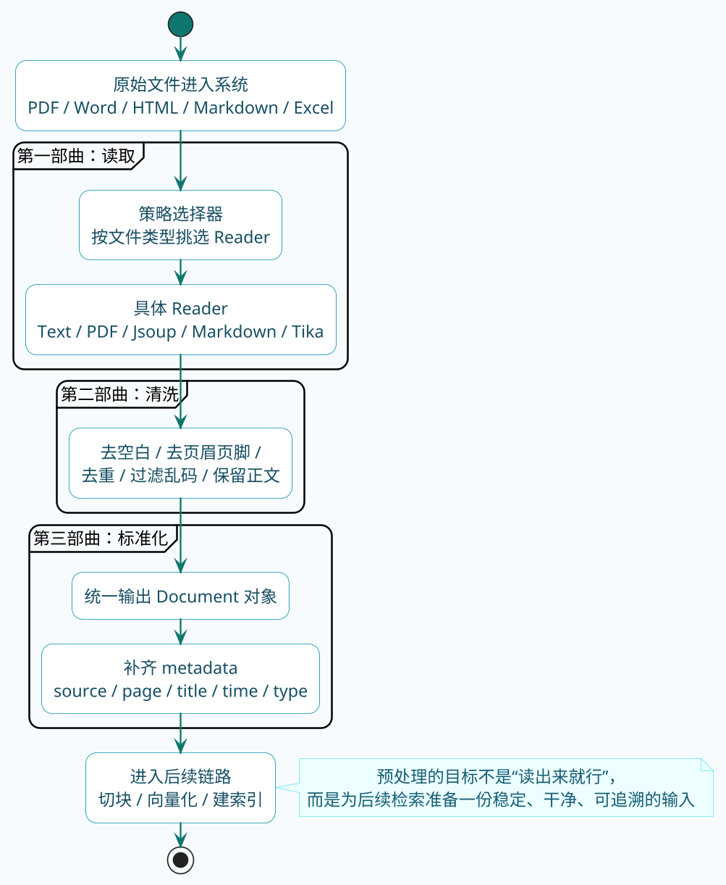

import VipInline from '@site/src/components/VipInline';

# 文档预处理读取清洗与标准化

下厨房做饭，第一步是什么？

不是开火，不是切菜，而是**洗菜**。

买回来的青菜上面有泥土、虫子、农药残留，不洗干净直接下锅，做出来的菜能好吃吗？

RAG也是一样的道理。

企业里的文档五花八门——PDF里混着图片和表格，Word里有批注和修订记录，网页上有广告和导航栏，Markdown里有各种格式标记。

这些"脏东西"不清理干净，后面的切块、向量化、检索全都会受影响。

**垃圾进，垃圾出**——这是RAG领域最经典的一句话。

:::info 核心原则
**垃圾进，垃圾出（Garbage In, Garbage Out）** 是RAG最重要的工程原则。文档预处理是整个RAG链路的地基，这一步做不好，后面的切块、向量化、检索再怎么优化也是在烂地基上盖楼。
:::

## 三部曲概览

文档预处理这个活儿，我把它给总结成了三部曲：

1. **读取**：把各种格式的文档加载进来
2. **清洗**：去掉无用的内容和干扰字符
3. **标准化**：统一成后续流程能处理的格式

听起来简单，实际做起来坑是不少的。下面来一个个讲。

<VipInline />
