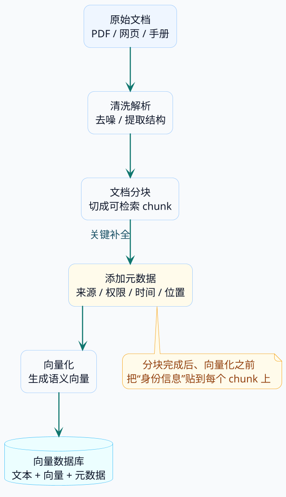
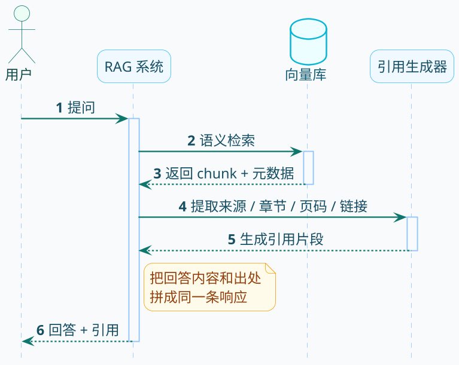
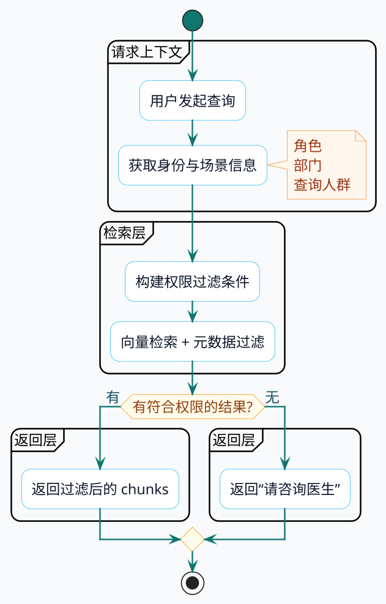
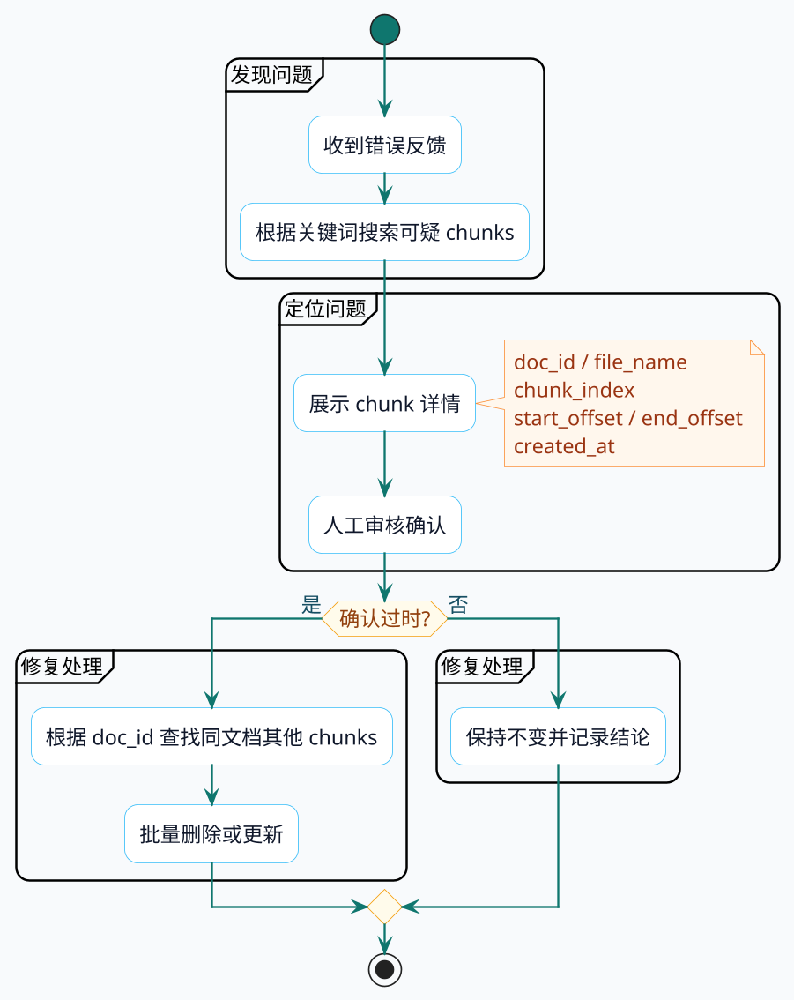

# 元数据的详细解析

上一篇聊了文档分块的各种姿势，把长文档切成小块之后，你会发现一个问题：每个块就剩一段光秃秃的文字，完全不知道它从哪来、该给谁看、出了问题怎么找。这就像把一本书撕成碎片，每片纸上虽然有字，但没人知道这是哪本书的第几页。

这篇就来聊聊怎么给这些文本块"上户口"——也就是元数据管理。

## 先看个翻车现场

### 场景：在线医疗问答平台

假设你在做一个医疗健康问答系统，知识库里存了各种医学资料：

- 内科的常见病诊疗指南、用药说明
- 外科的手术注意事项、术后护理
- 儿科的儿童用药剂量、疫苗接种时间表
- 药房的药品说明书、用药禁忌

系统上线后，用户可以直接问问题，AI 从知识库检索相关内容后生成回答。听起来挺美好，但真跑起来，问题一个接一个。

### 翻车一：用户要依据，系统憋不出来话了

张阿姨问："布洛芬一天最多能吃几次？"

系统回答："布洛芬每日不超过3次，每次间隔4-6小时。"

张阿姨追问："这是哪个说明书上写的？我想截图发给我老伴看。"

系统："……"

系统确实从知识库检索到了正确答案，但这个文本块只有内容，没记录它来自哪份药品说明书、第几页、什么时候更新的。系统知道答案，却说不出依据。

:::warning 这在医疗场景是大问题
涉及用药安全，没有出处的回答用户不敢信。万一出了问题，连追溯都没法追溯。
:::

### 翻车二：儿科信息被成人患者看到了

李先生问："阿莫西林的用量是多少？"

系统回答："体重20kg以下的儿童，每次125mg，每日3次……"

问题来了：李先生是成年人，他想知道的是成人剂量，系统却返回了儿科的用药方案。更糟糕的是，如果有些处方药信息本来只能给医生看，现在普通用户也能查到了。

系统在检索时没做任何区分，不管是成人指南还是儿童指南，不管是公开信息还是医生专用资料，只要语义相关就一股脑返回。

### 翻车三：发现错误信息，但找不到在哪

运营反馈："有用户说系统推荐的某个药物剂量偏高，可能是过时信息。"

技术团队想修正，但问题来了：知识库里几万个文本块，到底是哪个块有问题？这个块是从哪份文档切出来的？什么时候入库的？

如果每个块都没记录来源和位置，要定位问题就像在垃圾堆里找一颗芝麻。

---

三个翻车场景，指向同一个问题：**光有文本内容是不够的**。每个文本块还需要一堆"身份信息"，告诉系统这段话从哪来、给谁看、怎么追溯。

这些身份信息，就是**元数据（Metadata）**。

## 元数据这玩意到底是啥

### 快递包裹的类比

各位小伙伴肯定是都网购过的，收到快递时，包裹上除了你买的东西，还贴着一张面单：

- 寄件人是谁
- 收件人是谁
- 从哪个仓库发的
- 什么时候发的
- 易碎还是普通件

包裹里的东西是"内容"，面单上的信息就是"元数据"。快递小哥不需要拆开包裹看里面是什么，只看面单就知道该送到哪、要不要轻拿轻放。

RAG 系统里的元数据也是这个意思。文本块是内容，元数据是贴在上面的标签，告诉系统这个块的各种属性。

### 一个完整的文本块长什么样

没有元数据时，一个 chunk 就是一段裸文本：

```
"布洛芬为非甾体抗炎药，每日用量不超过1200mg，分3-4次服用，餐后服用可减少胃肠道刺激。"
```

加上元数据后，它变成了这样：

```json
{
  "content": "布洛芬为非甾体抗炎药，每日用量不超过1200mg，分3-4次服用，餐后服用可减少胃肠道刺激。",
  "metadata": {
    "doc_id": "drug_ibuprofen_001",
    "source_url": "https://med.example.com/drugs/ibuprofen.pdf",
    "file_name": "布洛芬说明书.pdf",
    "section_title": "用法用量",
    "page_number": 2,
    "created_at": "2024-03-15T10:30:00Z",
    "updated_at": "2024-06-20T14:00:00Z",
    "department": "pharmacy",
    "access_level": "public",
    "applicable_group": "adult",
    "chunk_index": 3,
    "start_offset": 156,
    "end_offset": 230
  }
}
```

内容还是那段话，但现在它带着一堆标签：来自哪份文档、在第几页、属于哪个科室、谁能看、适用人群是成人还是儿童、在原文的什么位置……

:::info 元数据不参与语义检索
这些标签不会被向量化，不影响语义匹配。它们的作用是在检索前后的各个环节发挥作用：过滤、排序、引用生成、问题追溯。
:::

### 元数据在 RAG 流程中的位置



元数据是在分块之后、向量化之前加进去的。分块完成后得到的是纯文本块，这时候给每个块打上标签，然后连同文本内容一起送进向量数据库存储。

## 六类元数据字段详解

元数据字段很多，但按用途可以分成六大类。不是所有字段都要加，得看你的业务场景需要什么。

### 第一类：身份证件——文档标识

这是最基础的元数据，回答"这个块从哪来"的问题。

| 字段 | 作用 | 示例 |
|:---|:---|:---|
| `doc_id` | 文档唯一标识，内部管理用 | `drug_ibuprofen_001` |
| `file_name` | 原始文件名，给人看的 | `布洛芬说明书.pdf` |
| `source_url` | 文档的访问地址 | `https://med.example.com/drugs/ibuprofen.pdf` |

**什么时候必须有**：几乎所有场景。这是最基础的元数据，没有它就没法做引用生成和批量管理。

**实际用处**：

- 用户追问"这个信息在哪"，可以返回文档链接
- 某份文档更新了，根据 `doc_id` 批量删除旧版本的所有块
- 出了问题可以快速定位到源文档

**代码示例**（Spring AI）：

```java
public class DrugDocumentBuilder {

    /**
     * 创建带身份信息的药品文本块
     */
    public static Document createDrugChunk(String content, String drugId, 
                                            String drugName, String sourceUrl) {
        Map<String, Object> metadata = new HashMap<>();
        metadata.put("doc_id", "drug_" + drugId);
        metadata.put("file_name", drugName + "说明书.pdf");
        metadata.put("source_url", sourceUrl);
        
        return new Document(content, metadata);
    }

    public static void main(String[] args) {
        String content = "布洛芬为非甾体抗炎药，具有解热、镇痛、抗炎作用。";
        
        Document chunk = createDrugChunk(
            content,
            "ibuprofen_001",
            "布洛芬",
            "https://med.example.com/drugs/ibuprofen.pdf"
        );
        
        System.out.println("内容: " + chunk.getText());
        System.out.println("文档ID: " + chunk.getMetadata().get("doc_id"));
        System.out.println("来源: " + chunk.getMetadata().get("source_url"));
    }
}
```

### 第二类：目录索引——结构信息

很多文档是有层级结构的：一级标题、二级标题、章节编号。记录这些信息，可以让引用更精确。

| 字段 | 作用 | 示例 |
|:---|:---|:---|
| `h1_title` | 一级标题 | `第三章 用法用量` |
| `h2_title` | 二级标题 | `3.1 成人用量` |
| `section_path` | 完整的标题路径 | `用法用量 > 成人用量` |
| `page_number` | 页码 | `5` |

**什么时候必须有**：文档有明确的章节结构，且用户关心"这个信息在文档的哪个部分"。

**什么时候可以省略**：文档本身没结构（聊天记录、日志文件），或者文档很短不需要章节导航。

**代码示例**：

```java
public static Document createChunkWithStructure(String content, 
                                                 String h1Title, 
                                                 String h2Title, 
                                                 int pageNumber) {
    Map<String, Object> metadata = new HashMap<>();
    metadata.put("h1_title", h1Title);
    metadata.put("h2_title", h2Title);
    metadata.put("page_number", pageNumber);
    
    // 拼接完整路径，方便展示
    String sectionPath = h1Title + " > " + h2Title;
    metadata.put("section_path", sectionPath);
    
    return new Document(content, metadata);
}

// 使用示例
Document chunk = createChunkWithStructure(
    "成人常规剂量：每次400mg，每日3次，餐后服用。",
    "第三章 用法用量",
    "3.1 成人用量",
    5
);
```

生成引用时就可以展示："依据：《布洛芬说明书》第三章 用法用量 > 3.1 成人用量，第5页"。比只说"来源：布洛芬说明书"清晰多了。

### 第三类：时间戳——版本信息

医学知识是会更新的，去年的诊疗指南和今年的可能不一样。不记录时间信息，系统可能把过时内容返回给用户。

| 字段 | 作用 | 示例 |
|:---|:---|:---|
| `created_at` | 入库时间 | `2024-03-15T10:30:00Z` |
| `updated_at` | 最后更新时间 | `2024-06-20T14:00:00Z` |
| `effective_date` | 生效日期 | `2024-01-01` |
| `expiration_date` | 失效日期 | `2025-12-31` |

前两个是系统自动生成的，后两个通常需要从文档内容中提取或手动标注。

**典型应用**：用户问"现在的疫苗接种时间表是什么"，系统检索时过滤掉 `expiration_date` 早于当前日期的块，只返回当前有效的指南。

```java
public static Document createChunkWithTimeInfo(String content,
                                                LocalDateTime effectiveDate,
                                                LocalDateTime expirationDate) {
    Map<String, Object> metadata = new HashMap<>();
    
    DateTimeFormatter formatter = DateTimeFormatter.ISO_LOCAL_DATE_TIME;
    metadata.put("created_at", LocalDateTime.now().format(formatter));
    
    if (effectiveDate != null) {
        metadata.put("effective_date", effectiveDate.format(formatter));
    }
    if (expirationDate != null) {
        metadata.put("expiration_date", expirationDate.format(formatter));
    }
    
    return new Document(content, metadata);
}

// 使用示例：2024年版诊疗指南，有效期到2025年底
Document chunk = createChunkWithTimeInfo(
    "新生儿乙肝疫苗接种时间：出生后24小时内完成第一针...",
    LocalDateTime.of(2024, 1, 1, 0, 0),
    LocalDateTime.of(2025, 12, 31, 23, 59)
);
```

:::tip 时间格式建议
用 ISO 8601 格式（`2024-03-15T10:30:00Z`），这是国际标准，各种编程语言和数据库都能正确解析。
:::

### 第四类：门禁卡——权限控制

这是企业级应用最重要的元数据类型。不同角色能看的内容不一样，必须在检索层面做好过滤。

| 字段 | 作用 | 示例 |
|:---|:---|:---|
| `access_level` | 敏感级别 | `public` / `internal` / `confidential` |
| `access_roles` | 允许的角色 | `["doctor", "pharmacist"]` |
| `access_departments` | 允许的部门 | `["internal_medicine", "pharmacy"]` |
| `applicable_group` | 适用人群 | `adult` / `child` / `pregnant` |

**权限控制的几种粒度**：

- **基于敏感级别**：`public`（公开）、`internal`（内部）、`confidential`（机密）
- **基于角色**：只有医生、药剂师能看
- **基于部门**：只有内科、药房能看
- **基于适用人群**：成人信息、儿童信息、孕妇信息

实际项目中通常组合使用。比如一个块标记为 `access_level: "internal"` + `access_roles: ["doctor"]`，意思是"这是内部信息，只有医生能看"。

```java
public static Document createChunkWithACL(String content,
                                           String accessLevel,
                                           List<String> accessRoles,
                                           String applicableGroup) {
    Map<String, Object> metadata = new HashMap<>();
    metadata.put("access_level", accessLevel);
    metadata.put("access_roles", accessRoles);
    metadata.put("applicable_group", applicableGroup);
    
    return new Document(content, metadata);
}

// 示例：这是医生专用的处方药信息
Document prescriptionChunk = createChunkWithACL(
    "该药物为处方药，需在医生指导下使用。成人每日最大剂量...",
    "internal",
    Arrays.asList("doctor", "pharmacist"),
    "adult"
);

// 示例：这是公开的儿童用药信息
Document publicChildChunk = createChunkWithACL(
    "6岁以下儿童用药需特别注意剂量...",
    "public",
    Arrays.asList("patient", "doctor", "pharmacist"),
    "child"
);
```

### 第五类：GPS定位——位置追溯

当发现某个块的内容有问题，需要回到原文修正时，位置信息就派上用场了。

| 字段 | 作用 | 示例 |
|:---|:---|:---|
| `start_offset` | 在原文中的起始字符位置 | `156` |
| `end_offset` | 在原文中的结束字符位置 | `230` |
| `chunk_index` | 在所有块中的序号 | `3` |
| `total_chunks` | 该文档总共切了多少块 | `15` |

有了这些信息，可以：

- 快速定位到原文的具体位置，方便人工审核
- 展示答案时高亮原文中的相关段落
- 分析相邻块的关系（检索到 chunk 5，顺便看看 chunk 4 和 chunk 6）

```java
/**
 * 分块时自动记录位置信息
 */
public static List<Document> chunkWithPosition(String fullText, int chunkSize, int overlap) {
    List<Document> chunks = new ArrayList<>();
    int step = chunkSize - overlap;
    int start = 0;
    int chunkIndex = 0;
    int totalChunks = (int) Math.ceil((double) fullText.length() / step);

    while (start < fullText.length()) {
        int end = Math.min(start + chunkSize, fullText.length());
        String chunkContent = fullText.substring(start, end);

        Map<String, Object> metadata = new HashMap<>();
        metadata.put("start_offset", start);
        metadata.put("end_offset", end);
        metadata.put("chunk_index", chunkIndex);
        metadata.put("total_chunks", totalChunks);

        chunks.add(new Document(chunkContent, metadata));

        start += step;
        chunkIndex++;
    }

    return chunks;
}
```

### 第六类：业务名片——自定义标签

前面五类是通用的，但每个业务场景还有自己特殊的需求。

**医疗场景的自定义标签**：

```java
Map<String, Object> metadata = new HashMap<>();
metadata.put("drug_category", "nsaid");           // 药品分类：非甾体抗炎药
metadata.put("indication", "fever_pain");          // 适应症：发热疼痛
metadata.put("contraindication", true);            // 是否包含禁忌症信息
metadata.put("interaction_warning", true);         // 是否包含药物相互作用警告
metadata.put("priority", 1);                       // 优先级：1最高
```

**电商场景的自定义标签**：

```java
metadata.put("product_category", "electronics");   // 商品类目
metadata.put("policy_type", "return");             // 政策类型：退货
metadata.put("region", "mainland_china");          // 适用地区
```

**自定义元数据的设计原则**：

- 只加对检索、过滤、排序有帮助的字段
- 字段名要有业务含义，别用 `field1`、`field2`
- 不是所有块都需要所有字段，可以设为可选

---

下面看看这些元数据在实际场景中怎么发挥作用。

## 三个杀手级应用场景

元数据不是摆设的作用，它在 RAG 系统中有三个核心用途：让回答有据可查、让信息分级可控、让错误可追可改。

### 场景一：让回答有据可查

用户问：“布洛芬和头孢菌素能一起吃吗？”

系统回答：“布洛芬和头孢菌素一般情况下可以同时使用……”

用户追问：“这个结论哪里查的？”

如果文本块记录了来源和章节信息，系统就能这样回答：

> 布洛芬和头孢菌素一般情况下可以同时使用。
>
> **依据**：《药物相互作用手册》第四章“抗生素与解热镇痛药” > 4.2节，第38页
>
> [查看原文](https://med.example.com/interaction/antibiotics.pdf#page=38)

这就是引用生成。用户不仅得到了答案，还知道答案的出处，可以点击链接看完整原文。

**实现流程**：



**代码实现**：

```java
public class CitationGenerator {

    /**
     * 从 chunk 元数据生成引用信息
     */
    public static String generateCitation(Document chunk) {
        Map<String, Object> meta = chunk.getMetadata();
        
        StringBuilder citation = new StringBuilder();
        citation.append("**依据**: ");
        
        // 文档名
        String fileName = (String) meta.get("file_name");
        if (fileName != null) {
            citation.append("《").append(fileName.replace(".pdf", "")).append("》");
        }
        
        // 章节路径
        String sectionPath = (String) meta.get("section_path");
        if (sectionPath != null) {
            citation.append(" ").append(sectionPath);
        }
        
        // 页码
        Object pageNumber = meta.get("page_number");
        if (pageNumber instanceof Number number) {
            citation.append("，第").append(number.intValue()).append("页");
        }
        
        // 原文链接
        String sourceUrl = (String) meta.get("source_url");
        if (sourceUrl != null) {
            citation.append("\n\n[查看原文](").append(sourceUrl).append(")");
        }
        
        return citation.toString();
    }

    public static void main(String[] args) {
        // 模拟检索到的 chunk
        Map<String, Object> metadata = Map.of(
            "file_name", "药物相互作用手册.pdf",
            "section_path", "第四章 抗生素与解热镇痛药 > 4.2节",
            "page_number", 38,
            "source_url", "https://med.example.com/interaction/antibiotics.pdf#page=38"
        );
        
        Document chunk = new Document(
            "布洛芬与头孢菌素类抗生素无明显相互作用，一般情况下可同时使用...",
            metadata
        );
        
        String answer = chunk.getText();
        String citation = generateCitation(chunk);
        
        System.out.println("回答: " + answer);
        System.out.println();
        System.out.println(citation);
    }
}
```

**输出结果**：

```
回答: 布洛芬与头孢菌素类抗生素无明显相互作用，一般情况下可同时使用...

**依据**: 《药物相互作用手册》 第四章 抗生素与解热镇痛药 > 4.2节，第38页

[查看原文](https://med.example.com/interaction/antibiotics.pdf#page=38)
```

:::info 引用生成的价值
- **增强可信度**：用户知道答案有文档依据，不是 AI 编的
- **方便核查**：可以点击链接查看完整原文
- **减少纠纷**：在匹及用药安全的场景，有明确引用可避免争议
:::

### 场景二：让信息分级可控

医疗平台的知识库里有各种内容：

- 公开的健康科普（所有人都能看）
- 内部的诊疗指南（只有医生能看）
- 处方药详细信息（只有医生和药剂师能看）
- 儿童用药指南（查询儿童信息时返回）

普通患者问“某处方药的具体成分”，系统不应该返回医生专用的详细处方信息，而应该返回公开的药品说明或提示“请咨询医生”。

**实现流程**：



**代码实现**：

```java
import org.springframework.ai.document.Document;
import java.util.*;
import java.util.stream.Collectors;

public class PermissionFilter {

    /**
     * 模拟知识库中的文本块
     */
    private static List<Document> mockMedicalChunks() {
        List<Document> chunks = new ArrayList<>();

        // 块一：公开的健康科普
        chunks.add(new Document(
            "感冒是由病毒引起的上呼吸道感染，一般5-7天可自愈...",
            Map.of(
                "access_level", "public",
                "access_roles", Arrays.asList("patient", "doctor", "pharmacist"),
                "applicable_group", "all"
            )
        ));

        // 块二：医生专用的诊疗指南
        chunks.add(new Document(
            "抗生素应根据药敏试验结果选择，首选青霉素类...",
            Map.of(
                "access_level", "internal",
                "access_roles", Arrays.asList("doctor"),
                "applicable_group", "all"
            )
        ));

        // 块三：儿童用药指南
        chunks.add(new Document(
            "6岁以下儿童使用布洛芬，剧量按体重计算，每次5-10mg/kg...",
            Map.of(
                "access_level", "public",
                "access_roles", Arrays.asList("patient", "doctor", "pharmacist"),
                "applicable_group", "child"
            )
        ));

        // 块四：成人用药指南
        chunks.add(new Document(
            "成人布洛芬常规剧量：每次400mg，每日3次...",
            Map.of(
                "access_level", "public",
                "access_roles", Arrays.asList("patient", "doctor", "pharmacist"),
                "applicable_group", "adult"
            )
        ));

        return chunks;
    }

    /**
     * 根据用户身份过滤文本块
     */
    public static List<Document> filterByPermission(
            List<Document> chunks,
            String userRole,
            String queryGroup) {
        
        return chunks.stream()
            .filter(chunk -> hasPermission(chunk, userRole, queryGroup))
            .collect(Collectors.toList());
    }

    private static boolean hasPermission(Document chunk, String userRole, String queryGroup) {
        Map<String, Object> meta = chunk.getMetadata();
        
        // 检查角色权限
        @SuppressWarnings("unchecked")
        List<String> accessRoles = (List<String>) meta.get("access_roles");
        if (accessRoles == null || !accessRoles.contains(userRole)) {
            return false;
        }
        
        // 检查适用人群
        String applicableGroup = (String) meta.get("applicable_group");
        if (!"all".equals(applicableGroup) && !applicableGroup.equals(queryGroup)) {
            return false;
        }
        
        return true;
    }

    private static String previewText(Document chunk, int maxLength) {
        String content = chunk.getContent();
        if (content == null || content.length() <= maxLength) {
            return content;
        }
        return content.substring(0, maxLength).replaceAll("\\.+$", "") + "...";
    }

    public static void main(String[] args) {
        List<Document> allChunks = mockMedicalChunks();

        // 场景1：普通患者查询成人用药信息
        System.out.println("=== 患者查询成人用药信息 ===");
        List<Document> patientAdultResults = filterByPermission(allChunks, "patient", "adult");
        patientAdultResults.forEach(chunk -> 
            System.out.println("- " + previewText(chunk, 31))
        );
        
        System.out.println();

        // 场景2：医生查询儿童用药信息
        System.out.println("=== 医生查询儿童用药信息 ===");
        List<Document> doctorChildResults = filterByPermission(allChunks, "doctor", "child");
        doctorChildResults.forEach(chunk -> 
            System.out.println("- " + previewText(chunk, 31))
        );
    }
}
```

**输出结果**：

```
=== 患者查询成人用药信息 ===
- 感冒是由病毒引起的上呼吸道感染，一般5-7天可自愈...
- 成人布洛芬常规剧量：每次400mg，每日3次...

=== 医生查询儿童用药信息 ===
- 感冒是由病毒引起的上呼吸道感染，一般5-7天可自愈...
- 抗生素应根据药敏试验结果选择，首选青霉素类...
- 6岁以下儿童使用布洛芬，剧量按体重计算，每次5-10mg/kg...
```

可以看到：患者查询成人信息时，看不到医生专用的诊疗指南，也看不到儿童用药信息；医生查询儿童信息时，能看到所有相关内容。

:::warning 权限过滤要在检索层做
千万不要在展示层过滤，那样敏感信息已经被加载到内存了。要在向量数据库查询时就加上过滤条件。
:::

### 场景三：让错误可追可改

运营反馈：“有用户说系统告诉他某个药的剧量，但这个剧量数据是旧版说明书的，新版已经调整了。”

技术团队需要：

1. 找到返回错误信息的那个 chunk
2. 定位到原始文档的具体位置
3. 修正或删除这个 chunk
4. 检查是否还有其他过时的 chunk 需要一起更新

**实现流程**：



**代码实现**：

```java
public class ChunkTracker {

    /**
     * 根据关键词查找可疑 chunks
     */
    public static List<Document> findSuspiciousChunks(List<Document> allChunks, String keyword) {
        return allChunks.stream()
            .filter(chunk -> chunk.getText().contains(keyword))
            .collect(Collectors.toList());
    }

    /**
     * 展示 chunk 详情，方便人工审核
     */
    public static void displayChunkDetails(Document chunk) {
        Map<String, Object> meta = chunk.getMetadata();
        
        System.out.println("========== Chunk 详情 ==========");
        System.out.println("内容: " + chunk.getText());
        System.out.println("文档ID: " + meta.get("doc_id"));
        System.out.println("文件名: " + meta.get("file_name"));
        System.out.println("Chunk序号: " + meta.get("chunk_index"));
        System.out.println("原文位置: " + meta.get("start_offset") + " - " + meta.get("end_offset"));
        System.out.println("入库时间: " + meta.get("created_at"));
        System.out.println("来源链接: " + meta.get("source_url"));
        System.out.println();
    }

    /**
     * 根据 doc_id 批量查找同文档的所有 chunks
     */
    public static List<Document> findChunksByDocId(List<Document> allChunks, String docId) {
        return allChunks.stream()
            .filter(chunk -> docId.equals(chunk.getMetadata().get("doc_id")))
            .collect(Collectors.toList());
    }

    public static void main(String[] args) {
        // 模拟知识库
        List<Document> allChunks = Arrays.asList(
            new Document(
                "布洛芬每日最大剧量1600mg（旧版）...",
                Map.of(
                    "doc_id", "drug_ibuprofen_v1",
                    "file_name", "布洛芬说明书_旧版.pdf",
                    "chunk_index", 2,
                    "start_offset", 120,
                    "end_offset", 180,
                    "created_at", "2023-06-01T10:00:00Z",
                    "source_url", "https://med.example.com/drugs/ibuprofen_v1.pdf"
                )
            ),
            new Document(
                "布洛芬每日最大剧量1200mg（新版）...",
                Map.of(
                    "doc_id", "drug_ibuprofen_v2",
                    "file_name", "布洛芬说明书_新版.pdf",
                    "chunk_index", 2,
                    "start_offset", 150,
                    "end_offset", 210,
                    "created_at", "2024-03-15T14:00:00Z",
                    "source_url", "https://med.example.com/drugs/ibuprofen_v2.pdf"
                )
            )
        );

        // 步骤1：根据关键词查找可疑 chunks
        System.out.println(">>> 用户反馈：布洛芬剧量信息可能过时\n");
        List<Document> suspicious = findSuspiciousChunks(allChunks, "布洛芬");
        System.out.println("找到 " + suspicious.size() + " 个相关 chunks:\n");

        // 步骤2：展示详情
        suspicious.forEach(ChunkTracker::displayChunkDetails);

        // 步骤3：确认旧版需要删除
        System.out.println(">>> 确认 doc_id=drug_ibuprofen_v1 的内容已过时");
        System.out.println(">>> 执行删除操作...");
        System.out.println(">>> 删除完成，共删除 1 个 chunk");
    }
}
```

有了元数据，纠错过程变得很清晰：

- 通过关键词快速定位可疑 chunk
- 通过 `created_at` 判断哪个是旧版
- 通过 `doc_id` 批量处理同文档的所有 chunk
- 通过 `source_url` 回到原文确认

## 踩过的坑和总结的经验

### 元数据不是越多越好

新手常犯的错误：给每个 chunk 加一堆元数据字段，恨不得把能想到的信息都塞进去。

**问题在于**：

- **存储成本**：元数据也要占存储空间
- **维护成本**：字段越多，维护越麻烦
- **检索性能**：某些向量数据库字段越多过滤越慢

**实用原则**：问自己三个问题后再决定加不加：

1. 这个字段会用于检索过滤吗？
2. 这个字段会展示给用户吗？
3. 这个字段会用于运维管理吗？

如果三个问题的答案都是不会，那这个字段就不要加。

### 分层标注降低维护成本

如果知识库有几千份文档，每份文档都要人工标注十几个字段，这个工作量肯定是不现实的。

折中方案：**分层标注**。

| 层级 | 标注方式 | 字段示例 |
|:---|:---|:---|
| 文档级 | 上传时标注，自动继承给所有 chunk | `access_level`、`department`、`doc_type` |
| Chunk级 | 系统自动生成 | `chunk_index`、`start_offset`、`created_at` |
| 按需标注 | 只对重要文档精细化标注 | `effective_date`、`priority` |

### 不同场景的元数据配置建议

**场景一：面向公众的帮助文档**

不需要权限控制，不需要部门标签，只需要基础的来源和引用信息。

```java
Map<String, Object> metadata = Map.of(
    "doc_id", "...",
    "file_name", "...",
    "section_path", "...",
    "source_url", "..."
);
```

**场景二：企业内部知识库**

需要权限控制、版本管理、位置追溯。

```java
Map<String, Object> metadata = Map.of(
    "doc_id", "...",
    "file_name", "...",
    "section_path", "...",
    "source_url", "...",
    "access_level", "internal",
    "access_departments", Arrays.asList("tech", "product"),
    "created_at", "...",
    "updated_at", "...",
    "chunk_index", 0,
    "start_offset", 0,
    "end_offset", 100
);
```

**场景三：医疗/电商等专业领域**

需要业务自定义标签，可能还需要时效性控制。

```java
Map<String, Object> metadata = Map.of(
    "doc_id", "...",
    "file_name", "...",
    "section_path", "...",
    "source_url", "...",
    "access_level", "...",
    "access_roles", Arrays.asList("doctor", "pharmacist"),
    "applicable_group", "adult",
    "drug_category", "nsaid",
    "effective_date", "2024-01-01",
    "expiration_date", "2025-12-31",
    "chunk_index", 0,
    "start_offset", 0,
    "end_offset", 100
);
```

### 元数据字段参考表

| 字段 | 用途 | 维护成本 | 优先级 |
|:---|:---|:---|:---|
| `doc_id` | 文档标识，批量管理 | 低（系统生成） | **必须** |
| `file_name` | 展示给用户，生成引用 | 低（系统生成） | **必须** |
| `source_url` | 提供原文链接 | 低（系统生成） | 推荐 |
| `section_path` | 生成引用，展示章节信息 | 中（需要解析） | 推荐 |
| `page_number` | 生成引用，定位原文 | 中（需要解析） | 推荐 |
| `created_at` | 版本管理，追踪变更 | 低（系统生成） | 推荐 |
| `access_level` | 权限过滤 | 中（文档级标注） | 按需 |
| `access_roles` | 权限过滤 | 高（需人工标注） | 按需 |
| `effective_date` | 过滤过时内容 | 高（需人工标注） | 按需 |
| `chunk_index` | 定位 chunk，分析相邻块 | 低（系统生成） | 推荐 |
| `start_offset` | 定位原文，纠错 | 低（系统生成） | 推荐 |
| 业务自定义字段 | 业务过滤和排序 | 中到高 | 按需 |

## 写在最后

元数据是 RAG 系统从”能用”到”好用”的关键。只有文本内容的 chunk 只能做基础的语义检索，加上元数据之后，系统才能做权限过滤、生成引用、快速纠错。

三类元数据最重要：

- **身份证件**（`doc_id`、`source_url`、`file_name`）：知道 chunk 从哪来
- **门禁卡**（`access_level`、`access_roles`）：不同用户看不同内容
- **GPS定位**（`chunk_index`、`start_offset`）：出了问题能快速定位

其他元数据根据实际场景选择性添加。记住一个原则：**元数据不是越多越好，只加对检索、过滤、展示有实际帮助的字段**。

元数据设计完成后，每个 chunk 就从”一段文本”变成了”一段带标签的文本”。但这些文本还是人类能读懂的自然语言，计算机要做相似度检索，需要把它们转成数字表示——这就是下一篇要讲的向量化（Embedding）。
