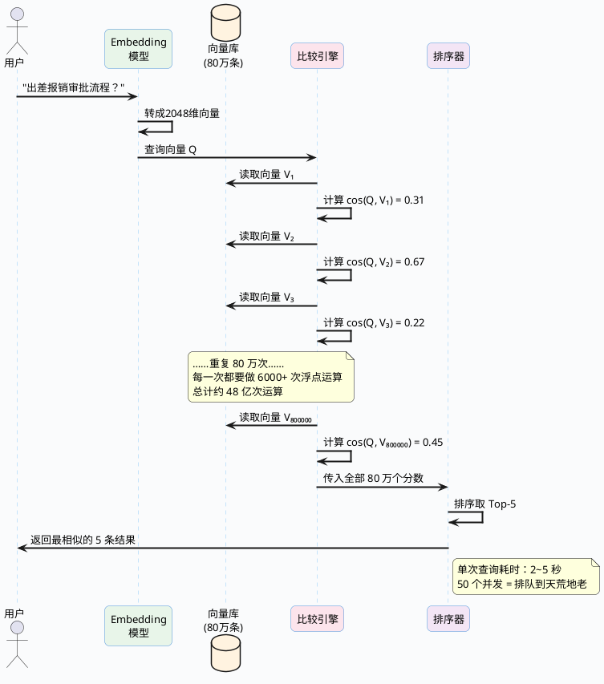

import VipInline from '@site/src/components/VipInline';

# 向量检索核心算法深度剖析

前面我们已经把文档块变成了向量，也知道了要把这些向量存到专门的数据库里。但有一个最关键的问题还没解决——

当用户丢过来一个问题，系统怎么在几十万甚至上百万个向量里，又快又准地挑出最相关的那几条？

最直觉的做法当然是全部比一遍，谁最像就选谁。这种方法简单粗暴，数据少的时候完全没问题。但数据量一上去，它就成了整个 RAG 系统最大的性能瓶颈。

这篇文章就来把这个问题彻底说清楚：暴力搜索到底卡在哪、有什么更聪明的做法、目前工业界最主流的两种算法（IVF 和 HNSW）分别怎么工作、以及它们各自适合什么场景。

## 全量遍历为什么扛不住

### 从一个真实的计算开始

我们拿一个中等规模的 RAG 系统来算笔账。

假设你给公司做了一个内部知识库，里面有各种规章制度、技术文档、会议纪要等，切块之后总共产生了 80 万个文档片段。每个片段经过 Embedding 模型后变成了一个 2048 维的向量（比如用的 BGE-M3 模型）。

用户在搜索框输入了一个问题："出差报销的审批流程是什么？"

系统需要做的事情是这样的：

```
步骤1：把用户的问题也过一遍 Embedding 模型，得到一个 2048 维的查询向量
步骤2：把这个查询向量和知识库里 80 万个向量逐一计算余弦相似度
步骤3：按照相似度从高到低排序
步骤4：取前 5 个最相似的，把对应的原文丢给大模型
```

步骤 2 是性能杀手。来看看具体要做多少运算：

**单次余弦相似度计算的运算量：**

余弦相似度公式是 cos(θ) = (A·B) / (|A| × |B|)。对于 2048 维的两个向量，这一次计算需要：
- 点积运算：2048 次乘法 + 2047 次加法
- 两个向量的模长计算：各需要 2048 次乘法 + 2047 次加法 + 1 次开方
- 最后一次除法

粗略算下来，一次相似度计算大约需要 **6000+ 次浮点运算**。

**80 万条数据的总运算量：**

800,000 × 6,000 = **48 亿次浮点运算**

现代 CPU 单核的浮点计算能力大约是每秒 10~20 亿次（GFLOPS），那么单核处理一次查询就需要 **2.4 - 4.8 秒**。

:::caution 这个延迟在实际系统中是不可接受的
2~5 秒只是纯计算时间，实际还要加上这些开销：
- **磁盘 I/O**：80 万个 2048 维的 float32 向量，总体积约 6.1 GB。每次查询都要把这些数据从磁盘读到内存，光 I/O 就可能要好几秒
- **并发放大**：如果同时有 50 个用户在提问呢？排队等待的时间会让体验直接崩溃
- **链路叠加**：别忘了 RAG 的完整链路还有问题改写、向量化、大模型推理等步骤，检索环节只是其中之一。如果检索就吃掉 3 秒，整体响应时间可能超过 10 秒
- **数据增长**：知识库不是一成不变的，半年后可能变成 200 万条，一年后 500 万条
:::

用一张图来直观感受暴力搜索在做什么：



### 问题不只是"慢"这么简单

暴力搜索的问题可以从三个维度来看：

**第一，计算瓶颈。** 这个前面算过了。80 万数据查一次要几秒，500 万数据可能要十几秒，完全不能用。

**第二，内存瓶颈。** 想快一点的话，可以把所有向量都预加载到内存。80 万个 2048 维 float32 向量，占用内存 = 800,000 × 2048 × 4 字节 ≈ **6.1 GB**。看似还行？但如果是 500 万条就是 38 GB，1000 万条就是 76 GB。而且这只是原始向量的大小，还没算数据库本身的索引结构、元数据等开销。

**第三，扩展性瓶颈。** 暴力搜索的时间复杂度是 O(n)——数据翻一倍，查询时间也翻一倍。这意味着系统没有任何"弹性"，数据增长会直接拖垮查询性能。

所以结论很清楚：数据量在几万条以内的 demo 场景，暴力搜索够用了；一旦进入真实业务场景，必须换更聪明的方法。

<VipInline />
