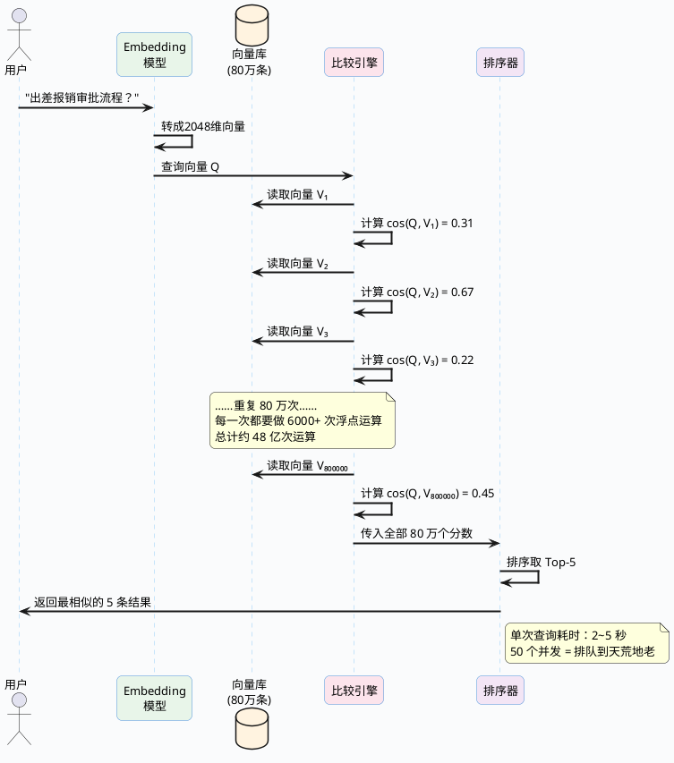

# 向量检索核心算法深度剖析

前面我们已经把文档块变成了向量，也知道了要把这些向量存到专门的数据库里。但有一个最关键的问题还没解决——

当用户丢过来一个问题，系统怎么在几十万甚至上百万个向量里，又快又准地挑出最相关的那几条？

最直觉的做法当然是全部比一遍，谁最像就选谁。这种方法简单粗暴，数据少的时候完全没问题。但数据量一上去，它就成了整个 RAG 系统最大的性能瓶颈。

这篇文章就来把这个问题彻底说清楚：暴力搜索到底卡在哪、有什么更聪明的做法、目前工业界最主流的两种算法（IVF 和 HNSW）分别怎么工作、以及它们各自适合什么场景。

## 全量遍历为什么扛不住

### 从一个真实的计算开始

我们拿一个中等规模的 RAG 系统来算笔账。

假设你给公司做了一个内部知识库，里面有各种规章制度、技术文档、会议纪要等，切块之后总共产生了 80 万个文档片段。每个片段经过 Embedding 模型后变成了一个 2048 维的向量（比如用的 BGE-M3 模型）。

用户在搜索框输入了一个问题："出差报销的审批流程是什么？"

系统需要做的事情是这样的：

```
步骤1：把用户的问题也过一遍 Embedding 模型，得到一个 2048 维的查询向量
步骤2：把这个查询向量和知识库里 80 万个向量逐一计算余弦相似度
步骤3：按照相似度从高到低排序
步骤4：取前 5 个最相似的，把对应的原文丢给大模型
```

步骤 2 是性能杀手。来看看具体要做多少运算：

**单次余弦相似度计算的运算量：**

余弦相似度公式是 cos(θ) = (A·B) / (|A| × |B|)。对于 2048 维的两个向量，这一次计算需要：
- 点积运算：2048 次乘法 + 2047 次加法
- 两个向量的模长计算：各需要 2048 次乘法 + 2047 次加法 + 1 次开方
- 最后一次除法

粗略算下来，一次相似度计算大约需要 **6000+ 次浮点运算**。

**80 万条数据的总运算量：**

800,000 × 6,000 = **48 亿次浮点运算**

现代 CPU 单核的浮点计算能力大约是每秒 10~20 亿次（GFLOPS），那么单核处理一次查询就需要 **2.4 - 4.8 秒**。

:::caution 这个延迟在实际系统中是不可接受的
2~5 秒只是纯计算时间，实际还要加上这些开销：
- **磁盘 I/O**：80 万个 2048 维的 float32 向量，总体积约 6.1 GB。每次查询都要把这些数据从磁盘读到内存，光 I/O 就可能要好几秒
- **并发放大**：如果同时有 50 个用户在提问呢？排队等待的时间会让体验直接崩溃
- **链路叠加**：别忘了 RAG 的完整链路还有问题改写、向量化、大模型推理等步骤，检索环节只是其中之一。如果检索就吃掉 3 秒，整体响应时间可能超过 10 秒
- **数据增长**：知识库不是一成不变的，半年后可能变成 200 万条，一年后 500 万条
:::

用一张图来直观感受暴力搜索在做什么：



### 问题不只是"慢"这么简单

暴力搜索的问题可以从三个维度来看：

**第一，计算瓶颈。** 这个前面算过了。80 万数据查一次要几秒，500 万数据可能要十几秒，完全不能用。

**第二，内存瓶颈。** 想快一点的话，可以把所有向量都预加载到内存。80 万个 2048 维 float32 向量，占用内存 = 800,000 × 2048 × 4 字节 ≈ **6.1 GB**。看似还行？但如果是 500 万条就是 38 GB，1000 万条就是 76 GB。而且这只是原始向量的大小，还没算数据库本身的索引结构、元数据等开销。

**第三，扩展性瓶颈。** 暴力搜索的时间复杂度是 O(n)——数据翻一倍，查询时间也翻一倍。这意味着系统没有任何"弹性"，数据增长会直接拖垮查询性能。

所以结论很清楚：数据量在几万条以内的 demo 场景，暴力搜索够用了；一旦进入真实业务场景，必须换更聪明的方法。

## 换个思路：不比较全部也能找到答案

### 近似最近邻（ANN）的核心哲学

既然逐一比较太慢，能不能只比较其中一小部分，就找到"差不多最好"的结果？

能。这就是 **ANN**（Approximate Nearest Neighbor，近似最近邻搜索）的基本想法。

关键在"近似"两个字——ANN 不承诺给你全局最优解，但它能在极短时间内给你一个非常接近最优的结果。

:::info 为什么"近似"就够了？
想象一下你在抖音上搜 "Python 入门教程"，搜索引擎返回了排名第 1~10 的结果。其中真正的"最相关"视频排在第 1 位。

现在换一个算法，返回的第 1 位变成了原来的第 2 位，原来的第 1 位跑到了第 3 位。你会有感觉吗？几乎不会。

RAG 场景更宽容——我们取的是 Top-5 或 Top-10，然后全部丢给大模型去理解和综合。即使排名第 43 的那条内容没有被检索到，对最终回答的影响微乎其微。换句话说，**我们要的是"前几名大差不差"，而不是"排名绝对精确"**。
:::

来看看这个"近似"到底能换来多大的收益：

| 对比项 | 暴力搜索（精确） | ANN 检索（近似） |
| :--- | :--- | :--- |
| 80 万向量单次查询 | 2~5 秒 | **3~15 毫秒** |
| 结果准确度 | 100%（保证最优） | 95%~99%（极接近最优） |
| 时间复杂度 | O(n) 线性 | O(log n) 对数级 |
| 需要预处理？ | 不需要 | 需要提前建索引 |
| 可支撑数据量 | 10 万以内尚可 | 百万到十亿级 |
| 是否支持高并发 | 很难 | 可以 |

速度差了 **200~1000 倍**，召回率只损失 1%~5%。这笔账怎么算都划算。

### 理解 ANN 的方法论：先粗筛再精选

所有 ANN 算法的底层逻辑都可以归结为一句话：**通过某种预处理结构，让查询时能快速排除掉绝大多数不相关的向量，只对一小撮"候选者"做精确计算**。

这和日常生活中的搜索逻辑完全一样。举几个例子：

**查字典**：你要查 serendipity 这个词。你不会从第 1 页翻到最后一页，而是先找到 S 开头的部分，再定位到 SE 开头的区域，最后在几页的范围内精确查找。整本字典 10 万个词条，你实际只翻了几十个。

**网购找衣服**：你在淘宝搜 "黑色 修身 羽绒服 男 L码"，系统不会把全库几亿商品都给你看，而是先按类目（服装 > 男装 > 羽绒服）、再按属性（颜色、尺码）逐步缩小范围，最后在几千个候选里按相关性排序。

**找餐馆**：你想吃川菜，打开地图搜"附近的川菜馆"。地图不会算你和全国 500 万家餐馆的距离，而是先定位你的 GPS 范围（比如半径 3 公里），在这个小范围内搜索。

这些场景的共性是：**通过某种"索引"或"分区"机制，把搜索范围从全局缩小到局部**。

接下来要讲的两种算法，就是两种不同的"缩小范围"策略：
- **IVF**：提前把所有向量按"地理位置"分成若干个片区，查询时只看最近的几个片区
- **HNSW**：把向量组织成一张"导航图"，查询时沿着图的边一步步逼近目标

## IVF 算法详解：把向量空间切成网格

IVF 全称 Inverted File Index（倒排文件索引）。虽然名字里有个"倒排"容易让人联想到搜索引擎的倒排索引，但它的思路其实更接近"分区查找"。

### 一句话概括

**提前把所有向量用聚类算法分成若干组，每组有一个"组长"代表整组。查询的时候先看哪些"组长"和查询向量最近，然后只在这几组里做精确搜索。**

### 建索引阶段：给 80 万向量分组

IVF 建索引的过程是一次性的离线操作，核心就是聚类。

**第一步：确定要分多少组**

这个组数叫 `nlist`，是 IVF 最重要的参数之一。经验法则是取数据量的平方根：

**nlist ≈ √N**

80 万条数据的话，√800000 ≈ 894，实际中一般取 2 的幂次方便计算，比如 **1024**。

**第二步：用 K-Means 聚类找到每组的"组长"**

K-Means 是一种经典的聚类算法，它会在向量空间里找到 1024 个"中心点"（centroid），每个中心点就是一个组的"组长"，代表了这群向量的平均位置。

聚类过程大致是这样的：
1. 随机选 1024 个向量作为初始中心点
2. 遍历所有 80 万个向量，把每个向量分配到离它最近的中心点那组
3. 重新计算每组内所有向量的平均位置，作为新的中心点
4. 重复第 2~3 步，直到中心点不再明显移动

这个过程有点像社区划片——刚开始随便画，然后反复调整边界，直到每个"居民"都被划到离自己最近的"社区服务中心"。

**第三步：把每个向量归入对应的组**

聚类完成后，80 万个向量就被分成了 1024 个组（簇）。平均每组有 800000 / 1024 ≈ 781 个向量。当然实际分布不会这么均匀，有的组可能有 1500 个向量，有的只有 300 个，取决于数据本身在向量空间的分布形态。

```plantuml title="IVF 建索引：K-Means 聚类将向量空间分区" width="100%" maxWidth="1000px" align="left"
@startuml
skinparam backgroundColor #FAFBFC
skinparam roundcorner 12
skinparam shadowing false
skinparam defaultFontName Microsoft YaHei
skinparam defaultFontSize 13
skinparam activityBorderColor #4A90D9
skinparam activityBackgroundColor #FFFFFF
skinparam activityDiamondBorderColor #F5A623
skinparam activityDiamondBackgroundColor #FFF8E1

|建索引阶段（离线，只执行一次）|
start
:收集所有 80 万个文档向量;

:设定聚类数 nlist = 1024;

:运行 K-Means 聚类算法;

note right
  K-Means 的核心循环：
  1. 随机初始化 1024 个中心点
  2. 每个向量归入最近的中心点
  3. 重算每组的中心点
  4. 重复 2-3 直到收敛
end note

:得到 1024 个簇中心点（centroid）;

:为每个簇建立一个向量列表
  ——"倒排表";

note right
  簇 #1 → [V₃, V₁₇, V₄₂, ...]  (~780个)
  簇 #2 → [V₅, V₂₃, V₈₉, ...]  (~750个)
  簇 #3 → [V₈, V₃₁, V₆₆, ...]  (~810个)
  ……
  簇 #1024 → [V₁₁, V₅₅, ...]  (~760个)
end note

:索引构建完成
保存：1024 个中心点坐标 + 1024 张倒排表;

stop

@enduml
```

### 检索阶段：先找组长再找组员

当一条新的查询进来时，IVF 的检索过程分成两步走：

**第一步：在 1024 个中心点里找最近的 nprobe 个**

`nprobe` 是检索时的关键参数，表示"查几个组"。假设 nprobe = 10。

查询向量 Q 和 1024 个中心点逐一计算距离（这步计算量很小，因为只有 1024 个点），找出距离最近的 10 个中心点。

这 10 个中心点对应的 10 个组，就是我们要重点搜索的区域。

**第二步：在这 10 个组内做精确搜索**

把这 10 个组里的所有向量取出来，和查询向量 Q 逐一计算余弦相似度，排序后取 Top-K。

10 个组大约包含 10 × 781 = 7810 个向量。也就是说，我们只需要精确比较 7810 次，而不是 80 万次。

**速度提升**：800000 / 7810 ≈ **102 倍**。原来需要 3 秒的查询，现在只需要约 **30 毫秒**。

```plantuml title="IVF 检索过程：两步走策略" width="100%" maxWidth="1000px" align="left"
@startuml
skinparam backgroundColor #FAFBFC
skinparam roundcorner 12
skinparam shadowing false
skinparam defaultFontName Microsoft YaHei
skinparam defaultFontSize 13
skinparam noteBorderColor #66BB6A
skinparam noteBackgroundColor #E8F5E9

start

:用户提问："出差报销流程？"
 → Embedding → 查询向量 Q;

partition "第一步：粗筛——找最近的组" {
  :拿 Q 和 1024 个中心点计算距离;
  note right
    只需要 1024 次距离计算
    这步非常快（< 1ms）
  end note
  :按距离排序，选出最近的 10 个中心点
  （nprobe = 10）;
}

partition "第二步：精选——在候选组内精确搜索" {
  :取出这 10 个组的所有向量
  （约 7800 个）;
  :逐一计算 cos(Q, Vᵢ);
  note right
    7800 次精确计算
    而不是 80 万次
    速度提升 ~102 倍
  end note
  :按相似度排序，取 Top-5;
}

:返回最相似的 5 条文档块;

stop

@enduml
```

### 用数字把整个过程串起来

为了让你对 IVF 的效果有个直观感受，我们把关键数字汇总一下：

| 环节 | 数据 | 说明 |
| :--- | :--- | :--- |
| 总向量数 | 800,000 | 知识库文档切块后的总量 |
| 向量维度 | 2048 | BGE-M3 模型输出 |
| 分组数 nlist | 1024 | 约等于 √800000 |
| 平均每组向量数 | ~781 | 800000 / 1024 |
| 检索组数 nprobe | 10 | 只搜索 10 个最近的组 |
| 需精确计算次数 | ~7,810 | 10 × 781 |
| 相比暴力搜索 | **只算了 0.98%** | 7810 / 800000 |
| 耗时估算 | **~30 毫秒** | 从原来的 3 秒降下来 |

### IVF 的边界问题：为什么不是 100% 精确

IVF 有一个天然的弱点——**边界效应**。

想象一下：某个向量 V 恰好在簇 A 和簇 B 的边界上，被分配到了簇 A。查询时，如果查询向量 Q 恰好在簇 B 附近，nprobe 里没有包含簇 A，那 V 就被漏掉了，即使它可能是最相似的那个。

这就是 ANN "近似"的来源——你搜的组越多（nprobe 越大），漏掉边界向量的概率越低，但速度也越慢。

这是一个精度和速度之间的 **tradeoff**（权衡），调参的本质就是在这两头找到适合你业务的平衡点。

```plantuml title="IVF 边界效应示意：簇边界处的向量可能被漏掉" width="100%" maxWidth="850px" align="left"
@startuml
skinparam backgroundColor #FAFBFC
skinparam roundcorner 12
skinparam shadowing false
skinparam defaultFontName Microsoft YaHei
skinparam defaultFontSize 13

rectangle "向量空间（二维简化）" {

  rectangle "簇 A\n中心点 Cₐ" as clusterA #BBDEFB {
    (V₁) #90CAF9
    (V₂) #90CAF9
    (V₃) #90CAF9
  }

  rectangle "簇 B\n中心点 C_b" as clusterB #C8E6C9 {
    (V₄) #A5D6A7
    (V₅) #A5D6A7
  }

  rectangle "簇 C\n中心点 Cᶜ" as clusterC #FFE0B2 {
    (V₆) #FFB74D
    (V₇) #FFB74D
  }
}

note as N1
  <b>边界向量 V₃</b>
  虽然被分在簇 A
  但其实离簇 B 也很近

  如果查询只搜了簇 B 和簇 C
  （nprobe=2 没包含簇 A）
  V₃ 就会被漏掉
end note

note as N2
  <b>解决办法</b>
  增大 nprobe
  让搜索覆盖更多组
  代价是速度略慢
end note

@enduml
```

### IVF 的两个关键调参

| 参数 | 是什么 | 怎么设 | 调大了 | 调小了 |
| :--- | :--- | :--- | :--- | :--- |
| nlist | 分成多少个组 | 一般取 √N，如 80 万取 1024 | 每组更小、搜索更快，但聚类训练更慢 | 每组更大、搜索更慢 |
| nprobe | 查询时搜几个组 | 一般是 nlist 的 5%~10% | 召回率更高，但查询更慢 | 查询更快，但可能漏掉结果 |

**一个实操建议**：先从 nprobe = nlist × 5% 开始，跑一下测试集看召回率。如果召回率不够就逐步调大 nprobe，每次加 10~20，直到满意为止。大多数场景下 nprobe 在 nlist 的 5%~15% 之间就能达到 95%+ 的召回率。

:::info IVF 的几个变体
IVF 有好几个衍生版本，区别在于簇内搜索的方式不同：
- **IVF_FLAT**：簇内做精确搜索，准确率最高，内存占用也最大
- **IVF_SQ8**：对簇内向量做标量量化（Scalar Quantization），把每个 float32 压缩成 int8，内存降到原来的 1/4，精度略降
- **IVF_PQ**：用乘积量化（Product Quantization）进一步压缩，更省内存但精度损失更多

简单说就是：**精度优先选 IVF_FLAT，内存优先选 IVF_SQ8，极致压缩选 IVF_PQ**。
:::

## HNSW 算法详解：像社交网络一样导航

HNSW，全称 Hierarchical Navigable Small World Graph（分层可导航小世界图）。名字很长，但它是目前**工业界最主流、效果最好**的向量索引算法。

Milvus、Qdrant、Weaviate、PGVector——几乎所有主流向量数据库都把 HNSW 作为默认或推荐的索引类型。原因很简单：在大多数场景下它的检索速度和召回率都是最好的。

### 先聊一个社会学现象：六度分隔

1967 年，哈佛大学的心理学家米尔格拉姆（Stanley Milgram）做了一个著名的实验：他从美国中部随机选了一批人，让他们通过"把信转交给认识的人"的方式，把一封信传递到波士顿的某个特定的人手里。

结果发现，平均只需要经过 **5.5 个中间人**，信就能送到目的地。

这就是"六度分隔理论"——地球上任意两个陌生人之间，平均只需要通过 6 个人就能建立联系。

为什么？因为每个人的社交网络并不是只局限在自己小区里的。你有邻居、有同学、有同事、有网友，这些"跨圈层"的联系让整个社交网络变成了一个"小世界"——看起来人很多，但节点之间的距离（跳转次数）其实很短。

HNSW 就是把这个"小世界"的思想运用到了向量检索上。

### HNSW 的核心结构：一张多层的"社交图"

HNSW 把所有向量组织成了一张**分层的图**。这个图有以下特点：

**最底层（Layer 0）**——"邻里关系"
- 包含**所有**向量
- 每个向量和它"附近"的若干个向量相连（这些连接叫做"边"）
- 连接比较密集，但每条边跨越的距离比较短
- 类比：你小区里的邻居，大家住得近，互相认识

**中间层（Layer 1, Layer 2, ...）**——"跨圈人脉"
- 从下一层**随机抽取**一部分向量上来
- 向量数量比底层少，但每个向量的连接跨度更大
- 类比：你的大学同学、前同事，分布在不同城市，社交半径更广

**最顶层（Layer top）**——"全局枢纽"
- 只有极少数几个向量
- 但它们的连接几乎覆盖整个向量空间
- 类比：行业大佬，认识的人遍布天南海北

```plantuml title="HNSW 分层图结构：从稀疏到稠密的多尺度导航" width="100%" maxWidth="1000px" align="left"
@startuml
skinparam backgroundColor #FAFBFC
skinparam roundcorner 14
skinparam shadowing false
skinparam defaultFontName Microsoft YaHei
skinparam defaultFontSize 13
skinparam rectangleBorderColor #B0BEC5
skinparam rectangleBackgroundColor #FFFFFF

title HNSW 多层图索引结构

rectangle "<b>Layer 2 — 顶层</b>\n仅 2 个节点，远距离跳跃" as L2 #FFF3E0 {
  node "A" as L2A #FF9800
  node "E" as L2E #FF9800
  L2A -[#E65100,thickness=3]- L2E : 远距离连接
}

rectangle "<b>Layer 1 — 中间层</b>\n4 个节点，中等跨度" as L1 #E8F5E9 {
  node "A" as L1A #66BB6A
  node "C" as L1C #66BB6A
  node "E" as L1E #66BB6A
  node "G" as L1G #66BB6A
  L1A -[#2E7D32,thickness=2]- L1C
  L1C -[#2E7D32,thickness=2]- L1E
  L1E -[#2E7D32,thickness=2]- L1G
  L1A -[#2E7D32,thickness=2,dashed]- L1E
}

rectangle "<b>Layer 0 — 底层</b>\n所有 8 个节点，精细连接" as L0 #E3F2FD {
  node "A" as L0A #42A5F5
  node "B" as L0B #42A5F5
  node "C" as L0C #42A5F5
  node "D" as L0D #42A5F5
  node "E" as L0E #42A5F5
  node "F" as L0F #42A5F5
  node "G" as L0G #42A5F5
  node "H" as L0H #42A5F5
  L0A -[#1565C0]- L0B
  L0B -[#1565C0]- L0C
  L0C -[#1565C0]- L0D
  L0D -[#1565C0]- L0E
  L0E -[#1565C0]- L0F
  L0F -[#1565C0]- L0G
  L0G -[#1565C0]- L0H
  L0A -[#1565C0,dashed]- L0C
  L0E -[#1565C0,dashed]- L0G
  L0B -[#1565C0,dashed]- L0D
  L0F -[#1565C0,dashed]- L0H
}

L2 -[hidden]down- L1
L1 -[hidden]down- L0

note right of L2
  <b>入口层</b>
  快速定位大致区域
  跳跃范围：整个空间
end note

note right of L1
  <b>中继层</b>
  缩小搜索范围
  跳跃范围：中等
end note

note right of L0
  <b>精确层</b>
  找到最终结果
  连接密度最高
end note

@enduml
```

### 层之间的向量怎么选上去的？

一个自然的问题：哪些向量会被"选"到上层去？

答案是 **随机的**。每个向量被插入 HNSW 的时候，会以一个随机概率决定它最高出现在第几层。这个概率遵循一个指数递减的规律——大约每 1/ln(M) 个向量里会有一个被"提拔"到上一层。

M 是每个向量在每层的最大连接数（后面会详细讲）。如果 M = 16，那大约每 e¹ ≈ 2.7 个向量里有一个能上一层。也就是说：
- Layer 0 有 100% 的向量
- Layer 1 大约有 37% 的向量
- Layer 2 大约有 14% 的向量
- Layer 3 大约有 5% 的向量
- ……越往上越少

这种指数递减的分层结构和 Redis 的跳表（Skip List）非常像。如果你了解 Redis 有序集合（ZSet）的底层实现，HNSW 的分层逻辑对你来说应该很直觉。

### 用一个完整例子走读 HNSW 的检索过程

为了让你彻底理解 HNSW 检索是怎么工作的，我们用一个简化的例子，**一步一步**走完整个过程。

**场景设定：**
- 数据库里有 8 个向量：A、B、C、D、E、F、G、H
- HNSW 建了 3 层（Layer 0 / 1 / 2）
- 现在要找和查询向量 **Q** 最相似的向量

**各层包含的向量：**
- Layer 2（顶层）：A、E
- Layer 1（中间层）：A、C、E、G
- Layer 0（底层）：A、B、C、D、E、F、G、H（全部）

**各向量和 Q 的真实距离**（越小越相似）：

| 向量 | A | B | C | D | E | F | G | H |
| :--- | :--- | :--- | :--- | :--- | :--- | :--- | :--- | :--- |
| 和 Q 的距离 | 0.82 | 0.71 | 0.55 | 0.63 | 0.38 | 0.29 | 0.15 | **0.08** |

所以真正最近的是 H（距离 0.08），其次是 G（0.15）、F（0.29）。

**开始检索：**

**Step 1：在 Layer 2 起步**

Layer 2 只有 A 和 E。从 A 开始（默认入口点），先看看 A 的邻居有谁——E。

| 比较 | 距离 |
| :--- | :--- |
| Q ↔ A | 0.82 |
| Q ↔ E | 0.38 |

E 比 A 更近（0.38 < 0.82），移动到 E。

再看 E 的邻居，除了 A 没有别人了。A 的距离 0.82 > E 的 0.38，不会更近了。

**Layer 2 的结论：当前最近点 = E（距离 0.38）**

> 计算次数：2 次

**Step 2：下到 Layer 1，从 E 出发**

Layer 1 有 A、C、E、G。从 E 开始，看 E 在 Layer 1 的邻居有 C 和 G。

| 比较 | 距离 |
| :--- | :--- |
| Q ↔ C | 0.55 |
| Q ↔ G | 0.15 |

G 距离 0.15，比当前最近的 E（0.38）更近！移动到 G。

再看 G 的邻居——在 Layer 1 中 G 和 E 相连，E 的距离 0.38 > G 的 0.15，没有更近的了。

**Layer 1 的结论：当前最近点 = G（距离 0.15）**

> 计算次数：2 次（C 和 G）

**Step 3：下到 Layer 0，从 G 出发**

Layer 0 包含所有向量。G 在底层的邻居有 F 和 H。

| 比较 | 距离 |
| :--- | :--- |
| Q ↔ F | 0.29 |
| Q ↔ H | 0.08 |

H 距离 0.08，比 G（0.15）更近！移动到 H。

再看 H 的邻居——假设有 G，G 的距离 0.15 > H 的 0.08。没有比 H 更近的了，搜索结束。

**Layer 0 的结论：最终结果 = H（距离 0.08）**

> 计算次数：2 次（F 和 H）

**汇总：**

| 层级 | 做了什么 | 计算次数 | 当前最近点 |
| :--- | :--- | :--- | :--- |
| Layer 2 | 从 A 出发，跳到 E | 2 次 | E（0.38） |
| Layer 1 | 从 E 出发，跳到 G | 2 次 | G（0.15） |
| Layer 0 | 从 G 出发，跳到 H | 2 次 | H（0.08） |
| **合计** | | **6 次** | **找到正确答案 H** |

只计算了 **6 次距离**，而暴力搜索需要 8 次。数据量小的时候优势不明显，但如果换成 100 万个向量的场景呢？

暴力搜索：100 万次距离计算。
HNSW：通常只需要 **几百到两三千次**。差距就是几百上千倍。

```plantuml title="HNSW 检索过程走读：逐层逼近目标" width="100%" align="left"
@startuml
skinparam backgroundColor #FAFBFC
skinparam roundcorner 12
skinparam shadowing false
skinparam defaultFontName Microsoft YaHei
skinparam defaultFontSize 13

|Layer 2 - 顶层|
start
:从入口点 A 开始;
:看邻居 E，距离 0.38 < A 的 0.82;
:移动到 E;
:Layer 2 结论：最近点 = E，距离 0.38;<<#FFE0B2>>

|Layer 1 - 中间层|
:从 E 出发，看邻居 C 和 G;
:C 距离 0.55，G 距离 0.15;
:G 比 E 更近，移动到 G;
:检查 G 的邻居，无更近的;
:Layer 1 结论：最近点 = G，距离 0.15;<<#E8F5E9>>

|Layer 0 - 底层|
:从 G 出发，看邻居 F 和 H;
:F 距离 0.29，H 距离 0.08;
:H 比 G 更近，移动到 H;
:检查 H 的邻居，无更近的;
:Layer 0 结论：最近点 = H，距离 0.08;<<#E3F2FD>>

|搜索结果|
:搜索完成！只用了 6 次距离计算，找到了最近邻 H;<<#C8E6C9>>

stop

@enduml
```

### HNSW 快的两个根本原因

**原因一：多层结构实现"粗到细"的递进搜索**

顶层节点少、连接跨度大——像在太空俯瞰地球，几步就能跳到目标洲。中间层节点多一些、连接跨度中等——像在省级地图上定位到目标城市。底层包含所有节点、连接密集——像在街区地图上找到具体门牌号。

每一层都在上一层的基础上缩小搜索范围。三五层下来，搜索空间从"全局"缩小到了"几个邻居"，效率自然就上去了。

这个思想和跳表（Skip List）如出一辙。如果你熟悉 Redis 的 ZSet，它底层就是用跳表实现的。HNSW 可以理解为"高维空间中的跳表"——跳表在一维有序数据上做多级索引加速查找，HNSW 在高维向量空间里做多级图索引加速搜索。

**原因二："小世界"特性保证不走死路**

HNSW 图的一个关键特性是：任意两个节点之间的最短路径都很短（通常只有 O(log N) 跳）。这就是"小世界"这个名字的来源。

这意味着什么呢？无论查询向量 Q 在空间中的什么位置，从图的任意一个入口点出发，都能在很少的跳转内逼近 Q 的邻域。搜索过程不会陷入某个角落出不来。

这种连通性是由 HNSW 的构图策略保证的——每个新节点插入时，不仅会和最近的邻居建立连接，还会和一些"不那么近但方向不同"的节点建立连接，从而维持全局的可达性。

### HNSW 的三个关键参数

HNSW 有三个参数直接影响性能和效果：

| 参数 | 阶段 | 含义 | 推荐值 | 调大的效果 | 调小的效果 |
| :--- | :--- | :--- | :--- | :--- | :--- |
| M | 建索引 | 每个向量在每层的最大连接数 | 8~32，通常 **16** | 召回率 ↑，内存 ↑，建索引更慢 | 内存 ↓，但召回率可能下降 |
| efConstruction | 建索引 | 建索引时每步搜索的候选集大小 | 128~512，通常 **256** | 索引质量 ↑（连接更合理），建索引更慢 | 建索引更快，但连接质量可能下降 |
| ef | 检索 | 检索时每步搜索的候选集大小 | Top-K 的 4~16 倍 | 召回率 ↑，但检索更慢 | 检索更快，但召回率可能下降 |

**M 怎么理解？**

M = 16 意味着每个向量在每一层最多和 16 个其他向量相连。M 越大，图越"稠密"，搜索时能探索的路径越多，结果越好。但更多的边意味着更多的内存开销——边的存储是 HNSW 内存占用大的主要原因。

**efConstruction 和 ef 的区别？**

两个参数名字很像但作用不同：
- `efConstruction` 影响**建索引的质量**。值越大，新节点插入时考察的候选邻居越多，建出来的图结构越好，但建索引越慢。这是一次性的成本
- `ef` 影响**检索时的精度**。值越大，每一步搜索时考察的候选路径越多，找到最优解的概率越高，但单次查询越慢。这是每次查询都要付出的成本

**一般情况下用默认值就够了**：M = 16，efConstruction = 256，ef = Top-K × 8。比如你的 Top-K = 5，那 ef = 40 就行。如果测试集跑出来召回率不够，再逐步调大 ef。

### HNSW 的代价：内存是大头

HNSW 什么都好，但有一个明显的短板——**内存占用比较大**。

因为它要在内存里维护完整的图结构，包括：
1. **所有向量本身**的数据
2. 每个向量在**每一层**的**所有连接关系**（边）
3. 多层结构的**元数据**

粗略估算一下。100 万个 2048 维的 float32 向量：
- 向量本身：1000000 × 2048 × 4 字节 ≈ **7.6 GB**
- 边的存储（M = 16，假设平均 3 层）：1000000 × 16 × 3 × 8 字节 ≈ **0.4 GB**
- 加上各种管理开销，总计约 **10~12 GB**

如果向量维度更高（比如 4096 维），内存还会翻倍。

:::caution 内存不够怎么办
如果你的服务器内存放不下 HNSW 索引，有几个退路：
- **降维**：如果 Embedding 模型支持多维度输出，可以选一个较低的维度（如 1024 而非 4096）
- **换索引**：用 IVF 系列，内存占用小得多
- **上磁盘索引**：Milvus 支持 DISKANN，把索引放到 SSD 上，用一些速度换取低内存
- **分片部署**：把数据分散到多台机器上
:::

## IVF vs HNSW：到底选哪个

讲完了两种算法的原理，该做选择题了。

### 全方位对比

| 对比维度 | IVF | HNSW |
| :--- | :--- | :--- |
| 检索速度 | 快（毫秒级） | **最快**（亚毫秒到毫秒级） |
| 召回率 | 95%~98% | **97%~99.5%** |
| 内存占用 | **较低**（只需存向量 + 中心点） | 较高（需要额外存边和多层结构） |
| 建索引速度 | **较快** | 较慢（需要逐步构建图） |
| 增量插入 | 支持，但频繁插入后需定期重新聚类 | **原生支持**，新向量可直接插入图 |
| 参数调优难度 | 中等（主要调 nlist 和 nprobe） | 较低（默认值通常就够用） |
| 实现复杂度 | 相对简单 | 较复杂 |
| 代表实现 | Faiss（Meta）、Milvus | Milvus、Qdrant、HNSWlib |

### 决策指南

**大多数场景选 HNSW**，理由：
- 数据量在百万到千万级（RAG 场景最常见的范围）
- 对检索延迟和召回率都有要求
- 内存能接受（按每百万向量 10~15 GB 预估）
- 知识库会持续更新，需要增量插入

**以下情况考虑 IVF**：
- 数据量特别大（亿级以上），HNSW 的内存扛不住
- 服务器内存预算有限
- 数据相对稳定，不频繁更新
- 能接受略低一点的召回率

**数据量很小就别折腾了**：
- 10 万条以内直接用 FLAT（暴力搜索），精确 100%，延迟也只有几十毫秒
- 省去建索引和调参的工夫

:::tip 拿不准就选 HNSW
如果你看完上面的对比还是不知道选哪个，选 HNSW 不会错。它在绝大多数 RAG 场景下都是最优解，而且所有主流向量数据库都把它作为默认推荐。
:::

### 在 Milvus 中支持的完整索引类型

除了 IVF 和 HNSW，Milvus 还支持其他几种索引，这里列个完整的参考表：

| 索引类型 | 核心思想 | 检索速度 | 召回率 | 内存占用 | 适用数据量 | 典型场景 |
| :--- | :--- | :--- | :--- | :--- | :--- | :--- |
| FLAT | 暴力搜索，不建索引 | 最慢 | 100%（精确） | 低（只存原始向量） | < 10 万 | 精度要求极高，数据量小 |
| IVF_FLAT | 聚类分区 + 簇内精确搜索 | 快 | 95%~99% | 较低 | 百万~千万 | 内存有限，数据量大 |
| IVF_SQ8 | 聚类分区 + 标量量化压缩 | 快 | 93%~97% | 低（压缩为 1/4） | 千万~亿级 | 愿意用精度换内存 |
| IVF_PQ | 聚类分区 + 乘积量化 | 快 | 90%~95% | 很低 | 亿级 | 极致省内存 |
| HNSW | 多层图索引 | 最快 | 97%~99.5% | 高（需存图结构） | 百万~千万 | 追求速度和精度 |
| DISKANN | 基于磁盘的图索引 | 较快 | 95%~98% | 低（索引在磁盘） | 亿级 | 数据量极大，内存不够 |

快速决策路径：

- 数据 < 10 万 → **FLAT**
- 数据 10 万~500 万，内存够 → **HNSW**
- 数据 10 万~500 万，内存紧 → **IVF_FLAT**
- 数据 500 万~5000 万 → 内存够用 **HNSW**，不够用 **IVF_SQ8**
- 数据 > 5000 万 → **DISKANN** 或 **IVF_PQ**

## 落地到代码：在 Milvus 中配置索引

理论讲完了，来看看实际怎么用。

### 创建 HNSW 索引

```java
import io.milvus.v2.common.IndexParam;
import io.milvus.v2.service.index.request.CreateIndexReq;

// 向量字段的 HNSW 索引
IndexParam vectorIndex = IndexParam.builder()
        .fieldName("embedding")
        .indexType(IndexParam.IndexType.HNSW)
        .metricType(IndexParam.MetricType.COSINE)  // 余弦相似度
        .extraParams(Map.of(
                "M", 16,              // 每个向量最多 16 条边
                "efConstruction", 256 // 建索引时的搜索宽度
        ))
        .build();

// 标量字段的索引（加速过滤条件）
IndexParam categoryIndex = IndexParam.builder()
        .fieldName("category")
        .indexType(IndexParam.IndexType.TRIE)  // 字符串用 Trie 索引
        .build();

CreateIndexReq createIndexReq = CreateIndexReq.builder()
        .collectionName("knowledge_chunks")
        .indexParams(List.of(vectorIndex, categoryIndex))
        .build();
client.createIndex(createIndexReq);
```

检索时通过 `searchParams` 指定 `ef`：

```java
SearchReq searchReq = SearchReq.builder()
        .collectionName("knowledge_chunks")
        .data(queryVectors)
        .topK(5)
        .outputFields(List.of("content", "title", "category"))
        .annsField("embedding")
        .searchParams(Map.of("ef", 64))  // 检索宽度，通常取 TopK 的 8~16 倍
        .build();

SearchResp searchResp = client.search(searchReq);
```

### 创建 IVF_FLAT 索引

```java
// 向量字段的 IVF_FLAT 索引
IndexParam vectorIndex = IndexParam.builder()
        .fieldName("embedding")
        .indexType(IndexParam.IndexType.IVF_FLAT)
        .metricType(IndexParam.MetricType.COSINE)
        .extraParams(Map.of(
                "nlist", 1024  // 聚类分成 1024 个组
        ))
        .build();

CreateIndexReq createIndexReq = CreateIndexReq.builder()
        .collectionName("knowledge_chunks")
        .indexParams(List.of(vectorIndex))
        .build();
client.createIndex(createIndexReq);
```

检索时通过 `searchParams` 指定 `nprobe`：

```java
SearchReq searchReq = SearchReq.builder()
        .collectionName("knowledge_chunks")
        .data(queryVectors)
        .topK(5)
        .outputFields(List.of("content", "title"))
        .annsField("embedding")
        .searchParams(Map.of("nprobe", 64))  // 搜索 64 个簇
        .build();
```

:::info 关于 metricType 的选择
Milvus 支持三种相似度度量：
- **COSINE**（余弦相似度）：衡量方向是否一致，值越大越相似。大多数文本 Embedding 模型推荐用这个
- **IP**（内积）：如果向量已经做过归一化，效果和 COSINE 等价
- **L2**（欧氏距离）：衡量空间中的直线距离，值越小越相似。更多用在图像检索场景

不确定选哪个？选 **COSINE**，最安全。
:::

## 小结

这篇文章从暴力搜索的性能瓶颈出发，深入讲解了两种最主流的向量检索算法。核心内容回顾：

1. **暴力搜索的问题**：全量比较的时间复杂度是 O(n)，80 万条数据一次查询要好几秒，加上 I/O 开销和并发压力，完全无法满足在线场景的需求

2. **ANN 的核心思想**：用 1%~5% 的精度损失，换取几百倍的速度提升。在 RAG 场景下这个 tradeoff 非常划算

3. **IVF 算法**：提前把向量聚类分组，查询时只在最近的几个组里精确搜索。核心参数是 nlist（分多少组）和 nprobe（搜几个组）。优点是内存友好，缺点是边界效应会影响召回率

4. **HNSW 算法**：构建多层的"社交网络"图，查询时从顶层开始逐层往下搜索，每层都在缩小范围。核心参数是 M（连接数）、efConstruction（建索引质量）、ef（检索精度）。速度和精度都是最优的，代价是内存占用大

5. **选型建议**：绝大多数 RAG 场景选 HNSW；数据量极大或内存受限时考虑 IVF 系列；10 万以内的小数据直接暴力搜索

理解了这些原理之后，你就能更好地进行索引参数调优了——知道 M、ef、nlist、nprobe 这些参数背后到底在控制什么，调起来就有方向了。

下一篇我们讲向量数据库的选型——Milvus、Qdrant、PGVector，各自适合什么场景，怎么选。
