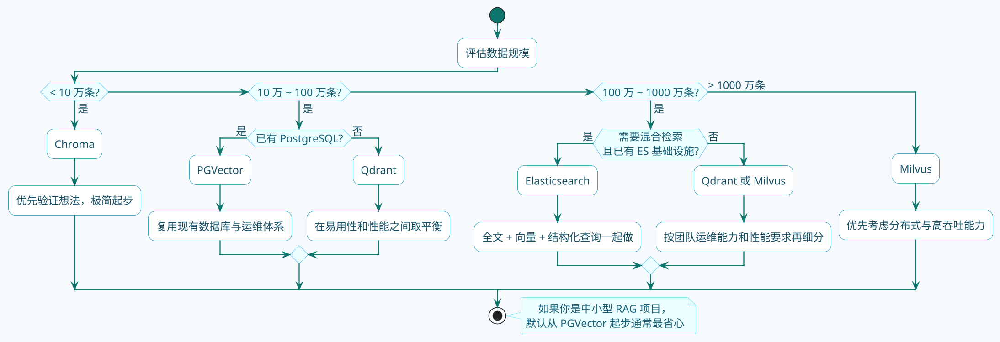

# 向量数据库选型实战指南

:::tip 实战项目推荐
向量数据库选型不是孤立决策，要和文档规模、过滤需求、更新频率和检索链路一起看。超级 AI 智能体提供了完整知识库和 RAG 场景，适合作为选型落地参考。

项目详细介绍：**[什么是超级 AI 智能体？](/super-agent/overview/project-intro)**
:::

买房子要考虑什么？

- 预算多少？（成本）
- 几口人住？（规模）
- 上班远不远？（性能）
- 将来要换大房子吗？（扩展性）
- 物业靠不靠谱？（维护成本）

选向量数据库也是一样的逻辑。

没有"最好的"向量数据库，只有"最适合你场景的"。

:::info 向量数据库的核心作用
向量数据库在RAG中承担两个核心职责：**存储**（保存文档块的向量表示及原始文本）和**检索**（根据查询向量快速找出语义最相近的文档块）。它的本质是将暴力全量比较（O(n)）优化为近似最近邻搜索（O(log n)），使得百万级向量检索能在毫秒级内完成。
:::

## 先搞清楚向量数据库是干什么的

### 普通数据库 vs 向量数据库

普通数据库（MySQL、PostgreSQL）擅长**精确匹配**：

```sql
SELECT * FROM users WHERE name = '张三';
SELECT * FROM products WHERE price < 100;
```

要么完全匹配，要么不匹配。

向量数据库擅长**相似度匹配**：

```
给定向量 [0.23, -0.45, 0.67, ...]
找出数据库中最相似的5个向量
```

不是完全匹配，是找"最像的"。

### 在RAG中的作用

回顾一下RAG的流程：

1. 文档切块 → 转成向量 → **存进向量数据库**
2. 用户提问 → 转成向量 → **在向量数据库中检索** → 找到最相似的文档块
3. 文档块 + 问题 → 发给大模型 → 生成回答

向量数据库承担了**存储**和**检索**两个核心职责。

### 向量数据库存了什么

以PGVector为例，看一下实际存储的数据：

| 字段 | 内容 | 作用 |
| :--- | :--- | :--- |
| embedding_id | 主键 | 唯一标识 |
| embedding | 高维向量 [0.23, -0.45, ...] | 用于相似度检索 |
| text | 原始文本块 | 检索到后返回给大模型 |
| metadata | 元数据 JSON | 过滤、溯源 |

检索的时候用向量算相似度，返回的时候把原始文本一起带回来。

## 主流向量数据库介绍

市面上向量数据库有很多，我挑几个最常用的讲。

### PGVector：PostgreSQL的扩展

**是什么**

PGVector不是一个独立的数据库，而是PostgreSQL的一个扩展。装上这个扩展，PostgreSQL就能存储和检索向量了。

**优点**

- **无需引入新数据库**：如果你已经在用PostgreSQL，加个扩展就行
- **SQL + 向量混合查询**：可以在一条SQL里同时做结构化过滤和向量检索
- **运维简单**：继承PostgreSQL的生态，权限、备份、监控都是现成的
- **支持元数据过滤**：可以先过滤再检索，或者检索后再过滤

**缺点**

- **不适合超大规模**：百万级数据还行，上亿级性能会下降
- **分布式能力弱**：本质上还是单机数据库

**适合场景**

- 中小型知识库（几十万到几百万条）
- 团队已经在用PostgreSQL
- 想用Navicat直接查数据（开发调试方便）

### Milvus：专业的分布式向量数据库

**是什么**

Milvus是专门为向量检索设计的云原生分布式数据库，完全开源（Apache 2.0协议）。

**优点**

- **为大规模设计**：亿级数据也能扛住
- **天然分布式**：水平扩展能力强
- **多种索引类型**：HNSW、IVF系列、DISKANN等，可以根据场景灵活选择
- **原生支持混合检索**：2.5版本开始支持稀疏+稠密向量组合检索
- **Java SDK完善**：API设计清晰，对Java技术栈友好

**缺点**

- **部署复杂**：分布式架构，需要一定运维能力
- **资源消耗大**：内存需求高，HNSW索引尤其吃内存

**适合场景**

- 大规模RAG系统（千万级以上）
- 推荐系统、图像检索等高性能场景
- 有专门的运维团队
- Java技术栈项目

**Milvus的数据模型——用MySQL的思路来理解**

如果你用过MySQL，Milvus的概念体系上手会很快。下面这张对照表能帮你快速建立映射：

| Milvus | MySQL | 一句话说明 |
| :--- | :--- | :--- |
| Collection | Table | 存放同一类向量数据的容器 |
| Schema | CREATE TABLE的列定义 | 规定每条数据有哪些字段、什么类型 |
| Field | Column | 单个字段 |
| Entity | Row | 一条数据记录 |
| 向量索引（HNSW等） | 无直接对应 | 专门加速"找最像的"这件事 |
| 标量索引 | B+树索引 | 加速WHERE条件过滤 |
| Partition | 分区表 | 按业务维度切分数据，缩小检索范围 |

这里面最关键的区别在于字段类型。Milvus的Schema里有两类字段，理解它们的差异非常重要：

- **标量字段**：和MySQL的列没什么两样，存字符串、数字、布尔值这些普通数据。你可以对它做等值查询、范围查询、模糊匹配，建的索引也是类似B+树的结构。
- **向量字段**：存的是高维浮点数数组（比如1536维的float数组）。它没法做等值查询——两个向量完全相等的概率几乎为零——只能做相似度检索，也就是"找最近的TopK个"。它需要专门的向量索引（HNSW、IVF等），和标量索引是完全不同的东西。

举个例子，一个典型的RAG场景Schema长这样：

| 字段类型 | 字段名 | 数据类型 | 作用 |
| :--- | :--- | :--- | :--- |
| 主键 | id | Int64 | 唯一标识，可以自增 |
| 向量字段 | embedding | FloatVector(1536) | 存Embedding向量，用于相似度检索 |
| 标量字段 | content | VarChar | 存原始文本，检索到后返回给大模型 |
| 标量字段 | doc_id | VarChar | 标识来源文档，更新时靠它定位 |
| 标量字段 | category | VarChar | 分类标签，用于过滤 |

:::tip Partition什么时候用
Partition可以按业务维度把数据分开存储，检索时指定Partition能缩小搜索范围。但它不是必须的——如果你的数据量不大（100万以内），或者分类维度的值特别多（上百个），直接用标量字段的filter过滤就够了，效果差不多，管理起来更简单。只有当某个过滤条件在绝大多数查询中都会用到、且值的种类不超过几十个时，Partition才有明显优势。
:::

### Qdrant：性能与易用的平衡

**是什么**

Qdrant是用Rust写的开源向量数据库，强调性能和易用性。

**优点**

- **性能优秀**：Rust实现，内存管理效率高
- **部署简单**：单机Docker一键启动，也支持集群
- **元数据过滤强**：支持复杂的过滤条件，性能影响小
- **API友好**：RESTful API，调试方便

**缺点**

- **分布式能力不如Milvus**：集群方案相对没那么成熟
- **社区规模**：比Milvus小一些，但增长很快

**适合场景**

- 中等规模的RAG系统
- 想兼顾性能和简洁
- 不想搞太复杂的运维

**Docker启动**

```bash
docker run -p 6333:6333 qdrant/qdrant
```

### Chroma：轻量级首选

**是什么**

Chroma是为AI应用设计的轻量级向量数据库，主打开箱即用。

**优点**

- **极简**：几行代码就能跑起来
- **可以嵌入应用**：直接作为内存数据库使用
- **支持持久化**：也可以存到磁盘

**缺点**

- **不适合大规模**：本质是轻量级工具
- **分布式能力缺失**：只能单机

**适合场景**

- 快速验证想法
- 个人项目、学习用途
- 小规模应用

**代码内嵌使用**

```python
import chromadb
client = chromadb.Client()
collection = client.create_collection("my_collection")
```

### Elasticsearch：老牌搜索引擎

**是什么**

Elasticsearch本来是全文搜索引擎，从8.x版本开始支持向量字段（dense_vector）。

**优点**

- **混合检索能力强**：全文检索+向量检索+结构化查询，三合一
- **企业生态成熟**：很多公司已经部署了ES
- **分布式成熟**：久经考验的分布式架构

**缺点**

- **向量检索性能**：比专门的向量数据库略差
- **比较重**：如果只是为了向量检索，ES有点大材小用

**适合场景**

- 公司已经有ES集群
- 需要同时做全文搜索和语义搜索
- 想做混合检索

## 选型决策指南

### 一张表对比

| 数据库 | 部署复杂度 | 数据规模 | 分布式 | 混合检索 | 元数据过滤 | 适合场景 |
| :--- | :--- | :--- | :--- | :--- | :--- | :--- |
| PGVector | 低 | 百万级 | 弱 | 需自研 | 支持 | 中小型、已有PG |
| Milvus | 高 | 亿级 | 强 | 原生支持 | 支持 | 大规模、高性能 |
| Qdrant | 中 | 千万级 | 中 | 部分支持 | 强 | 中等规模 |
| Chroma | 极低 | 十万级 | 无 | 不支持 | 简单支持 | 验证、学习 |
| ES | 中偏高 | 亿级 | 强 | 原生支持 | 支持 | 已有ES、需混合检索 |

### 决策流程图



### 我的建议

**如果你刚开始做RAG**

从PGVector开始。原因：
1. 部署简单，有个PostgreSQL就行
2. 数据可以直接用Navicat查看，方便调试
3. 够用，百万级数据撑得住
4. 以后要迁移也不难

:::tip 新项目首选PGVector
对于大多数中小型RAG项目，PGVector是最省心的选择。它不需要引入新的基础设施，PostgreSQL的运维工具链完全复用，而且Spring AI对PGVector的支持最完善。只有当数据规模超过千万级或有极高的QPS要求时，才需要考虑专业向量数据库。
:::

**如果你在做企业级项目**

看团队情况：
- 有ES运维经验 → Elasticsearch
- 追求性能 → Milvus
- 想简单点 → Qdrant

**如果只是学习或验证**

Chroma，最快上手。

## 实战：医疗知识库场景

来看一个具体的场景，演示如何选型和使用。

### 场景描述

某医院要做一个智能问诊助手，知识库包含：
- 疾病百科：5000+疾病
- 用药指南：10000+药品
- 诊疗规范：3000+文档

预计总数据量：50万-100万条文档块。

### 需求分析

1. **数据规模**：百万级，中等规模
2. **安全要求**：医疗数据敏感，必须私有部署
3. **检索要求**：支持按科室、疾病类型过滤
4. **团队情况**：已有PostgreSQL，运维人员有限

### 选型决策

考虑到数据规模在百万级、团队已有PostgreSQL、运维资源有限，选择**PGVector**。

### 环境搭建：Docker部署PostgreSQL + PGVector

不需要自己编译安装，官方提供了内置PGVector扩展的Docker镜像。先拉取镜像：

```bash
docker pull pgvector/pgvector:pg17
```

拉取完成后，启动容器：

```bash
docker run -d \
  --name pgvector \
  -e POSTGRES_USER=postgres \
  -e POSTGRES_PASSWORD=postgres \
  -e POSTGRES_DB=medical_kb \
  -p 5432:5432 \
  pgvector/pgvector:pg17
```

启动后连接数据库，启用扩展并创建向量表：

```sql
-- 创建数据库
CREATE DATABASE medical_kb;
       
-- 启用pgvector扩展（每个数据库只需执行一次）
CREATE EXTENSION IF NOT EXISTS vector;

-- 验证安装成功
SELECT extversion FROM pg_extension WHERE extname = 'vector';
```

看到版本号输出就说明装好了。

:::tip 镜像版本选择
`pgvector/pgvector:pg17` 是基于PostgreSQL 17的镜像，PGVector已经预装好了。如果你的项目用的是PG 16，换成 `pgvector/pgvector:pg16` 就行。不建议用普通的postgres镜像再手动装扩展，没必要折腾。
:::

### 示例中项目地址

- 项目地址：[https://github.com/java-up-up/nexus-agent](https://github.com/java-up-up/nexus-agent)
- 项目模块：`ai-example-spring-ai-rag-pg`

### Spring AI配置

这个项目用的是硅基流动（SiliconFlow）作为Embedding模型提供方。你可能会问：不是在npmnpm讲PGVector吗，怎么还要配AI的东西？

原因是这样的：PGVector只负责**存储向量和检索向量**，但文本怎么变成向量，它管不了。你需要一个Embedding模型来做这个转换。当你调用`vectorStore.add(doc)`时，Spring AI会自动调用配置好的Embedding模型把文本转成4096维的向量，然后再存进PGVector。检索时也一样，你传入一个文本query，Spring AI先把它转成向量，再去PGVector里找最相似的。

所以配置里有两块东西：一块是PG数据源 + PGVector参数，一块是硅基流动的Embedding模型。

硅基流动的API兼容OpenAI协议，所以Spring AI里直接用`spring.ai.openai`配置，把`base-url`指向硅基流动就行：

```yaml
server:
  port: 7093

spring:
  datasource:
    url: jdbc:postgresql://localhost:5432/medical_kb
    username: postgres
    password: postgres
  ai:
    openai:
      base-url: https://api.siliconflow.cn       # 硅基流动的API地址
      api-key: ${SILICONFLOW_API_KEY}             # 硅基流动的API Key
      embedding:
        options:
          model: Qwen/Qwen3-Embedding-8B          # Embedding模型
          dimensions: 1024                         # 指定输出1024维（PGVector的HNSW索引最多支持2000维）
    vectorstore:
      pgvector:
        index-type: hnsw                          # 向量索引类型
        distance-type: COSINE_DISTANCE            # 余弦相似度
        dimensions: 1024                          # 和Embedding输出维度一致
```

:::info 硅基流动API Key获取
登录[硅基流动平台](https://cloud.siliconflow.cn/)，在API密钥页面创建一个Key。`Qwen/Qwen3-Embedding-8B`是通义千问的文本向量模型，输出4096维向量。配置时通过环境变量`SILICONFLOW_API_KEY`注入，避免把Key硬编码到配置文件里。
:::

Spring AI对PGVector的支持非常完善，配好数据源和向量存储参数后，它会自动帮你建表、建索引，不需要手动执行SQL。

### 实现代码

**1. 入库服务**

```java
@Service
public class MedicalKnowledgeService {
    
    @Autowired
    private VectorStore vectorStore;
    
    /**
     * 导入疾病知识
     */
    public void importDiseaseKnowledge(Disease disease) {
        // 构建文档内容
        String content = String.format(
            "疾病名称：%s\n症状：%s\n治疗方案：%s",
            disease.getName(),
            disease.getSymptoms(),
            disease.getTreatment()
        );
        
        // 构建元数据（用于后续过滤）
        Map<String, Object> metadata = new HashMap<>();
        metadata.put("type", "disease");
        metadata.put("department", disease.getDepartment());  // 科室
        metadata.put("category", disease.getCategory());      // 疾病分类
        metadata.put("diseaseId", disease.getId());
        
        Document doc = new Document(content, metadata);
        vectorStore.add(List.of(doc));
    }
    
    /**
     * 导入药品知识
     */
    public void importDrugKnowledge(Drug drug) {
        String content = String.format(
            "药品名称：%s\n适应症：%s\n用法用量：%s\n注意事项：%s",
            drug.getName(),
            drug.getIndications(),
            drug.getDosage(),
            drug.getPrecautions()
        );
        
        Map<String, Object> metadata = new HashMap<>();
        metadata.put("type", "drug");
        metadata.put("category", drug.getCategory());
        metadata.put("drugId", drug.getId());
        
        Document doc = new Document(content, metadata);
        vectorStore.add(List.of(doc));
    }
}
```

**4. 检索服务（带元数据过滤）**

```java
@Service
public class MedicalSearchService {
    
    @Autowired
    private VectorStore vectorStore;
    
    /**
     * 通用检索
     */
    public List<Document> search(String query, int topK) {
        return vectorStore.similaritySearch(
            SearchRequest.builder()
                .query(query)
                .topK(topK)
                .similarityThreshold(0.4)
                .build()
        );
    }
    
    /**
     * 按科室检索（只搜索特定科室的知识）
     */
    public List<Document> searchByDepartment(String query, String department, int topK) {
        // 构建过滤表达式
        FilterExpressionBuilder builder = new FilterExpressionBuilder();
        Expression filter = builder.eq("department", department).build();
        
        return vectorStore.similaritySearch(
            SearchRequest.builder()
                .query(query)
                .topK(topK)
                .similarityThreshold(0.4)
                .filterExpression(filter)
                .build()
        );
    }
    
    /**
     * 只搜索药品知识
     */
    public List<Document> searchDrugs(String query, int topK) {
        FilterExpressionBuilder builder = new FilterExpressionBuilder();
        Expression filter = builder.eq("type", "drug").build();
        
        return vectorStore.similaritySearch(
            SearchRequest.builder()
                .query(query)
                .topK(topK)
                .filterExpression(filter)
                .build()
        );
    }
}
```

### 启动时自动导入示例数据

为了方便测试，项目启动时会自动导入一批医疗知识数据。通过实现`CommandLineRunner`接口，在Spring Boot启动完成后自动执行：

```java
@Slf4j
@Component
public class MedicalDataInitializer implements CommandLineRunner {

    private final MedicalKnowledgeService knowledgeService;
    private final JdbcTemplate jdbcTemplate;

    public MedicalDataInitializer(MedicalKnowledgeService knowledgeService, JdbcTemplate jdbcTemplate) {
        this.knowledgeService = knowledgeService;
        this.jdbcTemplate = jdbcTemplate;
    }

    @Override
    public void run(String... args) {
        log.info("开始初始化医疗知识库示例数据...");
        try {
            // 清空旧数据，避免重复
            jdbcTemplate.execute("TRUNCATE TABLE public.vector_store");
            log.info("已清空旧数据");

            importDiseases();
            importDrugs();
            log.info("医疗知识库示例数据初始化完成");
        } catch (Exception e) {
            log.error("初始化医疗知识库数据失败", e);
        }
    }

    private void importDiseases() {
        Disease flu = new Disease();
        flu.setId("D001");
        flu.setName("流行性感冒");
        flu.setSymptoms("高热、头痛、全身肌肉酸痛、乏力、鼻塞、流涕、咽痛、咳嗽");
        flu.setTreatment("对症治疗为主，发病48小时内可使用奥司他韦等抗病毒药物，注意休息和补充水分");
        flu.setDepartment("内科");
        flu.setCategory("呼吸系统疾病");
        knowledgeService.importDiseaseKnowledge(flu);

        Disease hypertension = new Disease();
        hypertension.setId("D002");
        hypertension.setName("高血压");
        hypertension.setSymptoms("头晕、头痛、耳鸣、心悸、眼花、注意力不集中、记忆力减退、手脚麻木");
        hypertension.setTreatment("长期规律服用降压药（如氨氯地平、缬沙坦等），低盐低脂饮食，适量运动，戒烟限酒，定期监测血压");
        hypertension.setDepartment("内科");
        hypertension.setCategory("心血管疾病");
        knowledgeService.importDiseaseKnowledge(hypertension);

        Disease diabetes = new Disease();
        diabetes.setId("D003");
        diabetes.setName("2型糖尿病");
        diabetes.setSymptoms("多饮、多尿、多食、体重下降、视力模糊、皮肤瘙痒、伤口愈合缓慢");
        diabetes.setTreatment("饮食控制和运动为基础，口服降糖药（如二甲双胍）或注射胰岛素，定期监测血糖和糖化血红蛋白");
        diabetes.setDepartment("内科");
        diabetes.setCategory("内分泌疾病");
        knowledgeService.importDiseaseKnowledge(diabetes);

        Disease gastritis = new Disease();
        gastritis.setId("D004");
        gastritis.setName("慢性胃炎");
        gastritis.setSymptoms("上腹部隐痛、腹胀、嗳气、食欲不振、恶心、反酸");
        gastritis.setTreatment("规律饮食，避免辛辣刺激食物，幽门螺杆菌阳性者需三联或四联疗法根除治疗，可服用奥美拉唑等质子泵抑制剂");
        gastritis.setDepartment("消化内科");
        gastritis.setCategory("消化系统疾病");
        knowledgeService.importDiseaseKnowledge(gastritis);

        Disease lumbar = new Disease();
        lumbar.setId("D005");
        lumbar.setName("腰椎间盘突出症");
        lumbar.setSymptoms("腰痛、下肢放射痛、下肢麻木、行走困难、久坐后加重");
        lumbar.setTreatment("急性期卧床休息，口服非甾体抗炎药缓解疼痛，配合理疗和康复锻炼，严重者需手术治疗");
        lumbar.setDepartment("骨科");
        lumbar.setCategory("骨骼肌肉疾病");
        knowledgeService.importDiseaseKnowledge(lumbar);
    }

    private void importDrugs() {
        Drug ibuprofen = new Drug();
        ibuprofen.setId("M001");
        ibuprofen.setName("布洛芬缓释胶囊");
        ibuprofen.setIndications("用于缓解轻至中度疼痛，如头痛、关节痛、偏头痛、牙痛、肌肉痛、神经痛、痛经，也用于普通感冒或流行性感冒引起的发热");
        ibuprofen.setDosage("口服，成人一次1粒（0.3g），一日2次");
        ibuprofen.setPrecautions("消化性溃疡患者禁用，肝肾功能不全者慎用，不宜与其他非甾体抗炎药同时使用");
        ibuprofen.setCategory("解热镇痛药");
        knowledgeService.importDrugKnowledge(ibuprofen);

        Drug metformin = new Drug();
        metformin.setId("M002");
        metformin.setName("盐酸二甲双胍片");
        metformin.setIndications("用于2型糖尿病，特别是肥胖的2型糖尿病患者，可单独使用或与其他降糖药联合使用");
        metformin.setDosage("口服，起始剂量一次0.5g，一日2-3次，随餐服用，可根据血糖逐渐增加剂量，最大日剂量2g");
        metformin.setPrecautions("肾功能不全（eGFR<30）禁用，做增强CT检查前后48小时需停药，长期使用注意监测维生素B12水平");
        metformin.setCategory("降糖药");
        knowledgeService.importDrugKnowledge(metformin);

        Drug amlodipine = new Drug();
        amlodipine.setId("M003");
        amlodipine.setName("苯磺酸氨氯地平片");
        amlodipine.setIndications("用于高血压和慢性稳定性心绞痛的治疗");
        amlodipine.setDosage("口服，起始剂量一次5mg，一日1次，根据血压调整，最大剂量一日10mg");
        amlodipine.setPrecautions("严重低血压患者禁用，肝功能不全者需减量，可能引起踝部水肿和头晕");
        amlodipine.setCategory("降压药");
        knowledgeService.importDrugKnowledge(amlodipine);

        Drug omeprazole = new Drug();
        omeprazole.setId("M004");
        omeprazole.setName("奥美拉唑肠溶胶囊");
        omeprazole.setIndications("用于胃溃疡、十二指肠溃疡、反流性食管炎、胃泌素瘤，也用于幽门螺杆菌的联合根除治疗");
        omeprazole.setDosage("口服，一次20mg，一日1-2次，晨起空腹服用，疗程通常4-8周");
        omeprazole.setPrecautions("长期使用可能增加骨折风险和低镁血症风险，不建议无明确指征的长期使用，服药期间避免与氯吡格雷合用");
        omeprazole.setCategory("消化系统用药");
        knowledgeService.importDrugKnowledge(omeprazole);
    }
}
```

项目启动后，Spring AI会自动调用DashScope的Embedding模型把这些文本转成向量，存入PGVector。你可以在PostgreSQL里直接查到数据。

### 接口调用示例

项目启动后（确保PGVector容器已运行、DashScope API Key已配置），可以直接用curl测试：

**通用检索**：问一个症状相关的问题

```bash
curl "http://localhost:7093/medical/search?query=头疼发烧吃什么药&topK=5"
```

**通用检索结果**：
```json
[
    {
        "metadata": {
            "type": "disease",
            "category": "呼吸系统疾病",
            "department": "内科",
            "distance": 0.5749157,
            "diseaseId": "D001"
        },
        "content": "疾病名称：流行性感冒\n症状：高热、头痛、全身肌肉酸痛、乏力、鼻塞、流涕、咽痛、咳嗽\n治疗方案：对症治疗为主，发病48小时内可使用奥司他韦等抗病毒药物，注意休息和补充水分"
    }
]
```

**按科室检索**：只在内科知识库中搜索

```bash
curl "http://localhost:7093/medical/search/department?query=高血压怎么治疗&department=内科&topK=5"
```

**按科室检索结果**：
```json
[
    {
        "metadata": {
            "type": "disease",
            "category": "心血管疾病",
            "department": "内科",
            "distance": 0.5339663,
            "diseaseId": "D002"
        },
        "content": "疾病名称：高血压\n症状：头晕、头痛、耳鸣、心悸、眼花、注意力不集中、记忆力减退、手脚麻木\n治疗方案：长期规律服用降压药（如氨氯地平、缬沙坦等），低盐低脂饮食，适量运动，戒烟限酒，定期监测血压"
    },
    {
        "metadata": {
            "type": "disease",
            "category": "呼吸系统疾病",
            "department": "内科",
            "distance": 0.5671568,
            "diseaseId": "D001"
        },
        "content": "疾病名称：流行性感冒\n症状：高热、头痛、全身肌肉酸痛、乏力、鼻塞、流涕、咽痛、咳嗽\n治疗方案：对症治疗为主，发病48小时内可使用奥司他韦等抗病毒药物，注意休息和补充水分"
    }
]
```


**只搜索药品**：

```bash
curl "http://localhost:7093/medical/search/drug?query=退烧药&topK=5"
```

**只搜索药品结果**：
```json
[
    {
        "metadata": {
            "drugId": "M001",
            "type": "drug",
            "category": "解热镇痛药",
            "distance": 0.65363115
        },
        "content": "药品名称：布洛芬缓释胶囊\n适应症：用于缓解轻至中度疼痛，如头痛、关节痛、偏头痛、牙痛、肌肉痛、神经痛、痛经，也用于普通感冒或流行性感冒引起的发热\n用法用量：口服，成人一次1粒（0.3g），一日2次\n注意事项：消化性溃疡患者禁用，肝肾功能不全者慎用，不宜与其他非甾体抗炎药同时使用"
    },
    {
        "metadata": {
            "drugId": "M003",
            "type": "drug",
            "category": "降压药",
            "distance": 0.74444807
        },
        "content": "药品名称：苯磺酸氨氯地平片\n适应症：用于高血压和慢性稳定性心绞痛的治疗\n用法用量：口服，起始剂量一次5mg，一日1次，根据血压调整，最大剂量一日10mg\n注意事项：严重低血压患者禁用，肝功能不全者需减量，可能引起踝部水肿和头晕"
    },
    {
        "metadata": {
            "drugId": "M004",
            "type": "drug",
            "category": "消化系统用药",
            "distance": 0.77292264
        },
        "content": "药品名称：奥美拉唑肠溶胶囊\n适应症：用于胃溃疡、十二指肠溃疡、反流性食管炎、胃泌素瘤，也用于幽门螺杆菌的联合根除治疗\n用法用量：口服，一次20mg，一日1-2次，晨起空腹服用，疗程通常4-8周\n注意事项：长期使用可能增加骨折风险和低镁血症风险，不建议无明确指征的长期使用，服药期间避免与氯吡格雷合用"
    },
    {
        "metadata": {
            "drugId": "M002",
            "type": "drug",
            "category": "降糖药",
            "distance": 0.80041575
        },
        "content": "药品名称：盐酸二甲双胍片\n适应症：用于2型糖尿病，特别是肥胖的2型糖尿病患者，可单独使用或与其他降糖药联合使用\n用法用量：口服，起始剂量一次0.5g，一日2-3次，随餐服用，可根据血糖逐渐增加剂量，最大日剂量2g\n注意事项：肾功能不全（eGFR<30）禁用，做增强CT检查前后48小时需停药，长期使用注意监测维生素B12水平"
    }
]
```

**手动导入一条疾病知识**：

```bash
curl -X POST http://localhost:7093/medical/disease \
  -H "Content-Type: application/json" \
  -d '{
    "id": "D006",
    "name": "过敏性鼻炎",
    "symptoms": "打喷嚏、流清涕、鼻塞、鼻痒、眼痒",
    "treatment": "避免接触过敏原，口服氯雷他定等抗组胺药，鼻喷糠酸莫米松等糖皮质激素",
    "department": "耳鼻喉科",
    "category": "变态反应性疾病"
  }'
```

元数据过滤的好处是显而易见的：
- 搜索更精准（缩小范围）
- 速度更快（减少计算量）
- 结果更可控（不会串科室）

## Milvus进阶：生产环境绕不开的几个问题

选型决定用Milvus之后，真正上手会碰到一些"demo里不会遇到，但生产环境必须想清楚"的问题。这一节把最常见的几个拎出来聊聊。

### 相似度度量怎么选：COSINE、IP还是L2

Milvus支持三种距离计算方式，很多人搞不清楚该用哪个。

| 度量方式 | 直觉理解 | 值域 | 越大越相似？ | 典型场景 |
| :--- | :--- | :--- | :--- | :--- |
| COSINE | 看两个向量的"方向"是否一致，不管长短 | [-1, 1] | 是 | 文本语义检索（最常用） |
| IP（内积） | 同时考虑方向和长度 | (-∞, +∞) | 是 | 向量已归一化时和COSINE等价 |
| L2（欧氏距离） | 两个点在空间中的直线距离 | [0, +∞) | 否，越小越像 | 图像检索、推荐系统 |

怎么选？其实很简单——看你的Embedding模型推荐哪种。

大多数文本Embedding模型（OpenAI的text-embedding-3、Qwen3-Embedding等）输出的向量已经做过归一化处理，这种情况下COSINE和IP的效果完全一样。如果你不确定模型有没有归一化，选COSINE最稳妥，它会自动处理向量长度差异。

L2在文本检索场景用得比较少，更多出现在图像、音频这类领域。

:::info 一个容易踩的坑
创建索引时选的MetricType，必须和检索时用的一致。如果建索引用了COSINE，检索时传IP，结果会不对。这个不会报错，但返回的排序是乱的，排查起来很头疼。
:::

### 数据更新怎么做：删旧插新

知识库不是一成不变的——文档会修改、会删除、会新增。向量数据库里的数据得跟着源文档同步。

Milvus目前不支持直接update一条数据的向量字段，所以更新的标准做法是**先删后插**：

```java
import io.milvus.v2.service.vector.request.DeleteReq;

// 第一步：按doc_id删掉旧数据
DeleteReq deleteReq = DeleteReq.builder()
        .collectionName("knowledge_chunks")
        .filter("doc_id == \"hr_001\"")
        .build();
client.delete(deleteReq);

// 第二步：对修改后的文档重新走一遍 分块 → 向量化 → 插入 的流程
```

这里`doc_id`的价值就体现出来了——它是连接源文档和向量数据库的桥梁。一个文档更新了，通过doc_id把它对应的所有chunk全部删掉，然后重新处理插入。

实际项目中一般这么做：

1. 源文档变更时，触发一个异步任务
2. 任务根据doc_id删除Milvus中该文档的所有旧chunk
3. 对新文档重新执行 提取文本 → 分块 → 向量化 → 插入Milvus
4. 整个过程对用户透明，检索服务不中断

:::caution 删除后记得释放空间
Milvus的删除是逻辑删除，被删的数据不会立即从磁盘消失。如果频繁删除导致空间膨胀，可以调用`compact`接口触发物理清理。不过对于大多数RAG场景，文档更新频率不会太高，这个问题不太突出。
:::

### 分区策略：什么时候该用Partition

前面提到Partition可以按业务维度切分数据，但具体什么时候该用、什么时候不该用，很多人拿不准。

几种常见的分区方式：

| 分区维度 | 举例 | 适合场景 |
| :--- | :--- | :--- |
| 按文档类别 | `入职指南`、`报销制度`、`假期政策` | 知识库有清晰的分类体系 |
| 按租户 | `tenant_001`、`tenant_002` | 多租户SaaS系统 |
| 按时间段 | `2026_Q1`、`2026_Q2` | 数据有明显的时效性 |

但以下情况，用标量字段的filter过滤比Partition更合适：

- 分类维度的值特别多（上百个类别），Partition太多反而增加管理负担
- 查询经常需要跨多个分类
- 数据量不大（100万以内），filter的性能开销可以忽略

一个经验法则：如果某个过滤条件在90%以上的查询中都会用到，而且值的种类不超过几十个，用Partition；否则filter就够了。

## 性能优化Tips

### 索引选择

向量数据库通常支持多种索引类型：

| 索引类型 | 特点 | 适合场景 |
| :--- | :--- | :--- |
| FLAT | 暴力搜索，100%准确 | 小数据量（10万以下） |
| IVF_FLAT | 聚类分区+簇内精确搜索 | 中等数据量，内存有限 |
| IVF_SQ8 | 聚类+标量量化，向量压缩到1/4 | 大数据量，愿意牺牲一点精度换内存 |
| HNSW | 多层图索引，速度和精度都好 | 大部分场景的首选 |
| DISKANN | 索引放磁盘 | 超大数据量，内存放不下HNSW |

大部分场景选HNSW就对了。只有数据量极小（10万以下）用FLAT，或者数据量极大（5000万以上）且内存不够时才考虑DISKANN或IVF_PQ。

:::info 索引类型选择指南
**HNSW**（分层可导航小世界图）是绝大多数场景的首选：查询速度快、准确率高、内存消耗合理。只有在极小数据量（少于10万）且对准确率要求100%时才用FLAT，或在超大数据量（超过千万级）且内存受限时考虑DiskANN。
:::

### HNSW关键调参

如果你用的是HNSW索引，有三个参数直接影响性能表现：

| 参数 | 干什么的 | 推荐范围 | 调大了会怎样 | 调小了会怎样 |
| :--- | :--- | :--- | :--- | :--- |
| M | 每个向量在图中的最大连接数 | 8~32，一般16 | 召回率提高，但内存涨、建索引变慢 | 省内存，但召回率可能下降 |
| efConstruction | 建索引时的搜索宽度 | 128~512，一般256 | 索引质量更好，但建索引更慢 | 建索引快，但质量可能打折 |
| ef | 检索时的搜索宽度 | topK的4~16倍 | 召回率更高，但检索变慢 | 检索快，但可能漏掉相关结果 |

实际调参思路：先用默认值（M=16，efConstruction=256，ef=topK×8）跑起来，然后根据实际的召回率和延迟表现微调。大多数情况下默认值就够用了，不用过度纠结。

### IVF关键调参

如果因为内存限制选了IVF系列索引，关注这两个参数：

| 参数 | 干什么的 | 推荐值 | 调大了 | 调小了 |
| :--- | :--- | :--- | :--- | :--- |
| nlist | 聚类的簇数量 | 数据量的平方根（100万数据用1024） | 每个簇更小，检索更快，但训练更慢 | 每个簇更大，检索更慢 |
| nprobe | 检索时搜索几个簇 | nlist的5%~10% | 召回率提高，检索变慢 | 检索快，但可能漏结果 |

### 批量操作

单条插入太慢，改成批量：

```java
// 不推荐：单条插入
for (Document doc : documents) {
    vectorStore.add(List.of(doc));
}

// 推荐：批量插入
vectorStore.add(documents);  // 一次性插入整个列表
```

### 合理设置TopK

TopK不是越大越好：
- 太小：可能漏掉相关内容
- 太大：增加计算量，而且太多内容塞给大模型反而会干扰

一般5-10就够了，最多不超过20。

:::caution TopK的边际效益递减
很多人以为TopK越大结果越好，实际上超过一定值后反而变差。原因：多余的候选内容会作为噪音传给大模型，分散模型的注意力。研究表明大模型对"迷失在中间"的信息关注度低。建议TopK从5开始，配合测试集调整，不要随意设很大。
:::

### 相似度阈值

设置一个合理的阈值，过滤掉不相关的结果：

```java
.similarityThreshold(0.6)  // 相似度低于0.6的不返回
```

阈值设多少看场景，可以通过测试数据来调。

### 向量维度与内存估算

向量维度越高，检索越慢、内存占用越大。如果你的Embedding模型支持多种维度输出（比如有些模型支持512~4096），在精度够用的前提下可以选较低的维度，能省不少资源。

粗略估算一下内存占用：100万个1536维向量，用HNSW索引（M=16），大约需要8~10GB内存。如果换成4096维，内存直接翻到20GB以上。服务器内存有限的话，这个数字值得提前算一算。

其他几个通用建议：

- 批量插入比逐条插入快得多，建议每批1000~5000条
- 如果数据量很大但查询QPS不高，可以考虑DISKANN把索引放磁盘
- 定期关注检索延迟和召回率，Milvus的Attu管理界面可以看到基本的性能指标
- 标量字段如果经常用于过滤，记得给它建索引（TRIE适合字符串等值匹配，STL_SORT适合数值范围查询）

## Milvus实战：从零跑通完整流程

让我们使用 Milvus 来完成一个完整的流程，涵盖从创建 Collection、插入数据、建立索引到执行检索的全过程。

项目中使用 **真正落地的 Spring AI 架构**。这样更符合现在 Java 项目的常见写法，也方便你直接把示例搬到自己的 RAG 工程里。

虽然代码风格变了，但流程本质没变，如果不借助 Spring AI 框架，传统的 Milvus 使用，需要以下这四步：

1. 创建 Collection 和 Schema
2. 插入文档块并向量化
3. 创建索引并加载 Collection 到内存
4. 执行向量检索和带过滤的混合检索

只不过在 Spring AI 方案里，第 1、3 步很多工作是框架自动帮你做的。

### 对应项目位置

- 项目地址：[https://github.com/java-up-up/nexus-agent](https://github.com/java-up-up/nexus-agent)
- 模块路径：`ai-example/ai-example-rag/ai-example-spring-ai-rag-milvus`

### 部署方式

Milvus Standalone是单机版，适合开发和中小规模场景。它依赖对象存储（存索引文件）和etcd（存元数据）。

```yaml
# docker-compose.yml
name: milvus-stack

services:
  etcd:
    container_name: etcd
    image: quay.io/coreos/etcd:v3.5.18
    environment:
      - ETCD_AUTO_COMPACTION_MODE=revision
      - ETCD_AUTO_COMPACTION_RETENTION=1000
      - ETCD_QUOTA_BACKEND_BYTES=4294967296
    command: etcd -advertise-client-urls=http://etcd:2379 -listen-client-urls=http://0.0.0.0:2379 --data-dir=/etcd
    volumes:
      - etcd-data:/etcd

  minio:
    container_name: minio
    image: minio/minio:RELEASE.2024-01-01T16-36-33Z
    environment:
      MINIO_ACCESS_KEY: minioadmin
      MINIO_SECRET_KEY: minioadmin
    command: minio server /data --console-address ":9001"
    ports:
      - "9001:9001"
    volumes:
      - minio-data:/data

  standalone:
    container_name: milvus-standalone
    image: milvusdb/milvus:v2.6.6
    command: ["milvus", "run", "standalone"]
    environment:
      ETCD_ENDPOINTS: etcd:2379
      MINIO_ADDRESS: minio:9000
    volumes:
      - milvus-data:/var/lib/milvus
    ports:
      - "19530:19530"
      - "9091:9091"
    depends_on:
      - etcd
      - minio

  attu:
    container_name: milvus-attu
    image: zilliz/attu:v2.6.3
    environment:
      MILVUS_URL: milvus-standalone:19530
    ports:
      - "8000:3000"
    depends_on:
      - standalone

volumes:
  etcd-data:
  minio-data:
  milvus-data:
```

执行 `docker compose up -d` 后，访问 `http://localhost:8000` 可以打开Attu管理界面。

**不需要填写账户和密码，直接登录就行**


### Maven依赖

```xml
<dependencies>
    <!-- Spring AI OpenAI（这里通过 SiliconFlow 走 OpenAI 兼容协议） -->
    <dependency>
        <groupId>org.springframework.ai</groupId>
        <artifactId>spring-ai-starter-model-openai</artifactId>
    </dependency>

    <!-- Spring AI Milvus VectorStore Starter -->
    <dependency>
        <groupId>org.springframework.ai</groupId>
        <artifactId>spring-ai-starter-vector-store-milvus</artifactId>
    </dependency>

    <!-- 仅用于控制层入参校验 -->
    <dependency>
        <groupId>org.springframework.boot</groupId>
        <artifactId>spring-boot-starter-validation</artifactId>
    </dependency>

    <!-- 其他依赖省略 -->
    <dependency>
        <groupId>org.springframework.boot</groupId>
        <artifactId>spring-boot-starter-web</artifactId>
    </dependency>
</dependencies>
```

这一节我们直接用 **Spring AI + Milvus** 来跑通完整流程。并且把真正影响效果和性能的参数配置也讲解清楚，把初始化、入库、检索、过滤这些步骤放回到一个更贴近实际项目的代码结构里。

### Spring AI配置

项目中的核心配置如下：

```yaml
spring:
  ai:
    openai:
      base-url: https://api.siliconflow.cn
      api-key: ${SILICONFLOW_API_KEY}
      embedding:
        options:
          model: Qwen/Qwen3-Embedding-8B
          dimensions: 4096
    vectorstore:
      milvus:
        initialize-schema: true
        database-name: default
        collection-name: knowledge_chunks
        embedding-dimension: 4096
        index-type: HNSW
        metric-type: COSINE
        index-parameters: '{"M":16,"efConstruction":256}'
        auto-id: false
        id-field-name: id
        content-field-name: content
        metadata-field-name: metadata
        embedding-field-name: embedding
        client:
          uri: http://localhost:19530

app:
  milvus:
    demo:
      top-k: 5
      similarity-threshold: 0.15
      default-ef: 64
```

### 关键参数速览

:::info 先看这一张表
如果你第一次用 Spring AI 接 Milvus，先把下面这 5 个参数看明白，基本就抓住了这个示例最核心的配置思路。
:::

| 参数 | 当前值 | 它控制什么 | 为什么这样配 |
| :--- | :--- | :--- | :--- |
| `embedding.options.dimensions` | `4096` | Embedding 模型输出的向量维度 | 必须和 Milvus 向量字段维度一致，否则写入报错 |
| `embedding-dimension` | `4096` | Milvus 向量字段的维度定义 | 和模型输出保持一致，当前使用 Qwen3-Embedding-8B |
| `index-type` | `HNSW` | 向量索引类型 | 检索速度和召回率比较均衡，适合大多数 RAG 场景 |
| `metric-type` | `COSINE` | 相似度度量方式 | 文本语义检索通常优先使用余弦相似度 |
| `index-parameters` | `{"M":16,"efConstruction":256}` | HNSW 建索引参数 | 是一个很常见、比较稳妥的默认组合 |
| `default-ef` | `64` | 检索阶段的搜索宽度 | 在召回率和查询延迟之间做平衡 |

### 关键参数解读

#### 1. `embedding.options.dimensions`

这个参数控制的是：**Embedding 模型把文本转成向量之后，最终会输出多少维的浮点数数组**。

可以把它理解成“文本在向量空间里被展开成多长的一串数字”。这个长度不是随便填的，而是由模型本身决定的。当前示例使用的是 `Qwen/Qwen3-Embedding-8B`，它输出 4096 维，所以这里必须配置成 4096。

这个参数为什么重要？

- 它直接决定了后面写入 Milvus 的向量长度
- 它必须和 Milvus 的向量字段维度一模一样
- 只要两边不一致，写入时就会直接报错，而不是“自动帮你兼容”

最常见的错误就是：模型还是 4096 维，但数据库表结构还是旧的 1024 维。结果应用一启动，前面配置看起来都没问题，一到真正写向量的时候就失败。

#### 2. `embedding-dimension`

这个参数控制的是：**Milvus 中向量字段本身的维度定义**。

如果说上面的 `embedding.options.dimensions` 决定的是“模型会产出什么格式的向量”，那这里决定的就是“Milvus 这张表准备接收什么格式的向量”。两边是一对，必须严格一致。

为什么文档里要把这两个参数分开讲？

- 因为它们看起来很像，实际职责却不一样
- 一个属于模型侧
- 一个属于向量库侧
- 只有模型输出和数据库字段同时对齐，整条链路才是通的

所以在排查维度问题时，不要只盯着模型名看，也一定要检查 Milvus 的这一项配置。

#### 3. `index-type`

这个参数控制的是：**Milvus 用什么索引结构来做向量检索**。

当前配置的是 `HNSW`。如果小伙伴是第一次做 RAG 项目的话，可以把它理解成“默认优先选它，通常不会出大问题”的那种配置。原因主要有三个：

- 检索速度快，适合交互式问答
- 召回率高，通常能把真正相关的 chunk 找回来
- 工程上很成熟，已经被大量文本检索场景验证过

当然，HNSW 也不是没有代价。它的典型代价是内存占用会比较高，尤其是在向量维度高、数据量大的时候更明显。但如果现在是在做一个普通的 RAG 示例，或者是百万级以内的数据量，它依然是很自然的第一选择。

#### 4. `metric-type`

这个参数控制的是：**Milvus 用什么方式衡量两个向量到底有多相似**。

这里配置成 `COSINE`，也就是余弦相似度。文本语义检索里，这通常是最符合直觉的一种选择。

为什么这么说？

- 文本向量更关心“方向是否接近”，也就是语义是否接近
- 余弦相似度天然适合衡量这种“方向上的接近”
- 对大模型生成的文本向量来说，它往往比单纯比较数值大小更稳定

所以如果你的场景是文档问答、知识库检索、FAQ 召回这类典型文本 RAG，`COSINE` 往往就是最先尝试、也最容易跑通的一种配置。

#### 5. `index-parameters`

这个参数控制的是：**HNSW 在建索引时的关键行为**。当前示例里配置的是：

```yaml
index-parameters: '{"M":16,"efConstruction":256}'
```

这两个值要分开理解：

- `M`
  可以理解成“每个向量节点在图里最多保留多少条连接”。这个值越大，图通常越密，检索时更容易找到真正相近的邻居，但索引更占内存。
- `efConstruction`
  可以理解成“建索引时愿意多看多少候选邻居再做决定”。值越大，通常索引质量越高，但建索引时间会更长。

为什么示例里用 `M=16`、`efConstruction=256`？

- 这是一个很常见的工程默认组合
- 对文本检索来说，通常已经够稳
- 不会过于保守，也不会激进到一上来就把资源吃得很重

如果小伙伴后面遇到“召回率不够”或者“建索引太慢”的问题，调参通常也是从这两个参数开始。

#### 6. `default-ef`

这个参数控制的是：**HNSW 在真正执行查询时，要不要多看一些候选节点再决定最终结果**。

和 `efConstruction` 不同，`efConstruction` 是建索引时用的，`default-ef` 是检索时用的。一个影响“索引怎么建”，一个影响“查询怎么搜”，不要混淆。

这个参数怎么影响结果？

- 值小一些：检索更快，但可能漏掉一些本来应该召回的结果
- 值大一些：召回通常更稳，但查询耗时会增加

工程上一般会把它设置成 `topK` 的 4~16 倍。当前 demo 默认给的是 `64`，属于一个比较稳妥、比较适合起步的值。

如果在检索时，发现发现“结果大致对，但偶尔漏召回”，`ef` 往往就是最值得先试着调大的一个参数。

这里还有一个很关键的工程化选择：我们把 `auto-id` 设成了 `false`。

这么做的原因不是“自动主键不好”，而是这个 demo 更贴近真实项目。

如果让 Milvus 自动生成主键，最小示例当然也能跑通，但你后面做文档更新、chunk 删除、数据重建时会比较麻烦。

在真实项目里，**通常更希望 chunk 有稳定 ID**，这样你后面才能更自然地做这些操作：

- 按 chunkId 删除
- 按 docId 做整篇文档重建
- 做“先删后插”的增量更新

所以这个 Spring AI demo 选择的是**显式 chunkId**，而不是让 Milvus 自动生成一个只在数据库内部可见的主键值。

### 创建Collection和Schema

在这个 Spring AI 项目里，只要配置了 `initialize-schema: true`，框架启动时就会自动完成下面这三件事：

1. 创建 Collection
2. 创建向量索引
3. 加载 Collection 到内存

也就是说，Collection、Schema、索引和加载动作，并不是“没有了”，而是被收口到了 `MilvusVectorStore` 的初始化阶段。

项目里显式触发这套流程的代码在这里：

```java
public void recreateCollection() {
    if (collectionExists()) {
        milvusClient.releaseCollection(ReleaseCollectionParam.newBuilder()
                .withDatabaseName(vectorStoreProperties.getDatabaseName())
                .withCollectionName(vectorStoreProperties.getCollectionName())
                .build());

        milvusClient.dropCollection(DropCollectionParam.newBuilder()
                .withDatabaseName(vectorStoreProperties.getDatabaseName())
                .withCollectionName(vectorStoreProperties.getCollectionName())
                .build());
    }

    // 按当前配置重新初始化 Milvus：
    // 创建 Collection、创建索引，并把 Collection 加载到内存。
    milvusVectorStore.afterPropertiesSet();
}
```

如果想手动重建 Collection，项目也提供了接口来直接调用：

```http
POST /milvus/demo/recreate
```

### Spring AI帮你生成了什么Schema

虽然这里没有手写 Schema 定义，但底层字段依然是真实存在的。按照当前配置，Spring AI 会帮我们创建出一套适合知识库检索的结构：

- `id`
  主键字段。当前项目因为 `auto-id: false`，这里使用的就是业务侧传入的 chunkId。
- `content`
  文本字段，用来保存切分后的 chunk 内容，也是最后返回给大模型的上下文原文。
- `metadata`
  JSON 字段，用来保存 `docId`、`category`、`source`、`scene`、`department` 这类业务元数据。
- `embedding`
  向量字段，维度固定为 4096，真正执行相似度搜索的就是这个字段。

这个结构有几个很实用的特点：

- Java 端代码更简洁
- 扩展 metadata 更方便，后续新增业务字段时不需要频繁调整表结构
- `filterExpression` 可以直接围绕 metadata 写过滤条件，更适合真实业务里的分类、租户、文档范围过滤

如果你后面通过 `/milvus/status` 查看 Collection 描述信息，也能看到这些字段已经被真正创建出来，而不是停留在框架抽象层里。

### 插入数据

在这个示例里，入库的核心对象是 Spring AI 的 `Document`。当我们调用 `vectorStore.add(List<Document>)` 时，框架会自动帮我们完成三件事：

1. 调用 Embedding 模型，把文本转成 4096 维向量
2. 按配置把 `id / content / metadata / embedding` 映射到 Milvus 的字段结构里
3. 以批量方式把数据写入 Collection

项目里的入库代码是这样的：

```java
public int importChunks(List<MilvusChunkRequest> requests) {
    if (CollectionUtils.isEmpty(requests)) {
        return 0;
    }

    List<Document> documents = requests.stream()
            .map(this::toDocument)
            .toList();

    vectorStore.add(documents);
    return documents.size();
}

private Document toDocument(MilvusChunkRequest request) {
    Map<String, Object> metadata = new LinkedHashMap<>();
    metadata.put("docId", request.docId());
    metadata.put("category", request.category());
    metadata.put("source", request.source());

    return Document.builder()
            .id(request.id())
            .text(request.content())
            .metadata(metadata)
            .build();
}
```

- 这里的“批量”不是语义上的概念，而是真正会把一批 `Document` 一起送入向量化和写入流程，性能会比逐条处理稳定得多。
- 向量字段并不需要你在业务代码里手动拼出来，因为 Spring AI 会先调用 Embedding 模型，再把生成好的向量写进 `embedding` 字段。
- 向量维度依然必须严格一致。如果 Embedding 输出是 4096 维，而 Collection 的 `embedding-dimension` 不是 4096，插入时照样会直接失败。
- 真实项目里也应该尽量保持批量导入思路，比如按文档、按 chunk 批次或者按任务批次统一写入，不建议把每个 chunk 都拆成一次单独调用。

项目里还预置了几条演示数据，启动后会自动导入：

```java
public int importDemoDocuments() {
    List<MilvusChunkRequest> demoChunks = List.of(
            new MilvusChunkRequest(
                    "chunk_hr_001_01",
                    "员工入职需要准备身份证原件、学历证书、离职证明、银行卡复印件和一寸照片...",
                    "hr_001",
                    "入职指南",
                    "员工手册V1",
                    Map.of("scene", "onboarding", "department", "HR")
            ),
            new MilvusChunkRequest(
                    "chunk_finance_001_01",
                    "报销流程是填写报销单后提交部门主管审批，再由财务审核并在每周四统一打款...",
                    "finance_001",
                    "报销制度",
                    "财务制度V3",
                    Map.of("scene", "expense-reimbursement", "department", "Finance")
            )
    );
    return importChunks(demoChunks);
}
```

### 创建索引

```yaml
spring:
  ai:
    vectorstore:
      milvus:
        index-type: HNSW
        metric-type: COSINE
        index-parameters: '{"M":16,"efConstruction":256}'
```

- `HNSW`
  大多数 RAG 场景的默认首选，速度和召回率都比较均衡。
- `COSINE`
  文本向量常用的相似度度量方式。
- `M = 16`
  每个节点的最大连接数。16 是一个非常常见的工程默认值。
- `efConstruction = 256`
  建索引时的搜索宽度。越大索引质量越高，但构建越慢。

这三个配置虽然都写在 `application.yaml` 里，但它们控制的是 Milvus 真正的索引行为，而不是“只是给 Spring Boot 看看的配置项”。

- `index-type` 决定索引用哪种结构来组织向量数据
- `metric-type` 决定查询时按什么规则衡量向量之间的相似程度
- `index-parameters` 决定 HNSW 这套索引结构在构建阶段的精细行为

所以当你发现“召回率不够”“构建太慢”“内存占用偏高”时，优先排查和微调的通常就是这三块。

### 加载Collection到内存（检索前必须加载）

Milvus 有一个非常关键点：**Milvus 检索是在内存中完成的，所以 Collection 必须先 load，才能检索。**

在这个 Spring AI 项目里，这一步不是省略了，而是被自动纳入初始化流程。

只要添加以下的配置：

```yaml
spring.ai.vectorstore.milvus.initialize-schema: true
```

Spring AI 在初始化 `MilvusVectorStore` 时，就会按顺序执行：

1. `createCollection`
2. `createIndex`
3. `loadCollection`

项目里这个过程是通过下面这行代码触发的：

```java
milvusVectorStore.afterPropertiesSet();
```

这一步非常重要，因为只有 Collection 真正完成加载之后，后面的相似度搜索才能稳定执行。

项目中提供了接口，可以让你确认它是否真的已经加载好了：

```http
GET /milvus/status
```

**返回结果：**
```json
{
    "uri": "http://localhost:19530",
    "databaseName": "default",
    "collectionName": "knowledge_chunks",
    "exists": true,
    "loadState": "LoadStateLoaded",
    "statistics": {
        "row_count": "0"
    },
    "indexes": [
        {
            "fieldName": "embedding",
            "indexName": "embedding",
            "state": "Finished",
            "indexedRows": 0,
            "totalRows": 0,
            "params": {
                "metric_type": "COSINE",
                "params": "{\"M\":16,\"efConstruction\":256}",
                "index_type": "HNSW"
            }
        }
    ],
    "collectionSummary": "status {\n}\nschema {\n  name: \"knowledge_chunks\"\n  description: \"Spring AI Vector Store\"\n  fields {\n    fieldID: 100\n    name: \"id\"\n    is_primary_key: true\n    data_type: VarChar\n    type_params {\n      key: \"max_length\"\n      value: \"36\"\n    }\n  }\n  fields {\n    fieldID: 101\n    name: \"content\"\n    data_type: VarChar\n    type_params {\n      key: \"max_length\"\n      value: \"65535\"\n    }\n  }\n  fields {\n    fieldID: 102\n    name: \"metadata\"\n    data_type: JSON\n  }\n  fields {\n    fieldID: 103\n    name: \"embedding\"\n    data_type: FloatVector\n    type_params {\n      key: \"dim\"\n      value: \"4096\"\n    }\n  }\n  properties {\n    key: \"timezone\"\n    value: \"UTC\"\n  }\n}\ncollectionID: 465013017088040253\nvirtual_channel_names: \"by-dev-rootcoord-dml_0_465013017088040253v0\"\nvirtual_channel_names: \"by-dev-rootcoord-dml_1_465013017088040253v1\"\nphysical_channel_names: \"by-dev-rootcoord-dml_0\"\nphysical_channel_names: \"by-dev-rootcoord-dml_1\"\ncreated_timestamp: 465015588871733269\ncreated_utc_timestamp: 1773893695342\nshards_num: 2\ncollection_name: \"knowledge_chunks\"\nproperties {\n  key: \"timezone\"\n  value: \"UTC\"\n}\ndb_name: \"default\"\nnum_partitions: 1\nupdate_timestamp: 465015588871733269\n19: \"465015588871733269\"\n"
}
```

- Collection 是否存在
- `loadState`
- 当前索引状态
- Collection 统计信息

### 执行向量检索

现在看真正的检索代码。Spring AI 版本的搜索实现如下：

```java
public List<MilvusSearchResult> search(String query,
                                       Integer topK,
                                       String category,
                                       String docId,
                                       Double similarityThreshold,
                                       Integer ef) {
    MilvusSearchRequest.MilvusBuilder builder = MilvusSearchRequest.milvusBuilder()
            .query(query)
            .topK(normalizeTopK(topK))
            .similarityThreshold(normalizeSimilarityThreshold(similarityThreshold))
            .searchParamsJson("{\"ef\":" + normalizeEf(ef) + "}");

    Filter.Expression filterExpression = buildFilterExpression(category, docId);
    if (filterExpression != null) {
        builder.filterExpression(filterExpression);
    }

    return vectorStore.similaritySearch(builder.build())
            .stream()
            .map(this::toSearchResult)
            .toList();
}
```

### 检索参数作用

- `topK`
  表示这次查询最多返回多少条最相似结果。RAG 里一般取 3~10。
  
  当前项目里的代码是：
  
  ```java
  .topK(normalizeTopK(topK))
  ```
  
  如果接口里没有显式传 `topK`，就会回退到配置里的默认值：
  
  ```yaml
  app:
    milvus:
      demo:
        top-k: 5
  ```
  
  这个参数本质上决定的是：召回阶段到底拿回多少个候选 chunk，留给后面的生成链路继续使用。取太少容易漏掉关键信息，取太多又会挤占大模型上下文。

- `searchParamsJson("{\"ef\":64}")`
  这里传入的是 Milvus 检索阶段的附加参数，当前最关键的就是 HNSW 的 `ef`。
  
  当前项目里的代码是：
  
  ```java
  .searchParamsJson("{\"ef\":" + normalizeEf(ef) + "}")
  ```
  
  `ef` 控制的是“检索时愿意额外展开多大的候选范围”。它越大，通常召回率越高，但查询耗时也会增加。

- `similarityThreshold`
  用来截断过低相关度的结果。它的作用不是“帮你找到更多结果”，而是“帮你挡掉明显不相关的结果”。

  比如当前默认值是 `0.15`，当某些候选 chunk 与查询语义关联非常弱时，它们会在结果阶段被过滤掉，避免把噪声内容继续传给后面的生成模型。

- `query(query)`
  这里传的是自然语言文本，不是手工构造的向量。Spring AI 会自动完成“查询文本向量化 -> Milvus 检索 -> 返回 Document”的整条链路。

关于 `ef`，这里也保留一下原文里最关键的经验值：

- `ef` 越大，召回率越高，但检索会更慢
- 工程上通常设为 `topK` 的 4~16 倍
- 当前 demo 默认给的是 `64`，是一个偏稳妥的值

### 检索结果里会返回什么

在这个里，一次 `similaritySearch(...)` 返回的并不是“只有分数的裸结果”，而是完整的 `Document` 对象。框架会把检索到的核心信息一起带回来：

- 文档主键 `id`
- 文本内容 `content`
- 元数据 `metadata`

然后项目代码再把它整理成更适合接口返回的结构。当前项目里的处理代码是：

```java
private MilvusSearchResult toSearchResult(Document document) {
    // Spring AI 会把文档主键、文本内容、相似度分数和 metadata 一起返回，
    // 我们再从 metadata 中拆出 docId/category，整理成更适合接口返回的结构。
    Map<String, Object> metadata = new LinkedHashMap<>(document.getMetadata());
    return new MilvusSearchResult(
            document.getId(),
            document.getText(),
            document.getScore(),
            valueOf(metadata.get("docId")),
            valueOf(metadata.get("category")),
            metadata
    );
}
```

最终接口层返回的是：

- `id`
- `content`
- `score`
- `docId`
- `category`
- `metadata`

这样做的好处是，业务接口既能直接拿到最关键的字段，也保留了完整 metadata，后面如果要扩展 `source`、`department`、`scene` 之类的返回信息，不需要重写检索主流程。

### `embedding-field-name` 控制的是什么

在当前 Spring AI 项目里，真正执行向量相似度检索的字段名，是通过配置统一指定的：

```yaml
spring:
  ai:
    vectorstore:
      milvus:
        embedding-field-name: embedding
```

它的含义是：

- 当前 Collection 中真正执行相似度检索的向量字段名叫 `embedding`
- Spring AI 在执行 `vectorStore.similaritySearch(...)` 时，会自动使用这个字段

这个参数看起来不显眼，但它决定了“查询向量到底落在哪个字段上比对”。如果你的 Collection 里后面扩展出了多个向量字段，比如标题向量、正文向量、多模态向量，这个字段名就必须和真正要检索的那个向量列保持一致。

举个例子，直接调用接口：

```http
GET /milvus/search?query=报销流程怎么走&topK=3&ef=64
```

**返回结果：**
```json
[
    {
        "id": "chunk_finance_001_01",
        "content": "报销流程是填写报销单后提交部门主管审批，再由财务审核并在每周四统一打款，发票抬头必须与公司名称完全一致。",
        "score": 0.7760472297668457,
        "docId": "finance_001",
        "category": "报销制度",
        "metadata": {
            "source": "财务制度V3",
            "category": "报销制度",
            "department": "Finance",
            "distance": 0.2239527702331543,
            "docId": "finance_001",
            "scene": "expense-reimbursement"
        }
    },
    {
        "id": "chunk_hr_001_01",
        "content": "员工入职需要准备身份证原件、学历证书、离职证明、银行卡复印件和一寸照片，所有材料需在报到当天提交人力资源部。",
        "score": 0.492956280708313,
        "docId": "hr_001",
        "category": "入职指南",
        "metadata": {
            "source": "员工手册V1",
            "category": "入职指南",
            "department": "HR",
            "distance": 0.507043719291687,
            "docId": "hr_001",
            "scene": "onboarding"
        }
    },
    {
        "id": "chunk_hr_001_02",
        "content": "年假按工龄计算：1到10年每年5天，10到20年每年10天，20年以上每年15天，未休年假按公司制度统一结转。",
        "score": 0.4834533631801605,
        "docId": "hr_001",
        "category": "假期政策",
        "metadata": {
            "source": "员工手册V1",
            "category": "假期政策",
            "department": "HR",
            "distance": 0.5165466070175171,
            "docId": "hr_001",
            "scene": "leave-policy"
        }
    }
]
```

### 结合元数据过滤的混合检索

这里的“混合检索”指的不是稀疏向量 + 稠密向量融合，而是**向量相似度检索 + 标量过滤条件**一起使用。

这在 RAG 场景里特别常见。比如：

- 只查某个分类下的知识
- 只查某个文档下的 chunk
- 查某个部门、某个租户、某个业务线的数据

项目里的过滤逻辑是这样写的：

```java
private Filter.Expression buildFilterExpression(String category, String docId) {
    FilterExpressionBuilder builder = new FilterExpressionBuilder();
    FilterExpressionBuilder.Op filter = null;

    if (StringUtils.hasText(category)) {
        filter = builder.eq("category", category);
    }
    if (StringUtils.hasText(docId)) {
        FilterExpressionBuilder.Op docFilter = builder.eq("docId", docId);
        filter = (filter == null) ? docFilter : builder.and(filter, docFilter);
    }
    return filter == null ? null : filter.build();
}
```

这段代码最后会被 Spring AI 转换成 Milvus 可执行的 filter 表达式，大致等价于：

- `metadata["category"] == "报销制度"`
- `metadata["docId"] == "finance_001"`
- `metadata["category"] == "入职指南" && metadata["docId"] == "hr_001"`

直接调用接口可以这样写：

```http
GET /milvus/search?query=报销单怎么提&category=报销制度
GET /milvus/search?query=年假怎么算&docId=hr_001
GET /milvus/search?query=入职材料有哪些&category=入职指南&docId=hr_001
```

这部分的核心价值就在于：

- 纯向量检索擅长语义理解
- 标量过滤擅长业务范围收缩
- 两者结合起来，检索结果通常比“只做向量 TopK”更贴近实际业务需求

**以这个接口为例：**
```http
GET /milvus/search?query=报销单怎么提&category=报销制度
```

**返回结果：**
```json
[
    {
        "id": "chunk_finance_001_01",
        "content": "报销流程是填写报销单后提交部门主管审批，再由财务审核并在每周四统一打款，发票抬头必须与公司名称完全一致。",
        "score": 0.765618085861206,
        "docId": "finance_001",
        "category": "报销制度",
        "metadata": {
            "source": "财务制度V3",
            "category": "报销制度",
            "department": "Finance",
            "distance": 0.23438191413879395,
            "docId": "finance_001",
            "scene": "expense-reimbursement"
        }
    }
]
```

### 一个完整的启动和验证顺序

如果按项目代码真正跑起来，可以按这个顺序走：

1. 启动 Milvus：
   `docker compose -f src/main/resources/docker-compose.yml up -d`
2. 配置环境变量：
   `export SILICONFLOW_API_KEY=你的Key`
3. 启动项目模块：
   启动类：`org.javaup.ai.ExampleSpringAiRagMilvusApplication`
4. 查看 Collection 是否创建成功：
   `GET /milvus/status`
5. 如需重建并重新导入演示数据：
   `POST /milvus/demo/reset-and-load`
6. 执行检索：
   `GET /milvus/search?query=报销流程怎么走`

### 这一版真正要掌握的几个入口

如果你打算把这套示例迁移到自己的知识库项目里，真正需要优先掌握的是下面这几个入口：

- Embedding 模型配置
- Milvus Collection 和索引配置
- 文档块结构设计
- metadata 过滤逻辑
- 重建、导入、检索这些运维和调试接口

把这几个入口真正吃透之后，就已经能够独立完成一套 Spring AI + Milvus 的 RAG 基础链路了。

后面再往上叠加重排、混合检索、权限隔离、多租户或者检索评估，都是在这条主链路之上继续演进的。

## 小结

这篇文章讲了向量数据库的选型：

1. **PGVector**：最适合已有PostgreSQL的中小型项目
2. **Milvus**：大规模、高性能场景的首选，Java生态友好
3. **Qdrant**：性能与易用的平衡之选
4. **Chroma**：快速验证、学习用途
5. **Elasticsearch**：已有ES、需要混合检索

选型的核心原则：**根据数据规模、团队能力、已有技术栈来决定**，没有银弹。
