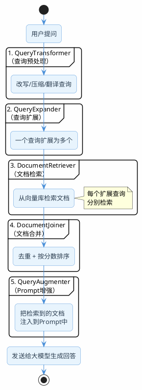

# RAG的组件拼接成流水线

前面几篇文章，我们逐个拆解了RAG的各个环节：问题改写、意图识别、混合检索、重排序、元数据过滤。每个环节都是独立的模块，各自解决一个具体问题。

但在实际项目中，这些模块需要串起来形成一条完整的流水线。手动串联当然可以（前面的代码示例就是这么做的），但如果框架能提供一个标准化的编排机制，开发效率会高很多。

Spring AI的`RetrievalAugmentationAdvisor`就是干这个事的——它定义了一套Modular RAG的标准流水线，把查询预处理、文档检索、后处理、Prompt增强这些步骤用插件化的方式组织起来。

:::info 先说实话
Spring AI的Modular RAG支持目前还比较基础，组件不多，灵活性也有限。但作为一个开箱即用的起点，它能帮你快速搭建一个标准的RAG流程，后续再根据需要替换或扩展其中的组件。
:::

## 流水线长什么样

`RetrievalAugmentationAdvisor`内部的处理流程是这样的：



五个组件，每个都是可插拔的。你可以只用其中几个，也可以全部用上。

这些组件背后的原理，在前面的文章中都有详细展开，下面这张表方便你快速跳转到对应的讲解：

| 组件 | 对应详细文档 |
|------|------------|
| CompressionQueryTransformer（多轮对话压缩） | [为什么要问题重写](/ai-interview/rag/query-rewrite) |
| RewriteQueryTransformer（查询优化） | [为什么要问题重写](/ai-interview/rag/query-rewrite) |
| TranslationQueryTransformer（查询翻译） | 本文首次介绍 |
| MultiQueryExpander（查询扩展） | [为什么要问题重写](/ai-interview/rag/query-rewrite) |
| VectorStoreDocumentRetriever（文档检索） | [向量检索核心算法深度剖析](/ai-interview/rag/vector-search-algorithms)、[元数据的过滤场景](/ai-interview/rag/metadata-filtering)、[混合检索的详细剖析](/ai-interview/rag/hybrid-search) |
| ConcatenationDocumentJoiner（文档合并） | 本文首次介绍 |
| ContextualQueryAugmenter（Prompt增强） | 本文首次介绍 |

## 最简用法：三行代码搞定RAG

先看最简单的用法，感受一下：

```java
@GetMapping("/simple-rag")
public String simpleRag(@RequestParam String question) {
    // 构建Advisor：只需要一个向量库就够了
    RetrievalAugmentationAdvisor advisor = RetrievalAugmentationAdvisor.builder()
            .documentRetriever(VectorStoreDocumentRetriever.builder()
                    .vectorStore(vectorStore)
                    .topK(5)
                    .similarityThreshold(0.5)
                    .build())
            .build();

    // 注册Advisor并调用
    return chatClient.prompt()
            .advisors(advisor)
            .user(question)
            .call()
            .content();
}
```

这三步就完成了一个基本的RAG：检索相关文档 → 注入Prompt → 大模型生成。Advisor会自动把检索到的文档拼接到Prompt中，格式类似：

```
Context information is below.
---------------------
[检索到的文档内容]
---------------------
Given the context information and no prior knowledge, answer the query.
Query: [用户的问题]
```

## 逐个拆解五大组件

### 组件一：QueryTransformer——查询预处理

在检索之前对用户的查询做预处理。Spring AI提供了三个内置实现，它们底层的原理都一样——发起一次LLM API调用来完成转换。换句话说，每用一个QueryTransformer就多一次LLM调用，使用时要注意延迟和成本的平衡。

**CompressionQueryTransformer：多轮对话压缩**

这个组件解决的就是前面讲的"指代消解"和"上下文补全"问题。它把对话历史和当前问题压缩成一个独立的查询。

```java
CompressionQueryTransformer compression = CompressionQueryTransformer.builder()
        .chatClientBuilder(chatClientBuilder)
        .build();

// 模拟多轮对话场景：用户先问了Python课程的价格，接着追问"那它有没有证书"
Query query = new Query("那它有没有证书？",
    List.of(
        new UserMessage("Python入门课多少钱？"),
        new AssistantMessage("Python入门课目前售价299元，包含60课时的视频教程和3个实战项目。")
    ),
    Collections.emptyMap());  // 第三个参数是上下文Map，没有就传空Map

Query result = compression.transform(query);
log.info("压缩改写后: {}", result.text());
// 日志输出类似：Python入门课是否提供结业证书？
```

它会调一次LLM，把对话历史中的上下文信息融入到当前查询中——"它"被替换成了"Python入门课"，"证书"被补全成了"结业证书"。相当于自动做了指代消解和信息补全。

:::tip Query构造函数的小细节
`Query`的构造函数需要三个参数：`text`（当前问题）、`history`（对话历史消息列表）、`context`（上下文Map）。没有额外上下文时，第三个参数传`Collections.emptyMap()`即可。对话历史要按时间顺序排列，交替放`UserMessage`和`AssistantMessage`。
:::

**RewriteQueryTransformer：查询优化**

去掉冗余表达，让查询更适合检索。它只管优化当前这一句话的表达方式——把口语化的说法转成知识库更可能用到的书面表达。

:::warning 和Compression的关键区别
Rewrite只看当前这一句话，**不看对话历史**。如果用户说"那它的原理是什么"，Rewrite会把多余的语气词优化掉，但"它"指的是谁，它搞不定。简单记：**多轮对话用Compression，单轮优化用Rewrite**。
:::

```java
RewriteQueryTransformer rewriter = RewriteQueryTransformer.builder()
        .chatClientBuilder(chatClientBuilder)
        .build();

Query query = new Query("ES查询太慢了怎么搞啊有没有什么好的优化方案");
Query result = rewriter.transform(query);
log.info("改写后: {}", result.text());
// 日志输出类似：Elasticsearch查询性能优化方案
```

**TranslationQueryTransformer：查询翻译**

把查询翻译成目标语言。适合知识库和用户语言不一致的场景。比如知识库存的是中文文档，用户用英文提问，直接用英文去检索肯定命中率很低，翻译一下再检索就好多了。

```java
TranslationQueryTransformer translator = TranslationQueryTransformer.builder()
        .chatClientBuilder(chatClientBuilder)
        .targetLanguage("zh")  // 目标语言设为中文
        .build();

Query query = new Query("How to configure Spring Boot auto-restart in development?");
Query result = translator.transform(query);
log.info("翻译后: {}", result.text());
// 日志输出类似：Spring Boot开发环境中如何配置自动重启？
```

反过来也行，如果知识库是英文的（比如官方英文文档），用户用中文提问，把`targetLanguage`设成`"en"`就可以了。


### 组件二：QueryExpander——查询扩展

把一个查询扩展成多个语义相关但表达不同的查询，分别检索后合并结果。这就是前面讲的"多样化"策略的框架级实现。

```java
MultiQueryExpander expander = MultiQueryExpander.builder()
        .chatClientBuilder(chatClientBuilder)
        .numberOfQueries(3)      // 扩展出3个查询
        .includeOriginal(true)   // 保留原始查询
        .build();

Query query = new Query("Redis持久化方式有哪些");
List<Query> expanded = expander.expand(query);
log.info("扩展后: {}", expanded);
// 日志输出4个查询（原始 + 3个扩展）：
// 1. Redis持久化方式有哪些
// 2. Redis RDB和AOF持久化机制的工作原理
// 3. Redis数据备份和恢复的配置方法
// 4. Redis持久化策略的优缺点对比及生产环境选择建议
```

每个扩展查询都会独立去向量库检索，最后由DocumentJoiner合并去重。这样做的好处是：即使某个表达方式检索不到结果，其他表达方式可能能检索到，提高了整体召回率。

### 组件三：DocumentRetriever——文档检索

这是唯一一个必须配置的组件。目前Spring AI只提供了`VectorStoreDocumentRetriever`一个实现。

```java
VectorStoreDocumentRetriever retriever = VectorStoreDocumentRetriever.builder()
        .vectorStore(vectorStore)
        .topK(10)
        .similarityThreshold(0.5)
        .filterExpression("category == 'tech-doc'")  // 元数据过滤
        .build();
```

如果你需要混合检索（向量+关键词），目前Spring AI没有内置支持，需要自己实现`DocumentRetriever`接口。

### 组件四：DocumentJoiner——文档合并

当QueryExpander把一个查询扩展成多个后，每个查询都会检索出一批文档。DocumentJoiner负责把这些文档合并成一个列表。

`ConcatenationDocumentJoiner`是默认实现，它做两件事：
1. 按文档ID去重（同一个文档被多个查询命中，只保留一份）
2. 按相似度分数降序排列

```java
ConcatenationDocumentJoiner joiner = new ConcatenationDocumentJoiner();
```

一般不需要自定义，默认的就够用了。

### 组件五：QueryAugmenter——Prompt增强

检索完成后，把文档内容注入到发给大模型的Prompt中。这是整个流水线最后一个环节，也是直接决定大模型"看到什么"的关键步骤。

`ContextualQueryAugmenter`是默认实现，它会把检索到的文档内容和用户的原始问题组装成一个完整的Prompt。通过debug可以看到，最终发给大模型的Prompt长这样：

```
Context information is below.
---------------------
[文档1的内容]
[文档2的内容]
...
---------------------
Given the context information and no prior knowledge, answer the query.
Follow these rules:
1. If the answer is not in the context, just say that you don't know.
2. Avoid statements like "Based on the context..." or "The provided information...".

Query: [用户的问题]
Answer:
```

注意Prompt里的两条规则：第一条要求大模型只根据检索到的内容回答，找不到就说不知道；第二条要求大模型不要说"根据上下文"之类的套话。这两条规则对减少幻觉很有帮助。

```java
// 默认配置
QueryAugmenter augmenter = ContextualQueryAugmenter.builder().build();

// 如果希望检索结果为空时也不报错，让大模型用自己的知识回答
QueryAugmenter augmenter = ContextualQueryAugmenter.builder()
        .allowEmptyContext(true)
        .build();
```

`allowEmptyContext`这个参数比较实用：默认情况下，如果检索不到任何文档，它会明确告诉大模型"没有找到相关信息"，让大模型据实回答而不是编造。但如果你希望检索为空时也让大模型尝试用自身知识回答，就把`allowEmptyContext`设为`true`。

## 全组件组装实战

把五个组件全部用上，组装一条完整的RAG流水线：

```java
@RestController
@RequestMapping("/api/modular-rag")
public class ModularRagController {

    private final ChatClient chatClient;
    private final VectorStore vectorStore;
    private final ChatClient.Builder chatClientBuilder;

    @GetMapping("/chat")
    public Flux<String> chat(@RequestParam String question) {
        // 组装完整的Modular RAG流水线
        RetrievalAugmentationAdvisor advisor = RetrievalAugmentationAdvisor.builder()
                // 1. 查询预处理：优化表达
                .queryTransformers(
                    RewriteQueryTransformer.builder()
                            .chatClientBuilder(chatClientBuilder)
                            .build())
                // 2. 查询扩展：一个变多个
                .queryExpander(
                    MultiQueryExpander.builder()
                            .chatClientBuilder(chatClientBuilder)
                            .numberOfQueries(3)
                            .includeOriginal(true)
                            .build())
                // 3. 文档检索
                .documentRetriever(
                    VectorStoreDocumentRetriever.builder()
                            .vectorStore(vectorStore)
                            .topK(10)
                            .similarityThreshold(0.4)
                            .build())
                // 4. 文档合并（默认实现，可以不显式配置）
                .documentJoiner(new ConcatenationDocumentJoiner())
                // 5. Prompt增强（检索为空时明确告知大模型）
                .queryAugmenter(ContextualQueryAugmenter.builder()
                        .allowEmptyContext(false)
                        .build())
                .build();

        return chatClient.prompt()
                .advisors(advisor)
                .user(question)
                .stream()
                .content();
    }
}
```

### 带元数据过滤的版本

如果需要根据用户传入的条件做元数据过滤：

```java
@GetMapping("/chat-filtered")
public Flux<String> chatFiltered(@RequestParam String question,
                                  @RequestParam(required = false) String version) {
    RetrievalAugmentationAdvisor advisor = RetrievalAugmentationAdvisor.builder()
            .documentRetriever(
                VectorStoreDocumentRetriever.builder()
                        .vectorStore(vectorStore)
                        .topK(5)
                        .similarityThreshold(0.5)
                        .build())
            .build();

    var prompt = chatClient.prompt()
            .advisors(advisor)
            .user(question);

    // 动态传入过滤表达式
    if (version != null) {
        prompt.advisors(spec -> spec.param(
                VectorStoreDocumentRetriever.FILTER_EXPRESSION,
                "version == '" + version + "'"));
    }

    return prompt.stream().content();
}
```

### 带多轮对话支持的版本

如果需要处理多轮对话中的指代问题，用CompressionQueryTransformer替换RewriteQueryTransformer。注意：需要把对话历史通过`.messages(history)`传给ChatClient，Compression才能拿到上下文做压缩。

```java
@GetMapping("/chat-with-history")
public Flux<String> chatWithHistory(@RequestParam String question,
                                     @RequestParam String sessionId) {
    // 获取对话历史
    List<Message> history = sessionStore.getHistory(sessionId);

    RetrievalAugmentationAdvisor advisor = RetrievalAugmentationAdvisor.builder()
            .queryTransformers(
                CompressionQueryTransformer.builder()
                        .chatClientBuilder(chatClientBuilder)
                        .build())
            .documentRetriever(
                VectorStoreDocumentRetriever.builder()
                        .vectorStore(vectorStore)
                        .topK(5)
                        .build())
            .build();

    return chatClient.prompt()
            .advisors(advisor)
            .messages(history)  // 传入对话历史
            .user(question)
            .stream()
            .content();
}
```


## Spring AI vs LangChain4j：文档处理能力对比

Java生态做RAG，主要就是Spring AI（含Spring AI Alibaba）和LangChain4j两个框架。它们在文档处理方面各有侧重：

| 能力维度 | Spring AI（+ Alibaba） | LangChain4j |
|---------|----------------------|-------------|
| 文档读取 | 本地文件、云存储（COS/OSS）、数据库（MySQL/MongoDB/ES）、在线平台（GitHub/Yuque/Notion）、邮件、压缩包 | Amazon S3、Azure Blob、Google Cloud Storage、本地文件、GitHub、URL |
| 文档解析 | PDF、Markdown、YAML、HTML、Tika（Office全家桶）、图片OCR、语音转文字 | TextDocumentParser、ApacheTikaDocumentParser、ApachePoiDocumentParser、MarkdownDocumentParser |
| 文本切分 | TokenTextSplitter（定长）、SentenceSplitter（语义）、RecursiveCharacterTextSplitter（递归） | DocumentByParagraphSplitter、DocumentByLineSplitter、DocumentBySentenceSplitter、DocumentByWordSplitter、DocumentByRegexSplitter、DocumentSplitters.recursive |
| 文档清洗 | 暂无内置支持 | HtmlToTextDocumentTransformer |
| 元数据增强 | ContentFormatTransformer、KeywordMetadataEnricher、SummaryMetadataEnricher | 暂无内置支持 |

简单总结：
- Spring AI的数据源接入更广（特别是加上Alibaba扩展后，国内的云存储和在线平台支持很好）
- LangChain4j的文本切分选项更多更细（按段落、按行、按句子、按词、按正则都有）
- Spring AI有元数据增强能力（自动提取关键词、生成摘要），LangChain4j没有
- LangChain4j有HTML清洗，Spring AI没有

实际项目中，两者可以混用。比如用LangChain4j的细粒度切分器处理文档，用Spring AI的VectorStore和Advisor做检索和RAG编排。

## Modular RAG的局限和应对

Spring AI的Modular RAG目前有几个明显的不足：

**没有内置重排序**

流水线里没有Reranker组件。如果需要重排序，要么自己实现一个`DocumentPostProcessor`，要么在Advisor外面手动加一层。

```java
// 变通方案：在Advisor之外手动加重排序
List<Document> docs = retriever.retrieve(query);
List<Document> reranked = rerankerService.rerank(query, docs);
// 然后手动构建Prompt...
```

**没有内置混合检索**

DocumentRetriever只有向量检索一个实现。如果需要混合检索，需要自己实现`DocumentRetriever`接口：

```java
public class HybridDocumentRetriever implements DocumentRetriever {

    private final VectorStore vectorStore;
    private final ElasticsearchService esService;

    @Override
    public List<Document> retrieve(Query query) {
        // 向量检索
        List<Document> vectorDocs = vectorStore.similaritySearch(
                SearchRequest.builder()
                        .query(query.text()).topK(20).build());

        // 关键词检索 + 转换为Document
        List<Document> esDocs = esService.searchByKeyword(query.text(), 20)
                .stream()
                .map(es -> new Document(es.getContent(),
                        Map.of("source", "elasticsearch")))
                .toList();

        // RRF融合
        return rrfFusion(vectorDocs, esDocs, 10);
    }
}
```

**QueryTransformer每次都调LLM**

三个内置的QueryTransformer（Compression、Rewrite、Translation）每次都会调一次LLM。如果同时用了QueryTransformer和QueryExpander，一次用户提问就要调2次LLM（改写1次+扩展1次），再加上最终生成，总共3次LLM调用。延迟和成本都不低。

应对方案：
1. 不要同时用QueryTransformer和QueryExpander，选一个就行
2. 加缓存，相同的查询不重复改写
3. 用小模型做改写和扩展，大模型只用于最终生成
4. **启发式前置判断**——在调LLM之前先用规则快速过滤，能省掉30-40%的无效调用

第4点在实际项目中特别管用。我们在前面问题改写的章节里也提到过，可以用简单规则先判断当前问题是否需要改写：

```java
/**
 * 启发式判断：是否需要改写
 * 先用简单规则快速过滤，能省掉不少不必要的LLM调用
 */
private boolean needsRewrite(String question, List<Message> history) {
    if (history == null || history.isEmpty()) {
        // 没有对话历史，问题够长就不需要改写
        return question.length() < 6;
    }
    // 包含代词（它、这个、那个等），大概率需要指代消解
    String[] pronouns = {"它", "这个", "那个", "他", "她", "上面", "刚才", "之前"};
    for (String p : pronouns) {
        if (question.contains(p)) return true;
    }
    // 问题太短，可能省略了信息
    return question.length() < 10;
}
```

再加上缓存，同一个session里相同的问题不重复调LLM：

```java
private final Map<String, String> rewriteCache = new ConcurrentHashMap<>();

public String rewriteWithCache(String sessionId, String question, List<Message> history) {
    String cacheKey = sessionId + ":" + question.hashCode();
    return rewriteCache.computeIfAbsent(cacheKey, k -> safeRewrite(question, history));
}
```

还有一点容易被忽略：**LLM调用失败时的兜底**。改写服务出错不能让整个RAG挂掉，回退到原始问题继续走就行：

```java
public String safeRewrite(String question, List<Message> history) {
    try {
        String result = rewrite(question, history);
        if (result != null && !result.isBlank() && result.length() < 500) {
            return result;
        }
        return question;
    } catch (Exception e) {
        log.warn("问题改写失败，回退到原始问题: {}", e.getMessage());
        return question;  // 兜底：用原始问题继续走
    }
}
```

## 什么时候用Modular RAG，什么时候自己编排

| 场景 | 推荐方案 |
|------|---------|
| 快速原型、Demo演示 | Modular RAG，开箱即用 |
| 标准RAG，不需要混合检索和重排序 | Modular RAG，够用 |
| 需要混合检索、重排序、自定义逻辑 | 自己编排，更灵活 |
| 需要意图识别和多通道路由 | 自己编排，Modular RAG不支持路由 |
| 生产环境，对性能和可观测性要求高 | 自己编排，方便加日志、监控、降级 |

实际上这两种方式不是非此即彼的——你完全可以**混合使用**。比如在RetrievalAugmentationAdvisor外面包一层自定义逻辑：

```java
@GetMapping("/smart-chat")
public Flux<String> smartChat(@RequestParam String question,
                               @RequestParam String sessionId) {
    List<Message> history = sessionStore.getHistory(sessionId);

    // 第一步：自定义改写（带启发式判断和缓存）
    String rewritten = queryRewriteService.rewriteWithCache(sessionId, question, history);
    log.info("改写结果: {} -> {}", question, rewritten);

    // 第二步：用Modular RAG做标准流程
    RetrievalAugmentationAdvisor advisor = RetrievalAugmentationAdvisor.builder()
            .queryExpander(MultiQueryExpander.builder()
                    .chatClientBuilder(chatClientBuilder)
                    .numberOfQueries(3)
                    .includeOriginal(true)
                    .build())
            .documentRetriever(VectorStoreDocumentRetriever.builder()
                    .vectorStore(vectorStore)
                    .topK(5)
                    .similarityThreshold(0.5)
                    .build())
            .queryAugmenter(ContextualQueryAugmenter.builder()
                    .allowEmptyContext(false)
                    .build())
            .build();

    // 用改写后的问题去走流水线
    return chatClient.prompt()
            .advisors(advisor)
            .user(rewritten)
            .stream()
            .content();
}
```

这种方式的好处是：查询改写用自己的实现（可以加启发式判断、缓存、兜底），后面的扩展、检索、拼接、增强还是用框架的标准组件。哪天框架的内置改写能力增强了，把自定义改写替换掉就行，其他部分不用动。

:::info 务实的建议
如果你的项目刚起步，用Modular RAG快速跑通一个基本版本。等业务需求复杂了（需要混合检索、重排序、意图路由），再逐步替换成自己编排的方案。也可以两者混合：自定义改写+框架编排，各取所长。前面几篇文章讲的所有模块（改写、路由、混合检索、重排序、元数据过滤、Graph RAG）都可以自由组合，不受框架限制。
:::

:::tip 小结
Spring AI的Modular RAG通过RetrievalAugmentationAdvisor提供了一条标准化的RAG流水线，包含查询预处理、查询扩展、文档检索、文档合并、Prompt增强五个可插拔组件。开箱即用，适合快速搭建标准RAG。但目前缺少重排序和混合检索的内置支持，复杂场景下建议自己编排，或者采用"自定义改写+框架编排"的混合方案。生产环境中别忘了加上启发式前置判断、缓存和兜底逻辑来控制LLM调用的开销。
:::
