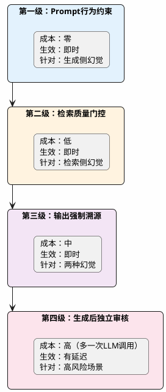

# RAG系统幻觉治理实战

很多人有个误解：做了RAG，给大模型喂了参考资料，它就不会编造内容了。

真实情况是——RAG确实能大幅降低幻觉概率，但远没到可以一点幻觉都没有的程度。来看两个线上翻车案例：

**案例一：某企业内部问答系统**

员工问："公司2024年年假政策有什么变化？"

系统回答："2024年起，员工年假从10天调整为15天，且支持跨年累计..."

实际情况是知识库里根本没有2024年的年假文件（还没入库），系统用的是一段2022年的旧政策片段，大模型自作主张做了"合理推断"。

**案例二：某医疗健康问答**

用户问："布洛芬和阿莫西林能一起吃吗？"

知识库确实召回了一段关于布洛芬的说明，也召回了一段关于阿莫西林的说明。但两段内容都没有明确提到二者的相互作用。大模型把两段内容"综合"了一下，给出了"可以同时服用，注意间隔2小时"的建议——这句话纯属大模型自己编的。

## 幻觉的两条产生路径

搞清楚幻觉怎么来的，才能对症下药。RAG系统的幻觉有两个完全不同的源头，解决的方案也完全不同。

```plantuml title="RAG幻觉的两条产生路径" width="100%" align="left"
@startuml
skinparam backgroundColor #FEFEFE
skinparam roundcorner 12
skinparam shadowing false
skinparam defaultFontName "Microsoft YaHei"
skinparam defaultFontSize 13

skinparam activity {
    BackgroundColor #E8F4FD
    BorderColor #4A90D9
    FontColor #2C3E50
    ArrowColor #4A90D9
}

start
:用户提问;

if (检索到相关文档?) then (没有)
  :路径A: 检索侧幻觉
  LLM没有可参考的材料
  只能靠训练时学到的记忆"现编"; <<#FFE0E0>>
  stop
else (有)
  if (LLM严格按资料回答?) then (没有)
    :路径B: 生成侧幻觉
    资料塞进去了，但LLM添油加醋
    在原文基础上加了自己的推断; <<#FFF3E0>>
    stop
  else (是)
    :正常输出
    忠实于检索内容，没有幻觉; <<#E8F5E9>>
    stop
  endif
endif
@enduml
```

### 路径A：检索侧——知识库里找不到答案

这种情况的根因很简单：用户问的东西，知识库里就没收录，或者收录了但检索没捞上来。

大模型面对一个空空如也的上下文（或者全是不相关的文档碎片），它不会老实说"我不知道"。为什么？因为在预训练阶段，模型见过海量的问答数据，它学到的模式就是"有人问我就要回答"。所以它会用自己训练时积累的"记忆"拼凑一个答案。

这个答案可能碰巧是对的（模型确实记住了这个知识），也可能完全是错的（模型的记忆是过时的、片面的、甚至是错误的训练数据）。关键问题在于——你没法区分哪个是对的哪个是错的，因为它说的时候都一样自信。

### 路径B：生成侧——资料给了但没"老实抄"

这种更隐蔽。你打开调试日志一看，检索结果确实包含了正确的段落，但大模型在回答时悄悄做了以下操作中的一种或多种：

- **过度推断**：原文说"该产品支持IPv6"，大模型补了一句"因此也兼容所有IPv4网络"——这个因果关系是模型自己加的
- **信息混搭**：从chunk A取了一段，从chunk B取了一段，拼出一个原文里不存在的结论
- **数值篡改**：原文写的是"最大支持100并发"，大模型在回答里写成了"支持1000并发"
- **补充细节**：原文只说了"支持定时任务"，大模型补充了具体的cron表达式语法——但知识库里根本没有这段内容

为什么会这样？因为大模型本质上是个"概率续写机"，它在生成每个token时，会同时参考prompt中的上下文和自己的参数权重里存储的知识。当这两者之间有gap时，模型有时候会用自己的知识去"补全"那个gap。

## 四级防控体系

知道了问题所在，下面看具体的解决办法。按照实施成本从低到高排列：



### 第一级：在Prompt里立规矩

实施成本几乎为零，效果立竿见影。核心思路就是在System Prompt中给大模型设定明确的行为边界。

很多团队搭RAG的时候，System Prompt就一句"请根据以下资料回答用户的问题"。这种模糊的指令约束力很弱。你得像写员工守则一样，把边界写清楚：

```text
## 你的工作职责
你是一个企业知识库助手。你的回答必须完全基于【参考资料】部分提供的内容。

## 必须遵守的红线
1. 只使用参考资料中明确包含的信息回答，禁止引入任何资料以外的知识
2. 参考资料中找不到答案时，回复："抱歉，当前知识库中没有找到相关信息，建议联系XX部门确认"
3. 每个关键结论后面用括号标注来源，格式：（来源：资料X）
4. 不做任何推断、类比、引申，只陈述资料中的原始信息
5. 如果资料中只提到了部分信息，就只回答已有的部分，明确告知"关于XX的细节，资料中暂未涉及"
```

这五条规则各有分工：

- 第1条划定了知识范围——只准用"开卷"的内容
- 第2条给了模型一个合理的"拒答出口"——允许说不知道，比硬撑一个错误答案好得多
- 第3条强制溯源——让模型回答时必须"对照原文"，这个动作本身就会降低编造概率
- 第4条堵住"推断"这条路——很多生成侧幻觉就是从推断开始的
- 第5条处理了"部分有答案"的灰色地带

:::tip 一个容易踩的坑
很多人会写"如果不确定就说不知道"——这句话对大模型基本没用。因为大模型不会觉得自己"不确定"，它生成每个token时都挺自信的。正确的写法是用客观条件判断，比如"参考资料中没有包含相关信息时"，这是模型可以做出的事实判断。
:::

### 第二级：检索分数不达标就拒答

第一级解决的是"资料给了但模型不老实"的问题。那如果资料本身就没给对呢？这时候需要在检索结果进入LLM之前做一道质量关卡。

思路并不难：用Rerank模型给每个检索结果打一个相关度分数，分数低于某个阈值，说明这次检索没找到高质量的相关内容，直接返回"知识库中暂无相关信息"，不让LLM去硬解一堆不相关的文档碎片。

```java
@Service
public class RetrievalQualityGate {

    private final RerankerService reranker;
    // 阈值需要根据业务场景调试，一般从0.4开始往上调
    @Value("${rag.quality-gate.threshold:0.45}")
    private double scoreThreshold;

    /**
     * 对检索结果做质量过滤
     * 返回null表示本次检索质量不达标，应该走拒答逻辑
     */
    public List<Document> filterOrReject(String query, List<Document> candidates) {
        if (candidates == null || candidates.isEmpty()) {
            return null; // 没有候选，走拒答
        }

        // Rerank打分
        List<ScoredDocument> scored = reranker.rerank(query, candidates);

        // 取最高分判断整体检索质量
        double topScore = scored.get(0).getScore();
        if (topScore < scoreThreshold) {
            log.info("检索质量不达标，最高分={}, 阈值={}, query={}", 
                     topScore, scoreThreshold, query);
            return null; // 走拒答
        }

        // 只保留达标的文档
        return scored.stream()
                .filter(d -> d.getScore() >= scoreThreshold * 0.7) // 放宽一点保留次优的
                .map(ScoredDocument::getDocument)
                .toList();
    }
}
```

:::info 阈值怎么定
我的做法是准备两组测试数据：一组是"知识库确实有答案的问题"，一组是"知识库肯定没答案的问题"。两组分别跑一遍Rerank，看分数分布，找到能把两组分开的那个临界点。金融、医疗这类容错率低的场景，宁愿阈值设高一点多拒答，也别给用户错误信息。
:::

第一级和第二级组合起来，就形成了一道"双保险"：第二级在入口处拦截低质量检索，第一级在出口处约束模型行为。大部分RAG系统靠这两招就能把幻觉率压到可接受的水平。

### 第三级：强制输出带来源标注

前两级是预防，第三级是让幻觉"无处藏身"。

做法是要求大模型以结构化的格式输出，每条关键信息必须关联到具体的参考资料编号。这样做有两个好处：

1. **对模型行为的隐性约束**——当模型知道每句话都要标注出处时，它在生成过程中会更倾向于"从资料中找依据"，因为编造一个说法然后还要编造一个来源的难度比直接编造一个说法要高
2. **对输出的程序化校验**——后端拿到结构化输出后，可以自动检查source_id指向的chunk和claim之间是否语义相关，不相关的就标记为"待确认"

Prompt模板：

```text
请以JSON格式回答，结构如下：
{
  "answer": "完整的回答内容",
  "claims": [
    {"statement": "某个关键结论", "source_ids": [1, 3]},
    {"statement": "另一个结论", "source_ids": [2]}
  ],
  "confidence": "high/medium/low",
  "gaps": "资料中未覆盖但用户可能关心的点（如果有的话）"
}

规则：
- source_ids必须引用参考资料的实际编号，不得虚构
- 如果某个结论在参考资料中找不到明确依据，不要写进claims里
- confidence字段反映参考资料对回答该问题的覆盖程度
```

后端拿到这个JSON后做自动化校验：

```java
public ValidationResult validateClaims(StructuredAnswer answer, List<Document> chunks) {
    List<String> unverified = new ArrayList<>();
    
    for (Claim claim : answer.getClaims()) {
        boolean hasSupport = claim.getSourceIds().stream()
            .anyMatch(id -> {
                Document chunk = chunks.get(id - 1);
                // 用语义相似度判断claim和对应chunk是否相关
                double similarity = embeddingService.cosineSimilarity(
                    claim.getStatement(), chunk.getContent());
                return similarity > 0.6;
            });
        
        if (!hasSupport) {
            unverified.add(claim.getStatement());
        }
    }
    
    return new ValidationResult(unverified.isEmpty(), unverified);
}
```

### 第四级：生成后独立审核

最后一道防线——用一个独立的LLM调用来审核生成结果。这招成本最高（多一次API调用、多一轮延迟），但在高风险场景下值得投入。

工作方式是：把第一次LLM生成的答案连同原始的检索chunk一起，发给另一个LLM（或同一个模型的另一次调用），让它逐条审查答案中的每个声明是否在chunk中有依据。

```java
@Service
public class HallucinationAuditor {

    private final ChatClient auditorClient;

    private static final String AUDIT_PROMPT = """
        你是一个事实核查员。下面有一段【回答】和一组【参考资料】。
        
        你的任务：逐句检查回答中的每个事实性声明，判断它在参考资料中是否有依据。
        
        判断标准：
        - SUPPORTED: 参考资料中有明确的内容支持该声明
        - UNSUPPORTED: 参考资料中没有任何内容支持该声明
        - PARTIAL: 部分有依据，但声明中有细节超出了资料范围
        
        输出JSON数组，每个元素包含：statement, verdict, evidence_snippet(如果SUPPORTED则附原文片段)
        
        【回答】
        %s
        
        【参考资料】
        %s
        """;

    public AuditResult audit(String generatedAnswer, List<Document> sourceChunks) {
        String chunksText = IntStream.range(0, sourceChunks.size())
            .mapToObj(i -> "[资料" + (i+1) + "] " + sourceChunks.get(i).getContent())
            .collect(Collectors.joining("\n\n"));

        String response = auditorClient.prompt()
            .user(String.format(AUDIT_PROMPT, generatedAnswer, chunksText))
            .call()
            .content();

        // 解析审核结果，标记有问题的声明
        List<AuditItem> items = parseAuditResponse(response);
        
        long unsupportedCount = items.stream()
            .filter(item -> "UNSUPPORTED".equals(item.getVerdict()))
            .count();
        
        // 如果有不支持的声明，需要人工介入或重新生成
        return new AuditResult(unsupportedCount == 0, items);
    }
}
```

:::warning 第四级的使用场景
这个方案延迟翻倍、成本翻倍，不适合所有场景。推荐用在：医疗健康问答、法律合规咨询、金融投资建议——这些领域答错了可能有法律风险。普通的企业知识库问答，做到第二级就足够了。
:::

## 生产环境的组合策略

四级防控不是"每个都得上"，而是根据业务风险等级选择合适的组合：

| 业务场景 | 推荐组合 | 理由 |
|---------|---------|------|
| 企业内部FAQ、产品手册问答 | 第一级 + 第二级 | 成本低、见效快，偶尔答错后果可控 |
| 对外客服系统 | 第一级 + 第二级 + 第三级 | 需要溯源能力，出了问题好排查 |
| 医疗/法律/金融咨询 | 四级全上 | 答错可能有法律后果，宁可慢也不能错 |

:::info 一个经常被忽视的点
治幻觉的最佳起点，永远是提升检索质量。前面几篇文章讲的Query改写、混合检索、重排序，每一个做好了都在减少幻觉的土壤。把这些基础做扎实了，幻觉自然就少了大半。上面四级防控是在检索已经做到位的前提下，再加的安全防护。
:::

## 上线后的幻觉监控

防控做了，还得有观测手段知道线上跑得怎么样。几个实用的监控指标：

**主动监控**：定期用一组"陷阱问题"去测试系统——这些问题的答案明确不在知识库里，看系统是不是真的会拒答。如果系统开始"回答"这些本该拒答的问题，说明某个环节出了退化。

**被动收集**：用户点"踩"的时候，把该条问答的完整链路（query → 检索结果 → rerank分数 → 最终回答）全部记下来。攒够一批后做分析，看是检索没召回到，还是召回了但模型没听话。

**自动化抽检**：每天随机抽取N条线上问答，跑一遍第三级的溯源校验，统计"无法溯源"的比例。这个比例如果突然升高，说明最近入库的文档质量可能有问题，或者模型API的行为发生了变化。

:::tip 小结
RAG系统的幻觉有两个完全不同的根源：检索侧（没找到相关资料，模型靠记忆编造）和生成侧（资料给了，但模型添油加醋）。治疗方案分四级递进：Prompt约束 → 检索质量门控 → 输出强制溯源 → 生成后审核。大多数业务场景做到前两级就够了，高风险场景按需叠加第三、四级。记住一条铁律：幻觉的最大来源是检索质量差，把检索做好就是最好的幻觉治理。
:::
