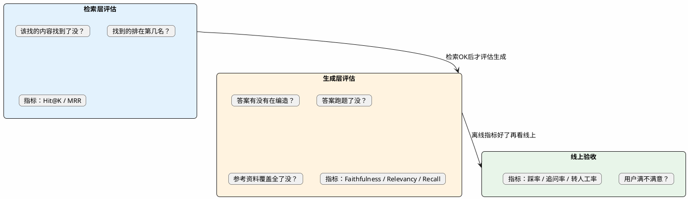

# RAG效果评估与量化指标

:::tip 实战项目推荐
RAG 评估不能只看最终回答。超级 AI 智能体提供三级知识路由评测和链路观测能力，适合把 Hit@K、MRR、重排序效果和最终回答质量结合起来分析。

项目详细介绍：**[什么是超级 AI 智能体？](/super-agent/overview/project-intro)**
:::

## 为什么"用户没投诉"不等于"效果好"

一个很常见的场景：RAG系统上线了三个月，团队觉得挺稳的——用户投诉也不多，没出什么大事故。但仔细看数据发现：30%的用户在第一次对话后就再也没回来过。

用户不投诉的原因可能有很多——他们直接放弃了、找了其他渠道、或者根本懒得反馈。用"没有差评"来判断系统效果，就像用"没人报警"来判断一条路安不安全一样不靠谱。

系统性的RAG评估需要解决三个问题：

1. **能量化**——用数字说话，不是"感觉还行"
2. **能定位**——知道问题出在哪个环节（检索层还是生成层）
3. **能持续**——每次迭代都跑一遍，知道是变好了还是变差了

## 分层评估的核心思路

RAG系统是一条流水线：Query → 检索 → 生成。出了问题可能是任何一个环节的锅。如果只看最终答案好不好，定位不了原因。

正确的做法是把评估拆成两层分别打分：



## 检索层：用Hit@K和MRR量化"找得准不准"

检索层评估不看大模型的输出，只看一件事：**对于这个问题，正确的文档段落有没有被捞出来。**

前提条件：你需要准备一批测试数据，每条包含"问题"和"对应的正确chunk ID"。这个数据集可以从历史用户问答中标注，也可以让业务同事整理一批典型QA对。50-100条就能看出大趋势了。

### Hit@K：前K条里有没有正确答案

Hit@K的逻辑极其简单——检索返回的前K个结果里，有没有包含正确的那个chunk？有就算命中，统计所有测试问题的命中率。

```
Hit@5 = 命中的问题数 / 总测试问题数
```

举个例子，100个测试问题，设K=5。其中有78个问题，正确答案都出现在了前5条检索结果里。那Hit@5 = 0.78。

这个指标回答的核心问题是："**找到了没**"。

经验参考值：
- Hit@5 > 0.85：检索层状态良好
- Hit@5 在0.7-0.85之间：还有优化空间，考虑调整Chunk策略或换Embedding模型
- Hit@5 < 0.7：检索层有严重问题，需要排查

### MRR：正确答案排第几

Hit@K只管"有没有找到"，不关心排在哪。MRR（Mean Reciprocal Rank，平均倒数排名）进一步追问：找到了的话，排在第几名？

计算方式是对每个问题取正确答案的排名，算1/排名，然后对所有问题取平均：

```
单个问题的分数 = 1 / 正确答案的排名
MRR = 所有问题分数的平均值
```

第1名找到得1分，第2名得0.5分，第3名得0.33分，第5名得0.2分。排名越靠后，分数衰减得越快。

为什么排名重要？因为送给大模型的文档数量是有限的（一般top 3-5个），正确答案排在第1和排在第8，最终效果差距巨大。

经验参考值：
- MRR > 0.7：正确内容基本在前两名
- MRR 0.4-0.7：正确内容能找到但排名偏后，Rerank可能需要加强
- MRR < 0.4：排序严重不准

:::info Hit@K和MRR配合使用才有诊断价值
一个典型的场景：Hit@5=0.9但MRR=0.35。这说明什么？说明90%的问题在前5条里都能找到正确答案（检索层召回能力OK），但正确答案普遍排在第3、4、5名（排序不太行）。诊断结论：Embedding或BM25的粗排能力够，但Reranker的精排能力不足，需要换一个更强的Rerank模型或者调整参数。
:::

### 检索层评估的代码框架

```java
@Service
public class RetrievalEvaluator {

    private final VectorStore vectorStore;

    /**
     * 跑一遍Hit@K和MRR
     * @param testSet 测试集：问题 -> 正确chunk的ID列表
     * @param topK 取前几条
     */
    public EvalResult evaluate(Map<String, List<String>> testSet, int topK) {
        int hitCount = 0;
        double reciprocalRankSum = 0.0;

        for (Map.Entry<String, List<String>> entry : testSet.entrySet()) {
            String question = entry.getKey();
            List<String> correctIds = entry.getValue();

            // 执行检索
            List<Document> results = vectorStore.similaritySearch(
                SearchRequest.builder().query(question).topK(topK).build());

            // 检查Hit
            List<String> resultIds = results.stream()
                .map(Document::getId).toList();

            boolean hit = correctIds.stream()
                .anyMatch(resultIds::contains);
            if (hit) hitCount++;

            // 计算Reciprocal Rank
            for (int i = 0; i < resultIds.size(); i++) {
                if (correctIds.contains(resultIds.get(i))) {
                    reciprocalRankSum += 1.0 / (i + 1);
                    break; // 取第一个命中的位置
                }
            }
        }

        int total = testSet.size();
        return new EvalResult(
            (double) hitCount / total,        // Hit@K
            reciprocalRankSum / total          // MRR
        );
    }
}
```

## 生成层：用RAGAs框架做自动打分

检索层确认没问题了，接下来看生成层——大模型拿到这些资料后，回答得好不好？

人工判断成本太高、主观性太强。RAGAs（Retrieval Augmented Generation Assessment）框架的做法是用另一个LLM来当裁判，自动给答案打分。核心思路叫"LLM-as-a-Judge"。

RAGAs有四个核心指标，分别从不同角度衡量答案质量：

### Faithfulness：有没有编造

评估的是答案中的每个声明是否都能在检索到的chunk中找到依据。可以理解为"忠诚度"——模型有没有老老实实照着资料说？

打分方式：裁判LLM把答案拆成一条条独立声明，逐条去检索结果中找依据。有依据的声明占总声明数的比例就是Faithfulness分数。

```
Faithfulness = 有依据的声明数 / 总声明数
```

Faithfulness低 → 说明模型在编造，可能的原因：Prompt约束不够严、检索塞了太多噪音文档、模型本身倾向于"发挥"。

目标值：> 0.85

### Answer Relevancy：跑题了没

看答案和问题是不是一回事。这和Faithfulness是两个完全不同的维度——一个答案可能字字有据（Faithfulness高），但完全没回答用户问的东西（Relevancy低）。

打个比方：你问"公司食堂中午几点开门？"，系统回答了一大段关于食堂菜品和价格的信息——都是有据可查的，但压根没回答"几点开门"。

目标值：> 0.8

### Context Recall：资料有没有覆盖全

评估的是：回答这个问题所需的信息，在检索结果中覆盖了多少比例。这个指标需要有标准答案（ground truth）做参照。

Context Recall低 → 说明检索层遗漏了关键信息，需要加强召回策略（多路召回、查询扩展等）。

目标值：> 0.75

### Context Precision：有用的内容排前面了没

和Context Recall配对出现。Recall看"有没有找全"，Precision看"找到的里面有用的是不是靠前"。

如果检索返回了10个chunk，其中有3个是相关的但排在第6、8、10位，前5个全是噪音——Context Precision就会很低。这意味着Reranker没把有价值的内容推到前面。

## 四个指标的诊断矩阵

单看一个指标意义有限，组合起来才能定位问题根源：

| 指标组合 | 说明了什么问题 | 优化方向 |
|---------|-------------|---------|
| Context Recall低，其他正常 | 检索漏了关键内容 | 换Embedding模型、加多路召回、调整Chunk策略 |
| Context Precision低，Recall正常 | 召回了但排序差，噪音多 | 加强Rerank、减少送入LLM的文档数 |
| Faithfulness低，Context指标正常 | 资料给对了但模型在编 | 加强Prompt约束、考虑换一个更听话的模型 |
| Answer Relevancy低，其他正常 | 答案跑题了 | 优化Prompt中的任务描述、加Query改写确保意图准确 |
| 多个指标同时低 | 系统性问题 | 从头排查：文档质量→Chunk→Embedding→检索→生成 |

## 线上业务指标：最终的验收标准

离线跑出来的分数再好看，也得线上用户认可才算数。几个关键的线上指标：

**点踩率（Thumbs Down Rate）**——用户主动表示"这个回答不行"。最直接的负面信号。如果某类问题的点踩率异常高，拎出来看看是检索没召回还是生成有问题。

**追问率（Follow-up Rate）**——用户紧接着问了"不是这个意思"或者重复问同一个问题。说明第一次回答没用。

**转人工率（Escalation Rate）**——用户放弃AI直接找人工。偏高说明用户对AI的信任度低，或者知识库覆盖面不够。

**空回答率（Empty Answer Rate）**——系统主动说"不知道"的比例。过高说明知识库需要扩充内容，过低反而要警惕——可能是门控阈值设太松了，该拒答的没拒答。

**会话解决率（Resolution Rate）**——一次对话中用户的问题是否得到解决（可以通过用户是否继续追问、是否转人工来间接推断）。这是最综合的一个指标。

:::tip 离线和线上指标的关系
离线评估是"快速迭代工具"——改了策略立刻跑一遍测试集看分数变化，反馈速度快。线上指标是"最终裁判"——反映真实用户体验，但反馈周期长。两者形成闭环：离线测试通过 → 灰度上线 → 观察线上指标 → 发现问题 → 离线复现和修复 → 再上线。
:::

## 测试集怎么建

评估体系再好，没有好的测试集也白搭。几个实用的建议：

**起步阶段**：让业务同事整理50-100个高频问题及其标准答案。这些问题要覆盖知识库的主要类别。标注时同时记录"正确答案对应的chunk ID"，方便检索层评估。

**持续积累**：把线上被用户点踩的问答对收集起来，标注正确答案后加入测试集。这些是真实场景中翻车的案例，比自己编的测试case更有价值。

**边界case**：专门加一些"知识库里没有答案"的问题，测试系统是否正确拒答。加一些容易混淆的相似问题，测试检索的精确度。

**定期刷新**：知识库内容在更新，测试集也要跟着更新。每月至少检查一次，确保测试集中的标准答案和最新知识库内容一致。

:::tip 小结
RAG效果评估的核心思路是分层量化：检索层用Hit@K（找到没）和MRR（排第几）衡量召回质量，生成层用RAGAs框架的Faithfulness（有没有编造）、Answer Relevancy（跑题没）、Context Recall（资料全不全）做自动打分，线上用业务指标（踩率、追问率、转人工率）做最终验收。不同指标的组合可以精确定位问题出在哪个环节，让优化有数据支撑而不是凭感觉。
:::
