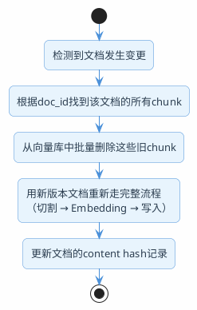
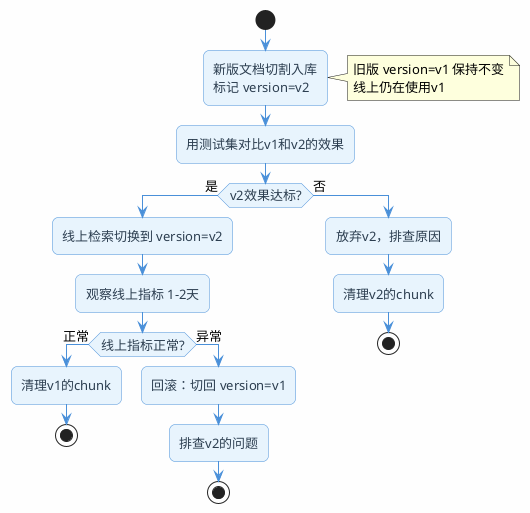

# 知识库动态更新工程实践

:::tip 实战项目推荐
知识库动态更新会影响文档、chunk、向量、元数据和缓存一致性。超级 AI 智能体包含文档管理和知识库处理记录，适合看动态更新如何进入后台管理流程。

项目详细介绍：**[什么是超级 AI 智能体？](/super-agent/overview/project-intro)**
:::

## 建完知识库只是开始

RAG的demo阶段，大家一般是把文档灌进去一次，然后就开始调检索、调Prompt。但生产环境的现实是：文档会改、会新增、会下线。

产品手册每个版本都在更新，运营的FAQ几乎每周都有变动，政策文件每季度修订一次。如果知识库不跟着变，用户问到新版本的内容时，RAG还在用旧文档回答，直接就变成了"过时信息制造机"。

所以知识库的动态更新能力，是RAG从demo走向生产的一个分水岭。

## 为什么"改哪个chunk就更新哪个"行不通

很多人第一直觉是：文档改了一段话，找到对应的那个chunk，重新做Embedding，更新进向量库。

听起来很合理，实际操作不通。原因在于：**一篇文档和向量库里的chunk之间，是一对多的关系，而且这个映射不是稳定的。**

想象你有一份10页的产品手册，切成了35个chunk。现在第3页中间加了两段话——文档变长了，切割边界全变了。原来的chunk_12覆盖的是第3页下半部分到第4页上半部分，现在同样的内容可能分散在新的chunk_12、chunk_13、chunk_14三个里面。旧的chunk_12和新的chunk之间已经没有一一对应的关系了。

这就好比一本书重新排版之后，原来的"第85页第3行"这个定位已经毫无意义了。

所以RAG知识库更新的正确姿势是：**不要尝试做chunk级别的局部更新，而是以文档为单位做"删旧入新"。**



三种变更类型的处理逻辑：

- **新增文档**：最简单，走完整入库流程就行，没有历史包袱
- **文档修改**：先删掉旧文档对应的所有chunk，再用新内容重新切割入库
- **文档删除**：找到该文档对应的所有chunk，批量从向量库中清除

## 设计好chunk和文档的关联关系

"删旧入新"这个操作的前提是：你得能通过一个文档ID，快速找到它在向量库里对应的所有chunk。这个关联关系如果一开始没设计好，后面做更新就会非常痛苦。

两种常见做法：

**方式一：chunk ID中编码文档ID**

命名规则类似 `{doc_id}_chunk_{序号}`，比如 `hr_policy_2024_chunk_001`。需要删除某文档的所有chunk时，按前缀模糊匹配就行。向量库一般都支持ID前缀查询。

**方式二：用metadata字段存关联**

每个chunk的metadata里带一个 `source_doc_id` 字段。需要删除时，按metadata过滤条件批量删。

```java
// 入库时设置metadata
Document chunk = new Document(
    chunkContent,
    Map.of(
        "source_doc_id", "hr_policy_2024",
        "source_doc_version", "v3",
        "chunk_index", "7",
        "ingested_at", Instant.now().toString()
    )
);

// 删除时按metadata过滤
vectorStore.delete(
    FilterExpression.builder()
        .eq("source_doc_id", "hr_policy_2024")
        .build()
);
```

:::info 推荐两种方式都做
ID编码方便快速定位，metadata字段方便灵活查询和统计。多存一个字段的成本几乎为零，但排查问题时能省很多力气。
:::

## 怎么知道文档变了

知道了"文档变了该怎么办"，下一个问题是"系统怎么感知到文档变了"。

### 内容hash检测

每次文档入库时，对文档全文算一个SHA256摘要，存到一张管理表里。下次处理这篇文档时，重新算hash对比：

- hash一样 → 内容没变，跳过
- hash不一样 → 内容有更新，触发删旧入新流程
- 管理表里没这个文档ID → 新文档，走入库流程
- 文档源里找不到这个ID了 → 文档被删了，触发清理流程

```java
@Service
public class DocumentChangeDetector {
    
    private final DocumentMetaRepository metaRepo;

    public ChangeType detect(String docId, String currentContent) {
        String currentHash = DigestUtils.sha256Hex(currentContent);
        
        Optional<DocumentMeta> existing = metaRepo.findByDocId(docId);
        
        if (existing.isEmpty()) {
            return ChangeType.NEW;
        }
        
        if (existing.get().getContentHash().equals(currentHash)) {
            return ChangeType.UNCHANGED;
        }
        
        return ChangeType.MODIFIED;
    }
    
    public List<String> findDeleted(Set<String> currentDocIds) {
        // 数据库中有记录但数据源中已经不存在的文档
        List<String> allTracked = metaRepo.findAllDocIds();
        return allTracked.stream()
            .filter(id -> !currentDocIds.contains(id))
            .toList();
    }
}
```

hash运算本身极快，几百万字的文档算一次也就几毫秒。如果文档量很大，可以先用"最后修改时间"做粗筛——只对修改时间发生变化的文档才算hash。这样能过滤掉99%没变化的文档。

## 两种主流的变更触发方式

感知到了变化，但这个"感知"动作由什么触发？两种主流方式：

### 定时轮询（Polling）

按固定频率扫描数据源，对比hash，处理有变化的文档。

适合：文档更新频率低的场景。企业内部知识库一周改不了几篇文档，每天凌晨跑一次同步任务完全够用。

```java
@Scheduled(cron = "0 0 2 * * ?") // 每天凌晨2点
public void syncKnowledgeBase() {
    List<RawDocument> allDocs = documentSource.fetchAll();
    Set<String> currentDocIds = new HashSet<>();
    
    for (RawDocument doc : allDocs) {
        currentDocIds.add(doc.getId());
        ChangeType change = changeDetector.detect(doc.getId(), doc.getContent());
        
        switch (change) {
            case NEW -> ingestPipeline.ingest(doc);
            case MODIFIED -> {
                vectorStore.deleteByDocId(doc.getId());
                ingestPipeline.ingest(doc);
            }
            case UNCHANGED -> {} // 跳过
        }
    }
    
    // 处理删除的文档
    List<String> deletedIds = changeDetector.findDeleted(currentDocIds);
    deletedIds.forEach(vectorStore::deleteByDocId);
}
```

优点：实现简单，不依赖额外组件。  
缺点：有延迟（改了文档到生效之间可能隔几小时），全量扫描有额外开销。

### 事件驱动（Event-Driven）

数据源发生变更时主动推送消息，知识库更新服务收到消息后立即处理。

适合：实时性要求高的场景。客服知识库改了退款政策，希望几秒内生效；新闻类应用新文章发了就要能被检索到。

实现方式可以是Kafka/RabbitMQ消息队列，也可以是Webhook回调：

```java
@KafkaListener(topics = "document-changes")
public void onDocumentChange(DocumentChangeEvent event) {
    switch (event.getType()) {
        case CREATED -> ingestPipeline.ingest(event.getDocument());
        case UPDATED -> {
            vectorStore.deleteByDocId(event.getDocId());
            ingestPipeline.ingest(event.getDocument());
        }
        case DELETED -> vectorStore.deleteByDocId(event.getDocId());
    }
    
    log.info("知识库同步完成: docId={}, type={}, 耗时={}ms", 
             event.getDocId(), event.getType(), event.getProcessTime());
}
```

不少协作工具（Confluence、飞书文档、Notion）原生支持Webhook，文档保存时自动推一条HTTP请求到你配置的地址。用这个就能实现准实时同步，不需要自己搭消息队列。

## 全量重建：什么时候用

"全量重建"就是把向量库清空，所有文档重新走一遍入库流程。听起来很暴力，但有些场景下只能这么干：

- 换了Embedding模型——新旧模型生成的向量维度或语义空间不兼容，必须全部重算
- 改了Chunk策略——切割逻辑变了，旧chunk不再有意义
- 知识库规模很小（几十篇文档），重建只要几分钟，增量更新的复杂度不值得

全量重建的代价是：重建期间知识库要么不可用，要么用旧数据服务。如果文档量大，光Embedding的API调用费用就是一笔不小的开销。

:::warning 不要把全量重建当常规手段
见过有团队每天全量重建一次——"简单暴力不出错"。文档量小的时候确实没问题，但一旦知识库膨胀到上万篇文档，每次重建的时间和成本都会让人肉疼。正常情况下还是应该走增量更新。
:::

## 灰度切换：高要求场景的安全保障

对于金融、医疗这类对准确性要求极高的知识库，直接"删旧入新"风险太大。万一新的切割结果有问题呢？回滚都来不及。

更稳妥的做法是借鉴软件发布的蓝绿部署思路：



操作方式：

1. 新版本chunk入库时打上 `version=v2` 标签，旧版本保持 `version=v1`
2. 用评估测试集分别跑两个版本，对比Hit@K、MRR等指标
3. 确认新版本不弱于旧版本后，把线上检索的version过滤条件从v1切到v2
4. 观察1-2天线上指标正常后，清理v1的旧数据

切换是瞬时的（只是改了一个过滤条件），回滚也是瞬时的。不需要重新入库。

## 各方案对比选型

| 方案 | 时效性 | 实现难度 | 适合场景 |
|------|-------|---------|---------|
| 定时轮询 | 小时级 | 低 | 内部知识库，更新不频繁 |
| Webhook | 秒级 | 中 | 数据源支持Webhook（Confluence/飞书/Notion） |
| 消息队列 | 秒级 | 中高 | 高并发更新、需要削峰、生产环境首选 |
| 全量重建 | - | 低 | 文档量小，或者Embedding模型/Chunk策略大改 |
| 灰度切换 | 视验证周期 | 高 | 金融/医疗等高要求场景 |

生产环境推荐的组合是：**消息队列（或Webhook）+ 内容hash检测 + 文档级删旧入新**。在此基础上，如果业务对准确性要求很高，加上灰度切换机制。

:::tip 小结
RAG知识库的动态更新不能做chunk级别的局部修改（因为文档内容变了切割边界就变了），正确做法是以文档为单位"删旧入新"。通过内容hash检测变更，通过消息队列或Webhook实现准实时同步。需要注意的工程细节：一开始就设计好chunk和文档的关联关系（ID前缀或metadata字段），否则删除旧chunk时会很痛苦。高要求场景加上灰度切换，确保每次更新都可验证、可回滚。
:::
