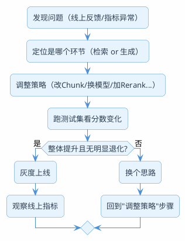

# RAG生产环境踩坑与调优经验

:::tip 实战项目推荐
这篇踩坑经验可以直接对照超级 AI 智能体的完整链路：文档预处理、切片、Embedding、检索、重排序、提示词、评测和观测都能找到对应落点。

项目详细介绍：**[什么是超级 AI 智能体？](/super-agent/overview/project-intro)**
:::

## Demo跑通只用了两天，生产调优花了两个月

第一天，把文档灌进向量库，接上大模型，问了几个问题，回答得还挺像样的——"这也太简单了吧，RAG不过如此"。

两周后，各种奇怪的case开始冒出来：明明知识库里有的内容就是检索不到，检索到了的回答又跑偏，PDF里的表格全变成了乱码……

一个月后你发现，80%的时间都在做脏活累活——处理各种格式的文档、调试检索不准的case、想办法量化到底哪里有问题。真正写"RAG核心逻辑"的代码可能只占整个项目的20%。

这篇文章把这些坑分个类，帮你在开始项目前就有心理预期，也给面试时"你觉得RAG最难的地方在哪"这类问题提供一个有体系的回答思路。

## 第一关：文档预处理——垃圾进垃圾出

RAG链路上最前面的一环，也是工程量最大、最不起眼、最容易被低估的一环。

### 为什么这一步这么烦

因为真实世界的文档格式远比你想象的复杂。在做demo的时候，你可能用的是几篇纯文本的Markdown或者结构清晰的txt文件。但生产环境面对的是：

- 扫描版的PDF（纯图片，连文字都没有，需要OCR）
- 带复杂表格的产品规格书（行列关系解析出来全乱了）
- 双栏甚至三栏排版的学术论文
- PPT导出的PDF（每页的文字位置都不固定）
- Word文档里混着图片和文本框
- 代码文档里的代码块和说明文字交错

每种格式都是一个独立的解析挑战。而且文档质量参差不齐——同一家公司不同部门产出的文档，排版规范可能完全不一样。

### 典型翻车场景

拿表格来说。一份服务器配置清单，原本是整整齐齐的四列：型号、CPU、内存、价格。用常规的PDF文本提取库解析出来，可能变成这样：

```
型号CPU内存价格DL3802颗Xeon 8380128GB¥85000DL3601颗Xeon 4314
64GB¥32000
```

列分隔没了，行分隔也乱了。这样的内容存进向量库，用户问"DL380的价格是多少"，向量检索可能根本匹配不上，因为"DL380"和"¥85000"在文本中紧挨着各种其他信息，语义表示被严重干扰了。

### 应对策略

文档预处理这块没有银弹，只能针对不同格式选择合适的工具组合：

| 文档类型 | 推荐方案 | 注意事项 |
|---------|---------|---------|
| 结构化的PDF（数字原生） | pdfplumber做表格提取 | 先判断PDF是文本型还是扫描型 |
| 扫描版PDF | OCR（Tesseract/PaddleOCR）| 识别率受图片质量影响大 |
| 复杂排版的PDF | Unstructured库 或 多模态模型 | 多模态模型成本高，适合高价值文档 |
| Word/PPT | Apache Tika | Tika的输出质量和文档复杂度成反比 |
| HTML页面 | 清洗HTML标签保留正文 | 注意去掉导航栏、侧边栏等噪音 |
| 代码文件 | 按函数/类做切割 | 保留完整的逻辑单元，不要硬切 |

一个实用的经验：**对高价值的核心文档（公司最重要的产品手册、核心政策文件），值得投入人工校验环节。** 机器解析一遍后，让业务同事抽查几篇，确保关键信息没丢失或变形。这几十篇核心文档的质量对整个系统效果的影响，可能比后面所有的检索优化加起来还大。

## 第二关：检索质量——天花板问题

检索层的质量直接决定了RAG效果的上限。再好的大模型，如果喂给它的参考资料是不相关的，它也很难给出正确答案。

但检索"不准"的原因可能来自好几个不同的环节，排查起来特别麻烦。

### 病因一：Chunk切得不合理

切太大——一个chunk里混了多个主题，向量表示变得模糊，什么问题都沾点边，但什么问题都不是最相关的。

切太小——单个chunk只有一两句话，缺少上下文，向量表示的语义信息不够丰富。用户问"如何配置数据源连接池"，相关的chunk只有一句"设置maxPoolSize=20"，缺少前后文的配置说明。

切割边界不对——一段完整的操作步骤被切成了两个chunk，前一个chunk有步骤1-3，后一个有步骤4-6。用户问"完整的操作步骤是什么"，检索可能只返回了其中一半。

:::info 没有完美的Chunk策略
不同类型的文档适合不同的切割方式。FAQ类的内容按Q&A对切，技术文档按章节切，操作手册按步骤切。如果你的知识库包含多种类型的文档，可能需要为不同类别配置不同的切割策略。
:::

### 病因二：Query和文档之间的语义鸿沟

用户的提问方式和文档的表达方式之间往往有Gap：

- 用户说"登录不上去了怎么办" → 文档里写的是"账号认证异常排查指南"
- 用户说"那个功能怎么开" → 文档里写的是"XX特性启用配置"
- 用户说"能不能便宜点" → 文档里写的是"优惠政策及折扣规则"

这种语义鸿沟导致向量相似度不够高，正确的文档排名靠后甚至没被召回。

应对方式：前面文章讲过的Query改写就是为了解决这个问题。把用户的口语化表述转成和知识库更匹配的书面表达，检索命中率会明显提升。

另一种思路是从文档侧入手：为每个chunk生成几个"假想问题"（Hypothetical Questions），把这些问题也做Embedding存进去。检索时同时匹配chunk本身和它的假想问题，相当于从两端同时缩小语义Gap。

### 病因三：精确词语向量检索搞不定

向量检索理解语义，但对精确匹配天然弱势。

用户搜"KF-550"这个型号，向量检索可能返回"KF-450"、"KF-660"的文档——因为在向量空间里这些型号编码得很接近（都是同类产品的型号）。

类似的还有：版本号（v3.2.1 vs v3.1.0）、订单号、身份证号、专有缩写等。这类查询，BM25关键词检索反而更准。

所以生产环境普遍需要混合检索：向量负责语义理解，BM25负责精确匹配，两路结果通过RRF融合排序。前面的文章已经详细讲过混合检索的做法，这里强调的是——**如果你的知识库中有大量包含型号、编号、版本号的内容，纯向量检索的效果一定会打折，混合检索不是可选项，是必选项。**

## 第三关：效果度量——改了之后到底好没好

前两关是"把事情做好"，第三关是"怎么知道你做好了没"。

RAG系统的一个特点是：改动一个环节可能影响全局效果，而且不一定是朝好的方向影响。你换了一个Embedding模型，大部分问题的检索变好了，但有些边缘case反而变差了。没有系统性的评估手段，你根本发现不了这些退化。

### "感觉还行"的陷阱

很多团队在调优时靠的是手动测试几十个问题，看回答质量"感觉"怎么样。这种方式的问题：

- 样本太少，代表性不够
- 不同人的判断标准不一样
- 无法复现——下次改了策略，你还记得上次这几十个case分别是什么效果吗？
- 容易有confirmation bias——你觉得新策略好，就下意识选了新策略表现好的case来验证

### 建立评估闭环

正确的做法在上一篇文章已经详细讲了，这里总结要点：

1. **准备测试集**——不需要很大，50-100个覆盖主要场景的问题就能看出趋势
2. **分层跑指标**——检索层看Hit@K和MRR，生成层用RAGAs
3. **每次改动都跑一遍**——形成版本化的评估报告，方便对比
4. **关注退化**——改了一个环节后，不只看整体平均分，也要看是否有个别case明显变差



## 各环节的投入产出比参考

如果你刚开始做RAG项目，资源有限，优先投入在哪些环节？根据实际经验排个优先级：

| 优先级 | 环节 | 理由 |
|-------|------|------|
| P0 | 文档预处理做好 | 垃圾进垃圾出，后面再怎么优化都白搭 |
| P0 | 基础评估体系搭起来 | 没有度量就没有进步，优化就变成了瞎调 |
| P1 | Chunk策略调到合理 | 切割质量直接影响检索效果上限 |
| P1 | 混合检索上线 | 对包含精确词语的查询提升非常明显 |
| P2 | Query改写 | 处理口语化表达和多轮对话的指代问题 |
| P2 | Rerank精排 | 在召回已经OK的基础上进一步提升排序准确度 |
| P3 | 知识库动态更新 | 生产必须有，但优先级可以排在效果达标之后 |

P0是"不做就别上线"的级别，P1是"做了效果会有质的飞跃"，P2是"锦上添花但ROI很高"，P3是"生产环境必须有但可以后补"。

## 面试中怎么回答"RAG最难的地方在哪"

这是个开放性问题，考察的是你对RAG工程的系统理解，而不是某个技术细节。好的回答应该：

1. **分层说**——不要东一个西一个列问题，按文档预处理、检索、评估（或者按数据层、算法层、工程层）这样的框架来组织
2. **有深度**——每一层不只说"有问题"，要说清楚为什么会有问题、你遇到过什么具体的case、你怎么解决的
3. **有全局观**——能说出各环节之间的依赖关系（比如"文档处理做不好，后面检索再怎么调都有瓶颈"）
4. **有实战感**——最好能提到"一开始我以为XX，后来发现实际上是YY"这类从踩坑中学到的认知

:::tip 小结
RAG从demo到生产的鸿沟主要体现在三个方面：文档预处理的工程复杂度远超预期（各种格式都是坑），检索质量的调优涉及多个环节排列组合（Chunk/Embedding/Query改写/混合检索/Rerank），效果度量缺乏体系导致优化没有方向感。解决思路是：先把评估体系搭起来，然后按照"文档质量→检索→生成"的链路逐环节排查和优化。记住，80%的RAG效果问题根源在检索层，检索层80%的问题根源在数据质量（文档解析+切割）。
:::
