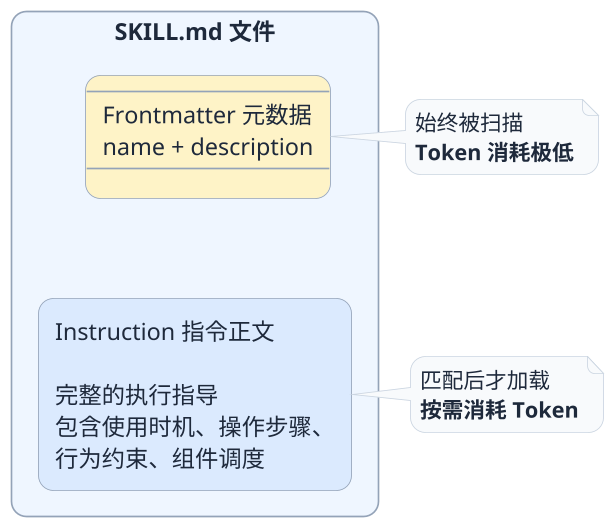
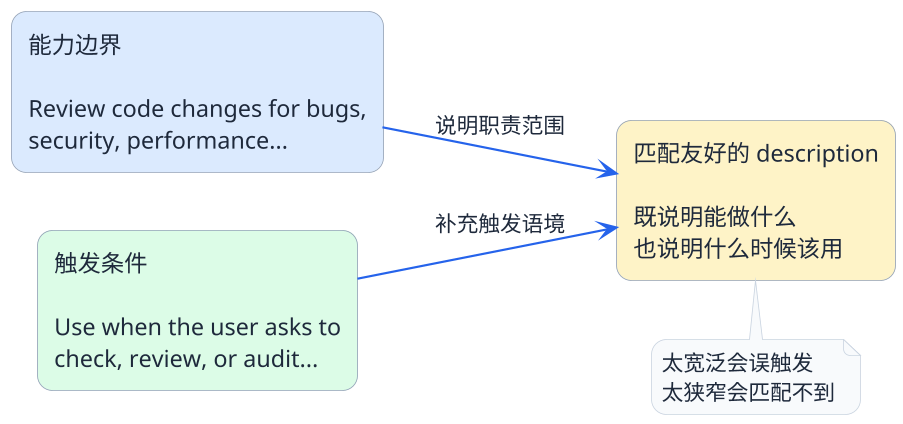
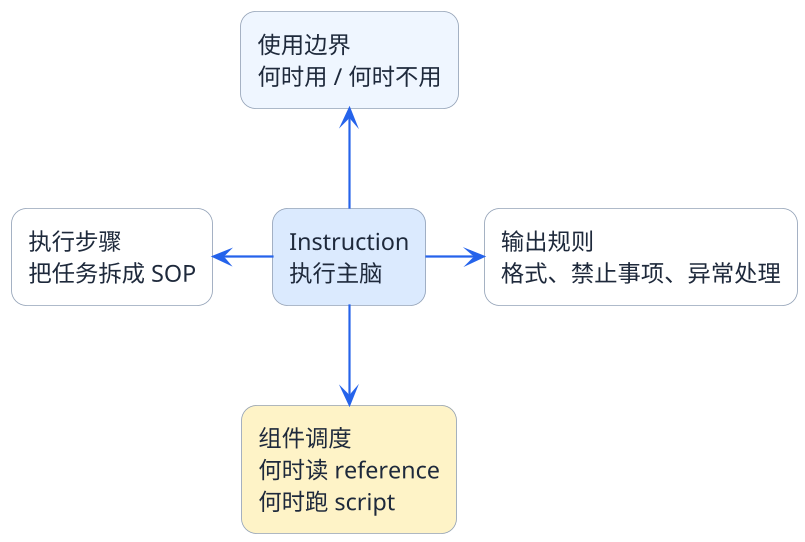

# SKILL.md核心配置深度剖析

:::tip 实战项目推荐
SKILL.md 负责让 Agent 用很低成本识别能力边界。超级 AI 智能体里的动态 Agent 和能力路由场景，适合对照理解技能描述、触发条件和执行资源为什么重要。

项目详细介绍：**[什么是超级 AI 智能体？](/super-agent/overview/project-intro)**
:::

上一篇我们看了整个Skill的目录结构，知道了SKILL.md是唯一的必选文件。但"必选"这两个字背后的分量远不止于此——**一个Skill好不好用，90%取决于SKILL.md写得怎么样**。

你可以把references、scripts想象成一个战士的装备和武器，而SKILL.md就是这个战士的大脑和经验。武器再好，如果脑子不清楚什么时候用什么武器、该用什么战术，战斗力一样上不去。

所以这一篇，我们把SKILL.md掰开揉碎，从结构到写法到踩坑经验，全面覆盖地来梳理一下。

## SKILL.md的两层结构

一个SKILL.md文件，从上到下分成两个截然不同的区域：



这两层之间的分界线就是三个短横线`---`。上面是门面，下面是内功。我们分别来讲。

## Frontmatter：技能的"一句话简历"

### 基本格式

Frontmatter必须放在文件的最开头，用两组`---`包裹：

```yaml
---
name: log-analyzer
description: Analyze application logs to identify errors, performance bottlenecks, and anomalous patterns. Use when the user needs to troubleshoot issues or monitor system health.
---
```

就这么两个字段，name和description。看起来简单到不行，但这恰恰是整个Skill体系中最关键的设计点。

### 为什么只要这么少的信息

我们来换个角度想这个问题。

假设你是一个HR，面前有100份简历，你需要从中筛选出适合"后端开发"岗位的候选人。你会怎么做？

大概率不会每份简历都从头到尾读一遍，而是先快速扫一眼"姓名"和"一句话自我介绍"，不匹配的直接跳过，匹配的再细看。

智能体选择技能的过程跟这一模一样：

1. 扫描所有Skill目录，读取每个SKILL.md的Frontmatter
2. 把所有的name和description列成一个"候选清单"
3. 拿用户的任务去和这个清单做匹配
4. 只有匹配上的技能，才值得花Token去读完整内容

如果一开始就把每个技能的完整指令都加载进来，那还没开始干活，上下文就已经满了。

:::info 一个关于Token的估算
假设你有10个Skill，每个的Instruction平均800 Token。

- 不分层：10 × 800 = 8000 Token，还没干活就先消耗了8000
- 分层加载：10个Frontmatter大约 10 × 40 = 400 Token，只激活需要的那1-2个Skill再加800-1600 Token

**Token消耗从8000降到1200-2000，省了75%以上。**
:::

### name字段怎么写

name是技能的唯一标识符，有几条实战建议：

- **用英文短横线连接的小写单词**：`code-review`、`log-analyzer`、`api-tester`
- **要能望文生义**：看到name就大概知道这技能干什么
- **不要太长**：一般2-3个单词就够了
- **全局唯一**：同一个智能体下不要有两个同名的Skill

好的name示例：

| name | 技能用途 |
|------|---------|
| `code-review` | 代码审查 |
| `sql-optimizer` | SQL查询优化 |
| `api-doc-gen` | API文档生成 |
| `log-analyzer` | 日志分析排障 |
| `test-generator` | 单元测试生成 |

不推荐的name：

| name | 问题 |
|------|------|
| `skill1` | 完全看不出干什么 |
| `handleUserRequestAndGenerateReport` | 太长，像Java方法名 |
| `my_awesome_skill` | 下划线不符合惯例，描述性差 |

### description字段怎么写

description是比name更重要的字段。因为**智能体做技能匹配时，主要靠的就是description**。

一个好的description通常要回答两个问题：

1. **这个技能能做什么**（能力边界）
2. **什么情况下应该用它**（触发条件）

我们来看几个对比：

**反面案例——太笼统：**
```yaml
description: A useful skill for developers.
```
这等于什么都没说。智能体根本不知道该在什么任务上激活它。

**反面案例——太狭窄：**
```yaml
description: Check if Java HashMap usage follows thread-safety best practices.
```
如果用户只是想做一般性的代码审查，这个描述可能就不会被匹配上。

**正面案例——恰到好处：**
```yaml
description: Review code changes for bugs, security vulnerabilities, performance issues, and style violations. Use when the user asks to check, review, or audit code quality in any programming language.
```

这个描述做到了：
- 明确列出了能力范围（bugs、security、performance、style）
- 指出了触发关键词（check、review、audit）
- 不限定具体语言，保持了合理的覆盖面

把这个思路再抽象成一个公式，会更容易记：



:::warning 常见误区
很多人在description里写中文。虽然现在的大模型中英文理解都不错，但**description建议统一用英文**。原因很简单：

1. Anthropic官方规范和示例全是英文
2. 英文在Token效率上通常更优
3. 团队协作和开源共享时通用性更好
:::

## Instruction：技能的"操作手册"

Frontmatter之后的全部内容就是Instruction——智能体真正执行任务时的指导文档。

### Instruction的核心职责

Instruction需要承担四类任务：

**职责一：划清使用边界**

告诉智能体这个技能该用在什么场景，不该用在什么场景。这是防止技能被误用的第一道防线。

```markdown
## When to use
- User explicitly asks for code review or quality check
- User submits a pull request and wants feedback
- User asks "is this code okay" or similar questions

## When NOT to use
- User only wants code explanation without quality assessment
- User is asking for code generation, not review
```

**职责二：定义执行步骤**

把任务拆解成清晰的、可复现的步骤。不要给模型留太多自由发挥的空间。

```markdown
## Review process
1. Identify the target files from user's message
2. Read each file using the read_file tool
3. For each file, check against:
   a. Critical: null pointer risks, resource leaks, SQL injection
   b. Warning: unused variables, overly complex methods
   c. Style: naming conventions, comment quality
4. Run scripts/complexity_check.py on files over 100 lines
5. Compile all findings into a structured report
```

**职责三：约束输出行为**

明确规定输出格式、禁止的行为、异常处理方式等。

```markdown
## Output rules
- Always group issues by severity level
- Each issue must include: file path, line number, issue description, fix suggestion
- If no issues found, explicitly state "No issues detected" instead of making up problems
- Never modify the user's code directly unless explicitly asked
```

**职责四：调度关联组件**

指明什么时候去读reference、什么时候调用script。

```markdown
## Reference usage
- For Java reviews: consult references/java-style-guide.md
- For Python reviews: consult references/python-conventions.md

## Script usage
- Use scripts/complexity_check.py to calculate cyclomatic complexity
- Use scripts/dependency_scan.py to check for known vulnerable dependencies
```

如果你要快速检查一份Instruction是否完整，可以对照下面这张结构图：



### 写好Instruction的五条心法

根据实际使用经验，总结了几条非常实用的原则：

**心法一：像写新员工培训手册一样写**

不要假设智能体"应该知道"某个常识。它每次执行都是从零开始理解你的指令。步骤越具体、越明确，执行的一致性就越高。

**心法二：步骤要可验证**

每个步骤最好都有一个可以检查的产出。比如"分析代码质量"就太模糊了，"用XX工具扫描并生成报告"就好得多。

**心法三：提前处理边界情况**

用户没指定文件怎么办？扫描发现零问题怎么办？脚本执行报错怎么办？这些边界场景在Instruction里预设好处理方式，能大幅减少执行时的意外行为。

**心法四：重的内容放reference**

如果你的Instruction里有大段的规则列表、字段定义、示例模板，考虑把它们移到reference里，Instruction只保留"去查references/xxx.md"这样的引用指令。

**心法五：一个Skill只做一件事**

不要试图在一个Skill里塞下所有功能。一个技能做好代码审查，另一个技能做好测试生成，比一个"万能Skill"要靠谱得多。

### 一个完整的SKILL.md样例

把前面讲的内容综合起来，看一个完整的例子。这是一个日志分析的Skill：

```markdown
---
name: log-analyzer
description: Analyze application logs to identify errors, performance bottlenecks, and anomalous patterns. Use when the user needs to troubleshoot production issues or understand system behavior from log data.
---

# Log Analyzer

## When to use this skill
- User provides log files or log snippets and asks for analysis
- User reports a production issue and wants root cause investigation
- User asks to find patterns or anomalies in system logs

## When NOT to use
- User wants to set up logging configuration (not analysis)
- User is asking about log rotation or storage management

## Analysis workflow
1. Receive log content from the user (file path or pasted text)
2. If file path provided, read using the read_file tool
3. Identify log format (JSON, plain text, CSV, etc.)
4. Run scripts/log_parser.py to extract structured entries
5. Categorize entries by level: ERROR > WARN > INFO
6. For ERROR entries:
   a. Group by error type and count occurrences
   b. Identify the earliest occurrence timestamp
   c. Check if there's a pattern (periodic, burst, etc.)
7. For performance analysis:
   a. Run scripts/latency_stats.py to compute P50/P95/P99
   b. Flag any requests exceeding the threshold
8. Consult references/common-error-patterns.md for known issue matching
9. Generate analysis report

## Output format
- Start with a one-paragraph executive summary
- Follow with detailed findings grouped by category
- Each finding includes: timestamp range, frequency, impact assessment
- End with recommended next steps

## Error handling
- If log format is unrecognized, ask the user to clarify
- If log file exceeds 10000 lines, use scripts/log_sampler.py to sample
- If no significant issues found, report "No anomalies detected" with confidence level
```

## Frontmatter和Instruction的关系总结

最后用一张对比图来收尾：

| 维度 | Frontmatter | Instruction |
|------|------------|-------------|
| **位置** | 文件顶部，`---`包裹 | `---`之后的全部内容 |
| **加载时机** | 始终被扫描（常驻） | 匹配后才加载（按需） |
| **面向对象** | 技能发现和路由决策 | 具体任务的执行指导 |
| **Token消耗** | 极低（通常不到50 Token） | 中等（通常200-1000 Token） |
| **类比** | 一句话简历 | 上岗后的操作手册 |
| **写不好的后果** | 技能永远不会被激活 | 技能虽然被激活但执行质量差 |

两者缺一不可：**Frontmatter负责"被找到"，Instruction负责"干得好"**。

下一篇我们会从整体视角来看，SKILL.md、references、scripts是如何在运行时通过四层渐进式加载机制协作工作的——这是Agent Skills在Token效率上的核心秘密。
