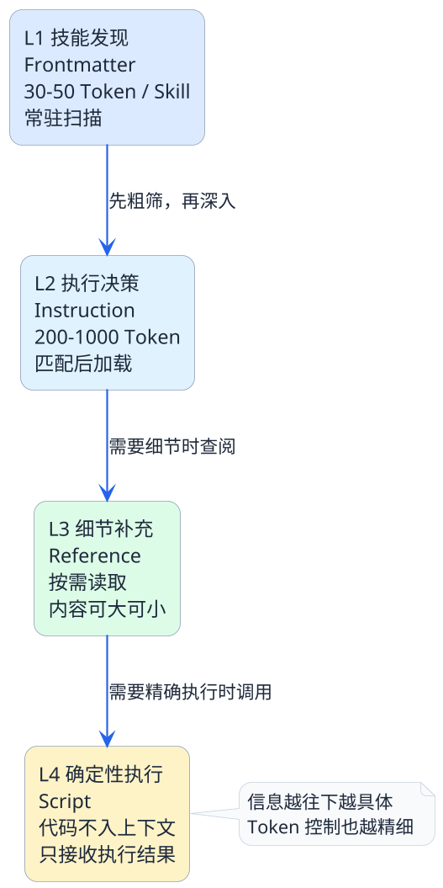
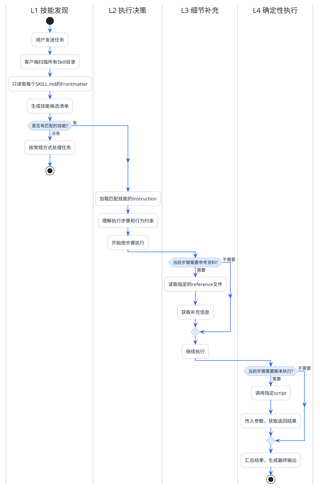

# 四层渐进式加载机制揭秘

去图书馆借书的时候，你不会一进门就把所有书搬到桌上。正常的流程是这样的：

1. **先翻目录卡片**：扫一眼每本书的标题和简介，看哪些跟你今天要查的主题相关
2. **把相关的书借出来**：拿到桌上翻开，按照目录和章节结构去读你需要的部分
3. **遇到不懂的术语再查工具书**：从参考书架上拿来某本字典或百科全书，查到了就放回去
4. **需要复印的交给自助复印机**：你不用理解复印机的工作原理，按个按钮等结果就行

你看，整个过程是**逐步深入、按需获取**的。你不会一口气把图书馆搬空，也不会在查资料之前先通读所有字典。

Agent Skills的四层渐进式加载，就是这个逻辑。

## 什么是渐进式加载

渐进式加载（Progressive Disclosure）这个概念最早来自UI设计领域——不要一开始就把所有选项和功能全摆出来，而是根据用户当前的操作阶段，逐步展示更多细节。

在Agent Skills里，渐进式加载解决的是一个非常具体的工程问题：

:::info 核心问题
**怎么让智能体在需要的时候得到足够的信息，同时在不需要的时候不被多余信息干扰？**

这个问题的本质就是上下文Token的精细化管理。
:::

Agent Skills把信息按照"被需要的迫切程度"划分成四层，每层对应一个独立的加载阶段。我们来一层一层看。



## L1 — 技能发现层：只看门牌号

### 发生了什么

智能体收到用户的任务后，第一件事就是"看看手头有哪些技能可以用"。

这个阶段，客户端（比如Claude Code、Cursor这类工具）会自动扫描所有已安装的Skill目录，但**只读取每个SKILL.md顶部的Frontmatter元数据**——也就是name和description。

```yaml
---
name: log-analyzer
description: Analyze application logs to identify errors and performance bottlenecks.
---
```

就这么两行。智能体拿到的是一份"技能候选清单"，类似于：

| 编号 | 技能名称 | 能力描述 |
|------|---------|---------|
| 1 | code-review | 审查代码质量、安全、风格 |
| 2 | log-analyzer | 分析日志中的错误和性能瓶颈 |
| 3 | sql-optimizer | 优化SQL查询语句 |
| 4 | test-generator | 生成单元测试代码 |

智能体的任务就是看这份清单，判断哪些技能跟用户当前的需求相关。

### 为什么只看这一点

因为这个阶段的目标是**快速筛选，不是深入了解**。

你去餐厅吃饭，服务员递给你菜单，你先看菜名和简介来选菜，不会在点菜阶段就去研究每道菜的烹饪方法吧？

Token角度来看，10个Skill的Frontmatter加起来可能也就300-400个Token。但如果把10个Skill的完整Instruction全加载进来，可能要6000-8000个Token。在L1阶段做好筛选，后面只加载1-2个匹配的Skill，就能省下大量Token。

### L1的关键属性

- **加载内容**：仅Frontmatter（name + description）
- **加载方式**：常驻扫描（Always-On）
- **Token消耗**：极低，每个Skill不到50 Token
- **核心目的**：快速路由——判断哪个技能与当前任务匹配

## L2 — 执行决策层：打开操作手册

### 发生了什么

经过L1筛选后，智能体认定"log-analyzer这个技能跟当前任务匹配"。于是，**SKILL.md中`---`之后的Instruction部分被加载进上下文**。

这时候智能体才真正开始理解：

- 这个技能具体怎么用
- 什么情况下该用、什么情况下不该用
- 执行分几步走
- 过程中需要调用哪些脚本、查阅哪些参考文档

### 为什么不在L1就全部加载

还是拿图书馆的例子：你从目录卡片上选了3本书名看起来相关的，真正拿到书翻开一看，可能只有1本确实对口，另外2本不太匹配就放回去了。

如果一开始就把3本书全读一遍，那浪费的时间就是白白多出来的。

在Agent Skills里也一样——Frontmatter匹配是"粗筛"，有一定误差。所以Instruction的开头通常会明确写"When to use"和"When NOT to use"，让智能体在加载完Instruction后可以做**二次确认**。

### L2的关键属性

- **加载内容**：SKILL.md的Instruction正文
- **加载方式**：按需加载（On-Demand）
- **Token消耗**：中等，通常200-1000 Token
- **核心目的**：理解具体的执行方案和操作步骤

## L3 — 细节补充层：按需查阅参考资料

### 发生了什么

智能体开始按Instruction里的步骤执行任务了。执行到某一步，Instruction告诉它"去查references/common-error-patterns.md"，或者它自己判断需要补充某些细节信息，这时候才会去读取references目录下的对应文件。

关键词是 **"用到才加载，用完就丢弃"**。

### 一个典型的触发场景

```
Instruction里写了：
  第4步：对比日志中的错误码，
         查阅 references/error-code-mapping.md 确认错误类型

→ 智能体执行到第4步时，才去读取 error-code-mapping.md
→ 读完得到需要的信息后，这个reference的内容不会一直占着上下文
```

### 为什么不在L2就把reference一起加载

因为reference的内容量通常比Instruction大得多。一份详细的API文档可能有几百行，一份完整的编码规范可能上千Token。如果每次使用技能都把所有reference全塞进来，Token消耗会飙升，而且其中很多内容对当前这次执行可能根本用不上。

:::note 打个比方
你做一道数学题，身边放着一本数学公式手册。你不会把手册从头到尾背一遍再开始做题，而是**做到需要某个公式的时候，翻到对应那页看一眼**。这就是reference的加载逻辑。
:::

### L3的关键属性

- **加载内容**：references目录下的具体文件
- **加载方式**：条件触发（Context-Triggered）
- **Token消耗**：可高可低，取决于reference文件大小和使用频率
- **核心目的**：为当前执行步骤补充必要的细节知识

## L4 — 确定性执行层：脚本接管关键操作

### 发生了什么

执行到某些步骤时，Instruction指示"调用scripts/latency_stats.py来计算延迟分布"。智能体不需要理解这个脚本的代码逻辑，只需要：

1. 按指令传入参数
2. 触发脚本执行
3. 等待返回结果
4. 用返回的结果继续后面的流程

整个过程中，**脚本的源代码不会进入上下文**。智能体既不需要读脚本代码，也不需要理解它的实现细节。

### 这一层解决什么问题

有些操作天然不适合让大模型来做。比如：

- **复杂数据计算**：算P99延迟、统计错误分布，让模型手算结果可能不准
- **大文件检索**：reference有5000行，让模型直接读不现实，用脚本过滤后只返回匹配的几十行
- **格式转换**：把CSV转JSON、把日志解析成结构化数据，脚本处理更稳定

这些场景的共同特点是：**操作逻辑完全确定，不需要"智能"判断，只需要精确执行**。

### L4的关键属性

- **加载内容**：scripts目录下的脚本（代码不进入上下文，只有执行结果进入）
- **加载方式**：仅执行（Execution-Only）
- **Token消耗**：几乎为零（脚本代码不读取，只接收返回值）
- **核心目的**：用确定性代码保证关键步骤的执行质量

## 四层联动：完整的运行时图景

现在我们把四层放在一起，看一次完整的技能调用过程：



## Token消耗的层级对比

我们用一个具体的数字来感受四层设计带来的优化效果：

| 层级 | 组件 | 加载策略 | 典型Token消耗 | 占比 |
|------|------|---------|-------------|------|
| **L1** | Frontmatter | 常驻扫描 | 30-50 / 每个Skill | 极低（不到1%） |
| **L2** | Instruction | 匹配后加载 | 200-1000 | 中等 (5-15%) |
| **L3** | Reference | 条件触发 | 变化大，可能0也可能很高 | 可控 |
| **L4** | Script | 仅执行 | 接近0（代码不入上下文） | 几乎无 |

:::warning 真正的重点
注意L4这一行——Script的Token消耗接近零。这意味着，**你可以让脚本处理再复杂的数据，智能体的上下文都不会受到影响**。

这是渐进式加载机制中最有工程价值的一个设计点。很多重型计算任务之所以能纳入Skill的处理范围，靠的就是Script在执行层面"吸收"了复杂度，让上下文始终保持轻量。
:::

## 和全量加载做一次正面比较

假设一个项目安装了8个Skill，用户当前只需要用到其中1个，这个Skill的reference比较大：

**全量加载模式（不分层）：**
- 8个Skill的完整内容全部加载
- 预估消耗：8 × (40 + 600 + 300) = **7520 Token**
- 其中7个Skill的信息完全是浪费

**渐进式加载模式（四层分层）：**
- L1：8个Frontmatter = 8 × 40 = **320 Token**
- L2：1个匹配Skill的Instruction = **600 Token**
- L3：执行中需要的1个reference文件 = **300 Token**（假设只用了一部分）
- L4：Script执行 = **0 Token**
- 预估合计：**1220 Token**

:::info 优化效果
从7520降到1220，Token消耗节省了约 **84%**。

而且这还是比较保守的估算。在实际场景中，如果Skill数量更多、reference更大，优化比例还会更高。
:::

## 为什么不能跳层或者合并层

你可能会想：这四层一定要严格分开吗？能不能简化一下，比如L1和L2合成一层？

答案是：**设计上可以合并，但合并就会失去精细控制的能力**。

- **L1和L2合并**：意味着匹配技能时就要加载完整Instruction。如果有10个Skill，Token消耗立刻翻好几倍
- **L2和L3合并**：意味着每次激活技能就要把所有reference也加载进来，哪怕这次根本用不上
- **L3和L4合并**：意味着脚本代码也要被模型阅读和理解，白白浪费Token，而且模型理解代码可能还会产生歧义

四层分离的设计，本质上是对"信息在什么时候被需要"的精确建模。每多一层分离，就多一个控制Token消耗的维度。

## 从更高的视角看这套机制

渐进式加载不只是一个"省Token"的技巧，它代表的是一种工程化的思维方式：

> **不要一次性给出所有信息，而是在正确的时间给出正确的信息量。**

这个原则在很多领域都有体现：
- **懒加载（Lazy Loading）**：前端开发里，图片和组件不一次性全加载，滑到可视区域才加载
- **分级存储**：数据库设计里，热数据放内存、温数据放SSD、冷数据放硬盘
- **信息降噪**：好的产品设计不会在首页堆满所有功能入口

Agent Skills的四层机制，就是把这种"信息分级"的工程思想应用到了智能体的上下文管理上。这也是为什么说Agent Skills不只是Prompt工程的延伸，而是真正的**上下文工程**的实践。

## 本篇要点回顾

1. **四层的划分依据是"信息在什么时刻才真正被需要"**
2. **L1（发现层）** 只加载几十个Token的元数据，用于快速路由
3. **L2（决策层）** 加载完整指令，让智能体理解怎么做
4. **L3（补充层）** 按需读取参考资料，用完即弃
5. **L4（执行层）** 调用脚本但不读取代码，Token零消耗
6. **四层协作下来，Token消耗可以比全量加载降低80%以上**

下一篇我们会深入到Reference和Script这两个组件的实战用法——什么时候该用reference、什么时候该上script、怎样在实际项目中发挥它们的最大价值。
