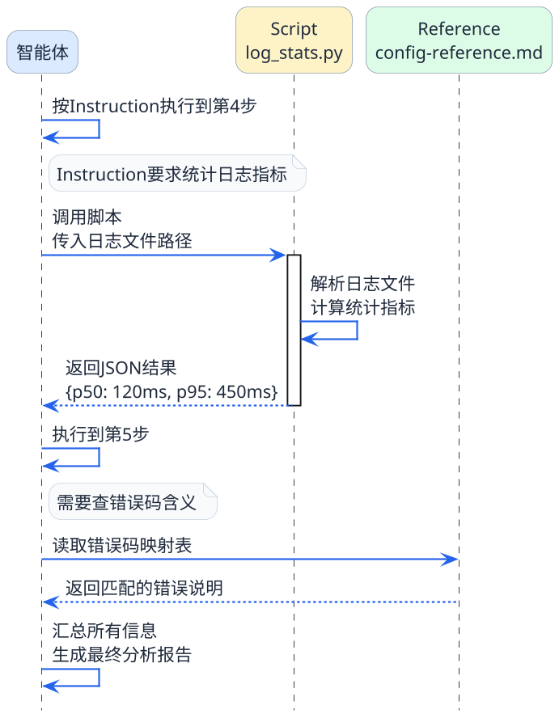
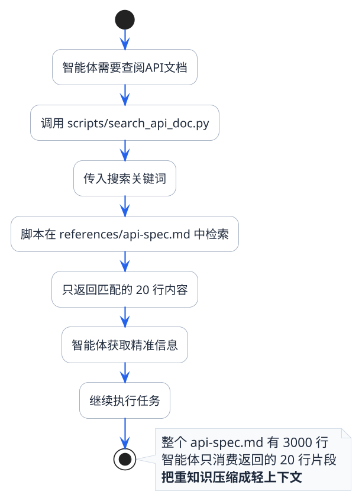
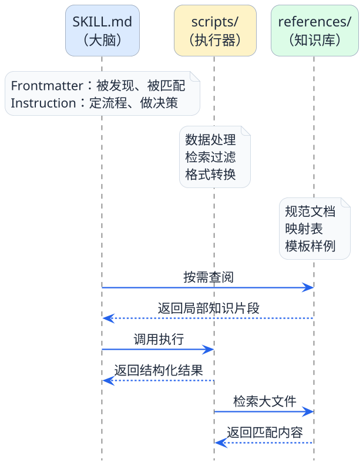

# Reference和Script实战指南

前面几篇我们从整体到局部，已经把Agent Skills的核心框架讲清楚了。但在实际使用中，很多人遇到的困惑集中在两个问题上：

1. **Reference和直接把内容写在Instruction里有什么区别？什么情况下该拆出来？**
2. **Script能做的事情，MCP也能做，到底该用哪个？**

这一篇我们就从实战出发，把这两个组件的使用场景、编写方法和最佳实践讲透。

```plantuml title="什么时候用 Instruction、Reference、Script、MCP" width="100%" align="left"
@startuml
skinparam backgroundColor transparent
skinparam shadowing false
skinparam dpi 160
skinparam defaultFontColor #1E293B
skinparam packageStyle rectangle
skinparam packageBorderColor #CBD5E1
skinparam packageBackgroundColor #F8FAFC
skinparam rectangleBorderColor #94A3B8
skinparam rectangleBackgroundColor #FFFFFF
skinparam rectangleFontColor #1E293B
skinparam noteBorderColor #CBD5E1
skinparam noteBackgroundColor #F8FAFC
skinparam noteFontColor #1E293B
skinparam RoundCorner 18

rectangle "待封装的能力点\n<size:12>先判断它属于哪一类职责</size>" as need #EFF6FF

package "四种放置位置" as board #F8FAFC {
  rectangle "Instruction\n<size:12>什么时候用</size>\n核心流程\n使用边界\n输出规则与步骤" as instruction #DBEAFE
  rectangle "Reference\n<size:12>什么时候用</size>\n大块知识\n按需查阅\n不是每次执行都读" as reference #DCFCE7
  rectangle "Script\n<size:12>什么时候用</size>\n本地确定性执行\n计算 / 转换 / 过滤\n返回结构化结果" as script #FEF3C7
  rectangle "MCP\n<size:12>什么时候用</size>\n共享外部能力\n跨 Skill / 跨项目复用\n连接数据库、搜索、服务" as mcp #FEE2E2
}

need -[hidden]down-> instruction
instruction -[hidden]right-> reference
instruction -[hidden]down-> script
reference -[hidden]down-> mcp
script -[hidden]right-> mcp

note bottom of board
  它们不是互斥关系，而是按职责分层配合。
  一个完整 Skill 往往会同时包含其中两种或三种能力。
end note
@enduml
```

## Reference：智能体的"按需查阅资料库"

### 什么时候该用Reference

最简单的判断标准：**如果某些信息不是每次执行都用得上，但某些情况下又必须要有，就该放reference。**

具体来说，适合放reference的内容有这几类：

| 内容类型 | 具体举例 | 为什么适合放reference |
|---------|---------|---------------------|
| 详细的规范文档 | 编码风格指南、API接口规范 | 内容量大，不是每个步骤都需要 |
| 结构化的映射表 | 错误码对照表、状态机转换表 | 查询时才用，平时不需要加载 |
| 完整的示例模板 | 输出报告模板、代码模板 | 只在生成输出时参考 |
| 外部知识补充 | 第三方框架使用说明、行业术语解释 | 辅助性信息，非核心执行逻辑 |

相反，**不适合放reference的内容**：

- 技能的核心执行步骤（这是Instruction的职责）
- 只有一两句话的简短说明（直接写在Instruction里就行）
- 频繁变动的配置信息（reference更适合相对稳定的文档）

### Reference的文件组织

reference目录下的文件组织没有强制规定，但有一些实践中比较好用的模式：

**模式一：按职能分文件**

```
references/
├── style-guide.md          # 编码风格规范
├── error-code-mapping.md   # 错误码映射
├── output-template.md      # 输出格式模板
└── faq.md                  # 常见问题和处理方式
```

**模式二：按语言或场景分文件**

```
references/
├── java-conventions.md     # Java相关规范
├── python-conventions.md   # Python相关规范
├── go-conventions.md       # Go相关规范
└── general-principles.md   # 通用原则
```

:::info 组织原则
核心思路就是**一个文件解决一类问题**。不要把所有参考资料塞到一个巨大的文件里，也不要拆得太碎导致文件数量爆炸。5-10个reference文件是比较合理的范围。
:::

### 在Instruction中怎么引用Reference

在SKILL.md的Instruction里，需要明确告诉智能体什么时候、去读哪个reference。有两种常见的写法：

**写法一：在步骤中直接指定**

```markdown
## Review steps
1. Read the target source file
2. Check naming conventions against references/style-guide.md
3. Verify error handling against references/error-patterns.md
4. Generate report using the format in references/output-template.md
```

**写法二：按条件触发**

```markdown
## Reference usage
- When reviewing Java code: read references/java-conventions.md
- When reviewing Python code: read references/python-conventions.md
- When encountering unfamiliar error codes: consult references/error-code-mapping.md
```

第二种写法更灵活——智能体不是每次都读所有reference，而是根据实际情况选择性读取。

### Reference编写的实用建议

**建议一：给reference加上清晰的标题和结构**

别写成一大坨纯文本。用Markdown的标题层次组织好，智能体在查阅时能更快定位到需要的部分。

```markdown
# Error Code Mapping

## HTTP 4xx Errors
| Code | Meaning | Recommended Action |
|------|---------|-------------------|
| 400 | Bad Request | Check request body format |
| 401 | Unauthorized | Verify authentication token |
| 403 | Forbidden | Check user permissions |
| 404 | Not Found | Verify resource path |

## HTTP 5xx Errors
| Code | Meaning | Recommended Action |
|------|---------|-------------------|
| 500 | Internal Server Error | Check server logs for stack trace |
| 502 | Bad Gateway | Check upstream service health |
| 503 | Service Unavailable | Check if service is overloaded |
```

**建议二：控制单个文件的大小**

一般建议单个reference文件不超过500行。如果内容确实很多，要么拆成多个文件，要么考虑用script来做检索过滤（这个后面会讲）。

**建议三：包含"怎么用"的简要说明**

在reference文件的开头加一两句话，说明这个文件包含什么、适用于什么场景。方便智能体快速判断是否需要继续读下去。

## Script：关键步骤的"代码兜底"

### Script解决什么问题

一句话概括：**Script负责处理那些不能靠"生成"来完成的操作。**

大模型很擅长理解语义、组织语言、做判断和推理。但有些任务它做不好或者不该做：

- **精确的数值计算**：统计日志中各类错误出现的次数、计算响应时间分位数
- **大数据量的检索过滤**：从几千行的reference文件中精准找到匹配的条目
- **格式化转换**：把非结构化的数据转成特定格式的JSON或XML
- **调用本地工具链**：执行lint检查、运行测试框架、调用编译器

这些操作的共同特征是：**逻辑确定、不需要"智能"判断、要求结果精确可复现**。

### Script长什么样

scripts目录下通常是Python或Shell脚本。一个典型的Python脚本：

```python
#!/usr/bin/env python3
"""
Search configuration reference by keyword.
Usage: python search_config.py <keyword>
Returns matching configuration entries in JSON format.
"""

import sys
import json
import os

def search_config(keyword):
    """Search the config reference file for entries matching the keyword."""
    config_path = os.path.join(
        os.path.dirname(__file__), 
        '..', 'references', 'config-reference.md'
    )
    
    results = []
    current_section = ""
    
    with open(config_path, 'r', encoding='utf-8') as f:
        for line in f:
            if line.startswith('## '):
                current_section = line.strip('# \n')
            elif keyword.lower() in line.lower():
                results.append({
                    "section": current_section,
                    "content": line.strip()
                })
    
    return results

if __name__ == '__main__':
    if len(sys.argv) < 2:
        print(json.dumps({"error": "Please provide a search keyword"}))
        sys.exit(1)
    
    keyword = sys.argv[1]
    matches = search_config(keyword)
    print(json.dumps(matches, ensure_ascii=False, indent=2))
```

注意几个要点：
- **接收参数**：通过命令行参数或标准输入
- **返回JSON**：方便智能体解析结果
- **专注做一件事**：一个脚本解决一个具体问题

### Instruction里怎么调度Script

在SKILL.md的Instruction中，要明确写出什么时候调用哪个脚本、传什么参数：

```markdown
## Script usage

### Searching configuration references
When you need to find specific configuration options:
- Run: `python scripts/search_config.py "<keyword>"`
- The script will return matching entries in JSON format
- Use the results to answer the user's configuration question

### Calculating log statistics
When analyzing log files for performance metrics:
- Run: `python scripts/log_stats.py "<log_file_path>"`
- The script outputs: error_count, warn_count, p50_latency, p95_latency, p99_latency
- Use these numbers in your analysis report
```

### Script的工作流程可视化



注意图中的一个重要细节：**智能体从来没有"打开"过script的代码**。它只是按照Instruction的指示调用脚本、传参、拿结果。脚本内部的代码逻辑完全对智能体透明。

### Script编写的实用建议

**建议一：输入输出要规范**

- 输入：通过命令行参数或stdin
- 输出：统一用JSON格式，方便智能体解析
- 错误：用非零退出码 + JSON格式的错误信息

**建议二：保持脚本的独立性**

尽量不要依赖太多外部库。如果确实需要，在脚本文件开头注明依赖，或者在Skill目录里加一个requirements.txt。

**建议三：加上使用说明**

脚本开头的docstring要写清楚：这个脚本干什么、怎么调用、参数是什么、输出是什么格式。这不光是给人看的，Instruction里引用时也能保持一致。

**建议四：做好异常处理**

脚本执行失败时，要返回有意义的错误信息，而不是直接抛异常。智能体拿到错误信息后才能判断是换个参数重试，还是告诉用户手动处理。

## Script和MCP到底什么区别

这是最常被问到的问题之一。两者看起来都是"智能体调用外部代码来执行操作"，但定位完全不同：

| 对比维度 | Script | MCP |
|---------|--------|-----|
| **归属范围** | 某个特定Skill的内部组件 | 全局的工具服务，不属于任何Skill |
| **关注点** | 技能流程中某个步骤的确定性执行 | 连接外部系统和数据源的标准接口 |
| **生命周期** | 跟随Skill一起安装和卸载 | 独立部署和管理 |
| **可复用性** | 通常只在所属Skill内使用 | 可被任何客户端、任何Skill调用 |
| **通信方式** | 本地脚本直接执行 | 通过MCP协议进行网络通信 |
| **复杂度** | 简单脚本，几十到几百行 | 完整的服务端实现 |

:::note 总结
**MCP是公共基础设施**，就像自来水管道，所有人都能用；**Script是私人工具箱**，只有这个技能自己的流程里会用到。

如果某个能力需要被多个Skill或多个项目共享，用MCP；如果只是当前这个Skill的某个步骤需要用代码来保底，用Script。
:::

举个具体的例子帮助理解：

- **查数据库** → 用MCP。因为查库是通用能力，很多技能和场景都可能用到
- **把查出的数据按特定格式汇总成报表** → 用Script。因为这个汇总格式是当前Skill专属的需求

## 进阶话题：当Reference太大了怎么办

实际项目中经常遇到一个问题：reference文件本身就很大——比如一份完整的REST API文档可能有几千行、十几万字。让智能体直接读取这么大的文件，Token消耗扛不住。

这时候的最佳实践是：**用Script来检索Reference**。

也就是说：
1. 大文件照常放在references目录
2. 在scripts目录写一个搜索脚本
3. Instruction里指示智能体"需要查API文档时，调用scripts/search_api_doc.py"
4. 脚本接收关键词，在大文件里做全文搜索，只返回匹配的片段

这样一来，哪怕reference文件有一万行，智能体每次实际消耗的Token可能只有几十行的量。



:::warning 这个模式非常重要
Script + Reference的组合检索模式，是Agent Skills在处理大规模知识库时的核心手段。如果你的Skill需要关联大量参考资料，务必采用这种方式，否则Token消耗会失控。
:::

## 三个组件的分工总结

最后我们用一个全景视角来总结SKILL.md、Reference、Script三者的分工协作关系：



- **SKILL.md是大脑**：负责被发现、做决策、定流程
- **references是知识库**：需要的时候翻阅，提供信息支撑
- **scripts是执行器**：关键步骤用代码保底，保证结果确定性

三者各司其职，通过Instruction中的指令串联起来，形成一个完整的技能执行链路。

## 本篇要点回顾

1. **Reference适合存放大块的、非每次必用的参考资料**，文件要结构清晰、粒度合理
2. **Script适合处理需要确定性执行的关键步骤**，脚本要输入输出规范、异常处理完善
3. **Script和MCP的区别**：Script是Skill的私有工具，MCP是全局共享的基础设施
4. **大文件要用"Script检索Reference"的组合模式**，这是控制Token消耗的关键手段
5. **Instruction负责串联所有组件**，它是整个技能的调度中枢

到这里，Agent Skills的核心原理和组件设计就讲完了。接下来两篇是实操内容——我们会演示如何在Qoder中安装和使用现成的Skills，以及如何从零开发一个面向Java代码规范的自定义Skill。
